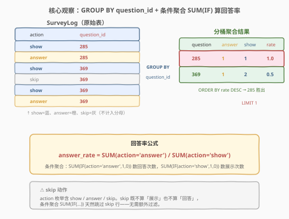
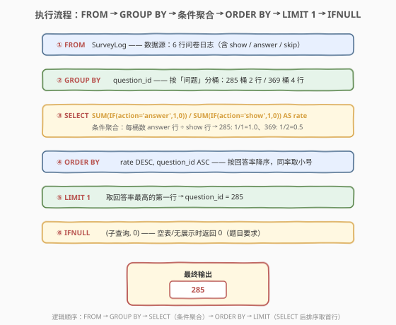
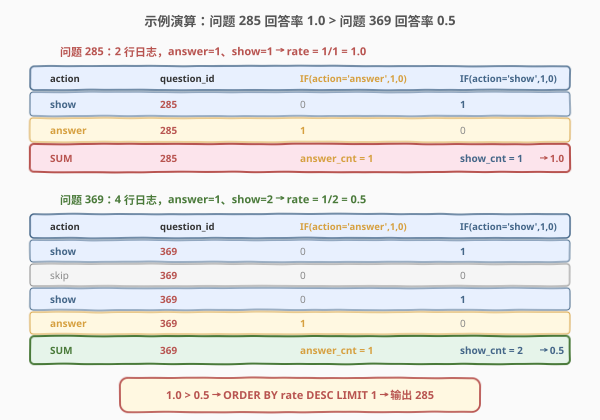

# LeetCode 查询回答率最高的问题 题解

> ⚠️ 本题为 LeetCode **Plus 会员专享题**，非会员无法在平台提交，但题意与解法值得掌握——它是 SQL **条件聚合 + 比率排序取最值**的经典母题，考察 `SUM(IF(...))` 条件计数与 `ORDER BY ... LIMIT 1` 取 Top-1 的组合运用。

## 1. 题目概述

- **标题 / 题号**：查询回答率最高的问题（#578，medium）
- **链接**：https://leetcode.cn/problems/get-highest-answer-rate-question/
- **难度**：中等
- **标签**：SQL、GROUP BY、条件聚合、SUM IF、ORDER BY + LIMIT、比率计算

**题意**：给定 `SurveyLog` 表，每行记录一次问卷日志的 `action`（展示 `show` / 回答 `answer` / 跳过 `skip`）、对应的问题编号 `question_id` 及回答编号 `answer_id` 等。编写 SQL 查询，返回**回答率最高**的 `question_id`。

**回答率定义**：

$$\text{answer\_rate} = \frac{\text{该问题被回答的次数}}{\text{该问题被展示的次数}} = \frac{\#\{\text{action} = \text{'answer'}\}}{\#\{\text{action} = \text{'show'}\}}$$

**表结构**：

```text
Table: SurveyLog
+-------------+---------+
| Column Name | Type    |
+-------------+---------+
| id          | int     |  ← 记录编号
| action      | ENUM    |  ← 'show' / 'answer' / 'skip'
| question_id | int     |  ← 问题编号
| answer_id   | int     |  ← 回答编号（show/skip 时为 null）
| q_num       | int     |  ← 问题序号
| timestamp   | int     |  ← 时间戳
+-------------+---------+
```

> 💡 **关键约束**：`action` 是 ENUM 枚举，取值为 `show`（展示问题）、`answer`（回答问题）或 `skip`（跳过问题）。表可能包含**重复行**。回答率的分母是 `show` 次数，分子是 `answer` 次数——`skip` 既不计入分子也不计入分母。当所有问题的回答率均为 0（或表为空）时，返回 `0`。

**示例 1**：

```text
输入：
SurveyLog 表:
+----+--------+-------------+-----------+-------+-----------+
| id | action | question_id | answer_id | q_num | timestamp |
+----+--------+-------------+-----------+-------+-----------+
| 5  | show   | 285         | null      | 1     | 123       |
| 5  | answer | 285         | 12412     | 1     | 124       |
| 5  | show   | 369         | null      | 0     | 125       |
| 5  | skip   | 369         | null      | 0     | 126       |
| 5  | show   | 369         | null      | 1     | 127       |
| 5  | answer | 369         | 12335     | 1     | 128       |
+----+--------+-------------+-----------+-------+-----------+

输出：
+------------+
| question_id |
+------------+
| 285         |
+------------+
```

**解释**：

- **问题 285**：被展示 1 次、被回答 1 次 → 回答率 $= 1 / 1 = 1.0$。
- **问题 369**：被展示 2 次（第 3、5 行）、被回答 1 次（第 6 行）→ 回答率 $= 1 / 2 = 0.5$。第 4 行 `skip` 不计入。
- $1.0 > 0.5$，故问题 285 回答率最高，输出 `285`。

**约束**：

- 表可能包含重复行。
- 若多个问题回答率相同，取 `question_id` 最小者。
- 若所有回答率均为 0 或表为空，返回 `0`。

> 💡 本题是 SQL **条件聚合求比率 + 排序取最值**的经典题。核心是把「每个问题的回答次数 / 展示次数」翻译成 `GROUP BY question_id` + `SUM(IF(action='answer',1,0))` / `SUM(IF(action='show',1,0))`，再用 `ORDER BY rate DESC, question_id ASC LIMIT 1` 取最高。难点在于「条件计数」——不是简单的 `COUNT(*)`，而是只数满足特定 `action` 值的行。它是 [511. 游戏玩法分析 I](../0501-0600/511_游戏玩法分析I.md) 分组聚合范式的进阶——从「每组取最值」升级为「每组算比率再排序」。

## 2. 解题思路

### 2.1 暴力思路：过程式逐问题统计

最直觉的做法是用程序逐个 `question_id` 处理：遍历所有不同的问题编号，对每个问题扫描全部行，分别数 `action='answer'` 和 `action='show'` 的行数，做除法得到回答率，最后取最大值对应的问题。伪代码如下：

```text
rates = {}
for each qid in DISTINCT(question_id):
    show_cnt  = count(rows where question_id = qid and action = 'show')
    answer_cnt = count(rows where question_id = qid and action = 'answer')
    rates[qid] = answer_cnt / show_cnt if show_cnt > 0 else 0
best = argmax(rates, key=rate, tie_break=min_qid)
return best if best.rate > 0 else 0
```

但**纯 SQL 没有显式循环语句**——上述「按问题分桶、桶内条件计数、算比率、取最大」的模式，在 SQL 里一一对应于 `GROUP BY` + `SUM(IF(...))` + `ORDER BY` + `LIMIT`。

> ⚠️ 关键转换：把「按问题分桶」翻译成 `GROUP BY question_id`（分桶）；「桶内只数 answer 行 / 只数 show 行」翻译成 `SUM(IF(action='answer',1,0))` / `SUM(IF(action='show',1,0))`（条件聚合）；「取比率最高的」翻译成 `ORDER BY rate DESC LIMIT 1`（排序取首行）。这是 511「分组聚合」范式的直接延伸——只是聚合函数从 `MIN` 升级为「条件 `SUM` + 除法」，并多了排序取最值。

### 2.2 核心观察：GROUP BY question_id + 条件聚合 SUM(IF) + 排序取首行



**三步合一**：

1. **`GROUP BY question_id`**：把所有行按问题编号分桶——问题 285 的日志和问题 369 的日志互不干扰。
2. **条件聚合**：每桶内用 `SUM(IF(action='answer',1,0))` 数回答次数、`SUM(IF(action='show',1,0))` 数展示次数，相除得回答率。`skip` 行在两个 `IF` 中都返回 0，天然被跳过。
3. **排序取首行**：`ORDER BY rate DESC, question_id ASC LIMIT 1`——按回答率降序，同率时取 `question_id` 最小者，取第一行即答案。

$$\text{answer\_rate}(q) = \frac{\sum_{r \in \text{bucket}(q)} \mathbb{1}[r.\text{action} = \text{'answer'}]}{\sum_{r \in \text{bucket}(q)} \mathbb{1}[r.\text{action} = \text{'show'}]}$$

> 💡 **为什么用 `SUM(IF(...))` 而非 `COUNT(*)`？** `COUNT(*)` 数的是桶内**所有行**（含 `skip`），无法区分 `action` 类型。`SUM(IF(action='answer',1,0))` 是「条件计数」的经典写法——`IF` 把满足条件的行映射为 1、不满足的映射为 0，`SUM` 累加即得满足条件的行数。等价写法有 `COUNT(IF(action='answer',1,NULL))`（`COUNT` 跳过 NULL）或 `COUNT(*) WHERE ...`（但 `WHERE` 在 `GROUP BY` 前过滤，无法同桶内同时数两种 action）。条件聚合 `SUM(IF(...))` 在一次扫描中同时算多个条件计数，是「分组内多维度统计」的标配。

> ⚠️ **`skip` 动作的处理**：`action` 枚举含 `show`、`answer`、`skip` 三种。`skip` 既不算「展示」也不算「回答」——它不进入分子也不进入分母。`SUM(IF(action='answer',1,0))` 对 `skip` 行返回 0（因 `action='skip' ≠ 'answer'`），`SUM(IF(action='show',1,0))` 同理——两个条件聚合自动跳过 `skip`，无需额外 `WHERE` 过滤。若用 `WHERE action IN ('show','answer')` 预先过滤也能工作，但多一步过滤、且破坏了「一次扫描同时算」的简洁性。

### 2.3 算法流程图



**逻辑执行顺序**：

| 步骤 | 子句 | 作用 |
|------|------|------|
| ① | `FROM SurveyLog` | 读取源表全部行 |
| ② | `GROUP BY question_id` | 按问题编号分桶 |
| ③ | `SUM(IF(action='answer',1,0)) / SUM(IF(action='show',1,0))` | 条件聚合算回答率（`SELECT` 阶段） |
| ④ | `ORDER BY rate DESC, question_id ASC` | 按回答率降序，同率取小号 |
| ⑤ | `LIMIT 1` | 取第一行（回答率最高的问题） |
| ⑥ | `IFNULL(..., 0)` | 空表/无展示时返回 0 |

> 💡 **`ORDER BY` 与 `LIMIT` 在 `SELECT` 之后**：SQL 逻辑执行顺序为 `FROM → WHERE → GROUP BY → HAVING → SELECT → ORDER BY → LIMIT`。`ORDER BY` 可以引用 `SELECT` 中定义的别名 `rate`（因为它在 `SELECT` 之后执行），所以无需子查询包裹——直接在 `ORDER BY` 中用 `rate` 即可。这与 [571. 给定数字的频率查询中位数](../0501-0600/571_给定数字的频率查询中位数.md) 中「窗口函数必须包子查询」不同——窗口函数在 `SELECT` 阶段计算但 `WHERE` 在其之前，而 `ORDER BY` 在 `SELECT` 之后，能直接引用别名。

### 2.4 示例演算

以示例数据为例，6 行日志按 `question_id` 分为两组，观察条件聚合如何逐组算回答率：



**问题 285**（2 行：1 show + 1 answer）：

| action | question_id | IF(action='answer',1,0) | IF(action='show',1,0) |
|--------|-------------|--------------------------|------------------------|
| show   | 285         | 0                        | 1                      |
| answer | 285         | 1                        | 0                      |
| **SUM**| **285**     | **answer_cnt = 1**       | **show_cnt = 1**       |

回答率 $= 1 / 1 = 1.0$。

**问题 369**（4 行：2 show + 1 skip + 1 answer）：

| action | question_id | IF(action='answer',1,0) | IF(action='show',1,0) |
|--------|-------------|--------------------------|------------------------|
| show   | 369         | 0                        | 1                      |
| skip   | 369         | 0                        | 0                      |
| show   | 369         | 0                        | 1                      |
| answer | 369         | 1                        | 0                      |
| **SUM**| **369**     | **answer_cnt = 1**       | **show_cnt = 2**       |

回答率 $= 1 / 2 = 0.5$。

> 💡 **`skip` 行的贡献**：问题 369 的 `skip` 行在两个条件聚合中都返回 0——既不增加 `answer_cnt` 也不增加 `show_cnt`。这就是「条件聚合天然跳过 `skip`」的含义。若误把 `skip` 算入分母（如用 `COUNT(*)`），则 369 的分母变成 4，回答率 $= 1/4 = 0.25$，结果错误。

**排序取首行**：

| question_id | answer_cnt | show_cnt | rate |
|-------------|------------|----------|------|
| 285         | 1          | 1        | 1.0  |
| 369         | 1          | 2        | 0.5  |

`ORDER BY rate DESC` → 285（rate=1.0）排在 369（rate=0.5）之前 → `LIMIT 1` 取 285。

> 💡 **同率时的 tie-breaker**：若两个问题回答率相同（如都是 0.5），`ORDER BY rate DESC, question_id ASC` 确保 `question_id` 小的排在前面。题目要求「回答率最高的」——若有多个最高，取编号最小者。`question_id ASC` 就是这个 tie-breaker。

## 3. 参考代码

### SQL（解法 A：条件聚合 + ORDER BY + LIMIT，推荐）

```sql
SELECT IFNULL(
    (SELECT question_id
     FROM SurveyLog
     GROUP BY question_id
     ORDER BY SUM(IF(action = 'answer', 1, 0)) / SUM(IF(action = 'show', 1, 0)) DESC,
              question_id ASC
     LIMIT 1),
    0
) AS survey_log;
```

> 💡 **写法要点**：
> - `GROUP BY question_id` 按问题编号分桶。
> - `SUM(IF(action='answer',1,0))` 数每桶的回答次数，`SUM(IF(action='show',1,0))` 数展示次数，相除得回答率。`skip` 行在两个 `IF` 中都返回 0，自动跳过。
> - `ORDER BY rate DESC, question_id ASC` 直接在 `ORDER BY` 中写比率表达式（无需 `SELECT` 别名），按回答率降序、同率取小号。
> - `LIMIT 1` 取第一行——回答率最高的问题。
> - 外层 `IFNULL(..., 0)` 处理空表/无展示的边界情况——子查询返回 NULL 时替换为 0。
> - `ORDER BY` 在 `SELECT` 之后执行，可以直接引用聚合表达式，无需子查询包裹。

### SQL（解法 B：子查询先算比率，外层排序取首行）

```sql
SELECT IFNULL(
    (SELECT question_id
     FROM (
         SELECT question_id,
                SUM(IF(action = 'answer', 1, 0)) / SUM(IF(action = 'show', 1, 0)) AS rate
         FROM SurveyLog
         GROUP BY question_id
     ) t
     ORDER BY rate DESC, question_id ASC
     LIMIT 1),
    0
) AS survey_log;
```

> 💡 **写法要点**：
> - 内层子查询先算出每个问题的 `question_id` 和 `rate`，外层再 `ORDER BY rate DESC, question_id ASC LIMIT 1`。
> - 与解法 A 语义等价，区别在于把比率计算显式放在子查询的 `SELECT` 中、赋予别名 `rate`，外层 `ORDER BY` 引用别名而非重复写聚合表达式。
> - 可读性更好（比率有名字），但多一层子查询嵌套。面试中两种写法皆可，解法 A 更简洁。

### SQL（解法 C：COUNT + CASE 条件计数变体）

```sql
SELECT IFNULL(
    (SELECT question_id
     FROM SurveyLog
     GROUP BY question_id
     ORDER BY COUNT(CASE WHEN action = 'answer' THEN 1 END) / COUNT(CASE WHEN action = 'show' THEN 1 END) DESC,
              question_id ASC
     LIMIT 1),
    0
) AS survey_log;
```

> 💡 **`COUNT(CASE WHEN ... THEN 1 END)` 等价 `SUM(IF(...,1,0))`**：`CASE WHEN ... THEN 1 END` 不带 `ELSE` 时，不满足条件的行返回 NULL，`COUNT` 自动跳过 NULL——等价于只数满足条件的行。两种写法语义完全相同，`SUM(IF(...))` 更简洁（MySQL 方言），`COUNT(CASE WHEN ...)` 更标准（跨数据库通用）。面试中首推 `SUM(IF(...))`，若面试官强调跨数据库兼容性则换 `COUNT(CASE WHEN ...)`。

### Python（pandas）

```python
import pandas as pd

def highest_answer_rate(survey_log: pd.DataFrame) -> pd.DataFrame:
    if survey_log.empty:
        return pd.DataFrame({'survey_log': [0]})
    survey_log['is_answer'] = (survey_log['action'] == 'answer').astype(int)
    survey_log['is_show'] = (survey_log['action'] == 'show').astype(int)
    grouped = survey_log.groupby('question_id').agg(
        answer_cnt=('is_answer', 'sum'),
        show_cnt=('is_show', 'sum')
    ).reset_index()
    grouped['rate'] = grouped['answer_cnt'] / grouped['show_cnt']
    grouped = grouped.sort_values(['rate', 'question_id'], ascending=[False, True])
    best = grouped.iloc[0]['question_id'] if not grouped.empty else 0
    return pd.DataFrame({'survey_log': [best]})
```

> 💡 **pandas 对照**：`(action == 'answer').astype(int)` 对应 `IF(action='answer',1,0)`；`groupby('question_id').agg(sum)` 对应 `GROUP BY question_id` + `SUM`；`answer_cnt / show_cnt` 对应比率除法；`sort_values(['rate','question_id'], ascending=[False,True])` 对应 `ORDER BY rate DESC, question_id ASC`；`iloc[0]` 对应 `LIMIT 1`。

## 4. 复杂度分析

| 维度 | 复杂度 | 说明 |
|------|--------|------|
| **时间** | $O(n \log n)$ | $n$ = `SurveyLog` 表行数。`GROUP BY question_id` 需分组：有索引时 $O(n)$，无索引需排序 $O(n \log n)$；组内条件聚合 $O(n)$；`ORDER BY rate DESC` 对 $k$ 个分组结果排序 $O(k \log k)$，$k$ = 不同问题数 $\le n$。整体由分组排序主导 |
| **空间** | $O(n)$ | 分组中间结果集（$k$ 行，每行含 `question_id`、`answer_cnt`、`show_cnt`、`rate`） |
| **结果行数** | $O(1)$ | 单个 `question_id` 值 |

> ⚠️ **`GROUP BY` 的代价取决于 `question_id` 是否有索引**：有索引时可走「索引有序扫描」近似 $O(n)$；无索引则需对全表排序 $O(n \log n)$。`ORDER BY rate DESC, question_id ASC` 只对 $k$ 个分组结果排序，$k \ll n$ 时代价可忽略。面试中说明「`GROUP BY` 需分组 $O(n \log n)$，条件聚合组内 $O(n)$，给 `question_id` 建索引能加速分组」即可。

## 5. 扩展

### 5.1 条件聚合的三种等价写法

「分组内数满足某条件的行」是 SQL 高频操作，有三种等价写法：

| 写法 | 语法 | 特点 |
|------|------|------|
| `SUM(IF(cond,1,0))` | MySQL 方言 | 最简洁，`IF` 是 MySQL 特有函数 |
| `SUM(CASE WHEN cond THEN 1 ELSE 0 END)` | SQL 标准 | 跨数据库通用，略冗长 |
| `COUNT(CASE WHEN cond THEN 1 END)` | SQL 标准 | `COUNT` 跳过 NULL，省 `ELSE 0` |

```sql
-- 写法 1：SUM(IF(...))（MySQL，推荐）
SUM(IF(action = 'answer', 1, 0))

-- 写法 2：SUM(CASE WHEN ...)(标准 SQL)
SUM(CASE WHEN action = 'answer' THEN 1 ELSE 0 END)

-- 写法 3：COUNT(CASE WHEN ...)(标准 SQL，巧妙利用 NULL)
COUNT(CASE WHEN action = 'answer' THEN 1 END)
```

> 💡 **写法 3 的巧妙**：`CASE WHEN ... THEN 1 END` 不写 `ELSE`，不满足条件时返回 NULL。`COUNT` 只统计非 NULL 值，自动跳过不满足条件的行——等价于「只数满足条件的」。省去了 `ELSE 0`，代码更简洁。但可读性略低（需理解 `COUNT` 跳 NULL 的特性），面试中首推写法 1（MySQL 环境）或写法 2（通用环境）。

### 5.2 除以零的处理

当某问题**只被回答但从未被展示**（`show_cnt = 0`）时，`answer_cnt / show_cnt` 会产生除以零错误。不同数据库行为不同：

| 数据库 | 除以零行为 | 处理方式 |
|--------|-----------|----------|
| MySQL | 返回 `NULL` | `IFNULL(rate, 0)` 兜底 |
| PostgreSQL | 报错 | `NULLIF(show_cnt, 0)` 转为 NULL 除法 |
| SQL Server | 报错 | `NULLIF(show_cnt, 0)` 或 `CASE WHEN show_cnt = 0 THEN 0 ELSE ... END` |

```sql
-- 通用安全的比率计算（跨数据库）
SUM(CASE WHEN action = 'answer' THEN 1 ELSE 0 END)
  / NULLIF(SUM(CASE WHEN action = 'show' THEN 1 ELSE 0 END), 0)
```

> 💡 **`NULLIF(x, 0)` 的作用**：当 `x = 0` 时返回 NULL，否则返回 `x`。`y / NULL` 的结果是 NULL（而非报错），再用 `IFNULL` 或 `COALESCE` 把 NULL 替换为 0。这是跨数据库处理除以零的标准范式。本题在 LeetCode 的 MySQL 环境下，`0 / 0` 返回 NULL，`ORDER BY` 中 NULL 被视为最小值排在最后，不影响取最高回答率——但生产环境中应显式处理。

### 5.3 从「取最值」到「算比率排序」的演进

| 题号 | 要求 | 核心范式 |
|------|------|----------|
| [511. 游戏玩法分析 I](../0501-0600/511_游戏玩法分析I.md) | 每玩家**首次登录**日期 | `GROUP BY player_id` + `MIN(event_date)`（分组取最值） |
| [512. 游戏玩法分析 II](../0501-0600/512_游戏玩法分析II.md) | 每玩家首次登录的**设备** | 分组取最值 + 关联取详情 |
| [534. 游戏玩法分析 III](../0501-0600/534_游戏玩法分析III.md) | 每玩家**截至当前**累计和 | `SUM OVER (PARTITION BY ... ORDER BY ...)`（窗口累计） |
| [550. 游戏玩法分析 IV](../0501-0600/550_游戏玩法分析IV.md) | **次日留存率** | 两次分组 + JOIN + 比率 |
| **578** | **回答率最高的问题** | `GROUP BY` + 条件聚合 + 比率排序 + `LIMIT 1` |

> 💡 这一序列展示了 SQL「分组统计」的演进：从「每组取最值」（511）到「每组算累计」（534）到「每组算比率再排序取首行」（578）。本题的独特之处在于**条件聚合**——不是对整组 `COUNT(*)`，而是组内按 `action` 值分别计数，再做除法。这是「分组内多维度统计」的标配技能。

### 5.4 `IFNULL` 与边界情况

题目要求「若最高回答率为 0，返回 0」。有两种边界情况：

| 边界情况 | 子查询结果 | `IFNULL` 行为 | 输出 |
|----------|-----------|--------------|------|
| 表为空 | NULL（无行） | `IFNULL(NULL, 0)` | 0 |
| 所有问题均无展示（`show_cnt=0`） | 比率为 NULL → `ORDER BY` NULL 排最后 → `LIMIT 1` 取到 NULL 行的 `question_id` | 正常返回该 `question_id` | 该 `question_id` |
| 所有问题均有展示但无回答 | 比率均为 0 → `ORDER BY rate DESC` 取比率=0 的首行 | 正常返回 | 该 `question_id` |

> 💡 **`IFNULL` 的精确作用**：它只在子查询**完全无结果**（表为空）时触发，将 NULL 替换为 0。当表非空但所有比率均为 0 时，子查询仍返回一行（`question_id` 最小的那个），`IFNULL` 不介入。题目「最高回答率为 0 时返回 0」更可能是针对空表的边界保护——非空时即便比率为 0，也返回对应的 `question_id`（而非数字 0）。

## 6. 面试要点

1. **为什么用 `SUM(IF(action='answer',1,0))` 而不是 `COUNT(*)`？**

   - `COUNT(*)` 数的是桶内**所有行**（含 `skip`），无法区分 `action` 类型。回答率要求分子只数 `answer` 行、分母只数 `show` 行——必须用条件聚合 `SUM(IF(action='answer',1,0))` 把满足条件的行映射为 1、不满足的映射为 0，`SUM` 累加得条件计数。`skip` 行在两个 `IF` 中都返回 0，自动被跳过，无需额外 `WHERE` 过滤。

2. **`skip` 动作如何处理？需要 `WHERE action IN ('show','answer')` 预过滤吗？**

   - 不需要。`SUM(IF(action='answer',1,0))` 对 `skip` 行返回 0（因 `'skip' ≠ 'answer'`），`SUM(IF(action='show',1,0))` 同理——两个条件聚合天然跳过 `skip`。预过滤 `WHERE action IN ('show','answer')` 也能工作但多一步、且破坏了「一次扫描同时算两个条件计数」的简洁性。条件聚合的优势正是在于**一次扫描同时算多维度统计**。

3. **`ORDER BY` 中可以直接写聚合表达式吗？为什么不需要子查询包裹？**

   - 可以。SQL 逻辑执行顺序为 `FROM → WHERE → GROUP BY → HAVING → SELECT → ORDER BY → LIMIT`。`ORDER BY` 在 `SELECT` 之后执行，可以直接引用 `SELECT` 中定义的别名（如 `rate`）或重复写聚合表达式（如 `SUM(IF(...)) / SUM(IF(...))`）。这与窗口函数不同——窗口函数在 `SELECT` 阶段计算，`WHERE` 在其之前，所以窗口函数 + `WHERE` 筛选必须包子查询（见 [571 题](../0501-0600/571_给定数字的频率查询中位数.md)）。本题只需 `ORDER BY + LIMIT`，不涉及 `WHERE` 筛选聚合结果，无需子查询。

4. **同率时如何保证取 `question_id` 最小者？**

   - `ORDER BY rate DESC, question_id ASC` 的第二排序键 `question_id ASC` 确保同率时小编号排在前面，`LIMIT 1` 取首行即最小 `question_id`。这是 SQL 多键排序的标配——主键降序取最值，次键升序做 tie-breaker。

5. **除以零怎么处理？某问题只被回答但从未被展示怎么办？**

   - MySQL 中 `x / 0` 返回 NULL（不报错），`ORDER BY` 中 NULL 被视为最小值排在最后，不影响取最高回答率。生产环境应显式处理：用 `NULLIF(show_cnt, 0)` 把零分母转为 NULL，再做除法得 NULL，最后 `IFNULL` 或 `COALESCE` 替换为 0。这是跨数据库处理除以零的标准范式。

> 💡 **一句话总结**：578 是 SQL **条件聚合求比率 + 排序取最值**的经典题——核心是 `GROUP BY question_id` + `SUM(IF(action='answer',1,0)) / SUM(IF(action='show',1,0))` 算回答率，`ORDER BY rate DESC, question_id ASC LIMIT 1` 取最高。考点在条件计数 `SUM(IF(...))` 跳过 `skip` 的优雅、`ORDER BY` 可直接引用聚合表达式（无需子查询）、以及除以零/空表的 `IFNULL` 边界保护。

## 同类练习题

| # | 题目 | 与本题的关联 |
|---|------|-------------|
| 511 | [游戏玩法分析 I](https://leetcode.cn/problems/game-play-analysis-i/)（[站内题解](../0501-0600/511_游戏玩法分析I.md)） | `GROUP BY` + `MIN` 的最简母题。本题在其基础上把聚合函数从 `MIN` 升级为条件 `SUM(IF(...))` + 除法，并加 `ORDER BY + LIMIT` 取最值 |
| 550 | [游戏玩法分析 IV](https://leetcode.cn/problems/game-play-analysis-iv/)（[站内题解](../0501-0600/550_游戏玩法分析IV.md)） | 分组 + JOIN + 比率计算（次日留存率），与本题同为「分组算比率」家族，但多了一层自连接判定「次日是否登录」 |
| 262 | [行程和用户](https://leetcode.cn/problems/trips-and-users/)（[站内题解](../0201-0300/262_行程和用户.md)） | `GROUP BY` + 条件聚合 `SUM(IF(status='completed',0,1))` 取消率，Hard 升级版——条件聚合 + 比率 + JOIN 过滤 |
| 571 | [给定数字的频率查询中位数](https://leetcode.cn/problems/find-median-given-frequency-of-numbers/)（[站内题解](../0501-0600/571_给定数字的频率查询中位数.md)） | 窗口函数 + `WHERE` 筛选，对比本题的 `ORDER BY + LIMIT`——同为「分组统计后取特定行」，但 571 需窗口 + 子查询、578 只需排序取首行 |
| 620 | [有趣的电影](https://leetcode.cn/problems/not-boring-movies/) | `WHERE` 条件过滤 + `ORDER BY + LIMIT` 取首行，对照本题的「排序取最值」骨架（无分组版） |
