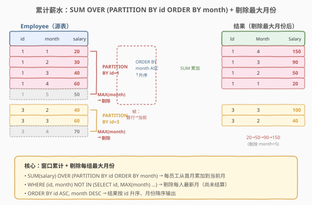
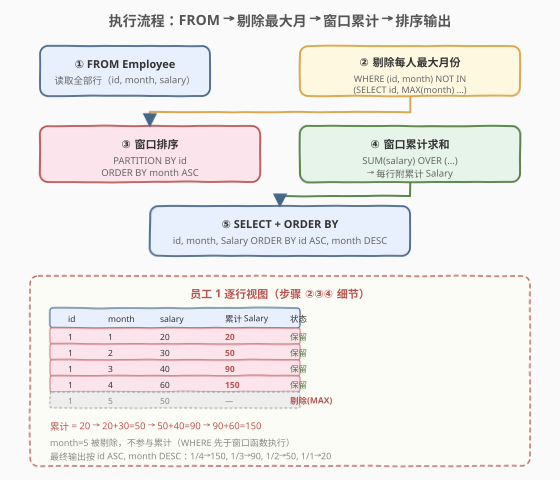
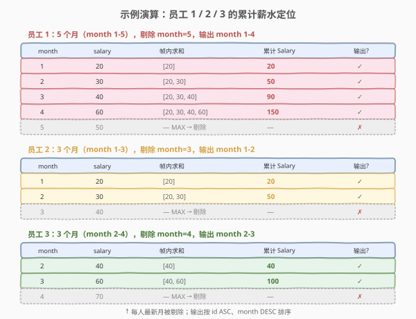

# LeetCode 查询员工的累计薪水 题解

> ⚠️ 本题为 LeetCode **Plus 会员专享题**，非会员无法在平台提交，但题意与解法值得掌握——它是 SQL **窗口累计 + 分组极值剔除**的经典组合题，考察 `SUM() OVER (PARTITION BY ... ORDER BY ...)` 与 `WHERE (id, month) NOT IN (SELECT id, MAX(month) ...)` 的协同运用，承接 [534. 游戏玩法分析 III](../0501-0600/534_游戏玩法分析III.md) 的窗口累计思想并加上「剔除每组最新月」的 twist。

## 1. 题目概述

- **标题 / 题号**：查询员工的累计薪水（#579，hard）
- **链接**：https://leetcode.cn/problems/find-cumulative-salary-of-an-employee/
- **难度**：困难
- **标签**：SQL、窗口函数、SUM OVER、累计求和、PARTITION BY、子查询过滤

**题意**：`Employee` 表记录员工的月薪信息，每行对应一名员工在某个月份的薪水。编写 SQL 查询，统计**每个员工从首月到当前月（含）的累计薪水**，并**剔除每个员工最近一个月**（即 `month` 最大的那一行）。

**表结构**：

```text
Table: Employee
+--------------+---------+
| Column Name  | Type    |
+--------------+---------+
| id           | int     |  ← 主键之一
| month        | int     |  ← 主键之一
| salary       | int     |
+--------------+---------+
```

> 💡 **关键约束**：`(id, month)` 是复合主键——同一员工同一个月不会有两条记录，故每个员工的月份序列严格有序、无并列。题目要的是「每个员工、每个月份上，从首行累加到当前行的薪水总和」，但**最新月（`MAX(month)`）那行不输出**——可以理解为最新月薪尚未「结算」，不计入累计报表。

**示例 1**：

```text
输入：
Employee 表:
+----+-------+--------+
| id | month | salary |
+----+-------+--------+
| 1  | 1     | 20     |
| 1  | 2     | 30     |
| 1  | 3     | 40     |
| 1  | 4     | 60     |
| 1  | 5     | 50     |
| 2  | 1     | 20     |
| 2  | 2     | 30     |
| 2  | 3     | 40     |
| 3  | 2     | 40     |
| 3  | 3     | 60     |
| 3  | 4     | 70     |
+----+-------+--------+

输出：
+----+-------+--------+
| id | month | salary |
+----+-------+--------+
| 1  | 4     | 150    |
| 1  | 3     | 90     |
| 1  | 2     | 50     |
| 1  | 1     | 20     |
| 2  | 2     | 50     |
| 2  | 1     | 20     |
| 3  | 3     | 100    |
| 3  | 2     | 40     |
+----+-------+--------+
```

**解释**：

- **员工 1** 有 5 个月数据，`month=5` 是最新月 → 剔除。剩余 month 1-4 的累计薪水：$20 \to 20{+}30{=}50 \to 50{+}40{=}90 \to 90{+}60{=}150$。
- **员工 2** 有 3 个月数据，`month=3` 是最新月 → 剔除。剩余 month 1-2 的累计薪水：$20 \to 20{+}30{=}50$。
- **员工 3** 有 3 个月数据（month 2-4），`month=4` 是最新月 → 剔除。剩余 month 2-3 的累计薪水：$40 \to 40{+}60{=}100$。
- 输出按 `id` 升序、`month` 降序排列：员工 1 从 month 4 往下到 month 1，依此类推。

**约束**：

- `(id, month)` 是 `Employee` 表的复合主键。
- 结果按 `id` 升序、`month` 降序排列。
- 每个员工的 `MAX(month)` 那一行不输出；若某员工只有一个月数据，则该员工不出现在结果中。

> 💡 本题是 [534. 游戏玩法分析 III](../0501-0600/534_游戏玩法分析III.md)（窗口累计母题）的**进阶版**：534 只需 `SUM OVER (PARTITION BY ... ORDER BY ...)` 一行搞定，而 579 在此基础上加了「剔除每组最新月」的过滤——这就要求理解 SQL 的**逻辑执行顺序**（`WHERE` 先于窗口函数的 `SELECT`），以及如何用**分组极值子查询**配合元组 `IN` 实现精确剔除。

## 2. 解题思路

### 2.1 暴力思路：过程式逐员工累加

最直觉的做法是用过程式语言逐个 `id` 处理：取出该员工所有行按 `month` 排序，跳过 `MAX(month)` 那行，对剩余行维护累加变量逐行求和并输出。伪代码如下：

```text
for each id in DISTINCT(id):
    rows = SELECT * FROM Employee WHERE id = ? ORDER BY month
    max_month = rows[-1].month
    running = 0
    for row in rows:
        if row.month == max_month: continue   # 剔除最新月
        running += row.salary
        emit (id, row.month, running)
```

但**纯 SQL 没有显式循环与变量赋值**——SQL 的思维是「集合 + 声明式聚合」。上述「按员工分桶、桶内排序、累加、剔除最大月」的模式，在 SQL 里可以拆成两个一一对应的语法：**窗口函数 `SUM() OVER (PARTITION BY ... ORDER BY ...)`**（累计）+ **分组极值子查询 `WHERE (id, month) NOT IN (SELECT id, MAX(month) ...)`**（剔除）。

> ⚠️ 关键转换：把「按员工分桶、桶内按月排序、累加到当前行」翻译成 `PARTITION BY id` + `ORDER BY month` + `SUM(salary)`（与 534 完全一致）；把「跳过每人最新月」翻译成 `WHERE (id, month) NOT IN (SELECT id, MAX(month) FROM Employee GROUP BY id)`——用元组 `(id, month)` 匹配每人的 `(id, 最大月)`，命中即剔除。

### 2.2 核心观察：窗口累计 + 分组极值剔除



本题可拆成两个独立子问题，各用一句 SQL 范式解决：

**子问题 A：累计薪水（与 534 同构）**

1. **`PARTITION BY id`**：把所有行按 `id` 分成独立的窗口——员工 1 的累计和员工 3 互不干扰。
2. **`ORDER BY month ASC`**：窗内按月份升序，决定累加方向（从早到晚）。
3. **`SUM(salary)` + 默认帧**：默认帧为 `RANGE BETWEEN UNBOUNDED PRECEDING AND CURRENT ROW`，即「从分区首行到当前行」参与求和。

$$\text{Salary}(e, m) = \sum_{\substack{r \in \text{Employee} \\ r.\text{id} = e \\ r.\text{month} \le m}} r.\text{salary}$$

**子问题 B：剔除每组最新月**

用**分组极值子查询**找到每个员工的 `MAX(month)`，再用元组 `IN` 精确剔除：

```sql
WHERE (id, month) NOT IN (
    SELECT id, MAX(month) FROM Employee GROUP BY id
)
```

> 💡 **为什么用元组 `(id, month) IN`？** 子查询返回的是 `(id, max_month)` 的元组对。外层用 `(id, month) NOT IN (...)` 做元组匹配——只有当某一行的 `id` 和 `month` 同时等于某员工的 `(id, max_month)` 时才命中剔除。这比写 `WHERE month != (SELECT MAX(month) ...)` 更安全（避免跨员工串号），也比 `LEFT JOIN ... IS NULL` 更简洁。

> ⚠️ **执行顺序的精妙**：`WHERE` 在逻辑执行顺序中**先于** `SELECT`（窗口函数所在阶段）。所以「剔除最新月」发生在「窗口累计」**之前**——窗口函数只看到剔除后的行。这是否影响结果？**不影响**——因为累计到 month $m$ 的和本就不含 month $> m$ 的薪水，剔除最大月的那行（它在分区末尾）不影响前面行的累计值。详见第 5.1 节。

### 2.3 算法流程图



**逻辑执行顺序**（`WHERE` 先于窗口函数的 `SELECT`）：

| 步骤 | 子句 | 作用 |
|------|------|------|
| ① | `FROM Employee` | 读取源表全部行 |
| ② | `WHERE (id, month) NOT IN (SELECT id, MAX(month) ...)` | 剔除每个员工的最新月 |
| ③ | `PARTITION BY id` + `ORDER BY month ASC` | 按员工分区，区内按月份排序 |
| ④ | `SUM(salary) OVER (...)` | 每行计算「首行→当前行」的累计和 |
| ⑤ | `SELECT id, month, ... AS Salary` + `ORDER BY id, month DESC` | 输出并排序 |

> 💡 **关键点：`WHERE` 在窗口函数之前执行**。步骤 ② 先把每人的 `MAX(month)` 行删掉，步骤 ③④ 再在剩余行上做窗口累计。由于累计到 month $m$ 的和不含 month $> m$ 的薪水，先删最大月不影响前面行的累计值——结果是正确的。若反过来先算窗口（含最大月）再过滤，结果也一样（见 5.1 节两种写法对比），但先过滤更省一次排序中的末行计算。

### 2.4 示例演算

以示例数据为例，观察三个员工的窗口如何逐行累计、如何剔除最新月：



**员工 1**（5 个月，剔除 `month=5`）：

| month | salary | 帧内求和 | 累计 Salary | 输出? |
|-------|--------|----------|------------|-------|
| 1 | 20 | `[20]` | **20** | ✓ |
| 2 | 30 | `[20, 30]` | **50** | ✓ |
| 3 | 40 | `[20, 30, 40]` | **90** | ✓ |
| 4 | 60 | `[20, 30, 40, 60]` | **150** | ✓ |
| 5 | 50 | — MAX → 剔除 | — | ✗ |

**员工 2**（3 个月，剔除 `month=3`）：

| month | salary | 帧内求和 | 累计 Salary | 输出? |
|-------|--------|----------|------------|-------|
| 1 | 20 | `[20]` | **20** | ✓ |
| 2 | 30 | `[20, 30]` | **50** | ✓ |
| 3 | 40 | — MAX → 剔除 | — | ✗ |

**员工 3**（3 个月 month 2-4，剔除 `month=4`）：

| month | salary | 帧内求和 | 累计 Salary | 输出? |
|-------|--------|----------|------------|-------|
| 2 | 40 | `[40]` | **40** | ✓ |
| 3 | 60 | `[40, 60]` | **100** | ✓ |
| 4 | 70 | — MAX → 剔除 | — | ✗ |

> 💡 **最新月为何被剔除？** 题目设定最新月的薪水尚未「结算」（可能是当月仍在进行中），不计入累计报表。注意员工 3 的月份不连续从 2 开始——累计只对**表中实际存在的行**求和，不补缺失月份。最终输出按 `id ASC, month DESC`：员工 1 输出 `4→150, 3→90, 2→50, 1→20`，员工 2 输出 `2→50, 1→20`，员工 3 输出 `3→100, 2→40`。

## 3. 参考代码

### SQL（解法 A：WHERE 先过滤 + 窗口累计，推荐）

```sql
SELECT id,
       month,
       SUM(salary) OVER (
           PARTITION BY id
           ORDER BY month
       ) AS Salary
FROM Employee
WHERE (id, month) NOT IN (
    SELECT id, MAX(month)
    FROM Employee
    GROUP BY id
)
ORDER BY id ASC, month DESC;
```

> 💡 **写法要点**：
> - `WHERE (id, month) NOT IN (SELECT id, MAX(month) FROM Employee GROUP BY id)` 用元组匹配剔除每人最新月——子查询独立引用源表 `Employee`，`MAX(month)` 在**全部行**上计算（不受外层 WHERE 影响），保证正确找到每人最大月。
> - `SUM(salary) OVER (PARTITION BY id ORDER BY month)` 在过滤后的行上累计——`PARTITION BY id` 分区，`ORDER BY month` 定方向，默认帧从首行累加到当前行。
> - `ORDER BY id ASC, month DESC` 保证结果按 id 升序、月份降序——注意输出列名是 `Salary`（大写 S），与源表 `salary` 区分。
> - **执行顺序**：`WHERE`（步骤 ②）先于 `SELECT` 中的窗口函数（步骤 ④），所以累计在已剔除最新月的行集上进行。

### SQL（解法 B：子查询先算窗口，外层再过滤）

```sql
SELECT id, month, Salary
FROM (
    SELECT id,
           month,
           SUM(salary) OVER (
               PARTITION BY id
               ORDER BY month
           ) AS Salary
    FROM Employee
) t
WHERE (id, month) NOT IN (
    SELECT id, MAX(month)
    FROM Employee
    GROUP BY id
)
ORDER BY id ASC, month DESC;
```

> 💡 **解法 B 的差异**：先在子查询里对**全部行**（含最新月）算窗口累计，再在外层 `WHERE` 剔除最新月。以员工 1 为例，子查询算出 month 1-5 的累计 `20, 50, 90, 150, 200`，外层再删掉 `month=5`（累计 200）。结果与解法 A 完全相同——因为 month 4 的累计 150 只含 month 1-4 的薪水，month 5 的 50 不曾进入。解法 B 多算了一行（最新月的累计）再丢弃，效率略低，但**逻辑更直白**（先算完整累计再删），适合想不清执行顺序时保底。

### SQL（解法 C：自连接，无窗口函数）

```sql
SELECT e1.id,
       e1.month,
       SUM(e2.salary) AS Salary
FROM Employee e1
JOIN Employee e2
  ON e1.id = e2.id AND e2.month <= e1.month
WHERE (e1.id, e1.month) NOT IN (
    SELECT id, MAX(month)
    FROM Employee
    GROUP BY id
)
GROUP BY e1.id, e1.month
ORDER BY e1.id ASC, e1.month DESC;
```

> 💡 **自连接法**（pre-window-function 时代的经典写法）：`JOIN ... ON e2.month <= e1.month` 把每行 `e1` 与同员工所有 `month <= e1.month` 的行 `e2` 配对，`GROUP BY e1.id, e1.month` 后 `SUM(e2.salary)` 即累计。时间复杂度 $O(n^2)$（笛卡尔积配对），数据量大时远逊窗口函数的 $O(n \log n)$。面试中作为「窗口函数普及前的旧写法」提一句即可，主力用解法 A。

### Python（pandas）

```python
import pandas as pd

def find_cumulative_salary(employee: pd.DataFrame) -> pd.DataFrame:
    max_month = employee.groupby('id')['month'].transform('max')
    filtered = employee[employee['month'] != max_month].copy()
    filtered = filtered.sort_values(['id', 'month'])
    filtered['Salary'] = filtered.groupby('id')['salary'].cumsum()
    filtered = filtered.sort_values(['id', 'month'], ascending=[True, False])
    return filtered[['id', 'month', 'Salary']]
```

> 💡 **pandas 对照**：`groupby('id')['month'].transform('max')` 对应子查询 `SELECT id, MAX(month)`——`transform` 把每组最大月广播回每行（不压行），再用布尔索引 `employee['month'] != max_month` 剔除（对应 `WHERE NOT IN`）。`groupby('id')['salary'].cumsum()` 对应 `SUM(salary) OVER (PARTITION BY id ORDER BY month)`。最后 `sort_values(ascending=[True, False])` 对应 `ORDER BY id ASC, month DESC`。

## 4. 复杂度分析

| 维度 | 复杂度 | 说明 |
|------|--------|------|
| **时间（解法 A/B）** | $O(n \log n)$ | $n$ = `Employee` 行数。窗口函数按 `(id, month)` 排序 $O(n \log n)$；分组极值子查询 `GROUP BY id` + `MAX` 为 $O(n)$；排序后单次扫描累计 $O(n)$。`(id, month)` 是主键即聚簇索引，MySQL 可利用索引有序性逼近 $O(n)$ |
| **时间（解法 C）** | $O(n^2)$ | 自连接最坏产生 $O(n^2)$ 对配对（每员工行数 $m$ 则配对 $O(m^2)$），不适合大数据量 |
| **空间** | $O(n)$ | 子查询/窗口函数需物化排序后的中间结果；解法 B 的子查询结果含全部行（含最新月） |
| **结果行数** | $O(n - k)$ | $k$ = 不同员工数。每个员工剔除 1 行（最新月），总输出约 $n - k$ 行 |

> ⚠️ 窗口函数的代价主要由**排序**决定：`PARTITION BY id ORDER BY month` 等价于按 `(id, month)` 排序，整体 $O(n \log n)$。由于 `(id, month)` 是主键（聚簇索引），数据已按此有序，MySQL 可能直接利用索引避免额外排序，接近 $O(n)$。面试中说明「窗口函数需排序 $O(n \log n)$，主键索引可加速」即可。

## 5. 扩展

### 5.1 先过滤 vs 先窗口：执行顺序对结果的影响


解法 A（`WHERE` 先过滤再窗口）和解法 B（子查询先窗口再过滤）结果**完全一致**，但执行路径不同：

| 维度 | 解法 A（先过滤） | 解法 B（先窗口） |
|------|------------------|------------------|
| 执行顺序 | `WHERE` → 窗口 `SUM` | 窗口 `SUM` → 外层 `WHERE` |
| 窗口看到的数据 | 剔除最新月后的 $n - k$ 行 | 全部 $n$ 行 |
| 最新月是否计算累计 | 否（已被 WHERE 删掉） | 是（算了再丢弃） |
| 结果 | 相同 | 相同 |
| 效率 | 略优（少算 $k$ 行的累计） | 略劣（多算 $k$ 行再丢） |

> 💡 **为什么结果相同？** 累计到 month $m$ 的和 $= \sum_{\text{month} \le m} \text{salary}$，只含月份 $\le m$ 的行。最新月 $m_{\max}$ 的行在分区末尾，不影响任何 month $< m_{\max}$ 行的累计值。所以无论先删后算（A）还是先算后删（B），前面行的累计都一样——被删的只是末行自身的累计值。**关键洞察：窗口累计的「帧」只向左（更小的 month）扩展，末行删除不影响左侧。**

### 5.2 从 534 到 579：窗口累计的进阶

| 题号 | 要求 | 核心范式 |
|------|------|----------|
| [534](../0501-0600/534_游戏玩法分析III.md) | 每人**截至每天的累计局数** | `SUM OVER (PARTITION BY ... ORDER BY ...)`（纯窗口累计，一行搞定） |
| **579** | 每人**截至每月的累计薪水** + 剔除最新月 | `SUM OVER` + `WHERE (id, month) NOT IN (SELECT id, MAX(month) ...)`（窗口累计 + 分组极值剔除） |
| [569](../0501-0600/569_员工薪水中位数.md) | 每公司**中位数** | `ROW_NUMBER + COUNT OVER` + `WHERE rn BETWEEN ...`（窗口排名 + 区间筛选） |

> 💡 534 是窗口累计的**最小母题**——一行 `SUM OVER` 即可。579 在此基础上加了一层「剔除每组极值」的过滤，考察对 SQL 逻辑执行顺序（`WHERE` 先于 `SELECT`）和分组极值子查询的理解。569 则是另一个方向的窗口进阶——用 `ROW_NUMBER` 定位中间行。三题合在一起，覆盖了窗口函数「累计 / 排名 / 极值剔除」三大经典场景。

### 5.3 分组极值剔除的通用范式

「剔除每组的某条特定行」是 SQL 高频模式，本题是「剔除每组 `MAX(month)`」。通用范式：

```sql
-- 范式：剔除每组满足某条件的行
WHERE (分组键, 排序键) NOT IN (
    SELECT 分组键, 极值函数(排序键)
    FROM 表
    GROUP BY 分组键
)
```

变体：

| 需求 | 子查询 | 外层条件 |
|------|--------|----------|
| 剔除每人最新月 | `SELECT id, MAX(month) ... GROUP BY id` | `(id, month) NOT IN (...)` |
| 只保留每人首月 | `SELECT id, MIN(month) ... GROUP BY id` | `(id, month) IN (...)` |
| 剔除全局最高薪 | `SELECT MAX(salary) FROM Employee` | `salary NOT IN (...)`（无分组键） |

> 💡 **元组 `IN` vs 标量 `IN`**：当剔除条件涉及「分组键 + 极值」两列时，必须用**元组 `IN`**——`(id, month) IN (SELECT id, MAX(month) ...)` 同时匹配两列。若只写 `month NOT IN (SELECT MAX(month) ...)` 会误删所有 month 等于某员工最大月的行（跨员工串号），例如员工 1 的最大月 5 和员工 2 的最大月 3 不同，但若员工 3 恰好有 month=5，标量 `IN` 会误删员工 3 的 month=5 行。

## 6. 面试要点

1. **为什么不能直接 `SUM OVER` 然后输出全部行？**

   - `SUM(salary) OVER (PARTITION BY id ORDER BY month)` 会给**所有行**（含最新月）计算累计，输出 $n$ 行。但题目要求剔除每个员工的最新月——最新月的薪水尚未结算，不应出现在累计报表中。所以必须在窗口之外加 `WHERE (id, month) NOT IN (SELECT id, MAX(month) ...)` 过滤掉每人 `MAX(month)` 那行，输出 $n - k$ 行（$k$ = 员工数）。

2. **`WHERE` 和窗口函数 `SELECT` 的执行顺序是什么？为什么先过滤不影响累计结果？**

   - SQL 逻辑执行顺序为 `FROM → WHERE → GROUP BY → HAVING → SELECT → ORDER BY`。`WHERE` 先于 `SELECT`（窗口函数所在阶段）执行，所以「剔除最新月」发生在「窗口累计」之前。这**不影响结果**——因为累计到 month $m$ 的和只含月份 $\le m$ 的行，最新月 $m_{\max}$ 在分区末尾，删除它不影响任何 month $< m_{\max}$ 行的累计值（窗口帧只向左扩展）。详见第 5.1 节。

3. **为什么用元组 `(id, month) NOT IN` 而不是标量 `month NOT IN`？**

   - 每个员工的最大月不同（员工 1 是 month=5，员工 2 是 month=3，员工 3 是 month=4）。元组 `(id, month) IN (SELECT id, MAX(month) ...)` 同时匹配 `id` 和 `month` 两列——只有当某行的 `id` 和 `month` 同时等于该员工的 `(id, 最大月)` 时才命中。若用标量 `month NOT IN (SELECT MAX(month) ...)`，会得到 `{3, 4, 5}` 的月份集合，误删所有 month ∈ {3,4,5} 的行（跨员工串号），例如员工 1 的 month=3 会被误删（其实只有员工 2 的 month=3 该删）。

4. **解法 A（先过滤）和解法 B（先窗口）哪个更好？**

   - 结果完全相同。解法 A（`WHERE` 先过滤再窗口）效率略优——窗口函数只在 $n - k$ 行上排序和累计，少算 $k$ 行（最新月的累计）。解法 B（子查询先算全部行的窗口，外层再过滤）逻辑更直白——先算完整累计再删末行，适合想不清执行顺序时保底。面试中先写解法 A（高效 + 体现对执行顺序的理解），再提解法 B（展示两种路径等价性）。

5. **复合主键 `(id, month)` 对本题有什么影响？**

   - 它保证同一员工同月不会有两条记录，故每个员工分区内 `month` 严格有序、无并列——`ROWS`/`RANGE` 帧等价、`ORDER BY month` 给出确定的累加顺序。主键在 MySQL 中是聚簇索引，窗口函数的 `PARTITION BY id ORDER BY month` 排序可利用索引有序性，接近 $O(n)$。此外，`(id, month)` 作为元组可直接用于 `IN` 匹配，无需额外构造唯一标识。

> 💡 **一句话总结**：579 是 534 窗口累计的进阶版——核心仍是 `SUM(salary) OVER (PARTITION BY id ORDER BY month)` 算累计，额外加 `WHERE (id, month) NOT IN (SELECT id, MAX(month) FROM Employee GROUP BY id)` 剔除每人最新月。考点在于理解 `WHERE` 先于窗口函数执行、且先删末行不影响左侧累计值，以及用元组 `IN` 实现精确的分组极值剔除。

## 同类练习题

| # | 题目 | 与本题的关联 |
|---|------|-------------|
| 534 | [游戏玩法分析 III](https://leetcode.cn/problems/game-play-analysis-iii/)（[题解](../0501-0600/534_游戏玩法分析III.md)） | 窗口累计母题——`SUM OVER (PARTITION BY ... ORDER BY ...)` 一行搞定，579 在此基础上加「剔除最新月」 |
| 569 | [员工薪水中位数](https://leetcode.cn/problems/median-employee-salary/)（[题解](../0501-0600/569_员工薪水中位数.md)） | `ROW_NUMBER + COUNT OVER` 定位每组中位行，与 579 同为窗口函数 + 筛选的招牌题，对照「排名筛选」与「累计 + 极值剔除」 |
| 550 | [游戏玩法分析 IV](https://leetcode.cn/problems/game-play-analysis-iv/)（[题解](../0501-0600/550_游戏玩法分析IV.md)） | 511 首登日期 + JOIN 判断次日登录，留存率统计，与 579 同属 Employee/Activity 系列的窗口进阶 |
| 180 | [连续出现的数字](https://leetcode.cn/problems/consecutive-numbers/) | `LAG` 窗口函数判连续，另一类「跨行」窗口应用，对照 579 的累计型 |
| 262 | [行程和用户](../0201-0300/262_行程和用户.md) | `GROUP BY` + 条件聚合的 Hard 升级版，对照「分组压行」与 579「窗口留行 + 极值剔除」两种聚合范式 |
