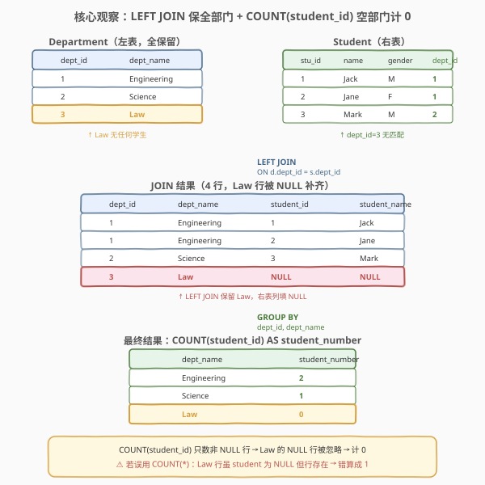
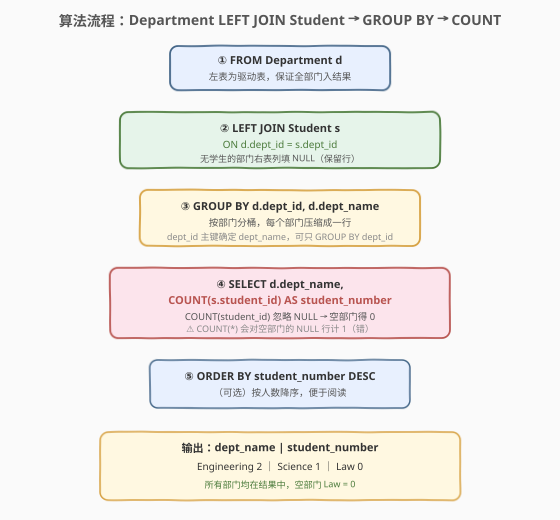
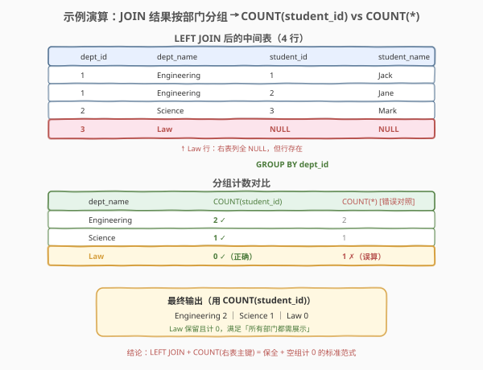

# LeetCode 统计各专业学生人数 题解

> ⚠️ 本题为 LeetCode **Plus 会员专享题**，非会员无法在平台提交，但题意与解法值得掌握——它是 SQL **LEFT JOIN 保全 + 分组计数**的经典母题，考点在「空部门如何计 0」。

## 1. 题目概述

- **标题 / 题号**：统计各专业学生人数（#580，medium）
- **链接**：https://leetcode.cn/problems/count-student-number-in-departments/
- **难度**：中等
- **标签**：SQL、LEFT JOIN、GROUP BY、COUNT、多表关联、空组保留

**题意**：给定 `Department` 表（专业，含 `dept_id` 与 `dept_name`）与 `Student` 表（学生，含 `student_id`、`student_name`、`gender` 及所属 `dept_id`）。编写 SQL 查询，统计**每个专业的学生人数**，输出 `dept_name` 与 `student_number` 两列。

⚠️ **关键要求**：即使某个专业**没有任何学生**，也必须出现在结果中（`student_number` 记为 0）。结果可按任意顺序返回（常见写法按 `student_number` 降序便于阅读）。

**表结构**：

```text
Table: Department
+-------------+---------+
| Column Name | Type    |
+-------------+---------+
| dept_id     | int     |  ← 主键
| dept_name   | varchar |
+-------------+---------+

Table: Student
+-------------+---------+
| Column Name | Type    |
+-------------+---------+
| student_id  | int     |  ← 主键
| student_name| varchar |
| gender      | varchar |
| dept_id     | int     |  ← 外键 → Department.dept_id
+-------------+---------+
```

> 💡 **关键约束**：`Department.dept_id` 与 `Student.student_id` 均为主键；`Student.dept_id` 是指向 `Department.dept_id` 的外键——一个专业**有多名**学生（一对多）。但**并非所有专业都有学生**（如示例中的 Law），这正是本题的坑点：若用 `INNER JOIN`，无学生的专业会被丢掉；必须用 `LEFT JOIN` 把 `Department` 作为左表全保留。

**示例 1**：

```text
输入：
Department 表
+---------+-------------+
| dept_id | dept_name   |
+---------+-------------+
| 1       | Engineering |
| 2       | Science     |
| 3       | Law         |
+---------+-------------+
Student 表
+------------+--------------+--------+---------+
| student_id | student_name | gender | dept_id |
+------------+--------------+--------+---------+
| 1          | Jack         | M      | 1       |
| 2          | Jane         | F      | 1       |
| 3          | Mark         | M      | 2       |
+------------+--------------+--------+---------+
输出：
+-------------+----------------+
| dept_name   | student_number |
+-------------+----------------+
| Engineering | 2              |
| Science     | 1              |
| Law         | 0              |
+-------------+----------------+
解释：Engineering 有 2 名学生（Jack、Jane）；Science 有 1 名（Mark）；
      Law 没有任何学生，但仍要出现在结果中，student_number = 0。
```

**约束**：

- `dept_id` 是 `Department` 表的主键，`student_id` 是 `Student` 表的主键
- `Student.dept_id` 是指向 `Department.dept_id` 的外键，可为 NULL（学生未分配专业）但不会指向不存在的专业
- 结果需包含**所有专业**，无学生的专业 `student_number = 0`
- 结果可按任意顺序返回

> 💡 本题是 SQL **多表关联 + 分组计数**的经典题。骨架与 [511. 游戏玩法分析 I](../0501-0600/511_游戏玩法分析I.md) 的 `GROUP BY + MIN` 同源，只是把单表聚合升级为「先 JOIN 再聚合」，并多了一道「保全 + 空组计 0」的考点。它是 [184. 部门工资最高的员工](../0101-0200/184_部门工资最高的员工.md) `Department JOIN Employee` 结构的计数变体——184 取每组最值，580 取每组计数。

## 2. 解题思路

### 2.1 暴力思路：过程式逐专业数学生

最直觉的做法是用程序逐个 `dept_id` 处理：遍历 `Department` 的每个专业，到 `Student` 表里数 `dept_id = 该值` 的行数，无论数到几（包括 0）都输出一条。伪代码如下：

```text
for each dept in Department:
    cnt = SELECT COUNT(*) FROM Student WHERE dept_id = dept.dept_id
    emit (dept.dept_name, cnt)
```

但**纯 SQL 没有显式循环语句**——上述「按专业分桶、桶内计数、空桶也要留」的模式，在 SQL 里一一对应于 `LEFT JOIN`（保留所有专业）+ `GROUP BY`（分桶）+ `COUNT`（计数）。

> ⚠️ 关键转换：把「外层遍历 Department、内层对每个专业数 Student」翻译成 `Department LEFT JOIN Student ON dept_id`（左表全保留，无匹配填 NULL）+ `GROUP BY dept_id, dept_name`（分桶）+ `COUNT(student_id)`（数非 NULL 的学生行）。难点不在聚合，而在「空专业怎么不被丢」与「空专业怎么计 0」。

### 2.2 核心观察：LEFT JOIN 保全 + COUNT(student_id) 空组计 0



**两道关卡**：

1. **保全（LEFT JOIN）**：以 `Department` 为左表做 `LEFT JOIN Student ON d.dept_id = s.dept_id`。无学生的 `Law` 专业在结果里仍占一行，右表列（`student_id`、`student_name`）全部填 `NULL`。若误用 `INNER JOIN`，Law 会被直接丢弃。

2. **空组计 0（COUNT(student_id)）**：JOIN 后按 `dept_id, dept_name` 分组，每组用 `COUNT(s.student_id)` 数学生数。`COUNT(col)` **只统计 `col` 非 NULL 的行**——Law 组那一行的 `student_id` 是 NULL，被忽略，故计数为 0；而 Engineering 组两行 `student_id` 都非 NULL，计数为 2。

$$\text{student\_number}(d) = \#\{\, s \in \text{Student} : s.\text{dept\_id} = d.\text{dept\_id} \,\}$$

> 💡 **为什么用 `COUNT(s.student_id)` 而非 `COUNT(*)`？** `LEFT JOIN` 对无学生的 Law 产生了一行「`dept=Law` + `student 各列 NULL`」——这一行**确实存在**（不是零行），所以 `COUNT(*)` 会把它数成 1，**错算 Law 有 1 名学生**。而 `COUNT(s.student_id)` 只数 `student_id` 非 NULL 的行，Law 行的 `student_id` 是 NULL 被跳过，正确得 0。这是本题最核心的细节，第 5 节会详述三种 `COUNT` 写法与 NULL 的关系。

> ⚠️ **别 JOIN 反方向**：必须 `Department LEFT JOIN Student`（部门在左），让部门全保留。若写成 `Student LEFT JOIN Department`，则保留的是所有学生，无学生的部门依旧丢失——方向反了等于 `INNER JOIN`（在部门一侧）。记忆口诀：**「谁要全保留，谁就放左边」**。

### 2.3 算法流程图



整个查询的逻辑执行顺序如下：

| 阶段 | 子句 | 作用 |
|------|------|------|
| ① | `FROM Department d` | 确定左表（驱动表），保证所有专业入结果 |
| ② | `LEFT JOIN Student s ON d.dept_id = s.dept_id` | 关联学生，无匹配行右表列填 NULL（保留专业行） |
| ③ | `GROUP BY d.dept_id, d.dept_name` | 按专业分桶，每专业压缩成一行 |
| ④ | `SELECT d.dept_name, COUNT(s.student_id) AS student_number` | 取专业名 + 数非 NULL 学生行（空组得 0） |
| ⑤ | `ORDER BY student_number DESC`（可选） | 按人数降序便于阅读 |

> 💡 **逻辑执行顺序**：`FROM → JOIN → WHERE → GROUP BY → HAVING → SELECT → ORDER BY`。`LEFT JOIN` 在 `FROM` 阶段完成（生成中间表），`GROUP BY` 在其上分桶，`COUNT` 在 `SELECT` 阶段对每桶求值。本题无需 `WHERE`/`HAVING`——不筛学生行（要数全部），也不筛专业组（全保留）。`ORDER BY` 是可选的展示层修饰。

### 2.4 示例演算



以示例数据走一遍 `Department LEFT JOIN Student`：

**JOIN 后中间表（4 行）**：

| dept_id | dept_name | student_id | student_name |
|---------|-----------|------------|--------------|
| 1 | Engineering | 1 | Jack |
| 1 | Engineering | 2 | Jane |
| 2 | Science | 3 | Mark |
| 3 | **Law** | **NULL** | **NULL** |

> Law 在 `Student` 表无匹配，`LEFT JOIN` 保留该专业行，右表列填 NULL。

**按 `dept_id` 分组计数**：

| dept_name | 桶内 student_id | COUNT(student_id) | COUNT(*) [错误对照] | 判定 |
|-----------|------------------|---------------------|----------------------|------|
| Engineering | 1, 2 | **2** | 2 | ✓ 两者一致 |
| Science | 3 | **1** | 1 | ✓ 两者一致 |
| Law | NULL | **0** ✓ 正确 | 1 ✗ 误算 | ⚠️ 差异点 |

`COUNT(student_id)` 在 Law 组忽略 NULL 行得 0（正确）；`COUNT(*)` 把 NULL 行也算 1（错误）。最终输出 `Engineering 2 ｜ Science 1 ｜ Law 0`。

> 💡 **为什么只有 Law 出问题？** 因为只有 Law 是「无学生」的空组——只有空组才会产生 NULL 行，才会在 `COUNT(*)` 与 `COUNT(student_id)` 之间产生分歧。有学生的组两者数值一致。所以「空组保留」是本题的考点触发条件：只要题目要求「无 X 的也要显示」，就要警惕 `LEFT JOIN` + `COUNT(右表列)` 这套组合。

## 3. 参考代码

### SQL（解法 A：LEFT JOIN + GROUP BY + COUNT，推荐）

```sql
SELECT d.dept_name,
       COUNT(s.student_id) AS student_number
FROM Department d
LEFT JOIN Student s ON d.dept_id = s.dept_id
GROUP BY d.dept_id, d.dept_name
ORDER BY student_number DESC, d.dept_name ASC;
```

> 💡 **写法要点**：
> - `Department d LEFT JOIN Student s`：部门在左全保留，无学生的专业右表列填 NULL。
> - `ON d.dept_id = s.dept_id`：按外键关联，一名学生配一行专业（一对多反向）。
> - `GROUP BY d.dept_id, d.dept_name`：按专业分桶。`dept_id` 是主键、`dept_name` 函数依赖于它，理论上只 `GROUP BY d.dept_id` 即可（MySQL `ONLY_FULL_GROUP_BY` 识别函数依赖允许省略 `dept_name`），但写上两列最稳妥、跨数据库通用。
> - `COUNT(s.student_id)`：只数 `student_id` 非 NULL 的行，空专业（Law）的 NULL 行被忽略 → 得 0。
> - `ORDER BY student_number DESC, d.dept_name ASC`：按人数降序，人数相同按专业名字典序，便于阅读（题目允许任意顺序，可省略）。

### SQL（解法 B：子查询 + LEFT JOIN，分离「计数」与「取名」）

```sql
SELECT d.dept_name,
       COALESCE(t.cnt, 0) AS student_number
FROM Department d
LEFT JOIN (
    SELECT dept_id, COUNT(*) AS cnt
    FROM Student
    GROUP BY dept_id
) t ON d.dept_id = t.dept_id
ORDER BY student_number DESC, d.dept_name ASC;
```

> 💡 **写法要点**：
> - 子查询先在 `Student` 表内 `GROUP BY dept_id` + `COUNT(*)` 得到「每个有学生的专业 → 人数」。此时 `COUNT(*)` 安全，因为 `Student` 表里每行都是真实学生，无 NULL 行。
> - 外层 `Department LEFT JOIN (子查询) t`：把「有学生的专业计数」挂在 `Department` 上，无学生的专业 `t.cnt` 为 NULL。
> - `COALESCE(t.cnt, 0)`：把 NULL 转成 0——这是本解法处理「空专业」的关键，等价于解法 A 中 `COUNT(student_id)` 自动忽略 NULL 的效果。
> - 此写法把「统计」与「保全」分到两层，逻辑清晰：子查询只管数学生，外层只管补空专业。`COUNT(*)` 在子查询里是安全的（无 NULL 行困扰），与解法 A 的 `COUNT(student_id)` 形成「在哪里挡 NULL」的对照。

### SQL（解法 C：相关子查询，无 JOIN）

```sql
SELECT d.dept_name,
       (SELECT COUNT(*) FROM Student s WHERE s.dept_id = d.dept_id) AS student_number
FROM Department d
ORDER BY student_number DESC, d.dept_name ASC;
```

> 💡 **写法要点**：
> - `SELECT` 里用**相关子查询**对每行 `Department` 计算 `(SELECT COUNT(*) FROM Student WHERE dept_id = d.dept_id)`。无学生的专业子查询返回 0（`COUNT(*)` 在空集上为 0，天然正确），无需 `COALESCE`。
> - 不需要 `GROUP BY`——外层不聚合，每行 `Department` 直接配一个标量子查询结果。
> - 代价是**逐行相关子查询**：若 `Student.dept_id` 无索引，每个专业都要全表扫描一次，复杂度 $O(n \cdot m)$。优化器可能改写为 `LEFT JOIN` 等价计划，但语义上不如解法 A 显式。面试中作为「思路二」展示，说明「相关子查询在空集上 `COUNT(*)` 自然得 0」即可。

### Python（pandas）

```python
import pandas as pd

def count_student_number_in_department(department: pd.DataFrame, student: pd.DataFrame) -> pd.DataFrame:
    counts = student.groupby('dept_id').size().reset_index(name='student_number')
    result = department.merge(counts, on='dept_id', how='left')
    result['student_number'] = result['student_number'].fillna(0).astype(int)
    return result[['dept_name', 'student_number']].sort_values(
        by=['student_number', 'dept_name'], ascending=[False, True]
    )
```

> 💡 **pandas 对照**：`groupby('dept_id').size()` 对应子查询 `GROUP BY dept_id + COUNT(*)`；`merge(..., how='left')` 对应 `Department LEFT JOIN`（左表全保留，无匹配 `student_number` 为 `NaN`）；`fillna(0)` 对应 `COALESCE(t.cnt, 0)`，把空专业的人数补 0。注意 pandas 的 `how='left'` 以 `department` 为左表全保留，与 SQL 的 `LEFT JOIN` 方向一致——「谁要全保留，谁就放左边」。

## 4. 复杂度分析

| 维度 | 复杂度 | 说明 |
|------|--------|------|
| **时间（解法 A）** | $O(n + m)$ ~ $O(n \log n + m \log m)$ | $n$ = `Department` 行数，$m$ = `Student` 行数。`LEFT JOIN` 借 `dept_id` 索引扫描两表 $O(n+m)$；`GROUP BY` 有序时 $O(m)$，无序需排序 $O(m \log m)$ |
| **时间（解法 B）** | $O(n + m \log m)$ | 子查询 `GROUP BY` 排序 $O(m \log m)$；外层 `LEFT JOIN` 借 `dept_id` 索引 $O(n + k)$，$k$ = 有学生的专业数 |
| **时间（解法 C）** | $O(n \cdot m)$（无索引） / $O(n \log m)$（有索引） | 每个专业跑一次相关子查询；`Student.dept_id` 有索引时每次 $O(\log m)$ 定位 + $O(c)$ 数行 |
| **空间** | $O(m)$ | JOIN 中间结果集；分组哈希表 $O(k)$，$k$ = 不同专业数 |
| **结果行数** | $O(n)$ | 所有专业各一行，含空专业 |

> ⚠️ SQL 复杂度取决于**执行计划**：`LEFT JOIN` 通常走 **Hash Join** 或 **Nested Loop + 索引**——`dept_id` 有索引时 Nested Loop 每行 $O(\log m)$；Hash Join 一次性 $O(n + m)$。`GROUP BY` 走 Hash Aggregate 近似 $O(m)$，走 Sort Aggregate 需 $O(m \log m)$。面试中说明「`LEFT JOIN` + `GROUP BY` 整体 $O(n + m)$ 到 $O(m \log m)$，给 `Student.dept_id` 建索引能加速 JOIN」即可。注意 `Student.dept_id` 是外键，默认**无索引**——数据量大时建议显式建普通索引。

## 5. 扩展：COUNT 三写法与 LEFT JOIN 的 NULL 陷阱

### 5.1 `COUNT(*)` vs `COUNT(s.student_id)` vs `COUNT(1)` 在 LEFT JOIN 下的差异

本题「数学生数」在解法 A 的 JOIN 后中间表上可用三种 `COUNT`，关键差异在**是否统计 NULL 行**：

| 写法 | Law 组（NULL 行）计数 | 是否正确 | 语义 |
|------|----------------------|----------|------|
| `COUNT(s.student_id)` | 0（忽略 NULL 行） | ✓ 正确 | 数 `student_id` 非 NULL 的行 |
| `COUNT(*)` | 1（数所有行，含 NULL 行） | ✗ 错算 | 数行数，不区分 NULL |
| `COUNT(1)` | 1（等价 `COUNT(*)`） | ✗ 错算 | 等价于 `COUNT(*)` |

```sql
-- 写法 1：COUNT(s.student_id)（推荐，自动忽略 NULL 行 → 空组得 0）
SELECT d.dept_name, COUNT(s.student_id) AS student_number
FROM Department d LEFT JOIN Student s ON d.dept_id = s.dept_id
GROUP BY d.dept_id, d.dept_name;

-- 写法 2：COUNT(*) + 手动挡 NULL（用 CASE 把 NULL 行归零）
SELECT d.dept_name,
       SUM(CASE WHEN s.student_id IS NOT NULL THEN 1 ELSE 0 END) AS student_number
FROM Department d LEFT JOIN Student s ON d.dept_id = s.dept_id
GROUP BY d.dept_id, d.dept_name;

-- 写法 3：COUNT(*) 但只数非 NULL（等价写法 1，用 s.student_id 做 COUNT 输入）
SELECT d.dept_name, COUNT(s.student_id) AS student_number   -- 同写法 1
FROM Department d LEFT JOIN Student s ON d.dept_id = s.dept_id
GROUP BY d.dept_id, d.dept_name;
```

> 💡 **核心口诀**：在 `LEFT JOIN` 后计数**右表**，永远用 `COUNT(右表.某列)` 而非 `COUNT(*)`。因为 `LEFT JOIN` 会对无匹配的左表行产生一行「右表列全 NULL」——`COUNT(*)` 会把它数成 1，`COUNT(右表列)` 会忽略它数成 0。这条规则适用于所有「保全左表 + 数右表」场景。`COUNT(右表主键)` 尤其安全，因为主键在真实行里恒非 NULL，只在 NULL 填充行里是 NULL——完美区分「真实行」与「填充行」。

### 5.2 LEFT JOIN vs INNER JOIN：方向与保全性

| JOIN 类型 | 无学生的 Law 专业 | 适用场景 |
|-----------|------------------|----------|
| `INNER JOIN` | **丢失**（无匹配行被剔除） | 只关心「有匹配」的行，如 [184 部门工资最高](../0101-0200/184_部门工资最高的员工.md)（部门必有员工才有「最高」） |
| `LEFT JOIN`（Department 左） | **保留**（右表列填 NULL） | 要求「左表全保留」，如本题「所有专业都要展示」 |
| `RIGHT JOIN`（Student 右） | 保留（等价 `Department LEFT JOIN Student`） | 同上，只是写法反向，可读性差，不推荐 |
| `LEFT JOIN`（Student 左） | 丢失（保留的是学生不是专业） | **方向错了**——保留的是所有学生，无学生专业依旧丢失 |

> 💡 **方向选择三原则**：
> 1. **谁要全保留，谁就放左边**——本题要保全专业，所以 `Department LEFT JOIN Student`。
> 2. **INNER JOIN 是 LEFT JOIN 的退化**——当右表必定有匹配（外键强约束 + 无空组）时两者等价；题目一旦说「即使没有 X 也要显示」，立刻切 LEFT JOIN。
> 3. **避免 RIGHT JOIN**——逻辑等价 `LEFT JOIN` 换边，但人类阅读习惯从左到右，`RIGHT JOIN` 可读性差，工程实践中几乎不用。

### 5.3 从「分组计数」到「分组求最值」到「分组取行」

| 题号 | 要求 | 核心范式 | 是否需保全空组 |
|------|------|----------|----------------|
| [511. 游戏玩法分析 I](../0501-0600/511_游戏玩法分析I.md) | 每玩家**首次登录日期** | `GROUP BY + MIN`（单表分组取最值） | 否（玩家必有记录） |
| [184. 部门工资最高的员工](../0101-0200/184_部门工资最高的员工.md) | 每部门**最高薪员工** | `INNER JOIN + GROUP BY + MAX` 或窗口函数 | 否（部门必有员工才有「最高」） |
| [534. 游戏玩法分析 III](../0501-0600/534_游戏玩法分析III.md) | 每玩家**截至某日累计玩过几天** | `SUM OVER (PARTITION BY ... ORDER BY ...)` | 否（窗口留行聚合） |
| [570. 至少有 5 名直接下属的经理](../0501-0600/570_至少有5名直接下属的经理.md) | **≥5 下属**的经理 | `GROUP BY managerId + HAVING COUNT >= 5` | 否（只取达标组） |
| **580** | 每专业**学生人数**（含空专业） | `LEFT JOIN + GROUP BY + COUNT(右表列)` | **是**（空专业计 0） |

> 💡 这一序列展示了 SQL「分组 + 聚合」的演进：从「单表分组取最值」（511）到「JOIN 后分组取最值」（184）到「窗口分组累计」（534）到「分组 + HAVING 过滤」（570）到「LEFT JOIN 保全 + 空组计 0」（580）。580 的独特性在于**唯一需要保全空组**——这把 `INNER JOIN` 升级为 `LEFT JOIN`、把 `COUNT(*)` 升级为 `COUNT(右表列)`，是「保全型分组计数」的招牌题。

## 6. 面试要点

1. **为什么用 `LEFT JOIN` 而不是 `INNER JOIN`？**

   - 题目要求「即使专业没有学生也要展示，`student_number = 0`」。`INNER JOIN` 只保留两表都有匹配的行——无学生的 Law 专业在 `Student` 表无匹配行，会被直接剔除，结果里就丢了 Law。`LEFT JOIN` 以 `Department` 为左表，无匹配时右表列填 NULL 但**左表行保留**，Law 才能留在结果中。方向上必须 `Department LEFT JOIN Student`（部门在左），写反成 `Student LEFT JOIN Department` 则保留的是学生，依旧丢专业。

2. **为什么用 `COUNT(s.student_id)` 而不是 `COUNT(*)`？**

   - `LEFT JOIN` 对无学生的 Law 产生了一行「`dept=Law` + `student 各列 NULL`」——这一行真实存在（不是零行），`COUNT(*)` 会数成 1，**错算 Law 有 1 名学生**。`COUNT(s.student_id)` 只数 `student_id` 非 NULL 的行，Law 行的 `student_id` 是 NULL 被忽略，正确得 0。核心规则：**在 LEFT JOIN 后计数右表，永远用 `COUNT(右表.某列)`，不用 `COUNT(*)`**。`COUNT(右表主键)` 尤其安全——主键在真实行里恒非 NULL，只在 NULL 填充行里是 NULL，完美区分两种行。

3. **解法 A（LEFT JOIN + COUNT）和解法 B（子查询 + LEFT JOIN + COALESCE）哪个更好？**

   - 解法 A 更紧凑：「一次 JOIN + 一次分组」搞定，`COUNT(s.student_id)` 自动挡 NULL，无需 `COALESCE`。解法 B 把「统计」与「保全」分离到两层，子查询里 `COUNT(*)` 安全（无 NULL 行困扰，因为直接在 `Student` 表上数），外层用 `COALESCE` 把空专业的 NULL 转成 0——逻辑更清晰但代码更长。面试中首推解法 A，能说出「`COUNT(右表列)` 等价于子查询 `COUNT(*) + COALESCE`，都在挡 NULL」为佳。两者执行计划常被优化器改写为等价形态。

4. **解法 C 的相关子查询为什么不需要 `COALESCE`？**

   - 解法 C 的 `(SELECT COUNT(*) FROM Student WHERE dept_id = d.dept_id)` 对无学生的 Law 返回的是**空集上的 `COUNT(*)`**——SQL 标准规定 `COUNT` 在空集上返回 0（不是 NULL）。所以 Law 自动得 0，无需 `COALESCE`。这跟解法 A 不同：解法 A 的 Law 不是「空集」，而是「一行全 NULL」（LEFT JOIN 填充的），所以 `COUNT(*)` 得 1。区别在于「空集」（子查询，得 0）vs「一行 NULL」（LEFT JOIN 填充，`COUNT(*)` 得 1）。

5. **`GROUP BY d.dept_id, d.dept_name` 为什么要同时写两列？**

   - SQL 标准要求 `SELECT` 中的非聚合列必须出现在 `GROUP BY` 中（开启 `ONLY_FULL_GROUP_BY` 时强制）。本题 `SELECT d.dept_name` 里 `dept_name` 不是聚合列，故需列入 `GROUP BY`。由于 `dept_id` 是主键、`dept_name` 函数依赖于 `dept_id`（一个 `dept_id` 对应唯一 `dept_name`），理论上只 `GROUP BY d.dept_id` 即可确定 `dept_name`——MySQL 在 `ONLY_FULL_GROUP_BY` 模式下识别这种函数依赖，允许省略 `dept_name`；但写上两列最稳妥、跨数据库通用（PostgreSQL/SQL Server 也识别函数依赖，但写上更直白）。

> 💡 **一句话总结**：580 是 SQL **LEFT JOIN 保全 + 分组计数**的经典母题——核心是 `Department LEFT JOIN Student` 保留所有专业，`COUNT(s.student_id)` 让空专业自动计 0（忽略 NULL 填充行）。考点在「为何 LEFT JOIN 不 INNER JOIN」「为何 COUNT(右表列) 不 COUNT(*)」「方向别写反」三连，是所有「保全型分组计数」题的范式。

## 同类练习题

| # | 题目 | 与本题的关联 |
|---|------|-------------|
| 184 | [部门工资最高的员工](https://leetcode.cn/problems/department-highest-salary/)（[站内题解](../0101-0200/184_部门工资最高的员工.md)） | 同 `Department JOIN Employee` 结构的分组母题——184 取每组最高薪（`MAX`），580 取每组计数（`COUNT`）。对比 184 用 `INNER JOIN`（部门必有员工）与 580 必须 `LEFT JOIN`（保全空部门）的差异 |
| 511 | [游戏玩法分析 I](https://leetcode.cn/problems/game-play-analysis-i/)（[站内题解](../0501-0600/511_游戏玩法分析I.md)） | `GROUP BY + MIN` 单表分组取最值的最简母题。580 把单表聚合升级为「JOIN 后聚合」，并多一层「保全空组」考点 |
| 570 | [至少有5名直接下属的经理](https://leetcode.cn/problems/managers-with-at-least-5-direct-reports/)（[站内题解](../0501-0600/570_至少有5名直接下属的经理.md)） | `GROUP BY + HAVING COUNT >= 5` 分组计数 + 组级过滤。与 580 同为「分组数人数」家族，对比「只取达标组」（570）与「保全所有组含空组」（580）的取舍 |
| 534 | [游戏玩法分析 III](https://leetcode.cn/problems/game-play-analysis-iii/)（[站内题解](../0501-0600/534_游戏玩法分析III.md)） | `SUM OVER (PARTITION BY)` 窗口分组累计，与 580 同属「按某键分组做统计」家族，对比 `GROUP BY` 聚合（压行）与窗口函数（留行）的取舍 |
| 262 | [行程和用户](https://leetcode.cn/problems/trips-and-users/)（[站内题解](../0201-0300/262_行程和用户.md)） | `INNER JOIN + GROUP BY + 条件聚合` 的 Hard 升级版，分组骨架与 580 相同，但聚合条件更复杂且不要求保全空组——对照「何时用 INNER JOIN 何时用 LEFT JOIN」 |
