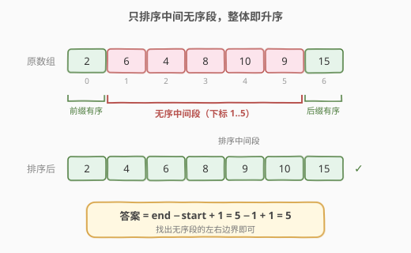
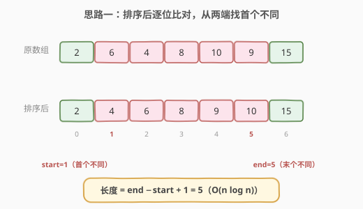
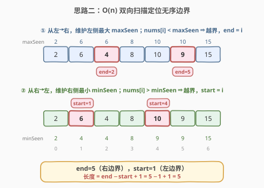
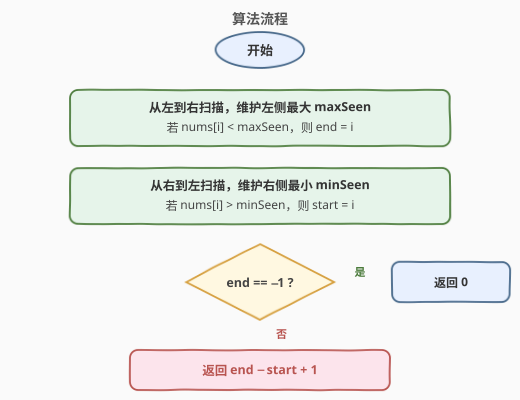

# LeetCode 最短无序连续子数组 题解

## 1. 题目概述

- **标题 / 题号**：最短无序连续子数组（#581，medium）
- **链接**：https://leetcode.cn/problems/shortest-unsorted-continuous-subarray/
- **难度**：中等
- **标签**：数组、栈、贪心、双指针

**题意**：给你一个整数数组 `nums`，你需要找出一个**最短的连续子数组**，使得如果对这个子数组进行升序排序，那么整个数组就会变成升序排列。返回该子数组的长度。

**示例 1**：

```text
输入：nums = [2,6,4,8,10,9,15]
输出：5
解释：只需要对子数组 [6,4,8,10,9] 升序排序，排序后得到 [4,6,8,9,10]，
      整个数组变为 [2,4,6,8,9,10,15]，即整体有序。
```

**示例 2**：

```text
输入：nums = [1,2,3,4]
输出：0
解释：数组已经升序，无需排序任何子数组。
```

**示例 3**：

```text
输入：nums = [1]
输出：0
```

**约束**：

- `1 <= nums.length <= 10^4`
- `-10^5 <= nums[i] <= 10^5`

> 💡 **核心**：数组其实由三段拼成——**已有序的前缀 + 无序的中间段 + 已有序的后缀**。我们只需定位中间段的左右边界 `start` 和 `end`，答案即为 `end - start + 1`（若数组已有序则为 `0`）。



## 2. 解题思路

### 2.1 暴力思路

枚举所有子数组 `[i, j]`，把该段排序后判断整个数组是否有序，取满足条件的长度最小值。时间复杂度 $O(n^3 \log n)$，显然不可取。

更朴素的可接受做法是「排序后比对」：把数组复制一份并排序，再从两端找首个不同的位置。下文 2.2 即此法。

### 2.2 核心观察一：排序后双端比对



把 `nums` 复制一份排序得到 `sorted`，则**原数组与排序后数组逐位相等的前缀**是「无需动」的部分，**相等的后缀**也是「无需动」的部分。中间不相等的段就是答案：

1. 从左往右找第一个 `nums[i] != sorted[i]` 的位置 `start`；
2. 从右往左找第一个 `nums[i] != sorted[i]` 的位置 `end`；
3. 答案为 `max(0, end - start + 1)`。

> ⚠️ 该法直观且不易错，**时间复杂度** $O(n \log n)$，**空间复杂度** $O(n)$。面试中可作为先讲出的正确解，再优化到 $O(n)$。

### 2.3 核心观察二：O(n) 双向扫描（最优）

我们其实不必真的排序。关键观察是：

> **一个元素「位置不对」，当且仅当它小于它左边的某个最大值，或大于它右边的某个最小值。**



由此做两次扫描即可定位边界：

- **从左往右**维护「左侧最大值」`maxSeen`。一旦 `nums[i] < maxSeen`，说明 `nums[i]` 被左边某个更大的元素压着、位置偏右了，它必须被移动——记录 `end = i`。扫描结束后，`end` 即无序段的**右边界**（最后一个需要移动的元素）。
- **从右往左**维护「右侧最小值」`minSeen`。一旦 `nums[i] > minSeen`，说明 `nums[i]` 比右边某个更小的元素还大、位置偏左了，它也必须被移动——记录 `start = i`。扫描结束后，`start` 即无序段的**左边界**（最后一个需要移动的元素，从右往左看即最左的越界点）。

若数组本就有序，则两次扫描中条件都不成立，`end` 仍为初值 `-1`，返回 `0`；否则返回 `end - start + 1`。

> 💡 **为什么取「最后一个」？** 右边界要覆盖所有越界元素，因此取从左扫时**最右**的越界点；左边界同理取从右扫时**最左**的越界点。两端夹住的就是最小的待排序区间。

### 2.4 算法流程图



### 2.5 示例演算

以 `nums = [2,6,4,8,10,9,15]` 为例。

**① 从左→右，维护左侧最大 `maxSeen`**：

| 步骤 | nums[i] | 左侧最大 maxSeen | nums[i] < maxSeen ? | end |
|------|---------|------------------|---------------------|-----|
| i=0  | 2       | 2                | 否（2 < 2 ✗）        | −1  |
| i=1  | 6       | 6                | 否                   | −1  |
| i=2  | 4       | 6                | **是**（4 < 6）       | 2   |
| i=3  | 8       | 8                | 否                   | 2   |
| i=4  | 10      | 10               | 否                   | 2   |
| i=5  | 9       | 10               | **是**（9 < 10）      | 5   |
| i=6  | 15      | 15               | 否                   | 5   |

得到 `end = 5`。

**② 从右→左，维护右侧最小 `minSeen`**：

| 步骤 | nums[i] | 右侧最小 minSeen | nums[i] > minSeen ? | start |
|------|---------|------------------|---------------------|-------|
| i=6  | 15      | 15               | 否                   | −1    |
| i=5  | 9       | 9                | 否                   | −1    |
| i=4  | 10      | 9                | **是**（10 > 9）      | 4     |
| i=3  | 8       | 8                | 否                   | 4     |
| i=2  | 4       | 4                | 否                   | 4     |
| i=1  | 6       | 4                | **是**（6 > 4）       | 1     |
| i=0  | 2       | 2                | 否                   | 1     |

得到 `start = 1`。

最终答案：`end - start + 1 = 5 - 1 + 1 = 5`，对应子数组 `nums[1..5] = [6,4,8,10,9]`，排序后整体有序。

## 3. 参考代码

### C++

```cpp
class Solution {
  public:
    int findUnsortedSubarray(vector<int>& nums) {
        int n = nums.size();
        // 1. 从左到右维护左侧最大，找右边界 end
        int maxSeen = INT_MIN, end = -1;
        for (int i = 0; i < n; i++) {
            if (nums[i] < maxSeen) end = i;
            else maxSeen = nums[i];
        }
        // 2. 从右到左维护右侧最小，找左边界 start
        int minSeen = INT_MAX, start = -1;
        for (int i = n - 1; i >= 0; i--) {
            if (nums[i] > minSeen) start = i;
            else minSeen = nums[i];
        }
        // 3. 数组已有序则 end 仍为 -1
        return end == -1 ? 0 : end - start + 1;
    }
};
```

### Python

```python
class Solution:
    def findUnsortedSubarray(self, nums: List[int]) -> int:
        n = len(nums)
        # 1. 从左到右维护左侧最大，找右边界 end
        max_seen = float('-inf')
        end = -1
        for i in range(n):
            if nums[i] < max_seen:
                end = i
            else:
                max_seen = nums[i]
        # 2. 从右到左维护右侧最小，找左边界 start
        min_seen = float('inf')
        start = -1
        for i in range(n - 1, -1, -1):
            if nums[i] > min_seen:
                start = i
            else:
                min_seen = nums[i]
        # 3. 数组已有序则 end 仍为 -1
        return 0 if end == -1 else end - start + 1
```

### 排序比对法（Python，便于对照）

```python
class Solution:
    def findUnsortedSubarray(self, nums: List[int]) -> int:
        sorted_nums = sorted(nums)
        l, r, n = 0, len(nums) - 1, len(nums)
        while l < n and nums[l] == sorted_nums[l]:
            l += 1
        while r >= 0 and nums[r] == sorted_nums[r]:
            r -= 1
        return max(0, r - l + 1)
```

## 4. 复杂度分析

| 维度 | 复杂度 | 说明 |
|------|--------|------|
| 时间复杂度 | O(n) | 两次独立线性扫描，常数次遍历 |
| 空间复杂度 | O(1) | 仅用 `maxSeen / minSeen / end / start` 几个变量 |

> 排序比对法的时间为 $O(n \log n)$、空间 $O(n)$；双向扫描法在两个维度上都更优。

## 5. 扩展：用单调栈定位边界

本题也可用**单调栈**做到 $O(n)$：栈中存下标，保持栈底到栈顶对应的值单调递增。

- 找左边界 `start`：从左往右遍历，当 `nums[i]` 小于栈顶对应值时，不断弹栈；`start` 取所有弹出位置中的最小值。
- 找右边界 `end`：从右往左遍历，当 `nums[i]` 大于栈顶对应值时，不断弹栈；`end` 取所有弹出位置中的最大值。

其本质与 2.3 一致——都是「寻找每个元素左侧比它大的、右侧比它小的」，单调栈只是另一种实现载体。2.3 的「维护左侧最大 / 右侧最小」写法更简洁、空间也更省（无需栈），面试中推荐优先给出。

## 6. 面试要点

1. **为什么要「从右往左找最小」确定左边界、「从左往右找最大」确定右边界？**
   - 左边界是「比右边某个更小值还大」的最左元素，故需知道右侧最小值，要从右往左扫；右边界是「比左边某个更大值还小」的最右元素，故需知道左侧最大值，要从左往右扫。

2. **数组已经有序时如何判断？**
   - 两次扫描中条件 `nums[i] < maxSeen` 与 `nums[i] > minSeen` 均不成立，`end` 保持初值 `-1`，此时直接返回 `0`。

3. **为什么取「最后一个」越界位置作为边界？**
   - 待排序区间必须覆盖**所有**越界元素。右边界要包住从左扫到的最右越界点，左边界要包住从右扫到的最左越界点，两端一夹即是最小区间。

4. **数组中有重复元素怎么办？**
   - 不影响。比较用的是严格 `<` 和 `>`，相等的元素不会触发越界标记，它们天然处于「已就位」状态，不会被错误地划入无序段。

5. **排序比对法与扫描法的取舍？**
   - 排序比对法思路直接、不易写错，适合先给出并保证正确；扫描法在时间 $O(n)$、空间 $O(1)$ 上最优，是面试官期望的进阶答案。先讲前者再优化到后者，能体现递进思考。

## 同类练习题

| # | 题目 | 与本题的关联 |
|---|------|-------------|
| 42 | [接雨水](https://leetcode.cn/problems/trapping-rain-water/) | 同样使用「左→右维护左侧最大、右→左维护右侧最大」的双向扫描思想 |
| 941 | [有效的山脉数组](https://leetcode.cn/problems/valid-mountain-array/) | 从两端向中间扫描，判断数组是否先单调增后单调减 |
| 739 | [每日温度](https://leetcode.cn/problems/daily-temperatures/) | 单次扫描 + 单调栈，寻找右侧下一个更大元素位置的另一思路 |
| 56 | [合并区间](https://leetcode.cn/problems/merge-intervals/) | 排序后再线性扫描的对比思路 |
