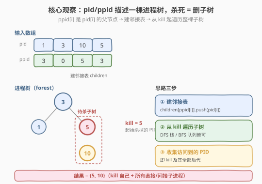
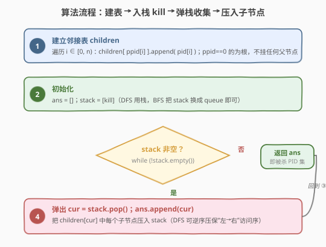
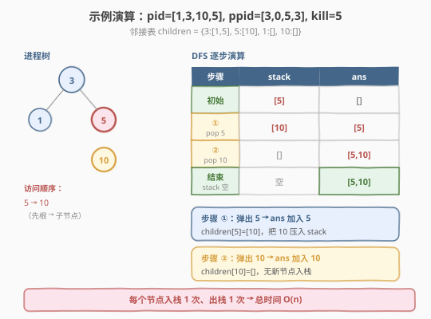

# 杀死进程

- **题目名称**：杀死进程
- **链接**：[582. 杀死进程](https://leetcode.cn/problems/kill-process/)
- **难度**：中等
- **标签**：树、深度优先搜索、广度优先搜索、哈希表

## 1. 题目概述

给定 `n` 个进程，每个进程有一个唯一的 **PID**（进程 ID）和一个 **PPID**（父进程 ID）。进程之间的父子关系构成一片森林（多叉树）：`ppid[i]` 是 `pid[i]` 的父进程；`ppid[i] == 0` 表示该进程没有父进程（是根）。

现在给定一个 `kill` 表示要终止的进程 PID。**杀死一个进程时，它的所有子进程（直接或间接）也会被一并杀死**。返回最终被杀死的所有进程 PID 列表（顺序不限）。

**示例 1**：

```text
输入：pid = [1,3,10,5], ppid = [3,0,5,3], kill = 5
输出：[5,10]
解释：父子关系如下，5 的子进程是 10：
        3
       / \
      1   5
          |
          10
杀死 5 时，10 作为 5 的子进程也要被杀死，故结果为 [5,10]。
```

**示例 2**：

```text
输入：pid = [1], ppid = [0], kill = 1
输出：[1]
解释：只有一个根进程，杀死它即返回 [1]。
```

**约束条件**：

- `1 <= pid.length == ppid.length <= 5 * 10^4`
- `1 <= pid[i] <= 5 * 10^5`
- `pid` 中所有元素互不相同
- `ppid[i]` 可能为 `0`（表示根进程，无父进程）
- `kill` 一定在 `pid` 中出现

> 💡 **核心**：`pid` 与 `ppid` 两列平行数组描述的是一棵**多叉树**的边集（每条边 `ppid[i] → pid[i]`）。题目要求「杀死 `kill` 子树」——即从 `kill` 出发遍历它的**全部后代**。本质是「建图 + 一次 DFS/BFS」。



---

## 2. 解题思路

### 2.1 暴力思路

不加预处理，每轮扫描 `pid/ppid` 找出当前待杀集合中各进程的**直接子进程**，并入集合，重复直到某一轮没有新增。每轮 $O(n)$，最坏要 $O(n)$ 轮（树退化成链），总时间 $O(n^2)$，对 $n = 5 \times 10^4$ 不可接受。

问题出在「每次都要在全量数组里找子节点」。只需**预先把父子关系组织成邻接表**，即可把每次查子节点降到 $O(1)$（均摊）。

### 2.2 核心观察：建邻接表 + 一次遍历

`ppid[i]` 是 `pid[i]` 的父，那么对每个 `i`，把 `pid[i]` 追加到 `children[ppid[i]]` 这个列表里。一趟 $O(n)$ 扫描后，任给一个父进程，都能 $O(1)$ 取出它的所有直接子进程。

随后从 `kill` 出发做一次 DFS（栈）或 BFS（队列），把访问到的每个节点加入答案即可——访问集合就是「`kill` 及其全部后代」。

> ⚠️ **为什么 `kill` 自己也要进答案？** 题意「杀死进程」包含它本身。遍历起点 `kill` 第一次出栈/出队时即被记入 `ans`，无需特殊处理。

### 2.3 算法流程图



### 2.4 示例演算

以 `pid = [1,3,10,5]`、`ppid = [3,0,5,3]`、`kill = 5` 为例：



**① 建邻接表**：扫描 `i = 0..3`：

| i | pid[i] | ppid[i] | 操作 | children |
|---|--------|---------|------|----------|
| 0 | 1 | 3 | children[3].append(1) | {3:[1]} |
| 1 | 3 | 0 | children[0].append(3) | {0:[3]}（0 是虚根，无需访问） |
| 2 | 10 | 5 | children[5].append(10) | {5:[10]} |
| 3 | 5 | 3 | children[3].append(5) | {3:[1,5]} |

得到 `children = {3:[1,5], 5:[10], 1:[], 10:[]}`（叶子进程对应空列表）。

**② DFS 从 `kill=5` 出发**：

| 步骤 | 弹出 cur | ans | children[cur] | 压入 stack |
|------|----------|-----|---------------|-----------|
| 初始 | — | [] | — | stack=[5] |
| ① | 5 | [5] | [10] | stack=[10] |
| ② | 10 | [5,10] | [] | stack=[] |
| 结束 | stack 空 | [5,10] | — | — |

最终返回 `[5, 10]`。

---

## 3. 参考代码

### 方法一：DFS + 栈（推荐，迭代实现）

### C++

```cpp
class Solution {
  public:
    vector<int> killProcess(vector<int>& pid, vector<int>& ppid, int kill) {
        unordered_map<int, vector<int>> children;
        for (int i = 0; i < (int)pid.size(); i++) {
            children[ppid[i]].push_back(pid[i]);
        }
        vector<int> ans;
        vector<int> stk;
        stk.push_back(kill);
        while (!stk.empty()) {
            int cur = stk.back(); stk.pop_back();
            ans.push_back(cur);
            for (int c : children[cur]) stk.push_back(c);
        }
        return ans;
    }
};
```

### Python

```python
class Solution:
    def killProcess(self, pid: List[int], ppid: List[int], kill: int) -> List[int]:
        children = defaultdict(list)
        for p, pp in zip(pid, ppid):
            children[pp].append(p)

        ans = []
        stack = [kill]
        while stack:
            cur = stack.pop()
            ans.append(cur)
            stack.extend(children[cur])
        return ans
```

### 方法二：BFS + 队列

把上面的「栈」换成「队列」即为 BFS。最终访问集合相同（仍是 `kill` 的全部后代），仅顺序不同，题目允许任意顺序。

### C++

```cpp
class Solution {
  public:
    vector<int> killProcess(vector<int>& pid, vector<int>& ppid, int kill) {
        unordered_map<int, vector<int>> children;
        for (int i = 0; i < (int)pid.size(); i++) {
            children[ppid[i]].push_back(pid[i]);
        }
        vector<int> ans;
        queue<int> q;
        q.push(kill);
        while (!q.empty()) {
            int cur = q.front(); q.pop();
            ans.push_back(cur);
            for (int c : children[cur]) q.push(c);
        }
        return ans;
    }
};
```

### Python

```python
class Solution:
    def killProcess(self, pid: List[int], ppid: List[int], kill: int) -> List[int]:
        children = defaultdict(list)
        for p, pp in zip(pid, ppid):
            children[pp].append(p)

        ans = []
        q = deque([kill])
        while q:
            cur = q.popleft()
            ans.append(cur)
            q.extend(children[cur])
        return ans
```

> 💡 **DFS 递归版**也可，但 $n$ 可达 $5 \times 10^4$，树退化成链时递归深度同量级，存在栈溢出风险，**优先用迭代版**。

---

## 4. 复杂度分析

| 维度 | 复杂度 | 说明 |
|------|--------|------|
| 时间复杂度 | $O(n)$ | 建邻接表 $O(n)$；DFS/BFS 每个进程入/出容器各 1 次，总操作 $O(n)$ |
| 空间复杂度 | $O(n)$ | 邻接表存 $n$ 条父子边 $O(n)$；栈/队列最多存 $O(n)$ 个节点；答案数组 $O(n)$ |

> ⚠️ `pid[i]` 取值可达 $5 \times 10^5$，但只有 $n \le 5 \times 10^4$ 个真实进程，故用哈希表（`unordered_map` / `dict`）而非值域数组存 `children`，空间严格 $O(n)$。

---

## 5. 扩展：从「杀死子树」到「批量祖先查询」

本题是「**给定一棵树，按节点查子树**」的最简形式。同一套「建邻接表 + 遍历」骨架可衍生多种变体：

1. **改为「杀父进程」**：若题目改成「杀死 `kill` 及其所有祖先」，只需建反向表 `parent[pid[i]] = ppid[i]`，从 `kill` 一路向上爬到根即可，$O(n)$。
2. **批量查询**：若要回答多次「杀死 $x$ 会影响哪些进程」，可预处理每个节点的子树大小 / DFS 入出序，用区间回答；或离线 + 倍增 LCA 思路。
3. **进程的「最近公共祖先」**：树上两节点的 LCA，可用二叉提升（`up[x][k]`）预处理 $O(n \log n)$，单次查询 $O(\log n)$，承接 [236. 二叉树的最近公共祖先](../0201-0300/236_二叉树最近公共祖先.md) 的思路迁移到多叉树。

---

## 6. 面试要点

1. **为什么用哈希表存 `children` 而不是二维数组？**
   - `pid[i]` 值域达 $5 \times 10^5$，但真实进程只有 $n \le 5 \times 10^4$ 个。用 `unordered_map<int, vector<int>>` 只为存在的进程建表，空间严格 $O(n)$；值域数组会浪费 10 倍空间。

2. **DFS 和 BFS 在本题有区别吗？**
   - 没有。两者都能完整遍历 `kill` 的子树，访问集合相同，仅顺序不同。题目允许任意顺序返回，故任选其一。DFS 栈实现最简洁，BFS 队列实现更适合「按层」语义。

3. **`ppid[i] == 0` 的根进程如何处理？**
   - `children[0]` 会收集所有根进程，但 `kill` 一定在 `pid` 中且我们只从 `kill` 出发遍历，永远不会去访问 `children[0]`，故 `0` 这个虚键天然被忽略，无需特殊判断。

4. **递归 DFS 在本题会有什么风险？**
   - $n = 5 \times 10^4$，若树退化为链，递归深度同量级，可能触发栈溢出（尤其在栈空间受限的在线评测环境）。**迭代版**（显式栈/队列）把递归调用栈换成堆内存，无此风险，是更稳的写法。

5. **如果 `pid` 不唯一（同一 PID 多次出现）会怎样？**
   - 题目保证 `pid` 互不相同，故每个 PID 对应唯一节点。若放宽此条件，题意会变成「DAG / 通用有向图」，则需要额外做**去重 / 环检测**，不能用树遍历直接处理。

---

## 7. 同类练习题

- [236. 二叉树的最近公共祖先](https://leetcode.cn/problems/lowest-common-ancestor-of-a-binary-tree/)（[题解](../0201-0300/236_二叉树最近公共祖先.md)）：同样是「建好树后从某节点出发的后序 DFS」，对照多叉树子树遍历
- [200. 岛屿数量](https://leetcode.cn/problems/number-of-islands/)（[题解](../0201-0300/200_岛屿数量.md)）：网格图 DFS/BFS 求连通分量，与本题同属「建图 + 一次遍历」骨架
- [133. 克隆图](https://leetcode.cn/problems/clone-graph/)：从起点出发 DFS/BFS 遍历图并收集所有节点，与本题「遍历子树收集节点」思路一致
- [310. 最小高度树](https://leetcode.cn/problems/minimum-height-trees/)：在树上做拓扑剥离，反向用到「叶子→根」的遍历方向
- [417. 太平洋大西洋水流问题](https://leetcode.cn/problems/pacific-atlantic-water-flow/)（[题解](../0401-0500/417_太平洋大西洋水流问题.md)）：从边界反向 DFS 求可达集，对照本题「从单点正向 DFS 求后代集」
