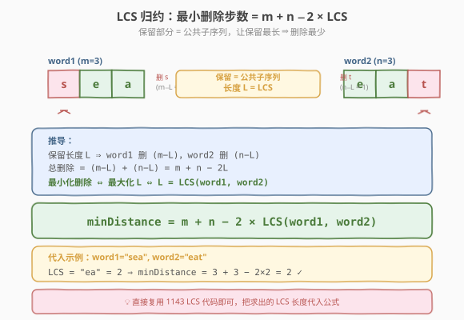

# LeetCode 两个字符串的删除操作 题解

## 1. 题目概述

- **标题 / 题号**：两个字符串的删除操作（#583，medium）
- **链接**：https://leetcode.cn/problems/delete-operation-for-two-strings/
- **难度**：中等
- **标签**：动态规划、二维 DP、字符串、LCS

**题意**：给定两个字符串 `word1` 和 `word2`，返回使 `word1` 和 `word2` **相同**所需的**最小步数**。每一步中，可以**恰好删除**其中一个字符串里的一个字符。

**示例 1**：

```text
输入：word1 = "sea", word2 = "eat"
输出：2
解释：第一步删 "sea" 中的 's' 得到 "ea"；第二步删 "eat" 中的 't' 得到 "ea"。
      此时两字符串相同，共 2 步。
```

**示例 2**：

```text
输入：word1 = "leetcode", word2 = "etco"
输出：4
解释：删掉 "leetcode" 中的 'l'、'e'、'd'、'e' 后得到 "etco"，共 4 步。
```

**约束**：

- `1 <= word1.length, word2.length <= 500`
- `word1` 和 `word2` 仅由小写英文字母组成

> 💡 本题只允许**删除**操作（不能替换、不能插入）。直觉上，两字符串各自删掉一些字符后剩下的部分必须**完全相同**——也就是要找一个**共同的子序列**作为「保留部分」，把两侧不在保留部分里的字符全删掉。要让总删除次数最少，就要让保留部分尽量长，这正是**最长公共子序列（LCS）**。因此本题既可以直接 DP 求最小删除步数，也可以转化为 LCS 问题。

## 2. 解题思路

### 2.1 暴力思路：递归枚举

对 `word1` 和 `word2` 的每个位置，若字符相同则这一对都保留、共同前进一步；若不同则必须删掉其中一个（删 `word1[i-1]` 或删 `word2[j-1]`），两分支取较小。时间 $O(2^{m+n})$，指数级超时，且大量重复子问题。

### 2.2 核心观察：二维 DP（直接求最小删除步数）

![核心观察：dp[i][j] = 让 word1[0..i-1] 与 word2[0..j-1] 相同的最小删除步数](../images/dod_dp_table.svg)

**定义**：`dp[i][j]` = 使 `word1[0..i-1]` 与 `word2[0..j-1]` 相同所需的最小删除步数。

**边界**（一侧为空串，只能把另一侧全删）：

```text
dp[0][j] = j      # word1 为空，需删掉 word2 的全部 j 个字符
dp[i][0] = i      # word2 为空，需删掉 word1 的全部 i 个字符
```

**转移**（核心）：

```text
若 word1[i-1] == word2[j-1]：
    dp[i][j] = dp[i-1][j-1]            # 两字符相同，这对都保留，无需删除

若 word1[i-1] != word2[j-1]：
    dp[i][j] = 1 + min(dp[i-1][j],     # 删 word1[i-1]
                       dp[i][j-1])     # 删 word2[j-1]
```

**两种转移的直觉**：

| 情况 | DP 来源 | 含义 |
|------|---------|------|
| **字符匹配** | `dp[i-1][j-1]` | 两字符相同，这对一起保留，删的次数不变 |
| **字符不匹配** | `1 + min(dp[i-1][j], dp[i][j-1])` | 至少删掉其中一个，再处理剩余部分，取较少删法 |

> 💡 **为什么不匹配时不考虑「两个都删」？** 即 `2 + dp[i-1][j-1]`。因为 `2 + dp[i-1][j-1] ≥ 1 + min(dp[i-1][j], dp[i][j-1])` 恒成立：`dp[i-1][j] ≤ 1 + dp[i-1][j-1]`（把 `word2[j-1]` 删掉即归约到 `dp[i-1][j-1]`），所以 `1 + dp[i-1][j] ≤ 2 + dp[i-1][j-1]`，同理另一分支。**两个都删**已经被「先删一个、再删另一个」的两步路径包含，不会更优，故无需单独列为第三分支。这与 [72. 编辑距离](../0001-0100/72_编辑距离.md) 的 `min` 三选一不同——本题没有「替换」操作。

**答案**：`dp[m][n]`。

### 2.3 算法流程图

![算法流程：初始化边界 → 逐行填表 → 返回 dp[m][n]](../images/dod_algorithm_flow.svg)

**完整步骤**：

1. **初始化**：`dp` 为 `(m+1) × (n+1)` 矩阵，第 0 行 `dp[0][j] = j`、第 0 列 `dp[i][0] = i`（空串边界，需删光另一侧）
2. **逐行填表**：`i` 从 1 到 `m`，`j` 从 1 到 `n`：
   - `word1[i-1] == word2[j-1]` → `dp[i][j] = dp[i-1][j-1]`
   - `word1[i-1] != word2[j-1]` → `dp[i][j] = 1 + min(dp[i-1][j], dp[i][j-1])`
3. **返回** `dp[m][n]`

> ⚠️ **填表顺序**：必须从左到右、从上到下。`dp[i][j]` 依赖左上 (`dp[i-1][j-1]`)、正上 (`dp[i-1][j]`)、左方 (`dp[i][j-1]`)，三者都要先算出来。这是二维 DP 的典型依赖方向，与 LCS、编辑距离完全一致。

### 2.4 示例演算

以 `word1 = "sea"`, `word2 = "eat"` 为例：

![示例演算：sea 与 eat 的 dp 填表，答案 dp[3][3]=2](../images/dod_example_walkthrough.svg)

**dp 表**（行 = word1 字符，列 = word2 字符，首行/首列为空串边界）：

| | `""` | `e` | `a` | `t` |
|------|------|-----|-----|-----|
| `""` | 0 | 1 | 2 | 3 |
| `s` | 1 | 2 | 3 | 4 |
| `e` | 2 | **1** | 2 | 3 |
| `a` | 3 | 2 | **1** | 2 |

**关键填表步骤**：

| 格子 | 字符比较 | 转移 | 值 | 说明 |
|------|----------|------|----|------|
| `dp[1][1]` | `s` ≠ `e` | `1 + min(dp[0][1]=1, dp[1][0]=1)` | 2 | 删 `s` 或删 `e`，再让 `""`/`"e"` 与另一侧相同 |
| `dp[2][1]` | `e` == `e` | `dp[1][0] = 1` | 1 | 两 `e` 都保留，剩 `"s"` 与 `""` 需删 1 次 |
| `dp[2][2]` | `e` ≠ `a` | `1 + min(dp[1][2]=3, dp[2][1]=1)` | 2 | 删 `a` 更省，沿用 `dp[2][1]=1` 再删 1 |
| `dp[3][2]` | `a` == `a` | `dp[2][1] = 1` | 1 | 两 `a` 都保留，剩 `"se"` 与 `"e"` 需删 1 次 |
| `dp[3][3]` | `a` ≠ `t` | `1 + min(dp[2][3]=3, dp[3][2]=1)` | 2 | 删 `t` 更省，沿用 `dp[3][2]=1` 再删 1 ✓ |

最终 `dp[3][3] = 2`：保留公共子序列 `"ea"`，删 `word1` 的 `'s'`、删 `word2` 的 `'t'`，共 2 步。

> 💡 **如何还原具体删除了哪些字符？** 从 `dp[m][n]` 回溯：若 `word1[i-1] == word2[j-1]` 且 `dp[i][j] == dp[i-1][j-1]`，该字符被**保留**，走到 `[i-1][j-1]`；否则走到 `dp[i-1][j]`（删 `word1[i-1]`）或 `dp[i][j-1]`（删 `word2[j-1]`）中较小者，记录被删字符。逆序即得删除序列。

## 3. 参考代码

### C++

```cpp
// 两个字符串的删除操作.cpp —— 二维 DP 直接求最小删除步数
// 编译: g++ -O2 -std=c++17 两个字符串的删除操作.cpp -o dod
class Solution {
public:
    int minDistance(string word1, string word2) {
        int m = word1.size(), n = word2.size();
        vector<vector<int>> dp(m + 1, vector<int>(n + 1, 0));

        for (int i = 0; i <= m; i++) dp[i][0] = i;      // word2 为空，删光 word1
        for (int j = 0; j <= n; j++) dp[0][j] = j;      // word1 为空，删光 word2

        for (int i = 1; i <= m; i++) {
            for (int j = 1; j <= n; j++) {
                if (word1[i-1] == word2[j-1]) {
                    dp[i][j] = dp[i-1][j-1];            // 两字符相同，都保留
                } else {
                    dp[i][j] = 1 + min(dp[i-1][j],      // 删 word1[i-1]
                                       dp[i][j-1]);     // 删 word2[j-1]
                }
            }
        }
        return dp[m][n];
    }
};
```

### Python

```python
class Solution:
    def minDistance(self, word1: str, word2: str) -> int:
        m, n = len(word1), len(word2)
        dp = [[0] * (n + 1) for _ in range(m + 1)]

        for i in range(m + 1):
            dp[i][0] = i                                # word2 为空，删光 word1
        for j in range(n + 1):
            dp[0][j] = j                                # word1 为空，删光 word2

        for i in range(1, m + 1):
            for j in range(1, n + 1):
                if word1[i-1] == word2[j-1]:
                    dp[i][j] = dp[i-1][j-1]             # 两字符相同，都保留
                else:
                    dp[i][j] = 1 + min(dp[i-1][j],      # 删 word1[i-1]
                                       dp[i][j-1])      # 删 word2[j-1]

        return dp[m][n]
```

> 💡 **实现细节**：① `dp` 矩阵大小 `(m+1)×(n+1)`，多出来的首行首列表示空串边界。② 边界初始化为 `i` / `j`（而非 0），因为本题「空串 vs 长度 k」需删 k 次——这是与 LCS（边界为 0）的关键区别。③ `text1[i-1]` 对应 `dp[i]` 行——下标偏移 1 是因为 `dp[0]` 代表空串。

## 4. 复杂度分析

| 维度 | 二维 DP | 滚动数组 | LCS 归约 |
|------|---------|---------|----------|
| **时间** | `O(m × n)` | `O(m × n)` | `O(m × n)` |
| **空间** | `O(m × n)` | `O(n)` | `O(n)`（滚动 LCS） |
| **能否还原删除序列** | ✓ 回溯 dp 表 | ✗ 只得步数 | ✗ 只得步数 |
| **思路** | 直接求最小删除步数 | 同左，压缩空间 | 借用 LCS 间接求 |

> ⚠️ 时间 `O(m×n)`：双重循环遍历 `(m+1)×(n+1)` 个格子，每个格子 `O(1)` 转移。`m, n ≤ 500` 时约 $2.5 \times 10^5$ 次操作，绰绰有余。

## 5. 扩展：归约到 LCS + 滚动数组空间优化

### 5.1 LCS 归约：最小删除步数 = $m + n - 2 \times \text{LCS}$



**核心观察**：要让两字符串相同，最终保留下来的部分必须是两字符串的**公共子序列**。设保留部分的长度为 $L$，则 `word1` 删了 $m - L$ 个、`word2` 删了 $n - L$ 个，总删除次数 $= (m - L) + (n - L) = m + n - 2L$。要让总删除次数**最小**，就要让 $L$ **最大**——即 $L = \text{LCS}(\text{word1}, \text{word2})$。

$$\text{minDistance} = m + n - 2 \times \text{LCS}(\text{word1}, \text{word2})$$

直接复用 [1143. 最长公共子序列](../1101-1200/1143_最长公共子序列.md) 的代码：

```python
class Solution:
    def minDistance(self, word1: str, word2: str) -> int:
        m, n = len(word1), len(word2)
        # 求 LCS 长度（滚动数组版，见 1143 题解）
        dp = [0] * (n + 1)
        for i in range(1, m + 1):
            prev = dp[0]
            for j in range(1, n + 1):
                temp = dp[j]
                if word1[i-1] == word2[j-1]:
                    dp[j] = prev + 1
                else:
                    dp[j] = max(dp[j], dp[j-1])
                prev = temp
        lcs = dp[n]
        return m + n - 2 * lcs
```

> 💡 **为什么直接 DP 和 LCS 归约等价？** 直接 DP 的 `dp[i][j]` 满足恒等式 `dp[i][j] = i + j - 2 × lcs[i][j]`，其中 `lcs[i][j]` 是 `word1[0..i-1]` 与 `word2[0..j-1]` 的 LCS 长度。可对 `(i,j)` 归纳验证：边界 `dp[0][j] = j = 0 + j - 2×0` 成立；匹配时 `dp[i-1][j-1] = (i-1)+(j-1)-2×lcs[i-1][j-1]`，加回 2 即 `i+j-2×(lcs[i-1][j-1]+1) = i+j-2×lcs[i][j]`；不匹配时 `1 + min(dp[i-1][j], dp[i][j-1])` 展开后亦归约到 `i+j-2×max(lcs[i-1][j], lcs[i][j-1])`。两种视角殊途同归。

### 5.2 直接 DP 的滚动数组

`dp[i][j]` 只依赖上一行和当前行左边，可用**一维数组 + prev 变量**压缩到 `O(n)` 空间（与 LCS 滚动数组技巧完全一致）：

```python
class Solution:
    def minDistance(self, word1: str, word2: str) -> int:
        m, n = len(word1), len(word2)
        dp = list(range(n + 1))                          # dp[0][j] = j

        for i in range(1, m + 1):
            prev = dp[0]                                 # dp[i-1][0]
            dp[0] = i                                    # dp[i][0] = i
            for j in range(1, n + 1):
                temp = dp[j]                             # 保存 dp[i-1][j]
                if word1[i-1] == word2[j-1]:
                    dp[j] = prev                         # dp[i-1][j-1]
                else:
                    dp[j] = 1 + min(dp[j], dp[j-1])      # 1 + min(dp[i-1][j], dp[i][j-1])
                prev = temp                              # 滚动 prev
        return dp[n]
```

> ⚠️ **滚动数组的两个易错点**：① 每行开始前要把 `dp[0]` 更新为 `i`（当前行的左边界），它原本是上一行的 `dp[i-1][0]`。② `prev` 在覆盖 `dp[j]` 前保存旧值（上一行的 `dp[j]`），下一次迭代作为 `dp[i-1][j-1]`（左上角）使用。

### 5.3 与编辑距离的关系

本题是 [72. 编辑距离](../0001-0100/72_编辑距离.md) 的**退化版**——只允许「删除」操作（删除 = 在另一字符串对应位置「插入」），不允许「替换」。转移结构对比：

| | 字符匹配时 | 字符不匹配时 | 目标 |
|------|-----------|-------------|------|
| **本题（仅删除）** | `dp[i-1][j-1]` | `1 + min(dp[i-1][j], dp[i][j-1])` | 求最少删除 |
| **编辑距离（删/插/替）** | `dp[i-1][j-1]` | `1 + min(dp[i-1][j-1], dp[i-1][j], dp[i][j-1])` | 求最少操作 |

去掉「替换」分支（`dp[i-1][j-1]` 那项），编辑距离就退化为本题。

## 6. 面试要点

1. **`dp[i][j]` 的定义是什么？边界为什么是 `i` / `j` 而非 0？**

   > `dp[i][j]` = 使 `word1[0..i-1]` 与 `word2[0..j-1]` 相同的最小删除步数。边界 `dp[0][j] = j`、`dp[i][0] = i`：当一侧为空串，只能把另一侧的字符全删掉。这与 LCS（边界为 0）不同——LCS 求的是「保留多少」，本题求的是「删多少」，空串边界对应「全删」。

2. **不匹配时为什么是 `1 + min(dp[i-1][j], dp[i][j-1])` 而非 `min` 三选一？**

   > 本题只允许删除，不允许替换。不匹配时要么删 `word1[i-1]`（→ `dp[i-1][j]`），要么删 `word2[j-1]`（→ `dp[i][j-1]`），两分支取较小再 `+1`。「两个都删」已被两步路径包含，不更优；「替换」操作不存在。对比编辑距离的 `min(dp[i-1][j-1], dp[i-1][j], dp[i][j-1])`，本题少了替换分支。

3. **本题和 LCS 是什么关系？**

   > 最终保留的部分是两字符串的公共子序列。设其长度为 $L$，总删除次数 $= (m-L)+(n-L) = m+n-2L$。最小化删除次数 ⇔ 最大化 $L$ ⇔ $L = \text{LCS}$。故 `minDistance = m + n - 2 × LCS`。这是「归约」视角，可直接复用 1143 的代码。

4. **直接 DP 和 LCS 归约，面试时该写哪个？**

   > 都可。直接 DP 更「贴合题意」（状态直接对应删除步数，边界/转移直观，能回溯删除序列）；LCS 归约更「优雅」（一行公式 + 复用已熟模板，体现问题转化能力）。若面试官追问「能不能用 LCS 做」，能立刻给出归约公式是加分项。

5. **如何还原具体删除了哪些字符？**

   > 从 `dp[m][n]` 回溯：若 `word1[i-1] == word2[j-1]` 且 `dp[i][j] == dp[i-1][j-1]`，该字符被**保留**，走到 `[i-1][j-1]`；否则走到 `dp[i-1][j]`（删 `word1[i-1]`）或 `dp[i][j-1]`（删 `word2[j-1]`）中较小者，记录被删字符。需完整二维表，滚动数组无法回溯。

> 💡 **一句话总结**：583 是「只删不替」的编辑距离退化版——`dp[i][j]` 表示两前缀变相同的最小删除次数，匹配时直接继承 `dp[i-1][j-1]`，不匹配时 `1 + min(上方, 左方)`。亦可归约为 LCS：`answer = m + n - 2 × LCS`。`O(m×n)` 时间，滚动数组可压到 `O(n)` 空间。与 1143、72 同属二维 DP 核心套路，掌握一个即可迁移一整类。

## 同类练习题

| # | 题目 | 与本题的关联 |
|---|------|-------------|
| 1143 | [最长公共子序列](https://leetcode.cn/problems/longest-common-subsequence/)（[题解](../1101-1200/1143_最长公共子序列.md)） | 本题的归约源头，`answer = m + n - 2 × LCS` |
| 72 | [编辑距离](https://leetcode.cn/problems/edit-distance/)（[题解](../0001-0100/72_编辑距离.md)） | 本题的「升级版」，多了替换操作，不匹配时 `min` 三选一 |
| 712 | [两个字符串的最小 ASCII 删除和](https://leetcode.cn/problems/minimum-ascii-delete-sum-for-two-strings/) | 把「最小步数」换成「最小 ASCII 和」，结构与本题同构，匹配时继承、不匹配时 `min` 两分支 |
| 97 | [交错字符串](https://leetcode.cn/problems/interleaving-string/)（[题解](../0001-0100/97_交错字符串.md)） | 同属两序列二维 DP，状态定义与转移方向可对照 |
| 1312 | [让字符串成为回文串的最少插入次数](https://leetcode.cn/problems/minimum-insertion-steps-to-make-a-string-palindrome/) | 单字符串回文 DP，与 LCS 思想相通（求与逆序串的 LCS） |
