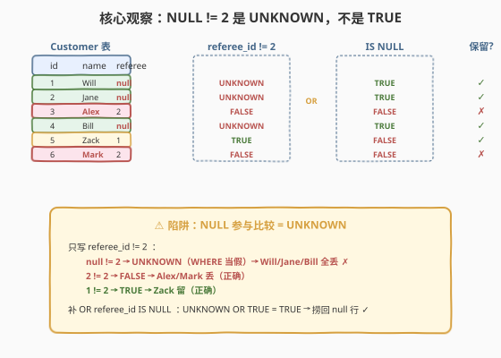
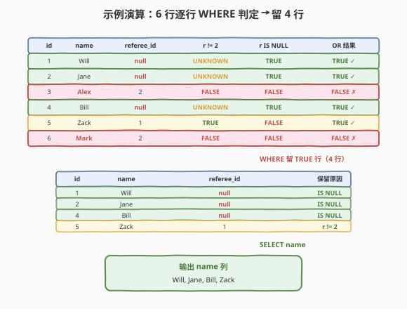

# 寻找用户推荐人

- **题目名称**：寻找用户推荐人
- **链接**：[584. 寻找用户推荐人](https://leetcode.cn/problems/find-customer-referee/)
- **难度**：简单
- **标签**：SQL、WHERE、NULL 处理、三值逻辑

## 1. 题目概述

给定 `Customer` 表，每行记录一个客户的 `id`、姓名 `name` 以及推荐他的客户的 `referee_id`。编写 SQL 查询，返回满足下列**任一条件**的客户姓名：

1. 被 `id != 2` 的用户推荐（即 `referee_id` 不为 `2`）；
2. 没有被任何用户推荐（即 `referee_id` 为 `NULL`）。

**表结构**：

```text
Table: Customer
+-------------+---------+
| Column Name | Type    |
+-------------+---------+
| id          | int     |  ← 主键
| name        | varchar |
| referee_id  | int     |  ← 推荐人 id，可为 NULL（表示无推荐人）
+-------------+---------+
```

> 💡 **关键约束**：`id` 是主键；`referee_id` 可为 `NULL`——这正是本题的核心考点。`NULL` 表示「未知值」，它参与任何比较运算（`=`/`<>`/`<`/`>`）的结果都是 `UNKNOWN`，而 `WHERE` 把 `UNKNOWN` 当作「假」过滤。所以只写 `WHERE referee_id != 2` **无法**捞回 `referee_id` 为 `NULL` 的客户——必须补 `OR referee_id IS NULL`。

**示例 1**：

```text
输入：
Customer 表:
+----+------+------------+
| id | name | referee_id |
+----+------+------------+
| 1  | Will | null       |
| 2  | Jane | null       |
| 3  | Alex | 2          |
| 4  | Bill | null       |
| 5  | Zack | 1          |
| 6  | Mark | 2          |
+----+------+------------+

输出：
+------+
| name |
+------+
| Will |
| Jane |
| Bill |
| Zack |
+------+
```

**解释**：

- **Will / Jane / Bill**：`referee_id` 为 `null` → 满足「没有被任何用户推荐」→ 输出。
- **Zack**：`referee_id = 1`，`1 != 2` → 满足「被 `id != 2` 的用户推荐」→ 输出。
- **Alex / Mark**：`referee_id = 2` → 既不满足 `!= 2` 也不满足 `IS NULL` → **不输出**。

**约束条件**：

- `id` 是 `Customer` 表的主键。
- 结果可按任意顺序返回。
- 输出列名为 `name`。

> 💡 本题是 SQL **`NULL` 三值逻辑**的最小母题——单表、单 `WHERE`、无 `JOIN`、无 `GROUP BY`，全部考点集中在「`NULL != 2` 是 `UNKNOWN` 不是 `TRUE`」这一条。它是 [577. 员工奖金](../0501-0600/577_员工奖金.md)「`LEFT JOIN` + `bonus IS NULL`」范式的更入门版本——577 多一层 `LEFT JOIN`，本题连 `JOIN` 都没有，只考 `WHERE` 对 `NULL` 列的过滤。两题同源，可对照学习。

---

## 2. 解题思路

### 2.1 暴力思路：过程式逐行判定

最直觉的做法是用过程式语言逐行扫描 `Customer`，对每个客户判定其 `referee_id`：

```text
for each row in Customer:
    r = row.referee_id
    if r is NULL:                 # 没有推荐人
        keep = True
    elif r != 2:                  # 被非 2 用户推荐
        keep = True
    else:                         # r == 2
        keep = False
    if keep:
        emit row.name
```

但**纯 SQL 没有显式 `if/elif/else` 语句**——上述「逐行判定 + 多条件 `OR`」的模式，在 SQL 里一一对应于 `WHERE referee_id != 2 OR referee_id IS NULL`。难点不在写法，而在 `NULL` 参与比较时的**三值逻辑**——下文第 5 节详述。

> ⚠️ 关键转换：把「`referee_id != 2`」翻译成 `WHERE referee_id != 2`；把「没有被推荐（`referee_id` 为 `NULL`）」翻译成 `OR referee_id IS NULL`。两条件**缺一不可**——只写 `referee_id != 2` 会因 `NULL != 2` 返回 `UNKNOWN` 而**丢掉所有 `NULL` 行**（Will/Jane/Bill），这是本题唯一也是最大的陷阱。

### 2.2 核心观察：WHERE referee_id != 2 OR referee_id IS NULL



**两条件 `OR` 覆盖三类 `referee_id` 取值**：

1. **`referee_id = 2`**（Alex/Mark）：`2 != 2` 为 `FALSE`、`2 IS NULL` 为 `FALSE` → `OR` 结果 `FALSE` → 丢弃。
2. **`referee_id` 非 2 且非 `NULL`**（Zack，`referee_id = 1`）：`1 != 2` 为 `TRUE` → `OR` 直接短路为 `TRUE` → 保留。
3. **`referee_id = NULL`**（Will/Jane/Bill）：`NULL != 2` 为 `UNKNOWN`、`NULL IS NULL` 为 `TRUE` → `UNKNOWN OR TRUE = TRUE` → 保留。

$$\text{输出} = \{\, c.\text{name} \mid c \in \text{Customer},\ c.\text{referee\_id} \neq 2 \,\lor\, c.\text{referee\_id} \text{ IS NULL} \,\}$$

> 💡 **为什么 `NULL != 2` 不是 `TRUE`？** SQL 用三值逻辑（TRUE / FALSE / **UNKNOWN**）。`NULL` 表示「未知值」——未知值是否等于 2 仍未知，所以 `NULL != 2` 返回 `UNKNOWN` 而非 `TRUE`。`WHERE` 把 `UNKNOWN` 当作「假」过滤，于是只写 `WHERE referee_id != 2` 会同时丢掉 `referee_id = 2`（`FALSE`）和 `referee_id = NULL`（`UNKNOWN`），只剩 Zack——漏掉 Will/Jane/Bill 三行。补 `OR referee_id IS NULL` 后，`UNKNOWN OR TRUE = TRUE` 把 `NULL` 行捞回。

> ⚠️ **`IS NULL` 不是比较运算**：`IS NULL` 是专门的 `NULL` 判定谓词，不走 `=`/`<>` 比较逻辑，直接返回 `TRUE`/`FALSE`——所以 `NULL IS NULL` 是 `TRUE`（而非 `UNKNOWN`）。这正是它能「救回」`NULL` 行的根源。判断 `NULL` **必须**用 `IS NULL` / `IS NOT NULL`，不能用 `= NULL`（`NULL = NULL` 也是 `UNKNOWN`）。

### 2.3 算法流程图


**逻辑执行顺序**：

| 步骤 | 子句 | 作用 |
|------|------|------|
| ① | `FROM Customer` | 读取 `Customer` 全部行（示例 6 行） |
| ② | `WHERE referee_id != 2 OR referee_id IS NULL` | 逐行用三值逻辑判定，留 `TRUE` 行 |
| ③ | `SELECT name` | 输出保留行的 `name` 列 |

> 💡 **SQL 逻辑执行顺序为 `FROM → WHERE → SELECT`**——`WHERE` 在 `SELECT` 之前，所以 `WHERE` 只能引用表中的原始列（`referee_id`），不能引用 `SELECT` 中定义的别名。本题无 `JOIN`、无 `GROUP BY`、无窗口函数，单表过滤是最简单的执行链。对比 [578. 查询回答率最高的问题](../0501-0600/578_查询回答率最高的问题.md) 的 `GROUP BY` + `ORDER BY` + `LIMIT`，本题连聚合都不需要。

### 2.4 示例演算

以示例 6 行数据为例，观察 `WHERE` 如何对每个 `referee_id` 取值做三值逻辑判定：



**逐行判定**（`r = referee_id`）：

| id | name | referee_id | `r != 2` | `r IS NULL` | `OR` 结果 | 保留? |
|----|------|------------|----------|-------------|-----------|-------|
| 1 | Will | `null` | **UNKNOWN** | **TRUE** | **TRUE** | ✓ |
| 2 | Jane | `null` | **UNKNOWN** | **TRUE** | **TRUE** | ✓ |
| 3 | Alex | 2 | FALSE | FALSE | FALSE | ✗ |
| 4 | Bill | `null` | **UNKNOWN** | **TRUE** | **TRUE** | ✓ |
| 5 | Zack | 1 | **TRUE** | FALSE | **TRUE** | ✓ |
| 6 | Mark | 2 | FALSE | FALSE | FALSE | ✗ |

最终 `WHERE` 留下 4 行（Will/Jane/Bill/Zack），`SELECT name` 输出这 4 个姓名，顺序任意。

> 💡 **三类取值的判定规律**：
> - **`null` 行**：`r != 2` 是 `UNKNOWN`，但 `r IS NULL` 是 `TRUE`，`UNKNOWN OR TRUE = TRUE` 被保留——这是补 `OR IS NULL` 的价值所在。
> - **非 2 非 null 行**：`r != 2` 直接 `TRUE`，`OR` 短路为 `TRUE`，`r IS NULL` 是 `FALSE` 不影响结果。
> - **= 2 行**：两条件都 `FALSE`，`OR` 结果 `FALSE`，被正确丢弃。
>
> 若**只写 `WHERE referee_id != 2`**（去掉 `OR IS NULL`），则 `null` 行的 `r != 2` 是 `UNKNOWN`，`WHERE` 当假过滤——Will/Jane/Bill 三行全部丢失，结果只剩 Zack，**漏掉一半正确答案**。

---

## 3. 参考代码

### SQL（解法 A：WHERE != 2 OR IS NULL，推荐）

```sql
SELECT name
FROM Customer
WHERE referee_id != 2 OR referee_id IS NULL;
```

> 💡 **写法要点**：
> - `WHERE referee_id != 2`：筛掉 `referee_id = 2` 的客户（Alex/Mark）。
> - `OR referee_id IS NULL`：捞回 `referee_id` 为 `NULL` 的客户（Will/Jane/Bill）。**两条件缺一不可**——只写 `referee_id != 2` 会因 `NULL != 2` 返回 `UNKNOWN` 而**丢掉所有 `NULL` 行**。
> - `IS NULL` 是专门的 `NULL` 判定谓词，不走比较运算，直接返回 `TRUE`/`FALSE`。**切勿**写成 `referee_id = NULL`（`NULL = NULL` 是 `UNKNOWN`，`WHERE` 当假，一行都查不出）。
> - 单表过滤，无 `JOIN`/`GROUP BY`，执行计划即「全表扫描 + 行级过滤」。

### SQL（解法 B：IFNULL 把 NULL 替换为哨兵值）

```sql
SELECT name
FROM Customer
WHERE IFNULL(referee_id, 0) != 2;
```

> 💡 **写法要点**：
> - `IFNULL(referee_id, 0)`：`referee_id` 为 `NULL` 时替换为 `0`，非 `NULL` 时原样返回。替换后 `0 != 2` 为 `TRUE`，`NULL` 行被保留。
> - 选哨兵值 `0` 的前提：`0` 本身不会出现在 `referee_id` 列中（否则会被误判）。本题 `referee_id` 是「推荐人 id」，通常为正整数，`0` 不是合法的推荐人 id，可安全用作哨兵。生产环境中若 `referee_id` 可能为 `0`，应选其他不在值域内的哨兵（如 `-1`）。
> - 此写法**把 `NULL` 处理前置到 `IFNULL`**，`WHERE` 只剩单个比较，避免 `OR` 短路——某些场景下可读性更好，但引入了对哨兵值不在值域的隐含假设。
> - 等价的标准 SQL 写法：`COALESCE(referee_id, 0) != 2`（`COALESCE` 是 SQL 标准函数，跨数据库通用；`IFNULL` 是 MySQL 方言）。

### SQL（解法 C：NULL-safe 等号 `<=>` 取反）

```sql
SELECT name
FROM Customer
WHERE NOT referee_id <=> 2;
```

> 💡 **写法要点**：
> - `<=>` 是 MySQL 的 **NULL-safe 等值运算符**（也叫「飞船运算符」）：`a <=> b` 与 `a = b` 相同，但**两个 `NULL` 比较**时 `NULL <=> NULL` 为 `TRUE`（而非 `UNKNOWN`），`NULL <=> 非NULL` 为 `FALSE`（而非 `UNKNOWN`）。
> - `referee_id <=> 2`：`referee_id = 2` 时为 `TRUE`，`referee_id = NULL` 时为 `FALSE`，其他值为 `FALSE`。
> - `NOT (...)` 取反：`referee_id = 2` → `NOT TRUE = FALSE`（丢弃）；`referee_id = NULL` → `NOT FALSE = TRUE`（保留）；其他 → `NOT FALSE = TRUE`（保留）。一个表达式同时覆盖两类情况，**无需 `OR`**。
> - ⚠️ **不要混淆 `!=` 与 `<=>`**：`referee_id != 2` 对 `NULL` 返回 `UNKNOWN`；`NOT referee_id <=> 2` 对 `NULL` 返回 `TRUE`。前者会丢 `NULL` 行，后者不会——这是 `<=>` 的核心价值。
> - `<=>` 是 MySQL 方言，PostgreSQL/SQL Server 等不支持。跨数据库场景用解法 A 或 `IS DISTINCT FROM`（SQL 标准，部分数据库支持）。

### Python（pandas）

```python
import pandas as pd

def find_customer_referee(customer: pd.DataFrame) -> pd.DataFrame:
    mask = (customer['referee_id'] != 2) | customer['referee_id'].isna()
    return customer.loc[mask, ['name']]
```

> 💡 **pandas 对照**：`(customer['referee_id'] != 2)` 对 `NaN` 返回 `False`（pandas 的比较默认 `NaN` → `False`，比 SQL 的 `UNKNOWN` 更直观）；`customer['referee_id'].isna()` 等价于 `IS NULL`；`|` 是按位 `OR`（需加括号因优先级）。最后 `loc` 选行 + 列输出。注意 pandas 中 `NaN != 2` 是 `False` 而非 `UNKNOWN`——所以**不补 `isna()` 同样会丢掉 `NULL` 行**，与 SQL 的陷阱同源。详见 [577 题解](../0501-0600/577_员工奖金.md) 的 pandas 对照说明。

---

## 4. 复杂度分析

| 维度 | 复杂度 | 说明 |
|------|--------|------|
| **时间** | $O(n)$ | $n$ = `Customer` 表行数。`WHERE` 对全表线性扫描逐行判定，每行 $O(1)$（两个谓词 + 一个 `OR`）。无 `JOIN`/`GROUP BY`/排序，整体由全表扫描主导 |
| **空间** | $O(k)$ | 结果集 $k$ 行（满足条件的客户数），至多 $n$。中间结果无额外开销（单表过滤无连接中间态） |
| **结果行数** | $O(k)$ | $k$ = `referee_id IS NULL` 的客户数 + `referee_id != 2` 且非 `NULL` 的客户数 |

> ⚠️ **全表扫描的代价**：本题 `WHERE` 条件含 `OR referee_id IS NULL`，无法直接走 `referee_id` 的 B+ 树索引（`OR` + `IS NULL` 通常导致优化器放弃索引，退化为全表扫描）。但 `Customer` 表通常不大（客户表行数有限），全表扫描 $O(n)$ 完全可接受。若表极大且需加速，可考虑：① 在 `referee_id` 上建索引并用 `UNION` 拆分两类条件（`WHERE referee_id != 2` 走索引 + `WHERE referee_id IS NULL` 走索引）；② 用覆盖索引 `(referee_id, name)` 避免回表。面试中说明「`OR` + `IS NULL` 通常导致全表扫描、`Customer` 表不大可接受、大表场景可拆 `UNION` 走索引」即可。

---

## 5. 扩展：NULL 的三值逻辑与 NULL-safe 运算

### 5.1 SQL 的三值逻辑（3VL）

SQL 不是二值逻辑（TRUE/FALSE），而是**三值逻辑**（TRUE / FALSE / **UNKNOWN**）。`NULL` 表示「未知值」，它参与任何比较运算（`=`/`<>`/`<`/`>`/`<=`/`>=`）的结果都是 `UNKNOWN`：

| 表达式 | 结果 | 说明 |
|--------|------|------|
| `1 != 2` | `TRUE` | 数值比较，明确为真 |
| `2 != 2` | `FALSE` | 数值比较，明确为假 |
| `NULL != 2` | **`UNKNOWN`** | `NULL` 是「未知值」，未知值是否 != 2 仍未知 |
| `NULL = NULL` | **`UNKNOWN`** | 两个未知值是否相等仍未知（不是 `TRUE`！） |
| `NULL IS NULL` | `TRUE` | `IS NULL` 是专门的 `NULL` 判定谓词，不走比较运算 |

`WHERE` 子句把 `UNKNOWN` 当作「假」过滤——所以只写 `WHERE referee_id != 2` 会同时丢掉 `referee_id = 2`（`FALSE`）和 `referee_id = NULL`（`UNKNOWN`）。

**逻辑运算符在三值逻辑下的关键行**（完整真值表见 [577 题解 5.1](../0501-0600/577_员工奖金.md)）：

| `A` | `B` | `A OR B` | 说明 |
|-----|-----|----------|------|
| **UNKNOWN** | **TRUE** | **TRUE** | 本题 `NULL` 行被保留的根源 |
| UNKNOWN | FALSE | UNKNOWN | 只写 `!= 2`（相当于 `OR FALSE`）的结果 |

> 💡 **本题的关键行**：`UNKNOWN OR TRUE = TRUE`——Will/Jane/Bill 的 `referee_id != 2` 是 `UNKNOWN`，但 `referee_id IS NULL` 是 `TRUE`，整体 `OR` 为 `TRUE` 被保留。这就是 `OR referee_id IS NULL` 能「捞回」`NULL` 行的逻辑根源。反过来，`UNKNOWN OR FALSE = UNKNOWN`——若只写 `referee_id != 2`（相当于 `OR FALSE`），结果仍是 `UNKNOWN`，被 `WHERE` 过滤掉。完整的 `AND`/`OR`/`NOT` 三值逻辑真值表与推导见 [577. 员工奖金](../0501-0600/577_员工奖金.md) 第 5.1 节——两题同源，577 用 `LEFT JOIN` 引入 `NULL`，本题直接在源表的 `NULL` 列上过滤。

### 5.2 三种 NULL 处理写法对比

「过滤某列不等于特定值，且保留 `NULL` 行」是 SQL 高频操作，有三种等价写法：

| 写法 | 语法 | 特点 |
|------|------|------|
| `!= 2 OR IS NULL` | SQL 标准 | 最直白，显式覆盖两类情况，跨数据库通用 |
| `IFNULL(col, 0) != 2` | MySQL 方言 | 把 `NULL` 前置替换为哨兵值，`WHERE` 只剩单比较；需哨兵不在值域 |
| `NOT col <=> 2` | MySQL 方言 | NULL-safe 等值取反，一个表达式覆盖；不跨数据库 |

```sql
-- 写法 1：!= OR IS NULL（标准 SQL，推荐）
WHERE referee_id != 2 OR referee_id IS NULL

-- 写法 2：IFNULL 替换哨兵（MySQL，COALESCE 为标准等价）
WHERE IFNULL(referee_id, 0) != 2
-- 等价：WHERE COALESCE(referee_id, 0) != 2

-- 写法 3：NULL-safe 等值取反（MySQL 专属）
WHERE NOT referee_id <=> 2
```

> 💡 **写法选择**：面试中首推写法 1——语义最直白、跨数据库通用、不引入哨兵值假设。写法 2 适合「`WHERE` 条件复杂、想避免 `OR` 短路」的场景，但要确认哨兵值不在列值域内。写法 3 是 MySQL 特色，能体现对 `<=>` 运算符的了解，但不跨数据库。生产环境推荐写法 1 或 `IS DISTINCT FROM`（SQL 标准的 NULL-safe 不等运算符，PostgreSQL 支持，MySQL 8.0.16+ 也支持）。

### 5.3 `IS DISTINCT FROM`：SQL 标准的 NULL-safe 不等

SQL 标准提供了 `IS DISTINCT FROM` / `IS NOT DISTINCT FROM`，等价于 NULL-safe 的 `<>` / `=`：

```sql
-- referee_id IS DISTINCT FROM 2
-- 等价于 referee_id != 2 OR referee_id IS NULL
SELECT name
FROM Customer
WHERE referee_id IS DISTINCT FROM 2;
```

| 表达式 | `referee_id = 2` | `referee_id != 2` | `referee_id IS DISTINCT FROM 2` |
|--------|------------------|-------------------|---------------------------------|
| `referee_id = 2` | TRUE | FALSE | FALSE |
| `referee_id = 1` | FALSE | TRUE | TRUE |
| `referee_id = NULL` | UNKNOWN | UNKNOWN | **TRUE** |

> 💡 **`IS DISTINCT FROM` 的价值**：它把 `NULL` 当作一个可比较的具体值——`NULL IS DISTINCT FROM 2` 为 `TRUE`（`NULL` 与 `2` 不同），`NULL IS NOT DISTINCT FROM NULL` 为 `TRUE`（两个 `NULL` 视为相同）。这避免了三值逻辑的 `UNKNOWN` 陷阱，一个表达式等价于 `!= OR IS NULL`。PostgreSQL、SQLite 等原生支持；MySQL 从 8.0.16 起支持；SQL Server 用 `IS [NOT] NULL` + `<>` 组合模拟。LeetCode 的 MySQL 环境下解法 A 仍是首选。

### 5.4 与 577 的对比：NULL 从哪来

本题与 [577. 员工奖金](../0501-0600/577_员工奖金.md) 同为「`NULL` 三值逻辑」入门题，区别在于 `NULL` 的来源：

| 题号 | `NULL` 来源 | 核心范式 | 难点 |
|------|------------|----------|------|
| **584** | 源表列本身可为 `NULL`（`referee_id`） | 单表 `WHERE` + `OR IS NULL` | `NULL != 2` 是 `UNKNOWN` |
| [577](../0501-0600/577_员工奖金.md) | `LEFT JOIN` 右表无匹配填 `NULL` | `LEFT JOIN` + `WHERE OR IS NULL` | `INNER JOIN` 丢无匹配行 + `NULL < 1000` 是 `UNKNOWN` |

> 💡 **演进关系**：577 在 175「`LEFT JOIN` 入门」基础上加 `NULL` 过滤，584 则把 `NULL` 过滤独立出来——连 `JOIN` 都不需要，只考 `WHERE` 对 `NULL` 列的处理。两题的 `NULL` 三值逻辑完全相同（`NULL` 参与比较得 `UNKNOWN`、`IS NULL` 直接判定、`UNKNOWN OR TRUE = TRUE`），只是 `NULL` 的产生方式不同：584 的 `NULL` 是源数据自带的，577 的 `NULL` 是 `LEFT JOIN` 制造的。掌握 584 后再看 577，只需多理解一层「为什么用 `LEFT JOIN`」。

### 5.5 `!=` vs `<>`：不等运算符的两种写法

SQL 中「不等于」有两种等价写法：`!=` 和 `<>`。本题题面用 `!=`，解法中两种皆可：

| 写法 | 语法 | 支持 |
|------|------|------|
| `!=` | `a != b` | MySQL、PostgreSQL、SQLite 等多数数据库 |
| `<>` | `a <> b` | SQL 标准，所有数据库通用 |

> 💡 **`<>` 是 SQL 标准的「不等于」**，`!=` 是从 C/Java 借来的方言写法。两者语义完全相同（对 `NULL` 都返回 `UNKNOWN`）。面试中写哪个都行，若面试官强调标准 SQL 则用 `<>`。LeetCode 题面用 `!=`，本解法沿用 `!=` 与题面一致。

---

## 6. 面试要点

1. **只写 `WHERE referee_id != 2` 会怎样？**

   - 会丢掉所有 `referee_id` 为 `NULL` 的客户（Will/Jane/Bill）。因为 SQL 用三值逻辑，`NULL != 2` 返回 `UNKNOWN`（不是 `TRUE`），`WHERE` 把 `UNKNOWN` 当假过滤。必须补 `OR referee_id IS NULL`——`UNKNOWN OR TRUE = TRUE`，把 `NULL` 行捞回。这是本题唯一也是最大的陷阱。

2. **`NULL != 2` 返回什么？为什么不是 `TRUE`？**

   - 返回 `UNKNOWN`，不是 `TRUE`。`NULL` 表示「未知值」——未知值是否不等于 2 仍未知，所以结果是 `UNKNOWN`。`WHERE` 把 `UNKNOWN` 当作「假」过滤，于是 `NULL` 行被丢掉。`NULL` 参与任何比较运算（`=`/`<>`/`<`/`>`）都得 `UNKNOWN`——这是 SQL 三值逻辑的直接后果，与二值逻辑（TRUE/FALSE）的关键区别。

3. **为什么用 `IS NULL` 而不是 `= NULL`？**

   - `NULL = NULL` 返回 `UNKNOWN`（两个未知值是否相等仍未知），`WHERE` 当假——所以 `WHERE referee_id = NULL` 对任何行都不返回 `TRUE`，结果集为空。`IS NULL` 是专门的 `NULL` 判定谓词，不走比较运算，直接返回 `TRUE`/`FALSE`——`NULL IS NULL` 是 `TRUE`。判断 `NULL` **必须**用 `IS NULL` / `IS NOT NULL`。

4. **`IFNULL(referee_id, 0) != 2` 这种写法有什么隐患？**

   - 把 `NULL` 替换为哨兵值 `0` 后，`0 != 2` 为 `TRUE`，`NULL` 行被保留——语义上等价于 `!= 2 OR IS NULL`。但隐患在于：**哨兵值 `0` 必须不在 `referee_id` 的值域内**。若某客户的 `referee_id` 真的等于 `0`（理论上 `0` 可能是合法的推荐人 id），它会被 `IFNULL` 原样保留（`0 != 2` 为 `TRUE`），这恰好正确——但若题目要求「排除 `referee_id = 0`」，哨兵写法就与原语义冲突。生产环境中应选确定不在值域的哨兵（如负数），或直接用 `!= OR IS NULL` 避免假设。

5. **`referee_id <=> 2` 与 `referee_id = 2` 有何区别？**

   - `<=>` 是 MySQL 的 NULL-safe 等值运算符：对非 `NULL` 值与 `=` 相同，但对 `NULL`——`NULL <=> NULL` 为 `TRUE`、`NULL <=> 2` 为 `FALSE`（而非 `UNKNOWN`）。所以 `NOT referee_id <=> 2` 对 `referee_id = NULL` 返回 `TRUE`（保留），而 `referee_id != 2` 对 `NULL` 返回 `UNKNOWN`（丢弃）。一个表达式 `NOT <=>` 同时覆盖「不等于 2」和「是 NULL」两类情况，无需 `OR`。但 `<=>` 是 MySQL 方言，不跨数据库。

> 💡 **一句话总结**：584 是 SQL **`NULL` 三值逻辑**的最小母题——核心是 `WHERE referee_id != 2 OR referee_id IS NULL`。考点只有一条：「`NULL != 2` 是 `UNKNOWN` 不是 `TRUE`，`WHERE` 把 `UNKNOWN` 当假过滤，所以 `NULL` 行必须用 `OR IS NULL` 单独捞回」。它是 [577](../0501-0600/577_员工奖金.md) `LEFT JOIN` + `NULL` 处理题的更入门版本，掌握本题的三值逻辑后，577 只需多理解一层「为什么用 `LEFT JOIN`」。

---

## 7. 同类练习题

- [577. 员工奖金](https://leetcode.cn/problems/employee-bonus/)（[站内题解](../0501-0600/577_员工奖金.md)）：`LEFT JOIN` + `WHERE bonus < 1000 OR bonus IS NULL`——与本题同源的三值逻辑题，多一层 `LEFT JOIN` 制造 `NULL`。本题是其更入门版本
- [183. 从不订购的客户](https://leetcode.cn/problems/customers-who-never-order/)：`LEFT JOIN` + `IS NULL` 筛选「右表无匹配」的行——同属 `NULL` 处理家族，对比「源表 `NULL` 过滤」（584）与「连接产生 `NULL` 过滤」（183）
- [175. 组合两个表](https://leetcode.cn/problems/combine-two-tables/)（[站内题解](../0101-0200/175_组合两个表.md)）：`LEFT JOIN` 入门母题——只要求保留左表全部行，无 `WHERE` 过滤。是 577/183 的前置基础
- [197. 上升的温度](https://leetcode.cn/problems/rising-temperature/)（[站内题解](../0101-0200/197_上升的温度.md)）：`Self JOIN` + `WHERE` 条件过滤，同属「单 `WHERE` 过滤」骨架，但多一层自连接与日期比较
- [1050. 合作过至少三次的演员和导演](https://leetcode.cn/problems/actors-and-directors-who-cooperated-at-least-three-times/)：`GROUP BY` + `HAVING` 聚合过滤——对照本题的「行级 `WHERE` 过滤」与「分组级 `HAVING` 过滤」的差异
