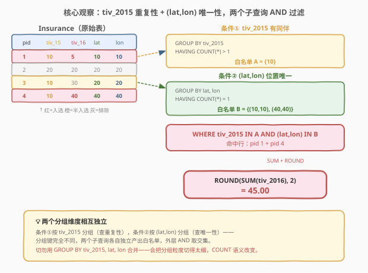
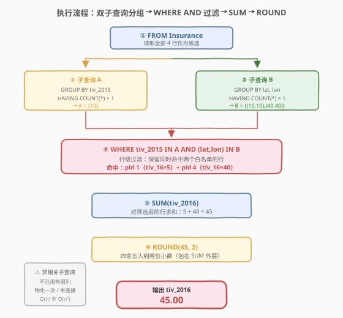
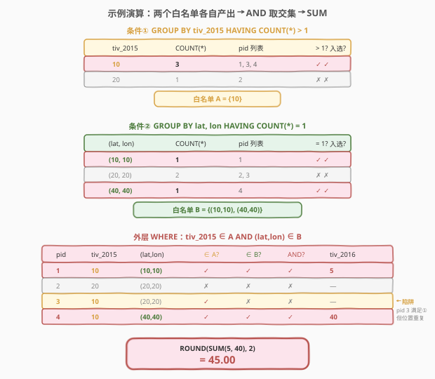

# LeetCode 2016年的投资 题解

> ⚠️ 本题为 LeetCode **Plus 会员专享题**，非会员无法在平台提交，但题意与解法值得掌握——它是 SQL **多条件过滤 + 分组计数判定**的经典母题，考察两个独立「存在性/唯一性」子查询的组合运用。

## 1. 题目概述

- **标题 / 题号**：2016年的投资（#585，medium）
- **链接**：https://leetcode.cn/problems/investments-in-2016/
- **难度**：中等
- **标签**：SQL、子查询、GROUP BY、HAVING、COUNT、多条件过滤、ROUND

**题意**：给定 `Insurance` 表，每行记录一名投保人的投保编号、2015 年投保金额、2016 年投保金额及所在城市经纬度。编写 SQL 查询，报告满足下述**两个条件**的投保人在 2016 年的投保金额之和：

1. **2015 年投保额有同伴**：该投保人的 `tiv_2015` 至少跟一个其他投保人相同（即 `tiv_2015` 值在表中出现次数 $\ge 2$）。
2. **城市位置唯一**：该投保人的 `(lat, lon)` 与其他任何投保人都不同（即 `(lat, lon)` 组合在表中出现次数 $= 1$）。

结果 `tiv_2016` 四舍五入保留两位小数。

**表结构**：

```text
Table: Insurance
+-------------+-------+
| Column Name | Type  |
+-------------+-------+
| pid         | int   |  ← 主键
| tiv_2015    | float |
| tiv_2016    | float |
| lat         | float |  ← 纬度（非空）
| lon         | float |  ← 经度（非空）
+-------------+-------+
```

> 💡 **关键约束**：`pid` 是主键（唯一），但 `tiv_2015` 和 `(lat, lon)` 都**不唯一**——多个投保人可以有相同的 2015 年投保额，也可以位于同一城市。两个条件分别考察 `tiv_2015` 的「重复性」和 `(lat, lon)` 的「唯一性」，是两个**相互独立**的过滤维度。

**示例 1**：

```text
输入：
Insurance 表:
+-----+----------+----------+-----+-----+
| pid | tiv_2015 | tiv_2016 | lat | lon |
+-----+----------+----------+-----+-----+
| 1   | 10       | 5        | 10  | 10  |
| 2   | 20       | 20       | 20  | 20  |
| 3   | 10       | 30       | 20  | 20  |
| 4   | 10       | 40       | 40  | 40  |
+-----+----------+----------+-----+-----+

输出：
+----------+
| tiv_2016 |
+----------+
| 45.00    |
+----------+
```

**解释**：

- **pid 1**（`tiv_2015=10`，`(10,10)`）：`tiv_2015=10` 出现 3 次（pid 1/3/4）✓；`(10,10)` 仅出现 1 次 ✓ → **入选**，贡献 `tiv_2016=5`。
- **pid 2**（`tiv_2015=20`，`(20,20)`）：`tiv_2015=20` 仅出现 1 次 ✗；`(20,20)` 出现 2 次（pid 2/3）✗ → **排除**（两条件均不满足）。
- **pid 3**（`tiv_2015=10`，`(20,20)`）：`tiv_2015=10` 出现 3 次 ✓；`(20,20)` 出现 2 次（pid 2/3）✗ → **排除**（位置与他人重复）。
- **pid 4**（`tiv_2015=10`，`(40,40)`）：`tiv_2015=10` 出现 3 次 ✓；`(40,40)` 仅出现 1 次 ✓ → **入选**，贡献 `tiv_2016=40`。

合计 $= 5 + 40 = 45.00$。

**约束**：

- `pid` 是 `Insurance` 表的主键。
- `lat`、`lon` 均不为空。
- 结果四舍五入到两位小数。

> 💡 本题是 SQL **「分组计数判定 + 多条件 AND 过滤」**的经典题。难点不在单个条件（`GROUP BY` + `COUNT` + `HAVING` 是基本功），而在**两个条件作用于不同的分组维度**（一个按 `tiv_2015` 分组、一个按 `(lat, lon)` 分组），且最终要在**行级**（而非组级）做筛选——这正是 `WHERE ... IN (子查询)` 的招牌场景。掌握「子查询算分组计数、外层 WHERE 筛行」这一范式，所有「行需满足某分组属性」类问题都能秒迁移。

## 2. 解题思路

### 2.1 暴力思路：过程式逐行判定

最直觉的做法是用程序逐行处理：对每一行投保人，扫描全表数 `tiv_2015` 相同的行数、再扫描全表数 `(lat, lon)` 相同的行数，两者都满足则累加 `tiv_2016`。伪代码如下：

```text
total = 0
for row in Insurance:
    tiv_cnt  = count(rows where tiv_2015 = row.tiv_2015)
    loc_cnt  = count(rows where lat = row.lat and lon = row.lon)
    if tiv_cnt > 1 and loc_cnt = 1:
        total += row.tiv_2016
return round(total, 2)
```

但**纯 SQL 没有显式循环**——上述「逐行查表计数」的模式，在 SQL 里有两个对应范式：**子查询 + WHERE IN**（声明式过滤）或**窗口函数 COUNT OVER**（行级附加计数）。

> ⚠️ 关键转换：把「数 `tiv_2015` 相同的行数」翻译成 `GROUP BY tiv_2015` + `HAVING COUNT(*) > 1`（筛出重复值集合）；把「数 `(lat, lon)` 相同的行数」翻译成 `GROUP BY lat, lon` + `HAVING COUNT(*) = 1`（筛出唯一位置集合）；外层用 `WHERE tiv_2015 IN (...) AND (lat, lon) IN (...)` 做行级过滤。两个子查询各管一个维度，互不干扰，最后 `AND` 串联。

### 2.2 核心观察：两个独立分组维度 + WHERE IN 行级过滤



**两条件解耦**：

| 条件 | 分组维度 | 聚合判定 | 子查询 | 含义 |
|------|----------|----------|--------|------|
| 条件 ① | `tiv_2015` | `COUNT(*) > 1` | `SELECT tiv_2015 FROM Insurance GROUP BY tiv_2015 HAVING COUNT(*) > 1` | 2015 年投保额有同伴 |
| 条件 ② | `(lat, lon)` | `COUNT(*) = 1` | `SELECT lat, lon FROM Insurance GROUP BY lat, lon HAVING COUNT(*) = 1` | 城市位置唯一 |

外层查询把两个子查询的结果当作「白名单」，用 `WHERE ... IN ... AND ... IN ...` 筛选同时命中两个白名单的行：

$$\text{result} = \text{ROUND}\!\left(\sum_{\substack{r \in \text{Insurance} \\ \text{cnt}(r.\text{tiv\_2015}) > 1 \\ \text{cnt}(r.\text{lat}, r.\text{lon}) = 1}} r.\text{tiv\_2016},\ 2\right)$$

> 💡 **为什么两个子查询是「独立的」？** 条件 ① 按 `tiv_2015` 分组、条件 ② 按 `(lat, lon)` 分组——**分组键完全不同**，两个子查询各自独立扫描全表、各自产出一份白名单，互不依赖。外层 `WHERE` 用 `AND` 取两份白名单的交集。这种「多维度条件各自分组、外层 AND 合并」的模式，是 SQL 处理「行需同时满足多个分组属性」的标准范式。切勿试图用一个 `GROUP BY` 同时处理两个维度——`GROUP BY tiv_2015, lat, lon` 会把分组粒度切得太细，`COUNT` 变成「同 `tiv_2015` 且同位置」的行数，与题意不符。

> ⚠️ **`(lat, lon)` 元组比较**：条件 ② 的 `WHERE` 用 `(lat, lon) IN (SELECT lat, lon ...)`——这是 SQL 的**元组 IN** 语法，等价于 `lat = x AND lon = y` 的逐组匹配。MySQL / PostgreSQL 均支持元组比较，比拆成两个 `IN`（`lat IN (...) AND lon IN (...)`）更精确——后者会错误地把「纬度匹配 A 行、经度匹配 B 行」的行也算入，而元组 IN 要求 `(lat, lon)` 作为一个整体出现在白名单中。

### 2.3 算法流程图



**逻辑执行顺序**（子查询先于外层 `WHERE` 求值）：

| 步骤 | 子句 | 作用 |
|------|------|------|
| ① | `FROM Insurance`（外层） | 读取源表全部行，作为待筛选候选 |
| ② | 子查询 A：`GROUP BY tiv_2015 HAVING COUNT(*) > 1` | 算出「有同伴」的 `tiv_2015` 值集合 |
| ③ | 子查询 B：`GROUP BY lat, lon HAVING COUNT(*) = 1` | 算出「位置唯一」的 `(lat, lon)` 组合集合 |
| ④ | `WHERE tiv_2015 IN (A) AND (lat, lon) IN (B)` | 行级过滤，保留同时命中两白名单的行 |
| ⑤ | `SUM(tiv_2016)` | 对筛选后的行求 2016 年投保额之和 |
| ⑥ | `ROUND(..., 2)` | 四舍五入到两位小数 |

> 💡 **子查询的求值时机**：`WHERE` 中的子查询属于**非相关子查询**（不引用外层列），优化器通常将其物化为临时表或转化为半连接（semi-join），只求值一次而非逐行求值。因此两个 `GROUP BY` 子查询各扫一遍全表 $O(n)$，外层过滤 $O(n)$，整体 $O(n)$（忽略排序）。详见第 4 节复杂度分析。

### 2.4 示例演算

以示例数据为例，观察两个子查询如何各自产出白名单，外层 `AND` 如何筛出最终行：



**条件 ①：`GROUP BY tiv_2015 HAVING COUNT(*) > 1`**

| tiv_2015 | 出现次数（pid 列表） | > 1? | 入选白名单? |
|----------|---------------------|------|------------|
| 10 | 3（pid 1, 3, 4） | ✓ | ✓ |
| 20 | 1（pid 2） | ✗ | ✗ |

→ 白名单 A $= \{10\}$

**条件 ②：`GROUP BY lat, lon HAVING COUNT(*) = 1`**

| (lat, lon) | 出现次数（pid 列表） | = 1? | 入选白名单? |
|------------|---------------------|------|------------|
| (10, 10) | 1（pid 1） | ✓ | ✓ |
| (20, 20) | 2（pid 2, 3） | ✗ | ✗ |
| (40, 40) | 1（pid 4） | ✓ | ✓ |

→ 白名单 B $= \{(10,10),\ (40,40)\}$

**外层 WHERE AND 过滤**：

| pid | tiv_2015 | (lat, lon) | tiv_2015 ∈ A? | (lat,lon) ∈ B? | AND 命中? | tiv_2016 |
|-----|----------|------------|---------------|----------------|----------|----------|
| 1 | 10 | (10, 10) | ✓（10 ∈ A） | ✓（(10,10) ∈ B） | **✓** | 5 |
| 2 | 20 | (20, 20) | ✗（20 ∉ A） | ✗（(20,20) ∉ B） | ✗ | — |
| 3 | 10 | (20, 20) | ✓（10 ∈ A） | ✗（(20,20) ∉ B） | ✗ | — |
| 4 | 10 | (40, 40) | ✓（10 ∈ A） | ✓（(40,40) ∈ B） | **✓** | 40 |

**求和**：$\text{SUM}(5, 40) = 45$ → `ROUND(45, 2)` $= 45.00$。

> 💡 **pid 3 是关键陷阱**：它满足条件 ①（`tiv_2015=10` 有同伴），但因 `(20,20)` 与 pid 2 重复而被条件 ② 排除。这正是「两条件独立 AND」的价值——只满足一个条件不够，必须两个都满足。初学者易误把条件 ② 写成 `COUNT(*) = 1` 作用于 `tiv_2015` 分组，或漏掉 `(lat, lon)` 的元组比较，导致 pid 3 错误入选。

## 3. 参考代码

### SQL（解法 A：双子查询 + WHERE IN，推荐）

```sql
SELECT ROUND(SUM(tiv_2016), 2) AS tiv_2016
FROM Insurance
WHERE tiv_2015 IN (
    SELECT tiv_2015
    FROM Insurance
    GROUP BY tiv_2015
    HAVING COUNT(*) > 1
)
  AND (lat, lon) IN (
    SELECT lat, lon
    FROM Insurance
    GROUP BY lat, lon
    HAVING COUNT(*) = 1
);
```

> 💡 **写法要点**：
> - 两个子查询各自 `GROUP BY` 一个维度 + `HAVING COUNT` 判定，产出白名单。
> - 外层 `WHERE` 用 `IN` 做行级过滤，`AND` 串联两个条件——语义清晰，直接对应题意。
> - `(lat, lon) IN (SELECT lat, lon ...)` 是**元组 IN**，要求 `(lat, lon)` 作为整体匹配，比拆成 `lat IN (...) AND lon IN (...)` 更精确（后者会误匹配跨行组合）。
> - `ROUND(SUM(tiv_2016), 2)` 先对筛选后的行求和再四舍五入——`SUM` 在 `WHERE` 之后、`ROUND` 在 `SUM` 之外，顺序符合 SQL 聚合语义。
> - 两个子查询是非相关子查询，优化器可物化或转半连接，各扫一遍全表。

### SQL（解法 B：窗口函数 COUNT OVER，单次扫描）

```sql
SELECT ROUND(SUM(tiv_2016), 2) AS tiv_2016
FROM (
    SELECT tiv_2016,
           COUNT(*) OVER (PARTITION BY tiv_2015) AS tiv_cnt,
           COUNT(*) OVER (PARTITION BY lat, lon) AS loc_cnt
    FROM Insurance
) t
WHERE tiv_cnt > 1 AND loc_cnt = 1;
```

> 💡 **窗口函数法**：用 `COUNT(*) OVER (PARTITION BY ...)` 给每行附上「同 `tiv_2015` 的行数」和「同 `(lat, lon)` 的行数」两个计数列——**不压行**，每行都带上两个分组的 `COUNT`。外层 `WHERE` 直接筛 `tiv_cnt > 1 AND loc_cnt = 1`。
>
> **对比解法 A**：
> - 优势：只需扫描一次源表（两个窗口函数共享一次 `PARTITION BY` 排序），逻辑更紧凑；无需 `IN` 半连接。
> - 代价：窗口函数需排序 $O(n \log n)$（按 `tiv_2015` 和按 `(lat, lon)` 各排一次），当数据量大时排序代价可能高于解法 A 的哈希分组。
> - 可读性：窗口列 `tiv_cnt`/`loc_cnt` 命名明确，筛选条件直观。
>
> 这与 [569. 员工薪水中位数](../0501-0600/569_员工薪水中位数.md) 中「窗口函数 = 不压行 + 跨行聚合」的思想一脉相承——`PARTITION BY` 保留行级信息，`COUNT OVER` 附加分组计数，`WHERE` 筛选。

### SQL（解法 C：双 JOIN，显式连接白名单）

```sql
SELECT ROUND(SUM(i.tiv_2016), 2) AS tiv_2016
FROM Insurance i
JOIN (
    SELECT tiv_2015
    FROM Insurance
    GROUP BY tiv_2015
    HAVING COUNT(*) > 1
) a ON i.tiv_2015 = a.tiv_2015
JOIN (
    SELECT lat, lon
    FROM Insurance
    GROUP BY lat, lon
    HAVING COUNT(*) = 1
) b ON i.lat = b.lat AND i.lon = b.lon;
```

> 💡 **JOIN 法**：把两个子查询的结果当作「白名单表」，用两次 `JOIN` 代替 `WHERE IN`。语义与解法 A 等价——`INNER JOIN` 天然只保留匹配行（等价于 `IN`），两次 `JOIN` 等价于 `AND`。
>
> **对比 `IN` vs `JOIN`**：
> - `IN` 更声明式、更贴近自然语言（「在白名单里」）。
> - `JOIN` 更显式地暴露连接关系，便于优化器选择连接策略（哈希连接 / 嵌套循环）。
> - 现代优化器通常把 `IN (非相关子查询)` 自动改写为半连接，性能与 `JOIN` 相当。
> - 本题白名单表小（去重后的分组数），两种写法性能差异可忽略，面试中首推解法 A（`IN` 更简洁）。

### Python（pandas）

```python
import pandas as pd

def find_investments(insurance: pd.DataFrame) -> pd.DataFrame:
    tiv_cnt = insurance.groupby('tiv_2015')['pid'].transform('count')
    loc_cnt = insurance.groupby(['lat', 'lon'])['pid'].transform('count')
    mask = (tiv_cnt > 1) & (loc_cnt == 1)
    total = round(insurance.loc[mask, 'tiv_2016'].sum(), 2)
    return pd.DataFrame({'tiv_2016': [total]})
```

> 💡 **pandas 对照**：`groupby('tiv_2015')['pid'].transform('count')` 对应 `COUNT(*) OVER (PARTITION BY tiv_2015)`——`transform` 把分组聚合结果**广播回每行**（不压行），与窗口函数 `OVER` 语义一致。`groupby(['lat','lon'])` 对应 `GROUP BY lat, lon`。`mask = (tiv_cnt > 1) & (loc_cnt == 1)` 对应 `WHERE tiv_cnt > 1 AND loc_cnt = 1`。`insurance.loc[mask, 'tiv_2016'].sum()` 对应 `SUM(tiv_2016)`（已过滤）。`round(..., 2)` 对应 `ROUND(..., 2)`。

## 4. 复杂度分析

| 维度 | 复杂度 | 说明 |
|------|--------|------|
| **时间（解法 A）** | $O(n)$ | $n$ = `Insurance` 行数。两个子查询各 `GROUP BY` 一次：有哈希索引时 $O(n)$，无索引需排序 $O(n \log n)$。外层 `WHERE IN` 做半连接 $O(n)$。`SUM` + `ROUND` $O(n)$。整体由分组主导 |
| **时间（解法 B）** | $O(n \log n)$ | 两个 `COUNT(*) OVER (PARTITION BY ...)` 各需按分组键排序 $O(n \log n)$；外层 `WHERE` + `SUM` $O(n)$。整体由窗口排序主导 |
| **空间** | $O(n)$ | 解法 A 物化两个白名单子查询结果 $O(k_1 + k_2)$（$k$ = 不同分组数 $\le n$）；解法 B 物化窗口列 $O(n)$ |
| **结果行数** | $O(1)$ | 单行单值（`tiv_2016` 之和） |

> ⚠️ **解法 A vs 解法 B 的性能权衡**：解法 A 的两个 `GROUP BY` 可走哈希聚合 $O(n)$（MySQL 8.0+ 优化器支持），解法 B 的窗口函数必须排序 $O(n \log n)$。数据量大时解法 A 通常更快；数据量小或分组键已有索引时差异可忽略。面试中首推解法 A（简洁 + 高效），解法 B 作为窗口函数功力的展示。

## 5. 扩展

### 5.1 `WHERE IN` vs `JOIN` vs 窗口函数：三种行级过滤范式

「行需满足某分组属性」是 SQL 高频模式，有三种等价写法：

| 写法 | 范式 | 特点 |
|------|------|------|
| `WHERE col IN (SELECT ... GROUP BY ... HAVING ...)` | 子查询白名单 | 最声明式，贴近自然语言 |
| `JOIN (SELECT ... GROUP BY ... HAVING ...) ON ...` | 显式连接白名单 | 暴露连接关系，优化器可选策略 |
| `COUNT(*) OVER (PARTITION BY ...) AS cnt` + `WHERE cnt ...` | 窗口函数附加列 | 单次扫描，行级计数不压行 |

```sql
-- 写法 1：WHERE IN（子查询白名单，推荐）
WHERE tiv_2015 IN (SELECT tiv_2015 ... GROUP BY tiv_2015 HAVING COUNT(*) > 1)

-- 写法 2：JOIN（显式连接白名单表）
JOIN (SELECT tiv_2015 ... GROUP BY tiv_2015 HAVING COUNT(*) > 1) a
  ON i.tiv_2015 = a.tiv_2015

-- 写法 3：窗口函数（行级附加计数）
SELECT ..., COUNT(*) OVER (PARTITION BY tiv_2015) AS tiv_cnt FROM ...
WHERE tiv_cnt > 1
```

> 💡 **三者的本质**：都是在「保留行级信息」的前提下，让每行「知道」自己所属分组的 `COUNT`。`IN` 和 `JOIN` 通过「白名单集合」间接传递（行不在白名单里就过滤掉）；窗口函数直接把 `COUNT` 作为列附加到每行。窗口函数最直观（计数就在行里），但需排序；`IN`/`JOIN` 借助分组聚合，可走哈希。面试中根据题意选最自然的写法——本题「有同伴 / 位置唯一」用 `HAVING COUNT` 判定最直接，`IN` 最简洁。

### 5.2 元组比较：`(lat, lon) IN` vs 拆分 `lat IN AND lon IN`

条件 ② 要求 `(lat, lon)` 作为整体唯一。两种写法看似等价，实则不同：

| 写法 | 语义 | 正确性 |
|------|------|--------|
| `(lat, lon) IN (SELECT lat, lon ...)` | 元组整体匹配 | ✓ 正确 |
| `lat IN (SELECT lat ...) AND lon IN (SELECT lon ...)` | 两列独立匹配 | ✗ 错误 |

```text
反例：假设有行 A=(lat=10, lon=20) 和行 B=(lat=20, lon=10)，两者位置不同。
- 元组 IN：(10,20) 和 (20,10) 是不同元组，各自唯一 → 正确判定。
- 拆分 IN：lat=10 ∈ {10,20} ✓ 且 lon=20 ∈ {20,10} ✓ → 误判 A「位置非唯一」。
```

> 💡 **元组比较的精度**：`(a, b) IN (SELECT x, y ...)` 要求 `(a, b)` 作为**有序对**出现在结果集中——即存在某行 `(x, y) = (a, b)`。拆成 `a IN (SELECT x) AND b IN (SELECT y)` 退化成「a 匹配某行的 x、b 匹配**另一行**的 y」，丢失了「同一行」的约束。涉及多列组合的唯一性/匹配判定，必须用元组比较或 `JOIN ON a=x AND b=y`。

### 5.3 从「分组取最值」到「分组属性过滤」的演进

| 题号 | 要求 | 核心范式 |
|------|------|----------|
| [511. 游戏玩法分析 I](../0501-0600/511_游戏玩法分析I.md) | 每玩家**首次登录**日期 | `GROUP BY` + `MIN`（分组取最值，压行输出） |
| [184. 部门工资最高的员工](../0101-0200/184_部门工资最高的员工.md) | 每部门**最高薪**员工 | `GROUP BY` + `MAX` + `JOIN` 回连（分组取最值 + 行级回查） |
| [185. 部门工资前三高](../0101-0200/185_部门工资前三高的所有员工.md) | 每部门**前 3 高** | `DENSE_RANK() OVER (PARTITION BY ...)` + `WHERE rn <= 3`（窗口排名筛行） |
| [569. 员工薪水中位数](../0501-0600/569_员工薪水中位数.md) | 每公司**中位数** | `ROW_NUMBER + COUNT OVER` + `WHERE rn BETWEEN`（窗口定位中间行） |
| **585** | **tiv_2015 有同伴 且 位置唯一** | **双 `GROUP BY` + `HAVING COUNT` + `WHERE IN AND`（分组属性过滤行）** |

> 💡 这一序列展示了 SQL「分组与行级筛选」的演进：从「分组取最值压行输出」（511）到「分组取最值后回连行」（184）到「窗口排名筛行」（185/569）到「分组计数属性过滤行」（585）。本题的独特之处在于**两个独立分组维度同时作用于行级**——`tiv_2015` 的重复性和 `(lat, lon)` 的唯一性是正交的两个条件，各自分组、外层 `AND` 合并，是「多维度行级过滤」的招牌题。

### 5.4 `ROUND` 的位置：先 SUM 再 ROUND

题目要求 `tiv_2016` 四舍五入到两位小数。`ROUND` 应包在 `SUM` **外层**：

```sql
-- ✓ 正确：先求和再四舍五入
SELECT ROUND(SUM(tiv_2016), 2) AS tiv_2016 FROM ...

-- ✗ 错误：先四舍五入再求和（每行先截断，累加误差）
SELECT SUM(ROUND(tiv_2016, 2)) AS tiv_2016 FROM ...
```

> 💡 **聚合与标量函数的顺序**：`SUM(ROUND(x, 2))` 先对每行 `x` 四舍五入再求和——若各行 `tiv_2016` 有多于两位小数，逐行截断会引入累积误差。`ROUND(SUM(x), 2)` 先精确求和再统一四舍五入——只截断一次，结果更精确。题目「`tiv_2016` 四舍五入的两位小数」指的是**最终结果**保留两位，故用 `ROUND(SUM(...), 2)`。这是 SQL 聚合题的通用细节——标量函数包在聚合外层，避免逐行截断误差。

## 6. 面试要点

1. **为什么不能写一个 `GROUP BY tiv_2015, lat, lon` 同时处理两个条件？**

   - `GROUP BY tiv_2015, lat, lon` 把分组粒度切到「同 `tiv_2015` 且同 `(lat, lon)`」的行——`COUNT(*)` 变成「2015 年投保额相同且位置也相同」的行数，而非题意要求的「`tiv_2015` 相同的行数」（条件 ①）和「`(lat, lon)` 相同的行数」（条件 ②）。两个条件考察**不同的分组维度**，必须用两个独立的 `GROUP BY`，外层 `AND` 合并。这是「多维度行级过滤」的核心——维度正交时各自分组，不能混为一谈。

2. **`(lat, lon) IN (SELECT lat, lon ...)` 和 `lat IN (...) AND lon IN (...)` 有什么区别？**

   - 元组 IN 要求 `(lat, lon)` 作为**有序对**整体出现在白名单中——即存在某行的 `(lat, lon)` 与当前行完全相同。拆分 IN 退化成「lat 匹配某行、lon 匹配另一行」，可能误判两个不同位置为「重复」。例如 `(10,20)` 和 `(20,10)` 是不同位置，元组 IN 正确判定各自唯一；拆分 IN 会因 `lat=10 ∈ {10,20}` 且 `lon=20 ∈ {20,10}` 而误判。涉及多列组合的唯一性判定，必须用元组比较。

3. **窗口函数解法（解法 B）和子查询解法（解法 A）哪个更好？**

   - 语义等价，性能略有差异。解法 A 的两个 `GROUP BY` 可走哈希聚合 $O(n)$；解法 B 的两个 `COUNT(*) OVER (PARTITION BY ...)` 需排序 $O(n \log n)$。数据量大时解法 A 通常更快；数据量小或分组键有序时差异可忽略。可读性上，解法 B 的窗口列 `tiv_cnt`/`loc_cnt` 命名直观，筛选条件一目了然；解法 A 的 `IN` 更贴近自然语言。面试中首推解法 A（简洁 + 高效），再提解法 B（展示窗口函数功力）。

4. **`ROUND` 应该包在 `SUM` 里面还是外面？**

   - 包在外面：`ROUND(SUM(tiv_2016), 2)`——先精确求和再统一四舍五入，只截断一次，结果精确。包在里面 `SUM(ROUND(tiv_2016, 2))` 会逐行截断再累加，引入累积误差。题目要求「最终结果四舍五入到两位小数」，指对求和结果取整，故用 `ROUND(SUM(...), 2)`。这是 SQL 聚合题的通用细节——标量函数包在聚合外层。

5. **两个子查询是相关子查询还是非相关子查询？对性能有什么影响？**

   - **非相关子查询**——两个子查询都不引用外层 `Insurance` 表的列，只依赖自身的 `GROUP BY`。优化器通常将其**物化**为临时表（求值一次），或改写为**半连接**（semi-join）与外层合并执行。因此不会逐行重复求值，性能为 $O(n)$（各扫一遍全表）。若误写成相关子查询（如 `WHERE tiv_2015 = (SELECT ... WHERE pid = 外层.pid)`），则每行都触发一次子查询，退化为 $O(n^2)$——应避免。

> 💡 **一句话总结**：585 是 SQL **多维度行级过滤**的经典题——核心是两个独立的 `GROUP BY` + `HAVING COUNT` 子查询各管一个维度（`tiv_2015` 重复性、`(lat, lon)` 唯一性），外层 `WHERE ... IN ... AND ... IN ...` 取交集筛行，最后 `ROUND(SUM(tiv_2016), 2)` 求和取整。考点在两个分组维度的解耦、元组 IN 的精确匹配、以及 `ROUND` 包在 `SUM` 外层的细节。窗口函数 `COUNT(*) OVER (PARTITION BY ...)` 是等价的优雅备选。

## 同类练习题

| # | 题目 | 与本题的关联 |
|---|------|-------------|
| 511 | [游戏玩法分析 I](https://leetcode.cn/problems/game-play-analysis-i/)（[站内题解](../0501-0600/511_游戏玩法分析I.md)） | `GROUP BY` + `MIN` 的最简母题。本题在其基础上升级为「分组计数判定 + 行级过滤」，从「分组取最值压行」到「分组属性筛行」 |
| 184 | [部门工资最高的员工](https://leetcode.cn/problems/department-highest-salary/)（[站内题解](../0101-0200/184_部门工资最高的员工.md)） | `GROUP BY` + `MAX` + `JOIN` 回连，对照本题的「子查询白名单 + WHERE IN」——同为「分组属性作用于行级」，184 取最值回连、585 取计数过滤 |
| 569 | [员工薪水中位数](https://leetcode.cn/problems/median-employee-salary/)（[站内题解](../0501-0600/569_员工薪水中位数.md)） | `ROW_NUMBER + COUNT OVER (PARTITION BY ...)` 窗口函数定位中位行，与本题解法 B 的 `COUNT(*) OVER (PARTITION BY ...)` 同属窗口函数行级计数家族 |
| 185 | [部门工资前三高的所有员工](https://leetcode.cn/problems/department-top-three-salaries/)（[站内题解](../0101-0200/185_部门工资前三高的所有员工.md)） | `DENSE_RANK() OVER (PARTITION BY ...)` + `WHERE rn <= 3` 窗口排名筛行，对照本题的 `HAVING COUNT` 分组计数筛行——两种「分组属性过滤行」范式 |
| 262 | [行程和用户](https://leetcode.cn/problems/trips-and-users/)（[站内题解](../0201-0300/262_行程和用户.md)） | `GROUP BY` + 条件聚合 + JOIN 过滤的 Hard 升级版，对照本题的「多条件 AND 过滤」——262 多一层 JOIN 关联用户表，585 在单表内双维度过滤 |
