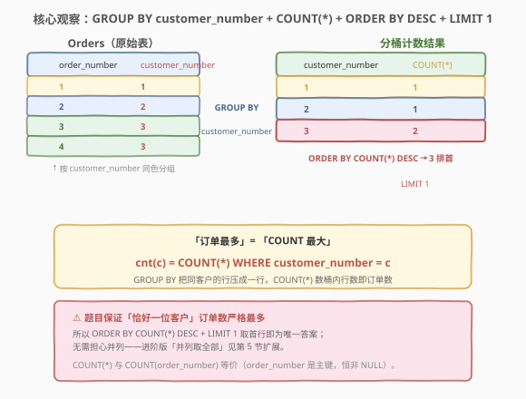
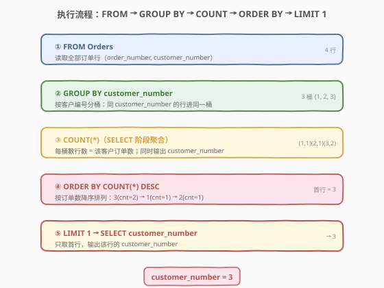
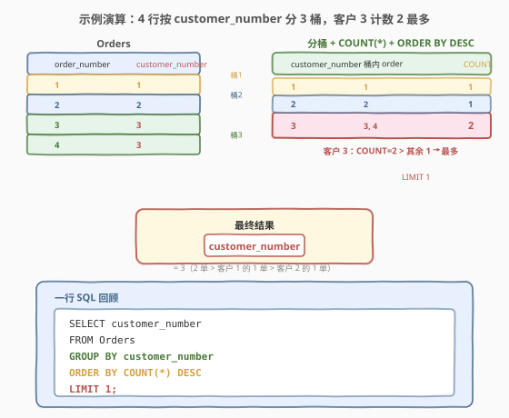

# LeetCode 订单最多的客户 题解

## 1. 题目概述

- **标题 / 题号**：订单最多的客户（#586，easy）
- **链接**：https://leetcode.cn/problems/customer-placing-the-largest-number-of-orders/
- **难度**：简单
- **标签**：SQL、聚合、GROUP BY、COUNT、ORDER BY、LIMIT

**题意**：给定 `Orders` 表，每行记录一个订单的编号 `order_number` 及下单客户的编号 `customer_number`。编写 SQL 查询，返回**下了最多订单**的客户的 `customer_number`。

**表结构**：

```text
Table: Orders
+-----------------+----------+
| Column Name     | Type     |
+-----------------+----------+
| order_number    | int      |  ← 主键
| customer_number | int      |
+-----------------+----------+
```

> 💡 **关键约束**：`order_number` 是主键（每行唯一一个订单）；`customer_number` **不唯一**——同一个客户可以下多笔订单，正是「订单数」可统计的来源。测试用例生成后，**恰好有一位客户**的订单数严格多于任何其他客户，所以答案唯一，无需处理并列。

**示例 1**：

```text
输入：
Orders 表:
+--------------+-----------------+
| order_number | customer_number |
+--------------+-----------------+
| 1            | 1               |
| 2            | 2               |
| 3            | 3               |
| 4            | 3               |
+--------------+-----------------+

输出：
+-----------------+
| customer_number |
+-----------------+
| 3               |
+-----------------+
```

**解释**：

- 客户 1 下 1 单（order_number=1）
- 客户 2 下 1 单（order_number=2）
- 客户 3 下 2 单（order_number=3、4）

客户 3 的订单数 2 > 其余客户的 1，故输出 `3`。

**约束**：

- `order_number` 是 `Orders` 表的主键
- 测试用例保证「恰好一位客户」订单数严格最多
- 结果列为 `customer_number`

> 💡 本题是 SQL **分组计数 + 排序取首行**的最简母题——把「每个客户下了多少单」翻译成 `GROUP BY customer_number` + `COUNT(*)`，再用 `ORDER BY COUNT(*) DESC LIMIT 1` 取订单最多者。它是 [511. 游戏玩法分析 I](../0501-0600/511_游戏玩法分析I.md) 分组聚合范式的直接延伸——从「每组取最值」升级为「每组计数再排序取最大」。难度在于理解「订单最多 = COUNT 最大」这层翻译，以及 `ORDER BY` 可直接引用聚合表达式而无需子查询。

## 2. 解题思路

### 2.1 暴力思路：过程式逐客户数订单

最直觉的做法是用程序逐个 `customer_number` 处理：遍历所有不同的客户编号，对每个客户扫描全部行数其订单数，记下最大值对应的客户。伪代码如下：

```text
counts = {}
for each row in Orders:
    c = row.customer_number
    counts[c] = counts.get(c, 0) + 1
best = argmax(counts, key=cnt)
return best
```

但**纯 SQL 没有显式循环语句**——上述「按客户分桶、桶内计数、取最大」的模式，在 SQL 里一一对应于 `GROUP BY` + `COUNT` + `ORDER BY` + `LIMIT`。

> ⚠️ 关键转换：把「按客户分桶」翻译成 `GROUP BY customer_number`（分桶）；「桶内数行数」翻译成 `COUNT(*)`（聚合）；「取订单最多者」翻译成 `ORDER BY COUNT(*) DESC LIMIT 1`（排序取首行）。这是 511「分组聚合」范式的直接延伸——只是把 `MIN` 换成 `COUNT`，并加 `ORDER BY + LIMIT` 取最值。

### 2.2 核心观察：GROUP BY customer_number + COUNT(*) + ORDER BY DESC + LIMIT 1



**四步合一**：

1. **`GROUP BY customer_number`**：把 `Orders` 的所有行按客户编号分桶——同一客户的所有订单行进入同一桶。
2. **`COUNT(*)`**：对每个桶数行数，即该客户的订单数。
3. **`ORDER BY COUNT(*) DESC`**：按订单数降序排列，订单最多的客户排在最前。
4. **`LIMIT 1`**：只取第一行——即订单数最大的那个客户。

$$\text{订单最多客户} = \arg\max_{c} \,\#\{\, r \in \text{Orders} : r.\text{customer\_number} = c \,\}$$

> 💡 **为什么 `ORDER BY` 里能直接写 `COUNT(*)`？** SQL 逻辑执行顺序为 `FROM → WHERE → GROUP BY → HAVING → SELECT → ORDER BY → LIMIT`。`ORDER BY` 在 `SELECT`（聚合）之后执行，此时 `COUNT(*)` 已计算完毕，可以直接引用聚合表达式或 `SELECT` 中定义的别名。所以无需把 `COUNT(*)` 包在子查询里——`ORDER BY COUNT(*) DESC` 一步到位。这与 [571. 给定数字的频率查询中位数](../0501-0600/571_给定数字的频率查询中位数.md)「窗口函数必须包子查询」不同——窗口函数在 `SELECT` 阶段计算但 `WHERE` 在其之前，而 `ORDER BY` 在 `SELECT` 之后，能直接用聚合。

> ⚠️ **`COUNT(*)` vs `COUNT(order_number)` vs `COUNT(customer_number)`**：本题三者等价——`order_number` 是主键恒非 NULL，`customer_number` 题目未允许为 NULL（每行必有客户）。`COUNT(*)` 数所有行，`COUNT(col)` 数 `col` 非 NULL 的行。本题每行都完整，所以结果相同，首推 `COUNT(*)`（语义最清晰：数桶内行数即订单数）。

### 2.3 算法流程图



**逻辑执行顺序**：

| 步骤 | 子句 | 作用 | 示例数据 |
|------|------|------|----------|
| ① | `FROM Orders` | 读取全部订单行 | 4 行 |
| ② | `GROUP BY customer_number` | 按客户编号分桶 | 3 桶 {1, 2, 3} |
| ③ | `COUNT(*)`（SELECT 阶段） | 每桶数行数 = 订单数 | (1,1), (2,1), (3,2) |
| ④ | `ORDER BY COUNT(*) DESC` | 按订单数降序 | 3(cnt=2) → 1(cnt=1) → 2(cnt=1) |
| ⑤ | `LIMIT 1` + `SELECT customer_number` | 取首行输出 | → 3 |

> 💡 **书写顺序 vs 执行顺序**：SQL 写作 `SELECT → FROM → GROUP BY → ORDER BY → LIMIT`，但执行顺序是 `FROM → GROUP BY → SELECT → ORDER BY → LIMIT`。理解这一点就能解释：为什么 `ORDER BY` 能用 `COUNT(*)`（聚合在 SELECT 阶段已完成）、为什么不能在 `WHERE` 里写 `COUNT(*)`（WHERE 在 GROUP BY 之前，聚合还没发生）。

### 2.4 示例演算

以示例数据为例，4 行按 `customer_number` 分为 3 桶，观察 `COUNT(*)` 如何逐桶统计订单数：



| customer_number（分组键） | 桶内 order_number | COUNT(*) | 排序后位次 |
|---------------------------|-------------------|----------|------------|
| 1 | 1 | **1** | 2（并列） |
| 2 | 2 | **1** | 3（并列） |
| 3 | 3, 4 | **2** | **1（最多）** |

`ORDER BY COUNT(*) DESC` 把客户 3（cnt=2）排到首行 → `LIMIT 1` 取出 → 输出 `customer_number = 3`。

> 💡 **「恰好一位」的保证**：题目承诺测试用例中「恰好一位客户」订单数严格最多——所以 `ORDER BY COUNT(*) DESC LIMIT 1` 取首行即为唯一答案，不会出现并列。若放宽这一假设（多位并列最多），`LIMIT 1` 只会取其中一个（取决于排序稳定性与 tie-breaker）——第 5 节讨论如何取**全部**并列最多者。

## 3. 参考代码

### SQL（解法 A：GROUP BY + COUNT + ORDER BY + LIMIT，推荐）

```sql
SELECT customer_number
FROM Orders
GROUP BY customer_number
ORDER BY COUNT(*) DESC
LIMIT 1;
```

> 💡 **写法要点**：
> - `GROUP BY customer_number` 按客户编号分桶，每个 `customer_number` 一组。
> - `ORDER BY COUNT(*) DESC` 直接在 `ORDER BY` 中写聚合表达式（无需子查询包裹），按订单数降序。
> - `LIMIT 1` 取第一行——订单最多的客户。
> - `SELECT customer_number` 只输出分组键，符合题目要求的单列结果。
> - 整个查询紧凑五行，是 SQL「分组计数取最值」的最简形态。

### SQL（解法 B：子查询先算计数，外层排序取首行）

```sql
SELECT customer_number
FROM (
    SELECT customer_number, COUNT(*) AS cnt
    FROM Orders
    GROUP BY customer_number
) t
ORDER BY cnt DESC
LIMIT 1;
```

> 💡 **写法要点**：
> - 内层子查询先算出每个客户的 `customer_number` 和 `cnt`（订单数），外层再 `ORDER BY cnt DESC LIMIT 1`。
> - 与解法 A 语义等价，区别在于把 `COUNT(*)` 显式放在子查询的 `SELECT` 中并赋予别名 `cnt`，外层 `ORDER BY` 引用别名而非重复写聚合表达式。
> - 可读性更好（计数有名字），但多一层子查询嵌套。面试中两种写法皆可，解法 A 更简洁。

### SQL（解法 C：ALL 子查询，纯关系演算风格）

```sql
SELECT customer_number
FROM Orders
GROUP BY customer_number
HAVING COUNT(*) >= ALL (
    SELECT COUNT(*)
    FROM Orders
    GROUP BY customer_number
);
```

> 💡 **写法要点**：
> - `ALL (子查询)` 表示「大于等于子查询返回的**所有**值」——即 `COUNT(*)` 必须不小于任何客户的订单数，等价于取最大值。
> - 这是纯关系演算的写法，不依赖 `ORDER BY + LIMIT`（某些 SQL 方言如 SQL Server 用 `TOP 1`、Oracle 用 `ROWNUM <= 1`，`ALL` 写法跨方言通用）。
> - 当有多位并列最多时，`ALL` 会**返回所有并列者**——这正好是第 5 节进阶问题的解法。
> - 缺点：子查询对全表再做一次 `GROUP BY`，代价约为解法 A 的两倍。

### Python（pandas）

```python
import pandas as pd

def largest_orders(orders: pd.DataFrame) -> pd.DataFrame:
    if orders.empty:
        return pd.DataFrame({'customer_number': [None]})
    cnt = orders.groupby('customer_number').size().reset_index(name='cnt')
    cnt = cnt.sort_values('cnt', ascending=False)
    return pd.DataFrame({'customer_number': [cnt.iloc[0]['customer_number']]})
```

> 💡 **pandas 对照**：`groupby('customer_number').size()` 对应 `GROUP BY customer_number` + `COUNT(*)`（`size()` 数每组行数）；`sort_values('cnt', ascending=False)` 对应 `ORDER BY COUNT(*) DESC`；`iloc[0]` 对应 `LIMIT 1`。注意 `groupby` 默认排除分组键为 NaN 的行，本题无 NaN，行为与 SQL 一致。空表时返回 `None`（对应 SQL 空结果）。

## 4. 复杂度分析

| 维度 | 复杂度 | 说明 |
|------|--------|------|
| **时间（解法 A）** | $O(n)$ ~ $O(n \log n)$ | $n$ = `Orders` 行数。`GROUP BY customer_number` 需分组：有索引时 $O(n)$，无索引需排序 $O(n \log n)$；组内 `COUNT` 一次线性扫描总计 $O(n)$；`ORDER BY COUNT(*) DESC` 对 $k$ 个分组结果排序 $O(k \log k)$，$k$ = 不同客户数 $\le n$。整体由分组排序主导 |
| **时间（解法 C ALL 子查询）** | $O(n \log n)$ | 子查询对全表再做一次 `GROUP BY`，约为解法 A 的两倍；`ALL` 比较对 $k$ 个组各比对 $k$ 次，$O(k^2)$，但 $k \ll n$ 时常可忽略 |
| **空间** | $O(n)$ | 分组/排序缓冲区；中间结果集 $O(k)$，$k$ = 不同客户数 |
| **结果行数** | $O(1)$ | 单个 `customer_number` 值 |

> ⚠️ **`GROUP BY` 的代价取决于 `customer_number` 是否有索引**：有索引时可走「索引有序扫描」近似 $O(n)$；无索引则需对全表排序 $O(n \log n)$。`ORDER BY COUNT(*) DESC` 只对 $k$ 个分组结果排序，$k \ll n$ 时代价可忽略。面试中说明「`GROUP BY` 需分组 $O(n \log n)$，`COUNT` 组内线性扫描，给 `customer_number` 建索引能加速」即可。注意 `order_number` 是主键（MySQL 聚簇索引），但 `customer_number` 默认无索引——若数据量大可考虑为 `customer_number` 建普通索引。

## 5. 扩展：并列最多时取全部客户

### 5.1 进阶问题

题目进阶问：**如果有多位顾客订单数并列最多，你能找到他们所有的 `customer_number` 吗？**

`ORDER BY COUNT(*) DESC LIMIT 1` 只取首行，会漏掉并列者。取全部并列最多者有两种经典写法：

```sql
-- 写法 1：HAVING + ALL 子查询（关系演算风格，跨方言通用）
SELECT customer_number
FROM Orders
GROUP BY customer_number
HAVING COUNT(*) >= ALL (
    SELECT COUNT(*)
    FROM Orders
    GROUP BY customer_number
);

-- 写法 2：HAVING + 子查询 MAX（更直观，推荐）
SELECT customer_number
FROM Orders
GROUP BY customer_number
HAVING COUNT(*) = (
    SELECT MAX(cnt) FROM (
        SELECT COUNT(*) AS cnt
        FROM Orders
        GROUP BY customer_number
    ) t
);
```

> 💡 **写法 1 的 `ALL`**：`COUNT(*) >= ALL (子查询)` 意为「本组的计数不小于子查询返回的任何一个值」——即等于最大值。`ALL` 是 SQL 标准的关系比较量词，与 `ANY`/`SOME` 对偶。写法 2 把「最大值」显式算出来再 `HAVING COUNT(*) = max_cnt`，更易读。两者语义等价。

### 5.2 窗口函数取全部并列者

```sql
SELECT customer_number
FROM (
    SELECT customer_number,
           RANK() OVER (ORDER BY COUNT(*) DESC) AS rk
    FROM Orders
    GROUP BY customer_number
) t
WHERE rk = 1;
```

> 💡 **`RANK` vs `DENSE_RANK` vs `ROW_NUMBER`**：并列场景下三者行为不同——`ROW_NUMBER` 给并列者不同编号（只取一个 `rk=1`）；`RANK` 给并列者相同编号但跳过后续名次（并列第一后直接是第三，取 `rk=1` 得全部并列者）；`DENSE_RANK` 给并列者相同编号且不跳名次（并列第一后是第二）。本题取全部并列最多者用 `RANK` 或 `DENSE_RANK` 均可（只要 `rk=1`），`ROW_NUMBER` 不行。

### 5.3 从「取一个」到「取全部并列」的演进

| 需求 | 解法 | 返回行数 |
|------|------|----------|
| 取一个最多者（本题） | `ORDER BY COUNT(*) DESC LIMIT 1` | 1 行 |
| 取全部并列最多者（进阶） | `HAVING COUNT(*) = (SELECT MAX(cnt) ...)` 或 `RANK() OVER (...) WHERE rk=1` | ≥1 行 |
| 取第 N 多者 | `ORDER BY COUNT(*) DESC LIMIT 1 OFFSET N-1` 或 `DENSE_RANK() OVER (...) WHERE rk=N` | 1 行或并列多行 |

> 💡 **选择口诀**：只要「Top-1 且保证唯一」用 `ORDER BY + LIMIT`（最简）；要「全部并列」用 `HAVING = MAX` 或 `RANK`；要「第 N 名」用 `OFFSET` 或 `DENSE_RANK`。本题是第一种，所以 `ORDER BY + LIMIT 1` 是最优解。

## 6. 面试要点

1. **为什么 `ORDER BY` 里能直接写 `COUNT(*)` 而不需要子查询？**

   - SQL 逻辑执行顺序为 `FROM → WHERE → GROUP BY → HAVING → SELECT → ORDER BY → LIMIT`。`ORDER BY` 在 `SELECT`（聚合）之后执行——此时 `COUNT(*)` 已对每个分组计算完毕，可以直接引用聚合表达式或 `SELECT` 中定义的别名。这与窗口函数不同——窗口函数在 `SELECT` 阶段计算，若要用 `WHERE` 筛选窗口结果必须包子查询（因 `WHERE` 在 `SELECT` 之前）。本题只用 `ORDER BY + LIMIT`，不涉及 `WHERE` 筛选聚合结果，无需子查询。

2. **`COUNT(*)`、`COUNT(order_number)`、`COUNT(customer_number)` 有何区别？**

   - `COUNT(*)` 数**所有行**（含 NULL 行）；`COUNT(col)` 数 `col` **非 NULL** 的行。本题 `order_number` 是主键恒非 NULL，`customer_number` 每行必有（订单必有客户），所以三者结果完全相同。首推 `COUNT(*)`——语义最清晰（数桶内行数即订单数），且不依赖某列是否允许 NULL。

3. **`LIMIT 1` 取首行时，若有并列最多会取哪个？**

   - 题目保证「恰好一位客户」订单数严格最多，所以不会并列。但若放宽假设，`ORDER BY COUNT(*) DESC` 对同计数的组排序是**未定义**的（SQL 标准不保证稳定性），`LIMIT 1` 取到的可能是任意一个并列者。要确定性地取全部并列者，需用第 5 节的 `HAVING = MAX` 或 `RANK()` 写法。生产环境中应在 `ORDER BY` 加 tie-breaker（如 `ORDER BY COUNT(*) DESC, customer_number ASC`）让结果可复现。

4. **`GROUP BY customer_number` 后 `SELECT customer_number` 为什么合法？**

   - `customer_number` 是 `GROUP BY` 的分组键，每组唯一——SQL 标准允许直接 `SELECT` 分组键（无需聚合函数）。非分组键（如 `order_number`）则必须套聚合函数才能出现在 `SELECT` 中，否则开启 `ONLY_FULL_GROUP_BY` 模式会报错。本题只输出分组键 `customer_number`，完全合法。

5. **如何取「订单第 N 多」的客户？**

   - 两种写法：① `ORDER BY COUNT(*) DESC LIMIT 1 OFFSET N-1`（跳过前 N-1 行取第 N 行，但并列时行为不稳定）；② `DENSE_RANK() OVER (ORDER BY COUNT(*) DESC) WHERE rk=N`（窗口函数，并列者同号且不跳名次，取 `rk=N` 得全部并列第 N 者）。推荐窗口函数写法，语义更清晰且能处理并列。

> 💡 **一句话总结**：586 是 SQL **分组计数 + 排序取首行**的最简母题——核心就一句 `GROUP BY customer_number` + `ORDER BY COUNT(*) DESC` + `LIMIT 1`。考点在「订单最多 = COUNT 最大」的翻译、`ORDER BY` 可直接引用聚合表达式（无需子查询）、以及 `COUNT(*)` 与 `COUNT(col)` 的等价性。进阶版「取全部并列」用 `HAVING = MAX` 或 `RANK()`。

## 同类练习题

| # | 题目 | 与本题的关联 |
|---|------|-------------|
| 511 | [游戏玩法分析 I](https://leetcode.cn/problems/game-play-analysis-i/)（[站内题解](../0501-0600/511_游戏玩法分析I.md)） | `GROUP BY` + `MIN` 的最简母题。本题在其基础上把聚合函数从 `MIN` 换成 `COUNT`、并加 `ORDER BY + LIMIT` 取最值，是 511 范式的直接升级 |
| 578 | [查询回答率最高的问题](https://leetcode.cn/problems/get-highest-answer-rate-question/)（[站内题解](../0501-0600/578_查询回答率最高的问题.md)） | 同样「分组 + 排序取首行」骨架，但聚合函数升级为条件 `SUM(IF(...))` 算比率，比本题多一层条件计数 |
| 570 | [至少有5名直接下属的经理](https://leetcode.cn/problems/managers-with-at-least-5-direct-reports/)（[站内题解](../0501-0600/570_至少有5名直接下属的经理.md)） | `GROUP BY` + `COUNT` + `HAVING` 阈值过滤，与本题同为「分组计数」家族，对比 `HAVING`（组级过滤）与 `ORDER BY + LIMIT`（取最值）两种组后处理方式 |
| 184 | [部门工资最高的员工](https://leetcode.cn/problems/department-highest-salary/) | `GROUP BY` 分组取最值 + JOIN 回表取详情，是本题「分组取最大」的 JOIN 进阶版（还要输出最大值所在行的其他列） |
| 185 | [部门工资前三高的所有员工](https://leetcode.cn/problems/department-top-three-salaries/) | `DENSE_RANK() OVER (PARTITION BY ...)` 取每组 Top-N，是本题「Top-1」升级为「Top-N」的窗口函数进阶版 |
