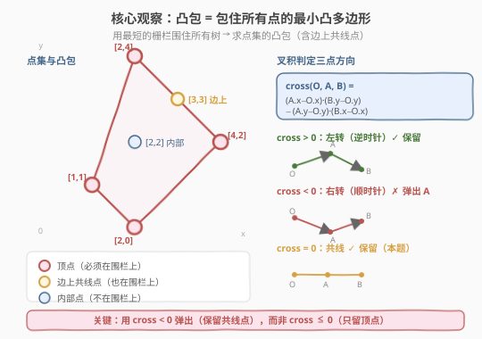
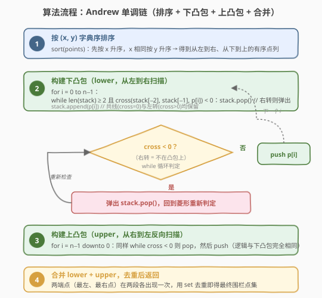
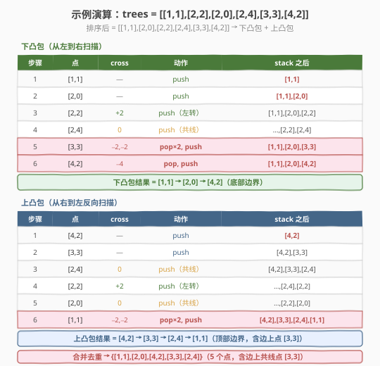

# LeetCode 安装栅栏 题解

## 1. 题目概述

- **标题 / 题号**：安装栅栏（#587，hard）
- **链接**：https://leetcode.cn/problems/erect-the-fence/
- **难度**：困难
- **标签**：几何、排序、单调链、凸包

**题意**：给定一个数组 `trees`，其中 `trees[i] = [xi, yi]` 表示花园中一棵树的坐标。你需要用**最短长度的绳子**把花园围起来，使得所有树都在围栏内部或围栏上。围栏必须是**凸多边形**（围栏是凸的）。返回恰好位于围栏上的树的坐标列表（顺序不限）。

**示例 1**：

```text
输入：trees = [[1,1],[2,2],[2,0],[2,4],[3,3],[4,2]]
输出：[[1,1],[2,0],[3,3],[2,4],[4,2]]
解释：围栏构成凸多边形，5 棵树在围栏上（含边上共线点 [3,3]），[2,2] 在内部。
```

**示例 2**：

```text
输入：trees = [[1,2],[2,2],[4,2]]
输出：[[4,2],[2,2],[1,2]]
解释：所有树共线，围栏退化为线段，3 棵树全在围栏上。
```

**约束**：

- `1 <= points.length <= 300`
- `0 <= points[i][0], points[i][1] <= 100`
- 所有 `points[i]` 互不相同

> 💡 **核心**：这是经典的**凸包（Convex Hull）**问题——求包围所有点的最小凸多边形。题目要求返回围栏上的**所有点**（包括边上共线的点），而非仅顶点。最优解是 **Andrew 单调链算法**，$O(n \log n)$ 时间、$O(n)$ 空间。



## 2. 解题思路

### 2.1 暴力思路

对每对点 $(i, j)$，检查所有其他点是否都在直线 $ij$ 的**同一侧**（用叉积判定）。若是，则 $i$、$j$ 都在凸包边上。遍历所有 $O(n^2)$ 对点，每对检查 $O(n)$ 个点，总时间 $O(n^3)$。对 $n = 300$ 虽能过，但不够优雅且难以正确处理共线点。

### 2.2 核心观察：Andrew 单调链

**关键工具——叉积（Cross Product）**：

对三个点 $O, A, B$，叉积定义为：

$$\text{cross}(O, A, B) = (A_x - O_x)(B_y - O_y) - (A_y - O_y)(B_x - O_x)$$

叉积的几何含义是向量 $\vec{OA}$ 与 $\vec{OB}$ 的有向面积（$z$ 分量）：

- $\text{cross} > 0$：$B$ 在 $\vec{OA}$ 的**左侧**（从 $O \to A \to B$ 为逆时针/左转）
- $\text{cross} < 0$：$B$ 在 $\vec{OA}$ 的**右侧**（顺时针/右转）
- $\text{cross} = 0$：三点**共线**

**单调链算法思想**：

1. 将所有点按 $(x, y)$ 字典序排序（先 $x$ 后 $y$）。
2. **下凸包**：从左到右扫描，维护一个栈。当栈顶两点与新点构成**右转**（$\text{cross} < 0$）时，弹出栈顶（它不在凸包上）。左转和共线都保留。
3. **上凸包**：从右到左反向扫描，逻辑完全相同。
4. 合并下凸包和上凸包，去重（两端点各被两段包含一次）。

> ⚠️ **本题关键**：题目要求返回围栏上的**所有树**，包括边上共线的点。因此弹出条件用 $\text{cross} < 0$（**严格**右转才弹），而非 $\text{cross} \le 0$。后者会丢弃边上共线点，只留顶点。



### 2.3 为什么排序后单调扫描就能求出凸包？

排序后，点从左到右排列。下凸包是凸包的**下半部分**——从最左点到最右点，沿着底部走。在从左到右扫描时：

- 新点总是更靠右，如果栈顶两点与新点构成右转，说明栈顶点"凹进去了"（在凸包内部上方），应当移除。
- 弹出后继续检查新的栈顶，直到左转或栈中不足两点。
- 共线点（$\text{cross} = 0$）保留，因为它们在围栏边上。

上凸包是对称的：从右到左扫描，得到凸包的上半部分。

两段拼接后，正好围成完整的凸多边形。

### 2.4 示例演算

以 `trees = [[1,1],[2,2],[2,0],[2,4],[3,3],[4,2]]` 为例：

排序后：`[[1,1],[2,0],[2,2],[2,4],[3,3],[4,2]]`



**下凸包**（从左到右）：

| 步骤 | 当前点 | cross 判定 | 动作 | 栈状态 |
|------|--------|-----------|------|--------|
| 1 | [1,1] | — | push | [1,1] |
| 2 | [2,0] | — | push | [1,1],[2,0] |
| 3 | [2,2] | +2（左转） | push | [1,1],[2,0],[2,2] |
| 4 | [2,4] | 0（共线） | push | [1,1],[2,0],[2,2],[2,4] |
| 5 | [3,3] | −2, −2（右转×2） | pop [2,4], pop [2,2], push | [1,1],[2,0],[3,3] |
| 6 | [4,2] | −4（右转） | pop [3,3], push | **[1,1],[2,0],[4,2]** |

步骤 5 是关键：处理 [3,3] 时，先检查 [2,2]→[2,4]→[3,3] 为右转（$\text{cross}=-2$），弹出 [2,4]；再检查 [2,0]→[2,2]→[3,3] 仍为右转（$\text{cross}=-2$），弹出 [2,2]；最后 [2,0]→[3,3] 栈中不足两点，push [3,3]。

**上凸包**（从右到左，扫描 [4,2]→[3,3]→[2,4]→[2,2]→[2,0]→[1,1]）：

| 步骤 | 当前点 | cross 判定 | 动作 | 栈状态 |
|------|--------|-----------|------|--------|
| 1 | [4,2] | — | push | [4,2] |
| 2 | [3,3] | — | push | [4,2],[3,3] |
| 3 | [2,4] | 0（共线） | push | [4,2],[3,3],[2,4] |
| 4 | [2,2] | +2（左转） | push | [4,2],[3,3],[2,4],[2,2] |
| 5 | [2,0] | 0（共线） | push | [4,2],[3,3],[2,4],[2,2],[2,0] |
| 6 | [1,1] | −2, −2（右转×2） | pop [2,0], pop [2,2], push | **[4,2],[3,3],[2,4],[1,1]** |

注意步骤 3：[3,3] 在边 [4,2]→[2,4] 上（$\text{cross}=0$），因为用 $\text{cross} < 0$ 判定（共线不弹），[3,3] 被保留在围栏上——这正是本题要求。

**合并去重**：下凸包 `[1,1],[2,0],[4,2]` + 上凸包 `[4,2],[3,3],[2,4],[1,1]`，去掉重复的 [4,2] 和 [1,1]，最终 5 个点：`{[1,1],[2,0],[4,2],[3,3],[2,4]}`，与预期一致。

## 3. 参考代码

### C++

```cpp
class Solution {
  public:
    vector<vector<int>> outerTrees(vector<vector<int>>& trees) {
        int n = trees.size();
        if (n <= 3) return trees;

        sort(trees.begin(), trees.end(), [](const auto& a, const auto& b) {
            return a[0] == b[0] ? a[1] < b[1] : a[0] < b[0];
        });

        auto cross = [](const vector<int>& o, const vector<int>& a,
                        const vector<int>& b) -> long long {
            return (long long)(a[0] - o[0]) * (b[1] - o[1]) -
                   (long long)(a[1] - o[1]) * (b[0] - o[0]);
        };

        // 下凸包：从左到右
        vector<vector<int>> lower;
        for (int i = 0; i < n; i++) {
            while (lower.size() >= 2 &&
                   cross(lower[lower.size() - 2], lower[lower.size() - 1],
                         trees[i]) < 0)
                lower.pop_back();
            lower.push_back(trees[i]);
        }

        // 上凸包：从右到左
        vector<vector<int>> upper;
        for (int i = n - 1; i >= 0; i--) {
            while (upper.size() >= 2 &&
                   cross(upper[upper.size() - 2], upper[upper.size() - 1],
                         trees[i]) < 0)
                upper.pop_back();
            upper.push_back(trees[i]);
        }

        // 合并去重（两端点在两段各出现一次）
        set<vector<int>> seen(lower.begin(), lower.end());
        seen.insert(upper.begin(), upper.end());
        return vector<vector<int>>(seen.begin(), seen.end());
    }
};
```

### Python

```python
class Solution:
    def outerTrees(self, trees: List[List[int]]) -> List[List[int]]:
        def cross(o, a, b):
            return (a[0] - o[0]) * (b[1] - o[1]) - (a[1] - o[1]) * (b[0] - o[0])

        trees.sort()  # 字典序排序
        n = len(trees)
        if n <= 3:
            return trees

        # 下凸包：从左到右
        lower = []
        for i in range(n):
            while len(lower) >= 2 and cross(lower[-2], lower[-1], trees[i]) < 0:
                lower.pop()
            lower.append(trees[i])

        # 上凸包：从右到左
        upper = []
        for i in range(n - 1, -1, -1):
            while len(upper) >= 2 and cross(upper[-2], upper[-1], trees[i]) < 0:
                upper.pop()
            upper.append(trees[i])

        # 合并去重
        seen = set()
        ans = []
        for p in lower + upper:
            t = (p[0], p[1])
            if t not in seen:
                seen.add(t)
                ans.append(p)
        return ans
```

> 💡 **`n <= 3` 直接返回**：3 个及以下的点必然全在凸包上（三角形或退化情况），无需进入算法。`set` 去重处理下凸包和上凸包共享的左右端点。

## 4. 复杂度分析

| 维度 | 复杂度 | 说明 |
|------|--------|------|
| 时间复杂度 | $O(n \log n)$ | 排序 $O(n \log n)$；下/上凸包各扫描一趟，每个点至多入栈 1 次出栈 1 次（均摊 $O(n)$），总计 $O(n \log n)$ |
| 空间复杂度 | $O(n)$ | 下凸包栈 $O(n)$ + 上凸包栈 $O(n)$ + 去重集合 $O(n)$，总计 $O(n)$ |

> ⚠️ 排序是瓶颈：$O(n \log n)$。扫描部分虽然 `while` 嵌套在 `for` 里，但均摊 $O(n)$——每个点至多被弹一次。叉积用 `long long` 防溢出（坐标差 $\le 100$，积 $\le 10^4$，实际 `int` 足够，但 `long long` 更稳妥）。

## 5. 扩展：其他凸包算法对比

| 算法 | 时间 | 思路 | 特点 |
|------|------|------|------|
| **Andrew 单调链**（本文） | $O(n \log n)$ | 字典序排序 + 上下凸包 | 不需极角计算，实现简洁，最推荐 |
| **Graham Scan** | $O(n \log n)$ | 选最下点 → 按极角排序 → 栈扫描 | 需极角排序（用叉积比较器），实现稍复杂 |
| **Jarvis March（包装法）** | $O(nh)$ | 每次从当前点选最"外"的点 | $h$ 为凸包顶点数；$h$ 小时快，最坏 $O(n^2)$ |

**`cross < 0` vs `cross <= 0`**：

- `cross < 0`（本文）：保留共线点，返回围栏上**所有点**（本题要求）。
- `cross <= 0`：弹出共线点，只返回凸包**顶点**（适用于只求顶点的场景，如 [469. 凸多边形](https://leetcode.cn/problems/convex-polygon/) 判定）。

## 6. 面试要点

1. **为什么用 Andrew 单调链而不是 Graham Scan？**
   - Andrew 用**字典序排序**（`sort`），无需计算极角；Graham 需要选基准点 + 极角排序（叉积比较器），实现更易出错且对共线点处理更复杂。两者时间复杂度相同，Andrew 更简洁。

2. **`cross < 0` 和 `cross <= 0` 的区别？**
   - `cross < 0`：只在严格右转时弹出，**保留共线点**——返回围栏上所有点（本题要求）。
   - `cross <= 0`：共线也弹出，**只留顶点**——适用于只求凸包顶点的场景。

3. **为什么下凸包和上凸包用相同的弹出条件？**
   - 下凸包从左到右扫描，要求链**左转**（逆时针）；上凸包从右到左扫描，同样要求链**左转**。方向虽然相反，但从各自扫描方向看，"保持凸性"的判定条件完全一致——都是弹出右转点。

4. **为什么要去重？合并时哪些点会重复？**
   - 最左点和最右点既是下凸包的端点，也是上凸包的端点，因此各出现两次。用 `set` 或哈希表去重即可。如果用 `lower[:-1] + upper[:-1]` 也可避免重复，但共线点在端点处可能遗漏，`set` 去重更稳妥。

5. **所有点共线时算法正确吗？**
   - 正确。共线时 $\text{cross} = 0$ 恒成立，不弹出任何点。下凸包包含所有点（从左到右），上凸包也包含所有点（从右到左），去重后恰好返回所有点——符合"围栏退化为线段，所有树都在线上"的预期。

## 同类练习题

| # | 题目 | 与本题的关联 |
|---|------|-------------|
| 469 | [凸多边形](https://leetcode.cn/problems/convex-polygon/) | 用叉积判定多边形是否为凸（相邻边叉积同号），与本文叉积工具同源 |
| 149 | [直线上最多的点数](https://leetcode.cn/problems/max-points-on-a-line/)（[题解](../0001-0100/149_直线上最多的点数.md)） | 用叉积判定三点共线（$\text{cross}=0$），与凸包共线判定同工具 |
| 1039 | [多边形三角剖分的最低得分](https://leetcode.cn/problems/minimum-score-triangulation-of-polygon/) | 在凸多边形顶点上做区间 DP，承接凸包的几何背景 |
| 973 | [最接近原点的 K 个点](https://leetcode.cn/problems/k-closest-points-to-origin/) | 点集排序的另一种应用（按距离排序而非字典序），对照不同的排序驱动场景 |
