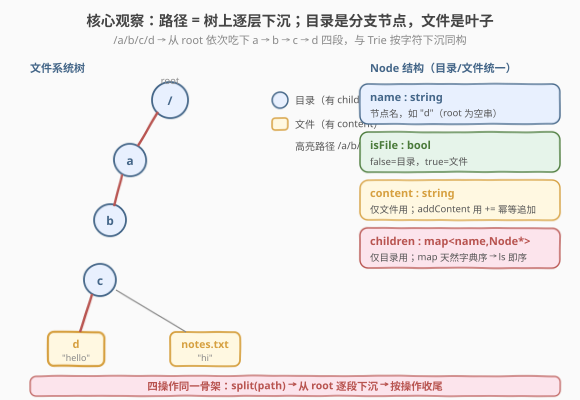

# 设计内存文件系统

- **题目名称**：设计内存文件系统
- **链接**：[588. 设计内存文件系统](https://leetcode.cn/problems/design-in-memory-file-system/)
- **难度**：困难
- **标签**：设计、字典树、哈希表、字符串

## 1. 题目概述

设计一个**内存文件系统**，支持四类操作：列目录、建目录、写文件、读文件。所有路径都是**绝对路径**（以 `/` 开头），目录与文件名仅含字母数字与 `.`、`_`、`-`。

实现 `FileSystem` 类：

- `vector<string> ls(string path)`
  - 若 `path` 是**文件**，返回只含该文件名本身的列表；
  - 若 `path` 是**目录**，返回该目录下所有文件与子目录名，按**字典序**升序。
- `void mkdir(string path)`：按路径新建目录；若中间目录不存在，一并创建。
- `void addContentToFile(string filePath, string content)`
  - 文件不存在则创建并写入 `content`；
  - 文件已存在则把 `content` **追加**到原内容末尾。
- `string readContentFromFile(string filePath)`：返回文件内容。

**示例 1**：

```text
输入：
["FileSystem","ls","mkdir","addContentToFile","ls","readContentFromFile"]
[[],["/"],["/a/b/c"],["/a/b/c/d","hello"],["/"],["/a/b/c/d"]]
输出：[null,[],null,null,["a"],null,"hello"]

解释：
ls("/")                         → []            （根目录为空）
mkdir("/a/b/c")                  → 一并建出 a、b、c 三级目录
addContentToFile("/a/b/c/d","hello") → 在 c 下建文件 d，内容 "hello"
ls("/")                         → ["a"]         （根下只有 a）
readContentFromFile("/a/b/c/d") → "hello"
```

**示例 2**：

```text
输入：
["FileSystem","mkdir","ls","ls","mkdir","ls","addContentToFile","readContentFromFile",
 "addContentToFile","readContentFromFile","ls"]
[[],["/a/b/c"],["/a"],["/a/b"],["/a/b/c/foo"],["/a/b/c"],["/a/b/c/d","hello world"],
 ["/a/b/c/d"],["/a/b/c/d","鸭鸭你好"],["/a/b/c/d"],["/a/b/c"]]
输出：
[null,null,["b"],["c"],["foo"],["d"],"hello world","hello world鸭鸭你好",
 "hello world鸭鸭你好",["d","foo"]]
```

**约束条件**：

- $1 \le \text{path.length}, \text{filePath.length} \le 100$
- 路径均为绝对路径，以 `/` 开头；
- 文件/目录名仅含字母数字与 `.`、`_`、`-`；
- $1 \le \text{content.length} \le 50$；
- `ls`、`mkdir`、`addContentToFile`、`readContentFromFile` 总调用次数 $\le 2 \times 10^4$；
- 输入路径始终合法。

> 💡 **题目本质**：这是一道**数据结构设计题**，不是算法题。核心抉择是「用什么结构存层级」。最自然的建模是**多叉树 / 字典树（Trie）**：每个节点要么是目录（有 `children` 字典），要么是文件（有 `content` 字符串）。一条路径 `/a/b/c/d` 就是「从 root 出发，依次吃下 `a → b → c → d` 四段」的下沉过程——与 Trie 按字符下沉完全同构，只是这里按**路径分段**而非按字符。

---

## 2. 解题思路

### 2.1 暴力思路：两张扁平表

最直觉的存法：维护两张**以完整路径字符串为键**的扁平哈希表——

- `dirs`：`set<string>`，存所有「曾经出现过的目录路径」；
- `files`：`unordered_map<string, string>`，存 `文件路径 → 内容`。

`ls(path)` 时：若 `path ∈ files`，返回 `[path 的最后一段]`；否则**扫描 `dirs` 与 `files` 的全部键**，挑出「父目录恰好是 `path`」的那些，取它们的最后一段，排序返回。

```text
ls("/a/b/c")  →  遍历 dirs={/, /a, /a/b, /a/b/c, /a/b/c/foo}
                筛出父目录 == "/a/b/c" 的："/a/b/c/foo" → "foo"
              →  遍历 files={"/a/b/c/d":"hello"}
                父目录 == "/a/b/c" 的："/a/b/c/d" → "d"
              →  排序返回 ["d","foo"]
```

**问题**：单次 `ls` 要扫全表 $O(N)$（$N$ = 历史路径总数），最坏 $2 \times 10^4$ 次调用全是 `ls` 时总耗时 $O(N \cdot Q) \approx 4 \times 10^8$，且每次还要做字符串前缀比较 $O(L)$，常数很大，**会超时**。

> ⚠️ **扁平表的症结**：把「父子关系」摊平成了无结构的字符串集合，**每次查询都要重建关系**。我们需要一种**结构本身即蕴含父子关系**的数据——树。

### 2.2 核心观察：路径即树路径，目录是分支，文件是叶子



把文件系统抽象成一棵**多叉树**，每个节点是一个 `Node`：

| 字段 | 含义 |
|------|------|
| `name` | 该节点名（如 `"d"`，根节点为空串） |
| `isFile` | `true` 表示文件，`false` 表示目录 |
| `content` | 仅文件节点使用，存文件内容 |
| `children` | 仅目录节点使用，`名字 → 子节点` 的映射 |

于是四个操作都化作「**按 `/` 切分路径 → 从 root 逐段下沉**」的同一套骨架：

- **`ls(path)`**：下沉到目标节点。若是文件，返回 `[name]`；若是目录，返回 `children` 的键（**用有序 map 即天然字典序**）。
- **`mkdir(path)`**：下沉时**遇缺失就新建**，直到最后一段。
- **`addContentToFile(filePath, content)`**：同 `mkdir` 建出路径，把末节点标记 `isFile=true` 并 `content += content`（自动处理「新建 vs 追加」）。
- **`readContentFromFile(filePath)`**：下沉到末节点，返回 `content`。

> 💡 **关键不变量**：①**结构即关系**——父子关系由树的边直接表达，`ls` 只需读目标节点的 `children`，无需扫全表；②**目录/文件统一建模**——两者都是 `Node`，仅靠 `isFile` 区分，`addContentToFile` 复用 `mkdir` 的「建路径」逻辑，末节点再多打两个补丁（`isFile`、`content`）即可。
>
> ⚠️ **为何用 `map` 而非 `unordered_map` 存 `children`？** 题目要求 `ls` 按**字典序**返回。`std::map<string, Node*>` 的键天然有序，遍历即字典序，`ls` 的排序开销为 $O(0)$；若用 `unordered_map` 则每次 `ls` 都要额外 $O(K \log K)$ 排序（$K$ = 子项数）。Python 无有序 dict 依赖时同理，`ls` 末尾 `sorted()` 一次即可（$K$ 通常很小）。

### 2.3 算法流程图


统一的「下沉」骨架有两种读法，对应只读与写操作：

- **`traverse(path)`**（只读，用于 `ls` / `readContentFromFile`）：逐段查 `children`，**找不到即返回 `nullptr`**（题目保证路径合法，故实际不会触发，但稳健起见保留）；
- **`touch(path)`**（写，用于 `mkdir` / `addContentToFile`）：逐段查 `children`，**找不到就 `new` 一个挂上去**，保证路径走通。

`touch` 借自 Unix `touch` 命令的语义——「按路径把缺失的节点补齐」。这样 `mkdir` 就是纯 `touch`，`addContentToFile` 是 `touch` + 末节点 `isFile=true` + `content += c`，两者共享 90% 的代码。

### 2.4 示例演算

以示例 1 的五次调用为例，观察树的生长：


| 步骤 | 调用 | 树的变化 | 返回 |
|------|------|----------|------|
| ① | `ls("/")` | root 无子节点 | `[]` |
| ② | `mkdir("/a/b/c")` | 沿途新建 `a → b → c` 三个目录节点 | `null` |
| ③ | `addContentToFile("/a/b/c/d","hello")` | `touch` 建出 `d`，标记 `isFile=true`，`content="hello"` | `null` |
| ④ | `ls("/")` | root 的 `children` 现含 `{"a"}` | `["a"]` |
| ⑤ | `readContentFromFile("/a/b/c/d")` | 下沉到 `d`，读 `content` | `"hello"` |

> 💡 **`addContentToFile` 的「新建 vs 追加」为何不用分支判断？** `content += content` 这个写法对两种情况都成立：节点刚 `new` 出来时 `content` 为空串，`+=` 等价于赋值；节点已存在时 `+=` 即追加。`isFile=true` 也是幂等赋值。**用「幂等操作」消去条件分支**，是设计类题目里很值得复用的简化技巧。

---

## 3. 参考代码

### C++

```cpp
class FileSystem {
    struct Node {
        string name;
        bool isFile = false;
        string content;
        map<string, Node*> children;   // map 自动按 key 排序，ls 即字典序
    };
    Node* root;

    // 按 '/' 切分路径："/a/b/c" → ["a","b","c"]；"/" → []
    vector<string> split(const string& path) {
        vector<string> parts;
        size_t i = 1, n = path.size();
        while (i < n) {
            size_t j = path.find('/', i);
            if (j == string::npos) j = n;
            parts.push_back(path.substr(i, j - i));
            i = j + 1;
        }
        return parts;
    }

    // 只读下沉：找不到返回 nullptr
    Node* traverse(const string& path) {
        Node* cur = root;
        for (const auto& p : split(path)) {
            auto it = cur->children.find(p);
            if (it == cur->children.end()) return nullptr;
            cur = it->second;
        }
        return cur;                   // path == "/" 时 split 为空，返回 root
    }

    // 写入下沉：遇缺失即新建，保证路径走通
    Node* touch(const string& path) {
        Node* cur = root;
        for (const auto& p : split(path)) {
            auto it = cur->children.find(p);
            if (it == cur->children.end()) {
                Node* node = new Node();
                node->name = p;
                it = cur->children.emplace(p, node).first;
            }
            cur = it->second;
        }
        return cur;
    }

  public:
    FileSystem() : root(new Node()) {}

    vector<string> ls(string path) {
        Node* cur = traverse(path);
        if (cur->isFile) return {cur->name};
        vector<string> ans;
        for (const auto& [k, v] : cur->children) ans.push_back(k);
        return ans;                    // map 已有序，无需再排序
    }

    void mkdir(string path) {
        touch(path);                   // 沿途建出所有缺失目录
    }

    void addContentToFile(string filePath, string content) {
        Node* cur = touch(filePath);   // 复用 mkdir 的建路径逻辑
        cur->isFile = true;
        cur->content += content;       // 幂等：空串时等价赋值，已存在即追加
    }

    string readContentFromFile(string filePath) {
        return traverse(filePath)->content;
    }
};
```

### Python

```python
class FileSystem:
    class Node:
        __slots__ = ("name", "is_file", "content", "children")

        def __init__(self, name: str = ""):
            self.name = name
            self.is_file = False
            self.content = ""
            self.children = {}          # dict；ls 时再 sorted()

    def __init__(self):
        self.root = self.Node()

    def _split(self, path: str) -> List[str]:
        return [p for p in path.split("/") if p]   # "/a/b/c" → ["a","b","c"]；"/" → []

    def _traverse(self, path: str) -> "FileSystem.Node":
        cur = self.root
        for p in self._split(path):
            cur = cur.children[p]      # 调用方保证路径存在
        return cur

    def _touch(self, path: str) -> "FileSystem.Node":
        cur = self.root
        for p in self._split(path):
            if p not in cur.children:
                cur.children[p] = self.Node(p)
            cur = cur.children[p]
        return cur

    def ls(self, path: str) -> List[str]:
        cur = self._traverse(path)
        if cur.is_file:
            return [cur.name]
        return sorted(cur.children.keys())   # 字典无序，排序一次

    def mkdir(self, path: str) -> None:
        self._touch(path)

    def addContentToFile(self, filePath: str, content: str) -> None:
        cur = self._touch(filePath)
        cur.is_file = True
        cur.content += content              # 幂等：新建时为空串，已存在即追加

    def readContentFromFile(self, filePath: str) -> str:
        return self._traverse(filePath).content
```

> ⚠️ **三个高频踩坑点**：
> （1）**根路径 `/` 的处理**。`split("/")` 必须返回**空数组**（而非 `[""]`），否则 `traverse` 会去找一个名为 `""` 的子节点而失败。C++ 版从下标 `1` 起、Python 版用 `if p` 过滤空串，都是为避开根的空段。
> （2）**`ls` 的字典序**。若 C++ 用 `unordered_map` 存 `children`，必须末尾 `sort(ans.begin(), ans.end())`；用 `map` 则省去此步。Python 的 `dict` 在 3.7+ 保持**插入序**而非字典序，仍需 `sorted()`。
> （3）**`addContentToFile` 别写成 `content = content`**。题目要求「已存在则追加」，必须用 `+=`；写成 `=` 会覆盖原内容。

---

## 4. 复杂度分析

设 $L$ = 路径分段数（$\le 100$），$S$ = 单段平均长度，$K$ = 目标目录的直接子项数，$C$ = 本次写入内容长度。

| 维度 | 复杂度 | 说明 |
|------|--------|------|
| `ls` 时间 | $O(L \cdot S + K \log K)$（C++ 用 `map` 时为 $O(L \cdot S + K)$） | $L$ 段 `map` 查找各 $O(\log K \cdot S)$；C++ `map` 遍历即字典序，Python 末尾 $O(K \log K)$ 排序 |
| `mkdir` 时间 | $O(L \cdot S)$ | $L$ 次查找 + 至多 $L$ 次插入 |
| `addContentToFile` 时间 | $O(L \cdot S + C)$ | `touch` 的 $O(L \cdot S)$ + 追加 $C$ 个字符 |
| `readContentFromFile` 时间 | $O(L \cdot S)$ | 仅下沉；返回字符串本身不计入（引用返回则 $O(1)$） |
| 空间复杂度 | $O(\sum L_i \cdot S + \sum C_j)$ | 全部节点数 $\sum L_i$（每条历史路径贡献其段数）+ 全部文件内容 $\sum C_j$ |

> 💡 **常数层面**：$L \le 100$ 且总调用 $\le 2 \times 10^4$，即总段数 $\le 2 \times 10^6$，单次操作是微秒级。`map` 的 $\log K$ 因子中 $K$ 是某目录的直接子项数，实际很小（目录通常不会塞几万个文件），可视为接近常数。

---

## 5. 扩展：从内存文件系统到真实文件系统

本题是真实文件系统数据结构的**最小骨架**。下面三个方向是工程中必须面对、但题目未涉及的扩展。

### 5.1 用扁平表也能过：`map<父路径, set<子名>>` 方案

把「树」摊回两张表，但**键不再是任意路径**，而是「父路径 → 直接子名集合」，避免扫全表：

- `dirs`：`map<string, set<string>>`，`dirs[p]` = 目录 `p` 的直接子项名集合；
- `files`：`map<string, string>`，`files[f]` = 文件 `f` 的内容。

`mkdir("/a/b/c")` 时，沿路径累加前缀 `/a`、`/a/b`、`/a/b/c`，分别把它们登记进 `dirs["/"]`、`dirs["/a"]`、`dirs["/a/b"]`，并保证 `dirs["/a/b/c"]` 存在（空集合）。`ls("/a/b")` 直接返回 `dirs["/a/b"]` 的集合（`set` 已有序）。`addContentToFile` 同理，再多写一行 `files[filePath] += content`。

- **优点**：实现更短，不用自定义 `Node`；
- **缺点**：路径字符串被**重复存储**（`/a/b/c` 既出现在 `dirs["/a/b"]` 又作为键 `dirs["/a/b/c"]`），空间常数更大；且没有「节点」概念，难以扩展权限、元信息。

> 💡 这种「邻接表式」存法与本题的树法**渐近复杂度相同**（都是 $O(L)$ 查找），区别只在工程可读性与可扩展性。面试中两者都 acceptable，但**树法更贴近真实实现**，建议作为主答。

### 5.2 真实文件系统的额外维度

真实文件系统（ext4、NTFS、ZFS）在本题骨架之上还要解决：

| 维度 | 本题假设 | 真实约束 |
|------|----------|----------|
| **持久化** | 全在内存 | 需落盘（inode + 数据块），崩溃后可恢复（journaling / WAL） |
| **并发** | 单线程 | 多线程读写需加锁（inode 锁、目录锁），避免 TOCTOU |
| **大文件** | 内容是单个 `string` | 分块存储（4KB block），用 extent / 间接块寻址 |
| **元信息** | 只有 `name`/`content` | 权限（rwx）、属主、时间戳（mtime/atime/ctime）、大小 |
| **硬链接 / 软链接** | 无 | 一个 inode 多个路径名（硬链接）、路径跳转（软链接） |

### 5.3 与 Trie 的同构关系

本题的树本质就是 **Trie**，只是「按路径分段下沉」替代了「按字符下沉」。理解这层同构后，很多 Trie 题的技巧可直接迁移：

- [208. 实现 Trie](../0201-0300/208_实现Trie.md)：按字符建 `children[26]`，与本题按路径段建 `children[name]` 完全同构；
- [212. 单词搜索 II](../0201-0300/212_单词搜索II.md)：Trie + DFS 回溯，与本题「路径下沉 + 末节点标记」同源。

> ⚠️ **一个反直觉点**：本题的 `Node` 既是目录又是文件（用 `isFile` 区分），而标准 Trie 的「单词结尾」也用类似 `isEnd` 标志。**「分支节点兼作叶子」的统一建模**是 Trie 家族的通用模式，不必为目录/文件分两个类。

---

## 6. 面试要点

1. **为什么用树而不是两张扁平哈希表？**

   - 扁平表把父子关系摊平成无结构字符串集合，`ls` 每次都要扫全表筛「父目录 == path」的项，单次 $O(N \cdot L)$，$2 \times 10^4$ 次调用会到 $4 \times 10^8$ 量级，超时。树的结构**本身即蕴含父子关系**，`ls` 只读目标节点的 `children`，$O(K)$ 即可（$K$ = 直接子项数），与历史路径总数无关。

2. **`mkdir` 和 `addContentToFile` 为何能共享 `touch`？**

   - 两者都要「按路径把缺失的中间目录补齐」。`touch` 逐段下沉、遇缺即建，正好覆盖这步。`mkdir` 到此结束；`addContentToFile` 在末节点上再打两个补丁：`isFile = true`（标记为文件）与 `content += content`（幂等追加）。共享 `touch` 消除了「建路径」逻辑的重复，也让 `addContentToFile` 自动具备 `mkdir` 的「补建中间目录」能力。

3. **`addContentToFile` 如何区分「新建」与「追加」？**

   - 不区分。`touch` 返回的末节点若是新建的，`content` 为空串，`content += c` 等价于赋值；若已存在，`+=` 即追加。`isFile = true` 也是幂等赋值。**用幂等操作消去条件分支**，比写 `if (!cur->isFile) cur->content = c; else cur->content += c;` 更简洁且不易错。

4. **`ls` 为什么要按字典序？用 `map` 还是 `unordered_map`？**

   - 题目明确要求字典序升序。C++ 用 `map<string, Node*>` 存 `children`，键天然有序，遍历即字典序，排序开销 $O(0)$；若用 `unordered_map` 则每次 `ls` 末尾要 $O(K \log K)$ 排序。Python 的 `dict` 保持插入序而非字典序，必须 `sorted()` 一次。由于 $K$（某目录直接子项数）通常很小，两种选型渐近复杂度相同，`map` 只是省一次排序常数。

5. **根路径 `/` 在 `split` 里如何处理？为什么不能返回 `[""]`？**

   - `split("/")` 必须返回**空数组**。若返回 `[""]`，`traverse` 会去 `root->children` 里找一个名为空串的子节点，必然失败。C++ 从下标 `1` 起、遇 `/` 切段，天然跳过开头的 `/`；Python 用 `path.split("/")` 后 `if p` 过滤掉空串。两者都保证 `split("/")` 为空，于是 `traverse("/")` 直接返回 `root`，`ls("/")` 列根目录的子项，符合语义。

---

## 7. 同类练习题

- [208. 实现 Trie (前缀树)](https://leetcode.cn/problems/implement-trie-prefix-tree/)（[题解](../0201-0300/208_实现Trie.md)）：按字符下沉的字典树，与本题「按路径段下沉」的树结构完全同构，`isEnd` 标志对应 `isFile`
- [212. 单词搜索 II](https://leetcode.cn/problems/word-search-ii/)（[题解](../0201-0300/212_单词搜索II.md)）：Trie + DFS 回溯，与本题「路径下沉到末节点」同源，多了网格搜索维度
- [146. LRU 缓存](https://leetcode.cn/problems/lru-cache/)（[题解](../0101-0200/146_LRU缓存.md)）：经典数据结构设计题，哈希表 + 双向链表组合，与本题「自定义 Node + 多操作」的设计范式同源
- [460. LFU 缓存](https://leetcode.cn/problems/lfu-cache/)（[题解](../0301-0400/460_LFU缓存.md)）：更复杂的设计题，频率桶 + 哈希，对照本题体会「结构蕴含关系」的设计原则
- [1166. 设计文件系统](https://leetcode.cn/problems/design-file-system/)：本题的进阶版，新增 `create(path, value)` 与 `get(path)`，要求路径必须父目录已存在才能创建，承接本题的树结构
