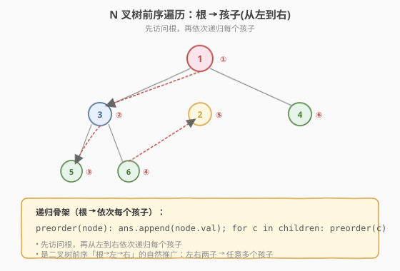
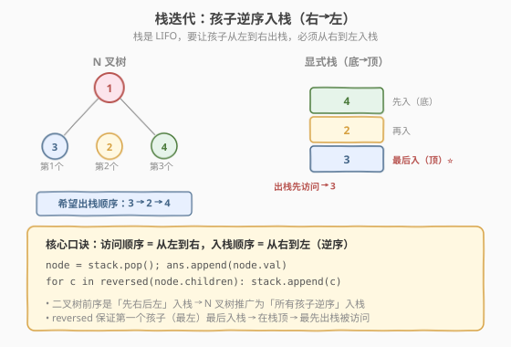
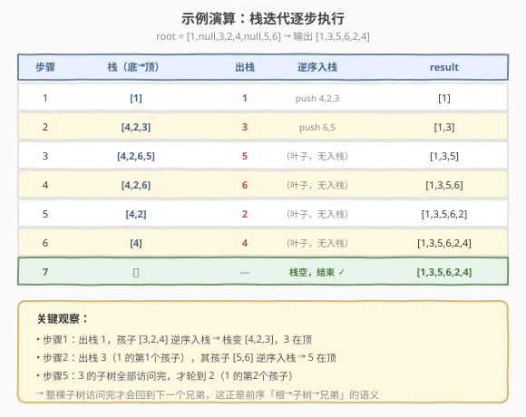

# LeetCode N叉树的前序遍历 题解

## 1. 题目概述

- **标题 / 题号**：N叉树的前序遍历（#589，easy）
- **链接**：https://leetcode.cn/problems/n-ary-tree-preorder-traversal/
- **难度**：简单
- **标签**：树、栈、深度优先搜索

**题意**：给定一棵 **n 叉树**的根节点 `root`，返回其节点值的**前序遍历**。

n 叉树在输入中按**层序遍历**进行序列化表示，每组子节点由空值 `null` 分隔。

**前序遍历**顺序：**根 → 孩子（从左到右）**。即先访问根节点，再从左到右依次递归访问每个子树。这是二叉树前序「根 → 左 → 右」的自然推广——把「左右两子」升级为「任意多个孩子」。

**示例 1**：

```text
输入：root = [1,null,3,2,4,null,5,6]
输出：[1,3,5,6,2,4]

        1
     / | \
    3  2  4
   / \
  5   6

访问顺序：1 → 3 → 5 → 6 → 2 → 4
```

> ⚠️ **注意树的解析**：序列化 `[1,null,3,2,4,null,5,6]` 中，`5,6` 是节点 `3` 的孩子（不是 `2` 的）。规则是：根 `1` 后的 `null` 分隔出 `1` 的孩子 `[3,2,4]`；下一个 `null` 分隔出 `3` 的孩子 `[5,6]`；`2`、`4` 无孩子。理解这个格式对调试很重要。

**示例 2**：

```text
输入：root = [1,null,2,3,4,5,null,null,6,7,null,8,null,9,10,null,null,11,null,12,null,13,null,null,14]
输出：[1,2,3,6,7,11,14,4,8,12,5,9,13,10]
```

**约束**：

- 节点总数在范围 `[0, 10^4]` 内
- `0 <= Node.val <= 10^4`
- n 叉树的高度小于或等于 `1000`

**进阶**：递归法很简单，你可以使用迭代法完成此题吗？

> 💡 本题是 [144. 二叉树的前序遍历](../0101-0200/144_二叉树的前序遍历.md) 的 N 叉树版本。递归骨架几乎一致——只是把「递归左子树、递归右子树」升级成「循环递归每个孩子」。迭代版的核心技巧也一脉相承：二叉树是「先右后左入栈」，N 叉树推广为「所有孩子逆序入栈」。和 [559. N 叉树的最大深度](559_N叉树的最大深度.md) 一起，覆盖了 N 叉树的「遍历」与「汇总」两大骨架。

## 2. 解题思路

### 2.1 基础思路：递归

前序遍历的递归定义极其简洁：访问根，再从左到右依次递归每个孩子。

```text
preorder(node):
    if node == null: return
    result.append(node.val)          // ① 根
    for child in node.children:      // ② 依次每个孩子
        preorder(child)
```

代码简洁，但隐含 `O(h)` 递归栈空间。面试官常要求迭代版本。

### 2.2 核心观察：栈迭代——孩子逆序入栈



递归的本质是**系统调用栈**。我们用一个**显式栈**模拟。栈是 LIFO（后进先出），要让**最左的孩子先被访问**，就必须让**最左的孩子最后入栈**（在栈顶）——也就是把所有孩子**逆序**（从右到左）入栈。



```text
stack = [root]
while stack 非空:
    node = stack.pop()               // 出栈 = 访问
    result.append(node.val)
    for child in reversed(node.children):   // 逆序入栈
        stack.push(child)
```

> 💡 **这是二叉树前序「先右后左入栈」的推广**。二叉树前序迭代口诀是「出栈访问，先右后左」——右先入栈、左后入栈，这样左在栈顶先出。N 叉树的孩子从 2 个变成任意多个，入栈顺序仍是「访问顺序的反转」：希望从左到右访问，就从右到左入栈。一句 `reversed(children)` 搞定。

> ⚠️ **为什么要逆序？** 假设孩子是 `[3, 2, 4]`，若**正序**入栈：先 push 3、再 push 2、再 push 4，栈变成 `[3, 2, 4]`（4 在顶），出栈顺序是 `4 → 2 → 3`，与期望的 `3 → 2 → 4` 相反。**逆序**入栈：先 push 4、再 push 2、再 push 3，栈变成 `[4, 2, 3]`（3 在顶），出栈顺序正是 `3 → 2 → 4` ✓。

### 2.3 算法流程图（栈迭代）

**完整步骤**：

1. **特判**：`root == null` 返回空列表
2. **初始化**：栈 `stack = [root]`，结果 `result = []`
3. **while 栈非空**：
   - `node = stack.pop()`（出栈）
   - `result.append(node.val)`（访问根）
   - **逆序**遍历 `node.children`，依次 `stack.push(child)`（从右到左入栈，最左孩子在顶）
4. 返回 `result`

> ⚠️ 第 3 步的逆序不能漏——正序入栈会导致访问顺序变成「根 → 孩子(从右到左)」，与「从左到右」的前序定义相反。

### 2.4 示例演算

以 `root = [1,null,3,2,4,null,5,6]`（树形：`1` 的孩子 `[3,2,4]`，`3` 的孩子 `[5,6]`）为例：



**栈迭代过程**：

| 步骤 | 栈（底→顶） | 出栈 | 逆序入栈 | result |
|------|-----------|------|---------|--------|
| 1 | [1] | ① 1 | push 4,2,3 → [4,2,3] | [1] |
| 2 | [4,2,3] | ② 3 | push 6,5 → [4,2,6,5] | [1,3] |
| 3 | [4,2,6,5] | ③ 5 | （叶子，无入栈）→ [4,2,6] | [1,3,5] |
| 4 | [4,2,6] | ④ 6 | （叶子，无入栈）→ [4,2] | [1,3,5,6] |
| 5 | [4,2] | ⑤ 2 | （叶子，无入栈）→ [4] | [1,3,5,6,2] |
| 6 | [4] | ⑥ 4 | （叶子，无入栈）→ [] | [1,3,5,6,2,4] |
| 7 | [] | — | 栈空，结束 | [1,3,5,6,2,4] ✓ |

最终 `result = [1,3,5,6,2,4]`。

> 💡 **观察步骤 2 到 5**：出栈 `3`（`1` 的第 1 个孩子）后，把 `3` 的孩子 `[5,6]` 逆序入栈，`5` 在顶。接下来连续出栈 `5`、`6`（`3` 的整棵子树），直到 `3` 的子树全部访问完，才轮到 `2`（`1` 的第 2 个孩子）。这正是前序「根 → 子树 → 兄弟」的语义——一棵子树访问完才会回到下一个兄弟。

## 3. 参考代码

### C++

```cpp
// N叉树的前序遍历.cpp —— 递归 + 栈迭代
#include <vector>
#include <stack>
using namespace std;

class Node {
  public:
    int val;
    vector<Node*> children;
    Node() {
    }
    Node(int _val) : val(_val) {
    }
    Node(int _val, vector<Node*> _children) : val(_val), children(move(_children)) {
    }
};

// 递归
class Solution {
  public:
    vector<int> preorder(Node* root) {
        vector<int> result;
        dfs(root, result);
        return result;
    }
  private:
    void dfs(Node* node, vector<int>& result) {
        if (!node) return;
        result.push_back(node->val);          // ① 根
        for (Node* child : node->children) {  // ② 依次每个孩子
            dfs(child, result);
        }
    }
};

// 栈迭代
class SolutionIter {
  public:
    vector<int> preorder(Node* root) {
        vector<int> result;
        if (!root) return result;
        stack<Node*> st;
        st.push(root);
        while (!st.empty()) {
            Node* node = st.top(); st.pop();
            result.push_back(node->val);              // 访问根
            // 孩子逆序入栈：最右先入（在底），最左后入（在顶，先出）
            for (auto it = node->children.rbegin(); it != node->children.rend(); ++it) {
                st.push(*it);
            }
        }
        return result;
    }
};
```

### Python

```python
# 递归
class Solution:
    def preorder(self, root: 'Node | None') -> list[int]:
        result: list[int] = []
        def dfs(node: 'Node | None') -> None:
            if not node:
                return
            result.append(node.val)           # ① 根
            for child in node.children:       # ② 依次每个孩子
                dfs(child)
        dfs(root)
        return result

# 栈迭代
class SolutionIter:
    def preorder(self, root: 'Node | None') -> list[int]:
        result: list[int] = []
        if not root:
            return result
        stack = [root]
        while stack:
            node = stack.pop()
            result.append(node.val)                   # 访问根
            stack.extend(reversed(node.children))     # 逆序入栈，最左孩子在顶
        return result
```

> 💡 Python 用 `stack.extend(reversed(node.children))` 一行完成逆序入栈——`reversed` 返回逆序迭代器，`extend` 依次追加。等价于 `for c in reversed(node.children): stack.append(c)`，但更简洁。注意是 `reversed` 不是 `[::-1]`：前者返回迭代器不额外建列表，更省空间。

## 4. 复杂度分析

| 维度 | 递归 | 栈迭代 | 说明 |
|------|------|--------|------|
| **时间复杂度** | `O(n)` | `O(n)` | 每个节点访问一次；逆序入栈遍历孩子列表，总次数 = 孩子总数 = `n-1` |
| **空间复杂度** | `O(h)` | `O(h)` | 递归栈 / 显式栈深度 = 树高 `h`；最坏链状 `O(n)` |

> ⚠️ 空间是 `O(h)` 而非 `O(n)`——栈在同一时刻最多存「从根到当前节点路径上各节点的待访问兄弟」。平衡的 N 叉树约 `O(log n)`（按孩子数分叉），退化为「每个节点只有一个孩子」的链状时 `O(n)`。N 叉树可能很宽（一个节点有很多孩子），但这只影响单次入栈的数量，不改变栈的最大深度——最大深度仍由树高决定。题目约束树高 `≤ 1000`，递归栈不会溢出。

> 💡 **逆序入栈的额外开销**：`reversed(children)` 本身 `O(k)`（`k` = 该节点孩子数），但所有节点的 `k` 之和 = `n-1`，均摊到每节点 `O(1)`，故总时间仍 `O(n)`。C++ 用 `rbegin()/rend()` 反向迭代，同样 `O(k)` 且不额外分配。

## 5. 扩展：N 叉树序列化与前/后序的关系

前序遍历的一个经典应用是**树的序列化**。N 叉树的前序 + 子节点个数标记可以唯一还原一棵树（[428. 序列化和反序列化 N 叉树](https://leetcode.cn/problems/serialize-and-deserialize-n-ary-tree/)，需要会员）：

```python
# 序列化：前序 + 每个节点前记录孩子数
def serialize(root):
    ans = []
    def dfs(node):
        if not node: return
        ans.append(str(node.val))
        ans.append(str(len(node.children)))   # 孩子数标记
        for c in node.children:
            dfs(c)
    dfs(root)
    return ','.join(ans)
```

> 💡 二叉树序列化用「前序 + null 标记」即可唯一还原（因为二叉树每个节点固定两槽位，null 能标识空槽）。N 叉树孩子数量不固定，所以需要**显式记录孩子数**（或用特殊分隔符），单靠前序序列无法还原。这也是 LeetCode N 叉树序列化格式用 `null` 分隔每组孩子的原因——`null` 充当「当前节点孩子列表结束」的标记。

## 6. 面试要点

1. **N 叉树和二叉树的前序遍历有什么区别？**

   - 二叉树：`根 → 左 → 右`，固定两个子问题。
   - N 叉树：`根 → 孩子(从左到右)`，子问题数量不固定。
   - 递归骨架本质相同——只是「递归左、递归右」变成「循环递归每个孩子」。栈迭代同理：「先右后左入栈」变成「所有孩子逆序入栈」。

2. **栈迭代为什么要「逆序」入栈？**

   - 栈是 LIFO（后进先出）。希望孩子从左到右出栈（被访问），就得让最左的孩子最后入栈（在栈顶）——即从右到左入栈。
   - 口诀：**访问顺序 = 从左到右，入栈顺序 = 从右到左（逆序）**。这是二叉树「先右后左」的 N 叉推广。

3. **递归和栈迭代哪个更好？**

   - 逻辑完全等价——递归用系统调用栈，迭代用显式栈。时间都是 `O(n)`，空间都是 `O(h)`。
   - 递归代码更简洁；迭代更直观展示「栈」的作用，且能规避极深树的递归栈溢出。本题树高 `≤ 1000`，两者都安全。面试策略：先写递归展示直觉，再写迭代满足「进阶」要求。

4. **N 叉树的序列化格式怎么理解？**

   - `[1,null,3,2,4,null,5,6]`：根 `1` 后的 `null` 分隔出 `1` 的孩子 `[3,2,4]`；下一个 `null` 分隔出 `3` 的孩子 `[5,6]`；`2`、`4` 后无值（或直接 `null`）表示无孩子。
   - 本质是层序 BFS + `null` 作「当前节点孩子列表结束」标记。调试时按此规则手动还原树形，避免把孩子认错父亲。

5. **前序遍历有什么实际应用？**

   - **复制树**：先创建根，再递归创建每个子树——前序天然适合。
   - **序列化**：前序 + 孩子数标记可唯一还原 N 叉树（见第 5 节）。
   - **前缀表达式**：表达式树的前序遍历得到前缀表示（波兰表达式）。
   - 因为「根在前」，前序常用于「需要先知道根才能处理子树」的场景，与二叉树前序的应用一致。

> 💡 **一句话总结**：N 叉树前序遍历是二叉树版的自然推广——把「递归左右两子」升级为「循环递归每个孩子」，把「先右后左入栈」升级为「所有孩子逆序入栈」。记住口诀「访问从左到右，入栈从右到左（逆序）」，就能轻松写出所有 N 叉树的前序遍历。

## 同类练习题

| # | 题目 | 与本题的关联 |
|---|------|-------------|
| 144 | [二叉树的前序遍历](https://leetcode.cn/problems/binary-tree-preorder-traversal/)（[题解](../0101-0200/144_二叉树的前序遍历.md)） | 二叉树版，栈迭代「先右后左入栈」——本题是其 N 叉推广 |
| 590 | [N 叉树的后序遍历](https://leetcode.cn/problems/n-ary-tree-postorder-traversal/) | N 叉树后序「孩子从左到右 → 根」，栈迭代需巧思（逆序 + 反转 或 双栈） |
| 429 | [N 叉树的层序遍历](https://leetcode.cn/problems/n-ary-tree-level-order-traversal/) | N 叉树 BFS，`while + for(size)` 骨架，所有孩子入队 |
| 559 | [N 叉树的最大深度](https://leetcode.cn/problems/maximum-depth-of-n-ary-tree/)（[题解](559_N叉树的最大深度.md)） | N 叉树后序汇总 `max(子树深度) + 1`，与前序「先根后子」对照 |
| 94 | [二叉树的中序遍历](https://leetcode.cn/problems/binary-tree-inorder-traversal/)（[题解](../0001-0100/94_二叉树的中序遍历.md)） | N 叉树无「中序」概念（孩子多于 2 时无唯一中序），理解为何只有前/后/层序适用于 N 叉树 |
