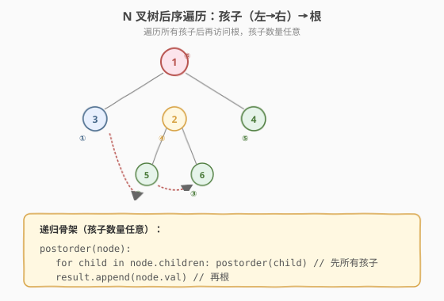
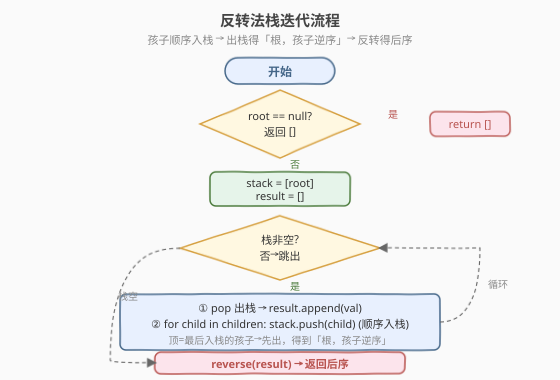
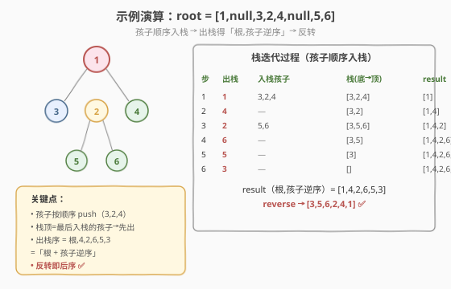

# LeetCode N叉树的后序遍历 题解

## 1. 题目概述

- **标题 / 题号**：N叉树的后序遍历（#590，easy）
- **链接**：https://leetcode.cn/problems/n-ary-tree-postorder-traversal/
- **难度**：简单
- **标签**：树、栈、DFS

**题意**：给定一棵 **N 叉树**的根节点 `root`，返回其节点值的**后序遍历**结果。N 叉树的后序遍历顺序为：**依次遍历所有孩子（从左到右）→ 最后访问根**。

N 叉树的每个节点用 `children` 列表存储任意数量的子节点，而非二叉树的固定左右两子。

**示例 1**：

```text
输入：root = [1,null,3,2,4,null,5,6]
        1
     / | \
    3  2  4
      / \
     5   6
输出：[3,5,6,2,4,1]
解释：先遍历孩子 3（无孩子→输出3），再遍历孩子 2（先 5 后 6 再 2），最后孩子 4，最后根 1。
```

**示例 2**：

```text
输入：root = [1,null,2,3,4,5,null,null,6,7,null,8,null,9,10,null,null,11,null,12,null,13,null,null,14]
输出：[2,6,14,11,7,3,12,8,4,13,9,10,5,1]
```

**约束**：

- 树中节点数目范围 `[0, 10^4]`
- `0 <= Node.val <= 10^4`
- N 叉树的高度不超过 `1000`

> 💡 这是 [145. 二叉树的后序遍历](../0101-0200/145_二叉树的后序遍历.md) 的 N 叉树版本。核心递归骨架完全同构——只是「先左后右再根」升级成「先所有孩子再根」。栈迭代的「反转法」也直接迁移：把「先左后右入栈」换成「孩子按顺序入栈」，最后 `reverse` 即可。掌握这道题，你就理解了「遍历骨架与子节点数量无关」的通用性。

## 2. 解题思路

### 2.1 基础思路：递归

后序的递归定义天然清晰——遍历完所有孩子，再访问根：

```text
postorder(node):
    if node == null: return
    for child in node.children:        // 先所有孩子（从左到右）
        postorder(child)
    result.append(node.val)            // 再根（最后）
```

### 2.2 核心观察：反转法栈迭代



后序「孩子…根」很难直接用栈模拟——因为「根在最后」，必须等所有子树都访问完才能访问根。和二叉树一样，这里用**反转法**巧妙化解。

| 遍历 | 顺序 | 栈迭代做法 |
|------|------|-----------|
| 前序 | 根，孩子左→右 | 孩子逆序入栈（让左孩子在顶先出） |
| 变种 | 根，孩子右→左 | 孩子顺序入栈（让右孩子在顶先出） |
| 后序 | 孩子左→右，根 | = 变种的反转 |

**关键洞察**：栈是 LIFO。把所有孩子**按从左到右的顺序**依次 `push`，那么**最右的孩子在栈顶最先出**——出栈顺序就是「根，孩子右→左」。再把结果 `reverse`，就得到「孩子左→右，根」——即后序！

> 💡 为什么要绕这一圈？因为「根在前」的遍历用栈很好写——出栈即访问，孩子入栈即可。而「根在后」的后序需要判断「所有子树是否已访问」，直接写很复杂。反转法把后序转化为两个简单操作：变种前序（孩子顺序入栈）+ `reverse`，避开了「判断子树访问状态」的难题。这和 [145. 二叉树的后序遍历](../0101-0200/145_二叉树的后序遍历.md) 的反转法**完全同构**，只是「左右两子」推广成「children 列表循环」。

### 2.3 算法流程图



**反转法完整步骤**：

1. **特判**：`root == null` 返回空列表
2. **初始化**：栈 `stack = [root]`，结果 `result = []`
3. **while 栈非空**：
   - `node = stack.pop()`（出栈）
   - `result.append(node.val)`（先存着，此时是「根，孩子右→左」顺序）
   - `for child in node.children: stack.push(child)`（孩子**按顺序**入栈，最右的在顶先出）
4. **反转**：`reverse(result)`
5. 返回 `result`

> ⚠️ 与 N 叉树前序迭代的**唯一区别**：① 前序孩子**逆序**入栈（让左孩子先出），后序孩子**顺序**入栈（让右孩子先出）；② 后序最后多一步 `reverse`。记住了这点，前序/后序的迭代写法就都掌握了。

### 2.4 示例演算

以示例 1 `root = [1,null,3,2,4,null,5,6]` 为例（1 的孩子 [3,2,4]，2 的孩子 [5,6]）：



**栈迭代过程**（孩子顺序入栈）：

| 步骤 | 出栈节点 | 入栈孩子 | 栈（底→顶） | result（根,孩子逆序） |
|------|---------|---------|------------|---------------------|
| 1 | 1 | 3,2,4 | [3,2,4] | [1] |
| 2 | 4 | — | [3,2] | [1,4] |
| 3 | 2 | 5,6 | [3,5,6] | [1,4,2] |
| 4 | 6 | — | [3,5] | [1,4,2,6] |
| 5 | 5 | — | [3] | [1,4,2,6,5] |
| 6 | 3 | — | [] | [1,4,2,6,5,3] |

**反转**：`[1,4,2,6,5,3]` → `[3,5,6,2,4,1]` ✅

> 💡 注意步骤 2：出栈 4（1 的最右孩子，因为最后入栈在顶）先于 2、3。这正符合「根，孩子右→左」——先把最右子树全访问完，再向左推进。反转后变成「孩子左→右，根」，即 [3] + [5,6,2] + [4] + [1] = [3,5,6,2,4,1]。

## 3. 参考代码

### C++

```cpp
// N叉树的后序遍历.cpp —— 递归 + 反转法栈迭代
#include <vector>
#include <stack>
#include <algorithm>
using namespace std;

class Node {
  public:
    int val;
    vector<Node*> children;
    Node() {
    }
    Node(int _val) : val(_val) {
    }
    Node(int _val, vector<Node*> _children) : val(_val), children(move(_children)) {
    }
};

// 递归
class Solution {
  public:
    vector<int> postorder(Node* root) {
        vector<int> result;
        dfs(root, result);
        return result;
    }
  private:
    void dfs(Node* node, vector<int>& result) {
        if (!node) return;
        for (Node* child : node->children) {     // 先所有孩子
            dfs(child, result);
        }
        result.push_back(node->val);             // 再根
    }
};

// 反转法栈迭代
class SolutionIter {
  public:
    vector<int> postorder(Node* root) {
        vector<int> result;
        if (!root) return result;
        stack<Node*> st;
        st.push(root);
        while (!st.empty()) {
            Node* node = st.top(); st.pop();
            result.push_back(node->val);         // 访问（根,孩子逆序）
            for (Node* child : node->children) { // 孩子顺序入栈，最右在顶先出
                st.push(child);
            }
        }
        reverse(result.begin(), result.end());   // 反转得后序
        return result;
    }
};
```

### Python

```python
# 递归
class Solution:
    def postorder(self, root: 'Node | None') -> list[int]:
        result = []
        def dfs(node):
            if not node:
                return
            for child in node.children:       # 先所有孩子
                dfs(child)
            result.append(node.val)           # 再根
        dfs(root)
        return result

# 反转法栈迭代
class SolutionIter:
    def postorder(self, root: 'Node | None') -> list[int]:
        result = []
        if not root:
            return result
        stack = [root]
        while stack:
            node = stack.pop()
            result.append(node.val)           # 访问（根,孩子逆序）
            stack.extend(node.children)       # 孩子顺序入栈，最右在顶先出
        result.reverse()                      # 反转得后序
        return result
```

> 💡 Python 用 `stack.extend(node.children)` 一行把所有孩子按顺序追加到栈顶——`children` 列表的最后一个变成栈顶，最先出栈。这比逐个 `append` 更简洁，且语义清晰：「按原顺序入栈，靠栈的 LIFO 自动逆序出栈」。

## 4. 复杂度分析

| 维度 | 复杂度 | 说明 |
|------|--------|------|
| **时间复杂度** | `O(n)` | 每个节点入栈/出栈一次 + 反转一次 |
| **空间复杂度** | `O(n)` | 栈深度最坏 `O(n)`（链状退化）；结果数组 `O(n)` |

> ⚠️ N 叉树可能很「宽」（一个节点有很多孩子），但栈的深度只与树高 `h` 有关，最坏链状退化时 `h = n`。递归版空间同样是 `O(h)`。反转的 `O(n)` 不影响整体——遍历本身就是 `O(n)`，总时间 `2n` 量级仍为 `O(n)`。极端深树（深 1000）递归可能栈溢出，此时迭代版更安全。

## 5. 扩展：前序与后序的对称关系

N 叉树的三种遍历里，前序与后序用栈迭代时呈优美的对称：

| 遍历 | 栈迭代入栈 | 出栈顺序 | 是否反转 |
|------|-----------|---------|---------|
| 前序 | 孩子**逆序**入栈 | 根，孩子左→右 | 否 |
| 后序 | 孩子**顺序**入栈 | 根，孩子右→左 | 是（reverse） |

```python
# N 叉树前序遍历（589）：孩子逆序入栈，无需反转
def preorder(root):
    if not root:
        return []
    stack, result = [root], []
    while stack:
        node = stack.pop()
        result.append(node.val)
        stack.extend(reversed(node.children))   # 逆序入栈→左孩子在顶先出
    return result
```

> 💡 前/后序栈迭代的**唯一区别**就是入栈顺序（顺序 vs 逆序）+ 末尾是否 `reverse`。中序遍历对 N 叉树没有自然定义（「中」的位置在多孩子时不唯一），所以 N 叉树只有前序和后序两种 DFS 顺序。

## 6. 面试要点

1. **N 叉树后序和二叉树后序有什么区别？**

   - 二叉树：`dfs(left); dfs(right); visit(root)`，固定两个子问题。
   - N 叉树：`for child in children: dfs(child); visit(root)`，子问题数量不固定。
   - 本质相同——都是「先所有子树再根」，只是遍历孩子的方式从「左右两个」变成「列表循环」。

2. **反转法为什么对 N 叉树也成立？**

   - 二叉树后序 = reverse(根右左)，靠「先左后右入栈」让右子在顶先出。
   - N 叉树后序 = reverse(根,孩子右→左)，靠「孩子顺序入栈」让最右孩子在顶先出。
   - 共同点：栈的 LIFO 自动把「入栈顺序」反转成「出栈顺序」，再 `reverse` 一次就回到目标顺序。子节点数量从 2 推广到任意多，逻辑不变。

3. **孩子入栈顺序错了会怎样？**

   - 若孩子**逆序**入栈（像前序那样），出栈得到「根，孩子左→右」——这是前序，反转后是「孩子右→左，根」，**不是**后序。
   - 验证方法：对示例 1，正确后序应是 `[3,5,6,2,4,1]`（孩子左→右）。若入栈顺序搞反，反转结果会是 `[4,2,6,5,3,1]`（孩子右→左），一眼可辨。

4. **N 叉树有中序遍历吗？**

   - 没有唯一定义。二叉树中序「左根右」中「根」夹在左右之间；N 叉树有多个孩子，「根」该插在第几个孩子之后不唯一（常见约定是插在中间或第 0 个之后，但无标准）。
   - 所以 LeetCode 的 N 叉树遍历题只有前序（589）和后序（590），没有中序。

5. **后序遍历有什么实际应用？**

   - **删除树/释放资源**：必须先递归释放所有子树，再释放根——后序天然适合。
   - **目录大小统计**：先算子目录大小，再汇总到父目录——后序汇总。
   - **表达式树求值**：先算所有子树（操作数），再算根（运算符）——后序。
   - 与 [236. 二叉树的最近公共祖先](https://leetcode.cn/problems/lowest-common-ancestor-of-a-binary-tree/) 的后序 DFS 同理：「需要子树结果才能处理根」的场景都用后序。

> 💡 **一句话总结**：N 叉树的后序遍历是二叉树版的自然推广——把「先左后右再根」升级为「先所有孩子再根」。栈迭代同样用反转法：孩子**顺序**入栈得「根,孩子逆序」，再 `reverse` 就是后序。记住「后序迭代 = 前序迭代交换入栈顺序 + reverse」，N 叉树的前/后序迭代就都掌握了。

## 同类练习题

| # | 题目 | 与本题的关联 |
|---|------|-------------|
| 145 | [二叉树的后序遍历](https://leetcode.cn/problems/binary-tree-postorder-traversal/) | 二叉树版，反转法先左后右入栈（[题解](../0101-0200/145_二叉树的后序遍历.md)） |
| 589 | [N 叉树的前序遍历](https://leetcode.cn/problems/n-ary-tree-preorder-traversal/) | N 叉树前序，孩子逆序入栈无需反转 |
| 429 | [N 叉树的层序遍历](https://leetcode.cn/problems/n-ary-tree-level-order-traversal/) | N 叉树 BFS，子节点入队改循环 |
| 559 | [N 叉树的最大深度](https://leetcode.cn/problems/maximum-depth-of-n-ary-tree/) | N 叉树后序汇总取 max（[题解](559_N叉树的最大深度.md)） |
| 236 | [二叉树的最近公共祖先](https://leetcode.cn/problems/lowest-common-ancestor-of-a-binary-tree/) | 后序 DFS 汇总子树信息（[题解](../0201-0300/236_二叉树的最近公共祖先.md)） |
