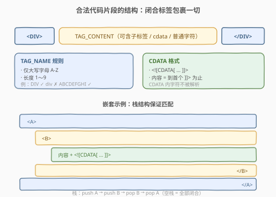
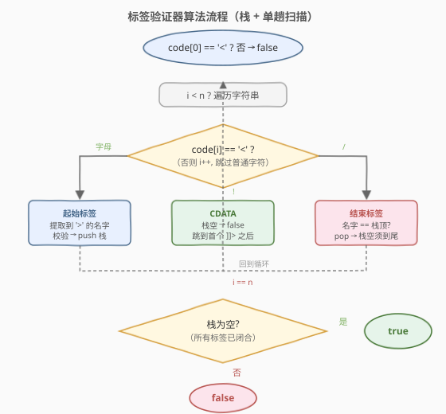
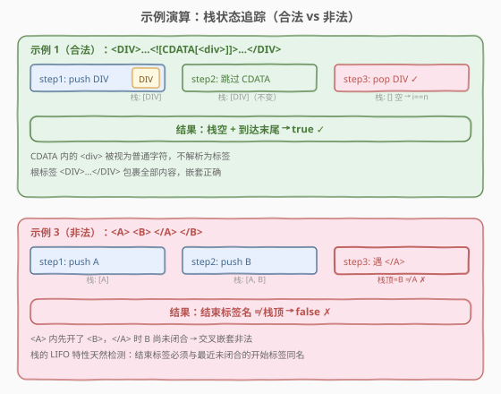

# 标签验证器

- **题目名称**：标签验证器
- **链接**：[591. 标签验证器](https://leetcode.cn/problems/tag-validator/)
- **难度**：困难
- **标签**：字符串、栈、模拟、规则校验

## 1. 题目概述

给定一个表示代码片段的字符串 `code`，实现一个验证器判断它是否**合法**。合法代码需同时满足 8 条规则，核心结构为被合法闭合标签包围的文本：

- **闭合标签**：`<TAG_NAME>TAG_CONTENT</TAG_NAME>`，起始与结束标签的 `TAG_NAME` 必须相同。
- **合法 TAG_NAME**：仅含**大写字母** `A-Z`，长度 $1 \sim 9$。
- **TAG_CONTENT**：可含合法的嵌套闭合标签、cdata、以及任意普通字符，但**不能有未匹配的 `<`**。
- **cdata**：`<![CDATA[CDATA_CONTENT]]>`，其中 `CDATA_CONTENT` 是 `<![CDATA[` 与**后续第一个** `]]>` 之间的字符，内容不被解析。
- **嵌套**：起始标签必须有同名结束标签匹配（反之亦然），且不能交叉嵌套。
- **根标签**：整个代码必须被**一对**闭合标签包裹（首尾必须是根标签的起始/结束）。

**示例 1**：

```text
输入：code = "<DIV>This is the first line <![CDATA[<div>]]></DIV>"
输出：true
解释：被 <DIV>...</DIV> 包裹，TAG_NAME 合法，TAG_CONTENT 含 cdata。
      CDATA 内的 <div> 被视为普通字符，不解析为标签。
```

**示例 2**：

```text
输入：code = "<DIV>>>  ![cdata[]] <![CDATA[<div>]>]]>]]>>]</DIV>"
输出：true
解释：start_tag=<DIV>，end_tag=</DIV>，中间 tag_content 含文本和 cdata。
      cdata 的 CDATA_CONTENT = "<div>]>"（到首个 ]]> 为止）。
```

**示例 3**：

```text
输入：code = "<A>  <B> </A>   </B>"
输出：false
解释：交叉嵌套。<A> 内开了 <B>，</A> 时 <B> 尚未闭合。
```

**约束条件**：

- $1 \leq \text{code.length} \leq 500$
- `code` 只含英文字母、数字、`'<'`、`'>'`、`'/'`、`'!'`、`'['`、`']'`、`'.'`、`' '`。

> 💡 本题是「规则校验型」字符串题的集大成者——8 条规则交织，关键在于**用栈管理嵌套 + 单趟扫描确定性地分发 `<` 后的三种分支**（起始标签 / 结束标签 / cdata），不遗漏任何边界。

---

## 2. 解题思路

### 2.1 暴力思路

最直觉的做法是「正则一把梭」，试图用一条巨型正则匹配整个合法代码。但 8 条规则中涉及**递归嵌套**（TAG_CONTENT 内可含子闭合标签），而正则无法表达任意深度递归（正则只描述正则语言，嵌套括号匹配属于上下文无关语言）。因此正则方案在理论上就不可行。

另一种朴素思路是「反复剥离最内层闭合标签」：每次找到一对没有嵌套子标签的 `<X>...</X>`，替换为占位符，逐层归约直到只剩根标签。但这需要反复扫描字符串，且 cdata 内可能含有伪标签干扰匹配，实现复杂且容易出错。

> ⚠️ 嵌套结构天然需要**栈**——这是比正则/归约更直接的工具。一次从左到右的扫描 + 栈即可确定性地判定合法性。

### 2.2 核心观察：栈 + 单趟扫描的三路分发

合法代码的判定可以分解为两个层面：

1. **外层结构**：代码首尾必须是一对闭合标签（根标签），根标签外不能有任何字符。
2. **内容结构**：根标签内部的 TAG_CONTENT 由「嵌套闭合标签 / cdata / 普通字符」组成，嵌套层级由栈管理。

扫描时遇到 `<` 后，根据**紧随其后的字符**分三路：

| `<` 后的字符 | 类型 | 处理 |
|---|---|---|
| **大写字母** | 起始标签 | 提取到 `>` 的 TAG_NAME，校验合法后 **push 栈** |
| **`/`** | 结束标签 | 提取到 `>` 的 TAG_NAME，校验合法后与**栈顶比对**，匹配则 **pop** |
| **`!`** | cdata | 必须形如 `<![CDATA[...]]>`，跳到**首个 `]]>`** 之后 |



上图展示了合法代码的核心结构：`<TAG_NAME>TAG_CONTENT</TAG_NAME>` 是基本骨架，TAG_NAME 有严格约束（大写字母、长度 1-9），CDATA 有固定格式且内容不解析，嵌套通过栈的 LIFO 特性保证不交叉。

> ⚠️ **三个关键不变式**：
> 1. **栈空时遇到 `</` 或 `<!` → 非法**：结束标签和 cdata 只能出现在标签内部（栈非空时），不能在根标签外。
> 2. **栈空且未到串尾 → 非法**：根标签关闭后若还有剩余字符，说明根标签没有包裹全部内容。
> 3. **首字符必须是 `<` 且非 `</`、`<!`**：代码必须以起始标签开头。

### 2.3 算法流程图



流程是一个**循环 + 三路分发**的结构：外层 `while i < n` 推进指针，遇到 `<` 时按 `code[i+1]` 的类型分发到起始标签 / cdata / 结束标签三条支路；遇到普通字符则直接跳过。循环结束后检查栈是否为空——栈空表示所有标签均已闭合。

### 2.4 示例演算

对示例 1（合法）和示例 3（非法）分别走一遍流程，追踪栈状态：



| 示例 | 步骤 | 栈状态 | 说明 |
|------|------|--------|------|
| 示例 1 | 遇 `<DIV>` | `[DIV]` | 起始标签，push |
| | 遇 `<![CDATA[<div>]]>` | `[DIV]` | cdata，栈非空 OK，跳到 `]]>` 后 |
| | 遇 `</DIV>` | `[]` | 结束标签，栈顶==DIV，pop。栈空且 i==n |
| | 最终 | `[]` | **true** |
| 示例 3 | 遇 `<A>` | `[A]` | 起始标签，push |
| | 遇 `<B>` | `[A, B]` | 起始标签，push |
| | 遇 `</A>` | — | 结束标签 A，栈顶==B ≠ A → **false** |

> 💡 示例 3 是本题最经典的陷阱：**交叉嵌套**。栈的 LIFO 特性天然检测——遇到结束标签时必须与最近未闭合的开始标签（栈顶）同名，否则结构非法。这与括号匹配（[20. 有效括号](https://leetcode.cn/problems/valid-parentheses/)）的栈思路一脉相承，只是这里「括号」变成了带名字的标签。

---

## 3. 参考代码

### C++

```cpp
class Solution {
  public:
    bool isValid(string code) {
        int n = code.size();
        if (n < 2 || code[0] != '<') return false;
        vector<string> stk;
        int i = 0;
        while (i < n) {
            if (code[i] == '<') {
                if (i + 1 >= n) return false;
                if (code[i + 1] == '/') {
                    int j = code.find('>', i + 2);
                    if (j == string::npos) return false;
                    string tagName = code.substr(i + 2, j - (i + 2));
                    if (!validName(tagName)) return false;
                    if (stk.empty() || stk.back() != tagName) return false;
                    stk.pop_back();
                    i = j + 1;
                    if (stk.empty() && i != n) return false;
                } else if (code[i + 1] == '!') {
                    if (stk.empty()) return false;
                    if (code.substr(i, 9) != "<![CDATA[") return false;
                    int j = code.find("]]>", i + 9);
                    if (j == string::npos) return false;
                    i = j + 3;
                } else {
                    int j = code.find('>', i + 1);
                    if (j == string::npos) return false;
                    string tagName = code.substr(i + 1, j - (i + 1));
                    if (!validName(tagName)) return false;
                    stk.push_back(tagName);
                    i = j + 1;
                }
            } else {
                i++;
            }
        }
        return stk.empty();
    }

  private:
    bool validName(const string& name) {
        if (name.size() < 1 || name.size() > 9) return false;
        for (char c : name)
            if (c < 'A' || c > 'Z') return false;
        return true;
    }
};
```

### Python

```python
class Solution:
    def isValid(self, code: str) -> bool:
        if not code or code[0] != '<':
            return False
        n = len(code)
        stack = []
        i = 0
        while i < n:
            if code[i] == '<':
                if i + 1 >= n:
                    return False
                if code[i + 1] == '/':                          # 结束标签
                    j = code.find('>', i + 2)
                    if j == -1:
                        return False
                    tag_name = code[i + 2 : j]
                    if not self._valid_name(tag_name):
                        return False
                    if not stack or stack[-1] != tag_name:
                        return False
                    stack.pop()
                    i = j + 1
                    if not stack and i != n:                    # 根标签关闭后须到尾
                        return False
                elif code[i + 1] == '!':                        # cdata
                    if not stack:                               # cdata 只能在标签内
                        return False
                    if not code.startswith('<![CDATA[', i):
                        return False
                    j = code.find(']]>', i + 9)
                    if j == -1:
                        return False
                    i = j + 3
                else:                                           # 起始标签
                    j = code.find('>', i + 1)
                    if j == -1:
                        return False
                    tag_name = code[i + 1 : j]
                    if not self._valid_name(tag_name):
                        return False
                    stack.append(tag_name)
                    i = j + 1
            else:
                i += 1                                          # 普通字符，跳过
        return len(stack) == 0

    def _valid_name(self, name: str) -> bool:
        return 1 <= len(name) <= 9 and all('A' <= c <= 'Z' for c in name)
```

> ⚠️ **五个易错点**：
> 1. **首字符校验**：`code[0] != '<'` 直接判负——代码必须以起始标签开头，不能以普通字符、结束标签或 cdata 开头。
> 2. **栈空时遇 `</` 或 `<!`**：结束标签和 cdata 只能出现在标签内部。栈空时遇到它们说明结构非法（无外层标签包裹）。
> 3. **根标签关闭后**：`pop` 后若栈空，必须检查 `i == n`。若还有剩余字符，说明根标签没有包裹全部内容（如 `<A></A>abc`）。
> 4. **cdata 的 `]]>` 是「首个」**：用 `find` 找第一个 `]]>`，而非最后一个。规则 7 明确要求「后续第一个」。
> 5. **TAG_NAME 校验**：不仅查大写字母，还要查长度 $1 \sim 9$。`code.find('>')` 提取的名字可能含 `/`、`!`、空格等非法字符，`validName` 会一并拦截。

---

## 4. 复杂度分析

| 维度 | 复杂度 | 说明 |
|------|--------|------|
| 时间复杂度 | $O(n)$ | 每个字符最多被 `find` 扫描一次（`find` 从当前位置向前搜索，指针 `i` 单调递增不回退），总扫描量 $\leq 2n$ |
| 空间复杂度 | $O(n)$ | 栈存储标签名，最坏情况全部为嵌套起始标签（如 `<A><B><C>...`），栈深 $O(n/\text{最小标签长度})$；标签名 substring 总长 $\leq n$ |

> 💡 题面 `code.length ≤ 500`，任何正确写法都毫秒级完成。本题的考点不在复杂度优化，而在**规则覆盖的完备性**——8 条规则逐条落成代码，不漏不重。

---

## 5. 面试要点

1. **为什么用栈而不是正则？**
   - 合法代码允许任意深度嵌套（TAG_CONTENT 内含子闭合标签），这是上下文无关文法，正则（正则语言）无法表达。栈是处理嵌套结构的最自然工具，与括号匹配同源。

2. **遇到 `<` 后如何分发？**
   - 看 `code[i+1]`：是 `/` → 结束标签；是 `!` → cdata；是大写字母 → 起始标签。三路分发互斥且完备，覆盖所有合法 `<` 的用法。

3. **如何保证根标签包裹全部内容？**
   - 两个检查：①首字符必须是 `<`（以起始标签开头）；②`pop` 后栈空时检查 `i == n`（根标签关闭后须到串尾）。两者合起来确保「恰好一对根标签包裹一切」。

4. **cdata 内的 `<div>` 为什么不会误判？**
   - cdata 分支直接 `find(']]>')` 跳到首个 `]]>` 之后，中间的字符（包括 `<`、`>`、`</` 等）全部被跳过，不进入三路分发。这正是 cdata 的设计目的——阻止验证器解析内容。

5. **TAG_NAME 校验为什么要查长度？**
   - 规则 3 明确要求长度 $1 \sim 9$。若不查长度，`find('>')` 可能提取到极长的「名字」（实际是多个标签粘连的产物），通过大写字母检查但违反规则。长度上限 9 是硬性约束。

6. **`<A>  <B> </A>   </B>` 为什么非法？**
   - 遇 `<A>` push A，遇 `<B>` push B（栈 `[A,B]`），遇 `</A>` 时栈顶是 B ≠ A → 判负。栈的 LIFO 特性保证结束标签必须与最近的未闭合起始标签匹配，交叉嵌套天然被拦截。

---

## 6. 同类练习题

- [20. 有效括号](https://leetcode.cn/problems/valid-parentheses/)（[题解](../0001-0100/20_有效括号.md)）：栈匹配括号对，本题的「栈匹配标签名」是其带名字的进阶版
- [71. 简化路径](https://leetcode.cn/problems/simplify-path/)（[题解](../0001-0100/71_简化路径.md)）：栈模拟路径层级，同为「字符串切分 + 栈处理」的规则校验型
- [468. 验证 IP 地址](https://leetcode.cn/problems/validate-ip-address/)（[题解](../0401-0500/468_验证IP地址.md)）：字符串逐段规则校验，与本题同为「规则逐条落成代码」的范式，但无嵌套
- [224. 基本计算器](https://leetcode.cn/problems/basic-calculator/)（[题解](../0001-0100/224_基本计算器.md)）：栈处理嵌套括号与一元符号，与本题的「栈管理嵌套层级」思路同源
- [227. 基本计算器 II](https://leetcode.cn/problems/basic-calculator-ii/)：栈处理运算符优先级，同为「单趟扫描 + 栈」的字符串解析题
