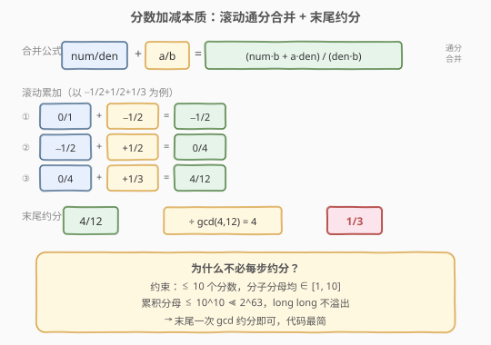
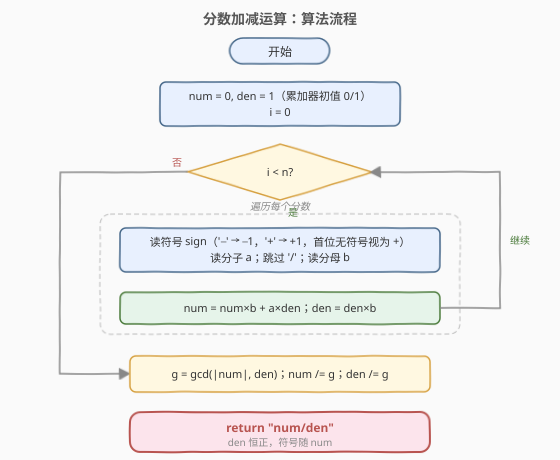
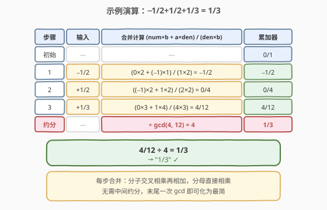

# LeetCode 分数加减运算 题解

## 1. 题目概述

- **标题 / 题号**：分数加减运算（#592，medium）
- **链接**：https://leetcode.cn/problems/fraction-addition-subtraction/
- **难度**：中等
- **标签**：数学、字符串、模拟

**题意**：给定一个表示**分数加减法表达式**的字符串 `expression`，返回其结果的**最简分数**字符串。表达式由若干形如 `"±a/b"` 的分数用 `'+'` 或 `'-'` 连接而成，其中 $a$ 为分子、$b$ 为分母。结果须为**不可约分数**，格式 `"分子/分母"`（即使结果为整数也写作 `"2/1"`，结果为 $0$ 写作 `"0/1"`）。

**示例 1**：

```text
输入：expression = "-1/2+1/2"
输出："0/1"
解释：−1/2 + 1/2 = 0/1
```

**示例 2**：

```text
输入：expression = "-1/2+1/2+1/3"
输出："1/3"
解释：−1/2 + 1/2 + 1/3 = 0 + 1/3 = 1/3
```

**示例 3**：

```text
输入：expression = "1/3-1/2"
输出："-1/6"
解释：1/3 − 1/2 = 2/6 − 3/6 = −1/6
```

**约束**：

- $1 \le \text{expression.length} \le 100$
- 表达式仅由 `'0'`~`'9'`、`'/'`、`'+'`、`'-'` 组成
- 每个分数的分子和分母均在 $[1, 10]$ 范围内
- 表达式中分数个数在 $[1, 10]$ 范围内
- 答案保证可用 32 位有符号整数表示

> 💡 本题是「字符串解析 + 有理数算术」的典型组合。难点不在分数加减本身（小学通分公式），而在于**从带符号的字符串中正确逐个提取分数**，以及**用 `long long` 避免累积分母溢出、末尾用 gcd 约分**。

## 2. 解题思路

### 2.1 暴力思路：浮点运算

最直觉的做法是把每个分数转成 `double` 浮点数，累加后再把结果转回分数。但浮点除法有**精度误差**——例如 $1/3$ 在 `double` 中是无限循环近似值，累加多次后无法精确还原为 $1/3$。且题目要求输出精确分数，浮点回转分数本身就需一套连分数算法，得不偿失。

正确做法是**全程在有理数域运算**：维护一个「累加分数」`num/den`，逐个读入表达式中的分数并通分合并，最后用 gcd 约分。

### 2.2 核心观察：滚动通分合并 + 末尾约分



破局点是把问题拆成**三件独立的事**：**解析**、**合并**、**约分**。

**解析**——表达式中每个分数的格式为 `±a/b`，其中符号 `'+'`/`'-'` 作为前缀。唯一边界是**首个分数可能没有显式符号**（如 `"1/3-1/2"` 的 `"1/3"`），此时默认符号为 `'+'`。解析时用游标 $i$ 扫描：先读符号（若无符号则视作 `'+'`），再读数字直到 `'/'`（分子），跳过 `'/'`，再读数字直到下一个符号或末尾（分母）。

**合并**——两个分数 $\frac{\text{num}}{\text{den}} + \frac{a}{b}$ 的通分公式是小学算术：

$$
\frac{\text{num}}{\text{den}} + \frac{a}{b} = \frac{\text{num} \times b + a \times \text{den}}{\text{den} \times b}
$$

关键观察是**不必每步约分**——约束保证至多 10 个分数、每个分母 $\le 10$，累积分母至多 $10^{10}$，远小于 `long long` 上界 $\approx 9.2 \times 10^{18}$。所以可以**滚动累加全程不约分，末尾一次 gcd 化简**，代码最简。

> ⚠️ **为什么分母恒正、符号只在分子？** 输入中每个分母 $b \in [1, 10]$ 恒为正，乘积 $\text{den} \times b$ 也恒正。符号由分子 $a$ 携带（`a *= sign`），故累加器中 `den` 始终为正、`num` 可正可负。最终约分时 `gcd(abs(num), den)` 即可，无需额外处理分母符号。

**约分**——累加结束后，令 $g = \gcd(|\text{num}|, \text{den})$，分子分母同除以 $g$ 即得最简分数。当 $\text{num} = 0$ 时 $\gcd(0, \text{den}) = \text{den}$，结果归约为 `"0/1"`，自然正确。

> 💡 **与 [166. 分数到小数](../0101-0200/166_分数到小数.md) 的对照**：166 是「分数 → 小数」（做除法、检测循环节），本题是「分数 ± 分数 → 分数」（做加减、通分约分）。两者都涉及 gcd 与符号处理，但方向相反：166 把有理数展开为小数串，本题把分数表达式合并为单个最简分数。

### 2.3 算法流程图



整体只有一个循环 + 一次约分：

1. **初始化**累加器 `num = 0, den = 1`（即 $0/1$，加法单位元）；
2. **遍历**表达式：每轮读符号 → 读分子 → 跳 `/` → 读分母，套通分公式更新 `num, den`；
3. **约分**：$g = \gcd(|\text{num}|, \text{den})$，`num /= g, den /= g`；
4. **返回** `"num/den"`。

> ⚠️ **首位无符号的处理**：若 `expression[0]` 是数字（非 `'+'`/`'-'`），说明首个分数无显式符号。解析循环中「读符号」步骤遇到数字时默认 `sign = +1` 即可——不需要预处理插入 `'+'`。

### 2.4 示例演算



**用例：`"-1/2+1/2+1/3"` → `"1/3"`**

累加器初值 `num/den = 0/1`，逐个读入分数：

| 步骤 | 输入 | 合并计算 $\frac{\text{num} \times b + a \times \text{den}}{\text{den} \times b}$ | 累加器 |
|------|------|----------------------------------------------------------------------------------|--------|
| 初始 | — | — | 0/1 |
| 1 | −1/2 | $(0 \times 2 + (-1) \times 1) / (1 \times 2) = -1/2$ | −1/2 |
| 2 | +1/2 | $((-1) \times 2 + 1 \times 2) / (2 \times 2) = 0/4$ | 0/4 |
| 3 | +1/3 | $(0 \times 3 + 1 \times 4) / (4 \times 3) = 4/12$ | 4/12 |
| 约分 | — | $\div \gcd(4, 12) = 4$ | **1/3** |

第 2 步分子 $(-1) \times 2 + 1 \times 2 = 0$，累加器变为 $0/4$（未约分，但无碍）；第 3 步继续合并得 $4/12$；末尾 $\gcd(4, 12) = 4$，约分得 $1/3$ ✓。

> ⚠️ **中间结果不约分不影响正确性**：第 2 步的 $0/4$ 虽未约分为 $0/1$，但后续合并时 $0 \times 3 + 1 \times 4 = 4$，分母 $4 \times 3 = 12$，结果 $4/12$ 仍正确。这是因为通分公式对未约分的分数同样成立——$\gcd$ 只在最末执行一次。

## 3. 参考代码

### C++

```cpp
#include <string>
#include <numeric>
using namespace std;

class Solution {
  public:
    string fractionAddition(string expression) {
        long long num = 0, den = 1;          // 累加器初值 0/1（加法单位元）
        int i = 0, n = expression.size();
        while (i < n) {
            int sign = 1;
            if (expression[i] == '-') { sign = -1; i++; }
            else if (expression[i] == '+') { i++; }
            // 读分子（遇到数字直接读，处理首位无符号的情况）
            long long a = 0;
            while (i < n && isdigit(expression[i])) {
                a = a * 10 + (expression[i] - '0');
                i++;
            }
            a *= sign;
            i++;  // 跳过 '/'
            // 读分母
            long long b = 0;
            while (i < n && isdigit(expression[i])) {
                b = b * 10 + (expression[i] - '0');
                i++;
            }
            // 通分合并：num/den + a/b = (num*b + a*den) / (den*b)
            num = num * b + a * den;
            den = den * b;
        }
        // 末尾一次约分
        long long g = gcd(abs(num), den);     // C++17 std::gcd，den 恒正
        num /= g;
        den /= g;
        return to_string(num) + "/" + to_string(den);
    }
};
```

### Python

```python
from math import gcd

class Solution:
    def fractionAddition(self, expression: str) -> str:
        num, den = 0, 1                       # 累加器初值 0/1
        i, n = 0, len(expression)
        while i < n:
            sign = 1
            if expression[i] == '-':
                sign = -1
                i += 1
            elif expression[i] == '+':
                i += 1
            # 读分子
            j = i
            while j < n and expression[j].isdigit():
                j += 1
            a = int(expression[i:j]) * sign
            i = j + 1                         # 跳过 '/'
            # 读分母
            j = i
            while j < n and expression[j].isdigit():
                j += 1
            b = int(expression[i:j])
            i = j
            # 通分合并
            num = num * b + a * den
            den = den * b
        # 末尾约分
        g = gcd(abs(num), den)
        return f"{num // g}/{den // g}"
```

> ⚠️ **四个易错点**：
> 1. **首位无符号时 `sign` 默认为 `+1`**。如 `"1/3-1/2"`，游标 $i=0$ 指向 `'1'`，既非 `'-'` 也非 `'+'`，`sign` 保持初值 $1$，直接进入读分子环节。不要在循环开头强制要求有符号字符。
> 2. **`num` 和 `den` 必须用 `long long`（C++）**。10 个分母 $\le 10$ 的分数累加，分母乘积 $\le 10^{10}$，分子累加 $\le 10^{11}$，超出 32 位 `int` 上界 $\approx 2.1 \times 10^{9}$。Python 整数无此问题。
> 3. **`gcd` 取绝对值**。`num` 可能为负，`gcd(abs(num), den)` 保证 $g > 0$。`den` 恒正无须取绝对值。C++17 的 `std::gcd` 在 `<numeric>` 头文件中，LeetCode 环境已默认包含。
> 4. **`gcd(0, den)` 返回 `den`**。当所有分数抵消为 $0$ 时（如 `"-1/2+1/2"` → `0/4`），$\gcd(0, 4) = 4$，约分得 `0/1`，正确。这是 gcd 的数学定义——$\gcd(0, n) = |n|$。

> 💡 **Python 正则一行解析**：Python 还可用 `re.findall(r'[+-]?\d+', expression)` 一次性提取所有带符号整数，再两两配对为 (分子, 分母)。如 `"-1/2+1/3"` → `[-1, 2, 1, 3]`。代码更短但引入 `re` 模块，手动扫描在 C++/Python 间更一致。

## 4. 复杂度分析

| 维度 | 复杂度 | 说明 |
|------|--------|------|
| 时间复杂度 | $O(n)$ | 单趟扫描表达式，$n$ 为串长（$\le 100$）；末尾 gcd 为 $O(\log M)$，$M \le 10^{11}$，约 $37$ 次迭代，可视为 $O(1)$ |
| 空间复杂度 | $O(1)$ | 仅用 `num, den, i` 等常数个变量；输出字符串长度为常数（结果 $\le 2^{31}-1$，至多 11 字符 + `/` + 10 字符） |

> 💡 约束 $n \le 100$、分数 $\le 10$ 个，故时间空间均可视为 $O(1)$。按串长 $n$ 的渐进界 $O(n)$ 是更本质的刻画，便于推广到任意长度表达式的场景。

## 5. 扩展：每步约分 vs 末尾约分

本题约束宽松（$\le 10$ 个分数，分母 $\le 10$），末尾一次约分足矣。但若推广到**无约束**的场景（如上百个分数、分母可能很大），累积分母会爆炸增长，需要**每步约分**控制数值规模：

```cpp
// 每步约分：合并后立即 gcd 化简
num = num * b + a * den;
den = den * b;
long long g = gcd(abs(num), den);
num /= g;
den /= g;
```

两种策略的对照：

| 维度 | 末尾约分（本题） | 每步约分（通用） |
|------|------------------|------------------|
| 代码复杂度 | 更简（一次 gcd） | 略繁（循环内 gcd） |
| 数值规模 | 累积分母 $\le 10^{10}$，`long long` 安全 | 每步化简，分母受控 |
| gcd 调用次数 | 1 次 | $k$ 次（$k$ 为分数个数） |
| 溢出风险 | 约束下无；无约束时有 | 始终可控 |
| 适用场景 | 约束明确且宽松 | 分数多、分母大 |

> 💡 **与 [149. 直线上最多的点数](../0101-0200/149_直线上最多的点数.md) 的 gcd 联系**：149 用 gcd 化简分数斜率 $(\Delta y / \Delta x)$ 作为哈希键，目的是**精确表示**有理数（避免浮点误差）。本题用 gcd **约分**最简化，目的是**输出标准形式**。两者共享「gcd 是有理数标准化的核心工具」这一思想，但应用方向不同：149 用 gcd 做键去重，本题用 gcd 做末尾化简。

## 6. 面试要点

1. **为什么不能用浮点数累加再转回分数？**

   > 浮点除法有精度误差——$1/3$ 在 `double` 中是无限循环近似值，多次累加后误差累积，无法精确还原。且从 `double` 回转分数需要连分数算法，复杂度远超直接在有理数域运算。全程用「分子/分母」整数对计算，天然精确，是处理有理数问题的标准范式。

2. **为什么累加器初值是 `0/1` 而非 `0/0`？**

   > `0/1` 是加法单位元——任何分数 $a/b$ 与 $0/1$ 合并都得 $a/b$（$(0 \times b + a \times 1) / (1 \times b) = a/b$）。`0/0` 是未定义的，且分母为 $0$ 会导致后续乘法仍为 $0$，无法正确累加。选 `0/1` 保证第一个分数被原样吸收。

3. **首位分数无符号（如 `"1/3-1/2"`）怎么处理？**

   > 解析循环中「读符号」步骤用 `if-else if` 判断：遇到 `'-'` 设 `sign = -1`，遇到 `'+'` 设 `sign = +1`，**两者都不匹配时 `sign` 保持初值 `+1`**，直接进入读分子环节。无须预处理在串首插入 `'+'`——游标 $i$ 指向数字时自然跳过符号判断。

4. **为什么不每步约分？什么时候必须每步约分？**

   > 本题约束 $\le 10$ 个分数、分母 $\le 10$，累积分母 $\le 10^{10} \ll 2^{63}$，`long long` 不溢出，末尾一次 gcd 足矣，代码最简。若推广到无约束场景（上百个分数、分母可能很大），累积分母会指数爆炸超出 `long long`，此时必须在每步合并后立即 gcd 约分控制数值规模。

5. **`gcd(0, den)` 的结果是什么？为什么能正确处理结果为 0 的情况？**

   > $\gcd(0, n) = |n|$ 是 gcd 的数学定义（$0$ 是任何数的倍数）。当所有分数抵消为 $0$（如 `"-1/2+1/2"` → `0/4`），$\gcd(0, 4) = 4$，`num /= 4` 得 $0$，`den /= 4` 得 $1$，结果 `"0/1"` 正确。无须特判 `num == 0`。

6. **分母为什么恒正？需要处理分母为负的情况吗？**

   > 输入中每个分母 $b \in [1, 10]$ 恒为正，累加器 `den` 是正数乘积也恒正。符号完全由分子携带（`a *= sign`）。故 `gcd(abs(num), den)` 只需对 `num` 取绝对值，`den` 不必。若输入允许负分母（本题不允许），则需在解析后统一把符号挪到分子：`if (b < 0) { b = -b; a = -a; }`。

> 💡 **一句话总结**：592 是「字符串解析 + 有理数滚动合并」的招牌题——游标扫描提取带符号分数，通分公式 $\frac{\text{num} \times b + a \times \text{den}}{\text{den} \times b}$ 逐个合并，末尾一次 gcd 约分。核心洞察是「约束下累积分母不溢出 `long long`，无须中间约分」与「分母恒正、符号只在分子」。

## 同类练习题

| # | 题目 | 与本题的关联 |
|---|------|-------------|
| 166 | [分数到小数](https://leetcode.cn/problems/fraction-to-recurring-decimal/)（[站内题解](../0101-0200/166_分数到小数.md)） | 分数→小数（做除法、哈希检测循环节），与本题分数→分数（做加减、通分约分）方向相反，共享 gcd 与符号处理主题 |
| 149 | [直线上最多的点数](https://leetcode.cn/problems/max-points-on-a-line/)（[站内题解](../0101-0200/149_直线上最多的点数.md)） | 用 gcd 化简分数斜率作为哈希键（精确表示有理数），与本题用 gcd 约分（标准化有理数）共享「gcd 是有理数核心工具」思想 |
| 537 | [复数乘法](https://leetcode.cn/problems/complex-number-multiplication/)（[站内题解](537_复数乘法.md)） | 固定格式字符串解析 + 数学公式套用，与本题「字符串提取数值 + 公式合并」同构，对照「乘法 FOIL 展开 vs 加法通分」 |
| 415 | [字符串相加](https://leetcode.cn/problems/add-strings/)（[站内题解](../0401-0500/415_字符串相加.md)） | 大数加法逐位模拟进位，与本题「全程整数域运算避免精度误差」共享「用精确整数代替浮点」的思路 |
| 13 | [罗马数字转整数](https://leetcode.cn/problems/roman-to-integer/)（[站内题解](../0001-0100/13_罗马数字转整数.md)） | 从格式化字符串提取数值并累加，与本题的「解析 → 累加」骨架同构，但符号判定规则不同（罗马数字靠左小右大，本题靠显式 `±`） |
