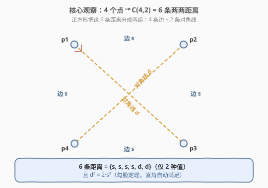
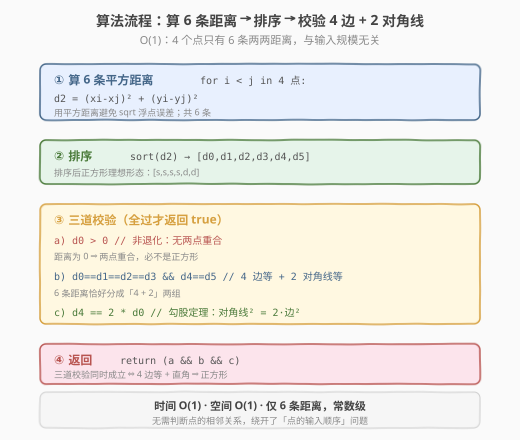
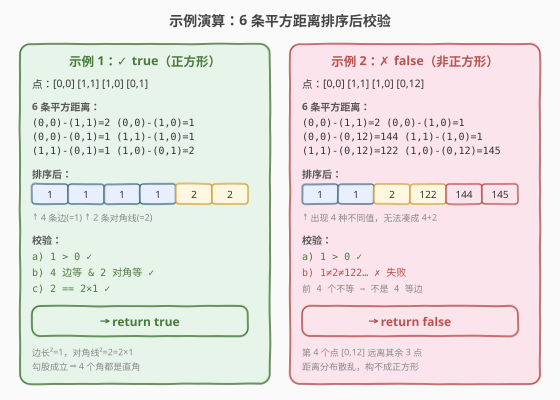

# LeetCode 有效的正方形 题解

## 1. 题目概述

- **标题 / 题号**：有效的正方形（#593，medium）
- **链接**：https://leetcode.cn/problems/valid-square/
- **难度**：中等
- **标签**：几何、数学、排序

**题意**：给定 2D 空间中四个点的坐标 `p1`、`p2`、`p3`、`p4`（**输入顺序任意**），判断它们是否构成一个**有效的正方形**。有效正方形需满足：四条边等长、四个角均为 $90^\circ$。

**示例 1**：

```text
输入：p1 = [0,0], p2 = [1,1], p3 = [1,0], p4 = [0,1]
输出：true
解释：四点恰为单位正方形的四个顶点。
```

**示例 2**：

```text
输入：p1 = [0,0], p2 = [1,1], p3 = [1,0], p4 = [0,12]
输出：false
解释：[0,12] 远离其余三点，无法围成正方形。
```

**示例 3**：

```text
输入：p1 = [1,0], p2 = [-1,0], p3 = [0,1], p4 = [0,-1]
输出：true
解释：这是一个旋转 45° 的正方形（菱形形态，但角度为 90°）。
```

**约束**：

- `p1.length == p2.length == p3.length == p4.length == 2`
- $-10^4 \le x_i, y_i \le 10^4$

> 💡 本题最大的陷阱是「输入顺序任意」：你**不知道哪两个点是相邻顶点、哪两个是对角顶点**。直接按定义验证「4 边等 + 4 角直」需要先确定邻接关系，写起来绕。下面的「6 条距离分组法」用一个排序就绕开了这个问题。

## 2. 解题思路

### 2.1 暴力思路：按定义逐项验证

最直白的做法是按正方形的定义来：先确定每个点的两个相邻顶点，再验证「4 条边等长」与「4 个角为 $90^\circ$」（用向量点积为 0）。

但难点在于**确定邻接关系**：对每个点，把它到其余三点的距离排序，最近的两个应当是相邻顶点（边），最远的那个是对角顶点（对角线）。然后逐一核验边长相等、对角线相等、以及边之间互相垂直。

这样做能过，但分支多、易写错：要处理「4 个点各自的邻接表」「边去重」「角度判定向量」等。下面用**一个全局观察**把所有这些条件一次性压缩成「6 条距离的排序结果」。

### 2.2 核心观察：6 条两两距离的分组



4 个点之间共有 $C_4^2 = 6$ 条两两距离。**正方形会把这 6 条距离自然分成两组**：

- **4 条边**：长度相等，记为 $s$；
- **2 条对角线**：长度相等，记为 $d$。

并且由勾股定理，对角线与边满足 $d^2 = 2 s^2$（因为正方形对角线把正方形切成两个等腰直角三角形）。

> 💡 **关键直觉**：我们不需要知道「谁挨着谁」。只要把 6 条距离**排序**，正方形的理想形态就是 $[s, s, s, s, d, d]$——前 4 个相等、后 2 个相等、且后者 = 2 × 前者。一个排序同时把「4 边等」「2 对角线等」「角度为直角」三件事全部验证完。

### 2.3 三道校验为何充分

有人会担心：会不会存在一个**非正方形**的四点形，6 条距离也排成 $[s,s,s,s,d,d]$ 且 $d=2s$？答案是不会，简要论证：

- **菱形**（4 边等但角度非 90°）：两条对角线**不相等** ⟹ 出现 3 种距离值 ⟹ 校验 b（4+2 分组）失败。
- **矩形**（4 角直但边不全等）：有 2 条短边、2 条长边、2 条对角线 ⟹ 出现 3 种距离值 ⟹ 校验 b 失败（除非恰好 $s_1 = s_2$ 退化为正方形）。
- **退化为点**（有重合点）：出现距离 0 ⟹ 校验 a（$d_0 > 0$）失败。
- **勾股锁定直角**：在 4+2 分组成立的前提下，取一个由「两条相邻边 + 一条对角线」构成的三角形，记夹角为 $\theta$。由余弦定理 $d^2 = s^2 + s^2 - 2 s^2 \cos\theta = 2 s^2(1 - \cos\theta)$。代入 $d^2 = 2 s^2$ 得 $\cos\theta = 0$，即 $\theta = 90^\circ$。故四个角都是直角 ⟹ 正方形。

> ⚠️ **务必用平方距离**，不要开根号。一是避免浮点误差（坐标范围整数，平方距离是精确整数）；二是勾股关系 $d^2 = 2 s^2$ 直接用平方距离写即可，无需 $\sqrt{2}$。

### 2.4 算法流程图



**完整步骤**：

1. **枚举 6 条距离**：对 4 个点两两组合 $i < j$，计算平方距离 $d^2 = (x_i - x_j)^2 + (y_i - y_j)^2$，存入数组。
2. **排序**：`sort(d2)`，得到 $[d_0, d_1, d_2, d_3, d_4, d_5]$。
3. **三道校验**（全过才返回 `true`）：
   - `d2[0] > 0`：非退化，无两点重合；
   - `d2[0]==d2[1]==d2[2]==d2[3]` 且 `d2[4]==d2[5]`：4 边等 + 2 对角线等；
   - `d2[4] == 2 * d2[0]`：勾股关系，锁定直角。
4. 返回三道校验的逻辑与。

### 2.5 示例演算



**示例 1**（`[0,0],[1,1],[1,0],[0,1]`）：6 条平方距离为 $\{2,1,1,1,1,2\}$，排序得 $[1,1,1,1,2,2]$。

- $d_0 = 1 > 0$ ✓
- 4 个 $1$ + 2 个 $2$ ✓
- $2 = 2 \times 1$ ✓

三道全过 ⟹ `true`。

**示例 2**（`[0,0],[1,1],[1,0],[0,12]`）：6 条平方距离为 $\{2,1,144,1,122,145\}$，排序得 $[1,1,2,122,144,145]$。

- $d_0 = 1 > 0$ ✓
- 但前 4 个 $\{1,1,2,122\}$ 已经不相等 ✗

校验 b 失败 ⟹ `false`。

## 3. 参考代码

### C++

```cpp
// 有效的正方形.cpp —— 6 条平方距离排序 + 三道校验
// 编译: g++ -O2 -std=c++17 有效的正方形.cpp -o validsquare
#include <vector>
#include <algorithm>
using namespace std;

class Solution {
  public:
    bool validSquare(vector<int>& p1, vector<int>& p2,
                     vector<int>& p3, vector<int>& p4) {
        vector<vector<int>> pts = {p1, p2, p3, p4};
        vector<long long> d2;              // 用 long long 防止坐标平方溢出
        for (int i = 0; i < 4; i++)
            for (int j = i + 1; j < 4; j++) {
                long long dx = pts[i][0] - pts[j][0];
                long long dy = pts[i][1] - pts[j][1];
                d2.push_back(dx * dx + dy * dy);
            }
        sort(d2.begin(), d2.end());
        return d2[0] > 0                                   // a) 非退化
            && d2[0] == d2[1] && d2[1] == d2[2]
            && d2[2] == d2[3]                              // b) 4 边等
            && d2[4] == d2[5]                              // b) 2 对角线等
            && d2[4] == 2 * d2[0];                         // c) 勾股关系
    }
};
```

### Python

```python
from typing import List

class Solution:
    def validSquare(self, p1: List[int], p2: List[int],
                    p3: List[int], p4: List[int]) -> bool:
        pts = [p1, p2, p3, p4]
        d2 = []
        for i in range(4):
            for j in range(i + 1, 4):
                dx = pts[i][0] - pts[j][0]
                dy = pts[i][1] - pts[j][1]
                d2.append(dx * dx + dy * dy)
        d2.sort()
        return (d2[0] > 0                               # a) 非退化
                and d2[0] == d2[1] == d2[2] == d2[3]    # b) 4 边等
                and d2[4] == d2[5]                      # b) 2 对角线等
                and d2[4] == 2 * d2[0])                 # c) 勾股关系
```

> ⚠️ C++ 中坐标范围 $[-10^4, 10^4]$，平方距离最大约 $(2 \times 10^4)^2 + (2 \times 10^4)^2 = 8 \times 10^8$，未溢出 `int`（约 $2.1 \times 10^9$），但 `long long` 更稳妥，避免边界数据踩坑。Python 无溢出问题。

## 4. 复杂度分析

| 维度 | 复杂度 | 说明 |
|------|--------|------|
| **时间复杂度** | $O(1)$ | 4 个点共 6 条距离，排序 6 个元素，全部常数级 |
| **空间复杂度** | $O(1)$ | 仅存储 6 个距离值 |

> 💡 任何基于「4 个点」的几何判定本质都是 $O(1)$。本题的优雅之处不在复杂度，而在于**用一个排序把邻接关系、边等、角直三件事一次性消解掉**。

## 5. 扩展：按坐标排序的对角配对法

另一种常见写法：先对 4 个点按字典序（先 $x$ 后 $y$）排序。可以证明，**对任意正方形，排序后 `p[0]` 与 `p[3]` 是一条对角线的两端，`p[1]` 与 `p[2]` 是另一条对角线的两端**。于是邻接关系被直接确定：

- 4 条边：`(p0,p1)、(p0,p2)、(p1,p3)、(p2,p3)`，长度应相等；
- 2 条对角线：`(p0,p3)`、`(p1,p2)`，长度应相等且 $= \sqrt{2} \times$ 边长（平方距离 $= 2 \times$ 边长平方）。

```cpp
class Solution {
  public:
    bool validSquare(vector<int>& p1, vector<int>& p2,
                     vector<int>& p3, vector<int>& p4) {
        vector<vector<int>> p = {p1, p2, p3, p4};
        sort(p.begin(), p.end());                 // 字典序：p0-p3 与 p1-p2 为对角线
        auto d2 = [](const vector<int>& a, const vector<int>& b) {
            long long dx = a[0] - b[0], dy = a[1] - b[1];
            return dx * dx + dy * dy;
        };
        long long s = d2(p[0], p[1]);             // 任取一条边作基准
        return s > 0
            && s == d2(p[0], p[2]) && s == d2(p[1], p[3]) && s == d2(p[2], p[3])
            && d2(p[0], p[3]) == d2(p[1], p[2])
            && d2(p[0], p[3]) == 2 * s;
    }
};
```

两种写法等价：本质都落在「4 边等 + 2 对角线等 + $d^2 = 2 s^2$」。6 距离排序法**完全不依赖输入顺序**，代码更短、更不易错；坐标排序法直观展示了「对角线配对」的几何结构，适合面试时辅助讲解。

> 💡 **向量法**也值得一提：任取一点 `A`，算它到其余三点的向量 $\vec{u}, \vec{v}, \vec{w}$。若构成正方形，其中之一必为另两个之和（对角线 = 两边向量之和），且那两个边向量等长、点积为 0。可作为第三种思路，但实现细节略多。

## 6. 面试要点

1. **为什么用平方距离而不是开根号？**

   - 坐标是整数，平方距离也是整数，**精确无误差**；开根号引入浮点数，比较 `==` 时可能因精度问题误判。此外勾股关系 $d^2 = 2 s^2$ 直接用平方距离表达，无需处理 $\sqrt{2}$。

2. **校验「$d_0 > 0$」的作用是什么？能不能省？**

   - 它排除**退化情形**：若存在两点重合，则某条距离为 0，排序后 $d_0 = 0$。此时即便 $d_2[4] == 2 \times d_2[0]$ 也成立（$0 = 2 \times 0$），会误判为正方形。所以这道「非退化」校验**必须显式写**，不能省。

3. **菱形和矩形为什么会被正确拒绝？**

   - 菱形：4 边等但两对角线不等 ⟹ 6 条距离出现 3 种值 ⟹ 校验 b（4+2 分组）失败。矩形：两对短/长边 + 两对角线 ⟹ 3 种值 ⟹ 同样失败。只有正方形（边全等 + 对角线全等 + 勾股）能同时通过三道校验。

4. **为什么排序后理想形态是 `[s,s,s,s,d,d]`？**

   - 4 条边等长 $s$、2 条对角线等长 $d$，且 $d > s$（对角线必然长于边）。升序排序后，4 个较小的 $s$ 在前、2 个较大的 $d$ 在后。这正是排序能把「分组」自动还原出来的原因。

5. **坐标排序法中，为什么 `p[0]` 与 `p[3]` 一定是对角线两端？**

   - 对任意正方形，字典序最小的顶点（最左、左者中最下）与字典序最大的顶点（最右、右者中最上）必然是**对角顶点**。可从正方形顶点的极角分布证得：最小/最大 $x$ 总出现在一对对角顶点上。这是坐标排序法正确性的几何根基。

> 💡 **一句话总结**：本题的精髓是「绕开输入顺序」——6 条两两距离是顺序无关的，排序后用 $[s,s,s,s,d,d]$ 与 $d^2 = 2 s^2$ 一次性判定。记住「平方距离 + 非零校验 + 勾股关系」三件套，所有「判定四点构成某图形」的题都能套用。

## 同类练习题

| # | 题目 | 与本题的关联 |
|---|------|-------------|
| 149 | [直线上最多的点数](https://leetcode.cn/problems/max-points-on-a-line/)（[题解](../0101-0200/149_直线上最多的点数.md)） | 平面点集几何题，用 GCD 精确表示斜率，同样强调「整数运算避免浮点误差」 |
| 939 | [最小面积矩形](https://leetcode.cn/problems/minimum-area-rectangle/) | 给定点集找能构成矩形的最小面积，核心是「对角点配对确定矩形」，与本题的对角线思路呼应 |
| 223 | [矩形面积](https://leetcode.cn/problems/rectangle-area/) | 矩形几何坐标运算，处理重叠与边界，几何判定的另一形态 |
| 836 | [矩形重叠](https://leetcode.cn/problems/rectangle-overlap/) | 判定两轴对齐矩形是否重叠，几何边界条件处理 |
| 587 | [安装栅栏](https://leetcode.cn/problems/erect-the-fence/)（[题解](../0501-0600/587_安装栅栏.md)） | 凸包几何，处理平面点集外围，更一般的平面点集算法 |
