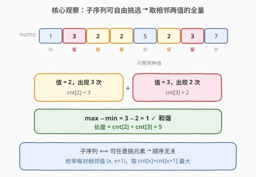
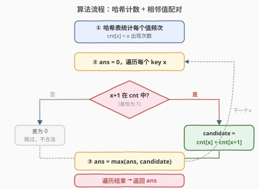
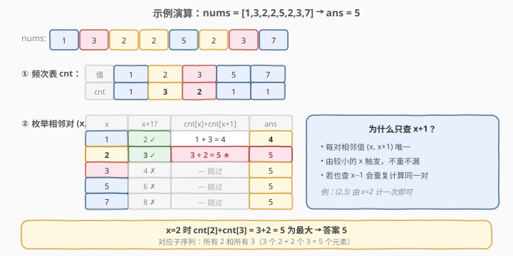

# 最长和谐子序列

- **题目名称**：最长和谐子序列
- **链接**：[594. 最长和谐子序列](https://leetcode.cn/problems/longest-harmonious-subsequence/)
- **难度**：简单
- **标签**：数组、哈希表、计数

## 1. 题目概述

定义**和谐数组**为：数组中**最大值与最小值之差正好为 1**。给你一个整数数组 `nums`，返回其中**最长和谐子序列**的长度。若不存在这样的子序列，返回 `0`。

子序列可以由数组删除若干元素（或不删除）得到，**不要求连续，但保持相对顺序**。

**示例 1**：

```text
输入：nums = [1,3,2,2,5,2,3,7]
输出：5
解释：最长和谐子序列是 [3,2,2,2,3]，长度为 5。
```

**示例 2**：

```text
输入：nums = [1,2,3,4]
输出：2
解释：可选 [1,2] / [2,3] / [3,4]，长度均为 2。
```

**示例 3**：

```text
输入：nums = [1,1,1,1]
输出：0
解释：所有值相同，最大值与最小值差为 0，不存在和谐子序列。
```

**约束条件**：

- `1 <= nums.length <= 3 * 10^4`
- $-10^9 \le \text{nums}[i] \le 10^9$

---

## 2. 解题思路

### 2.1 暴力思路

枚举所有子序列（$2^n$ 种），对每个子序列求最大最小值并判断差是否为 1，取满足条件的最大长度。时间复杂度 $O(2^n \cdot n)$，完全不可行。

### 2.2 核心观察：子序列顺序无关 → 哈希计数



关键转化：本题求的是**子序列**而非子数组，子序列允许任意挑选元素而保持相对顺序。但对于「最大值 − 最小值 = 1」这一**只依赖值域**的条件而言，顺序毫无影响——只要挑出的元素里恰好只包含两种值，且这两种值相差 1 即可。

> 💡 因此问题等价于：**在所有「值 x」和「值 x+1」中，最多能取多少个**。贪心地，把这两种值的**全部出现**都取走一定最优。

于是只需：

1. 用哈希表统计每个值的出现次数 `cnt`；
2. 枚举每个值 `x`，若 `x+1` 也在表中，则候选长度为 $\text{cnt}[x] + \text{cnt}[x+1]$；
3. 取所有候选的最大值，若没有任何相邻对存在则返回 `0`。

> ⚠️ 必须差**正好**为 1：若某值 `x` 的 `cnt[x+1]` 不存在，则只取 `x` 自身差为 0，不合法，必须跳过——这正是示例 3 返回 0 的原因。

### 2.3 算法流程图



### 2.4 示例演算



以 `nums = [1,3,2,2,5,2,3,7]` 为例：

- 频次表：`{1:1, 2:3, 3:2, 5:1, 7:1}`
- 枚举相邻对（只查 `x+1` 方向，避免重复计算同一对）：
  - `x=1`：`2` 存在 → $1+3=4$，`ans=4`
  - `x=2`：`3` 存在 → $3+2=5$，`ans=5` ★
  - `x=3`：`4` 不存在 → 跳过
  - `x=5`：`6` 不存在 → 跳过
  - `x=7`：`8` 不存在 → 跳过
- 答案 `5`，对应挑走全部 `2`（3 个）和全部 `3`（2 个）。

---

## 3. 参考代码

### C++

```cpp
class Solution {
  public:
    int findLHS(vector<int>& nums) {
        unordered_map<int, int> cnt;
        for (int x : nums) cnt[x]++;

        int ans = 0;
        for (auto& [x, c] : cnt) {
            auto it = cnt.find(x + 1);
            if (it != cnt.end()) {
                ans = max(ans, c + it->second);
            }
        }
        return ans;
    }
};
```

### Python

```python
from collections import Counter

class Solution:
    def findLHS(self, nums: List[int]) -> int:
        cnt = Counter(nums)
        ans = 0
        for x, c in cnt.items():
            if x + 1 in cnt:
                ans = max(ans, c + cnt[x + 1])
        return ans
```

---

## 4. 复杂度分析

| 维度 | 复杂度 | 说明 |
|------|--------|------|
| 时间复杂度 | $O(n)$ | 一次遍历建表 + 一次遍历哈希表键，每个值 $O(1)$ 查询 `x+1` |
| 空间复杂度 | $O(n)$ | 哈希表最多存 $n$ 个不同值 |

---

## 5. 扩展：排序法

若值域不可哈希或追求稳定无额外依赖，可先**排序**再扫描。排序后相同值连续出现，相邻不同值若相差 1 即可配对：

```cpp
class Solution {
  public:
    int findLHS(vector<int>& nums) {
        sort(nums.begin(), nums.end());
        int ans = 0, n = nums.size();
        for (int i = 0; i < n;) {
            int j = i;
            while (j < n && nums[j] == nums[i]) j++;   // 跳过同值段
            int cnt_x = j - i;
            if (j < n && nums[j] == nums[i] + 1) {     // 紧邻下一段恰为 x+1
                int k = j;
                while (k < n && nums[k] == nums[j]) k++;
                ans = max(ans, cnt_x + (k - j));
            }
            i = j;
        }
        return ans;
    }
};
```

- 时间 $O(n \log n)$，空间 $O(\log n)$（排序栈）。
- 与哈希法对比：排序法无需哈希表（适合值无法哈希的场景），但时间多一个 $\log$。

> 💡 注意排序法**不能**简单扫相邻元素判 `nums[i+1]-nums[i]==1`：同值段内部相邻差为 0，必须按「段」处理。

---

## 6. 面试要点

1. **为什么子序列问题可以转化为频次计数？**
   - 本题的最值条件只依赖**值域**与**是否同时存在两种相差 1 的值**，与顺序无关。子序列允许任意挑选，故贪心取满两种值最优。

2. **为什么不查 `x-1` 只查 `x+1`？**
   - 每对相邻值 `(x, x+1)` 由较小的 `x` 触发即可唯一覆盖；若同时查 `x-1`，同一对会被计算两次（虽不影响 `max` 结果，但属冗余）。

3. **数组全是相同值时返回什么？为什么不是 `n`？**
   - 返回 `0`。和谐要求差**正好**为 1，单一值差为 0 不满足，且 `x+1` 不在表中，全部被跳过。

4. **值域 $-10^9$ 到 $10^9$ 对实现有何影响？**
   - 不能用数组下标做桶（空间爆炸），必须用哈希表（`unordered_map` / `Counter`）；排序法不受影响。

5. **若改为「子数组」（要求连续）该怎么做？**
   - 变为滑动窗口：窗口内最多两种值且差 $\le 1$ 时扩张，否则收缩；记录窗口内恰含两种相差 1 的值时的最大长度。

---

## 7. 同类练习题

- [128. 最长连续序列](https://leetcode.cn/problems/longest-consecutive-sequence/)：哈希集合判定相邻值是否存在的招牌题，本题的「枚举 x 查 x+1」思想与之同源
- [560. 和为K的子数组](https://leetcode.cn/problems/subarray-sum-equals-k/)（[题解](../0501-0600/560_和为K的子数组.md)）：哈希表计数 + 配对查询，本题的计数配对范式延伸到前缀和场景
- [219. 存在重复元素 II](https://leetcode.cn/problems/contains-duplicate-ii/)：哈希表存值与下标做配对判定，从「长度计数」退化为「存在性判定」
- [454. 四数相加 II](https://leetcode.cn/problems/4sum-ii/)（[题解](../0401-0500/454_四数相加 II.md)）：分组 + 哈希计数的 Meet-in-the-Middle，配对查询思想的进阶应用
