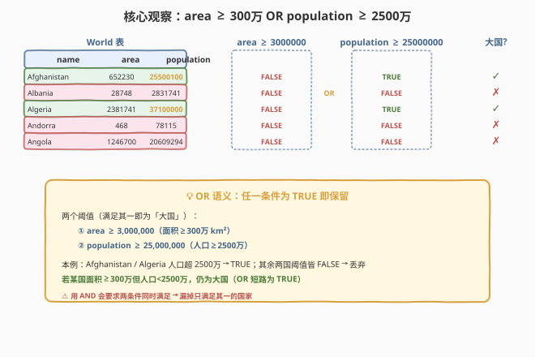
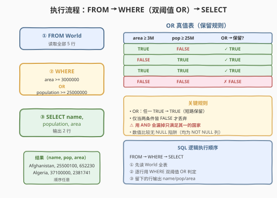
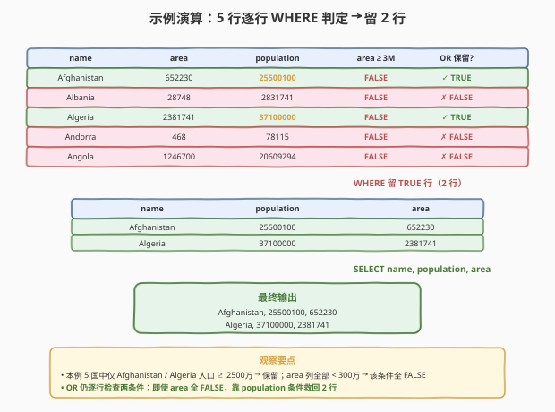

# LeetCode 大的国家 题解

## 1. 题目概述

- **标题 / 题号**：大的国家（#595，easy）
- **链接**：https://leetcode.cn/problems/big-countries/
- **难度**：简单
- **标签**：SQL、WHERE、OR、数值比较

**题意**：给定 `World` 表，每行记录一个国家的 `name`（名称）、`continent`（所属大陆）、`area`（面积）、`population`（人口）和 `gdp`（国内生产总值）。如果一个国家满足下列**任一条件**，则认为该国是「大国」：

1. **面积至少为 300 万平方公里**（即 `area >= 3000000`），或者
2. **人口至少为 2500 万**（即 `population >= 25000000`）。

编写 SQL 查询，返回所有「大国」的 `name`、`population` 和 `area`。结果可按任意顺序返回。

**表结构**：

```text
Table: World
+-------------+---------+
| Column Name | Type    |
+-------------+---------+
| name        | varchar |  ← 主键
| continent   | varchar |
| area        | int     |
| population  | int     |
| gdp         | bigint  |
+-------------+---------+
```

> 💡 **关键约束**：`name` 是主键（每国唯一）。两列阈值条件用 **`OR`** 连接——任一满足即为大国。这与 [584. 寻找用户推荐人](../0501-0600/584_寻找用户推荐人.md) 的 `OR referee_id IS NULL` 同为「`WHERE` + `OR`」骨架，但本题两条件都是**数值比较**，无 `NULL` 三值逻辑陷阱，是最纯粹的「双阈值 `OR` 过滤」入门母题。

**示例 1**：

```text
输入：
World 表:
+-------------+-----------+---------+------------+--------------+
| name        | continent | area    | population | gdp          |
+-------------+-----------+---------+------------+--------------+
| Afghanistan | Asia      | 652230  | 25500100   | 20343000000  |
| Albania     | Europe    | 28748   | 2831741    | 12960000000  |
| Algeria     | Africa    | 2381741 | 37100000   | 188681000000 |
| Andorra     | Europe    | 468     | 78115      | 3712000000   |
| Angola      | Africa    | 1246700 | 20609294   | 100990000000 |
+-------------+-----------+---------+------------+--------------+

输出：
+-------------+------------+---------+
| name        | population | area    |
+-------------+------------+---------+
| Afghanistan | 25500100   | 652230  |
| Algeria     | 37100000   | 2381741 |
+-------------+------------+---------+
```

**解释**：

- **Afghanistan**：`population = 25500100 >= 25000000` → 满足人口阈值 → 大国（`area = 652230 < 3000000`，面积条件不满足，但 `OR` 任一即可）。
- **Algeria**：`population = 37100000 >= 25000000` → 满足人口阈值 → 大国（同理 `area = 2381741 < 3000000`）。
- **Albania / Andorra / Angola**：`area` 与 `population` 均**低于**各自阈值 → 两条件皆 `FALSE` → `OR` 为 `FALSE` → 不是大国。

**约束**：

- `name` 是 `World` 表的主键。
- 结果可按任意顺序返回。
- 输出列为 `name`、`population`、`area`（注意顺序与表结构不同，`population` 在 `area` 前）。

> 💡 本题是 SQL **`WHERE` + `OR` 多条件过滤**的最小母题——单表、无 `JOIN`、无 `GROUP BY`、无 `NULL` 处理，全部考点集中在「`OR` 连接两个数值阈值」。它和 [584](../0501-0600/584_寻找用户推荐人.md) 的 `OR` 骨架完全一致，只是把 `IS NULL` 换成数值比较；和 [511. 游戏玩法分析 I](../0501-0600/511_游戏玩法分析I.md) 的区别在于 511 要「分组聚合」，本题只要「行级过滤」——`WHERE` 不 `GROUP BY`。

## 2. 解题思路

### 2.1 暴力思路：过程式逐行判定

最直觉的做法是用过程式语言逐行扫描 `World`，对每个国家判定是否为「大国」：

```text
for each row in World:
    a = row.area
    p = row.population
    if a >= 3000000 or p >= 25000000:   # 任一阈值满足
        emit (row.name, p, a)
```

但**纯 SQL 没有显式 `if` 语句**——上述「逐行判定 + 多条件 `OR`」的模式，在 SQL 里一一对应于 `WHERE area >= 3000000 OR population >= 25000000`。难点不在写法，而在理解 `OR` 的短路语义与 `WHERE` 的行级过滤本质。

> ⚠️ 关键转换：把「面积 ≥ 300 万」翻译成 `area >= 3000000`；把「人口 ≥ 2500 万」翻译成 `population >= 25000000`；把「任一满足」翻译成 `OR`。两条件用 `OR` 连接（**不是 `AND`**）——`AND` 会要求两个阈值同时满足，漏掉只满足其一的国家。这是本题唯一也是最大的陷阱。

### 2.2 核心观察：WHERE area >= 3000000 OR population >= 25000000



**两条件 `OR` 覆盖三类国家**：

1. **`area >= 3000000`**（面积大国）：第 1 条件 `TRUE` → `OR` 短路为 `TRUE` → 保留（无论人口多少）。
2. **`population >= 25000000`**（人口大国）：第 1 条件 `FALSE`、第 2 条件 `TRUE` → `OR` 为 `TRUE` → 保留。
3. **两条件都不满足**（小国）：两条件皆 `FALSE` → `OR` 为 `FALSE` → 丢弃。

$$\text{大国} = \{\, c \in \text{World} \mid c.\text{area} \ge 3\,000\,000 \,\lor\, c.\text{population} \ge 25\,000\,000 \,\}$$

> 💡 **`OR` 的短路语义**：SQL 的 `OR` 对每行独立求值——只要有一个条件为 `TRUE`，该行整体 `OR` 即为 `TRUE` 被保留。这与 `AND` 相反：`AND` 要求**所有**条件为 `TRUE` 才保留。本题「任一阈值满足即为大国」天然对应 `OR`；若误用 `AND`，会要求「面积≥300万**且**人口≥2500万」，只保留同时满足两条件的国家，漏掉只满足其一的——例如本例中 Afghanistan 面积仅 65 万（< 300万）但人口 2550 万（≥ 2500万），用 `AND` 会被错误丢弃。

> ⚠️ **本例的特殊性**：示例 5 国的 `area` 全部小于 300 万（最大 Algeria 的 238 万也仅约阈值的 80%），所以面积条件**对本例全 `FALSE`**——保留的 Afghanistan/Algeria 全靠人口条件救回。但这不代表面积条件无用：真实世界存在大量「地广人稀」的大国（如俄罗斯、加拿大面积远超 300 万但人口密度低），它们靠面积条件入选。`OR` 的价值正在于覆盖「面积型大国」和「人口型大国」两类。

### 2.3 算法流程图



**逻辑执行顺序**：

| 步骤 | 子句 | 作用 |
|------|------|------|
| ① | `FROM World` | 读取 `World` 全部行（示例 5 行） |
| ② | `WHERE area >= 3000000 OR population >= 25000000` | 逐行判定双阈值 `OR`，留 `TRUE` 行 |
| ③ | `SELECT name, population, area` | 输出保留行的三列 |

> 💡 **SQL 逻辑执行顺序为 `FROM → WHERE → SELECT`**——`WHERE` 在 `SELECT` 之前，所以 `WHERE` 引用的是表原始列（`area`/`population`），不能引用 `SELECT` 中定义的别名。本题无 `JOIN`、无 `GROUP BY`、无窗口函数，是单表过滤的最简执行链。对比 [511. 游戏玩法分析 I](../0501-0600/511_游戏玩法分析I.md) 的 `GROUP BY + MIN` 聚合，本题连聚合都不需要，只做行级过滤。

### 2.4 示例演算

以示例 5 行数据为例，观察 `WHERE` 如何对每个国家做双阈值 `OR` 判定：



**逐行判定**（`a = area`，`p = population`）：

| name | area | population | `a >= 3M` | `p >= 25M` | `OR` 结果 | 保留? |
|------|------|------------|-----------|------------|-----------|-------|
| Afghanistan | 652230 | 25500100 | FALSE | **TRUE** | **TRUE** | ✓ |
| Albania | 28748 | 2831741 | FALSE | FALSE | FALSE | ✗ |
| Algeria | 2381741 | 37100000 | FALSE | **TRUE** | **TRUE** | ✓ |
| Andorra | 468 | 78115 | FALSE | FALSE | FALSE | ✗ |
| Angola | 1246700 | 20609294 | FALSE | FALSE | FALSE | ✗ |

最终 `WHERE` 留下 2 行（Afghanistan/Algeria），`SELECT name, population, area` 输出这三列，顺序任意。

> 💡 **判定规律**：
> - **人口大国**（Afghanistan/Algeria）：`p >= 25M` 为 `TRUE`，即使 `a >= 3M` 为 `FALSE`，`OR` 短路为 `TRUE` 被保留——这是 `OR` 救回「只满足人口阈值」国家的体现。
> - **小国**（Albania/Andorra/Angola）：两条件都 `FALSE`，`OR` 为 `FALSE` 被丢弃。注意 Angola 人口 2060 万接近但**未达** 2500 万阈值，`20609294 < 25000000` → `FALSE`。
> - **本例未出现「面积大国」**：5 国 `area` 均 < 300 万，`a >= 3M` 全 `FALSE`。若有 `area = 5000000` 的国家，即便人口很少，`a >= 3M` 为 `TRUE` 即被保留——这正是 `OR` 覆盖面积型大国的价值。

## 3. 参考代码

### SQL（解法 A：WHERE + OR，推荐）

```sql
SELECT name, population, area
FROM World
WHERE area >= 3000000 OR population >= 25000000;
```

> 💡 **写法要点**：
> - `WHERE area >= 3000000 OR population >= 25000000`：两阈值用 `OR` 连接，任一满足即保留。**切勿用 `AND`**——`AND` 要求两条件同时满足，会漏掉只满足其一的大国。
> - `SELECT name, population, area`：输出三列，顺序与题目要求一致（`population` 在 `area` 前，与表结构列序不同，但 SQL 不依赖列序，按 `SELECT` 顺序输出）。
> - 数值比较直接用 `>=`，无需引号（`area`/`population` 是数值类型）；阈值常量 `3000000`/`25000000` 可加下划线分隔（MySQL 8.0+ 支持 `3_000_000` 增强可读性，但 LeetCode 环境建议用纯数字兼容旧版）。
> - 单表过滤，无 `JOIN`/`GROUP BY`，执行计划即「全表扫描 + 行级过滤」。

### SQL（解法 B：UNION 拆分两类条件）

```sql
SELECT name, population, area
FROM World
WHERE area >= 3000000
UNION
SELECT name, population, area
FROM World
WHERE population >= 25000000;
```

> 💡 **写法要点**：
> - 把 `OR` 拆成两个独立 `SELECT`，用 `UNION` 合并去重。`UNION` 默认去重（`UNION ALL` 不去重）——本题 `name` 是主键，两个子查询若返回同一国（既面积大国又人口大国），`UNION` 自动去重，结果与 `OR` 写法等价。
> - **何时用 `UNION` 拆 `OR`**：当表极大且 `area`、`population` 各自有索引时，`OR` 通常导致优化器放弃索引退化为全表扫描；拆成 `UNION` 后每个子查询可独立走对应列的索引，再用 `UNION` 合并——这是 SQL 性能优化的经典手法。本题表小无需此举，但面试中可主动提及。
> - 缺点：语句更长、读两次表（无索引时反而比 `OR` 慢）。

### Python（pandas）

```python
import pandas as pd

def big_countries(world: pd.DataFrame) -> pd.DataFrame:
    mask = (world['area'] >= 3000000) | (world['population'] >= 25000000)
    return world.loc[mask, ['name', 'population', 'area']]
```

> 💡 **pandas 对照**：`world['area'] >= 3000000` 对应 `WHERE area >= 3000000`；`|` 对应 `OR`（注意 pandas 中 `|` 是按位或，需加括号因优先级低于 `>=`）；`loc[mask, cols]` 对应 `SELECT ... WHERE ...`，按指定列顺序输出。pandas 的布尔运算结果直接是 `True/False`（无 SQL 的 `UNKNOWN`），逻辑更直观——这也是本题无 `NULL` 陷阱的体现。

## 4. 复杂度分析

| 维度 | 复杂度 | 说明 |
|------|--------|------|
| **时间（WHERE + OR）** | $O(n)$ | $n$ = `World` 表行数。`WHERE` 对全表线性扫描逐行判定，每行 $O(1)$（两个比较 + 一个 `OR`）。无 `JOIN`/`GROUP BY`/排序，整体由全表扫描主导 |
| **时间（UNION）** | $O(n)$ ~ $O(n \log n)$ | 两次扫描 + 去重。若各列有索引可走索引扫描 $O(k_1 + k_2)$（$k_i$ = 满足各条件行数）；去重需排序或哈希，$O(n \log n)$。无索引时两次全表扫描 + 去重，通常慢于 `OR` |
| **空间** | $O(k)$ | 结果集 $k$ 行（大国数），至多 $n$。`UNION` 写法额外需去重缓冲 $O(k)$ |
| **结果行数** | $O(k)$ | $k$ = `area >= 3M` 的国家数 + `population >= 25M` 的国家数 − 两者交集（`UNION` 自动去重） |

> ⚠️ **全表扫描的代价**：本题 `WHERE` 条件含 `OR`，通常导致优化器放弃 `area`/`population` 上的单列索引，退化为全表扫描。但 `World` 表通常不大（国家级数据行数有限，全球仅约 200 行），全表扫描 $O(n)$ 完全可接受。若表极大且需加速，可用解法 B 的 `UNION` 拆分让每个子查询走对应列的索引；或在 `(area, population)` 上建复合索引（但 `OR` 对复合索引利用有限，`UNION` 拆分更有效）。面试中说明「`OR` 通常导致全表扫描、`World` 表小可接受、大表场景可拆 `UNION` 走索引」即可。

## 5. 扩展：OR vs AND vs UNION 的取舍

### 5.1 OR 与 AND 的语义对照

「任一满足」与「全部满足」是 SQL 过滤的两种基本模式，对应 `OR` 与 `AND`：

| 需求 | 连接符 | 语义 | 保留条件 |
|------|--------|------|----------|
| 任一阈值满足即保留 | `OR` | 至少一个 `TRUE` | 仅当全部 `FALSE` 才丢弃 |
| 全部阈值满足才保留 | `AND` | 全部为 `TRUE` | 仅当全部 `TRUE` 才保留 |

```sql
-- 本题：任一满足 → OR（正确）
WHERE area >= 3000000 OR population >= 25000000

-- 若误用 AND：要求面积≥300万且人口≥2500万（错误，漏掉只满足其一的大国）
WHERE area >= 3000000 AND population >= 25000000
```

> 💡 **选择口诀**：题目说「**或**」「**任一**」「**至少满足一个**」→ `OR`；题目说「**且**」「**同时**」「**都满足**」→ `AND`。本题题面明确「满足下述两个条件**之一**」→ `OR`。

### 5.2 OR 与 UNION ALL 的等价转换

`WHERE cond1 OR cond2` 可改写为 `UNION`（去重）或 `UNION ALL`（不去重）：

```sql
-- 写法 1：OR（最简）
SELECT name, population, area FROM World
WHERE area >= 3000000 OR population >= 25000000;

-- 写法 2：UNION（去重，等价于 OR，因为 OR 天然对同一行只判定一次）
SELECT name, population, area FROM World WHERE area >= 3000000
UNION
SELECT name, population, area FROM World WHERE population >= 25000000;

-- 写法 3：UNION ALL（不去重，仅当两条件互斥时等价于 OR）
SELECT name, population, area FROM World WHERE area >= 3000000
UNION ALL
SELECT name, population, area FROM World WHERE population >= 25000000;
```

| 写法 | 去重? | 与 `OR` 等价? | 适用场景 |
|------|-------|---------------|----------|
| `OR` | 天然去重（每行只判定一次） | ✓ | 默认首选，语法最简 |
| `UNION` | 去重 | ✓（当主键唯一时） | 大表 + 各列有索引，拆分走索引 |
| `UNION ALL` | **不去重** | ✗（除非两条件互斥） | 两条件互斥时，省去重开销 |

> 💡 **`UNION ALL` 的陷阱**：若某国**同时**满足两条件（既面积大国又人口大国），`UNION ALL` 会输出它**两次**，与 `OR`（只输出一次）不等价。本题 `name` 是主键但两条件**不互斥**（一国可同时面积大且人口多），所以 `UNION ALL` 会产生重复行，必须用 `UNION`（去重）或 `OR`。仅当两条件在逻辑上互斥（如 `WHERE x < 0 OR x >= 0`）时 `UNION ALL` 才与 `OR` 等价。

### 5.3 与 584 的对比：OR 的两种形态

本题与 [584. 寻找用户推荐人](../0501-0600/584_寻找用户推荐人.md) 同为「`WHERE` + `OR`」骨架，区别在 `OR` 连接的两个条件类型：

| 题号 | 条件 1 | 条件 2 | `OR` 形态 | 难点 |
|------|--------|--------|-----------|------|
| **595** | `area >= 3M`（数值比较） | `population >= 25M`（数值比较） | 两数值阈值 `OR` | 误用 `AND` |
| [584](../0501-0600/584_寻找用户推荐人.md) | `referee_id != 2`（数值比较） | `referee_id IS NULL`（`NULL` 判定） | 数值比较 + `IS NULL` | `NULL != 2` 是 `UNKNOWN` |

> 💡 **演进关系**：595 是 `OR` 的**最纯粹形态**——两条件都是数值比较，无 `NULL` 三值逻辑干扰，考点集中在「`OR` vs `AND` 的选择」。584 在此基础上引入 `NULL`——`NULL` 参与比较得 `UNKNOWN`，使 `OR` 的真值表多出 `UNKNOWN` 一列。掌握 595 的 `OR` 基础后，584 只需多理解「`UNKNOWN OR TRUE = TRUE`」这一条三值逻辑规则。

### 5.4 阈值常量的可读性写法

本题阈值 `3000000` 和 `25000000` 位数多，易数错零的个数。几种增强可读性的写法：

```sql
-- 写法 1：纯数字（默认，兼容性最好）
WHERE area >= 3000000 OR population >= 25000000

-- 写法 2：下划线分隔（MySQL 8.0+、PostgreSQL、Python 等支持）
WHERE area >= 3_000_000 OR population >= 25_000_000

-- 写法 3：科学计数法（数值类型支持，但可读性争议）
WHERE area >= 3e6 OR population >= 2.5e7
```

> 💡 **下划线分隔**是现代语言的通用可读性增强（Python 从 3.6、Java 从 7、MySQL 从 8.0 起）。LeetCode 用 MySQL 8.0 环境，`3_000_000` 可用。但部分旧版数据库（如 MySQL 5.7）不支持，生产环境需确认版本。面试中用纯数字最稳妥，口头说明「可用下划线分隔增强可读性」即可。

## 6. 面试要点

1. **为什么用 `OR` 而不是 `AND`？**

   - 题目说「满足两个条件**之一**」即大国——任一阈值满足即可，对应 `OR`。`AND` 要求两条件**同时**满足，会漏掉只满足其一的国家。例如 Afghanistan 人口 2550 万（≥ 2500万）但面积仅 65 万（< 300万），用 `AND` 会因面积不达标而错误丢弃它。`OR` 的语义是「至少一个 `TRUE` 即 `TRUE`」，恰好匹配「任一满足」的需求。

2. **`WHERE area >= 3000000 OR population >= 25000000` 的执行顺序是什么？**

   - 逻辑执行顺序为 `FROM → WHERE → SELECT`：① `FROM World` 读取全表；② `WHERE` 逐行对 `area` 和 `population` 求值，`OR` 短路判定保留 `TRUE` 行；③ `SELECT` 输出保留行的 `name`/`population`/`area` 三列。注意 `WHERE` 在 `SELECT` 之前，不能在 `WHERE` 中引用 `SELECT` 定义的别名。

3. **`OR` 会导致全表扫描吗？如何优化？**

   - 通常会。`WHERE` 含 `OR` 时，优化器往往放弃 `area`/`population` 上的单列索引，退化为全表扫描（因为 `OR` 要求检查两列，单列索引无法同时覆盖）。优化方法：① 拆成 `UNION`，每个子查询独立走对应列的索引；② 建复合索引 `(area, population)`（但对 `OR` 利用有限，`AND` 才能充分利用复合索引的左前缀）。本题 `World` 表小（国家级数据约 200 行），全表扫描 $O(n)$ 完全可接受，无需优化。

4. **`UNION` 拆分 `OR` 时，用 `UNION` 还是 `UNION ALL`？**

   - 用 `UNION`（去重）。因为本题两条件**不互斥**——一国可同时面积≥300万且人口≥2500万，`UNION ALL` 会输出它两次（重复行）。`UNION` 自动去重，结果与 `OR` 等价。仅当两条件逻辑互斥时（如 `x < 0` 与 `x >= 0`）才可用 `UNION ALL` 省去重开销。本题用 `OR` 最简，`UNION` 仅作大表索引优化的备选。

5. **输出列顺序与表结构不同有影响吗？**

   - 无影响。SQL 的 `SELECT` 子句决定输出列顺序，与表结构列序无关。本题要求输出 `name, population, area`（`population` 在 `area` 前），而表结构是 `name, continent, area, population, gdp`（`area` 在 `population` 前）——按 `SELECT` 指定顺序输出即可，无需调整表结构。同时 `SELECT` 只选三列，自动省略 `continent` 和 `gdp`（投影操作）。

> 💡 **一句话总结**：595 是 SQL **`WHERE` + `OR` 多条件过滤**的最小母题——核心就一句 `WHERE area >= 3000000 OR population >= 25000000`。考点只有一条：「任一满足用 `OR`，全部满足用 `AND`，切勿混淆」。它是 [584](../0501-0600/584_寻找用户推荐人.md) `OR` + `NULL` 处理题的更入门版本（去掉 `NULL` 三值逻辑），掌握本题的 `OR` 基础后，584 只需多理解一层 `UNKNOWN OR TRUE = TRUE`。

## 同类练习题

| # | 题目 | 与本题的关联 |
|---|------|-------------|
| 584 | [寻找用户推荐人](https://leetcode.cn/problems/find-customer-referee/)（[站内题解](../0501-0600/584_寻找用户推荐人.md)） | `WHERE referee_id != 2 OR referee_id IS NULL`——与本题同源的 `OR` 骨架，多一层 `NULL` 三值逻辑。本题是其更入门版本（纯数值比较，无 `NULL` 陷阱） |
| 511 | [游戏玩法分析 I](https://leetcode.cn/problems/game-play-analysis-i/)（[站内题解](../0501-0600/511_游戏玩法分析I.md)） | `GROUP BY + MIN` 聚合——对照本题的「行级 `WHERE` 过滤」与「分组聚合」的差异，同属单表操作但目标不同 |
| 183 | [从不订购的客户](https://leetcode.cn/problems/customers-who-never-order/) | `LEFT JOIN` + `IS NULL` 筛选——同属 `WHERE` 过滤家族，对比「单表阈值过滤」（595）与「连接后过滤」（183） |
| 197 | [上升的温度](https://leetcode.cn/problems/rising-temperature/)（[站内题解](../0101-0200/197_上升的温度.md)） | `Self JOIN` + `WHERE` 条件过滤，同属「单 `WHERE` 过滤」骨架，但多一层自连接与日期比较 |
| 1174 | [即时食物配送 II](https://leetcode.cn/problems/immediate-food-delivery-ii/) | `WHERE` + 子查询 `MIN`——在 `WHERE` 中用子查询聚合结果做过滤，是本题「`WHERE` 行级过滤」与 511「分组聚合」的结合升级 |
