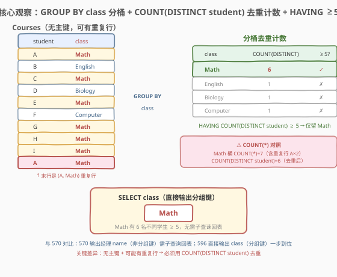
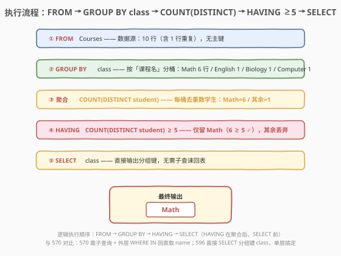
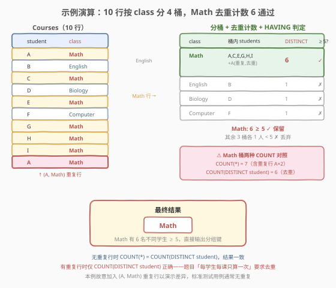

# 超过5名学生的课

- **题目名称**：超过5名学生的课
- **链接**：[596. Classes More Than 5 Students](https://leetcode.cn/problems/classes-more-than-5-students/)
- **难度**：简单
- **标签**：SQL、聚合、GROUP BY、HAVING、COUNT、DISTINCT

## 1. 题目概述

给定 `Courses` 表，每行记录一名学生 (`student`) 及其选修的课程 (`class`)。编写 SQL 查询，报告**所有至少有 5 名学生**的课程。

⚠️ **关键要求**：一名学生可以选修多门课程，但在同一门课程中**只计一次**——即便 `(student, class)` 对在表中重复出现，也只算一个学生。

**表结构**：

```text
Table: Courses
+-------------+---------+
| Column Name | Type    |
+-------------+---------+
| student     | varchar |
| class       | varchar |
+-------------+---------+
```

> ⚠️ **关键约束**：`Courses` 表**没有主键**，且**可能有重复行**——即同一个 `(student, class)` 对可以出现多次。这与 [570. 至少有5名直接下属的经理](../0501-0600/570_至少有5名直接下属的经理.md) 的 `Employee` 表（`id` 为主键、行唯一）截然不同。无主键 + 可重复这一定义直接决定了必须用 `COUNT(DISTINCT student)` 而非 `COUNT(*)` 来计数。

**示例 1**：

```text
输入：
Courses 表:
+---------+----------+
| student | class    |
+---------+----------+
| A       | Math     |
| B       | English  |
| C       | Math     |
| D       | Biology  |
| E       | Math     |
| F       | Computer |
| G       | Math     |
| H       | Math     |
| I       | Math     |
+---------+----------+

输出：
+---------+
| class   |
+---------+
| Math    |
+---------+
```

**解释**：

- Math 有 6 名学生（A、C、E、G、H、I），≥5，报告
- English 有 1 名（B），<5，不报告
- Biology 有 1 名（D），<5，不报告
- Computer 有 1 名（F），<5，不报告

**约束条件**：

- `Courses` 表无主键，可能包含重复行
- 每名学生在同一课程中只计一次
- 结果列为 `class`，可按任意顺序返回

> 💡 本题是 SQL **分组聚合 + 组级过滤**的最简母题之一——把「每门课有多少学生」翻译成 `GROUP BY class` + `COUNT`，再用 `HAVING` 筛「≥5」的组。它是 [570. 至少有5名直接下属的经理](../0501-0600/570_至少有5名直接下属的经理.md) 的简化版——570 需要子查诔回表取 `name`（输出列非分组键），而 596 直接输出分组键 `class`，单层查询一步到位。本题的独特点在于**无主键 + 可能有重复行**，迫使计数必须用 `COUNT(DISTINCT student)` 去重。

---

## 2. 解题思路

### 2.1 暴力思路：过程式逐课程数学生

最直觉的做法是用程序逐个 `class` 处理：遍历所有不同的课程名，对每门课收集其所有学生名并去重，去重后的人数若 ≥5 则输出该课程。伪代码如下：

```text
classes = {}
for each row in Courses:
    cls = row.class
    classes.setdefault(cls, set()).add(row.student)
for cls, students in classes:
    if len(students) >= 5:
        emit cls
```

但**纯 SQL 没有显式循环语句**——上述「按课程分桶、桶内学生去重、筛去重后人数 ≥5」的模式，在 SQL 里一一对应于 `GROUP BY` + `COUNT(DISTINCT)` + `HAVING`。

> ⚠️ 关键转换：把「按课程分桶」翻译成 `GROUP BY class`（分桶）；「桶内学生去重后数人数」翻译成 `COUNT(DISTINCT student)`（去重计数）；「筛 ≥5 的课」翻译成 `HAVING COUNT(DISTINCT student) >= 5`（组级过滤）。这是 [511. 游戏玩法分析 I](../0501-0600/511_游戏玩法分析I.md) 「分组聚合」范式的直接延伸——只是把 `MIN` 换成 `COUNT(DISTINCT)`，并多了一道 `HAVING` 门槛。

### 2.2 核心观察：GROUP BY class + COUNT(DISTINCT student) + HAVING ≥5



**三步合一**：

1. **`GROUP BY class`**：把 `Courses` 的所有行按课程名分桶——同一课程的所有学生行进入同一桶。
2. **`COUNT(DISTINCT student)`**：对每个桶内的学生名去重后计数，即该课程的不同学生数。
3. **`HAVING COUNT(DISTINCT student) >= 5`**：组级过滤，只保留「≥5 名不同学生」的课程。

$$\text{合格课程集合} = \{\, c \mid \#\{\,\text{DISTINCT } s : (s, c) \in \text{Courses}\,\} \ge 5 \,\}$$

> 💡 **为什么用 `COUNT(DISTINCT student)` 而非 `COUNT(*)`？** `Courses` 表**无主键且可能有重复行**——同一个 `(student, class)` 对可以出现多次。`COUNT(*)` 数所有行（含重复行），若学生 A 在 Math 出现 2 次，Math 的 `COUNT(*)` 会把它数成 2，**虚高**。`COUNT(DISTINCT student)` 先去重再数，每个学生在每门课只算一次，符合题目要求。若题目保证无重复行（如原始测试用例），两者结果一致；但题目明确说「可能有重复行」且「每学生每课只算一次」，`COUNT(DISTINCT student)` 才是语义正确的写法。

> ⚠️ **与 570 的关键区别**：[570](../0501-0600/570_至少有5名直接下属的经理.md) 的 `Employee` 表有主键 `id`（行唯一），所以 `COUNT(*)` 安全；且 570 输出的是经理 `name`（非分组键 `managerId`），需要子查诔回表取 `name`。本题 `Courses` 无主键（行可重复），所以必须 `COUNT(DISTINCT)`；且输出 `class` 正是分组键，**直接 `SELECT` 即可，无需子查询**——单层查询搞定。

### 2.3 算法流程图



**逻辑执行顺序**：

| 步骤 | 子句 | 作用 | 示例数据 |
|------|------|------|----------|
| ① | `FROM Courses` | 读取全部行（含可能的重复行） | 10 行（含 1 行重复） |
| ② | `GROUP BY class` | 按课程名分桶 | 4 桶 {Math, English, Biology, Computer} |
| ③ | `COUNT(DISTINCT student)`（SELECT 阶段） | 每桶去重数学生 | Math=6, 其余=1 |
| ④ | `HAVING COUNT(DISTINCT student) >= 5` | 组级过滤，只留 ≥5 的桶 | 仅留 Math |
| ⑤ | `SELECT class` | 输出分组键 | → Math |

> 💡 **书写顺序 vs 执行顺序**：SQL 写作 `SELECT → FROM → GROUP BY → HAVING`，但执行顺序是 `FROM → GROUP BY → HAVING → SELECT`。理解这一点就能解释：为什么 `HAVING` 能用 `COUNT(DISTINCT student)`（聚合在 GROUP BY 之后已完成），而 `WHERE` 不能（WHERE 在 GROUP BY 之前，聚合还没发生）。「≥5 学生」是对**每个课程组**的统计结果做判断，属于组级条件，必须用 `HAVING`。

### 2.4 示例演算

以示例数据（为演示去重效果，末行加入一个 `(A, Math)` 重复行）按 `class` 分桶：



| class（分组键） | 桶内 students（含重复） | COUNT(DISTINCT student) | COUNT(*) [对照] | ≥5 ? | 判定 |
|-----------------|------------------------|--------------------------|------------------|------|------|
| Math | A, C, E, G, H, I, **A(重复)** | **6** | 7 | ✓ 6 ≥ 5 | **保留** |
| English | B | 1 | 1 | ✗ 1 < 5 | 丢弃 |
| Biology | D | 1 | 1 | ✗ 1 < 5 | 丢弃 |
| Computer | F | 1 | 1 | ✗ 1 < 5 | 丢弃 |

`HAVING COUNT(DISTINCT student) >= 5` 只留 Math 桶 → `SELECT class` 输出 `Math`。

> 💡 **`COUNT(*)` 与 `COUNT(DISTINCT student)` 的分歧点**：只有当某桶内有重复行时两者才不同。Math 桶内 A 出现两次，`COUNT(*)` 得 7（多算了 1 个 A），`COUNT(DISTINCT student)` 得 6（去重后）。本例中两者都 ≥5（7 ≥ 5、6 ≥ 5），Math 都会被保留——但若边界恰好卡在 5（如某课去重后正好 5 人、重复行让 `COUNT(*)` 变成 6），`COUNT(*)` 会误判通过而 `COUNT(DISTINCT student)` 正确判定。这正是题目强调「每学生每课只算一次」的原因。

---

## 3. 参考代码

### SQL（解法 A：GROUP BY + COUNT(DISTINCT) + HAVING，推荐）

```sql
SELECT class
FROM Courses
GROUP BY class
HAVING COUNT(DISTINCT student) >= 5;
```

> 💡 **写法要点**：
> - `GROUP BY class` 按课程名分桶，每个 `class` 一组。
> - `COUNT(DISTINCT student)` 对桶内学生去重后计数——每个学生在每门课只算一次，符合题目「可能有重复行」的要求。
> - `HAVING COUNT(DISTINCT student) >= 5` 组级过滤，只留「≥5 名不同学生」的课程。`HAVING` 在 `GROUP BY` 之后执行，此时每组已聚合成一行，可以直接用聚合函数。
> - `SELECT class` 直接输出分组键，无需子查询单独回表——与 [570](../0501-0600/570_至少有5名直接下属的经理.md) 的最大结构差异。
> - 整个查询紧凑四行，是 SQL「分组去重计数 + 阈值过滤」的最简形态。

### SQL（解法 B：子查询先去重，外层再分组计数）

```sql
SELECT class
FROM (
    SELECT DISTINCT student, class
    FROM Courses
) t
GROUP BY class
HAVING COUNT(*) >= 5;
```

> 💡 **写法要点**：
> - 内层子查询 `SELECT DISTINCT student, class` 先对 `(student, class)` 组合去重，消除重复行。
> - 外层在去重后的结果上 `GROUP BY class` + `COUNT(*)` + `HAVING >= 5`。此时 `COUNT(*)` 安全（重复行已消除，每行代表一个不同的学生-课程对）。
> - 与解法 A 语义等价，区别在于把「去重」从聚合函数 `COUNT(DISTINCT)` 提前到子查询的 `SELECT DISTINCT`。可读性各有千秋：解法 A 更紧凑，解法 B 把「去重」与「计数」分两层，逻辑更显式。
> - 面试中两种写法皆可，解法 A 更简洁，是首推。

### SQL（解法 C：COUNT(*) 简写——仅当保证无重复行时安全）

```sql
SELECT class
FROM Courses
GROUP BY class
HAVING COUNT(*) >= 5;
```

> ⚠️ **此写法在题目定义下不严格正确**：`Courses` 表无主键且可能有重复行，`COUNT(*)` 会把重复行也计入，可能导致「去重后不足 5 人但 `COUNT(*)` ≥5」的课程被误报。LeetCode 的标准测试用例通常无重复行，所以此写法也能通过——但题目明确说「每学生每课只算一次」，`COUNT(DISTINCT student)` 才是语义正确的写法。面试中应首推解法 A，能说出「`COUNT(*)` 在无重复行时等价、有重复行时可能虚高」即为深刻理解。

### Python（pandas）

```python
import pandas as pd

def classes_more_than_5_students(courses: pd.DataFrame) -> pd.DataFrame:
    cnt = courses.groupby('class')['student'].nunique().reset_index(name='cnt')
    return cnt[cnt['cnt'] >= 5][['class']]
```

> 💡 **pandas 对照**：`groupby('class')['student'].nunique()` 对应 `GROUP BY class` + `COUNT(DISTINCT student)`——`nunique()` 就是 pandas 的「去重计数」方法，自动对每组内的 `student` 去重后数个数；`[cnt >= 5]` 对应 `HAVING`；最后取 `['class']` 列输出。注意 pandas 的 `size()` 等价于 `COUNT(*)`（数所有行含重复），`nunique()` 等价于 `COUNT(DISTINCT)`——本题应用 `nunique()`。

---

## 4. 复杂度分析

| 维度 | 复杂度 | 说明 |
|------|--------|------|
| **时间（解法 A）** | $O(n \log n)$ | $n$ = `Courses` 行数。`GROUP BY class` 需分组：有索引时 $O(n)$，无索引需排序 $O(n \log n)$；组内 `COUNT(DISTINCT student)` 需对每桶的学生值去重，总计 $O(n \log n)$（每桶内排序去重或哈希去重） |
| **时间（解法 B）** | $O(n \log n)$ | 子查询 `SELECT DISTINCT` 全局去重 $O(n \log n)$；外层 `GROUP BY + COUNT(*)` 在去重后结果上再分组 $O(k \log k)$，$k$ = 不同学生-课程对数 $\le n$ |
| **时间（解法 C）** | $O(n \log n)$ | `GROUP BY class` 分组 $O(n \log n)$；组内 `COUNT(*)` 线性扫描 $O(n)$（不去重，比解法 A 略快但语义不安全） |
| **空间** | $O(n)$ | 分组/去重缓冲区；中间结果集 $O(k)$，$k$ = 不同课程数 |

> ⚠️ **`COUNT(DISTINCT)` 的代价**：`COUNT(DISTINCT col)` 比 `COUNT(*)` 更贵——前者需对每桶内的 `col` 值去重（排序 $O(m \log m)$ 或哈希 $O(m)$，$m$ = 桶内行数），后者只数行数 $O(m)$。若题目保证无重复行，`COUNT(*)` 既快又对；若有重复行，必须 `COUNT(DISTINCT)`。面试中说明「`COUNT(DISTINCT)` 需组内去重、比 `COUNT(*)` 多一层代价，但题目要求去重所以必须用」即可。若数据量大且 `class` 列有索引，`GROUP BY` 可走索引有序扫描近似 $O(n)$。

---

## 5. 扩展：COUNT 全家族与去重计数

### 5.1 `COUNT(*)` vs `COUNT(col)` vs `COUNT(DISTINCT col)` 的差异

本题「数每门课的学生数」可用多种 `COUNT` 写法，关键差异在**是否去重**与**是否统计 NULL**：

| 写法 | 重复行处理 | NULL 行处理 | 本题是否正确 | 语义 |
|------|-----------|-------------|-------------|------|
| `COUNT(*)` | 数所有行（含重复） | 数所有行（含 NULL） | ✗（重复行虚高） | 数行数 |
| `COUNT(student)` | 数所有行（含重复） | 忽略 `student` 为 NULL 的行 | ✗（重复行虚高） | 数 `student` 非 NULL 的行 |
| `COUNT(DISTINCT student)` | **去重后计数** | 忽略 `student` 为 NULL 的行 | ✓ 正确 | 数 `student` 不同值的个数 |
| `COUNT(1)` | 数所有行（含重复） | 数所有行（含 NULL） | ✗（等价 `COUNT(*)`） | 等价于 `COUNT(*)` |

```sql
-- 写法 1：COUNT(DISTINCT student)（推荐，去重 + 忽略 NULL）
SELECT class FROM Courses
GROUP BY class
HAVING COUNT(DISTINCT student) >= 5;

-- 写法 2：COUNT(*) + 子查询先 DISTINCT（解法 B，分层去重）
SELECT class FROM (SELECT DISTINCT student, class FROM Courses) t
GROUP BY class
HAVING COUNT(*) >= 5;

-- 写法 3：COUNT(*)（仅当无重复行时等价，不严格正确）
SELECT class FROM Courses
GROUP BY class
HAVING COUNT(*) >= 5;
```

> 💡 **核心口诀**：当表**无主键且可能有重复行**时，计数必须用 `COUNT(DISTINCT col)` 或先 `SELECT DISTINCT` 再 `COUNT(*)`。当表**有主键（行唯一）**时，`COUNT(*)` 安全。判断依据：看题目是否声明主键、是否说「可能有重复行」、是否要求「每个 X 只算一次」——三者任一出现，就要考虑去重。

### 5.2 HAVING vs WHERE：组级过滤 vs 行级过滤

初学者常把 `HAVING COUNT(...) >= 5` 误写成 `WHERE COUNT(...) >= 5`——这是 SQL 的硬性错误：

- **`WHERE`** 是**行级过滤**，在 `GROUP BY` **之前**执行，此时还没有分组，**不能**用聚合函数。
- **`HAVING`** 是**组级过滤**，在 `GROUP BY` **之后**执行，此时每组已聚合成一行，**可以**用聚合函数。

| 子句 | 执行时机 | 能否用聚合 | 本题用途 |
|------|----------|-----------|----------|
| `WHERE` | 分组前 | ✗ | 过滤行（如 `WHERE class IS NOT NULL`） |
| `HAVING` | 分组后 | ✓ | 过滤组（如 `COUNT(DISTINCT student) >= 5`） |

> 💡 **口诀**：行级条件用 `WHERE`，组级条件用 `HAVING`。本题「≥5 学生」是对**每个课程组**的统计结果做判断，属于组级——必须 `HAVING`。这与 [570](../0501-0600/570_至少有5名直接下属的经理.md) 的 `HAVING COUNT(managerId) >= 5` 完全同构。

### 5.3 从「596」到「570」到「586」：分组计数家族的演进

| 题号 | 要求 | 表结构 | 计数方式 | 输出列 | 是否需子查询 |
|------|------|--------|----------|--------|-------------|
| **596** | ≥5 学生的课程 | 无主键，可重复 | `COUNT(DISTINCT student)` | `class`（分组键） | 否（单层） |
| [570](../0501-0600/570_至少有5名直接下属的经理.md) | ≥5 下属的经理 | 有主键 `id`，行唯一 | `COUNT(managerId)` | `name`（非分组键） | 是（回表取 `name`） |
| [586](../0501-0600/586_订单最多的客户.md) | 订单最多的客户 | 有主键 `order_number` | `COUNT(*)` + `ORDER BY DESC LIMIT 1` | `customer_number`（分组键） | 否（单层） |
| [580](../0501-0600/580_统计各专业学生人数.md) | 每专业学生数 | 两表 JOIN，保全空组 | `COUNT(s.student_id)`（挡 NULL） | `dept_name` + `student_number` | 否（LEFT JOIN） |

> 💡 这一序列展示了 SQL「分组计数」的三个演进维度：**①计数方式**——从 `COUNT(*)`（有主键/无重复）到 `COUNT(DISTINCT)`（无主键/可重复）到 `COUNT(右表列)`（LEFT JOIN 挡 NULL）；**②输出列**——输出分组键时单层搞定（596、586），输出非分组键时需子查询回表（570）；**③组后处理**——`HAVING` 过滤（596、570）vs `ORDER BY + LIMIT` 取最值（586）vs 全保留（580）。596 是这个家族中**最简且唯一需要 `COUNT(DISTINCT)`** 的——它的「无主键」设定是触发去重计数的根因。

---

## 6. 面试要点

1. **为什么用 `COUNT(DISTINCT student)` 而不是 `COUNT(*)`？**

   - `Courses` 表**无主键且可能有重复行**——同一个 `(student, class)` 对可以出现多次。`COUNT(*)` 数所有行（含重复），若学生 A 在 Math 出现 2 次，Math 的 `COUNT(*)` 会把它数成 2，导致计数虚高。`COUNT(DISTINCT student)` 先对桶内学生名去重再计数，每个学生在每门课只算一次，符合题目「每学生每课只算一次」的要求。若题目保证无重复行（原始测试用例通常如此），两者结果一致；但题目明确说「可能有重复行」，`COUNT(DISTINCT student)` 才是语义正确的写法。

2. **为什么用 `HAVING` 而不是 `WHERE`？**

   - 「≥5 名学生」是对**每个课程分组**的 `COUNT` 结果做判断——`COUNT` 是聚合函数，只有分组后（`GROUP BY` 之后）才有值。`WHERE` 在分组**前**执行，那时还没有聚合结果，写 `WHERE COUNT(...) >= 5` 会报错。`HAVING` 专门用于组级过滤，在聚合完成后对每组的统计值筛条件。

3. **本题和 570（至少有5名直接下属的经理）有什么区别？**

   - 两个核心区别：**①表结构**——570 的 `Employee` 有主键 `id`（行唯一），`COUNT(*)` 安全；596 的 `Courses` 无主键（行可重复），必须 `COUNT(DISTINCT student)`。**②输出列**——570 输出经理 `name`（非分组键 `managerId`），需子查询单独回表取 `name`；596 输出 `class`（正是分组键），直接 `SELECT` 即可，单层查询一步到位。所以 596 比 570 更简单——无子查询、无自引用外键，但多了「去重计数」这一考点。

4. **解法 A（`COUNT(DISTINCT)`）和解法 B（子查询 `DISTINCT` + `COUNT(*)`）哪个更好？**

   - 解法 A 更紧凑：「一次分组 + 一次去重计数」搞定，四行 SQL。解法 B 把「去重」与「计数」分到两层——子查询先 `SELECT DISTINCT student, class` 消除重复行，外层再 `GROUP BY + COUNT(*)`。两者语义等价，执行计划常被优化器改写为相同形态。面试中首推解法 A（`COUNT(DISTINCT)`），能说出「`COUNT(DISTINCT)` 在组内去重、`SELECT DISTINCT` 在全局去重，两者等价但前者更紧凑」为佳。

5. **如果题目改为「恰好 5 名学生」或「超过 5 名（>5）」，怎么改？**

   - 「恰好 5 名」：`HAVING COUNT(DISTINCT student) = 5`。「超过 5 名（>5）」：`HAVING COUNT(DISTINCT student) > 5`。本题是「至少 5 名（≥5）」，用 `>= 5`。注意题目措辞「at least five students」对应 `>= 5`，不是 `> 5`。

> 💡 **一句话总结**：596 是 SQL **分组去重计数 + 组级过滤**的最简母题——核心就一句 `GROUP BY class` + `HAVING COUNT(DISTINCT student) >= 5`。考点在「无主键 + 可重复行 → 必须 `COUNT(DISTINCT)`」「`HAVING` 过滤组级条件」「输出分组键无需子查询」三连。它是 [570](../0501-0600/570_至少有5名直接下属的经理.md) 的简化版——去掉了子查询回表，但增加了去重计数的考点。

---

## 7. 同类练习题

- [570. 至少有5名直接下属的经理](https://leetcode.cn/problems/managers-with-at-least-5-direct-reports/)（[站内题解](../0501-0600/570_至少有5名直接下属的经理.md)）：同为 `GROUP BY + HAVING COUNT >= 5` 骨架，但 570 有主键（`COUNT` 安全）且输出非分组键（需子查询回表），596 无主键（需 `COUNT(DISTINCT)`）且输出分组键（单层搞定）。对比理解「主键与去重」「分组键输出与非分组键输出」两组差异
- [586. 订单最多的客户](https://leetcode.cn/problems/customer-placing-the-largest-number-of-orders/)（[站内题解](../0501-0600/586_订单最多的客户.md)）：`GROUP BY + COUNT + ORDER BY DESC LIMIT 1` 取「最多」而非 `HAVING >= 5` 取「达标」。同为单表分组计数，对比「组级过滤（HAVING）」与「排序取首行（ORDER BY + LIMIT）」两种组后处理方式
- [580. 统计各专业学生人数](https://leetcode.cn/problems/count-student-number-in-departments/)（[站内题解](../0501-0600/580_统计各专业学生人数.md)）：`LEFT JOIN + GROUP BY + COUNT(右表列)` 分组计数且保全空组。与 596 同为「分组数人数」家族，对比「单表 COUNT(DISTINCT) 去重」（596）与「JOIN 后 COUNT(右表列) 挡 NULL」（580）两种计数细节
- [511. 游戏玩法分析 I](https://leetcode.cn/problems/game-play-analysis-i/)（[站内题解](../0501-0600/511_游戏玩法分析I.md)）：`GROUP BY + MIN` 分组聚合的最简母题。596 把聚合函数从 `MIN` 换成 `COUNT(DISTINCT)`、并加 `HAVING` 组级过滤，是 511 范式的直接升级
- [180. 连续出现的数字](https://leetcode.cn/problems/consecutive-numbers/)：`GROUP BY + HAVING COUNT >= 3` 找连续出现≥3次的数字，与 596「≥5 学生」同属 `HAVING COUNT` 阈值过滤范式，但 180 需先做自连接构造连续条件再分组
