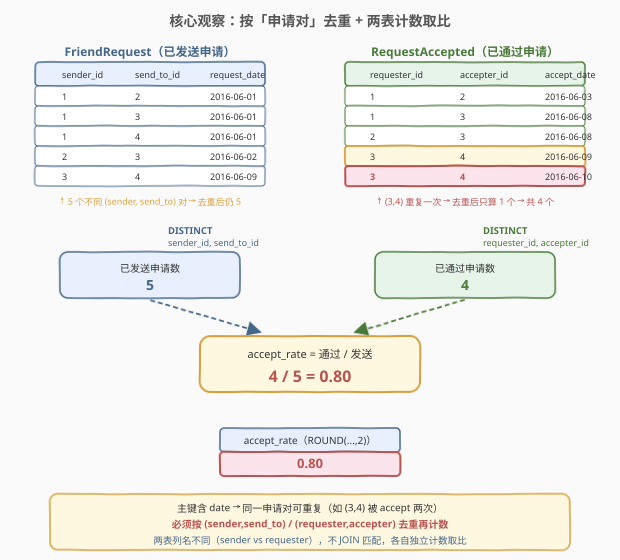
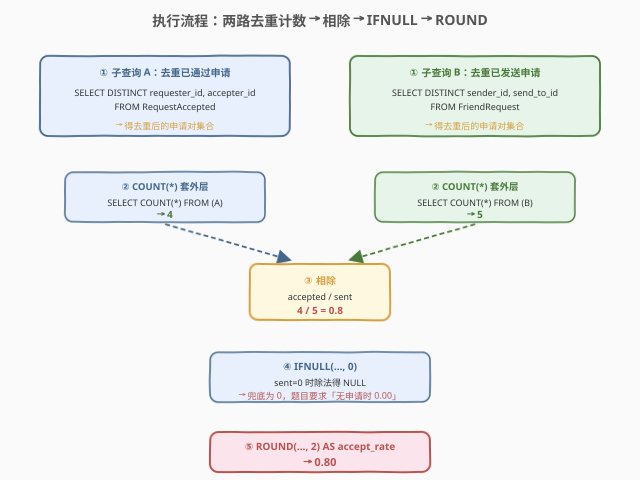
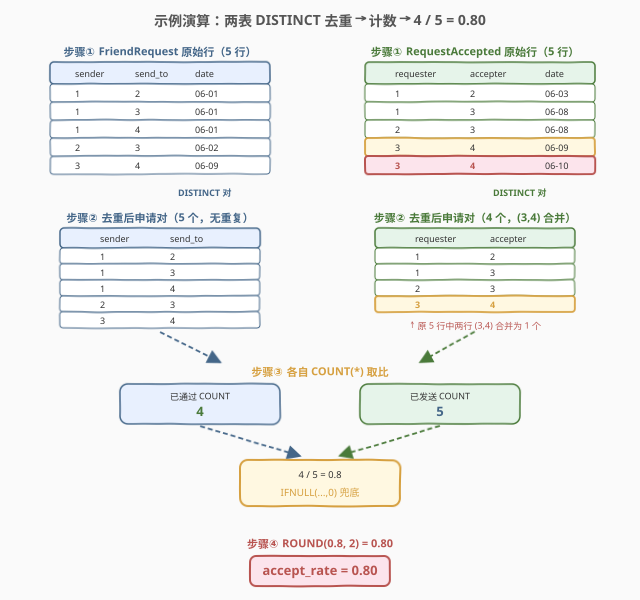

# LeetCode 好友申请 I：总体通过率 题解

> ⚠️ 本题为 LeetCode **Plus 会员专享题**，非会员无法在平台提交，但题意与解法值得掌握——它是 SQL **去重计数 + 比率 + 除零兜底**的经典母题，考点在「主键含日期导致同一申请对重复」与「分母为零时如何兜底为 0」。

## 1. 题目概述

- **标题 / 题号**：好友申请 I：总体通过率（#597，easy）
- **链接**：https://leetcode.cn/problems/friend-requests-i-overall-acceptance-rate/
- **难度**：简单
- **标签**：SQL、聚合、COUNT、DISTINCT、比率、IFNULL、ROUND、除零处理

**题意**：给定 `FriendRequest`（好友申请发送记录）与 `RequestAccepted`（好友申请通过记录）两张表，编写 SQL 查询，求**总体通过率**：

$$\text{accept\_rate} = \frac{\text{已通过的申请数}}{\text{已发送的申请数}}$$

要求：

- 结果**四舍五入保留 2 位小数**（如 `0.70`、`0.80`）。
- 若**没有任何申请被发送**，通过率记为 `0.00`。
- ⚠️ **通过的申请未必来自当前批次的发送记录**——题面明确说明 accepted 可能来自更早月份的 sent。这意味着**不需要把两表按申请对 JOIN 匹配**，只需各自独立计数再相除。

**表结构**：

```text
Table: FriendRequest
+-------------+---------+
| Column Name | Type    |
+-------------+---------+
| sender_id   | int     |  ← 联合主键之一
| send_to_id  | int     |  ← 联合主键之一
| request_date| date    |  ← 联合主键之一
+-------------+---------+
主键：(sender_id, send_to_id, request_date)

Table: RequestAccepted
+--------------+---------+
| Column Name  | Type    |
+--------------+---------+
| requester_id | int     |  ← 联合主键之一
| accepter_id  | int     |  ← 联合主键之一
| accept_date  | date    |  ← 联合主键之一
+--------------+---------+
主键：(requester_id, accepter_id, accept_date)
```

> 💡 **关键约束**：两表的主键都**包含日期**——即同一对 `(sender, send_to)` 可以在不同日期被**反复申请**；同一对 `(requester, accepter)` 也可以在不同日期被**反复通过**（例如先拒绝又重新通过）。但逻辑上「一个好友申请对」应按**用户对**计一次，而非按事件计一次。这一条决定了必须先 `DISTINCT` 去掉重复对，再 `COUNT`。
>
> ⚠️ 注意两表**列名不一致**：发送方在 `FriendRequest` 中叫 `sender_id`，在 `RequestAccepted` 中叫 `requester_id`；接收方一处叫 `send_to_id`，一处叫 `accepter_id`。它们语义对应但名字不同——这正是题面暗示「不要 JOIN 匹配」的信号：若要 JOIN 还得先对齐列名，而题目只问总体比率，根本不必匹配。

**示例 1**：

```text
输入：
FriendRequest 表:
+-----------+------------+--------------+
| sender_id | send_to_id | request_date |
+-----------+------------+--------------+
| 1         | 2          | 2016/06/01   |
| 1         | 3          | 2016/06/01   |
| 1         | 4          | 2016/06/01   |
| 2         | 3          | 2016/06/02   |
| 3         | 4          | 2016/06/09   |
+-----------+------------+--------------+
RequestAccepted 表:
+--------------+-------------+-------------+
| requester_id | accepter_id | accept_date |
+--------------+-------------+-------------+
| 1            | 2           | 2016/06/03  |
| 1            | 3           | 2016/06/08  |
| 2            | 3           | 2016/06/08  |
| 3            | 4           | 2016/06/09  |
| 3            | 4           | 2016/06/10  |   ← (3,4) 第二次被通过
+--------------+-------------+-------------+

输出：
+-------------+
| accept_rate |
+-------------+
| 0.80        |
+-------------+
```

**解释**：

- 发送侧：5 行全部是**不同**的 `(sender, send_to)` 对 → 去重后仍 5 个。
- 通过侧：5 行中有两行的 `(requester, accepter) = (3, 4)`（仅 `accept_date` 不同）→ 去重后剩 4 个不同对。
- 通过率 = $4 / 5 = 0.80$。

> 💡 本题是 SQL **聚合比率**的最小母题。骨架与 [511. 游戏玩法分析 I](../0501-0600/511_游戏玩法分析I.md) 的 `GROUP BY + MIN` 同属「单表聚合」家族，但多了三道坎：①主键含日期需 `DISTINCT` 去重；②两表独立计数取比而非 JOIN 匹配；③分母为零要兜底。它是后续 [580. 统计各专业学生人数](../0501-0600/580_统计各专业学生人数.md)「保全 + 计数」与比率题的入门基座。

## 2. 解题思路

### 2.1 暴力思路：过程式两遍数数

最直觉的做法是用程序分别扫描两表：

```text
sent_set = {(sender, send_to) for each row in FriendRequest}    # 去重
accepted_set = {(requester, accepter) for each row in RequestAccepted}  # 去重
if len(sent_set) == 0:
    rate = 0.00
else:
    rate = round(len(accepted_set) / len(sent_set), 2)
emit (rate,)
```

但**纯 SQL 没有显式变量与集合**——上述「集合去重 + 计数 + 相除 + 兜底」的模式，在 SQL 里一一对应于 `SELECT DISTINCT`（去重）+ `COUNT(*)`（计数）+ `/`（相除）+ `IFNULL`（兜底）+ `ROUND`（取整）。

> ⚠️ 关键转换：把「对每表去重用户对再数个数」翻译成 `COUNT(*) FROM (SELECT DISTINCT ...)`；把「相除」翻译成 `/`；把「分母为 0 时记 0」翻译成 `IFNULL(x / 0, 0)`——因为 SQL 中**除以零返回 `NULL`** 而非报错，`IFNULL` 把它兜回 0。难点不在写法，而在「为什么必须 DISTINCT」「为什么不 JOIN」两个判断。

### 2.2 核心观察：按用户对去重 + 两表独立计数取比



**三道关卡**：

1. **去重（DISTINCT）**：两表主键都含 `date`，同一用户对可重复出现。题目问的是「申请数」「通过数」，逻辑上指**不同用户对的个数**，而非事件次数。所以分子分母都要先 `SELECT DISTINCT` 用户对、再 `COUNT(*)`。示例中通过侧 `(3,4)` 出现两次，不去重会算成 $5/5=1.00$（错），去重才是 $4/5=0.80$（对）。

2. **独立计数（不 JOIN）**：题面明说「通过的申请未必来自当前批次的发送」，意味着两表是**独立统计总体规模**，而非按申请对一一匹配。若强行 JOIN 匹配，反而会因「通过记录找不到对应发送记录」而漏掉部分通过，与题意相悖。所以分子分母各算各的，最后相除。

3. **兜底（IFNULL + ROUND）**：分母（已发送数）为 0 时，`x / 0` 在 MySQL 中返回 `NULL`（不是报错，也不是 0），`IFNULL(NULL, 0)` 把它转成 0，最后 `ROUND(..., 2)` 保留 2 位小数 → `0.00`。

$$\text{accept\_rate} = \text{ROUND}\!\left(\text{IFNULL}\!\left(\frac{|\,\{(r,a) : (r,a) \in \text{RequestAccepted}\}\,|}{|\,\{(s,t) : (s,t) \in \text{FriendRequest}\}\,|},\ 0\right),\ 2\right)$$

> 💡 **为什么不 JOIN 匹配？** 题面明确「accepted requests may not come from the current month/sent requests」——通过记录与发送记录**不必一一对应**（可能跨月、可能补发）。题目问的是「总体通过率」这个宏观比率，而非「这一批申请里有几成被通过」。JOIN 匹配会引入「通过却找不到发送」的漏计数，反而失真。所以两表各自独立 `COUNT` 再相除，这是最贴合题意的解读，也是 AC 写法。

> ⚠️ **最常见的错解**：直接 `COUNT(*) FROM RequestAccepted / COUNT(*) FROM FriendRequest` 不去重。示例数据下分子分母都是 5，得 $1.00$，与期望 $0.80$ 不符。错因正是忽略了「主键含 date → 同一用户对可重复」这一约束。判断口诀：**只要主键不是你想要的「逻辑单位」，就必须 DISTINCT 到那个单位再聚合**。

### 2.3 算法流程图



整个查询分**两路去重计数**与**比率兜底**两段，逻辑执行顺序如下：

| 阶段 | 子句 | 作用 |
|------|------|------|
| ① | 子查询 A：`SELECT DISTINCT requester_id, accepter_id FROM RequestAccepted` | 通过侧去重为不同用户对 |
| ① | 子查询 B：`SELECT DISTINCT sender_id, send_to_id FROM FriendRequest` | 发送侧去重为不同用户对 |
| ② | `SELECT COUNT(*) FROM (A)` / `SELECT COUNT(*) FROM (B)` | 各自数去重后的对数 |
| ③ | `accepted / sent` | 相除得比率 |
| ④ | `IFNULL(..., 0)` | 分母为 0 时除法得 `NULL`，兜底为 0 |
| ⑤ | `ROUND(..., 2) AS accept_rate` | 保留 2 位小数并命名输出列 |

> 💡 **逻辑执行顺序**：两个子查询各自独立求值（无相关引用，可并行）；外层 `SELECT` 把两个标量子查询结果相除，套 `IFNULL` 与 `ROUND`。本题**没有 `FROM` 主表**——整个查询就是「SELECT 一个由子查询组成的标量表达式」，这是「单行标量结果」SQL 的常见写法。优化器通常把两个 `COUNT` 子查询各做一次全表扫描 + 去重（Hash Aggregate）。

### 2.4 示例演算



以示例数据走一遍：

**发送侧 `FriendRequest`（5 行 → 去重后 5 个对）**：

| sender_id | send_to_id | 用户对 | 去重后出现次数 |
|-----------|------------|--------|----------------|
| 1 | 2 | (1,2) | 1 |
| 1 | 3 | (1,3) | 1 |
| 1 | 4 | (1,4) | 1 |
| 2 | 3 | (2,3) | 1 |
| 3 | 4 | (3,4) | 1 |

`COUNT(*)` on 去重结果 = **5**（5 个不同对，无重复可去）。

**通过侧 `RequestAccepted`（5 行 → 去重后 4 个对）**：

| requester_id | accepter_id | 用户对 | 去重后出现次数 |
|--------------|-------------|--------|----------------|
| 1 | 2 | (1,2) | 1 |
| 1 | 3 | (1,3) | 1 |
| 2 | 3 | (2,3) | 1 |
| 3 | 4 | (3,4) | **1**（原 2 行合并） |
| 3 | 4 | (3,4) | —（被 DISTINCT 合并） |

`COUNT(*)` on 去重结果 = **4**（(3,4) 两行合并为 1 个对）。

**比率**：$4 / 5 = 0.8$ → `ROUND(0.8, 2) = 0.80`。

> 💡 **去重前后差异点**：只有通过侧的 `(3,4)` 因 `accept_date` 不同而重复出现，是触发 `DISTINCT` 价值的唯一行。若不做 `DISTINCT`，分子 = 5，得 $5/5 = 1.00$，与期望 $0.80$ 相悖。这正是「主键含 date → 必须按用户对去重」的考点触发条件：只要看到主键比逻辑单位多一列（这里是多了 `date`），就要警惕重复计数。

## 3. 参考代码

### SQL（解法 A：两个标量子查询 + IFNULL + ROUND，推荐）

```sql
SELECT ROUND(
    IFNULL(
        (SELECT COUNT(*) FROM (SELECT DISTINCT requester_id, accepter_id FROM RequestAccepted) AS a) /
        (SELECT COUNT(*) FROM (SELECT DISTINCT sender_id, send_to_id FROM FriendRequest) AS b),
        0
    ), 2
) AS accept_rate;
```

> 💡 **写法要点**：
> - 两个子查询 `a`、`b` 分别对通过侧、发送侧做 `SELECT DISTINCT` 去掉重复用户对——这是本题最核心的一步，不做去重会因 `(3,4)` 重复而错算。
> - 外层各套一个 `SELECT COUNT(*) FROM (子查询)` 把「去重后的对集合」数成标量。
> - 两个标量相除得比率；`IFNULL(..., 0)` 把「分母为 0 → `NULL`」兜底为 0；`ROUND(..., 2)` 保留 2 位小数。
> - 整个查询无 `FROM` 主表，`SELECT` 直接返回一个标量表达式——适合「结果只有一行一列」的比率题。
> - ⚠️ MySQL 中 `x / 0` 返回 `NULL`（不报错），这正是 `IFNULL` 兜底的用武之地；某些其他数据库（如 PostgreSQL）会直接抛 division by zero 错误，需改用 `NULLIF(sent, 0)` 把分母转 `NULL` 再用 `COALESCE`，详见第 5.2 节。

### SQL（解法 B：内联视图 JOIN 取比，可读性对照）

```sql
SELECT ROUND(IFNULL(ac.cnt / fr.cnt, 0), 2) AS accept_rate
FROM (
    SELECT COUNT(*) AS cnt
    FROM (SELECT DISTINCT requester_id, accepter_id FROM RequestAccepted) x
) ac
CROSS JOIN (
    SELECT COUNT(*) AS cnt
    FROM (SELECT DISTINCT sender_id, send_to_id FROM FriendRequest) y
) fr;
```

> 💡 **写法要点**：
> - 把两个标量子查询改写成两个内联视图 `ac`（accepted count）与 `fr`（friend request count），各产出 1 行 1 列。
> - `CROSS JOIN`（笛卡尔积）把两个 1 行结果拼成 1 行，`ac.cnt / fr.cnt` 直接取比。两表各 1 行，CROSS JOIN 后仍 1 行，无展开风险。
> - `IFNULL(..., 0)` 与 `ROUND(..., 2)` 同解法 A。
> - 此写法把「计数」与「取比」分到 `FROM` 与 `SELECT` 两层，逻辑更平面化；执行计划与解法 A 等价（优化器会改写）。面试中作为「思路二」展示，说明「标量子查询与内联视图可互换」即可。

### SQL（解法 C：不去重的错误对照，仅作反面教材）

```sql
-- ✗ 错解：不去重，示例数据下得 1.00 而非 0.80
SELECT ROUND(
    IFNULL(
        (SELECT COUNT(*) FROM RequestAccepted) /
        (SELECT COUNT(*) FROM FriendRequest),
        0
    ), 2
) AS accept_rate;
```

> ⚠️ **错因分析**：直接 `COUNT(*) FROM RequestAccepted` 把 `(3,4)` 的两行都数进去，得 5；分母也是 5；$5/5 = 1.00 \ne 0.80$。错在忽略了「主键含 date → 同一用户对可重复」——必须先 `DISTINCT` 到用户对粒度再计数。此写法在某些测试用例（无重复对）下能侥幸通过，但遇到示例这种重复对就翻车，是典型「未考虑主键结构」的陷阱。对照此解法可加深对 `DISTINCT` 必要性的理解。

### Python（pandas）

```python
import pandas as pd

def friend_requests(request_accepted: pd.DataFrame, friend_request: pd.DataFrame) -> pd.DataFrame:
    sent = friend_request.drop_duplicates(subset=['sender_id', 'send_to_id']).shape[0]
    accepted = request_accepted.drop_duplicates(subset=['requester_id', 'accepter_id']).shape[0]
    rate = round(accepted / sent, 2) if sent > 0 else 0.0
    return pd.DataFrame({'accept_rate': [rate]})
```

> 💡 **pandas 对照**：`drop_duplicates(subset=[...])` 等价于 `SELECT DISTINCT 两列`，按指定列去重保留首次出现；`.shape[0]` 等价于 `COUNT(*)`；`sent > 0` 显式判空等价于 `IFNULL(..., 0)`（pandas 中 `accepted / 0` 会得 `inf` 或 `NaN`，不像 SQL 自动得 `NULL`，故用 `if` 提前拦截）；`round(..., 2)` 等价于 `ROUND(..., 2)`。注意 pandas 与 SQL 对「除以零」的处理不同——SQL 返回 `NULL`（可被 `IFNULL` 兜底），pandas 返回 `inf`/`NaN`（需 `if` 拦截或用 `np.divide` 的 `where` 参数）。

## 4. 复杂度分析

| 维度 | 复杂度 | 说明 |
|------|--------|------|
| **时间** | $O(a + b)$ ~ $O(a \log a + b \log b)$ | $a$ = `RequestAccepted` 行数，$b$ = `FriendRequest` 行数。两个子查询各做一次 `DISTINCT`（Hash Aggregate 近似 $O(a)$ / $O(b)$，Sort Aggregate 需 $O(a \log a)$ / $O(b \log b)$）+ 一次 `COUNT` 线性扫描 |
| **空间** | $O(a + b)$ | DISTINCT 的哈希表/排序缓冲区，至多存全部用户对 |
| **结果行数** | $O(1)$ | 永远输出 1 行 1 列（标量比率） |

> ⚠️ SQL 复杂度取决于**执行计划**：`DISTINCT` 通常走 **Hash Aggregate**（内存哈希表去重，近似 $O(n)$）或 **Sort Aggregate**（先排序再去重，$O(n \log n)$）。优化器可能把「DISTINCT + COUNT」整体改写为 `COUNT(DISTINCT ...)` 走同一套去重逻辑（见第 5.1 节）。面试中说明「两表各扫一遍 + 去重 + 计数，整体 $O(a+b)$ 到 $O(a \log a + b \log b)$，给两表的 `(sender,send_to)` / `(requester,accepter)` 建联合索引能加速去重」即可。注意本题数据量小，性能非瓶颈，重点是逻辑正确性。

## 5. 扩展：COUNT(DISTINCT) 简写与跨库除零处理

### 5.1 `COUNT(DISTINCT col1, col2)` 简写

解法 A 的「子查询 DISTINCT + 外层 COUNT(*)」在 MySQL 中可简写为 `COUNT(DISTINCT col1, col2)`——`COUNT(DISTINCT ...)` 支持多列，直接对「列组合」去重计数，省掉一层子查询嵌套：

```sql
SELECT ROUND(
    IFNULL(
        (SELECT COUNT(DISTINCT requester_id, accepter_id) FROM RequestAccepted) /
        (SELECT COUNT(DISTINCT sender_id, send_to_id) FROM FriendRequest),
        0
    ), 2
) AS accept_rate;
```

> 💡 **等价性**：`COUNT(DISTINCT c1, c2)` = `SELECT COUNT(*) FROM (SELECT DISTINCT c1, c2 FROM t)`。两者语义、执行计划均一致（优化器会改写到同一套 Hash/Sort Aggregate）。区别仅在写法——`COUNT(DISTINCT ...)` 更紧凑，是 MySQL 的方言扩展；标准 SQL 与多数数据库（PostgreSQL、SQL Server）的 `COUNT(DISTINCT ...)` **只支持单列**，多列去重需用「子查询 DISTINCT + COUNT」写法（解法 A）。跨库场景首推解法 A；MySQL 单库可用简写。

> ⚠️ **NULL 行为**：`COUNT(DISTINCT c1, c2)` 会把 `c1` 或 `c2` 为 `NULL` 的行**排除**在外（`COUNT` 系列只数非 NULL）。本题两表列均为主键一部分、不允许 `NULL`，故无影响；若业务中允许 `NULL`，需注意去重计数会少算含 `NULL` 的行。

### 5.2 除以零：MySQL vs PostgreSQL vs SQL Server

「分母可能为 0」是比率题的通用考点。不同数据库对 `x / 0` 的处理截然不同，兜底写法也随之变化：

| 数据库 | `x / 0` 行为 | 兜底写法 |
|--------|--------------|----------|
| **MySQL** | 返回 `NULL`（不报错） | `IFNULL(x / sent, 0)` 或 `COALESCE(x / sent, 0)` |
| **PostgreSQL** | 抛 `division by zero` 错误 | `x / NULLIF(sent, 0)` → 把分母 0 转 `NULL` → 结果 `NULL` → 再 `COALESCE(..., 0)` |
| **SQL Server** | 抛 `Divide by zero error` 错误 | 同 PostgreSQL，`x / NULLIF(sent, 0)` + `COALESCE(..., 0)` |

```sql
-- 跨库通用写法（PostgreSQL / SQL Server / MySQL 均可）
SELECT ROUND(COALESCE(
    accepted.cnt / NULLIF(sent.cnt, 0), 0
), 2) AS accept_rate
FROM ...;
```

> 💡 **`NULLIF(x, 0)` 的妙用**：`NULLIF(a, b)` 在 `a = b` 时返回 `NULL`，否则返回 `a`。`NULLIF(sent, 0)` 把「分母 = 0」转成 `NULL`，于是 `x / NULL = NULL`（任何数除 NULL 得 NULL），再用 `COALESCE(..., 0)` 兜回 0。这套写法**跨库通用**——MySQL 中 `x / 0` 本就返回 `NULL`，加 `NULLIF` 是多余但无害；PostgreSQL/SQL Server 中 `NULLIF` 是必须的（否则直接抛错）。面试中若不确定目标数据库，用 `NULLIF + COALESCE` 最稳妥。本题平台是 MySQL，`IFNULL` 足矣。

### 5.3 `ROUND` 的银行家舍入陷阱

`ROUND(x, 2)` 在不同数据库的「半舍」规则可能不同：MySQL 用「四舍五入」（`ROUND(0.125, 2) = 0.13`），但 PostgreSQL 用「银行家舍入」（round half to even，`ROUND(0.125, 2) = 0.12`）。本题测试数据比率多为 `0.80` 这类无歧义值，不触发该差异；但生产环境若对舍入敏感（如金融），需注意跨库 `ROUND` 行为差异，必要时用 `CAST` 显式截断或自定义舍入函数。

### 5.4 从「总体比率」到「分组比率」

本题是「总体单行比率」——分母分子各一个标量，结果 1 行。SQL 比率题还有「分组比率」变体：按某维度分组，每组算一个比率，结果多行。典型如 [1303. 求团队人数](https://leetcode.cn/problems/find-the-team-size/)（每玩家所在团队人数）、[1070. 产品销售分析 III](https://leetcode.cn/problems/product-sales-analysis-iii/)（每产品最低价年份）。分组比率的骨架是 `GROUP BY` + `SUM(CASE WHEN ...) / COUNT(*)`，或用窗口函数 `SUM(x) OVER (PARTITION BY ...)`。本题是其「无分组、单标量」的最简退化版。

## 6. 面试要点

1. **为什么必须 `DISTINCT` 去重？不分会怎样？**

   - 两表主键都含 `date`——`(sender_id, send_to_id, request_date)` 与 `(requester_id, accepter_id, accept_date)`。这意味着同一用户对可在不同日期重复出现（如示例中 `(3,4)` 被通过两次）。题目问「申请数」「通过数」指**不同用户对的个数**，不是事件次数。不 `DISTINCT` 会把重复行重复计数，示例数据下得 $5/5=1.00$ 而非 $0.80$。判断口诀：**主键比逻辑单位多一列（多了 date）→ 必须 DISTINCT 到逻辑单位再聚合**。

2. **为什么不把两表 JOIN 起来匹配？**

   - 题面明说「accepted requests may not come from the current month/sent requests」——通过记录与发送记录不必一一对应，可能跨月、可能补发。题目问的是「总体通过率」这个宏观比率，而非「这一批申请里几成被通过」。JOIN 匹配会引入「通过却找不到对应发送」的漏计数，反而失真。所以两表各自独立 `COUNT` 再相除最贴合题意，也是 AC 写法。另外两表列名不一致（`sender_id` vs `requester_id`），强行 JOIN 还得先对齐列名，暗示了「不该 JOIN」。

3. **分母为 0 时为什么用 `IFNULL`？SQL 中 `x / 0` 返回什么？**

   - MySQL 中 `x / 0` 返回 `NULL`（不报错、不是 0、不是 infinity）。题目要求「无申请时记 0.00」，所以用 `IFNULL(x / sent, 0)` 把 `NULL` 兜回 0，再 `ROUND(..., 2)` 得 `0.00`。⚠️ 这只适用于 MySQL；PostgreSQL/SQL Server 中 `x / 0` 会直接抛 division by zero 错误，需改用 `x / NULLIF(sent, 0)` 把分母 0 转 `NULL` 再 `COALESCE(..., 0)` 兜底（详见 5.2 节）。

4. **`COUNT(DISTINCT c1, c2)` 和「子查询 DISTINCT + COUNT(*)」有何区别？**

   - 语义与执行计划均等价：`COUNT(DISTINCT c1, c2)` = `SELECT COUNT(*) FROM (SELECT DISTINCT c1, c2 FROM t)`。区别仅在写法——前者更紧凑，是 MySQL 方言扩展；后者是标准 SQL，跨库通用（PostgreSQL/SQL Server 的 `COUNT(DISTINCT ...)` 只支持单列）。MySQL 单库可用前者简写；跨库场景首推后者。面试中说出「两者等价、优化器会改写到同一套 Hash/Sort Aggregate」为佳。

5. **题目说「accepted may not come from current sent」对解法有什么影响？**

   - 它明确告诉不要按申请对 JOIN 匹配两表——通过记录可能与发送记录跨月不对应。因此分子分母是**独立的总体计数**，不是「匹配上的通过 / 发送」。这一句题面是「不 JOIN」的官方暗示。若忽略它去 JOIN，会因「通过找不到发送」漏掉分子，或因「发送未被通过」漏掉分母，结果失真。读懂这句暗示是本题除 `DISTINCT` 外的第二个关键判断。

> 💡 **一句话总结**：597 是 SQL **去重计数 + 比率 + 除零兜底**的最小母题——核心是 `COUNT(*) FROM (SELECT DISTINCT 用户对)` 各自独立计数再相除，`IFNULL` 兜底分母为零、`ROUND` 取 2 位。考点在「主键含 date 必须按用户对 DISTINCT」「题面暗示不 JOIN 匹配」「MySQL 除零得 NULL 需 IFNULL」三连，是所有「比率型聚合」题的入门基座。

## 同类练习题

| # | 题目 | 与本题的关联 |
|---|------|-------------|
| 511 | [游戏玩法分析 I](https://leetcode.cn/problems/game-play-analysis-i/)（[站内题解](../0501-0600/511_游戏玩法分析I.md)） | `GROUP BY + MIN` 单表分组取最值的最简母题。597 把单表聚合升级为「两表独立计数取比」，并多一道 `DISTINCT` 去重与除零兜底考点 |
| 580 | [统计各专业学生人数](https://leetcode.cn/problems/count-student-number-in-departments/)（[站内题解](../0501-0600/580_统计各专业学生人数.md)） | `LEFT JOIN + COUNT(右表列)` 保全空组的分组计数母题。与 597 同属「计数型聚合」家族，对比「分组计数保空组」（580）与「总体计数取比」（597）的取舍 |
| 570 | [至少有5名直接下属的经理](https://leetcode.cn/problems/managers-with-at-least-5-direct-reports/)（[站内题解](../0501-0600/570_至少有5名直接下属的经理.md)） | `Self JOIN + GROUP BY + HAVING COUNT >= 5` 分组计数 + 组级过滤。与 597 同为「计数」家族，对比「分组后过滤达标组」（570）与「总体计数取比」（597） |
| 584 | [寻找用户推荐人](https://leetcode.cn/problems/find-customer-referee/) | `WHERE` + `IS NULL` 处理 `NULL` 列过滤的入门题。与 597 的 `IFNULL` 同属 SQL `NULL` 处理家族，对比「过滤 NULL 行」（584）与「除零结果 NULL 兜底」（597） |
| 1303 | [求团队人数](https://leetcode.cn/problems/find-the-team-size/) | `LEFT JOIN` 自连接 + 分组统计的分组计数变体。结合 580 的 `LEFT JOIN` 与 597 的「计数」思路，是「分组比率」题的进阶 |
