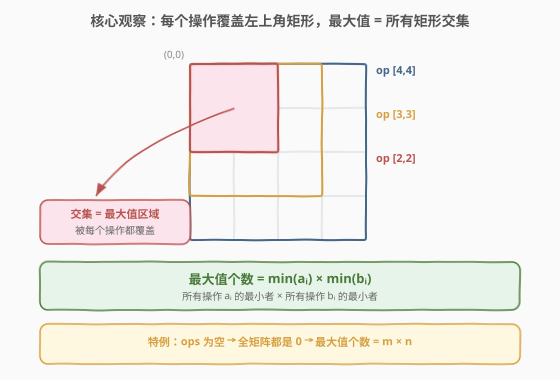
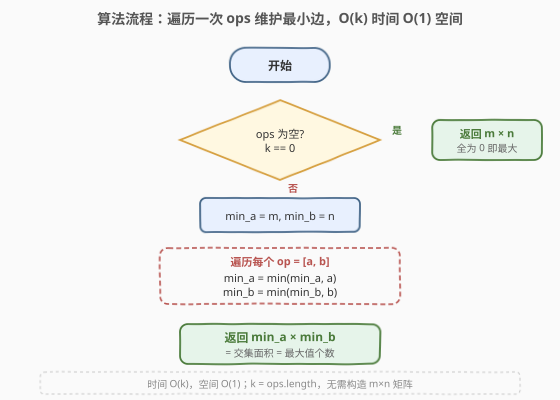

# LeetCode 区间加法II 题解

## 1. 题目概述

- **标题 / 题号**：区间加法II（#598，easy）
- **链接**：https://leetcode.cn/problems/range-addition-ii/
- **难度**：简单
- **标签**：数组、数学

**题意**：给你一个 $m \times n$ 的矩阵 `M` 和一个操作数组 `ops`。矩阵初始化时所有单元格都为 `0`。`ops[i] = [ai, bi]` 意味着当所有的 $0 \le x < ai$ 和 $0 \le y < bi$ 时，`M[x][y]` 应该加 1。

在**执行完所有操作**后，计算并返回**矩阵中最大整数的个数**。

**示例 1**：

```text
输入：m = 3, n = 3, ops = [[2,2],[3,3]]
输出：4
解释：M 中最大的整数是 2，而且 M 中有 4 个值为 2 的元素。因此返回 4。
```

**示例 2**：

```text
输入：m = 3, n = 3, ops = [[2,2],[3,3],[3,3],[3,3],[2,2],[3,3],[3,3],[3,3],[2,2],[3,3],[3,3],[3,3]]
输出：4
```

**示例 3**：

```text
输入：m = 3, n = 3, ops = []
输出：9
```

**约束**：

- $1 \le m, n \le 4 \times 10^4$
- $0 \le \text{ops.length} \le 10^4$
- `ops[i].length == 2`
- $1 \le ai \le m$
- $1 \le bi \le n$

> 💡 注意 $m, n$ 可达 $4 \times 10^4$，矩阵规模最大 $1.6 \times 10^9$ 个单元格，**绝不能**真的构造矩阵去模拟每次加法。题目的关键在于发现「最大值位置」的规律，把问题压缩到与 $m \times n$ 无关的 $O(k)$ 计算。

## 2. 解题思路

### 2.1 暴力思路：模拟每次操作

最直觉的做法是真造一个 $m \times n$ 的矩阵 `M`，对每个 `ops[i] = [ai, bi]`，把左上角 $ai \times bi$ 的子矩阵每个单元格加 1，最后扫一遍矩阵统计最大值的出现次数。

> ⚠️ 这种做法时间 $O\bigl(\sum ai \cdot bi\bigr)$、空间 $O(m \cdot n)$。当 $m = n = 4 \times 10^4$ 时矩阵本身就有 16 亿个格子，内存直接爆掉。必须另寻规律。

### 2.2 核心观察：所有操作都「左上对齐」，最大值 = 矩形交集



把每个操作 `ops[i] = [ai, bi]` 看作给矩阵左上角一块 $ai \times bi$ 的矩形整体加 1。关键观察：

- **所有矩形都锚定在 `(0,0)`**：即每个操作覆盖的区域是 $\{0 \le x < ai\} \times \{0 \le y < bi\}$，全部从原点出发，彼此**左上对齐**。
- **被覆盖次数最多的格子** = 落在**每个**操作矩形里 = 所有矩形的**交集**。因为对齐原点，交集就是「最窄的那个矩形」：$[0, \min ai) \times [0, \min bi)$。
- **最大值 = 操作总数 $k$**（若 `ops` 非空），而达到最大值的格子恰好是交集内的格子，其个数 = $\min ai \times \min bi$。
- **特例（`ops` 为空）**：没有任何操作，全矩阵都是 0，最大值就是 0，个数 = $m \times n$。

> 💡 **为什么「交集面积 = 最大值个数」**：设某格 $(x, y)$ 被覆盖 $c(x, y)$ 次。$c(x, y)$ 等于满足 $x < ai$ 且 $y < bi$ 的操作个数。由于 $ai, bi$ 各自取最小值时同时收紧两个维度，落在 $\min ai \times \min bi$ 内的格点对所有操作都满足条件，$c = k$（最大）；越界的格点至少有一个操作不覆盖它，$c < k$。因此最大值区域恰是交集。

### 2.3 算法流程图



流程极简：先判 `ops` 是否为空（空则直接返回 $m \times n$）；否则用 `min_a = m`、`min_b = n` 作初值，遍历 `ops` 逐个更新最小值，最后返回 `min_a * min_b`。无需构造矩阵、无需排序。

### 2.4 示例演算

![示例演算：m=3, n=3, ops=[[2,2],[3,3]] → 最大值个数 = 4](../images/range_addition_ii_walkthrough.svg)

以示例 1 `m = 3, n = 3, ops = [[2,2],[3,3]]` 为例，模拟过程与公式法对照：

| 步骤 | 操作 | 矩阵状态（左上 2×2 加粗） | 当前最小边 |
|------|------|--------------------------|------------|
| 初始 | — | 全 0 | min_a=3, min_b=3 |
| ① | op `[2,2]` | 左上 2×2 变 1，其余仍 0 | min_a=2, min_b=2 |
| ② | op `[3,3]` | 全体 +1 → 左上 2×2 为 2，其余为 1 | min_a=2, min_b=2 |
| 答案 | — | 最大值 2，共 4 个 | $2 \times 2 = 4$ ⭐ |

> 💡 **模拟 vs 公式**：模拟要动 9 个格子两次、再扫一遍找最大；公式只做两次 `min` 和一次乘法，与矩阵大小无关。当 $m, n = 4 \times 10^4$ 时，模拟要碰 16 亿格子，公式仍是 2 次比较——这正是「找规律」带来的降维打击。

## 3. 参考代码

### C++

```cpp
class Solution {
  public:
    int maxCount(int m, int n, vector<vector<int>>& ops) {
        int min_a = m, min_b = n;
        for (const auto& op : ops) {
            min_a = min(min_a, op[0]);
            min_b = min(min_b, op[1]);
        }
        return min_a * min_b;
    }
};
```

### Python

```python
class Solution:
    def maxCount(self, m: int, n: int, ops: List[List[int]]) -> int:
        min_a, min_b = m, n
        for a, b in ops:
            min_a = min(min_a, a)
            min_b = min(min_b, b)
        return min_a * min_b
```

### Python（一行写法）

```python
class Solution:
    def maxCount(self, m: int, n: int, ops: List[List[int]]) -> int:
        if not ops:
            return m * n
        return min(a for a, _ in ops) * min(b for _, b in ops)
```

> 💡 **写法要点**：把 `min_a`、`min_b` 的初值设为 `m`、`n`（而非 `INT_MAX`），可以在遍历结束后**自然处理 `ops` 为空的情况**——空 `ops` 不更新初值，结果 `m * n` 恰是正确答案。这样省去显式的 `if (ops.empty())` 分支，代码更简洁。第三种一行写法显式判空以避免对空序列取 `min` 报错，可读性也好。

> ⚠️ 注意 `ops[i]` 保证 $1 \le ai \le m$、$1 \le bi \le n$，所以 `min_a` 不会小于 1，乘积不会为 0；也无需做越界下标保护。

## 4. 复杂度分析

| 维度 | 复杂度 | 说明 |
|------|--------|------|
| 时间复杂度 | $O(k)$ | 单趟遍历 `ops`，每次两个 `min` 比较；$k = \text{ops.length}$，与 $m, n$ 无关 |
| 空间复杂度 | $O(1)$ | 仅 `min_a`、`min_b` 两个变量，不构造矩阵 |

> 💡 本题的最大价值在于**降维**：把表面上 $O(k \cdot m \cdot n)$ 的矩阵模拟问题，通过「左上对齐」的几何观察压缩成 $O(k)$ 的标量计算。面试中遇到「批量区间更新 + 统计最值」类问题，先看区间是否有公共端点——若有，往往能用交集/并集思想绕过显式模拟。

## 5. 扩展：当区间不再共用原点——差分数组

本题能 $O(k)$ 解决，根本原因是**所有操作都从 `(0,0)` 出发**，矩形全部左上对齐，交集即最小矩形。一旦操作变成任意区间 `[li, ri]`（不共用端点），就不能再取最小边了，需要**差分数组**记录每个位置的增量起止。

以一维为例：对区间 `[l, r]` 整体加 1，等价于 `diff[l] += 1`、`diff[r+1] -= 1`；最后对 `diff` 求前缀和即得每个位置的最终值。这就是 [370. 区间加法](https://leetcode.cn/problems/range-addition/) 的标准解法，时间 $O(n + k)$。

> 💡 **本题与 370 的关系**：598 是 370 的**特殊二维版**——所有区间都锚定原点，交集退化为「最小边乘积」，连差分数组都不必构造。理解了 370 的差分思想，再看 598 就能立刻意识到「公共端点 → 交集思想」的简化路径。二维任意区间则可用二维差分（四角加减）处理，思路同一维的推广。

## 6. 面试要点

1. **为什么最大值个数等于 $\min ai \times \min bi$？**

   - 每个操作覆盖一个从 `(0,0)` 出发的 $ai \times bi$ 矩形。某格被覆盖的次数等于「包含它的操作数」。由于所有矩形左上对齐，被全部 $k$ 个操作覆盖的格子（即最大值格子）恰是所有矩形的交集，也就是最窄矩形 $[0, \min ai) \times [0, \min bi)$，其面积为 $\min ai \times \min bi$。

2. **`ops` 为空时为什么返回 $m \times n$？**

   - 没有操作时矩阵保持全 0，最大值就是 0，每个格子都是最大值，共 $m \times n$ 个。代码里把 `min_a`、`min_b` 初值设为 `m`、`n`，空 `ops` 不更新，乘积自然得 $m \times n$，无需特判。

3. **为什么不直接模拟矩阵？**

   - $m, n$ 可达 $4 \times 10^4$，矩阵最多 $1.6 \times 10^9$ 个格子，构造与遍历都会超时超内存。而求最小边只需 $O(k)$ 时间、$O(1)$ 空间，与矩阵规模完全解耦。

4. **如果操作不是从 `(0,0)` 出发，而是任意矩形 `[x1,y1,x2,y2]` 呢？**

   - 不能再取最小边。需要二维差分数组：对每个矩形在 `(x1,y1)` 加 1、`(x2+1,y1)` 与 `(x1,y2+1)` 减 1、`(x2+1,y2+1)` 加 1，再做二维前缀和还原。这是 [370. 区间加法](https://leetcode.cn/problems/range-addition/) 一维差分的二维推广，时间 $O(m \cdot n + k)$。

5. **初值用 `m/n` 还是 `INT_MAX` 更好？**

   - 用 `m/n` 更好：既满足 $ai \le m$、$bi \le n$ 的约束保证最小值不越界，又能自然处理空 `ops` 返回 $m \times n$。用 `INT_MAX` 则必须显式判空，多一个分支。

> 💡 **一句话总结**：所有操作都从原点出发 → 矩形左上对齐 → 最大值区域 = 交集 = $\min ai \times \min bi$；空 `ops` 时全 0，返回 $m \times n$。

## 同类练习题

| # | 题目 | 与本题的关联 |
|---|------|-------------|
| 370 | [区间加法](https://leetcode.cn/problems/range-addition/)（[题解](../0301-0400/370_区间加法.md)） | 本题的一般一维版，区间不再共用端点，需用差分数组记录增量起止 + 前缀和还原 |
| 1109 | [航班预订统计](https://leetcode.cn/problems/corporate-flight-bookings/)（[题解](../1101-1200/1109_航班预订统计.md)） | 差分数组应用，对每段预订区间做加减标记再前缀和，与 370 同套路 |
| 304 | [二维区域和检索 - 数组不可变](https://leetcode.cn/problems/range-sum-query-2d-immutable/)（[题解](../0301-0400/304_二维区域和检索 - 数组不可变.md)） | 二维前缀和，与二维区间操作同属「矩阵上批量处理区间」的思路族 |
| 303 | [区域和检索 - 数组不可变](https://leetcode.cn/problems/range-sum-query-immutable/)（[题解](../0301-0400/303_区域和检索 - 数组不可变.md)） | 一维前缀和，区间问题的母题，理解后可推广到二维与差分 |
