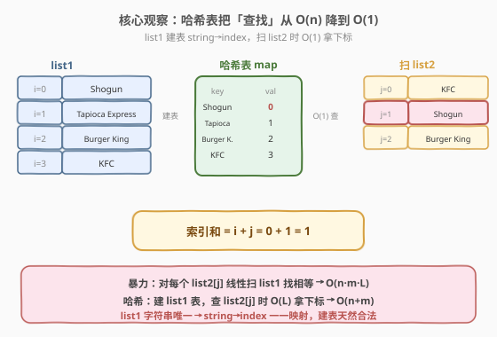
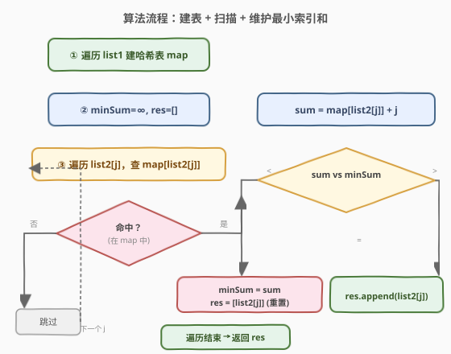
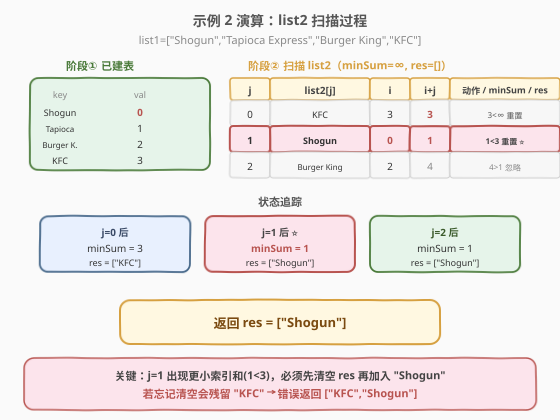

# LeetCode 两个列表的最小索引总和 题解

## 1. 题目概述

- **标题 / 题号**：两个列表的最小索引总和（#599，easy）
- **链接**：https://leetcode.cn/problems/minimum-index-sum-of-two-lists/
- **难度**：简单
- **标签**：数组、哈希表

**题意**：给定两个字符串数组 `list1` 和 `list2`，找到**索引和最小的公共字符串**。**公共字符串**是同时出现在 `list1` 和 `list2` 中的字符串。若某字符串在 `list1[i]` 和 `list2[j]` 中出现，则其索引和为 $i + j$。返回所有具有**最小索引和**的公共字符串，顺序任意。

**示例 1**：

```text
输入：list1 = ["Shogun", "Tapioca Express", "Burger King", "KFC"]
     list2 = ["Piatti", "The Grill at Torrey Pines", "Hungry Hunter Steakhouse", "Shogun"]
输出：["Shogun"]
解释：唯一的公共字符串是 "Shogun"。
```

**示例 2**：

```text
输入：list1 = ["Shogun", "Tapioca Express", "Burger King", "KFC"]
     list2 = ["KFC", "Shogun", "Burger King"]
输出：["Shogun"]
解释："Shogun" 索引和 = 0 + 1 = 1（最小），"KFC" = 3 + 0 = 3，"Burger King" = 2 + 2 = 4。
```

**示例 3**：

```text
输入：list1 = ["happy","sad","good"], list2 = ["sad","happy","good"]
输出：["sad","happy"]
解释："happy" 索引和 = 0 + 1 = 1，"sad" = 1 + 0 = 1，"good" = 2 + 2 = 4。最小索引和为 1，有两个字符串并列。
```

**约束**：

- $1 \leq \text{list1.length}, \text{list2.length} \leq 1000$
- $1 \leq \text{list1[i].length}, \text{list2[i].length} \leq 30$
- `list1[i]` 和 `list2[i]` 由空格 `' '` 和英文字母组成
- `list1` 的所有字符串**唯一**，`list2` 的所有字符串**唯一**

## 2. 解题思路

### 2.1 暴力思路：两层循环枚举所有字符串对

最直觉的做法是对 `list1` 的每个字符串，线性扫描 `list2` 找与之相等的字符串，命中则计算索引和 $i + j$，维护最小值与结果集。

```text
for i in 0..n-1:
    for j in 0..m-1:
        if list1[i] == list2[j]:
            更新最小索引和与结果集
```

字符串比较本身是 $O(L)$（$L$ 为串长），总时间 $O(n \cdot m \cdot L)$。当 $n, m \approx 1000$ 时约 $10^6 \cdot L$ 次操作，偏慢。问题在于：对每个 `list2[j]`，判断它「是否在 `list1` 中以及在哪」用了 $O(n)$ 线性扫描——这正是哈希表能优化到 $O(1)$ 的地方。

### 2.2 核心观察：用哈希表把「查找」从 O(n) 降到 O(1)



关键直觉：`list1` 中每个字符串是**唯一**的，所以「字符串 → 下标」是一一映射。把 `list1` 装入哈希表后，对 `list2` 中任意字符串 $s$，能 $O(1)$ 判定 $s$ 是否为公共字符串，并同时拿到它在 `list1` 中的下标 $i$——再配上 $s$ 在 `list2` 的当前下标 $j$，索引和 $i + j$ 立刻可得。

> 💡 **为什么选 `list1` 建表、`list2` 扫描，而不是反过来？** 两侧对称，建哪边都行。工程上习惯把**先给定的/更长的**列表建成哈希表一次，再单遍扫描另一边。本题两表规模同阶，任意选一边建表都是 $O(n + m)$。

扫描 `list2` 时维护两个变量：

- `minSum`：目前见过的最小索引和（初始为 $+\infty$）；
- `res`：结果列表。

对每个 `list2[j]` 查哈希表：

- 命中且 $i + j < \text{minSum}$ → **更新** `minSum`，**清空** `res`，加入该字符串；
- 命中且 $i + j = \text{minSum}$ → **并列**，直接加入 `res`；
- 命中且 $i + j > \text{minSum}$ → 忽略；
- 未命中 → 跳过。

### 2.3 算法流程图



两阶段：① 遍历 `list1` 建哈希表 `string → index`；② 遍历 `list2`，查表命中则按「小于则重置 / 等于则追加」更新结果。每个元素只被处理一次，总时间 $O(n + m)$。

### 2.4 示例演算



以**示例 2** 为例，`list1 = ["Shogun", "Tapioca Express", "Burger King", "KFC"]`，`list2 = ["KFC", "Shogun", "Burger King"]`。

**阶段 ① 建表**（`list1` 字符串 → 下标）：

| key | Shogun | Tapioca Express | Burger King | KFC |
|-----|--------|-----------------|-------------|-----|
| val | 0 | 1 | 2 | 3 |

**阶段 ② 扫描 `list2`**（`minSum = +∞`, `res = []`）：

| j | list2[j] | 查表得 i | i+j | 动作 | minSum | res |
|---|----------|---------|-----|------|--------|-----|
| 0 | KFC | 3 | 3 | 3 < ∞ → 重置 + 加入 | 3 | `["KFC"]` |
| 1 | Shogun | 0 | 1 | 1 < 3 → 重置 + 加入 | 1 | `["Shogun"]` ⭐ |
| 2 | Burger King | 2 | 4 | 4 > 1 → 忽略 | 1 | `["Shogun"]` |

最终返回 `["Shogun"]`。

> ⚠️ **易错点**：当出现**更小**的索引和时，必须先**清空** `res` 再加入——否则旧的并列字符串会残留。示例 2 中 `j=1` 时若忘记清空，会得到 `["KFC", "Shogun"]`，错误。而遇到**相等**的索引和时（如示例 3 的 `"happy"` 和 `"sad"` 都为 1），则不清空、直接追加。

## 3. 参考代码

### C++（哈希表一次扫描）

```cpp
class Solution {
  public:
    vector<string> findRestaurant(vector<string>& list1, vector<string>& list2) {
        unordered_map<string, int> idx; // list1 字符串 -> 下标
        for (int i = 0; i < list1.size(); ++i) {
            idx[list1[i]] = i;
        }

        vector<string> res;
        int minSum = INT_MAX;
        for (int j = 0; j < list2.size(); ++j) {
            auto it = idx.find(list2[j]);
            if (it == idx.end()) continue;     // 非公共字符串，跳过
            int sum = it->second + j;
            if (sum < minSum) {                // 更小：重置结果
                minSum = sum;
                res = {list2[j]};
            } else if (sum == minSum) {        // 并列：追加
                res.push_back(list2[j]);
            }
        }
        return res;
    }
};
```

### Python

```python
class Solution:
    def findRestaurant(self, list1: List[str], list2: List[str]) -> List[str]:
        idx = {s: i for i, s in enumerate(list1)}  # list1 字符串 -> 下标

        min_sum = float('inf')
        res = []
        for j, s in enumerate(list2):
            i = idx.get(s)
            if i is None:
                continue
            s_sum = i + j
            if s_sum < min_sum:                    # 更小：重置结果
                min_sum = s_sum
                res = [s]
            elif s_sum == min_sum:                 # 并列：追加
                res.append(s)
        return res
```

> 💡 **写法对比**：C++ 用 `idx.find` 避免重复哈希查询（`count` + `[]` 会查两次）；Python 用 `dict.get` 返回 `None` 区分「不存在」与「下标为 0」，避免 `KeyError`。两边逻辑一致：**小于则重置、等于则追加、大于则忽略**。

## 4. 复杂度分析

| 维度 | 复杂度 | 说明 |
|------|--------|------|
| 时间复杂度 | $O(n + m + L)$ | 建 `list1` 哈希表 $O(n \cdot L)$，扫描 `list2` 每次查表 $O(L)$ 共 $O(m \cdot L)$，简记 $O(n + m)$（$L$ 为串长，常数级） |
| 空间复杂度 | $O(n \cdot L)$ | 哈希表存 `list1` 全部字符串；结果集最坏 $O(\min(n, m))$ |

> ⚠️ 严格按字符比较计入复杂度时，单次哈希表操作为 $O(L)$（哈希串需读完整）。本题 $L \leq 30$ 视为常数，故通常简写 $O(n + m)$。若 $n, m$ 同阶，等价于 $O(n)$。

## 5. 扩展：提前终止扫描

观察到索引和 $i + j \geq j$（因为 $i \geq 0$）。扫描 `list2` 到下标 $j$ 时，任何**后续**命中的公共字符串索引和至少为 $j$。因此当 $j > \text{minSum}$ 时，后续不可能再出现 $\leq \text{minSum}$ 的字符串，可**提前终止**：

```cpp
for (int j = 0; j < list2.size(); ++j) {
    if (j > minSum) break;                 // 后续 i+j >= j > minSum，不可能更优或并列
    auto it = idx.find(list2[j]);
    if (it == idx.end()) continue;
    int sum = it->second + j;
    if (sum < minSum) { minSum = sum; res = {list2[j]}; }
    else if (sum == minSum) res.push_back(list2[j]);
}
```

> 💡 这个剪枝在最坏情况（最小索引和很大、公共字符串靠后）收益有限，但当最小索引和很小时能显著减少扫描次数。是面试中「能否优化」的一个加分点。

| 解法 | 思路 | 时间 | 空间 | 备注 |
|------|------|------|------|------|
| 哈希表（主） | 建 list1 表 + 扫 list2 维护最小 | $O(n + m)$ | $O(n)$ | 通用，面试首选 |
| 哈希表 + 提前终止 | 同上，$j > \text{minSum}$ 时 break | $O(n + m)$ 最坏 | $O(n)$ | 最小索引和小时省常数 |
| 暴力双层循环 | 枚举所有字符串对 | $O(n \cdot m \cdot L)$ | $O(1)$ | 仅当禁止用哈希表时 |

## 6. 面试要点

1. **为什么用哈希表？它把哪一步从 O(n) 降到了 O(1)？**

   - 暴力法对 `list2` 的每个字符串，在 `list1` 里线性扫描判断相等并取下标，这一步 $O(n \cdot L)$。哈希表把「查找 + 取下标」优化到 $O(L)$ 平均，整体从 $O(n \cdot m)$ 降到 $O(n + m)$。

2. **遇到更小的索引和时，为什么要清空结果集？**

   - 题目要求返回**最小**索引和的所有字符串。一旦出现更小的 `minSum`，之前累积的并列字符串都作废，必须清空 `res` 再加入新字符串。忘记清空会残留旧字符串（如示例 2 会错误返回 `["KFC", "Shogun"]`）。

3. **`list1` 和 `list2` 都保证字符串唯一，这个条件为什么重要？**

   - 唯一性保证「字符串 → 下标」是一一映射，哈希表里每个 key 只对应一个下标，无需处理同字符串多次出现的情况。若不唯一，需决定取哪个下标（通常取最小的），逻辑会复杂化。

4. **为什么建 `list1` 的表、扫 `list2`？反过来行吗？**

   - 完全对称，反过来建 `list2` 表、扫 `list1` 一样正确。工程上可挑更长的一边建表以减少扫描次数，但总复杂度同为 $O(n + m)$。本题两表同阶，任意选边即可。

5. **能否做到 $O(1)$ 额外空间？**

   - 若允许破坏输入，可对 `list2` 排序后用二分查找 `list1` 的每个字符串，但字符串排序/二分比较仍是 $O(L)$，且需记录原始下标，实现复杂、收益有限。本题 $n, m \leq 1000$，哈希表的 $O(n)$ 空间完全可接受，是首选。

> 💡 **一句话总结**：把 `list1` 建成「字符串 → 下标」哈希表，单遍扫描 `list2` 用 $O(1)$ 查表拿索引和，维护最小值与并列结果集即可。

## 同类练习题

| # | 题目 | 与本题的关联 |
|---|------|-------------|
| 1 | [两数之和](https://leetcode.cn/problems/two-sum/)（[站内题解](../0001-0100/1_两数之和.md)） | 哈希表一次遍历查补数，本题共享「建表 + 单遍扫描查表」的核心范式 |
| 349 | [两个数组的交集](https://leetcode.cn/problems/intersection-of-two-arrays/) | 用一个哈希集合判交集，与本题「两表求公共元素」同源 |
| 350 | [两个数组的交集 II](https://leetcode.cn/problems/intersection-of-two-arrays-ii/) | 哈希表计数求交集（含重复），本题是其「带索引信息」的变体 |
| 219 | [存在重复元素 II](https://leetcode.cn/problems/contains-duplicate-ii/) | 哈希表存下标 + 索引差判定，与本题「字符串 → 下标」映射同思路 |
| 244 | [最短单词距离 II](https://leetcode.cn/problems/shortest-word-distance-ii/) | 哈希表存「单词 → 下标列表」求最短索引差，是本题「最小索引和」的进阶版 |
