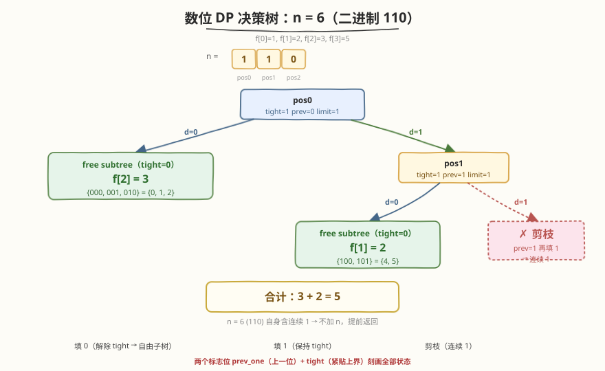
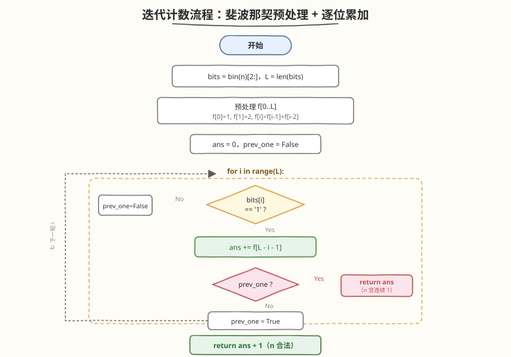
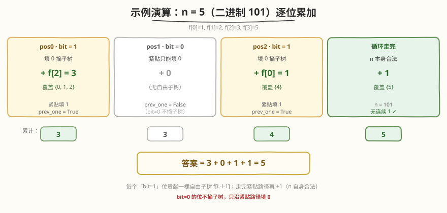

# LeetCode 不含连续1的非负整数 题解

## 1. 题目概述

- **标题 / 题号**：不含连续1的非负整数（#600，hard）
- **链接**：https://leetcode.cn/problems/non-negative-integers-without-consecutive-ones/
- **难度**：困难
- **标签**：动态规划、数位 DP、数学

**题意**：给定一个正整数 `n`，统计 `[0, n]` 范围内的非负整数中，有多少个整数的**二进制表示中不出现连续的 `1`**。

**示例 1**：

```text
输入：n = 5
输出：5
解释：[0, 5] 各数的二进制表示：
  0 : 0
  1 : 1
  2 : 10
  3 : 11   ← 出现连续 1，违规
  4 : 100
  5 : 101
仅 3 违反规则，其余 5 个满足，答案为 5。
```

**示例 2**：

```text
输入：n = 1
输出：2
解释：0(0)、1(1) 均无连续 1。
```

**示例 3**：

```text
输入：n = 2
输出：3
解释：0(0)、1(1)、2(10) 均满足。
```

**约束**：

- $1 \le n \le 10^9$

> ⚠️ **关键信号**：$n$ 可达 $10^9$（约 $2^{30}$），任何「从 0 枚举到 n 逐个检查二进制」的 $O(n)$ 做法都会超时。题目问的是「**在一段连续区间内，满足某位级约束的数有多少个**」——这是**数位 DP（digit DP）**的标准触发场景。把数按二进制位拆开，逐位决策，用两个标志位刻画状态即可在 $O(\log n)$ 内完成计数。

## 2. 解题思路

### 2.1 暴力思路：逐个数检查

最直白的做法：从 `0` 到 `n` 逐个整数检查其二进制是否含连续 `1`：

```text
ans = 0
for x in range(0, n + 1):
    if x & (x >> 1) == 0:   # 没有相邻的两位同时为 1
        ans += 1
return ans
```

> 💡 **小技巧**：`x & (x >> 1) == 0` 是判定「无连续 1」的经典位运算——把 `x` 右移一位再与原数相与，若某两位相邻地都是 1，则与结果的对应位为 1。结果为 0 即无连续 1。这是 [191. 位 1 的个数](../0001-0100/191_位1的个数.md) 里 `n & (n-1)` 技巧的姊妹用法。

问题：$n = 10^9$ 时需循环 $10^9$ 次，远超时限。需要利用「**二进制位是逐位构造出来的**」这一结构，把整段区间压缩成按位的状态转移。

### 2.2 核心观察：逐位决策 + 两个标志位

把 `n` 写成二进制（**最高位在前**），设长度为 $L$。我们在 $L$ 个位置上从高到低逐位「填数」，要使填出的数 $\le n$ 且无连续 `1`。任意中间时刻，未来怎么填只取决于两件事：

1. **上一位填的是不是 `1`**（决定本位能否再填 `1`）——记 `prev_one`；
2. **目前填出的前缀是否已经严格小于 `n` 的前缀**（决定本位是自由选 `0/1` 还是被 `n` 的对应位卡住上界）——记 `tight`。



**转移**：在第 `i` 位，上界 `limit = bits[i]`（若 `tight`）或 `1`（若已自由）。枚举本位填 `d ∈ [0, limit]`：

- 若 `prev_one` 且 `d == 1`：跳过（会形成连续 `1`）；
- 否则递归到 `dfs(i+1, d==1, tight && d==limit)`。

**边界**：`i == L` 时成功构造一个合法数，返回 `1`。**答案**：`dfs(0, False, True)`（从最高位起，上一位视为 `0`，前缀紧贴 `n`）。

> 💡 **为什么前导零不会出错？** 本题用 `n` 的实际位数 $L$ 来填，比 $n$ 短的数（如 `n=5(101)` 时的 `0,1,2`）对应在高位补 `0`。补的 `0` 不会触发 `prev_one`，所以「前导零」天然被当作普通 `0` 处理，无需特殊分支。这是数位 DP 比逐数枚举优雅的地方——**前导零自动归并**。

### 2.3 进阶：斐波那契预处理 + 迭代计数

记忆化数位 DP 已经是 $O(\log n)$，但还能更精炼。注意到一个事实：

> **长度为 $k$ 的二进制串（允许前导零）中不含连续 `1` 的个数，是一个斐波那契数。**

设 $f[k]$ = 长度为 $k$ 的合法二进制串个数。按最高位分类：

- 最高位填 `0`：剩余 $k-1$ 位任意合法 → $f[k-1]$ 种；
- 最高位填 `1`：次高位必须填 `0`，剩余 $k-2$ 位任意合法 → $f[k-2]$ 种。

故 $f[k] = f[k-1] + f[k-2]$，初值 $f[0] = 1$（空串）、$f[1] = 2$（`0`、`1`）。即 $f = 1, 2, 3, 5, 8, 13, \dots$（斐波那契平移）。



**迭代计数**——遍历 `n` 的每一位 `bits[i]`，维护 `prev_one`：

- 若 `bits[i] == '1'`：本位若填 `0`（严格小于 `n`），剩余 $L-i-1$ 位自由，贡献 $f[L-i-1]$ 个合法数；随后尝试沿「紧贴」路径填 `1`——若 `prev_one` 已为真，则 `n` 本身必含连续 `1`，**直接返回**当前累加值；否则置 `prev_one = True` 继续。
- 若 `bits[i] == '0'`：紧贴路径只能填 `0`，置 `prev_one = False` 继续。

若顺利走完所有位，说明 `n` 本身合法，再 `+1` 计入 `n`。

> 💡 **两种写法的关系**：迭代版就是把记忆化 DP 里 `tight=False` 的子问题「长度为 $k$ 的自由合法串数」提前用斐波那契算好，遍历时遇到 `bits[i]=='1'` 就一次性「摘下」整个子树。本质完全相同，迭代版常数更小、代码更短，是数位 DP 的经典优化范式。

### 2.4 示例演算（n = 5，二进制 101，L = 3）

预处理：$f[0]=1, f[1]=2, f[2]=3, f[3]=5$。



| 位 $i$ | `bits[i]` | 动作 | 贡献 | 紧贴前缀 | `prev_one` | 说明 |
|--------|-----------|------|------|----------|------------|------|
| 0 | `1` | 填 `0` 摘下子树 | $+f[2]=3$ | `1` | `True` | `0xx` 覆盖 0,1,2；继续紧贴填 `1` |
| 1 | `0` | 只能填 `0` | $+0$ | `10` | `False` | 紧贴路径填 `0`，无自由子树可摘 |
| 2 | `1` | 填 `0` 摘下子树 | $+f[0]=1$ | `101` | `True` | `100` 覆盖 4；继续紧贴填 `1` |
| — | — | 走完所有位 | $+1$ | — | — | `n=5(101)` 本身合法 |

合计 $3 + 1 + 1 = 5$，与示例一致。

> 💡 **对照 n=6(110)**：位 0 填 `0` 摘 $f[2]=3$（0,1,2），紧贴填 `1`；位 1 是 `1`，填 `0` 摘 $f[1]=2$（`10x`=4,5），此时 `prev_one=True`，再紧贴填 `1` 会形成连续 `1` → **直接返回** $3+2=5$。`[0,6]` 中 3(`11`)、6(`110`) 均违规，合法数恰为 5，验证了「提前返回」的正确性。

## 3. 参考代码

### 方法一：数位 DP 记忆化搜索（通用模板）

### Python

```python
class Solution:
    def findIntegers(self, n: int) -> int:
        bits = bin(n)[2:]                       # 最高位在前的二进制串
        L = len(bits)

        @lru_cache(None)
        def dfs(i: int, prev_one: bool, tight: bool) -> int:
            if i == L:
                return 1                        # 成功构造一个合法数
            limit = int(bits[i]) if tight else 1
            total = 0
            for d in range(limit + 1):
                if prev_one and d == 1:
                    continue                    # 连续 1，剪枝
                total += dfs(i + 1, d == 1, tight and d == limit)
            return total

        return dfs(0, False, True)
```

### C++

```cpp
class Solution {
  public:
    int findIntegers(int n) {
        string bits;
        for (int t = n; t; t >>= 1) bits.push_back(char('0' + (t & 1)));
        reverse(bits.begin(), bits.end());      // 最高位在前
        int L = bits.size();
        int memo[L + 1][2][2];
        memset(memo, -1, sizeof(memo));

        function<int(int, int, int)> dfs = [&](int i, int prev_one, int tight) -> int {
            if (i == L) return 1;
            int& res = memo[i][prev_one][tight];
            if (res != -1) return res;
            int limit = tight ? (bits[i] - '0') : 1;
            int total = 0;
            for (int d = 0; d <= limit; ++d) {
                if (prev_one && d == 1) continue;
                total += dfs(i + 1, d == 1, tight && d == limit);
            }
            return res = total;
        };
        return dfs(0, 0, 1);
    }
};
```

> 💡 **模板可迁移**：`dfs(i, prev_one, tight)` 是数位 DP 的标准三参数骨架。把「`prev_one && d==1` 跳过」换成别的位级约束（如「不能出现某子串」「相邻位差 ≤ k」），就能套到一整类题上——见第 7 节的同类练习。

### 方法二：斐波那契预处理 + 迭代（最优）

### Python

```python
class Solution:
    def findIntegers(self, n: int) -> int:
        bits = bin(n)[2:]
        L = len(bits)
        f = [0] * (L + 1)
        f[0], f[1] = 1, 2
        for i in range(2, L + 1):
            f[i] = f[i - 1] + f[i - 2]          # 合法二进制串个数 = 斐波那契

        ans = 0
        prev_one = False
        for i in range(L):
            if bits[i] == '1':
                ans += f[L - i - 1]             # 本位填 0，剩余自由
                if prev_one:                    # 再填 1 会连续，提前返回
                    return ans
                prev_one = True
            else:
                prev_one = False
        return ans + 1                          # n 本身合法
```

### C++

```cpp
class Solution {
  public:
    int findIntegers(int n) {
        string bits;
        for (int t = n; t; t >>= 1) bits.push_back(char('0' + (t & 1)));
        reverse(bits.begin(), bits.end());
        int L = bits.size();
        vector<int> f(L + 1, 0);
        f[0] = 1; if (L >= 1) f[1] = 2;
        for (int i = 2; i <= L; ++i) f[i] = f[i - 1] + f[i - 2];

        int ans = 0, prev_one = 0;
        for (int i = 0; i < L; ++i) {
            if (bits[i] == '1') {
                ans += f[L - i - 1];
                if (prev_one) return ans;
                prev_one = 1;
            } else {
                prev_one = 0;
            }
        }
        return ans + 1;
    }
};
```

> ⚠️ **易错点**：循环结束后的 `+1` 只在 `n` 本身合法时才加。若中途因 `prev_one` 触发提前 `return`，说明 `n` 含连续 `1`，不能加。代码里把 `return ans` 放在 `if prev_one` 分支内、`return ans + 1` 放在循环之后，正好区分两种情况。

## 4. 复杂度分析

| 维度 | 复杂度 | 说明 |
|------|--------|------|
| **时间复杂度** | $O(\log n)$ | 二进制位数 $L = \lfloor \log_2 n \rfloor + 1$；预处理斐波那契 $O(L)$，遍历 $O(L)$；记忆化 DP 状态数 $O(L \cdot 2 \cdot 2) = O(L)$ |
| **空间复杂度** | $O(\log n)$ | 斐波那契数组 / 记忆化表大小均为 $O(L)$ |

$n = 10^9$ 时 $L = 30$，整个计算量在百次量级，毫秒级完成。对比暴力的 $10^9$ 次循环，这是「**把线性区间压成对数位数**」的典型胜利。

## 5. 扩展：为什么是斐波那契？——齐肯多夫定理

「不含连续 1 的二进制串」与斐波那契数的联系并非巧合，背后是 **Zeckendorf 定理**：

> 任意正整数 $m$ 都可以**唯一**地表示为若干个**互不相邻**的斐波那契数 $F_2, F_3, \dots$ 之和（其中 $F_1=1, F_2=2, F_3=3, F_4=5, \dots$）。

把这种「不选相邻斐波那契数」的选法编码成二进制（第 $i$ 位为 `1` 表示选了 $F_{i+1}$），就得到一个**不含连续 `1` 的二进制串**。于是「$\le n$ 的合法数个数」与「可用 Zeckendorf 表示的数个数」一一对应——这正是本题答案与斐波那契数列深度绑定的根本原因。

进一步，若令 $g(k)$ = 所有位数 $\le k$ 的合法非负整数个数，则 $g(k) = f[k] - 1$（减去全零串对应的 `0` 重复计数），仍呈斐波那契增长。所以「无连续 1 的数」在自然数中密度约为 $1/\varphi^\ell$（$\varphi$ 为黄金比），是一个**稀疏集合**——这也解释了为何 $n=10^9$ 时答案仅约 $2\times 10^5$ 量级。

> 💡 **面试中**：能说出「这是斐波那契 / Zeckendorf 表示」是加分项，但核心还是把数位 DP 模板写对。扩展知识用于第 6 节的追问应对。

## 6. 面试要点

1. **为什么想到数位 DP？**

   - 题目问「$[0, n]$ 内满足位级约束的数有多少个」，且 $n$ 很大（$10^9$）但约束是「按位」的。这三个信号——**区间计数 + 大上界 + 位级约束**——是数位 DP 的标准触发条件，与 [233. 数字 1 的个数](https://leetcode.cn/problems/number-of-digit-one/)、[902. 最大为 N 的数字组合字符串](https://leetcode.cn/problems/numbers-at-most-n-with-given-digit-set/) 同源。

2. **`tight` 标志的作用是什么？去掉会怎样？**

   - `tight=1` 表示前缀与 `n` 完全相同，当前位上界是 `bits[i]`；`tight=0` 表示前缀已严格更小，当前位可自由选 `0/1`。去掉 `tight` 就会统计**所有长度为 $L$ 的合法串**，而非「$\le n$」的那些，答案会偏大。`tight` 是数位 DP 把「区间上界」编入状态的关键。

3. **`prev_one` 能否合并进 `tight`？状态为什么只有三维？**

   - 不能合并，二者语义独立：`tight` 管「上界」，`prev_one` 管「位间约束」。状态数为 $L \times 2 \times 2$，因为每位只有 `0/1` 两种取值，两个标志各 2 态。若约束升级为「不能出现 `11` 也不能出现 `101`」，则需要更长的「历史窗口」状态，状态数相应膨胀。

4. **迭代版里「提前 return」的正确性如何保证？**

   - 当 `bits[i]=='1'` 且 `prev_one=True` 时，紧贴路径若继续填 `1` 会形成连续 `1`，而 `n` 在该位的值正是 `1`——也就是说 `n` 自身必含连续 `1`，所有比 `n` 紧贴路径更小的数已在之前位被摘完。此时 `ans` 已是 $[0, n]$ 的完整合法计数，无需再加 `n`，直接返回正确。

5. **记忆化 DP 与迭代斐波那契，面试写哪个？**

   - 先写**记忆化 DP**：通用、好解释、易迁移到变体题。再口述**迭代版**作为优化：指出「自由子树大小即斐波那契数」，可预处理 $O(\log n)$ 算好。两者复杂度同阶，迭代版常数更小、代码更短，适合作为 follow-up。

## 同类练习题

| # | 题目 | 与本题的关联 |
|---|------|-------------|
| 233 | [数字 1 的个数](https://leetcode.cn/problems/number-of-digit-one/) | 数位 DP 母题，统计 $[0,n]$ 所有数中数字 `1` 出现的总次数，与本题同为「`dfs(i, tight, ...)`」骨架 |
| 902 | [最大为 N 的数字组合字符串](https://leetcode.cn/problems/numbers-at-most-n-with-given-digit-set/) | 每位只能从给定数字集合中选，对比本题「每位受相邻位约束」，体会数位 DP 的「位级约束」可替换性 |
| 1012 | [至少有 1 位重复的数字](https://leetcode.cn/problems/numbers-with-repeated-digits/) | 正难则反，用数位 DP 统计「各位互不相同」的数，再用 $n+1$ 减去——对比本题直接计数 |
| 526 | [优美的排列](../0501-0600/526_优美的排列.md) | 同为计数型 DP，本题在「二进制位」维度做约束，526 在「排列位置」维度做约束，对照体会状态设计 |
| 191 | [位 1 的个数](../0001-0100/191_位1的个数.md) | 位运算基础题，`n & (n-1)` 数 `1` 的个数，对比本题 `x & (x>>1)` 判连续 `1`，是位运算技巧的两面 |
