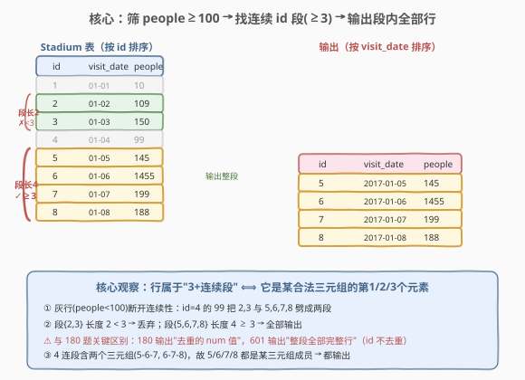
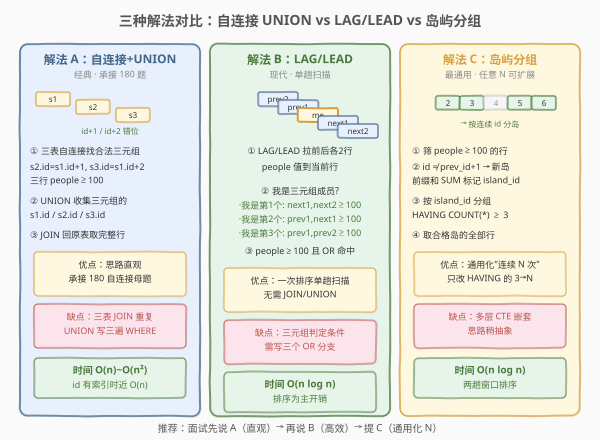
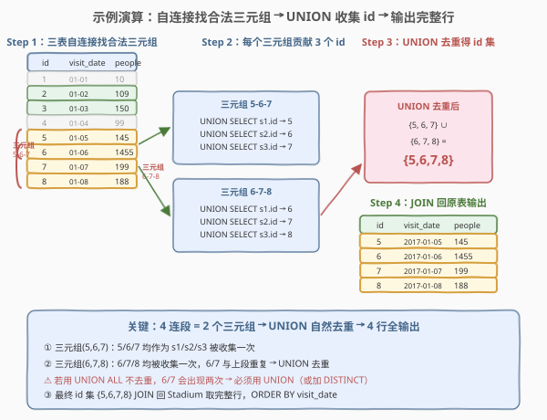

# LeetCode 体育馆的人流量 题解

## 1. 题目概述

- **标题 / 题号**：体育馆的人流量（#601，hard）
- **链接**：https://leetcode.cn/problems/human-traffic-of-stadium/
- **难度**：困难
- **标签**：SQL、自连接、窗口函数、LAG、LEAD、岛屿问题

**题意**：给定 `Stadium` 表，每行记录某天体育馆的人流量。编写 SQL 查询，找出**人数大于等于 100** 且**连续 id 不少于 3 行**的所有记录，结果按 `visit_date` 升序返回**完整行**（`id`、`visit_date`、`people` 三列）。

**表结构**：

```text
Table: Stadium
+---------------+---------+
| Column Name   | Type    |
+---------------+---------+
| id            | int     |  ← 自增（判定"连续"的依据）
| visit_date    | date    |  ← 主键
| people        | int     |
+---------------+---------+
```

> 💡 **关键约束**：`visit_date` 是主键，但"连续"依据是 `id` 相邻（`id`、`id+1`、`id+2` 相差 1）。题目要的是：在所有 `people ≥ 100` 的行里，找出 `id` 连续且段长 ≥ 3 的那些段，**输出段内每一行的完整记录**（而非去重后的某个值）。

**示例 1**：

```text
输入：
Stadium 表:
+------+------------+-----------+
| id   | visit_date | people    |
+------+------------+-----------+
| 1    | 2017-01-01 | 10        |
| 2    | 2017-01-02 | 109       |
| 3    | 2017-01-03 | 150       |
| 4    | 2017-01-04 | 99        |
| 5    | 2017-01-05 | 145       |
| 6    | 2017-01-06 | 1455      |
| 7    | 2017-01-07 | 199       |
| 8    | 2017-01-08 | 188       |
+------+------------+-----------+

输出：
+------+------------+-----------+
| id   | visit_date | people    |
+------+------------+-----------+
| 5    | 2017-01-05 | 145       |
| 6    | 2017-01-06 | 1455      |
| 7    | 2017-01-07 | 199       |
| 8    | 2017-01-08 | 188       |
+------+------------+-----------+
```

**解释**：

- `people ≥ 100` 的行有 id = 2, 3, 5, 6, 7, 8
- id = 2,3 连续但只有 2 行（段长 2 < 3）→ 丢弃
- id = 4 的 `people = 99` 断开了连续性，把 2,3 与 5,6,7,8 劈成两段
- id = 5,6,7,8 连续且段长 4 ≥ 3 → 全部 4 行输出

**约束**：

- `visit_date` 为 `Stadium` 表的主键
- `id` 为自增列（题面保证连续，无间断）
- `people` 可小于 100（这些行不参与连续段，且会断开段）
- 结果按 `visit_date` 升序排列

> 💡 本题是 [180. 连续出现的数字](../0101-0200/180_连续出现的数字.md) 的 **Hard 升级版**。180 只需返回"连续三行相同"的**去重 num 值**；601 则要：① 增加阈值前置过滤（`people ≥ 100`）；② 输出**整段全部完整行**（非去重值、非仅起始行）；③ 段长可能超过 3（如 4 连段要输出 4 行）。核心仍是"把跨行连续关系转为同行多列比较"，但输出语义更丰富。

## 2. 解题思路

### 2.1 暴力思路：游标逐行扫描

最直觉的思路是按 `id` 排序后逐行扫描，维护"当前连续计数"：若 `people ≥ 100` 则计数 +1，否则重置为 0；当计数达到 3 时，把当前段所有行标记为有效。这在过程式语言中很自然，但**纯 SQL 没有循环语句**——需要把"行间连续关系"转换为"列间关系"或"集合操作"。

> ⚠️ 本题相比 180 多了两层复杂性：① **阈值过滤**——只有 `people ≥ 100` 的行才计入连续段，`people < 100` 的行既是"非成员"又是"断点"；② **输出整段全部行**——180 只输出去重值（`SELECT DISTINCT num`），601 要输出段内每一行的完整记录，且段长可能 > 3。

### 2.2 核心观察：行属于"3+连续段" ⟺ 它是某合法三元组的第 1/2/3 个元素



**关键洞察**：一个长度 ≥ 3 的连续段，其中的每一行都必然是**某个合法三元组**（三个连续 id 且均 `people ≥ 100`）的成员。具体地，对段内任一行 `r`：

- 若 `r` 是段的第 1 个元素 → 它与 `r+1`、`r+2` 构成三元组（`r` 是第 1 个）
- 若 `r` 是段的第 2 个元素 → 它与 `r-1`、`r+1` 构成三元组（`r` 是第 2 个）
- 若 `r` 是段的第 3 个及以后 → 它与 `r-2`、`r-1` 构成三元组（`r` 是第 3 个）

因此问题等价于：**找出所有合法三元组，收集每个三元组的三个 id，去重后输出对应完整行**。

$$\text{valid}(r) \iff \exists\, \text{三元组}\ (a, a+1, a+2):\ r.\text{id} \in \{a, a+1, a+2\} \land \bigwedge_{i=0}^{2} \text{people}[a+i] \geq 100$$

以示例为例，id = 5,6,7,8 是一个 4 连段，它包含两个三元组：(5,6,7) 和 (6,7,8)。UNION 收集它们的 id：

- (5,6,7) → {5, 6, 7}
- (6,7,8) → {6, 7, 8}
- UNION 去重 → {5, 6, 7, 8} → 输出 4 行

> 💡 **与 180 的本质区别**：180 的输出是 `SELECT DISTINCT num`（标量值去重），601 的输出是 `SELECT id, visit_date, people`（完整行，按 id 天然唯一无需 DISTINCT，但收集 id 时需 UNION 去重避免 JOIN 放大）。180 的"连续"判定是"相邻行 num 相同"，601 的"连续"判定是"id 相邻且 people ≥ 100"——前者比"值相等"，后者比"阈值 + id 差 1"。

### 2.3 三种解法流程对比



**解法 A（经典）：三表自连接 + UNION**——承接 180 的自连接思路：

- 三表 `Stadium s1 JOIN s2 ON s2.id = s1.id + 1 JOIN s3 ON s3.id = s1.id + 2`
- `WHERE s1.people ≥ 100 AND s2.people ≥ 100 AND s3.people ≥ 100` 筛合法三元组
- 对每个三元组，`UNION` 收集 `s1.id`、`s2.id`、`s3.id`
- JOIN 回原表取完整行

**解法 B（推荐）：窗口函数 LAG/LEAD**——单趟扫描，每行回看/前看各 2 行：

- `LAG(people, 1/2)` / `LEAD(people, 1/2)` 拉相邻行的 `people` 到当前行
- 当前行 `people ≥ 100` 且（前两行 ≥ 100）或（前一后一 ≥ 100）或（后两行 ≥ 100）→ 命中
- 无需 JOIN/UNION，一次排序 + 单趟过滤

**解法 C（通用）：岛屿分组（Islands & Gaps）**——最通用的"连续 N 次"解法：

- 先筛 `people ≥ 100` 的行
- `id ≠ prev_id + 1` 标记新岛起点，前缀和生成 `island_id`
- 按 `island_id` 分组 `HAVING COUNT(*) ≥ 3`，取合格岛的全部行

> ⚠️ **解法 B 的隐含假设**：`LAG`/`LEAD` 取的是"排序后的相邻行"，若 `id` 有间断（如 1,2,4），`LAG` 取到的是 id=2 而非 id=3（不存在），但 id=2 与 id=4 并非"连续 id"。本题保证 `id` 自增无间断，故 `LAG` 的"相邻行"等价于"id 相邻"。若 `id` 可能间断，需额外用 `LAG(id)` 校验 `prev_id = id - 1`（见第 5.2 节），或改用解法 A/C（它们显式检查 `id` 差值）。

### 2.4 示例演算

以示例数据为例，用解法 A（自连接 + UNION）逐步演算：



**Step 1：三表自连接找合法三元组**

按 `s2.id = s1.id + 1`、`s3.id = s1.id + 2` 错位连接，`WHERE` 三行均 `people ≥ 100`：

| 三元组起始 s1.id | 三元组 (s1, s2, s3) | 三行 people | 合法? |
|------------------|---------------------|-------------|-------|
| 1 | (1, 2, 3) | 10, 109, 150 | ✗（id=1 的 10 < 100） |
| 2 | (2, 3, 4) | 109, 150, 99 | ✗（id=4 的 99 < 100） |
| 3 | (3, 4, 5) | 150, 99, 145 | ✗（id=4 的 99 < 100） |
| 4 | (4, 5, 6) | 99, 145, 1455 | ✗（id=4 的 99 < 100） |
| 5 | (5, 6, 7) | 145, 1455, 199 | ✓ **合法三元组** |
| 6 | (6, 7, 8) | 1455, 199, 188 | ✓ **合法三元组** |

**Step 2：每个合法三元组贡献 3 个 id（UNION 去重）**

- 三元组 (5,6,7) → UNION `s1.id`=5, `s2.id`=6, `s3.id`=7 → {5, 6, 7}
- 三元组 (6,7,8) → UNION `s1.id`=6, `s2.id`=7, `s3.id`=8 → {6, 7, 8}
- `UNION`（自动去重）→ {5, 6, 7, 8}

**Step 3：JOIN 回原表取完整行，ORDER BY visit_date**

| id | visit_date | people |
|----|------------|--------|
| 5 | 2017-01-05 | 145 |
| 6 | 2017-01-06 | 1455 |
| 7 | 2017-01-07 | 199 |
| 8 | 2017-01-08 | 188 |

> 💡 **为什么 4 连段会产生两个三元组**：长度为 $L$ 的连续段包含 $L - 2$ 个三元组（起始位置从段首到段首+2）。4 连段 → 2 个三元组；5 连段 → 3 个三元组。`UNION` 收集所有三元组的 id 后去重，恰好得到段内全部 id——这就是"输出整段全部行"的数学保证。

## 3. 参考代码

### SQL（解法 A：三表自连接 + UNION，经典）

```sql
SELECT s.id, s.visit_date, s.people
FROM Stadium s
JOIN (
    SELECT s1.id AS id
    FROM Stadium s1
    JOIN Stadium s2 ON s2.id = s1.id + 1
    JOIN Stadium s3 ON s3.id = s1.id + 2
    WHERE s1.people >= 100 AND s2.people >= 100 AND s3.people >= 100
    UNION
    SELECT s2.id AS id
    FROM Stadium s1
    JOIN Stadium s2 ON s2.id = s1.id + 1
    JOIN Stadium s3 ON s3.id = s1.id + 2
    WHERE s1.people >= 100 AND s2.people >= 100 AND s3.people >= 100
    UNION
    SELECT s3.id AS id
    FROM Stadium s1
    JOIN Stadium s2 ON s2.id = s1.id + 1
    JOIN Stadium s3 ON s3.id = s1.id + 2
    WHERE s1.people >= 100 AND s2.people >= 100 AND s3.people >= 100
) valid ON s.id = valid.id
ORDER BY s.visit_date;
```

> 💡 **写法要点**：
> - 三次 `UNION` 分别收集每个合法三元组的 `s1.id`（第 1 个）、`s2.id`（第 2 个）、`s3.id`（第 3 个），覆盖段内所有位置。
> - `UNION`（而非 `UNION ALL`）自动去重——4 连段的 6,7 会被两个三元组各贡献一次，`UNION` 去重后只留一份。
> - 外层 `JOIN Stadium s ON s.id = valid.id` 回原表取 `visit_date`、`people` 完整行。
> - `ORDER BY s.visit_date` 满足题目排序要求。
> - 三个 `UNION` 分支的 `FROM/WHERE` 完全相同，只是 `SELECT` 的列不同——可读性尚可但较冗长，CTE 改写见下。

### SQL（解法 A'：CTE 简化自连接 + UNION，推荐写法）

```sql
WITH triples AS (
    SELECT s1.id AS id1, s2.id AS id2, s3.id AS id3
    FROM Stadium s1
    JOIN Stadium s2 ON s2.id = s1.id + 1
    JOIN Stadium s3 ON s3.id = s1.id + 2
    WHERE s1.people >= 100 AND s2.people >= 100 AND s3.people >= 100
)
SELECT DISTINCT s.id, s.visit_date, s.people
FROM Stadium s
JOIN triples t ON s.id IN (t.id1, t.id2, t.id3)
ORDER BY s.visit_date;
```

> 💡 **CTE 简化**：用 `WITH triples AS (...)` 把"找合法三元组"封装一次，外层 `JOIN ... ON s.id IN (t.id1, t.id2, t.id3)` 一次取出三元组的全部三个 id。`DISTINCT` 防止同一行被多个三元组匹配而重复（4 连段的 6,7 会被两个三元组各匹配一次）。比三段 `UNION` 更简洁，语义更清晰。

### SQL（解法 B：LAG/LEAD 窗口函数，单趟扫描）

```sql
SELECT id, visit_date, people
FROM (
    SELECT id, visit_date, people,
           LAG(people, 1) OVER (ORDER BY id) AS prev_p1,
           LAG(people, 2) OVER (ORDER BY id) AS prev_p2,
           LEAD(people, 1) OVER (ORDER BY id) AS next_p1,
           LEAD(people, 2) OVER (ORDER BY id) AS next_p2
    FROM Stadium
) t
WHERE people >= 100
  AND (
      (prev_p1 >= 100 AND prev_p2 >= 100)                       -- 我是三元组第 3 个
      OR (prev_p1 >= 100 AND next_p1 >= 100)                    -- 我是三元组第 2 个
      OR (next_p1 >= 100 AND next_p2 >= 100)                    -- 我是三元组第 1 个
  )
ORDER BY visit_date;
```

> 💡 **写法要点**：
> - 子查询用 `LAG(people, 1/2)` 和 `LEAD(people, 1/2)` 把前 2 行、后 2 行的 `people` 拉到当前行——一次排序，单趟赋值。
> - 外层 `WHERE people >= 100` 先保证自身合法，再用三个 `OR` 分支判定"我是否属于某合法三元组"：
>   - `prev_p1 ≥ 100 AND prev_p2 ≥ 100`：我及前两行都 ≥ 100 → 我是三元组的第 3 个
>   - `prev_p1 ≥ 100 AND next_p1 ≥ 100`：我及前后各一行都 ≥ 100 → 我是三元组的第 2 个
>   - `next_p1 ≥ 100 AND next_p2 ≥ 100`：我及后两行都 ≥ 100 → 我是三元组的第 1 个
> - 三个分支覆盖了"段内任一位置"的所有情况，`OR` 取并集即"属于某合法三元组"。
> - `LAG`/`LEAD` 在表首/表尾产生 `NULL`，`NULL >= 100` 为 `UNKNOWN`，`WHERE` 只保留 `TRUE` → 边界天然过滤，无需 `COALESCE`。
> - 一次排序 + 单趟扫描，无 JOIN/UNION，通常比解法 A 更高效。

### SQL（解法 C：岛屿分组，通用化"连续 N 次"）

```sql
WITH valid_rows AS (
    SELECT id, visit_date, people
    FROM Stadium
    WHERE people >= 100
),
island_marked AS (
    SELECT id, visit_date, people,
           CASE WHEN id = LAG(id) OVER (ORDER BY id) + 1 THEN 0 ELSE 1 END AS is_new_island
    FROM valid_rows
),
island_grouped AS (
    SELECT id, visit_date, people,
           SUM(is_new_island) OVER (ORDER BY id) AS island_id
    FROM island_marked
)
SELECT id, visit_date, people
FROM island_grouped
WHERE island_id IN (
    SELECT island_id FROM island_grouped GROUP BY island_id HAVING COUNT(*) >= 3
)
ORDER BY visit_date;
```

> 💡 **写法要点**（三层 CTE 逐层推进）：
> - **`valid_rows`**：先筛 `people ≥ 100` 的行——只有这些行参与连续段，`people < 100` 的行直接排除（它们既是"非成员"又天然断开段）。
> - **`island_marked`**：在筛后的行里，`id = LAG(id) + 1` 说明与前一行 `id` 连续 → `is_new_island = 0`（同岛）；否则 `1`（新岛起点）。
> - **`island_grouped`**：`SUM(is_new_island) OVER (ORDER BY id)` 做前缀和，同岛的行得到相同 `island_id`（岛屿编号）——这是 SQL"岛屿问题"的标准套路。
> - **外层**：`WHERE island_id IN (子查询 HAVING COUNT(*) ≥ 3)` 只保留"岛内行数 ≥ 3"的岛的全部行。
> - **通用化**：把 `HAVING` 的 `3` 改成任意 N，即可解"连续 N 行 people ≥ 100"——无需改其他部分。这是处理"连续 N 次"最通用的 SQL 范式。

### Python（pandas）

```python
import pandas as pd

def human_traffic_of_stadium(stadium: pd.DataFrame) -> pd.DataFrame:
    valid = stadium[stadium['people'] >= 100].sort_values('id').reset_index(drop=True)
    valid['is_new'] = (valid['id'] != valid['id'].shift(1) + 1).astype(int)
    valid['island_id'] = valid['is_new'].cumsum()
    counts = valid.groupby('island_id').size()
    keep = valid[valid['island_id'].isin(counts[counts >= 3].index)]
    return keep[['id', 'visit_date', 'people']].sort_values('visit_date')
```

> 💡 **pandas 对照**：`shift(1) + 1` 等价于 `LAG(id) + 1`；`(id != shift(1)+1).astype(int)` 对应 `CASE WHEN id = LAG(id)+1 THEN 0 ELSE 1`；`cumsum()` 对应 `SUM(is_new_island) OVER (ORDER BY id)` 前缀和；`groupby + size` 对应 `GROUP BY island_id` + `COUNT(*)`；`isin(counts[counts>=3].index)` 对应 `WHERE island_id IN (... HAVING COUNT>=3)`。思路与解法 C 完全一致——pandas 的 `shift`/`cumsum` 是 SQL 窗口函数的天然镜像。

## 4. 复杂度分析

| 维度 | 复杂度 | 说明 |
|------|--------|------|
| **时间（解法 A 自连接）** | $O(n)$ ~ $O(n^2)$ | $n$ = `Stadium` 行数。三表 JOIN 在 `id` 有索引（主键聚簇索引）时可走索引扫描近似 $O(n)$；无索引最坏 Nested Loop $O(n^2)$。`UNION` 去重需排序 $O(n \log n)$ |
| **时间（解法 B LAG/LEAD）** | $O(n \log n)$ | `LAG/LEAD OVER (ORDER BY id)` 需全表按 `id` 排序 $O(n \log n)$，排序后单趟扫描赋值 $O(n)$。`id` 有索引可免排序降为 $O(n)$ |
| **时间（解法 C 岛屿分组）** | $O(n \log n)$ | 两次窗口排序（`LAG` + `SUM OVER`）各 $O(n \log n)$，`GROUP BY` 排序 $O(n \log n)$。筛后行数 $n'$ 通常 $< n$ |
| **空间** | $O(n)$ | 窗口函数排序缓冲区 / JOIN 中间结果集 / CTE 物化 |
| **结果行数** | $O(n)$ | 最坏全部行都在合法段内（如全表 `people ≥ 100`） |

> ⚠️ SQL 复杂度取决于**执行计划**：解法 A 的三表 JOIN 依赖 `id` 主键索引；解法 B/C 的窗口排序在有索引时可优化。面试中说明"自连接依赖 JOIN 策略、窗口函数一次排序、岛屿法两趟窗口"即可。生产环境 `id` 为主键天然有聚簇索引，三种解法实际都接近 $O(n \log n)$。

## 5. 扩展

### 5.1 解法 A 的 `UNION` vs `UNION ALL`

解法 A 用 `UNION`（而非 `UNION ALL`）收集三元组的 id。区别在于：

- `UNION`：自动去重——4 连段的 id=6,7 被两个三元组各贡献一次，`UNION` 只留一份。
- `UNION ALL`：不去重——id=6,7 出现两次，外层 `JOIN` 会让对应行出现两次（结果放大）。

若用 `UNION ALL`，必须在外层加 `SELECT DISTINCT` 去重。解法 A'（CTE + `JOIN ... IN`）同样需 `DISTINCT`。本质上"收集 id"这步必须保证 id 唯一——`UNION` 或 `DISTINCT` 二选一。

> 💡 **记忆口诀**：`UNION` = `UNION ALL` + `DISTINCT`。收集"成员 id 集"用 `UNION`；收集"带重复的明细"用 `UNION ALL`。本题要的是 id 集合（去重），故 `UNION`。

### 5.2 id 有间断时的处理

本题保证 `id` 自增连续。但若 `id` 因删除有间断（如 1,2,4,5），解法 A 的 `s2.id = s1.id + 1` 会漏掉跨间断的相邻行（id=2 与 id=4 视为不连续——这是正确行为，因为题目要求"id 连续"）。但解法 B 的 `LAG`/`LEAD` 取的是"排序后相邻行"，id=4 的 `LAG` 取到 id=2 的 `people`，而 id=2 与 id=4 并非"id 连续"——会产生误判。

若 `id` 可能间断且仍需判定"id 连续"，解法 B 需额外校验 `id` 差值：

```sql
SELECT id, visit_date, people
FROM (
    SELECT id, visit_date, people,
           LAG(id, 1) OVER (ORDER BY id) AS prev_id1,
           LAG(id, 2) OVER (ORDER BY id) AS prev_id2,
           LAG(people, 1) OVER (ORDER BY id) AS prev_p1,
           LAG(people, 2) OVER (ORDER BY id) AS prev_p2,
           LEAD(id, 1) OVER (ORDER BY id) AS next_id1,
           LEAD(id, 2) OVER (ORDER BY id) AS next_id2,
           LEAD(people, 1) OVER (ORDER BY id) AS next_p1,
           LEAD(people, 2) OVER (ORDER BY id) AS next_p2
    FROM Stadium
) t
WHERE people >= 100
  AND (
      (prev_id1 = id - 1 AND prev_id2 = id - 2 AND prev_p1 >= 100 AND prev_p2 >= 100)
      OR (prev_id1 = id - 1 AND next_id1 = id + 1 AND prev_p1 >= 100 AND next_p1 >= 100)
      OR (next_id1 = id + 1 AND next_id2 = id + 2 AND next_p1 >= 100 AND next_p2 >= 100)
  )
ORDER BY visit_date;
```

> 💡 加 `prev_id1 = id - 1` 等校验确保"LAG 取到的行确实是 id 连续的"，而非"排序相邻但 id 跳号"。解法 A/C 显式用 `id` 差值判定，天然处理间断。本题 `id` 连续，无需此变换——但面试中提及这个边界是加分项。

### 5.3 通用化"连续 N 行"

解法 C（岛屿分组）的扩展性最强——把 `HAVING COUNT(*) >= 3` 的 `3` 改成任意 N，即可解"连续 N 行 people ≥ 100"：

```sql
-- 连续 5 行 people >= 100
...
SELECT island_id FROM island_grouped GROUP BY island_id HAVING COUNT(*) >= 5
...
```

解法 A 推广到 N 需 N 个自连接副本 + N 段 UNION，写法指数膨胀；解法 B 需 N-1 个 `LAG` + N-1 个 `LEAD` + C(N,2) 级 `OR` 分支，同样臃肿。**岛屿分组法是"连续 N 次"的通用母题**——详见 [180. 连续出现的数字](../0101-0200/180_连续出现的数字.md) 第 5.2 节。

### 5.4 阈值过滤的两种位置

解法 A 把 `people ≥ 100` 放在三元组的 `WHERE`（三行同时判定）；解法 C 先 `WHERE people ≥ 100` 筛表再做岛屿分组。两者等价但思路不同：

- **解法 A**：在"三元组层面"过滤——三元组的三个成员都必须 `≥ 100`，任一不满足则整个三元组作废。
- **解法 C**：在"行层面"过滤——先把不合格的行剔除，再在剩余行里找连续段。剔除后行间 `id` 若不连续（被剔除行隔开）则自然断岛。

> 💡 解法 C 的"先筛后分组"更符合直觉——`people < 100` 的行既是"非成员"又是"断点"，一步 `WHERE` 同时完成两个职责。解法 A 的"三元组层面过滤"则把"断点"隐含在"三元组不成立"中——id=4 的 99 使 (2,3,4)、(3,4,5)、(4,5,6) 三个三元组都不成立，等价于 id=4 断开了 2,3 与 5,6,7,8。

## 6. 面试要点

1. **601 与 180 的核心区别是什么？**

   - 三点区别：① **阈值过滤**——180 比"相邻行 num 相等"，601 比"people ≥ 100"（阈值判定而非值相等）；② **输出语义**——180 输出去重的 `num` 值（`SELECT DISTINCT num`），601 输出段内每一行的完整记录（`id, visit_date, people`）；③ **段长**——180 固定"连续 3 次"，601 是"3 次及以上"（4 连段也要全输出）。本质都是"跨行连续关系转同行多列比较"，但 601 的输出更丰富。

2. **为什么 4 连段会产生两个三元组？UNION 如何处理？**

   - 长度为 $L$ 的连续段包含 $L - 2$ 个三元组（起始位置从段首到段首+2）。4 连段 → 三元组 (5,6,7) 和 (6,7,8)。`UNION` 收集两个三元组的 id → {5,6,7} ∪ {6,7,8} = {5,6,7,8}（自动去重）。若用 `UNION ALL` 不去重，6,7 会出现两次，需外层 `DISTINCT` 补救。`UNION` = `UNION ALL` + `DISTINCT`，收集"成员 id 集"用 `UNION` 最简洁。

3. **解法 B 的三个 OR 分支分别对应什么位置？**

   - 当前行在合法三元组中的三种位置：① `prev_p1 ≥ 100 AND prev_p2 ≥ 100` → 我是三元组的**第 3 个**（前两行也合法）；② `prev_p1 ≥ 100 AND next_p1 ≥ 100` → 我是**第 2 个**（前后各一行合法）；③ `next_p1 ≥ 100 AND next_p2 ≥ 100` → 我是**第 1 个**（后两行也合法）。三个分支取并集覆盖"段内任一位置"。`LAG`/`LEAD` 在边界产生 `NULL`，`NULL >= 100` 为 `UNKNOWN` 自动过滤，无需额外判空。

4. **解法 C（岛屿分组）为什么最通用？**

   - 它把"连续 N 次"抽象为"岛屿长度 ≥ N"——`HAVING COUNT(*) >= N` 一处改 N 即可通用化，不需改其他部分。解法 A 推广到 N 需 N 个自连接副本（写法指数膨胀）；解法 B 需 N-1 个 `LAG`/`LEAD` + 大量 `OR` 分支。岛屿法的"先筛 → 标新岛 → 前缀和分组 → HAVING 计数"四步是 SQL 处理"Islands & Gaps"问题的标准范式，适用于所有"连续 N 行满足条件"类题目。

5. **`people < 100` 的行如何影响连续段？**

   - 它同时扮演两个角色：① **非成员**——本身不参与合法段（`people < 100` 不满足阈值）；② **断点**——把它两侧的连续 id 段断开。解法 A 中，它使所有包含它的三元组不合法（三元组要求三行均 ≥ 100），等价于"断开"；解法 C 中，先 `WHERE people ≥ 100` 把它剔除，剔除后它的 `id` 位置缺失，前后行的 `id` 不连续 → 自然断岛。两种解法对"断点"的处理殊途同归。

> 💡 **一句话总结**：601 是 180 的 Hard 升级——核心仍是"跨行连续关系转同行多列比较"，但增加了阈值过滤与"输出整段全部行"的语义。三表自连接 + UNION 是承接 180 的经典解法；LAG/LEAD 单趟扫描更高效；岛屿分组法最通用（任意 N 可扩展）。记住"行属于 3+ 段 ⟺ 它是某合法三元组成员"这个等价转换，所有"连续 N 行满足条件并输出完整行"类 SQL 题都能套用。

## 同类练习题

| # | 题目 | 与本题的关联 |
|---|------|-------------|
| 180 | [连续出现的数字](../0101-0200/180_连续出现的数字.md) | SQL 自连接 + 窗口函数母题，601 的直接前置——把"连续三行 num 相同"拍扁成"一行三列"，601 在此基础上加阈值过滤与整段输出 |
| 197 | [上升的温度](https://leetcode.cn/problems/rising-temperature/) | SQL 自连接 + `DATEDIFF` 日期比较，"相邻日期"的行间比较，与本题"id 相邻"思路同源 |
| 196 | [删除重复的电子邮箱](https://leetcode.cn/problems/delete-duplicate-emails/) | SQL 自连接 DELETE，同一张表 JOIN 自身做行间比较，承接本题的自连接思路（DELETE 场景） |
| 262 | [行程和用户](../0201-0300/262_行程和用户.md) | SQL 多表 JOIN + 条件聚合 Hard 题，与本题共享"复杂行间关系"的 SQL 思维 |
| 1853 | [所有缺失编号的最小值](https://leetcode.cn/problems/all-the-missing-numbers/) | SQL"间断/连续"检测的另一面，与本题的 id 连续性假设形成对照 |
