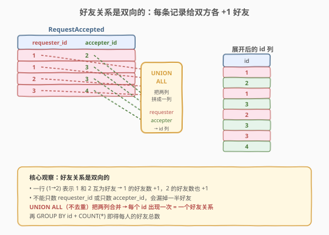
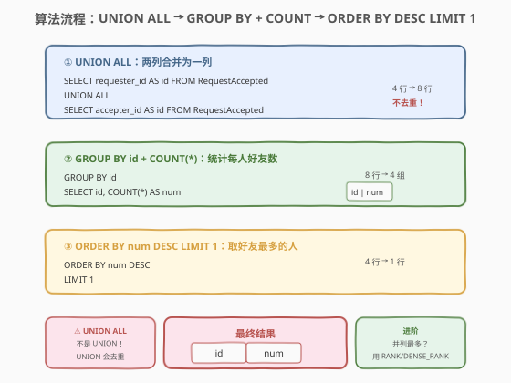
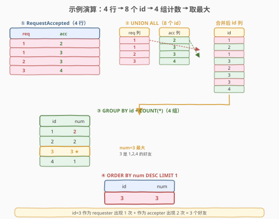

# 好友申请 II ：谁有最多的好友

- **题目名称**：好友申请 II ：谁有最多的好友
- **链接**：[602. 好友申请 II ：谁有最多的好友](https://leetcode.cn/problems/friend-requests-ii-who-has-the-most-friends/)
- **难度**：中等
- **标签**：SQL、UNION ALL、GROUP BY、聚合、ORDER BY、LIMIT

## 1. 题目概述

给定 `RequestAccepted` 表，每行记录一次被通过的好友申请：谁（`requester_id`）向谁（`accepter_id`）发送申请及通过日期。编写 SQL 查询，找出**拥有最多好友的人及其好友数目**。

**表结构**：

```text
Table: RequestAccepted
+--------------+---------+
| Column Name  | Type    |
+--------------+---------+
| requester_id | int     |  ← 主键之一
| accepter_id  | int     |  ← 主键之一
| accept_date  | date    |
+--------------+---------+
```

> 💡 **关键约束**：`(requester_id, accepter_id)` 是复合主键——同一对「申请者→接受者」不会有重复行。但注意 **`accepter_id` 和 `requester_id` 可能取值相同的人**——一个人既可以发起申请，也可以接受别人的申请，两种角色都产生好友关系。

**示例 1**：

```text
输入：
RequestAccepted 表:
+--------------+-------------+-------------+
| requester_id | accepter_id | accept_date |
+--------------+-------------+-------------+
| 1            | 2           | 2016/06/03  |
| 1            | 3           | 2016/06/08  |
| 2            | 3           | 2016/06/08  |
| 3            | 4           | 2016/06/09  |
+--------------+-------------+-------------+

输出：
+----+-----+
| id | num |
+----+-----+
| 3  | 3   |
+----+-----+
```

**解释**：

- 编号 3 是编号 1 的好友（1→3 那行，3 作为 accepter）
- 编号 3 是编号 2 的好友（2→3 那行，3 作为 accepter）
- 编号 3 是编号 4 的好友（3→4 那行，3 作为 requester）
- 所以编号 3 总共有 **3** 个好友，比其他人都多

**约束条件**：

- `RequestAccepted` 表的复合主键为 `(requester_id, accepter_id)`
- 测试用例保证拥有最多好友数目的只有 1 个人（无并列）
- 结果只需输出 `id` 和 `num` 两列

> 💡 **核心陷阱**：好友关系是**双向的**——一行 `(1, 2)` 表示 1 和 2 互为好友，1 的好友数 +1 **且** 2 的好友数也 +1。如果只数 `requester_id` 或只数 `accepter_id`，会漏掉一半的好友关系。这正是本题的考点：**用 `UNION ALL` 把两列合并成一列，让每个人无论以哪种角色出现都被计入**。

---

## 2. 解题思路

### 2.1 暴力思路：只数一列

最直觉（但错误）的做法是只对某一列做 `GROUP BY + COUNT`：

```sql
-- ❌ 错误：只数 requester_id
SELECT requester_id AS id, COUNT(*) AS num
FROM RequestAccepted
GROUP BY requester_id
ORDER BY num DESC LIMIT 1;
```

这会得到 id=1，num=2（1 作为 requester 出现两次）。但 id=3 实际有 3 个好友——3 作为 requester 只出现 1 次（3→4），作为 accepter 还出现 2 次（1→3、2→3）。只数一列完全忽略了 accepter 侧的好友关系。

> ⚠️ **根本错误**：好友数 = 该人作为 requester 出现次数 + 作为 accepter 出现次数。只数一列等于只统计了单向，必然遗漏。

### 2.2 核心观察：好友双向 → UNION ALL 两列合一



**问题本质**：每行 `(requester_id, accepter_id)` 贡献**两个**好友计数——`requester_id` 多一个好友，`accepter_id` 也多一个好友。要统计每个人的好友总数，就要把 `requester_id` 列和 `accepter_id` 列**合并成一列**，让每个人无论以哪种角色出现都产生一条记录，再按人分组计数。

**`UNION ALL` 的作用**：把两个 `SELECT` 的结果纵向拼接，不去重。`requester_id` 列 4 行 + `accepter_id` 列 4 行 = 合并后 8 行，每行一个 `id`。再 `GROUP BY id` + `COUNT(*)` 即得每人好友数。

$$\text{friends}(p) = \big|\{r \mid r.\text{requester\_id} = p\}\big| + \big|\{r \mid r.\text{accepter\_id} = p\}\big|$$

> 💡 **为什么用 `UNION ALL` 而非 `UNION`？** `UNION` 会对合并后的结果**去重**——如果同一个人在同一列出现多次（如 id=1 作为 requester 出现 2 次），`UNION` 只保留 1 行，好友数就错了。`UNION ALL` 保留所有行，每个出现都对应一个独立的好友关系，`COUNT(*)` 才能正确计数。这是本题最容易踩的坑。

### 2.3 算法流程图



| 步骤 | 子句 | 作用 |
|------|------|------|
| ① | `SELECT requester_id AS id ... UNION ALL SELECT accepter_id AS id ...` | 两列纵向合并为一列，不去重 |
| ② | `GROUP BY id` + `COUNT(*) AS num` | 按 id 分组，统计每人出现次数 = 好友数 |
| ③ | `ORDER BY num DESC LIMIT 1` | 按好友数降序取第 1 行 |

> 💡 **执行顺序回顾**：`FROM`（含子查询的 `UNION ALL`）→ `GROUP BY` → `COUNT(*)` 聚合 → `ORDER BY` → `LIMIT`。`ORDER BY` 和 `LIMIT` 在聚合之后，所以可以直接对聚合结果 `num` 排序。

### 2.4 示例演算

以示例数据为例，观察 4 行如何展开为 8 个 id，再聚合为 4 组计数：



| id | 作为 requester 出现 | 作为 accepter 出现 | 总次数（num） |
|----|---------------------|---------------------|---------------|
| 1 | 2 次（1→2, 1→3） | 0 次 | **2** |
| 2 | 1 次（2→3） | 1 次（1→2） | **2** |
| 3 | 1 次（3→4） | 2 次（1→3, 2→3） | **3** ★ |
| 4 | 0 次 | 1 次（3→4） | **1** |

> 💡 id=3 作为 requester 出现 1 次 + 作为 accepter 出现 2 次 = 3 个好友。`ORDER BY num DESC LIMIT 1` 取出 `(3, 3)` 即最终答案。注意 id=1 虽然作为 requester 最活跃（2 次），但它从未作为 accepter 出现，所以总好友数只有 2——不如 id=3 的 3 个。

---

## 3. 参考代码

### SQL（解法 A：UNION ALL + GROUP BY + LIMIT，推荐）

```sql
SELECT id, COUNT(*) AS num
FROM (
    SELECT requester_id AS id FROM RequestAccepted
    UNION ALL
    SELECT accepter_id AS id FROM RequestAccepted
) t
GROUP BY id
ORDER BY num DESC
LIMIT 1;
```

> 💡 **写法要点**：
> - 子查询用 `UNION ALL` 把 `requester_id` 和 `accepter_id` 两列纵向合并为单一 `id` 列，**不去重**——每个出现都代表一个独立的好友关系。
> - 外层 `GROUP BY id` + `COUNT(*)` 统计每个 id 在合并后列表中的出现次数，即好友总数。
> - `ORDER BY num DESC LIMIT 1` 取好友数最多的一行。
> - 题目保证无并列，故 `LIMIT 1` 安全；若有并列需取所有人，见第 5 节。

### SQL（解法 B：UNION ALL + 窗口函数 RANK）

```sql
SELECT id, num
FROM (
    SELECT id, COUNT(*) AS num,
           RANK() OVER (ORDER BY COUNT(*) DESC) AS rk
    FROM (
        SELECT requester_id AS id FROM RequestAccepted
        UNION ALL
        SELECT accepter_id AS id FROM RequestAccepted
    ) t
    GROUP BY id
) t2
WHERE rk = 1;
```

> 💡 **窗口函数写法**：`RANK() OVER (ORDER BY COUNT(*) DESC)` 给每个 id 按好友数降序排名，`rk = 1` 即好友最多。比解法 A 啰嗦，但**天然支持并列**——若多人好友数相同且最多，`RANK` 会把它们都标为 1，外层 `WHERE rk = 1` 全部输出，正好解决进阶问题。本题保证无并列时两者等价。

### Python（pandas）

```python
import pandas as pd

def most_friends(request_accepted: pd.DataFrame) -> pd.DataFrame:
    ids = pd.concat([
        request_accepted['requester_id'],
        request_accepted['accepter_id']
    ], ignore_index=True)
    counts = ids.value_counts().reset_index()
    counts.columns = ['id', 'num']
    return counts.head(1)
```

> 💡 **pandas 对照**：`pd.concat([...])` 对应 `UNION ALL`——把两列纵向拼接为一个 Series，不去重。`value_counts()` 对应 `GROUP BY id` + `COUNT(*)` + 隐含的 `ORDER BY num DESC`——按值分组计数并降序排列。`.head(1)` 对应 `LIMIT 1`。`reset_index()` 把分组键从索引变回普通列，对应 `SELECT id, num`。

---

## 4. 复杂度分析

| 维度 | 复杂度 | 说明 |
|------|--------|------|
| **时间（UNION ALL + GROUP BY）** | $O(n \log n)$ | $n$ = `RequestAccepted` 行数。`UNION ALL` 纵向拼接 $2n$ 行为 $O(n)$；`GROUP BY id` 需排序或哈希分组 $O(n \log n)$（或哈希 $O(n)$）；`ORDER BY num DESC` 对 $k$ 个分组排序 $O(k \log k)$（$k \le 2n$），总计 $O(n \log n)$ |
| **时间（窗口函数）** | $O(n \log n)$ | 分组 + 窗口排序均为 $O(n \log n)$，与解法 A 同阶，常数因子略大 |
| **空间** | $O(n)$ | `UNION ALL` 中间结果 $2n$ 行；分组哈希表/排序缓冲 $O(n)$ |
| **结果行数** | $O(1)$ | `LIMIT 1` 只输出 1 行 |

> ⚠️ `UNION ALL` 不去重，中间结果为 $2n$ 行，空间 $O(n)$。若误用 `UNION`（去重），会多一次排序去重 $O(n \log n)$，且结果错误。面试中说明「`UNION ALL` 拼接不去重 $O(n)$，`GROUP BY` 分组 $O(n \log n)$，主键索引可加速分组」即可。

---

## 5. 扩展

### 5.1 进阶：并列最多时找出所有人

题目保证「最多好友数只有 1 人」，但真实世界可能并列。用 `RANK()` 或 `DENSE_RANK()` 替代 `LIMIT 1`：

```sql
-- 用 RANK：好友数并列最多的所有人
SELECT id, num
FROM (
    SELECT id, COUNT(*) AS num,
           RANK() OVER (ORDER BY COUNT(*) DESC) AS rk
    FROM (
        SELECT requester_id AS id FROM RequestAccepted
        UNION ALL
        SELECT accepter_id AS id FROM RequestAccepted
    ) t
    GROUP BY id
) t2
WHERE rk = 1;
```

> 💡 `RANK()` 和 `DENSE_RANK()` 在取 `rk = 1` 时行为相同——都把最大值所在行标为 1。区别只在后续排名：`RANK` 会跳号（两个并列第 1 后下一个是第 3），`DENSE_RANK` 不跳（下一个是第 2）。本题只取 `rk = 1`，两者等价。

### 5.2 UNION vs UNION ALL：去不去重

| 操作 | 去重 | 中间结果行数 | 本题是否适用 |
|------|------|-------------|-------------|
| `UNION ALL` | 不去重 | $2n$ | ✅ 正确 |
| `UNION` | 去重（隐含 `DISTINCT`） | $\le 2n$ | ❌ 错误 |

> ⚠️ `UNION` 会对合并结果做 `DISTINCT`——如果 id=1 作为 requester 出现 2 次，`UNION` 只保留 1 行，`COUNT(*)` 得 1 而非 2，好友数算少了。**凡是需要保留重复行计数的场景，必须用 `UNION ALL`**。记住口诀：**`UNION ALL` 拼接计数，`UNION` 去重归集**。

### 5.3 好友关系表的设计：为什么两列合一有效

`RequestAccepted` 表的每行 `(A, B)` 表示一条**有向**记录（A 向 B 申请），但好友关系是**无向**的——A 是 B 的好友 等价于 B 是 A 的好友。把 `requester_id` 和 `accepter_id` 两列 `UNION ALL` 合并，本质是把「有向边列表」转换为「无向图的顶点度数列表」——每个顶点（人）的度数（好友数）= 它在所有边的两端出现的总次数。

$$\text{degree}(v) = \big|\{e \mid e.\text{src} = v\}\big| + \big|\{e \mid e.\text{dst} = v\}\big|$$

> 💡 这是图论中「无向图顶点度数」的 SQL 表达。若题目改为「有向关注关系」（A 关注 B 不代表 B 关注 A），则只需数一列，不需要 `UNION ALL`。区分「无向好友」与「有向关注」是本题的核心判断。

---

## 6. 面试要点

1. **为什么不能只 `GROUP BY requester_id` 或只 `GROUP BY accepter_id`？**

   - 好友关系是双向的——一行 `(1, 2)` 让 1 和 2 **各**多一个好友。只数 `requester_id` 只统计了「发起侧」的好友，忽略了「接受侧」——id=3 作为 accepter 出现 2 次，这些好友关系在只数 requester_id 时完全消失。正确做法是 `UNION ALL` 两列合一，让每个人在两种角色下的出现都被计入。

2. **为什么用 `UNION ALL` 而不是 `UNION`？**

   - `UNION` 会对合并结果做 `DISTINCT` 去重——如果同一个人在同一列出现多次（如 id=1 作为 requester 出现 2 次），`UNION` 只保留 1 行，`COUNT(*)` 得 1 而非 2，好友数算少。`UNION ALL` 保留所有行，每个出现对应一个独立好友关系，`COUNT(*)` 才正确。**需要计数就 `UNION ALL`，需要去重归集才 `UNION`**。

3. **`ORDER BY num DESC LIMIT 1` 在有并列时会有什么问题？**

   - `LIMIT 1` 只取一行，若有两人好友数相同且最多，会随机返回其中一个（取决于数据库内部排序稳定性）。题目保证无并列所以安全，但真实场景需用 `RANK() OVER (ORDER BY COUNT(*) DESC) WHERE rk = 1` 或子查询 `HAVING num = (SELECT MAX(num) ...)` 取所有并列最多的人。

4. **子查询里的 `UNION ALL` 和外层 `GROUP BY` 的执行顺序是什么？**

   - 先执行子查询的 `UNION ALL`（把两列拼接为 $2n$ 行的 `id` 列），再对外层做 `GROUP BY id` + `COUNT(*)` 聚合，最后 `ORDER BY num DESC` + `LIMIT 1`。`UNION ALL` 是子查询的一部分，在 `FROM` 阶段完成，先于 `GROUP BY`。

5. **复合主键 `(requester_id, accepter_id)` 对本题有什么影响？**

   - 它保证同一对「申请者→接受者」不会重复出现，所以 `UNION ALL` 后每个 id 的出现次数 = 其真实好友数，不会因重复行而虚高。但主键不阻止「A→B」和「B→A」同时存在（互发申请），此时 A 和 B 各自的好友数都 +2（作为 requester 1 次 + 作为 accepter 1 次），这是正确的——因为两条不同的好友关系都成立。

> 💡 **一句话总结**：602 教的是「双向关系统计」——用 `UNION ALL` 把关系表的两端列合并为一列，再 `GROUP BY + COUNT` 即得每人的关系数。核心口诀：**无向关系数两端，`UNION ALL` 不去重；有向关系数一端，直接分组即可**。

---

## 7. 同类练习题

- [586. 订单最多的客户](https://leetcode.cn/problems/customer-placing-the-largest-number-of-orders/)：同套路——`GROUP BY + COUNT + ORDER BY DESC LIMIT 1` 取计数最大者，但只需数一列（单向关系），无 `UNION ALL`
- [511. 游戏玩法分析 I](../0501-0600/511_游戏玩法分析I.md)：前置母题——`GROUP BY + MIN` 分组取最值，SQL 聚合的最简形态，对比 602 理解「何时需 `UNION ALL` 合并多列」
- [512. 游戏玩法分析 II](../0501-0600/512_游戏玩法分析II.md)：聚合进阶——`GROUP BY + MIN` 后需 JOIN 回原表取最值所在行的其他列，对比 602 的「先合并再分组」范式
- [184. 部门工资最高的员工](../0101-0200/184_部门工资最高的员工.md)：同套路——`GROUP BY + MAX` 求最高工资，再 JOIN 回原表取员工姓名，经典「分组取最值」变体
- [185. 部门工资前三高的所有员工](../0101-0200/185_部门工资前三高的所有员工.md)：窗口函数进阶——`DENSE_RANK OVER (PARTITION BY ... ORDER BY ...)` 取组内 Top-N，与 602 进阶版用 `RANK` 取并列最大同属「窗口函数定位行」范式
