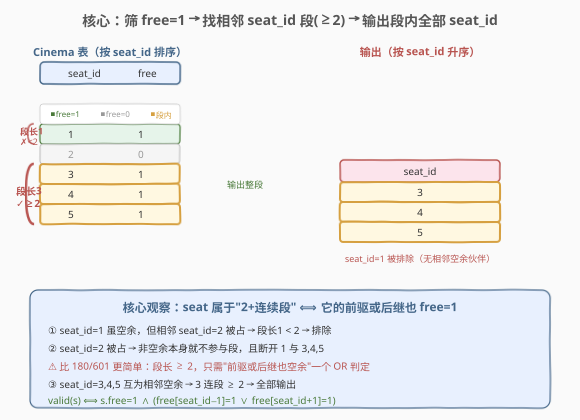
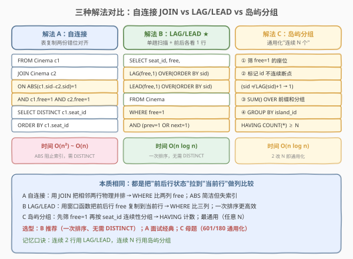
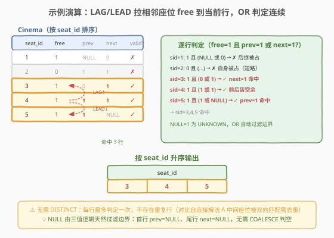

# LeetCode 连续空余座位 题解

## 1. 题目概述

- **标题 / 题号**：连续空余座位（#603，easy）
- **链接**：https://leetcode.cn/problems/consecutive-available-seats/
- **难度**：简单
- **标签**：SQL、自连接、窗口函数、LAG、LEAD、连续性问题

**题意**：给定 `Cinema` 表，每行记录一个座位的占用情况：座位号 `seat_id` 与空闲标志 `free`（`1` 表示空余，`0` 表示被占）。编写 SQL 查询，找出**所有连续空余的座位号**，按 `seat_id` 升序返回。

**表结构**：

```text
Table: Cinema
+-------------+------+
| Column Name | Type |
+-------------+------+
| seat_id     | int  |  ← 自增主键
| free        | bool |  ← 1=空余，0=占用
+-------------+------+
```

> 💡 **关键约束**：`seat_id` 是自增主键，"连续"指的是 `seat_id` 差 1（座位号相邻）。注意"连续空余"至少需要**两个**相邻座位都 `free=1`——孤立的空余座位（左右都被占）不计入结果。

**示例 1**：

```text
输入：
Cinema 表:
+---------+------+
| seat_id | free |
+---------+------+
| 1       | 1    |
| 2       | 0    |
| 3       | 1    |
| 4       | 1    |
| 5       | 1    |
+---------+------+

输出：
+---------+
| seat_id |
+---------+
| 3       |
| 4       |
| 5       |
+---------+
```

**解释**：

- `seat_id = 1` 虽空余，但相邻座位 2 被占 → 不连续 → 排除
- `seat_id = 2` 被占 → 不空余 → 排除
- `seat_id = 3, 4, 5` 都空余且相邻 → 3 连段 → 全部输出

**约束**：

- `seat_id` 是 `Cinema` 表的自增主键
- `free` 为布尔类型（`1`/`0`）
- "连续空余"指至少两个相邻 `seat_id` 的 `free` 都为 `1`
- 结果按 `seat_id` 升序排列

> 💡 本题是 [180. 连续出现的数字](../0101-0200/180_连续出现的数字.md) 的**简化版**：180 要求"连续三行"，603 只需"连续两行"；180 比较 `num` 值是否相等，603 比较 `free` 是否同为 `1`。本质都是"跨行连续关系转同行多列比较"的 SQL 套路。同区间 601 是 180 的 Hard 升级版（段长 ≥ 3 + 输出整段完整行），603 则是 Easy 入门版（段长 ≥ 2 + 只输出 `seat_id`）。

## 2. 解题思路

### 2.1 暴力思路：游标逐行扫描

最直觉的做法是按 `seat_id` 排序后逐行扫描，维护"当前连续空余段"：若 `free=1` 则继续，否则断开；当段长 ≥ 2 时把段内所有 `seat_id` 加入结果。这在过程式语言中很自然，但**纯 SQL 没有循环语句**——需把"行间相邻关系"转为"列间关系"或"集合操作"。

> ⚠️ "连续两行"是 SQL 连续性问题中最简单的形态。关键判断简化为：**当前行 `free=1` 且（前一行 `free=1` 或 后一行 `free=1`）**。比 180 的"连续三行"少一个条件，比 601 的"段长 ≥ 3"更宽松。

### 2.2 核心观察：seat 属于"2+连续段" ⟺ 它的前驱或后继也空余



**关键洞察**：一个 `free=1` 的座位属于某个长度 ≥ 2 的连续空余段，当且仅当它的**前一个 `seat_id` 或后一个 `seat_id` 也 `free=1`**（即 `seat_id ± 1`）。换言之：

$$\text{valid}(s) \iff s.\text{free} = 1 \land \big(\text{free}[s.\text{seat\_id}-1] = 1 \lor \text{free}[s.\text{seat\_id}+1] = 1\big)$$

把"前一个/后一个座位的状态"通过**自连接**（`ON ABS(c1.seat_id - c2.seat_id) = 1`）或**窗口函数**（`LAG(free, 1)` / `LEAD(free, 1)`）拉到当前行，即可用单行条件判定。

> 💡 **为什么"2+"比"3+"简单**：601/180 的"3+"连续需要"我 + 前 2 行"或"我 + 后 2 行"或"我 + 前后各 1 行"三种 `OR` 分支覆盖段内位置。603 的"2+"只需"我的前驱 `free=1`"或"我的后继 `free=1`"两种分支——任一成立即说明当前座位有相邻空余伙伴。

### 2.3 三种解法流程对比



**解法 A（经典）：自连接 JOIN**——表复制两份按 `seat_id` 差 1 对齐：

- `FROM Cinema c1 JOIN Cinema c2 ON ABS(c1.seat_id - c2.seat_id) = 1 AND c1.free = 1 AND c2.free = 1`
- `SELECT DISTINCT c1.seat_id`

**解法 B（推荐）：窗口函数 `LAG`/`LEAD`**——单趟扫描，把相邻座位的 `free` 拉到当前行：

- `LAG(free, 1) OVER (ORDER BY seat_id)` / `LEAD(free, 1) OVER (ORDER BY seat_id)`
- 外层 `WHERE free = 1 AND (prev_free = 1 OR next_free = 1)`

**解法 C（通用）：岛屿分组**——适用于"连续 N 个空余"的通用化场景：

- 先筛 `free=1`，标记 `seat_id` 不连续的断点，前缀和生成 `island_id`
- `HAVING COUNT(*) >= 2` 取合格岛

> ⚠️ **解法 A 的 `ABS(c1.seat_id - c2.seat_id) = 1`**：用 `ABS` 同时覆盖"前驱"和"后继"——`c2` 既可以是 `c1` 的前一个（差 −1）也可以是后一个（差 +1）。比写两次 `OR`（`c2.seat_id = c1.seat_id + 1 OR c2.seat_id = c1.seat_id - 1`）简洁。但 `ABS` 阻止索引范围扫描，大数据量时解法 B 更优。

### 2.4 示例演算

以示例数据为例，用解法 B（LAG/LEAD）逐行演算：



| seat_id | free | prev_free (LAG) | next_free (LEAD) | free=1 且 (prev=1 或 next=1)? |
|---------|------|-----------------|------------------|------------------------------|
| 1 | 1 | NULL | 0 | ✗（后继被占，无前驱） |
| 2 | 0 | 1 | 1 | ✗（自身被占） |
| 3 | 1 | 0 | 1 | ✓ **命中**（后继空余） |
| 4 | 1 | 1 | 1 | ✓ **命中**（前后皆空余） |
| 5 | 1 | 1 | NULL | ✓ **命中**（前驱空余） |

仅 `seat_id = 3, 4, 5` 命中，按 `seat_id` 升序输出即 `[3, 4, 5]`。

> 💡 **边界由 NULL 天然过滤**：`seat_id = 1` 的 `prev_free` 为 `NULL`，`NULL = 1` 为 `UNKNOWN`，`WHERE` 只保留 `TRUE`——首个座位若后继不空余则自动排除，无需额外判空。`seat_id = 5` 的 `next_free` 为 `NULL`，但 `prev_free = 1` 命中 `OR` 分支，仍输出。

## 3. 参考代码

### SQL（解法 A：自连接 + ABS，经典）

```sql
SELECT DISTINCT c1.seat_id
FROM Cinema c1
JOIN Cinema c2
  ON ABS(c1.seat_id - c2.seat_id) = 1
  AND c1.free = 1
  AND c2.free = 1
ORDER BY c1.seat_id;
```

> 💡 **写法要点**：
> - `ABS(c1.seat_id - c2.seat_id) = 1` 把"相邻座位"语义化表达——`c2` 既可前可后，一次 JOIN 覆盖两种相邻方向。
> - `c1.free = 1 AND c2.free = 1` 保证两个相邻座位都空余——这是"连续空余"的核心条件。
> - `DISTINCT` 去重：解法 A 会让处于连续段中间的座位被匹配两次（如 `seat_id=4` 既匹配 `seat_id=3` 又匹配 `seat_id=5`），需去重。
> - `ORDER BY c1.seat_id` 满足题目排序要求。

### SQL（解法 B：LAG/LEAD 窗口函数，推荐）

```sql
SELECT seat_id
FROM (
    SELECT seat_id, free,
           LAG(free, 1) OVER (ORDER BY seat_id) AS prev_free,
           LEAD(free, 1) OVER (ORDER BY seat_id) AS next_free
    FROM Cinema
) t
WHERE free = 1
  AND (prev_free = 1 OR next_free = 1)
ORDER BY seat_id;
```

> 💡 **写法要点**：
> - 子查询用 `LAG(free, 1)` / `LEAD(free, 1)` 把前一个/后一个座位的 `free` 拉到当前行——一次排序，单趟赋值。
> - 外层 `WHERE free = 1 AND (prev_free = 1 OR next_free = 1)` 即"我空余且至少一个相邻座位也空余"。
> - `OVER (ORDER BY seat_id)` 定义窗口按 `seat_id` 排序——这是"相邻"的依据，不可省。
> - 一次排序 + 单趟扫描，无 JOIN，通常比解法 A 更高效。无需 `DISTINCT`——每行最多匹配一次。
> - 边界 `NULL` 由三值逻辑天然过滤，无需 `COALESCE`。

### SQL（解法 C：岛屿分组，通用化"连续 N 个空余"）

```sql
WITH free_seats AS (
    SELECT seat_id
    FROM Cinema
    WHERE free = 1
),
marked AS (
    SELECT seat_id,
           CASE WHEN seat_id = LAG(seat_id) OVER (ORDER BY seat_id) + 1
                THEN 0 ELSE 1 END AS is_new_island
    FROM free_seats
),
grouped AS (
    SELECT seat_id,
           SUM(is_new_island) OVER (ORDER BY seat_id) AS island_id
    FROM marked
)
SELECT seat_id
FROM grouped
WHERE island_id IN (
    SELECT island_id FROM grouped GROUP BY island_id HAVING COUNT(*) >= 2
)
ORDER BY seat_id;
```

> 💡 **写法要点**（三层 CTE 逐层推进）：
> - **`free_seats`**：先筛 `free=1` 的座位——只有空余座位参与连续段。
> - **`marked`**：`seat_id = LAG(seat_id) + 1` 说明与前一座位号连续 → `0`（同岛）；否则 `1`（新岛起点）。
> - **`grouped`**：`SUM(is_new_island) OVER (ORDER BY seat_id)` 前缀和生成 `island_id`——同岛座位号相同。
> - **外层**：`HAVING COUNT(*) >= 2` 只保留岛内至少 2 座位的岛。
> - 把 `2` 改成任意 N 即可解"连续 N 个空余座位"，是处理"连续 N 次满足条件"的通用范式（承接 601 的岛屿法）。

### Python（pandas）

```python
import pandas as pd

def consecutive_available_seats(cinema: pd.DataFrame) -> pd.DataFrame:
    df = cinema.sort_values('seat_id')
    prev_free = df['free'].shift(1)
    next_free = df['free'].shift(-1)
    mask = (df['free'] == 1) & ((prev_free == 1) | (next_free == 1))
    return df.loc[mask, ['seat_id']].sort_values('seat_id')
```

> 💡 **pandas 对照**：`shift(1)` / `shift(-1)` 等价于 SQL 的 `LAG(free, 1)` / `LEAD(free, 1)`——前者向后平移取上一行，后者向前平移取下一行。`mask` 用 `&` 合并"自身空余"与"相邻任一空余"，对应 SQL 的 `WHERE` 子句。无需 `DISTINCT`——每行最多判定一次。

## 4. 复杂度分析

| 维度 | 复杂度 | 说明 |
|------|--------|------|
| **时间（解法 A 自连接）** | $O(n^2)$ ~ $O(n)$ | $n$ = `Cinema` 行数。最坏两表 JOIN 为 $O(n^2)$；`seat_id` 有主键索引时优化器可降为接近 $O(n)$ 的索引扫描。`ABS` 阻止范围扫描，常数因子偏大 |
| **时间（解法 B LAG/LEAD）** | $O(n \log n)$ | `LAG/LEAD OVER (ORDER BY seat_id)` 需全表按 `seat_id` 排序 $O(n \log n)$，排序后单趟扫描赋值 $O(n)$。`seat_id` 有聚簇索引可免排序降为 $O(n)$ |
| **时间（解法 C 岛屿分组）** | $O(n \log n)$ | 两次窗口排序各 $O(n \log n)$，`GROUP BY` 排序 $O(n \log n)$。筛后行数 $n'$ 通常 $< n$ |
| **空间** | $O(n)$ | 窗口函数排序缓冲 / JOIN 中间结果 / CTE 物化 |
| **结果行数** | $O(n)$ | 最坏全部座位都空余且连续 |

> ⚠️ 解法 A 的 `ABS(c1.seat_id - c2.seat_id) = 1` 让优化器难以走索引范围扫描（需双向探查），大数据量时退化为 $O(n^2)$。可拆为 `c2.seat_id = c1.seat_id + 1 OR c2.seat_id = c1.seat_id - 1` 启用索引。面试中说明"自连接 `ABS` 简洁但失索引、`LAG/LEAD` 一次排序更优"即可。

## 5. 扩展

### 5.1 自连接的两种写法：ABS vs 双向 OR

解法 A 用 `ABS(c1.seat_id - c2.seat_id) = 1` 简洁地覆盖双向相邻。但 `ABS` 函数让 `seat_id` 失去索引可用的有序性，优化器只能选 Nested Loop。拆为显式 `OR` 可启用索引：

```sql
SELECT DISTINCT c1.seat_id
FROM Cinema c1
JOIN Cinema c2
  ON c1.free = 1 AND c2.free = 1
  AND (c2.seat_id = c1.seat_id + 1 OR c2.seat_id = c1.seat_id - 1)
ORDER BY c1.seat_id;
```

> 💡 `c2.seat_id = c1.seat_id + 1` 与 `c2.seat_id = c1.seat_id - 1` 都是等值条件，可命中 `seat_id` 的主键索引做双向范围探查。写法啰嗦但性能更优。生产环境优先此写法；面试中提及 `ABS` 与 `OR` 的索引差异为加分项。

### 5.2 "连续 N 个空余"的通用化

把"连续 2 个"推广到"连续 N 个空余"，解法 C（岛屿分组）最优雅——`HAVING COUNT(*) >= N` 一处改 N 即可。解法 A 推广到 N 需 N 个自连接副本；解法 B 需 N−1 个 `LAG` + N−1 个 `LEAD` + 复杂的 `OR` 分支。**岛屿分组法是"连续 N 次"的通用母题**——详见 [601. 体育馆的人流量](601_体育馆的人流量.md) 第 5.3 节与 [180. 连续出现的数字](../0101-0200/180_连续出现的数字.md) 第 5.2 节。

### 5.3 与 180 / 601 的难度梯度

| 题号 | 段长要求 | 输出语义 | 难度 |
|------|---------|----------|------|
| **603** | ≥ 2 | 段内所有 `seat_id` | 简单 |
| **180** | ≥ 3 | 去重后的 `num` 值 | 中等 |
| **601** | ≥ 3 | 段内全部完整行（含其他列） | 困难 |

> 💡 三题同源——"跨行连续关系转同行多列比较"。603 是入门（段长 2、输出单列），180 是进阶（段长 3、输出去重值），601 是综合（段长 3、输出整段完整行）。掌握 603 的 `LAG/LEAD` 套路后，180 只需多加一个 `LAG(free, 2)`，601 再加阈值过滤与整段输出语义。

## 6. 面试要点

1. **"连续空余"为什么至少需要两个座位？**

   - 题目定义"consecutive available seats"为多个相邻空余座位。单个空余座位（左右都被占）不构成"连续"，故需段长 ≥ 2。判断条件简化为"我空余且前驱或后继也空余"。

2. **解法 A 的 `ABS` 与解法 B 的 `LAG/LEAD` 各有什么优劣？**

   - 解法 A 用 `ABS(c1.seat_id - c2.seat_id) = 1` 简洁覆盖双向相邻，但 `ABS` 函数阻止索引范围扫描，大数据量退化为 $O(n^2)$。解法 B 用 `LAG/LEAD` 一次排序 + 单趟扫描，$O(n \log n)$，且 `seat_id` 有聚簇索引时可免排序降为 $O(n)$。**生产环境优先解法 B**。

3. **为什么解法 A 需要 `DISTINCT` 而解法 B 不需要？**

   - 解法 A 的 JOIN 会让处于连续段中间的座位被前后两个邻居各匹配一次（如 `seat_id=4` 同时匹配 `3` 和 `5`），产生重复行，需 `DISTINCT` 去重。解法 B 是逐行扫描，每行最多输出一次，无重复。

4. **`LAG`/`LEAD` 在首尾行产生 `NULL`，怎么处理？**

   - SQL 三值逻辑中 `NULL = 1` 为 `UNKNOWN`，`WHERE` 只保留 `TRUE`，`UNKNOWN` 自动过滤。首行 `prev_free = NULL` 使"前驱空余"分支失效，但若后继空余仍可命中 `OR` 的另一分支；若后继也不空余，则首个座位正确被排除。无需 `COALESCE` 或 `IS NOT NULL` 额外处理——这是窗口函数比自连接更简洁的原因之一。

5. **`free` 是布尔类型，`free = 1` 和 `free = TRUE` 等价吗？**

   - LeetCode 的 SQL 测试环境中 `free` 实际存储为整数 `1`/`0`，故 `free = 1` 是最通用的写法。MySQL 的 `BOOL` 类型本质是 `TINYINT(1)`，`TRUE`/`FALSE` 是 `1`/`0` 的别名，故两种写法等价。其他数据库（如 PostgreSQL 的真正 `BOOLEAN` 类型）`free = TRUE` 更地道。面试中说明"`free` 在 LeetCode 环境是 `TINYINT`，写 `= 1` 最稳妥"即可。

> 💡 **一句话总结**：603 是 SQL"连续性问题"的**入门母题**——段长 2、输出单列，把 180/601 的复杂度剥到最小，专注于"自连接 vs 窗口函数"两种范式的核心对比。记住"我空余且前驱或后继也空余"这个等价判定，所有"连续两行满足条件"类 SQL 题都能套用。

## 同类练习题

| # | 题目 | 与本题的关联 |
|---|------|-------------|
| 180 | [连续出现的数字](../0101-0200/180_连续出现的数字.md) | SQL 自连接 + 窗口函数母题，603 的直接进阶——"连续三行 num 相同"在 603 的"连续两行 free=1"基础上多加一个 `LAG(num, 2)` 即可 |
| 601 | [体育馆的人流量](601_体育馆的人流量.md) | SQL 连续性问题的 Hard 版——段长 ≥ 3 + 阈值过滤 + 输出整段完整行，603 学会 `LAG/LEAD` 套路后即可挑战 |
| 197 | [上升的温度](https://leetcode.cn/problems/rising-temperature/) | SQL `DATEDIFF` + 自连接，"相邻日期"的行间比较，是 603"相邻 seat_id"的日期变体 |
| 196 | [删除重复的电子邮箱](https://leetcode.cn/problems/delete-duplicate-emails/) | SQL 自连接 DELETE，同一张表 JOIN 自身做行间比较，承接 603 的自连接思路（DELETE 场景） |
| 1173 | [即时食物配送 I](https://leetcode.cn/problems/immediate-food-delivery-i/) | SQL 条件聚合入门，与 603 共同构成 SQL Easy 题矩阵，对比"行间比较"与"组内聚合"两种 SQL 思维 |
