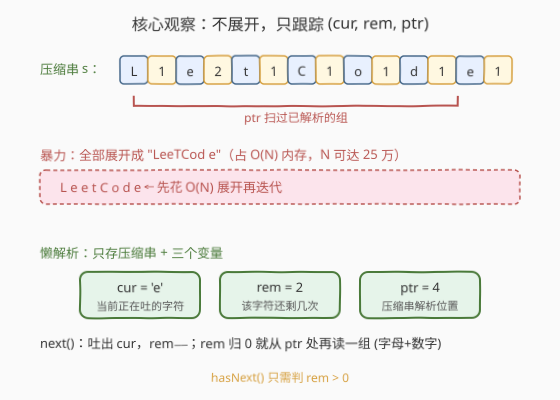
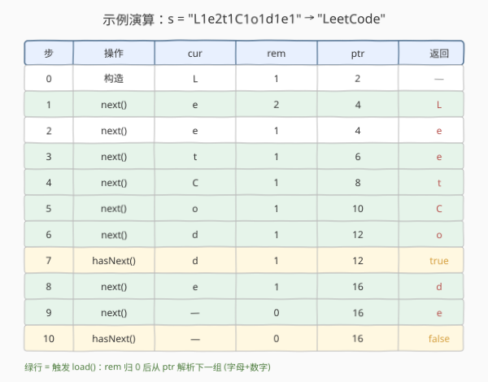

# LeetCode 迭代压缩字符串 题解

## 1. 题目概述

- **标题 / 题号**：迭代压缩字符串（#604，easy）
- **链接**：https://leetcode.cn/problems/design-compressed-string-iterator/
- **难度**：简单
- **标签**：设计、字符串、迭代器、指针

**题意**：设计一个**压缩字符串迭代器**。压缩串的形式为「字母 + 正整数」交替拼接，例如 `L1e2t1C1o1d1e1` 表示字母 `L` 出现 1 次、`e` 出现 2 次、`t` 出现 1 次……展开后即 `LeetCode`。要求实现：

- `StringIterator(compressedString)`：用压缩串初始化迭代器。
- `next()`：返回未展开串里的**下一个字符**；若已耗尽，返回 `' '`（空格）。
- `hasNext()`：若仍有未遍历字符返回 `true`，否则 `false`。

**示例 1**：

```text
输入：
  StringIterator it = new StringIterator("L1e2t1C1o1d1e1");
  it.next();      // 返回 'L'
  it.next();      // 返回 'e'
  it.next();      // 返回 'e'
  it.next();      // 返回 't'
  it.next();      // 返回 'C'
  it.next();      // 返回 'o'
  it.hasNext();   // 返回 true
  it.next();      // 返回 'd'
  it.next();      // 返回 'e'
  it.hasNext();   // 返回 false
```

**示例 2**（多位数字计数）：

```text
输入：
  StringIterator it = new StringIterator("a123b2");
  it.next();      // 返回 'a'   （'a' 还剩 122 次）
  ...
  // 'a' 连续返回 123 次后，再返回 'b'、'b'，随后 hasNext 为 false
```

**约束**：

- `1 <= compressedString.length <= 1000`
- 压缩串仅含大小写字母与数字，格式为「字母 + 正整数」严格交替
- 数字表示的次数在 `1` 到 `500` 之间（最多三位数）
- `next` / `hasNext` 的总调用次数不超过 `1000`

> 💡 注意次数可能是**多位数**（如 `a123`），解析数字时必须连续读取所有数字位再累乘，不能只取一位。这是本题最容易踩的坑。

## 2. 解题思路

### 2.1 暴力思路：构造时全部展开

最直觉的做法：在构造函数里把压缩串**完全展开**成一个普通字符串 `expanded`，再用一个下标 `pos` 顺序遍历即可。`next` 返回 `expanded[pos++]`，`hasNext` 判 `pos < expanded.size()`。

> ⚠️ 问题在于**空间**：单个字母的次数最大 $500$，压缩串最长 $1000$（约 $500$ 组），展开后长度可达 $\frac{1000}{2} \times 500 \approx 2.5 \times 10^5$。虽然本题数据量下能过，但若调用方只取前几个字符就停止，展开的绝大部分内存都被浪费——这是**惰性求值**（lazy evaluation）缺席的典型代价。面试官通常会追问"能否不展开"。

### 2.2 核心观察：懒解析——只跟踪 (cur, rem, ptr)

关键洞察：**迭代器本质上是按需产出的**。`next()` 每次只吐一个字符，我们完全没必要预先展开整个串，只需记住「当前正在吐哪个字符、还剩几个、压缩串解析到哪了」三个状态量即可。



三个状态变量分工：

- **`cur`**：当前正在产出的字符。
- **`rem`**：`cur` 还要重复输出几次。
- **`ptr`**：压缩串 `s` 的解析游标，指向下一个待读位置。

配合一个私有方法 `load()`：从 `ptr` 处读一个字母赋给 `cur`，随后**连续读取所有数字位**累乘得到 `rem`，`ptr` 前移到下一组起点。

> 💡 **懒加载时机**：在 `next()` 里，当 `rem` 减到 `0` 且 `ptr` 还没到串尾时，立即调用 `load()` 把下一组载入。这样 `hasNext()` 只需判 `rem > 0`——因为只要还有数据，`rem` 就一定 $>0$（次数至少为 $1$）；只有真正耗尽时 `rem` 才为 $0$。把"载入下一组"的责任放在 `next()` 而非 `hasNext()`，让 `hasNext()` 保持 $O(1)$ 且极简。

### 2.3 算法流程图


```
load():                                  # 从 ptr 解析一组
    cur = s[ptr++]                       # 读字母
    num = 0
    while ptr < len(s) and s[ptr] 是数字:
        num = num * 10 + (s[ptr] - '0')
        ptr += 1
    rem = num

next():
    if rem == 0: return ' '              # 已耗尽
    c = cur
    rem -= 1
    if rem == 0 and ptr < len(s):
        load()                           # 懒加载下一组
    return c

hasNext():
    return rem > 0
```

**关键不变量**：只要原始串未耗尽，`rem` 必 $>0$。因为 `next()` 在 `rem` 归零时立即 `load()`，而 `load()` 读到的次数 $\geq 1$。故 `hasNext()` 的 `rem > 0` 与"还有未遍历字符"等价。

### 2.4 示例演算

以 `s = "L1e2t1C1o1d1e1"`（展开为 `LeetCode`）为例，逐步追踪 `(cur, rem, ptr)` 状态：



绿色行表示该步触发了 `load()`：注意第 1、3、4、5、6、8 步，`rem` 减到 `0` 后立即从 `ptr` 处载入下一组，`ptr` 相应前移。最后第 9 步返回 `'e'` 后 `rem=0` 且 `ptr` 已到串尾（`16`），不再 `load()`，`hasNext()` 返回 `false`。输出序列 `L, e, e, t, C, o, d, e` 与展开串完全一致。

> 💡 观察第 1 步：返回 `'L'` 的同时就把 `'e2'` 载入了。这是"边吐边读"的精髓——`next()` 的代价始终是 $O(\text{数字位数})$，而每个字符只参与一次产出，整体摊还 $O(1)$。

## 3. 参考代码

### C++

```cpp
class StringIterator {
    string s;
    int ptr;
    char cur;
    long rem;

    void load() {
        cur = s[ptr++];                       // 读字母
        long num = 0;
        while (ptr < (int)s.size() && isdigit((unsigned char)s[ptr]))
            num = num * 10 + (s[ptr++] - '0'); // 连续读多位数字
        rem = num;
    }

  public:
    StringIterator(string compressedString)
        : s(move(compressedString)), ptr(0), rem(0) {
        if (!s.empty()) load();               // 构造时载入首组
    }

    char next() {
        if (rem == 0) return ' ';             // 已耗尽
        char c = cur;
        if (--rem == 0 && ptr < (int)s.size())
            load();                           // 懒加载下一组
        return c;
    }

    bool hasNext() { return rem > 0; }
};
```

### Python

```python
class StringIterator:
    def __init__(self, compressedString: str):
        self.s = compressedString
        self.ptr = 0
        self.n = len(self.s)
        self.cur = ''
        self.rem = 0
        if self.s:
            self._load()

    def _load(self) -> None:
        self.cur = self.s[self.ptr]
        self.ptr += 1
        num = 0
        while self.ptr < self.n and self.s[self.ptr].isdigit():
            num = num * 10 + int(self.s[self.ptr])
            self.ptr += 1
        self.rem = num

    def next(self) -> str:
        if self.rem == 0:
            return ' '
        c = self.cur
        self.rem -= 1
        if self.rem == 0 and self.ptr < self.n:
            self._load()
        return c

    def hasNext(self) -> bool:
        return self.rem > 0
```

> 💡 两处细节：①`isdigit` 判断前对 C++ 字符转 `unsigned char` 防负值越界；②`rem` 用 `long` 仅为防御性写法（本题 $\leq 500$，`int` 足够）。`load()` 在构造时调一次、之后只在 `rem` 归零时调，逻辑统一。

## 4. 复杂度分析

| 维度 | 复杂度 | 说明 |
|------|--------|------|
| **构造时间** | $O(\text{首组数字位数})$ | 仅 `load()` 一次，最坏 $O(3)$ |
| **单次 next（摊还）** | $O(1)$ | 大多数调用只做 `rem--`；偶发 `load()` 读 $\leq 3$ 位数字，摊到每个字符仍 $O(1)$ |
| **单次 hasNext** | $O(1)$ | 仅判 `rem > 0` |
| **空间** | $O(L)$ | $L$ 为压缩串长度（$\leq 1000$），只存压缩串本身，**不展开**；额外状态量 $O(1)$ |

> ⚠️ 与暴力展开法对比：暴力法空间 $O(N)$，$N$ 为展开后长度（可达 $2.5\times10^5$）；懒解析法空间 $O(L) \approx O(\sqrt{N})$ 量级，且与"实际取多少字符"无关。这是**惰性求值**在空间上的本质优势。

## 5. 扩展：生成器 / 流式视角

本题本质是一个**流式迭代器**：数据以压缩形式存储，按需产出。这和许多工程场景同构：

- **数据库游标（cursor）**：不把整张表读进内存，而是按行 fetch。
- **Python 生成器 `yield`**：用 `yield` 可以极简实现本题语义——`for ch, cnt in parse_groups(s): for _ in range(cnt): yield ch`，调用方 `next(gen)` 即可。生成器天然懒加载，内存 $O(1)$。
- **大文件读取 / 网络流**：分块解析而非整体加载。

懒加载的通用设计要点：①维护一个"当前缓冲 + 游标"的状态；②产出函数在缓冲耗尽时自动补充；③查询函数（`hasNext`）只看缓冲是否非空，不做重活。本题正是这套范式的最小实例。

## 6. 面试要点

1. **为什么不直接展开？**

   - 展开空间 $O(N)$，$N$ 可达 $2.5\times10^5$；且若调用方只取少量字符，展开的内存几乎全浪费。懒解析只存压缩串 $O(L)$，按需产出，是更优的工程权衡。

2. **次数是多位数怎么办？**

   - 必须用 `while` 连续读取数字位并 `num = num*10 + d` 累乘，不能只取一位。例如 `a123` 表示 `a` 重复 123 次而非 `a` 重复 1 次后跟字符串 `23`。这是本题最高频的踩坑点。

3. **为什么把 `load()` 放在 `next()` 而不是 `hasNext()`？**

   - 让 `hasNext()` 保持 $O(1)$ 且无副作用（查询操作不应改变状态）。`next()` 本就是"推进"语义，在那里补载下一组更自然。这也保证 `hasNext()` 多次调用结果稳定。

4. **`hasNext()` 只判 `rem > 0` 真的够吗？会不会漏掉 `ptr` 还没到尾但 `rem==0` 的情况？**

   - 不会。不变量保证：只要还有数据，`rem > 0`。因为 `next()` 在 `rem` 归零时立即 `load()`，而 `load()` 读到的次数 $\geq 1$。所以 `rem == 0` 当且仅当原始串已完全耗尽（`ptr` 已到串尾）。

5. **如果调用方只 `hasNext()` 从不 `next()`，状态会怎样？**

   - 状态不变。`hasNext()` 是纯查询，不推进 `ptr` 也不改 `rem`。构造时已 `load()` 首组，故首次 `hasNext()` 即返回 `true`，符合预期。

6. **多次连续 `next()` 直到耗尽，再继续 `next()` 会怎样？**

   - 耗尽后 `rem == 0`，`next()` 直接返回 `' '`（空格），不访问 `s[ptr]`，因此不会越界。`hasNext()` 持续返回 `false`。

## 同类练习题

| # | 题目 | 与本题的关联 |
|---|------|-------------|
| 271 | [字符串的编码与解码](https://leetcode.cn/problems/encode-and-decode-strings/) | 设计编/解码器，同样是"按格式解析字符串"的设计题，体会长度前缀 vs 字符计数的编码差异 |
| 394 | [字符串解码](https://leetcode.cn/problems/decode-string/)（[题解](../0301-0400/394_字符串解码.md)） | `3[a2[c]]` 形式的嵌套解码，本题的"多位数字 + 栈"进阶，数字解析逻辑可直接复用 |
| 443 | [压缩字符串](https://leetcode.cn/problems/string-compression/) | 本题的**逆操作**——把原串原地压缩成 `字母+次数` 形式，双向理解压缩格式 |
| 232 | [用栈实现队列](https://leetcode.cn/problems/implement-queue-using-stacks/)（[题解](../0201-0300/232_用栈实现队列.md)） | 同为"设计 + 摊还 O(1)"的设计题，懒倒栈与懒解析的思想同源——都是"按需搬运/载入" |
| 284 | [顶端迭代器](https://leetcode.cn/problems/peeking-iterator/) | 在普通迭代器上扩展 `peek()`，同样是迭代器设计模式，体会"缓存下一个"的状态管理 |
