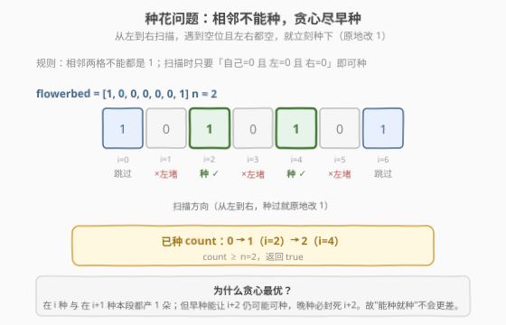
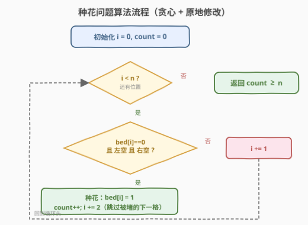

# LeetCode 种花问题 题解

## 1. 题目概述

- **标题 / 题号**：种花问题（#605，easy）
- **链接**：https://leetcode.cn/problems/can-place-flowers/
- **难度**：简单
- **标签**：贪心、数组

**题意**：给定一个花坛数组 `flowerbed`（`0` 表示空位，`1` 表示已种花），**花不能种在相邻位置**。再给定整数 `n`，判断能否在不违反规则的前提下新种 `n` 朵花。

**示例 1**：

```text
输入：flowerbed = [1,0,0,0,1], n = 1
输出：true
```

**示例 2**：

```text
输入：flowerbed = [1,0,0,0,1], n = 2
输出：false
```

**约束**：

- `1 <= flowerbed.length <= 2 * 10^4`
- `flowerbed[i]` 为 `0` 或 `1`
- 输入数组中**不存在两朵相邻的花**
- `0 <= n <= flowerbed.length`

> 💡 题目保证输入合法（无相邻 1），只需判断"还能塞几朵"。这是**贪心**的招牌入门题：局部做"能种就种"的选择即为全局最优。

## 2. 解题思路

### 2.1 暴力思路：枚举每个空位种或不种

最直觉的做法是回溯：对每个空位尝试"种"或"不种"两种选择，递归搜索能否种够 `n` 朵。但 `flowerbed.length` 可达 $2 \times 10^4$，指数级回溯必然超时，且大量分支本质等价（同一片连续空位里种哪几个的组合数巨大）。

> ⚠️ 暴力回溯暴露了一个关键事实：**同一片连续空位里，种花的位置选择高度对称**——我们只关心"最多能种几朵"，不关心具体种在哪。这暗示存在比搜索更直接的贪心策略。

### 2.2 核心观察：贪心——能种就种，原地标记

**关键定义**：位置 `i` 可种 ⟺ `flowerbed[i] == 0` 且 `flowerbed[i-1] == 0`（或 `i == 0`）且 `flowerbed[i+1] == 0`（或 `i == len-1`）。

**贪心策略**：从左到右扫描，**遇到可种的位置就立刻种下**（把 `flowerbed[i]` 改成 `1`），计数 `+1`，然后跳到 `i+2`（下一格已被刚种的花堵死，无需检查）；不可种则 `i+1` 继续扫描。



**为什么贪心是最优的？**

- 考虑任意一片连续空位。在位置 `i` 种 与 在 `i+1` 种，在这两位上**都只产出 1 朵花**。
- 但**早种**能让 `i+2` 仍可能可种（只要 `i+3` 也是空）；**晚种**（种在 `i+1`）必然封死 `i+2`。
- 因此"能种就种"在每一步都给后续**留出不少于**其它选择的空间，不会更差。形式化地，对长度为 `k` 的连续空位段，贪心恰好达到理论上限 $\lfloor (k-1)/2 \rfloor$（两端有花界）或 $\lfloor k/2 \rfloor$（单侧有界）或 $\lfloor (k+1)/2 \rfloor$（全空）。

> 💡 **原地修改**是本题的关键技巧：种下后把 `flowerbed[i]` 改成 `1`，后续判断 `flowerbed[i-1]` 时自然就能"看到"刚种的花，无需额外维护前驱状态。若题目不让修改输入，可用 `prev` 变量记录"上一个位置最终是否种花"（见方法二）。

### 2.3 算法流程图



### 2.4 示例演算

以 `flowerbed = [1,0,0,0,0,0,1], n = 2` 为例，逐步看贪心如何种满 2 朵：

![示例演算：[1,0,0,0,0,0,1] 逐位置决策](../images/flowers_example_walkthrough.svg)

关键点在第 3、5 步：`i=2` 和 `i=4` 都满足"自己空 + 左空 + 右空"，立刻种下并原地改 1；随后 `i=3`、`i=5` 因为左侧刚种了花而被堵死，直接跳过。最终 `count = 2 ≥ n`，返回 `true`。

> 💡 注意"种过就跳 2 格"：种完 `i=2` 后，`i=3` 必然不可种（左邻为 1），代码里可直接 `i += 2` 跳过；即使写成 `i += 1`，下一轮判断也会因 `flowerbed[i-1]==1` 而跳过，结果一致——`i += 2` 只是把"必然失败"的检查省掉，常数更优。

## 3. 参考代码

### 方法一：贪心 + 原地修改（推荐）

### C++

```cpp
class Solution {
public:
    bool canPlaceFlowers(vector<int>& flowerbed, int n) {
        int count = 0;
        int m = flowerbed.size();
        for (int i = 0; i < m; ++i) {
            if (flowerbed[i] == 0
                && (i == 0 || flowerbed[i - 1] == 0)
                && (i == m - 1 || flowerbed[i + 1] == 0)) {
                flowerbed[i] = 1;   // 原地种下
                ++count;
                ++i;                // 跳过被堵死的下一格（for 再 +1，共 +2）
            }
        }
        return count >= n;
    }
};
```

### Python

```python
class Solution:
    def canPlaceFlowers(self, flowerbed: List[int], n: int) -> bool:
        count = 0
        m = len(flowerbed)
        i = 0
        while i < m:
            if (flowerbed[i] == 0
                    and (i == 0 or flowerbed[i - 1] == 0)
                    and (i == m - 1 or flowerbed[i + 1] == 0)):
                flowerbed[i] = 1   # 原地种下
                count += 1
                i += 2             # 跳过被堵死的下一格
            else:
                i += 1
        return count >= n
```

> 💡 C++ 版在 `for` 循环里多写一个 `++i` 配合循环自增实现 `i += 2`；Python 用 `while` 更直观地写 `i += 2`。两者逻辑等价。注意 C++ 不要误写成 `i += 2`——`for` 还会再 `+1`，会变成 `+3`。

### 方法二：不修改输入（用 prev 变量）

若面试官要求不能改输入，用变量 `prev` 记录"上一个位置的最终状态"：

### C++

```cpp
class Solution {
public:
    bool canPlaceFlowers(vector<int>& flowerbed, int n) {
        int count = 0, prev = 0;   // prev：上一个位置最终是否种花（初始视为空）
        int m = flowerbed.size();
        for (int i = 0; i < m; ++i) {
            if (prev == 0 && flowerbed[i] == 0
                && (i == m - 1 || flowerbed[i + 1] == 0)) {
                ++count;
                prev = 1;          // 假装在这里种了
            } else {
                prev = flowerbed[i];
            }
        }
        return count >= n;
    }
};
```

## 4. 复杂度分析

| 维度 | 方法 | 复杂度 | 说明 |
|------|------|--------|------|
| 时间复杂度 | 贪心原地修改 | `O(n)` | 单趟扫描，种花时跳 2 格，总访问 ≤ n |
| 空间复杂度 | 贪心原地修改 | `O(1)` | 仅用 `count`、`i` 两个变量 |
| 时间复杂度 | 不修改输入版 | `O(n)` | 同为单趟扫描 |
| 空间复杂度 | 不修改输入版 | `O(1)` | 多一个 `prev` 变量，仍 `O(1)` |

> ⚠️ 不要被"种花后跳 2 格"误导成 `O(n/2)`——渐进复杂度记号里常数忽略，仍为 `O(n)`。它只是把一半位置直接跳过，常数因子更优。

## 5. 扩展：连续空位计数法（数学解法）

把花坛按已有的 `1` 切成若干"连续空位段"，对每段直接用公式算最多能种几朵，再求和。设某段连续空位长度为 `k`，两侧情况决定公式：

| 段的位置 | 两侧情况 | 最多可种 |
|----------|----------|----------|
| 中间段 | 两端都有花界 | $\lfloor (k-1)/2 \rfloor$ |
| 边界段 | 只一侧有花界（或数组一端） | $\lfloor k/2 \rfloor$ |
| 全空 | 数组里没有 `1` | $\lfloor (k+1)/2 \rfloor$ |

> 💡 公式可统一记忆：两端都"被堵"减 1 再除 2 下取整；只一端被堵不加减直接除 2；两端都自由加 1 除 2。本质都是"每隔一个种一个"。此法 `O(n)` 时间 `O(1)` 空间，不修改输入、无需特判邻居；缺点是边界分类多、易写错，面试中**贪心扫描版更不易出错**。

## 6. 面试要点

1. **为什么贪心"能种就种"是正确的？**
   - 在位置 `i` 种 与 在 `i+1` 种，本段都产 1 朵；但早种能让 `i+2` 仍可能可种，晚种必封死 `i+2`。故"能种就种"不会更差，且对长度 `k` 的连续空位恰好达到理论上限。

2. **种花后为什么要** `i += 2`**？**
   - 种在 `i` 后，`i+1` 因左邻为 `1` 必然不可种，直接跳过省一次必失败的检查。写成 `i += 1` 也对，只是多走一步。

3. **如果不允许修改输入怎么办？**
   - 用 `prev` 变量记录"上一个位置最终是否种花"，判断时用 `prev` 代替 `flowerbed[i-1]`；种了就把 `prev=1`，否则 `prev=flowerbed[i]`。

4. **数组首尾为什么要特判？**
   - `i=0` 无左邻、`i=m-1` 无右邻，视为"那边是空"（边界外没有花）。代码里用 `i == 0 || flowerbed[i-1] == 0` 的短路写法天然处理。

5. **`n = 0` 要特判吗？**
   - 不用。循环照常跑，最后 `count >= 0` 恒为 `true`；也可提前 `if (n == 0) return true;` 做小优化。

6. **和"连续空位公式法"相比优劣？**
   - 两者都 `O(n)/O(1)`。贪心扫描版逻辑直白、边界少、不易错；公式法不修改输入、常数更优，但需按段分类讨论。面试首选贪心扫描。

## 同类练习题

| # | 题目 | 与本题的关联 |
|---|------|-------------|
| 55 | [跳跃游戏](https://leetcode.cn/problems/jump-game/)（[题解](../0001-0100/55_跳跃游戏.md)） | 贪心维护最远可达，"能走就走"的同类直觉 |
| 134 | [加油站](https://leetcode.cn/problems/gas-station/)（[题解](../0101-0200/134_加油站.md)） | 贪心一次遍历定起点，"局部亏损即抛弃"的贪心范式 |
| 435 | [无重叠区间](https://leetcode.cn/problems/non-overlapping-intervals/)（[题解](../0401-0500/435_无重叠区间.md)） | 贪心区间调度（按右端点），"尽早结束留空间"与种花"尽早种留位置"同构 |
| 621 | [任务调度器](https://leetcode.cn/problems/task-scheduler/)（[题解](621_任务调度器.md)） | 贪心 + 计数，"安排间隔"的同类思维 |
| 56 | [合并区间](https://leetcode.cn/problems/merge-intervals/)（[题解](../0001-0100/56_合并区间.md)） | 排序 + 贪心扫描，同为本题"从左到右一趟扫描"的骨架 |
