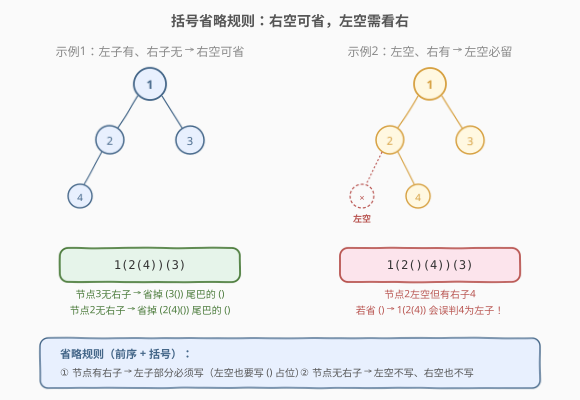
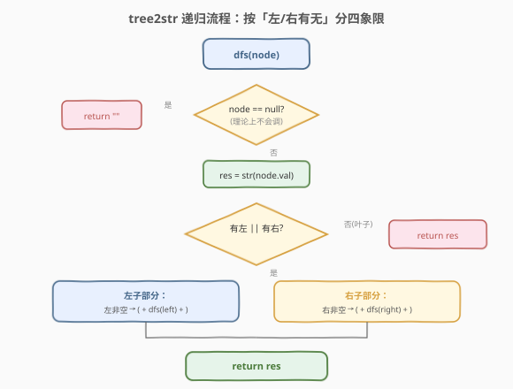

# LeetCode 根据二叉树创建字符串 题解

## 1. 题目概述

- **标题 / 题号**：根据二叉树创建字符串（#606，medium）
- **链接**：https://leetcode.cn/problems/construct-string-from-binary-tree/
- **难度**：中等
- **标签**：树、二叉树、深度优先搜索、字符串

**题意**：给你二叉树的根节点 `root`，请你采用**前序遍历**的方式，将二叉树转化为一个由**括号和整数**组成的字符串，返回构造出的字符串。

空节点使用一对空括号对 `"()"` 表示，转化后需要**省略所有不影响字符串与原始二叉树之间一对一映射关系的空括号对**。

**示例 1**：

```text
输入：root = [1,2,3,4]
输出："1(2(4))(3)"
解释：初步转化后得到 "1(2(4)())(3()())"，
      但省略所有不必要的空括号对后，字符串应该是 "1(2(4))(3)"。
```

**示例 2**：

```text
输入：root = [1,2,3,null,4]
输出："1(2()(4))(3)"
解释：和第一个示例类似，但是无法省略第一个空括号对，
      否则会破坏输入与输出一一映射的关系。
```

**约束**：

- 树中节点数目范围 `[1, 10^4]`
- `-1000 <= Node.val <= 1000`

> 💡 本题的坑点全在「**哪些 `()` 能省、哪些不能省**」。核心矛盾是：前序遍历的「根-左-右」结构靠括号嵌套表达，**省多了会丢结构信息，省少了会冗余**。判定规则只有一句话——**右子为空时尾部的 `()` 总能省；左子为空时只有在右子也为空时才能省**。

## 2. 解题思路

### 2.1 暴力思路：无脑全写括号

最朴素的写法是仿照 297（二叉树序列化）：每个节点都写 `val(left)(right)`，`null` 写成空串，得到形如 `"1(2(4)())(3()())"` 的完全括号串。这当然能唯一确定树，但题目要求**在保持一一映射的前提下尽量省略空括号对**——尾巴那些无意义的 `()` 必须删掉。

### 2.2 核心观察：省略规则——右空可省，左空看右



把节点 `node` 的字符串生成拆成两部分看：**左子括号** 和 **右子括号**。关键是判断每一侧的 `()` 能否省略。

**规则推导**：

- **右子括号**：右子在前序中排在**最后**。若右子为空，它的 `()` 位于字符串末尾，**删掉不影响后续解析**（因为后面再无内容）。所以**右空总能省**。
- **左子括号**：左子排在右子**前面**。若左子为空但右子非空，删掉左子的 `()` 会让右子的内容**错位到左子位置**——解析时会把右子误读成左子，破坏一一映射。所以**左空只有在右子也为空时才能省**（此时两侧都空，全删不影响）。

> 💡 **一句话规则**：节点有右子时，左子部分**必须写**（左空也要写 `()` 占位）；节点无右子时，左空不写、右空也不写。等价于「只有 `node.right != null` 时才需要为空的左子补 `()`」。

### 2.3 算法流程图



**完整步骤**：

1. **特判**：`node == null` 返回空串（理论上不会对根调用，但递归到空子树时会用）。
2. **写值**：`res = str(node.val)`。
3. **判断是否需要括号**：若 `node.left` 和 `node.right` **都为空**（叶子节点），直接返回 `res`，无需任何括号。
4. **左子部分**：
   - 若 `node.left != null`：`res += "(" + dfs(node.left) + ")"`；
   - 若 `node.left == null` 但 `node.right != null`：`res += "()"`（**占位**）。
5. **右子部分**：
   - 若 `node.right != null`：`res += "(" + dfs(node.right) + ")"`；
   - 若 `node.right == null`：**不追加**（尾部 `()` 省略）。
6. 返回 `res`。

### 2.4 示例演算

以 `root = [1,2,3,null,4]` 为例，递归展开过程如下：

![示例演算：root = [1,2,3,null,4]](../images/tree2str_walkthrough.svg)

| 递归调用 | 节点值 | 左子处理 | 右子处理 | 返回值 |
|----------|--------|----------|----------|--------|
| `dfs(4)` | 4 | 无（叶子） | 无（叶子） | `"4"` |
| `dfs(3)` | 3 | 无（叶子） | 无（叶子） | `"3"` |
| `dfs(null)`（2 的左） | — | — | — | `""` |
| `dfs(2)` | 2 | 左空 + 有右 → `"()"` | 右有 → `"(4)"` | `"2()(4)"` |
| `dfs(1)` | 1 | 左有 → `"(2()(4))"` | 右有 → `"(3)"` | `"1(2()(4))(3)"` ⭐ |

> ⚠️ **关键一步**在 `dfs(2)`：节点 2 的左子为空，但**右子非空**（有节点 4），所以左子位置必须写 `"()"` 占位。若省掉，得到 `"1(2(4))(3)"`，解析时会把 4 当成 2 的**左子**而非右子——树结构被改变，破坏一一映射。

## 3. 参考代码

### C++

```cpp
// 根据二叉树创建字符串.cpp —— 前序 DFS + 括号省略规则
// 编译: g++ -O2 -std=c++17 根据二叉树创建字符串.cpp -o tree2str
#include <string>
using namespace std;

struct TreeNode {
    int val;
    TreeNode* left;
    TreeNode* right;
    TreeNode() : val(0), left(nullptr), right(nullptr) {
    }
    TreeNode(int x) : val(x), left(nullptr), right(nullptr) {
    }
    TreeNode(int x, TreeNode* l, TreeNode* r) : val(x), left(l), right(r) {
    }
};

class Solution {
  public:
    string tree2str(TreeNode* root) {
        if (root == nullptr)
            return "";
        string res = to_string(root->val);
        // 叶子节点：左右都空，无需括号
        if (root->left == nullptr && root->right == nullptr)
            return res;
        // 左子部分：有左就递归，左空但有右则用 () 占位
        if (root->left != nullptr) {
            res += "(" + tree2str(root->left) + ")";
        } else {
            res += "()";
        }
        // 右子部分：有右才递归，右空则省略（尾部 () 可省）
        if (root->right != nullptr) {
            res += "(" + tree2str(root->right) + ")";
        }
        return res;
    }
};
```

### Python

```python
from typing import Optional


class Solution:
    def tree2str(self, root: Optional[TreeNode]) -> str:
        if root is None:
            return ""
        res = str(root.val)
        # 叶子节点：左右都空，无需括号
        if root.left is None and root.right is None:
            return res
        # 左子部分：有左就递归，左空但有右则用 () 占位
        if root.left is not None:
            res += "(" + self.tree2str(root.left) + ")"
        else:
            res += "()"
        # 右子部分：有右才递归，右空则省略（尾部 () 可省）
        if root.right is not None:
            res += "(" + self.tree2str(root.right) + ")"
        return res
```

> 💡 代码结构对应三段式判断：**叶子直接返回** → **左子（含占位逻辑）** → **右子（可省）**。三个 `if` 的顺序即前序「根-左-右」的自然展开。也可以把判断合并为：`if left or right:` 外层套住，内层再分左右——但拆开写更直白，便于面试时讲清省略规则。

## 4. 复杂度分析

| 维度 | 复杂度 | 说明 |
|------|--------|------|
| 时间复杂度 | $O(n)$ | 每个节点访问一次，字符串拼接为摊还 $O(1)$（值长度有界） |
| 空间复杂度 | $O(n)$ | 递归栈深度最坏 $O(n)$（退化为链）；输出字符串长度 $O(n)$ |

> ⚠️ C++ 中 `res += "(" + ... + ")"` 涉及临时 `std::string` 构造，极端深树下可能放大常数。若追求极致性能可用 `res.push_back('(')` 逐字符追加，但可读性下降，面试中不必过度优化。

## 5. 扩展：迭代写法（栈模拟前序）

递归版在极深树上有栈溢出风险（虽然本题 $n \le 10^4$ 一般无碍）。可用**显式栈**模拟前序遍历，配合一个 `visited` 集合标记节点是否已处理左子（决定是否该追加右子括号）：

```python
class Solution:
    def tree2str(self, root: Optional[TreeNode]) -> str:
        if not root:
            return ""
        res = []
        stack = [root]
        visited = set()
        while stack:
            node = stack[-1]
            if node in visited:
                # 第二次见到：左右子已处理完，闭合右括号
                res.append(")")
                stack.pop()
            else:
                visited.add(node)
                res.append("(" + str(node.val))
                if not node.left and node.right:
                    res.append("()")          # 左空右有 → 占位
                if node.right:
                    stack.append(node.right) # 先压右（前序先左后右，所以左后压）
                if node.left:
                    stack.append(node.left)
        # 去掉首尾多余括号（根节点外层包了一对）
        return "".join(res)[1:-1]
```

> 💡 迭代版的难点在于「**何时闭合括号**」——每个节点入栈时开括号、出栈时闭括号，用 `visited` 区分「首次访问（开括号 + 压孩子）」与「二次访问（闭括号 + 弹栈）」。这与 94 题迭代中序遍历的「标记二次访问」技巧同源。面试中递归版为主，迭代版作为「防止栈溢出」的备选提及即可。

## 6. 面试要点

1. **哪些空括号能省、哪些不能省？**

   - **右子为空**的 `()` 位于字符串尾部，删掉不影响后续解析，**总能省**。
   - **左子为空**的 `()` 只有在**右子也为空**时才能省；若右子非空，左空必须留 `()` 占位，否则右子内容会错位到左子位置，破坏一一映射。

2. **为什么前序遍历能配合括号唯一确定树？**

   - 括号嵌套显式标注了**子树边界**：`(val(left)(right))` 中，第一个值是根，第一个括号对是左子树，第二个括号对是右子树。配合「左空占位」规则，解析时能明确区分「左子为空」与「无右子」两种情况，结构信息无损。

3. **叶子节点为什么不需要任何括号？**

   - 叶子节点左右都空，既无左子也无右子。按规则，右空可省（尾部）、左空在右也空时可省——两侧都满足省略条件，于是叶子只输出值本身，不加任何 `()`。

4. **本题和 297（序列化）的区别是什么？**

   - 297 要求**无损往返**（序列化 + 反序列化），用 `#` 显式标记每个 `null`，格式自由但必须可逆。606 只要求**单向**生成字符串，且追求**最短**表示——靠括号嵌套 + 省略规则压缩空位，不需要 `null` 标记，也不要求能从字符串反推树。

5. **C++ 字符串拼接的性能要注意什么？**

   - `"(" + tree2str(left) + ")"` 会构造临时 `std::string`，深树下常数较大。优化可用 `res.push_back('(')` + `res.append(sub)` + `res.push_back(')')` 逐段追加，避免临时对象。但本题数据规模下差异不明显，优先保证可读性。

> 💡 **一句话总结**：606 的核心是「**前序 + 括号嵌套**」表达树结构，难点全在省略规则——**右空总能省、左空看右**。代码只是三段式 `if`，但想清「为什么左空在有右子时必须占位」才是拿分关键。

## 同类练习题

| # | 题目 | 与本题的关联 |
|---|------|-------------|
| 297 | [二叉树的序列化与反序列化](https://leetcode.cn/problems/serialize-and-deserialize-binary-tree/)（[题解](../0201-0300/297_二叉树的序列化与反序列化.md)） | 用 `#` 显式标记 null 的无损序列化，对照 606 靠括号省略的压缩表示 |
| 449 | [序列化和反序列化 BST](https://leetcode.cn/problems/serialize-and-deserialize-bst/) | 利用 BST 值域上下界省掉 null 标记，同属「树→字符串」家族的压缩思路 |
| 94 | [二叉树的中序遍历](https://leetcode.cn/problems/binary-tree-inorder-traversal/)（[题解](../0001-0100/94_二叉树的中序遍历.md)） | 迭代版用 `visited` 标记二次访问，与 606 迭代版的栈模拟技巧同源 |
| 144 | [二叉树的前序遍历](https://leetcode.cn/problems/binary-tree-preorder-traversal/) | 前序遍历模板，本题的遍历骨架来源 |
