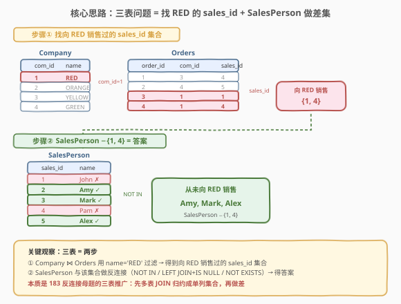
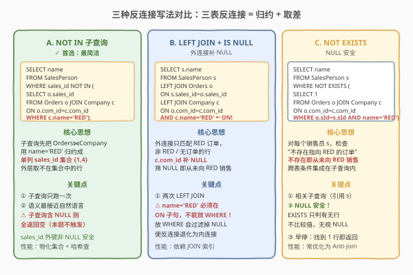
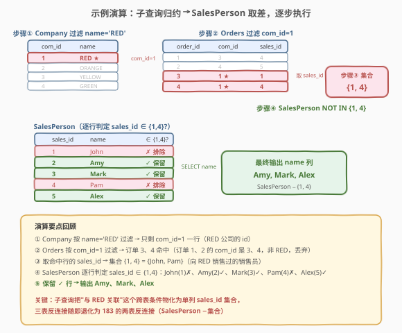

# LeetCode 销售员 题解

## 1. 题目概述

- **标题 / 题号**：销售员（#607，easy）
- **链接**：https://leetcode.cn/problems/sales-person/
- **难度**：简单
- **标签**：SQL、反连接、NOT IN、LEFT JOIN、NOT EXISTS、多表 JOIN、子查询

**题意**：给定三张表——`SalesPerson`（销售员）、`Company`（公司）、`Orders`（订单），编写 SQL 查询找出**没有任何与名为 "RED" 的公司相关订单的所有销售人员姓名**。结果只返回 `name` 列，顺序任意。

**表结构**：

```text
Table: SalesPerson
+-----------------+---------+
| Column Name     | Type    |
+-----------------+---------+
| sales_id        | int     |  ← 主键
| name            | varchar |
| salary          | int     |
| commission_rate | int     |
| hire_date       | date    |
+-----------------+---------+

Table: Company
+-------------+---------+
| Column Name | Type    |
+-------------+---------+
| com_id      | int     |  ← 主键
| name        | varchar |
| city        | varchar |
+-------------+---------+

Table: Orders
+-------------+------+
| Column Name | Type |
+-------------+------+
| order_id    | int  |  ← 主键
| order_date  | date |
| com_id      | int  |  ← 外键 → Company.com_id
| sales_id    | int  |  ← 外键 → SalesPerson.sales_id
| amount      | int  |
+-------------+------+
```

> 💡 **关键约束**：`Orders.com_id` 指向 `Company.com_id`，`Orders.sales_id` 指向 `SalesPerson.sales_id`——订单表是连接"销售员"与"公司"的桥梁。一个销售员可以有多笔订单、可以与多个公司交易，也可能没有任何订单。"从未向 RED 销售"等价于"在 `Orders` 中找不到该销售员与 `Company.name='RED'` 关联的行"。

**示例 1**：

```text
输入：
SalesPerson 表:
+----------+------+--------+-----------------+------------+
| sales_id | name | salary | commission_rate | hire_date  |
+----------+------+--------+-----------------+------------+
| 1        | John | 100000 | 6               | 4/1/2006   |
| 2        | Amy  | 12000  | 5               | 5/1/2010   |
| 3        | Mark | 65000  | 12              | 12/25/2008 |
| 4        | Pam  | 25000  | 25              | 1/1/2005   |
| 5        | Alex | 5000   | 10              | 2/3/2007   |
+----------+------+--------+-----------------+------------+
Company 表:
+--------+--------+----------+
| com_id | name   | city     |
+--------+--------+----------+
| 1      | RED    | Boston   |
| 2      | ORANGE | New York |
| 3      | YELLOW | Boston   |
| 4      | GREEN  | Austin   |
+--------+--------+----------+
Orders 表:
+----------+------------+--------+----------+--------+
| order_id | order_date | com_id | sales_id | amount |
+----------+------------+--------+----------+--------+
| 1        | 1/1/2014   | 3      | 4        | 10000  |
| 2        | 2/1/2014   | 4      | 5        | 5000   |
| 3        | 3/1/2014   | 1      | 1        | 50000  |
| 4        | 4/1/2014   | 1      | 4        | 25000  |
+----------+------------+--------+----------+--------+
输出：
+------+
| name |
+------+
| Amy  |
| Mark |
| Alex |
+------+
解释：订单 3 和 4 的 com_id=1（即 RED），分别属于 John(sales_id=1) 和 Pam(sales_id=4)。所以只有 John 和 Pam 向 RED 销售过，输出其余三人 Amy、Mark、Alex。
```

**约束**：

- `SalesPerson.sales_id`、`Company.com_id`、`Orders.order_id` 均为主键（非 NULL、唯一）
- `Orders.com_id` 与 `Orders.sales_id` 为外键（非 NULL）
- 结果只返回 `name` 列，顺序任意

> 💡 本题是 [183. 从不订购的客户](../0101-0200/183_从不订购的客户.md) 的**三表推广**——183 是两表反连接（Customers − Orders），607 是三表反连接（SalesPerson − (Orders ⋈ Company)）。难点不在语法，而在于：① 先把"与 RED 相关"这个跨表条件物化为一个 `sales_id` 集合；② 再对 `SalesPerson` 做反连接。核心仍是反连接母题，只是多了一步"多表 JOIN 先归约成单列集合"。

## 2. 解题思路

### 2.1 暴力思路：逐销售员逐订单扫描

最直觉的过程式思路是：对 `SalesPerson` 的每个销售员 `s`，去 `Orders` 里找他所有的订单，再 JOIN `Company` 看对应公司是不是 RED——若所有订单的公司都不是 RED（或他根本没订单），就输出 `s.name`。这在过程式语言里是双重嵌套循环，但**纯 SQL 没有逐行循环**——需要换"集合式"表达：先算出"向 RED 销售过的 `sales_id` 集合"，再取 `SalesPerson` 与该集合的差集。

> ⚠️ 本题相比 183 多了一层"跨表过滤"——183 的"已下单 id 集合"直接来自单表 `SELECT customerId FROM Orders`；607 的"向 RED 销售的 id 集合"需要 `Orders JOIN Company WHERE name='RED'` 才能得到。这步"多表 JOIN 归约成单列"是本题的核心增量。

### 2.2 核心观察：三表问题 = 找 RED 的 sales_id 集合 + SalesPerson 做差集



**关键洞察**：把问题拆成两步——

1. **步骤①**：`Company ⋈ Orders` 用 `name='RED'` 过滤，得到"向 RED 销售过的 `sales_id` 集合"。本例为 `{1, 4}`（John、Pam）。
2. **步骤②**：`SalesPerson` 与该集合做**反连接**（差集），得到"从未向 RED 销售"的销售员。本例为 `{Amy, Mark, Alex}`。

$$\text{答案} = \text{SalesPerson} \setminus \big\{ o.\text{sales\_id} \;\big|\; \exists\, c:\ o.\text{com\_id} = c.\text{com\_id} \land c.\text{name} = \text{'RED'} \big\}$$

> 💡 **为何这样拆**：反连接要求"右表是一个可枚举的集合"。本题的"右表"不是单张 `Orders`，而是"`Orders` 中与 RED 公司关联的子集"——先用一个子查询把这部分 `sales_id` 物化成单列集合，反连接就退化回 183 的两表形态。**口诀：多表反连接先归约，把跨表条件物化成单列集合，再做差。**

### 2.3 三种解法对比



| 维度 | 解法 A：NOT IN | 解法 B：LEFT JOIN + IS NULL | 解法 C：NOT EXISTS |
|------|----------------|---------------------------|---------------------|
| **思路** | 子查询算 RED 的 sales_id 集合，外层取不在其中的 | 外连接 RED 订单，无匹配补 NULL，筛 NULL | 对每个销售员检查"不存在指向 RED 的订单" |
| **写法** | `WHERE sales_id NOT IN (SELECT ... JOIN ... WHERE name='RED')` | `LEFT JOIN ... AND c.name='RED' WHERE c.com_id IS NULL` | `WHERE NOT EXISTS (SELECT 1 ... WHERE o.sId=s.sId AND c.name='RED')` |
| **NULL 安全** | ⚠ 子查询含 NULL 则全返回空 | ✓ 安全（外连接不比较值） | ✓ 安全（EXISTS 只判有无行） |
| **推荐度** | ✓ **首选**，写法最简洁直观 | 语义直观但 JOIN 顺序需小心 | NULL 安全，写法略繁 |

> ⚠️ **解法 B 的过滤条件位置陷阱**：`c.name='RED'` 必须放在 `LEFT JOIN` 的 **`ON` 子句**，而非 `WHERE`！若放 `WHERE`，外连接补的 NULL 行会因 `NULL = 'RED'` 为 `UNKNOWN` 被过滤掉，导致"从未向 RED 销售"的行全部丢失——反连接失效。这是 LEFT JOIN + IS NULL 解法最易踩的坑，详见 5.1 节。

> ⚠️ **解法 A 的 NULL 陷阱**：`NOT IN (子查询)` 若子查询结果含 `NULL`，`x NOT IN (..., NULL)` 对任意 `x` 返回 `UNKNOWN`，导致**整个查询返回空集**。本题 `sales_id` 是外键非 NULL，不会触发；但若列可空，须加 `AND sales_id IS NOT NULL` 或改用 `NOT EXISTS`。与 183 完全同源。

### 2.4 示例演算

以示例数据为例，用解法 A（NOT IN）逐步演算：



**Step 1：Company 过滤 `name='RED'`**

| com_id | name | city |
|--------|------|------|
| 1 | RED | Boston |

只剩 com_id=1 一行（RED 公司的 id）。

**Step 2：Orders 过滤 `com_id=1`**

| order_id | com_id | sales_id | amount |
|----------|--------|----------|--------|
| 3 | 1 | 1 | 50000 |
| 4 | 1 | 4 | 25000 |

订单 1、2 的 `com_id` 分别是 3、4（非 RED），被过滤；订单 3、4 的 `com_id=1`（RED），保留。

**Step 3：提取 sales_id 集合**

`SELECT sales_id FROM 上一步` → `{1, 4}`，即 John 与 Pam 向 RED 销售过。

**Step 4：SalesPerson 与 {1, 4} 做差集**

| sales_id | name | 在 {1,4} 中? | 输出 |
|----------|------|-------------|------|
| 1 | John | ✓ | —（排除） |
| 2 | Amy | ✗ | Amy |
| 3 | Mark | ✗ | Mark |
| 4 | Pam | ✓ | —（排除） |
| 5 | Alex | ✗ | Alex |

最终输出 `Amy`、`Mark`、`Alex`。

> 💡 **差集的对称性**：`SalesPerson − {向 RED 销售的 id}` 等价于"保留 `SalesPerson` 中 id 不在 RED 集合的行"。`NOT IN` 是最直接的集合差表达；`LEFT JOIN + IS NULL` 用外连接补 NULL 实现"不在集合中"；`NOT EXISTS` 用相关子查询逐行判定"不存在"。三者殊途同归，对应 183 的三种反连接写法。

## 3. 参考代码

### SQL（解法 A：NOT IN 子查询，推荐）

```sql
SELECT name
FROM SalesPerson
WHERE sales_id NOT IN (
    SELECT o.sales_id
    FROM Orders o
    JOIN Company c ON o.com_id = c.com_id
    WHERE c.name = 'RED'
);
```

> 💡 **写法要点**：
> - 子查询 `Orders JOIN Company ON com_id` 用 `WHERE c.name='RED'` 过滤出"向 RED 销售过的 `sales_id` 集合"——这是把三表问题归约成两表反连接的关键一步。
> - 外层 `sales_id NOT IN (...)` 取不在该集合的销售员，即"从未向 RED 销售"。
> - 语义最接近自然语言："找出 `sales_id` 不在『向 RED 销售的 id 集合』里的销售员姓名"。
> - ⚠️ `sales_id` 是外键非 NULL，`NOT IN` 安全；若可空须加 `AND o.sales_id IS NOT NULL`。

### SQL（解法 B：LEFT JOIN + IS NULL）

```sql
SELECT s.name
FROM SalesPerson s
LEFT JOIN Orders o
    ON s.sales_id = o.sales_id
LEFT JOIN Company c
    ON o.com_id = c.com_id AND c.name = 'RED'
WHERE c.com_id IS NULL;
```

> 💡 **写法要点**：
> - 两次 `LEFT JOIN`：先按 `sales_id` 关联订单，再按 `com_id` 关联公司，且 `c.name='RED'` 放在第二个 JOIN 的 **`ON` 子句**——只匹配 RED 公司的订单，非 RED 订单的 `c.*` 补 NULL。
> - `WHERE c.com_id IS NULL` 筛出"无 RED 订单匹配"的销售员——包括两类：① 有订单但都不指向 RED；② 完全没订单。两者 `c.com_id` 都为 NULL，统一被保留。
> - 判 `c.com_id`（Company 主键，非 NULL）最稳——有 RED 匹配时非 NULL、无匹配时 NULL，判定无歧义。
> - ⚠️ **切勿把 `c.name='RED'` 移到 `WHERE`**——会使外连接退化为内连接，反连接失效（见 5.1 节）。

### SQL（解法 C：NOT EXISTS 相关子查询）

```sql
SELECT name
FROM SalesPerson s
WHERE NOT EXISTS (
    SELECT 1
    FROM Orders o
    JOIN Company c ON o.com_id = c.com_id
    WHERE o.sales_id = s.sales_id AND c.name = 'RED'
);
```

> 💡 **写法要点**：
> - `NOT EXISTS` 是相关子查询——内层 `WHERE o.sales_id = s.sales_id` 引用外层 `s`，对每个销售员执行一次，判定"是否存在指向 RED 的订单"。
> - `SELECT 1` 只判"有无行返回"，不关心列值——`EXISTS` 只看行数是否 > 0。
> - ✓ **NULL 安全**：`EXISTS` 只判行数不比较值，即使 `sales_id` 含 NULL 也不影响。
> - 内层 `JOIN Company` 把跨表条件 `name='RED'` 集成在子查询里，无需先物化集合——写法略繁但语义自洽。

### Python（pandas）

```python
import pandas as pd

def sales_person(sales_person: pd.DataFrame, company: pd.DataFrame, orders: pd.DataFrame) -> pd.DataFrame:
    red_com_ids = set(company.loc[company['name'] == 'RED', 'com_id'])
    red_sales_ids = set(orders.loc[orders['com_id'].isin(red_com_ids), 'sales_id'])
    mask = ~sales_person['sales_id'].isin(red_sales_ids)
    return sales_person.loc[mask, ['name']]
```

> 💡 **pandas 对照**：`company.loc[name=='RED', 'com_id']` 对应子查询的 `WHERE c.name='RED'`；`orders.loc[com_id.isin(red_com_ids), 'sales_id']` 对应 `Orders JOIN Company` 后取 `sales_id`；`~sales_id.isin(red_sales_ids)` 对应 `NOT IN`。两步物化集合 + 掩码取反，与解法 A 的思路完全一致。

## 4. 复杂度分析

| 维度 | 复杂度 | 说明 |
|------|--------|------|
| **时间（解法 A）** | $O(m + n + k)$ | $m$ = `SalesPerson` 行数，$n$ = `Orders` 行数，$k$ = `Company` 行数。子查询 JOIN + 过滤 $O(n + k)$（哈希连接）物化 `sales_id` 集合 $O(r)$（$r \le n$，RED 订单数）；外层对每个销售员查集合 $O(m)$（哈希集合）。总计 $O(m + n + k)$ |
| **时间（解法 B）** | $O(m + n + k)$ ~ $O(m \cdot n)$ | 两次 `LEFT JOIN`，`sales_id`/`com_id` 有索引时 $O(m + n + k)$；无索引最坏 Nested Loop $O(m \cdot n)$。筛 NULL 单趟 $O(m)$ |
| **时间（解法 C）** | $O(m + n + k)$ ~ $O(m \cdot n)$ | 相关子查询对每个销售员执行一次；`sales_id` 有索引时每次 $O(1)$ 共 $O(m)$，无索引时每次全扫 $O(n)$ 共 $O(m \cdot n)$。现代优化器常改写为 Anti-Join 降到 $O(m + n + k)$ |
| **空间** | $O(n + k)$ | 子查询物化的 RED `sales_id` 集合 / 哈希连接中间结果 |
| **结果行数** | $O(m)$ | 最坏全部销售员都未向 RED 销售（如 RED 无订单），输出 $m$ 行 |

> ⚠️ SQL 复杂度取决于**执行计划与索引**：`sales_id` 与 `com_id` 作为外键通常有索引，三种解法均可走索引接近 $O(m + n + k)$。现代优化器常把三者统一优化为 **Anti-Join**（反连接），执行计划可能完全相同——面试中说明"三表反连接 = 多表 JOIN 归约 + 两表反连接，优化器友好"即可。

## 5. 扩展

### 5.1 LEFT JOIN 中过滤条件的位置：ON vs WHERE

解法 B 的 `c.name='RED'` 必须放在 `ON` 子句而非 `WHERE`，这是 LEFT JOIN + IS NULL 解法最关键的细节：

```sql
-- ✓ 正确：c.name='RED' 在 ON 子句
SELECT s.name
FROM SalesPerson s
LEFT JOIN Orders o ON s.sales_id = o.sales_id
LEFT JOIN Company c ON o.com_id = c.com_id AND c.name = 'RED'
WHERE c.com_id IS NULL;

-- ❌ 错误：c.name='RED' 在 WHERE 子句
SELECT s.name
FROM SalesPerson s
LEFT JOIN Orders o ON s.sales_id = o.sales_id
LEFT JOIN Company c ON o.com_id = c.com_id
WHERE c.name = 'RED' AND c.com_id IS NULL;  -- 反连接失效！
```

> ⚠️ **原因**：`LEFT JOIN` 先按 `ON` 配对并补 NULL，再对结果用 `WHERE` 过滤。把 `c.name='RED'` 放 `WHERE` 时，外连接补的 NULL 行 `c.name` 为 NULL，`NULL = 'RED'` 为 `UNKNOWN` → 被 `WHERE` 过滤掉——"从未向 RED 销售"的行（正是我们要的）全部丢失，反连接退化为内连接。
>
> **口诀**：`LEFT JOIN + IS NULL` 解法中，**右表的过滤条件放 `ON`（影响配对），左表的筛选放 `WHERE`（影响输出）**。或者说"凡是想让 NULL 行保留下来的条件，必须放 `ON`，不能放 `WHERE`"。

### 5.2 NOT IN 的 NULL 陷阱（承接 183）

`x NOT IN (a, b, NULL)` 等价于 `x <> a AND x <> b AND x <> NULL`，因 `x <> NULL` 永为 `UNKNOWN`，整个表达式非 `TRUE`——**对所有 `x` 都返回假、结果为空集**：

```sql
-- 若 Orders.sales_id 可能为 NULL：
SELECT name FROM SalesPerson
WHERE sales_id NOT IN (
    SELECT o.sales_id FROM Orders o JOIN Company c ON o.com_id = c.com_id
    WHERE c.name = 'RED'
);
-- 结果：空集（哪怕有从未向 RED 销售的人也查不出！）

-- 防护写法：排除 NULL
SELECT name FROM SalesPerson
WHERE sales_id NOT IN (
    SELECT o.sales_id FROM Orders o JOIN Company c ON o.com_id = c.com_id
    WHERE c.name = 'RED' AND o.sales_id IS NOT NULL
);
```

> 💡 本题 `sales_id` 是外键非 NULL，不触发；但面试须主动提及。更稳的替代是 `NOT EXISTS`（NULL 安全）。详见 [183 第 5.2 节](../0101-0200/183_从不订购的客户.md)。

### 5.3 三表反连接的通用模板

本题的"三表反连接"模板可泛化到所有"找 A 表中从未与某条件的 B⋈C 关联的行"场景：

```sql
-- 模板：NOT IN（最简洁）
SELECT a.*
FROM A
WHERE a.key NOT IN (
    SELECT b.fk_a FROM B b JOIN C c ON b.fk_c = c.id
    WHERE <C 的过滤条件>
);

-- 模板：NOT EXISTS（NULL 安全）
SELECT a.*
FROM A a
WHERE NOT EXISTS (
    SELECT 1 FROM B b JOIN C c ON b.fk_c = c.id
    WHERE b.fk_a = a.key AND <C 的过滤条件>
);
```

> 💡 只需替换表名、关联键与过滤条件即可套用——所有"从未向某类客户销售""从未在某类课程注册""从未与某类实体交互"类 SQL 题都是这个模板的实例。核心是**先把 B⋈C 的跨表条件物化成单列集合，再做两表反连接**。

### 5.4 "有订单但都不是 RED" vs "完全没订单"

反连接的 `NOT IN`/`NOT EXISTS`/`LEFT JOIN+IS NULL` 三种写法都**统一处理两类销售员**：① 有订单但都不指向 RED；② 完全没有任何订单。两者的 `sales_id` 都不在"RED 集合"中，都被保留。

- 解法 A/C：`sales_id NOT IN (RED集合)` / `NOT EXISTS (RED订单)`——两类都不在集合中，统一保留。
- 解法 B：`LEFT JOIN Orders ON sales_id` 对没订单的销售员 `o.*` 全 NULL，第二个 `LEFT JOIN Company ON o.com_id = c.com_id AND name='RED'` 因 `o.com_id` 为 NULL 无法匹配 → `c.com_id` 也 NULL → 被 `WHERE c.com_id IS NULL` 保留。

> 💡 这与 183 的"完全没订单的顾客"处理一致——反连接天然覆盖"无任何关联"的边界情况，无需额外特判。这是反连接相比"先 INNER JOIN 再筛"的根本优势：`INNER JOIN` 会丢失"无关联"的行。

## 6. 面试要点

1. **607 与 183 的核心区别是什么？**

   - 607 是 183 的**三表推广**——183 是两表反连接（`Customers − Orders.customerId`），607 是三表反连接（`SalesPerson − (Orders ⋈ Company)`）。难点在于"向 RED 销售"这个条件跨了 `Orders` 与 `Company` 两张表，需要先用子查询把这部分 `sales_id` 物化成单列集合，再退化为 183 的两表反连接。**口诀：多表反连接先归约成单列集合，再做差。**

2. **解法 B 中 `c.name='RED'` 为什么必须放 `ON` 而不能放 `WHERE`？**

   - `LEFT JOIN` 先按 `ON` 配对补 NULL，再用 `WHERE` 过滤结果。`c.name='RED'` 放 `WHERE` 时，外连接补的 NULL 行 `c.name` 为 NULL，`NULL='RED'` 为 `UNKNOWN` 被过滤——"从未向 RED 销售"的行（正是答案）全部丢失，反连接退化为内连接。放 `ON` 则只影响配对（只匹配 RED 订单），NULL 行保留下来被 `WHERE c.com_id IS NULL` 筛出。**口诀：想让 NULL 行保留下来的条件放 `ON`，左表筛选放 `WHERE`。**

3. **`NOT IN` 的 NULL 陷阱是什么？本题会触发吗？**

   - `x NOT IN (子查询)` 若子查询结果含 NULL，因 `x <> NULL` 永为 `UNKNOWN`，`AND` 链整体非 `TRUE`，导致对所有 `x` 返回假、结果为空集。本题 `Orders.sales_id` 是外键非 NULL，不会触发；但面试须主动提及防护（子查询加 `AND sales_id IS NOT NULL`）或改用 NULL 安全的 `NOT EXISTS`。

4. **三种解法性能差异？现代优化器如何处理？**

   - 语义等价，现代优化器常把三者统一优化为 **Anti-Join** 执行计划，性能接近。差异在无索引时：`NOT EXISTS` 的相关子查询最易退化为 $O(m \cdot n)$；`NOT IN` 与 `LEFT JOIN` 倾向物化/哈希更稳。有索引时三者均可走索引 $O(m + n + k)$。面试答"首选 `NOT IN` 因写法最直观且语义接近自然语言，NULL 安全场景用 `NOT EXISTS`，`LEFT JOIN+IS NULL` 在需保留左表列做后续处理时占优"。

5. **"有订单但都不是 RED"与"完全没订单"的销售员，反连接如何统一处理？**

   - 两者的 `sales_id` 都不在"RED 集合"中——前者有订单但 `com_id` 都不是 RED，后者根本没订单。`NOT IN`/`NOT EXISTS` 天然把两者都保留；`LEFT JOIN+IS NULL` 中没订单的销售员 `o.*` 全 NULL，第二个 JOIN 无法匹配 RED → `c.com_id` 也 NULL → 被保留。反连接天然覆盖"无任何关联"的边界，无需特判——这是它相比 `INNER JOIN` 的根本优势。

> 💡 **一句话总结**：607 是 183 反连接母题的三表推广——核心是**先把多表 JOIN 归约成单列 `sales_id` 集合，再做两表反连接**。首选 `NOT IN` 写法最简洁；`LEFT JOIN+IS NULL` 注意过滤条件放 `ON`；`NOT EXISTS` NULL 安全。记住"多表反连接先归约再取差"这条公式，所有"从未与某类实体交互"类 SQL 题都能套用。

## 同类练习题

| # | 题目 | 与本题的关联 |
|---|------|-------------|
| 183 | [从不订购的客户](../0101-0200/183_从不订购的客户.md) | 反连接母题——两表 `LEFT JOIN+IS NULL` / `NOT IN` / `NOT EXISTS`，607 的直接前置，把 607 的三表退化为两表即得 183 |
| 586 | [订单最多的客户](https://leetcode.cn/problems/customer-placing-the-largest-number-of-orders/) | `GROUP BY + COUNT + LIMIT 1` 取计数最大——与 607 共享 `Orders` 表的"按销售员/客户聚合"思维，但方向相反（607 找"零订单"，586 找"最多订单"） |
| 511 | [游戏玩法分析 I](../0501-0600/511_游戏玩法分析I.md) | `GROUP BY + MIN` 分组取最值——SQL 聚合入门，对比 607 理解"何时需多表 JOIN 归约、何时单表聚合即可" |
| 175 | [组合两个表](https://leetcode.cn/problems/combine-two-tables/) | `LEFT JOIN` 入门母题——保留左表全部行，与 607 解法 B 的两次 `LEFT JOIN` 共享"外连接保留"思想 |
| 197 | [上升的温度](https://leetcode.cn/problems/rising-temperature/) | Self JOIN + `DATEDIFF` 日期比较——同属"多表关联筛选"范式，对比 607 的"多表 JOIN 归约"理解表关联的不同形态 |
