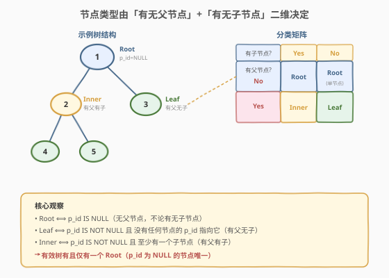
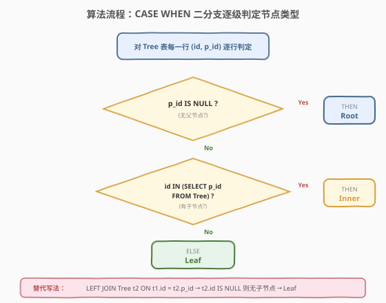
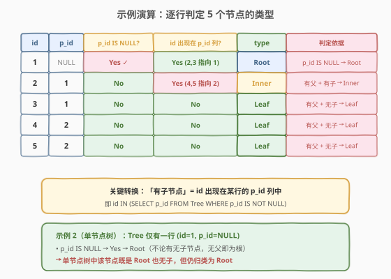

# LeetCode 树节点 题解

## 1. 题目概述

- **标题 / 题号**：树节点（#608，medium）
- **链接**：https://leetcode.cn/problems/tree-node/
- **难度**：中等
- **标签**：SQL、自连接、CASE WHEN、LEFT JOIN、子查询、IS NULL

**题意**：给定 `Tree` 表，每行记录树中一个节点的 `id` 及其父节点 `p_id`。编写 SQL 查询，报告树中每个节点的类型：

- **"Root"**：节点是树的根节点（无父节点）。
- **"Leaf"**：节点是叶子节点（有父节点但无子节点）。
- **"Inner"**：节点既不是叶子也不是根（有父节点且有子节点）。

以**任意顺序**返回结果表，包含 `id` 和 `type` 两列。

**表结构**：

```text
Table: Tree
+-------------+------+
| Column Name | Type |
+-------------+------+
| id          | int  |  ← 唯一值
| p_id        | int  |  ← 父节点 id（根节点为 NULL）
+-------------+------+
```

> 💡 **关键约束**：`id` 具有唯一值；给定的结构总是一个**有效的树**——即有且仅有一个根节点（`p_id` 为 `NULL`），其余节点 `p_id` 指向某个已存在的 `id`，且无环。树不一定是二叉树，一个节点可以有任意多个子节点。

**示例 1**：

```text
输入：
Tree 表:
+----+------+
| id | p_id |
+----+------+
| 1  | null |
| 2  | 1    |
| 3  | 1    |
| 4  | 2    |
| 5  | 2    |
+----+------+

输出：
+----+-------+
| id | type  |
+----+-------+
| 1  | Root  |
| 2  | Inner |
| 3  | Leaf  |
| 4  | Leaf  |
| 5  | Leaf  |
+----+-------+
```

**解释**：

- 节点 1 是根节点，因为它的 `p_id` 为 `NULL`，且它有子节点 2、3。
- 节点 2 是内部节点，因为它有父节点 1 且有子节点 4、5。
- 节点 3、4、5 是叶子节点，因为它们有父节点而无子节点。

**示例 2**（单节点树）：

```text
输入：
Tree 表:
+----+------+
| id | p_id |
+----+------+
| 1  | null |
+----+------+

输出：
+----+-------+
| id | type  |
+----+-------+
| 1  | Root  |
+----+-------+
```

**解释**：树中只有一个节点，`p_id` 为 `NULL`，归类为 Root（虽然它没有子节点，但"无父节点"足以判定为根）。

**约束**：

- `id` 是该表中具有唯一值的列
- 给定的结构总是一个有效的树（无环、单根、父节点都存在）
- 结果可以任意顺序返回

> 💡 本题与 [3054. 二叉树节点](https://leetcode.cn/problems/binary-tree-nodes/) 一致。核心考点是把"树结构语义"（根/内部/叶子）转化为"关系代数判定"（某列是否为 NULL、某值是否出现在另一列中）——这是 SQL 处理树/图结构的典型思路。

## 2. 解题思路

### 2.1 暴力思路：过程式逐行扫描

最直觉的过程式思路是：先找到 `p_id IS NULL` 的节点标为 Root；再对每个非根节点，扫描全表看有没有其他节点的 `p_id` 等于它，有则标 Inner，无则标 Leaf。这在 Python/Java 里是一个双层循环，但**纯 SQL 没有显式循环**——需要把"节点间的父子关系"转换为"集合操作"或"列间比较"。

> ⚠️ 本题的难点不在算法本身（分类逻辑很直观），而在于**如何用一条 SQL 表达"有子节点"这个条件**。一个节点"有子节点"等价于"存在某行的 `p_id` 等于它的 `id`"——这天然对应 `IN` 子查询、`EXISTS` 或自连接。

### 2.2 核心观察：节点类型由「有无父节点」+「有无子节点」二维决定



**关键洞察**：每个节点有两个布尔属性：

- **有父节点**：`p_id IS NOT NULL`
- **有子节点**：`id` 出现在某行的 `p_id` 列中，即 `id IN (SELECT p_id FROM Tree WHERE p_id IS NOT NULL)`

两者组合出三种类型（无父无子在有效树中不会出现，除非单节点树——单节点无父即 Root）：

| 有父节点? | 有子节点? | 类型 |
|-----------|-----------|------|
| No（`p_id IS NULL`） | Yes | **Root** |
| No（`p_id IS NULL`） | No | **Root**（单节点树） |
| Yes | Yes | **Inner** |
| Yes | No | **Leaf** |

$$\text{type}(v) = \begin{cases} \text{Root} & \text{if } v.\text{p\_id} \text{ IS NULL} \\ \text{Inner} & \text{if } v.\text{p\_id} \text{ IS NOT NULL} \land \exists\, u:\ u.\text{p\_id} = v.\text{id} \\ \text{Leaf} & \text{if } v.\text{p\_id} \text{ IS NOT NULL} \land \nexists\, u:\ u.\text{p\_id} = v.\text{id} \end{cases}$$

> 💡 **为何 Root 不看子节点**：有效树有且仅有一个 `p_id IS NULL` 的节点，它就是根——无论它有没有子节点（单节点树中根无子节点）。所以 `p_id IS NULL` 是判定 Root 的**充要条件**，无需再看子节点。判定顺序上先判 Root（`p_id IS NULL`），剩下的节点（有父）再看有无子节点区分 Inner/Leaf。

### 2.3 算法流程图



用 `CASE WHEN` 表达上述二维判定，按"先 Root → 再 Inner → 否则 Leaf"的顺序短路：

| 步骤 | 条件 | 结果 | SQL 表达 |
|------|------|------|----------|
| ① | `p_id IS NULL` | Root | `WHEN p_id IS NULL THEN 'Root'` |
| ② | `id` 出现在 `p_id` 列中 | Inner | `WHEN id IN (SELECT p_id FROM Tree WHERE p_id IS NOT NULL) THEN 'Inner'` |
| ③ | 否则（有父无子） | Leaf | `ELSE 'Leaf'` |

> 💡 **判定顺序很重要**：必须先判 `p_id IS NULL`（Root），因为根节点也可能"有子节点"（如示例 1 的节点 1），若先判"有子节点"会把根误判为 Inner。`CASE WHEN` 自上而下短路匹配，先 Root 把根节点"接走"，剩下的都是有父节点，再用"有子节点"区分 Inner/Leaf。

### 2.4 示例演算

以示例 1 为例，对 5 个节点逐行套用 `CASE WHEN`：



| id | p_id | p_id IS NULL? | id 出现在 p_id 列? | type | 判定依据 |
|----|------|---------------|---------------------|------|----------|
| 1 | NULL | Yes ✓ | Yes（2,3 指向 1） | **Root** | p_id IS NULL → Root |
| 2 | 1 | No | Yes（4,5 指向 2） | **Inner** | 有父 + 有子 → Inner |
| 3 | 1 | No | No | **Leaf** | 有父 + 无子 → Leaf |
| 4 | 2 | No | No | **Leaf** | 有父 + 无子 → Leaf |
| 5 | 2 | No | No | **Leaf** | 有父 + 无子 → Leaf |

> 💡 **"有子节点"的判定**：`p_id` 列的值是 `[NULL, 1, 1, 2, 2]`（去掉 NULL 后是 `[1, 1, 2, 2]`）。节点 1 的 `id=1` 出现在其中（2,3 的 `p_id` 都是 1）→ 有子；节点 3 的 `id=3` 不在其中 → 无子。这就是 `id IN (SELECT p_id FROM Tree WHERE p_id IS NOT NULL)` 的语义。

## 3. 参考代码

### SQL（解法 A：CASE + IN 子查询，推荐）

```sql
SELECT id,
    CASE
        WHEN p_id IS NULL THEN 'Root'
        WHEN id IN (SELECT p_id FROM Tree WHERE p_id IS NOT NULL) THEN 'Inner'
        ELSE 'Leaf'
    END AS type
FROM Tree;
```

> 💡 **写法要点**：
> - `WHEN p_id IS NULL THEN 'Root'` 先把根节点接走——`p_id IS NULL` 是判定 Root 的充要条件。
> - `WHEN id IN (SELECT p_id FROM Tree WHERE p_id IS NOT NULL) THEN 'Inner'` 判定"有子节点"：`id` 出现在某行的 `p_id` 中。子查询加 `WHERE p_id IS NOT NULL` 排除根节点的 NULL，避免 `IN` 的 NULL 三值逻辑陷阱（见 5.1 节）。
> - `ELSE 'Leaf'` 兜底：走到这里的一定是"有父 + 无子"的节点。
> - 语义最清晰，直接对应第 2.2 节的分类矩阵，面试首选。

### SQL（解法 B：LEFT JOIN 自连接 + GROUP BY）

```sql
SELECT t1.id,
    CASE
        WHEN t1.p_id IS NULL THEN 'Root'
        WHEN COUNT(t2.id) = 0 THEN 'Leaf'
        ELSE 'Inner'
    END AS type
FROM Tree t1
LEFT JOIN Tree t2 ON t1.id = t2.p_id
GROUP BY t1.id, t1.p_id;
```

> 💡 **写法要点**：
> - `LEFT JOIN Tree t2 ON t1.id = t2.p_id`：对每个节点 `t1`，找它的所有子节点 `t2`（即 `t2.p_id = t1.id` 的行）。`LEFT JOIN` 保证无子节点的行也保留（`t2.id` 为 NULL）。
> - `GROUP BY t1.id, t1.p_id`：一个节点可能有多个子节点（如节点 1 有 2、3 两个子），JOIN 后产生多行，需按 `t1.id` 分组聚合。
> - `COUNT(t2.id)`：`COUNT(列名)` 不计 NULL。无子节点时 `t2.id` 全为 NULL → `COUNT = 0` → Leaf；有子节点 → `COUNT > 0` → Inner。
> - `GROUP BY` 需包含 `t1.p_id`（标准 SQL 要求 SELECT 中非聚合列都在 GROUP BY 中；MySQL 5.7+ 默认 `ONLY_FULL_GROUP_BY` 也要求）。
> - 把"有子节点"转化为"JOIN 后子行数 > 0"，是 SQL 处理"存在性"的集合化思路。

### SQL（解法 C：EXISTS 相关子查询）

```sql
SELECT id,
    CASE
        WHEN p_id IS NULL THEN 'Root'
        WHEN EXISTS (SELECT 1 FROM Tree t2 WHERE t2.p_id = Tree.id) THEN 'Inner'
        ELSE 'Leaf'
    END AS type
FROM Tree;
```

> 💡 **写法要点**：
> - `EXISTS (SELECT 1 FROM Tree t2 WHERE t2.p_id = Tree.id)` 判定"是否存在某行的 `p_id` 等于当前 `id`"——相关子查询，外层每行都触发一次内层查询，找到第一行匹配即返回 `TRUE`（短路）。
> - `EXISTS` 比 `IN` 在某些场景下更高效：`IN` 会先把子查询**物化**为完整集合再做匹配；`EXISTS` 是**逐行相关**的，找到即停。本题数据量小两者差异不大，但大表上 `EXISTS` + 索引通常更优。
> - `EXISTS` 不受 NULL 三值逻辑影响（见 5.1 节），比 `IN` 更"安全"——无需额外加 `WHERE p_id IS NOT NULL`。

### Python（pandas）

```python
import pandas as pd

def tree_node(tree: pd.DataFrame) -> pd.DataFrame:
    parents = set(tree['p_id'].dropna())
    def classify(p_id, id_):
        if pd.isna(p_id):
            return 'Root'
        return 'Inner' if id_ in parents else 'Leaf'
    tree['type'] = [classify(p, i) for p, i in zip(tree['p_id'], tree['id'])]
    return tree[['id', 'type']]
```

> 💡 **pandas 对照**：`tree['p_id'].dropna()` 收集所有"作为父节点出现的 id"（对应 `SELECT p_id FROM Tree WHERE p_id IS NOT NULL`），转为集合用于 $O(1)$ 查询。`pd.isna(p_id)` 对应 `p_id IS NULL`。`id_ in parents` 对应 `id IN (SELECT p_id ...)`。用列表推导 + `zip` 逐行分类，避免 `apply` 的开销。最终返回 `id`、`type` 两列。

## 4. 复杂度分析

| 维度 | 复杂度 | 说明 |
|------|--------|------|
| **时间（解法 A：IN 子查询）** | $O(n^2)$ | $n$ = `Tree` 行数。外层扫描 $n$ 行，每行执行子查询 `SELECT p_id FROM Tree` 物化为集合 $O(n)$ + 匹配 $O(1)$~$O(n)$。若 `p_id` 有索引，子查询可走索引，整体近似 $O(n \log n)$ |
| **时间（解法 B：LEFT JOIN + GROUP BY）** | $O(n \log n)$ | 自连接最坏 $O(n^2)$（ Nested Loop），但 `p_id` 有索引时 JOIN 走索引 $O(n \log n)$；`GROUP BY` 排序 $O(n \log n)$ |
| **时间（解法 C：EXISTS）** | $O(n \log n)$ ~ $O(n^2)$ | 外层 $n$ 行，每行 `EXISTS` 相关子查询在 `p_id` 有索引时 $O(\log n)$ 查找 + 找到即停，整体 $O(n \log n)$；无索引 $O(n^2)$ |
| **空间** | $O(n)$ | 子查询物化结果集 / JOIN 中间结果 / GROUP BY 排序缓冲 |
| **结果行数** | $O(n)$ | 每个节点一行，共 $n$ 行 |

> ⚠️ SQL 复杂度高度依赖**执行计划与索引**：`p_id` 列若有索引，三种解法都接近 $O(n \log n)$；无索引时自连接/相关子查询退化为 $O(n^2)$。面试中说明「`id` 主键有聚簇索引、`p_id` 通常建二级索引，`EXISTS`/`LEFT JOIN` 均可走索引」即可。生产环境对 `p_id` 建索引是常规优化。

## 5. 扩展

### 5.1 IN 子查询的 NULL 三值逻辑陷阱

解法 A 的子查询特意加了 `WHERE p_id IS NOT NULL`。若去掉：

```sql
-- ⚠️ 有隐患的写法（缺少 WHERE p_id IS NOT NULL）
WHEN id IN (SELECT p_id FROM Tree) THEN 'Inner'
```

SQL 的 `IN` 遵循**三值逻辑**：`x IN (a, b, NULL)` 当 `x = a` 或 `x = b` 时返回 `TRUE`；当 `x` 不等于 `a`、`b` 时，由于 `x = NULL` 为 `UNKNOWN`，整个表达式返回 `UNKNOWN`（而非 `FALSE`）。在 `CASE WHEN` 中 `UNKNOWN` 被当作"不匹配"，会走到下一个分支——本题恰好是 `ELSE 'Leaf'`，结果**碰巧正确**。

但这是脆弱的"碰巧"：若 `CASE` 顺序调整或逻辑更复杂，`UNKNOWN` 会埋下隐蔽 bug。加 `WHERE p_id IS NOT NULL` 把 NULL 从子查询结果中剔除，`IN` 退化为正常的二值逻辑，语义更稳健。

> 💡 **口诀**：`IN` 子查询务必 `WHERE 列 IS NOT NULL` 过滤 NULL，或改用 `EXISTS`（不受 NULL 影响）。三值逻辑是 SQL 的经典陷阱，详见 [584. 寻找用户推荐人](../0501-0600/584_寻找用户推荐人.md)。

### 5.2 EXISTS vs IN：何时用哪个

| 维度 | `IN` | `EXISTS` |
|------|------|----------|
| **执行方式** | 先物化子查询为集合，再逐行匹配 | 逐行相关子查询，找到即停（短路） |
| **NULL 处理** | 受三值逻辑影响（需手动过滤 NULL） | 不受影响（`EXISTS` 只看有无行返回） |
| **适用场景** | 子查询结果集小、且驱动表（外查询）大 | 外查询结果集小、子查询表大（有索引） |
| **索引依赖** | 子查询结果常物化到内存 | 相关子查询走被驱动表的索引 |

本题数据量小，两者差异可忽略。经验法则：**子查询结果小用 `IN`，被驱动表大有索引用 `EXISTS`**。解法 A 用 `IN` 是因为语义直观；解法 C 用 `EXISTS` 是因为更"安全"且潜在更高效。

### 5.3 单节点树的边界

示例 2 是只有 1 个节点的树（`id=1, p_id=NULL`）。该节点：
- `p_id IS NULL` → 命中第一个 `WHEN` → Root。

虽然它没有子节点，但仍归类为 Root。这验证了"Root 的判定只看有无父节点，不看子节点"的设计——若错误地用"有子节点"先判，单节点会被误判为 Leaf。

> 💡 有效树的定义保证了：有且仅有一个 `p_id IS NULL` 的节点（根），所以 `WHEN p_id IS NULL THEN 'Root'` 恰好命中一行（示例 2）或多行中的那一行（示例 1 的节点 1）。不存在"无父无子"的孤立节点（除非数据不合法）。

### 5.4 通用化：判定"是否为叶子/根"的 SQL 范式

本题的"有子节点 = `id` 出现在 `p_id` 列"是一个通用范式，适用于所有"邻接表"（adjacency list）表示的树/图结构：

```sql
-- 找所有叶子节点（有父无子）
SELECT id FROM Tree
WHERE p_id IS NOT NULL
  AND id NOT IN (SELECT p_id FROM Tree WHERE p_id IS NOT NULL);

-- 找根节点
SELECT id FROM Tree WHERE p_id IS NULL;

-- 找所有内部节点
SELECT id FROM Tree
WHERE p_id IS NOT NULL
  AND id IN (SELECT p_id FROM Tree WHERE p_id IS NOT NULL);
```

> 💡 邻接表（每行存 `id` + `parent_id`）是数据库中表示树最常见的方式。判定"是否为叶子"= `id` 不作为任何行的 `parent_id` 出现，是 SQL 树查询的基础套路。递归查询（如 `WITH RECURSIVE`）处理更深的树遍历，但本题只需一层父子关系，无需递归。

## 6. 面试要点

1. **为什么 Root 的判定只看 `p_id IS NULL`，不看子节点？**

   - 有效树的定义保证有且仅有一个 `p_id IS NULL` 的节点，它就是根——无论有无子节点。单节点树中根无子节点，但仍为 Root。若先判"有子节点"，会把无子的根误判为 Leaf（或把有子的根误判为 Inner）。`CASE WHEN` 先用 `p_id IS NULL` 接走根节点，剩下的都有父，再用"有子节点"区分 Inner/Leaf。

2. **解法 A 的子查询为什么加 `WHERE p_id IS NOT NULL`？**

   - `IN` 遵循三值逻辑：`x IN (a, NULL)` 当 `x ≠ a` 时返回 `UNKNOWN`（非 `FALSE`）。本题中 `UNKNOWN` 在 `CASE` 里被当"不匹配"走 `ELSE`，结果碰巧正确，但这是脆弱的巧合。加 `WHERE p_id IS NOT NULL` 把 NULL 从子查询剔除，`IN` 退化为正常二值逻辑，语义稳健。或改用 `EXISTS`，天然不受 NULL 影响。

3. **解法 B 的 LEFT JOIN 为什么需要 GROUP BY？**

   - `LEFT JOIN Tree t2 ON t1.id = t2.p_id` 会让有多个子节点的父节点产生多行（如节点 1 有子 2、3 → JOIN 后 2 行）。若不 `GROUP BY`，结果会有重复行且无法用 `COUNT` 聚合。`GROUP BY t1.id, t1.p_id` 把同一父节点的多行合并，`COUNT(t2.id)` 计子节点数：0 → Leaf，>0 → Inner。`COUNT(列名)` 不计 NULL，所以无子节点（`t2.id` 为 NULL）得 0。

4. **解法 B 中 `COUNT(t2.id)` 和 `COUNT(*)` 的区别？**

   - `LEFT JOIN` 无子节点时会产生一行 `t2` 全为 NULL 的记录。`COUNT(*)` 计所有行（含 NULL 行）→ 永远 ≥ 1，无法区分有无子节点；`COUNT(t2.id)` 只计 `t2.id` 非 NULL 的行 → 无子节点时为 0。这是 `LEFT JOIN` + `COUNT` 判存在性的经典细节：**判存在性用 `COUNT(列)` 或 `IS NULL`，不要用 `COUNT(*)`**。

5. **`EXISTS` 和 `IN` 在本题中哪个更好？**

   - 语义上两者等价（都判定"id 是否出现在 p_id 列"）。`EXISTS` 逐行相关子查询、找到即停，大表 + 索引时通常更高效，且不受 NULL 三值逻辑影响；`IN` 子查询先物化集合，语义直观但需手动过滤 NULL。本题数据量小差异可忽略，面试中提一句"大表优先 EXISTS，注意 IN 的 NULL 陷阱"即可。

> 💡 **一句话总结**：608 教的是"把树结构语义转化为关系代数判定"——Root 看 `p_id IS NULL`，Leaf/Inner 看"id 是否出现在 `p_id` 列"。核心是 `CASE WHEN` + `IN`/`EXISTS`/`LEFT JOIN` 三种等价写法表达"有子节点"这个存在性条件。记住邻接表树查询的通用范式：叶子 = `id` 不作为任何行 `parent_id` 出现。

## 同类练习题

| # | 题目 | 与本题的关联 |
|---|------|-------------|
| 584 | [寻找用户推荐人](../0501-0600/584_寻找用户推荐人.md) | SQL `IS NULL` / `IS NOT NULL` 母题——过滤 `p_id` 为特定值或 NULL 的行，与本题判定"有无父节点"同源，巩固 NULL 三值逻辑 |
| 577 | [员工奖金](../0501-0600/577_员工奖金.md) | SQL `LEFT JOIN` + `IS NULL` 判存在性——找没有奖金的员工，与解法 B 用 `LEFT JOIN` 找无子节点同套路（`t2.id IS NULL` 即无子） |
| 196 | [删除重复的电子邮箱](../0101-0200/196_删除重复的电子邮箱.md) | SQL 自连接 DELETE——同一张表 JOIN 自身做行间比较，承接本题的 `Tree t1 JOIN Tree t2` 自连接思路（DELETE 场景） |
| 197 | [上升的温度](../0101-0200/197_上升的温度.md) | SQL 自连接 + `DATEDIFF`——"相邻日期"的行间关系比较，与本题"父子 id 关系"的自连接范式同源 |
| 262 | [行程和用户](../0201-0300/262_行程和用户.md) | SQL 多表 JOIN + 条件聚合 Hard 题——与本题共享"复杂行间关系"的 SQL 思维，巩固 `CASE WHEN` + 子查询组合 |
