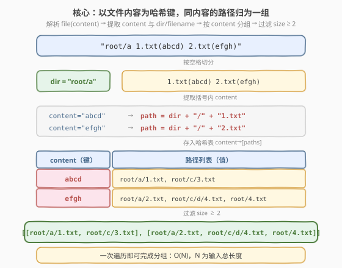
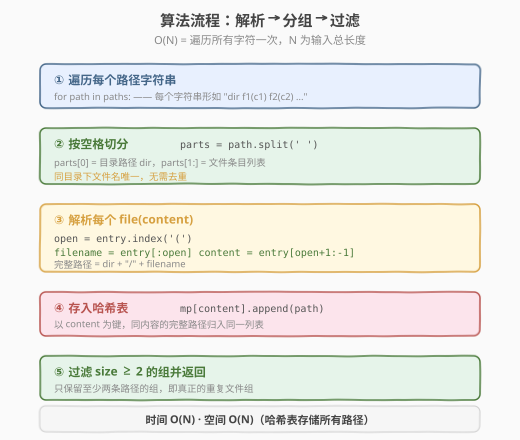
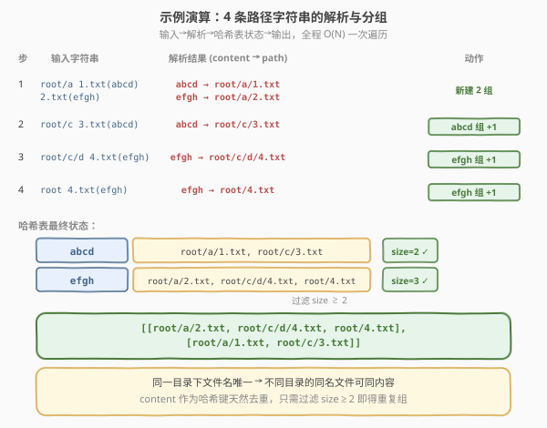

# 在系统中查找重复文件

- **题目名称**：在系统中查找重复文件
- **链接**：[609. 在系统中查找重复文件](https://leetcode.cn/problems/find-duplicate-file-in-system/)
- **难度**：中等
- **标签**：数组、哈希表、字符串

## 1. 题目概述

给定一个目录信息列表 `paths`，每个字符串描述一个目录及其下的所有文件（含文件内容）。要求按路径返回文件系统中所有**内容完全相同**的重复文件组，每组至少包含两个文件。

**输入格式**：单个字符串形如 `"root/d1/d2/.../dm f1.txt(f1_content) f2.txt(f2_content) ... fn.txt(fn_content)"`，其中目录路径与文件条目以空格分隔，每个文件条目为 `文件名(内容)`。

**输出格式**：重复文件路径组的列表，每组为内容相同的完整路径列表，格式 `"directory_path/file_name.txt"`，顺序任意。

**示例 1**：

```text
输入：paths = ["root/a 1.txt(abcd) 2.txt(efgh)","root/c 3.txt(abcd)","root/c/d 4.txt(efgh)","root 4.txt(efgh)"]
输出：[["root/a/2.txt","root/c/d/4.txt","root/4.txt"],["root/a/1.txt","root/c/3.txt"]]
解释：
  内容 "abcd" 出现在 root/a/1.txt 和 root/c/3.txt → 重复组
  内容 "efgh" 出现在 root/a/2.txt、root/c/d/4.txt、root/4.txt → 重复组
```

**示例 2**：

```text
输入：paths = ["root/a 1.txt(abcd) 2.txt(efgh)","root/c 3.txt(abcd)","root/c/d 4.txt(efgh)"]
输出：[["root/a/2.txt","root/c/d/4.txt"],["root/a/1.txt","root/c/3.txt"]]
```

**约束条件**：

- `1 <= paths.length <= 2 * 10^4`
- `1 <= paths[i].length <= 3000`
- `1 <= sum(paths[i].length) <= 5 * 10^5`
- `paths[i]` 由英文字母、数字、字符 `'/'`、`'.'`、`'('`、`')'` 和 `' '` 组成
- 同一目录中无文件或目录共享相同名称
- 每个目录信息代表唯一目录，目录路径和文件信息用单个空格分隔

> 💡 本题本质是**字符串解析 + 哈希表分组**。核心观察：文件内容天然可作为哈希键——只需一次遍历解析所有字符串，将「内容 → 路径列表」存入哈希表，最后过滤出 size ≥ 2 的组即可。这与 [49. 字母异位词分组](../0001-0100/49_字母异位词分组.md) 的思路一脉相承：以「不变的特征」为键聚合同类元素。

---

## 2. 解题思路

### 2.1 暴力思路：两两比较文件内容

最直接的做法：解析出所有文件的 `(路径, 内容)` 对，然后两两比较内容是否相同，相同的归为一组。

```text
files = parse(paths)          # [(path, content), ...]
for i in 0..n:
    for j in i+1..n:
        if files[i].content == files[j].content:
            merge(i, j)       # 并查集或标记合并
```

时间复杂度 $O(n^2 \cdot L)$，其中 $n$ 为文件总数，$L$ 为平均内容长度。当文件数量上万时，$10^8$ 级比较且每次比较可能涉及长字符串，**效率极低**。

> ⚠️ 暴力法的瓶颈在于「比较型」思路——逐对比较无法利用内容相同的传递性。破局思路：用**哈希表**把「比较」变成「寻址」，相同内容自然落入同一个桶。

### 2.2 核心观察：以内容为哈希键，一次遍历分组

**关键转换**：文件内容本身就是天然的哈希键。将每个文件的完整路径按其内容存入哈希表 `content → [path1, path2, ...]`，相同内容的路径自动归入同一列表。最后只需过滤出列表长度 ≥ 2 的组。



**为什么用内容做键而非文件名？** 题目要求找的是**内容相同**的文件，而非名字相同。不同目录下可以有同名文件（如 `root/a/4.txt` 和 `root/c/d/4.txt`），但内容未必相同；反之，不同名的文件可能内容一致。内容才是判定重复的唯一标准。

**解析技巧**：每个字符串 `path` 的结构固定——首段是目录（到第一个空格为止），之后每个空格分隔一个 `filename(content)` 条目。利用 `(` 和 `)` 的位置即可切出文件名和内容，无需正则。

> 💡 **与字母异位词分组的同构**：[49. 字母异位词分组](../0001-0100/49_字母异位词分组.md) 以「排序后的字符串」为键聚合同位词，本题以「文件内容」为键聚合重复文件。两者骨架完全一致：**提取不变特征 → 哈希分组 → 过滤/收集**。掌握这个「哈希分组」模板，可秒杀一切「按某种等价关系归类」的题目。

### 2.3 算法流程图



**完整步骤**：

1. **遍历** `paths` 中每个字符串 `path`
2. **按空格切分**：`parts = path.split(' ')`，`parts[0]` 为目录路径 `dir`，`parts[1:]` 为文件条目
3. **解析每个条目** `file(content)`：
   - 找到 `(` 的位置 `open_paren`
   - `filename = entry[:open_paren]`
   - `content = entry[open_paren + 1 : -1]`（去掉末尾 `)`）
   - 完整路径 = `dir + "/" + filename`
4. **存入哈希表**：`mp[content].append(full_path)`
5. **过滤并返回**：收集所有 `len(paths) >= 2` 的组

### 2.4 示例演算

以示例 1 的 4 条路径字符串为例：



| 步骤 | 输入字符串 | 解析结果 (content → path) | 动作 |
|------|-----------|--------------------------|------|
| 1 | `root/a 1.txt(abcd) 2.txt(efgh)` | abcd → root/a/1.txt, efgh → root/a/2.txt | 新建 2 组 |
| 2 | `root/c 3.txt(abcd)` | abcd → root/c/3.txt | abcd 组 +1 |
| 3 | `root/c/d 4.txt(efgh)` | efgh → root/c/d/4.txt | efgh 组 +1 |
| 4 | `root 4.txt(efgh)` | efgh → root/4.txt | efgh 组 +1 |

**哈希表最终状态**：

| content | 路径列表 | size |
|---------|---------|------|
| abcd | root/a/1.txt, root/c/3.txt | 2 ✓ |
| efgh | root/a/2.txt, root/c/d/4.txt, root/4.txt | 3 ✓ |

两组 size 均 ≥ 2，输出即为 `[["root/a/2.txt","root/c/d/4.txt","root/4.txt"], ["root/a/1.txt","root/c/3.txt"]]`，与示例 1 一致。

> 💡 **注意**：步骤 3 和步骤 4 中的 `4.txt` 分别位于 `root/c/d/` 和 `root/` 两个不同目录，同名但内容相同（都是 `efgh`），因此归入同一重复组。这正说明了「以内容为键」的必要性——文件名不能作为判定标准。

---

## 3. 参考代码

### C++

```cpp
// 在系统中查找重复文件.cpp —— 哈希表按内容分组
// 编译: g++ -O2 -std=c++17 在系统中查找重复文件.cpp -o dupfile
#include <vector>
#include <string>
#include <unordered_map>
#include <sstream>
using namespace std;

class Solution {
  public:
    vector<vector<string>> findDuplicate(vector<string>& paths) {
        unordered_map<string, vector<string>> mp;

        for (const string& path : paths) {
            stringstream ss(path);
            string dir;
            ss >> dir;                        // ① 首段 = 目录路径

            string entry;
            while (ss >> entry) {             // ② 逐个解析 file(content)
                int open = entry.find('(');
                string filename = entry.substr(0, open);
                string content  = entry.substr(open + 1, entry.size() - open - 2);
                mp[content].push_back(dir + "/" + filename);  // ③ 存入哈希表
            }
        }

        vector<vector<string>> result;
        for (auto& [content, files] : mp) {   // ④ 过滤 size ≥ 2
            if (files.size() >= 2) {
                result.push_back(move(files));
            }
        }
        return result;
    }
};
```

### Python

```python
class Solution:
    def findDuplicate(self, paths: list[str]) -> list[list[str]]:
        from collections import defaultdict
        mp = defaultdict(list)

        for path in paths:
            parts = path.split()                       # ① 按空格切分
            dir_path = parts[0]
            for entry in parts[1:]:                    # ② 逐个解析 file(content)
                open_paren = entry.index('(')
                filename = entry[:open_paren]
                content  = entry[open_paren + 1:-1]    # 去掉首尾的 ( )
                mp[content].append(dir_path + "/" + filename)  # ③ 存入哈希表

        return [files for files in mp.values() if len(files) >= 2]  # ④ 过滤
```

> 💡 **解析细节**：`entry[open_paren + 1 : -1]` 利用 Python 切片一步去掉 `(` 和 `)`——`open_paren + 1` 跳过 `(`，`-1` 排除末尾 `)`。C++ 中等价写法为 `substr(open + 1, size - open - 2)`，第二个参数是子串长度。注意 `content` 不会包含空格（题目保证文件信息以空格分隔），所以 `split()` 不会破坏内容完整性。

---

## 4. 复杂度分析

| 维度 | 复杂度 | 说明 |
|------|--------|------|
| **时间复杂度** | $O(N)$ | $N$ 为所有 `paths[i]` 长度之和。遍历每个字符一次（切分 + 提取内容），哈希表插入均摊 $O(1)$ |
| **空间复杂度** | $O(N)$ | 哈希表存储所有完整路径与内容字符串，总长度不超过 $N$ |
| **最优时间** | $O(N)$ | 已达信息论下界——必须读取每个字符才能知道内容 |

> ⚠️ **哈希表的最坏情况**：若所有文件内容各不相同，哈希表存 $n$ 个键值对但无重复组输出，空间仍为 $O(N)$。若哈希冲突严重（极端情况），单次插入退化为 $O(n)$，但实际中字符串哈希冲突概率极低，均摊 $O(1)$ 成立。

---

## 5. 扩展：真实文件系统中的重复文件查找

题目进阶部分问了几个关于真实文件系统的问题，这里统一讨论。

### 5.1 BFS vs DFS 搜索文件

在真实文件系统中搜索文件，**DFS（深度优先）** 更适合：

- 文件系统是树形结构，DFS 的递归语义与目录遍历天然匹配
- DFS 只需维护当前路径的栈，**空间开销 $O(\text{深度})$**；BFS 需要队列存储整层节点，对宽目录（如 `/usr/bin` 下数千文件）内存压力大
- DFS 天然产出完整路径（从根到叶），与本题的路径拼接逻辑一致

### 5.2 文件内容非常大（GB 级别）

当文件内容巨大时，不能将整个内容作为哈希键。改进策略：

1. **文件大小预筛选**：先按文件大小分组，只有大小相同的文件才可能内容相同——一次 `stat` 即可排除绝大多数
2. **哈希摘要**：对文件内容计算 MD5 / SHA-256 哈希，以摘要为键。计算哈希需读取整个文件，但摘要仅 16/32 字节
3. **采样指纹**：先取文件头部 + 尾部 + 中间各 1KB 计算快速指纹，指纹相同再做全量校验

### 5.3 每次只能读 1KB

将文件分块读取，逐块更新滚动哈希（如 [187. 重复的 DNA 序列](../0001-0100/187_重复的DNA序列.md) 的滚动哈希思想）：

- 读取 1KB → 更新哈希值 → 读取下一块 → ...
- 最终得到完整文件的哈希摘要，以摘要为键分组
- 时间复杂度 $O(\text{总文件大小})$，空间 $O(\text{文件数} \times \text{哈希长度})$

### 5.4 如何避免误报

哈希碰撞（不同内容产生相同摘要）会导致误报。解决方案：

- 使用 SHA-256 等抗碰撞哈希，碰撞概率 $< 2^{-128}$，实际可忽略
- 对哈希相同的文件做**逐字节比对**确认（only when hash matches，代价极小）

| 方案 | 时间 | 空间 | 适用场景 |
|------|------|------|----------|
| 全内容做键 | $O(N)$ | $O(N)$ | 内容短小（本题） |
| 大小预筛 + 哈希摘要 | $O(\text{总大小})$ | $O(\text{文件数})$ | GB 级真实文件 |
| 滚动哈希分块 | $O(\text{总大小})$ | $O(\text{文件数})$ | 流式读取 / 1KB 限制 |
| 哈希 + 逐字节确认 | $O(\text{总大小})$ | $O(\text{文件数})$ | 零误报要求 |

> 💡 **面试建议**：进阶问题考察的是「从理想模型到工程落地」的思维迁移。核心思路：**用更小的代理（大小、哈希摘要）替代完整内容**，在精度与效率间取衡。这与 [187. 重复的 DNA 序列](../0001-0100/187_重复的DNA序列.md) 用滚动哈希替代子串比较是同一思想。

---

## 6. 面试要点

1. **为什么用文件内容做哈希键而非文件名？**

   - 题目要求找**内容相同**的文件。不同目录可有同名文件但内容不同，不同名文件也可内容相同。
   - 文件名是路径的一部分（用于输出），但不是判定重复的依据。内容是唯一标准，因此做键。

2. **如何解析 `file(content)` 格式？**

   - 每个条目中 `(` 和 `)` 各出现一次且 `(` 在前。用 `find('(')` 定位 `(`，其前为文件名，`(` 到末尾 `)` 之间为内容。
   - 无需正则。Python 用 `entry.index('(')` + 切片 `[:open]` 和 `[open+1:-1]`；C++ 用 `find` + `substr`。

3. **为什么最后要过滤 size ≥ 2？**

   - 只出现一次的文件不是重复文件。哈希表中 size = 1 的组代表「该内容唯一」，不满足「至少两个」的定义。
   - 题目要求返回的是**重复文件组**，每组至少两个路径。

4. **与字母异位词分组有什么联系？**

   - 两者骨架一致：**提取不变特征 → 哈希分组 → 收集结果**。
   - [49. 字母异位词分组](https://leetcode.cn/problems/group-anagrams/) 以排序后的字符串为键（同位词排序后相同），本题以文件内容为键。
   - 差异：字母异位词分组收集所有组（含 size=1），本题只收集重复组（size≥2）。

5. **如果文件内容包含空格怎么办？**

   - 本题保证文件信息以空格分隔，内容不含空格。但若内容可含空格，需改用 `(` 定位内容起始、`)` 定位内容结束，而非依赖空格切分——即从 `(` 到最后一个 `)` 之间全部为内容。

> 💡 **一句话总结**：在系统中查找重复文件是「哈希表分组」的招牌题——以文件内容为哈希键，一次遍历解析所有路径字符串并按内容分组，最后过滤出 size ≥ 2 的组。它与字母异位词分组同构：提取不变特征 → 哈希分组 → 收集结果。进阶部分将「内容做键」扩展到「哈希摘要做键」，体现了从理想模型到工程落地的思维迁移。

---

## 7. 同类练习题

- [49. 字母异位词分组](https://leetcode.cn/problems/group-anagrams/)：哈希表分组的母题，以排序后的字符串为键聚合同位词
- [187. 重复的 DNA 序列](https://leetcode.cn/problems/repeated-dna-sequences/)：滚动哈希查找重复子串，进阶版「内容太大时用哈希摘要替代」的体现
- [692. 前 K 个高频单词](https://leetcode.cn/problems/top-k-frequent-words/)：哈希表统计频率 + Top-K，哈希计数的变体应用
- [454. 四数相加 II](https://leetcode.cn/problems/4sum-ii/)：分组 + 哈希（Meet in the Middle），哈希表分组思想的另一面
