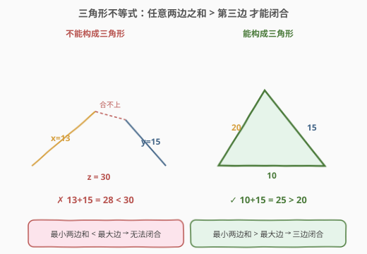
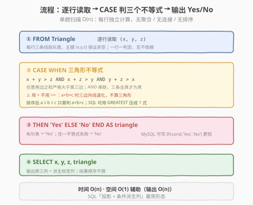
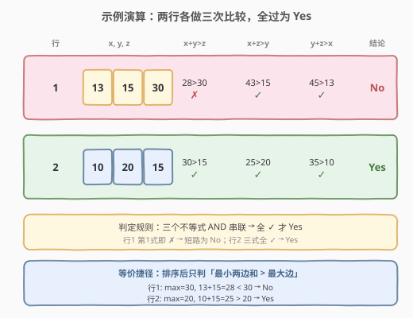

# 判断三角形

- **题目名称**：判断三角形
- **链接**：[610. 判断三角形](https://leetcode.cn/problems/triangle-judgement/)
- **难度**：简单
- **标签**：SQL、CASE WHEN、数学、三角形不等式

## 1. 题目概述

给定 `Triangle` 表，每行存放三条线段的长度 `x`、`y`、`z`。编写 SQL 查询，对每行判断这三条线段能否构成一个**非退化三角形**，输出原三列并追加一列 `triangle`（取值 `"Yes"` / `"No"`），结果顺序不限。

**表结构**：

```text
Table: Triangle
+-------------+------+
| Column Name | Type |
+-------------+------+
| x           | int  |
| y           | int  |
| z           | int  |
+-------------+------+
```

> 💡 **关键约束**：`(x, y, z)` 是复合主键——同一行的三个值代表三条线段长度。题目要的是**逐行判定**：每行独立判断能否构成三角形，无需跨行聚合、连接或排序。

**示例 1**：

```text
输入：
Triangle 表:
+----+----+----+
| x  | y  | z  |
+----+----+----+
| 13 | 15 | 30 |
| 10 | 20 | 15 |
+----+----+----+

输出：
+----+----+----+----------+
| x  | y  | z  | triangle |
+----+----+----+----------+
| 13 | 15 | 30 | No       |
| 10 | 20 | 15 | Yes      |
+----+----+----+----------+
```

**解释**：

- 行 `(13, 15, 30)`：13 + 15 = 28 < 30，两边之和小于第三边，无法构成三角形 → `No`
- 行 `(10, 20, 15)`：任意两边之和都大于第三边（10+20>15、10+15>20、20+15>10）→ `Yes`

**约束条件**：

- `(x, y, z)` 为 `Triangle` 表的主键
- `x`、`y`、`z` 为整数
- 结果以任意顺序返回，新增列名为 `triangle`

> 💡 **核心考点**：把几何定理「三角形不等式」翻译成 SQL 的布尔表达式，再用 `CASE WHEN` 把布尔结果映射成 `"Yes"`/`"No"` 字符串。这是 SQL「逐行计算 + 条件派生列」的最简形态——无聚合、无连接、无排序。

---

## 2. 解题思路

### 2.1 暴力思路：写出三个不等式

三角形不等式定理：三条线段能构成三角形，当且仅当**任意两边之和严格大于第三边**。对 `(x, y, z)` 需同时满足：

- $x + y > z$
- $x + z > y$
- $y + z > x$

最直觉的做法是把这三个不等式逐一写出，用 `AND` 串联，全部成立即为三角形。这正是 SQL 的强项——把数学条件直接转成 `CASE WHEN` 里的布尔表达式。

> ⚠️ **必须「严格大于」而非「大于等于」**：若 $a + b = c$（如 1, 2, 3），三条线段共线退化成一条直线，是「退化三角形」，不构成真正的三角形。题目要求 non-degenerate triangle，故用 `>` 不用 `>=`。

### 2.2 核心观察：排序后只需一次比较



虽然判定式有三个不等式，但若先把三边排序成 $a \le b \le c$，则只需判断 $a + b > c$ 一条：

- $a + c \ge b$：因 $c \ge b$，故 $a + c \ge c \ge b$ 恒成立
- $b + c \ge a$：因 $c \ge a$，故 $b + c \ge a$ 恒成立

即「最小两边之和 > 最大边」是三角形存在的**充要条件**。在 SQL 中可用 `GREATEST` 取最大边，把三次比较压缩为一次（见第 5 节）。但默认解法直接写三个不等式最清晰、不易出错——可读性优先。

$$\text{triangle}(x, y, z) \iff (x + y > z) \land (x + z > y) \land (y + z > x) \iff a + b > c \quad (a \le b \le c)$$

以示例对照：

- `(13, 15, 30)`：排序 13 ≤ 15 ≤ 30，13 + 15 = 28 < 30 → **不成立** → `No`
- `(10, 20, 15)`：排序 10 ≤ 15 ≤ 20，10 + 15 = 25 > 20 → **成立** → `Yes`

> 💡 **与 611 的呼应**：[611. 有效三角形的个数](../0601-0700/611_有效三角形的个数.md) 正是利用这个观察——先排序数组，固定最大边 `c = nums[k]`，再用双指针在 `[0, k-1]` 中数 `a + b > c` 的对数。610 是同一几何定理的 SQL 单行版，611 是其数组计数版。

### 2.3 算法流程图



| 步骤 | 子句 | 作用 |
|------|------|------|
| ① | `FROM Triangle` | 逐行读取三条线段 `(x, y, z)` |
| ② | `CASE WHEN x+y>z AND x+z>y AND y+z>x` | 三角形不等式三条件同时判定 |
| ③ | `THEN 'Yes' ELSE 'No' END AS triangle` | 布尔结果映射为字符串标签 |

> 💡 **执行顺序**：`FROM Triangle` 取每行 → `CASE` 对当前行的 `x, y, z` 求值 → 输出原三列 + 计算列 `triangle`。全程无聚合、无排序，每行独立处理，是 SQL 最朴素的「投影 + 派生列」模式。

### 2.4 示例演算

以示例两行为例，逐行展开三个不等式的判定：



| 行 | x, y, z | x+y>z | x+z>y | y+z>x | 结论 |
|----|---------|-------|-------|-------|------|
| 1 | 13, 15, 30 | 28>30 ✗ | 43>15 ✓ | 45>13 ✓ | **No**（第 1 条即失败） |
| 2 | 10, 20, 15 | 30>15 ✓ | 25>20 ✓ | 35>10 ✓ | **Yes**（三条全过） |

> 💡 **短路思维**：`AND` 串联时，遇到第一个 `false` 即可判定为 `No`，无需计算后续。行 1 的 `x+y>z` 为 `28>30 = false`，理论上后续两条不必算。但 SQL 引擎未必按短路优化，且三式都是简单算术，性能无差异——关键是逻辑上「三条全过才算 Yes」。

---

## 3. 参考代码

### SQL（解法 A：CASE WHEN + 三个不等式，推荐）

```sql
SELECT x, y, z,
       CASE
           WHEN x + y > z AND x + z > y AND y + z > x THEN 'Yes'
           ELSE 'No'
       END AS triangle
FROM Triangle;
```

> 💡 **写法要点**：
> - `CASE WHEN <布尔表达式> THEN 'Yes' ELSE 'No' END` 把三角形不等式的真假映射为字符串标签——SQL「条件派生列」的标准写法。
> - 三个不等式用 `AND` 串联：任意一条不满足即整体 `false` → 走 `ELSE 'No'`。
> - `CASE` 是 SQL 标准语法，跨数据库通用；MySQL 也可用 `IF(...)` 简写（见解法 B）。

### SQL（解法 B：MySQL IF 简写）

```sql
SELECT x, y, z,
       IF(x + y > z AND x + z > y AND y + z > x, 'Yes', 'No') AS triangle
FROM Triangle;
```

> 💡 **IF vs CASE**：`IF(cond, a, b)` 是 MySQL 专有函数，等价于 `CASE WHEN cond THEN a ELSE b END`。写法更短但不跨库（PostgreSQL / SQL Server 无 `IF`）。LeetCode 用 MySQL，两者皆可；面试中若强调可移植性，优先 `CASE`。

### SQL（解法 C：GREATEST 压缩为一次比较）

```sql
SELECT x, y, z,
       IF(x + y + z > 2 * GREATEST(x, y, z), 'Yes', 'No') AS triangle
FROM Triangle;
```

> 💡 **数学优化**：设 $c = \max(x, y, z)$，则「最小两边之和 > 最大边」等价于 $(x+y+z) - c > c$，即 $x + y + z > 2c$。`GREATEST(x, y, z)` 取最大边，一次比较搞定。等价但更紧凑——代价是可读性略降，需解释「总和 > 2 倍最大边」的几何含义。

### Python（pandas）

```python
import pandas as pd

def judge_triangle(triangle: pd.DataFrame) -> pd.DataFrame:
    cond = (
        (triangle['x'] + triangle['y'] > triangle['z'])
        & (triangle['x'] + triangle['z'] > triangle['y'])
        & (triangle['y'] + triangle['z'] > triangle['x'])
    )
    triangle = triangle.copy()
    triangle['triangle'] = cond.map({True: 'Yes', False: 'No'})
    return triangle[['x', 'y', 'z', 'triangle']]
```

> 💡 **pandas 对照**：`+` / `>` 对整列做向量化算术，`&` 串联三个布尔 Series（注意用 `&` 不是 `and`，且加括号防优先级错乱）→ 得布尔掩码。`.map({True: 'Yes', False: 'No'})` 对应 `CASE WHEN ... THEN 'Yes' ELSE 'No' END`。逻辑与 SQL 完全一致，只是从「行级」变成「列级」向量化。

---

## 4. 复杂度分析

| 维度 | 复杂度 | 说明 |
|------|--------|------|
| **时间** | $O(n)$ | $n$ = `Triangle` 行数。每行做 3 次加法 + 3 次比较（解法 C 仅 1 次比较），与行数成正比，无排序无聚合 |
| **空间** | $O(1)$ 辅助 | 除输出外无额外中间结构；输出结果集 $n$ 行 4 列为 $O(n)$ |
| **结果行数** | $O(n)$ | 一对一：输入 $n$ 行 → 输出 $n$ 行，不增不减 |

> ⚠️ 本题是 SQL「逐行投影」的最简形态——每行独立计算，无 `GROUP BY` / `JOIN` / `ORDER BY`，时间严格 $O(n)$，瓶颈只在读取表本身。面试中说明「无聚合、无连接，单趟扫描 $O(n)$」即可。

---

## 5. 扩展

### 5.1 退化三角形与边界值

题目要求 non-degenerate triangle（非退化三角形），故用严格大于 `>`。若 $a + b = c$（如 1, 2, 3），三边共线退化，应判 `No`。这与几何定义一致：三角形要求三个非共线顶点。

| 三边 | a+b vs c | 判定 | 说明 |
|------|----------|------|------|
| 3, 4, 5 | 3+4=7 > 5 | Yes | 直角三角形 |
| 1, 2, 3 | 1+2=3 = 3 | No | 退化（共线） |
| 0, 5, 5 | 0+5=5 = 5 | No | 零长边，退化 |
| 13, 15, 30 | 13+15=28 < 30 | No | 两边之和 < 第三边 |

> 💡 严格 `>` 天然排除零边和负边：若某边 $\le 0$，必存在一条不等式失败（如 0, 5, 5：0+5>5 为 false）。故无需额外校验「边长为正」。

### 5.2 GREATEST 写法的等价性

解法 C 用 `x + y + z > 2 * GREATEST(x, y, z)`。设 $c = \max(x, y, z)$，其余两边之和 $= (x+y+z) - c$。判定式 $(x+y+z) - c > c \iff x + y + z > 2c$。

该化简依赖「排序后只需 $a + b > c$」这一前提，而后者又依赖边长为正（见 2.2）。若允许负边长，$a + c \ge b$ 不再恒成立——但线段长度物理上非负，SQL `int` 列若存了负值属于脏数据，不在题目语义内。

### 5.3 NULL 处理

若 `x / y / z` 可能为 `NULL`，`NULL + 数值 = NULL`，`NULL > 数值` 的结果为 `UNKNOWN`，`AND` 遇 `UNKNOWN` 视同 `false` → 走 `ELSE 'No'`。即含 `NULL` 的行自然判 `No`，符合直觉（缺失边长无法构成三角形）。本题主键 `(x, y, z)` 保证非空，无需 `IFNULL`；生产环境可能需 `COALESCE(col, 0)` 兜底。

---

## 6. 面试要点

1. **三角形不等式为什么是三条而不是一条？**

   - 完整判定需「任意两边之和 > 第三边」共三条。但若先排序 $a \le b \le c$，则 $a + c > b$ 和 $b + c > a$ 在 $c$ 最大时自然成立（因 $c \ge b \ge a$），只剩 $a + b > c$ 一条关键判定。SQL 中可用 `GREATEST` 取 $c$，把三式压成 `x+y+z > 2*GREATEST(x,y,z)` 一式。

2. **为什么用 `>` 而不是 `>=`？**

   - 题目要求「非退化三角形」。$a + b = c$ 时三边共线，退化为一条线段，不是真正的三角形。用 `>=` 会把退化情形误判为 `Yes`。

3. **`CASE WHEN ... THEN ... ELSE ... END` 的执行逻辑是什么？**

   - 逐行求值：对每行的 `x, y, z` 计算 `WHEN` 后的布尔表达式，为 `TRUE` 则返回 `THEN` 值（`'Yes'`），否则走 `ELSE`（`'No'`）。无聚合、无跨行依赖，是 SQL「条件派生列」的标准范式。

4. **`IF` 和 `CASE` 有什么区别？**

   - `IF(cond, a, b)` 是 MySQL 专有函数，只支持单一条件二选一；`CASE WHEN` 是 SQL 标准，支持多个 `WHEN` 分支，跨库通用。本题单条件二选一，两者等价；多分支分类（如 608 树节点的 Root / Inner / Leaf）只能用 `CASE`。

5. **为什么不需要 `GROUP BY` 或 `ORDER BY`？**

   - 题目是「逐行判定」——每行独立计算一个 `triangle` 标签，无需跨行聚合（`GROUP BY` 用于分组统计），结果顺序不限（无需 `ORDER BY`）。这是 SQL 最基础的「投影 + 派生列」查询：`SELECT 原列, 派生列 FROM 表`。

> 💡 **一句话总结**：610 是三角形不等式的 SQL 单行版——把「任意两边之和 > 第三边」翻译成 `AND` 串联的布尔表达式，用 `CASE WHEN` 映射成 `Yes / No`。核心是「逐行投影」无聚合，对照 611 的「排序 + 双指针计数」理解同一几何定理的两种考法。

---

## 7. 同类练习题

- [611. 有效三角形的个数](../0601-0700/611_有效三角形的个数.md)：同一三角形不等式的数组计数版——排序后固定最大边 + 双指针数 `a+b>c` 的对数，610 是其 SQL 单行判定版
- [608. 树节点](https://leetcode.cn/problems/tree-node/)：SQL `CASE WHEN` 多分支分类——按 `p_id` 是否为空、是否有子节点判 Root / Inner / Leaf，对照 610 的单分支二选一理解 `CASE` 的多分支用法
- [627. 变更性别](https://leetcode.cn/problems/swap-salary/)：SQL `CASE WHEN` / `IF` 条件表达式——`UPDATE ... SET sex = CASE WHEN sex='m' THEN 'f' ELSE 'm' END`，同一套条件派生模式用于 UPDATE 场景
- [197. 上升的温度](https://leetcode.cn/problems/rising-temperature/)：SQL 简单条件比较——`DATEDIFF` + 自连接判「相邻日期温度更高」，对比 610 理解「行内比较」与「行间比较」的差异
