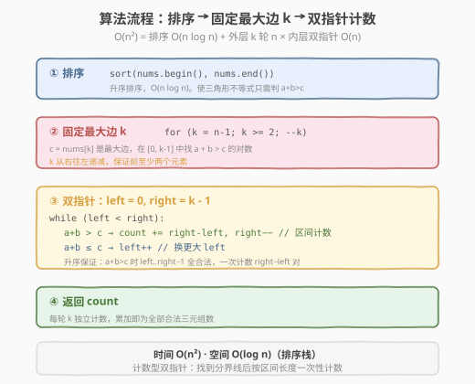

# LeetCode 有效三角形的个数 题解

## 1. 题目概述

- **标题 / 题号**：有效三角形的个数（#611，medium）
- **链接**：https://leetcode.cn/problems/valid-triangle-number/
- **难度**：中等
- **标签**：数组、双指针、排序、二分查找

**题意**：给定一个非负整数数组 `nums`，返回其中可以组成**三角形三条边**的三元组个数。三元组中的元素下标必须互不相同（即同一元素值可复用但同一位置不可重复选取）。

**示例 1**：

```text
输入：nums = [2,2,3,4]
输出：3
解释：有效的组合如下：
  (2,2,3)  2+2 > 3 ✓
  (2,3,4)  2+3 > 4 ✓
  (2,3,4)  2+3 > 4 ✓（使用另一个 2）
```

**示例 2**：

```text
输入：nums = [4,2,3,4]
输出：4
解释：有效的组合如下：
  (4,2,3)  2+3 > 4 ✓
  (4,3,4)  3+4 > 4 ✓
  (2,3,4)  2+3 > 4 ✓
  (2,3,4)  2+3 > 4 ✓（使用另一个 4）
```

**约束**：

- `1 <= nums.length <= 1000`
- `0 <= nums[i] <= 1000`

> 💡 这是 [面试经典 150 题](https://leetcode.cn/studyplan/top-interview-150/) 中的双指针招牌题。它与 [15. 三数之和](../0001-0100/15_三数之和.md) 形同骨架异灵魂——同样是「排序 + 固定一个 + 双指针扫剩余」，但三数之和是**枚举等于定值的三元组**（找到即记录），而本题是**计数满足不等式的三元组**（找到一条分界线，分界线一侧全部合法）。这个「双指针按区间计数」的变体，在 [LintCode 57/58 三数之和小于/大于目标](https://www.lintcode.com/problem/57/) 中也有体现，是双指针模板的重要分支。

## 2. 解题思路

### 2.1 暴力思路：三重循环枚举

最直接的做法：三重循环枚举所有 `(i, j, k)` 组合，对每组判断能否构成三角形。

三角形不等式：任意两边之和大于第三边。若先排序使 $a \le b \le c$，则只需判断 $a + b > c$（其余两条不等式 $a + c > b$、$b + c > a$ 在 $c$ 最大时自然成立）。

```text
count = 0
for i in 0..n:
    for j in i+1..n:
        for k in j+1..n:
            a, b, c = sorted(nums[i], nums[j], nums[k])
            if a + b > c: count += 1
```

时间复杂度 $O(n^3)$，`n=1000` 时约 $10^9$ 次运算，**超时**。且每组都要排序判断，常数更大。

> ⚠️ 暴力法的瓶颈在于三重循环。破局思路：**先整体排序**，把"无序数组"变成"升序数组"，然后利用单调性把内层两重循环合并成一次双指针扫描——与三数之和分析完全同构，但计数方式不同。

### 2.2 核心观察：排序 + 固定最大边 + 双指针计数

**关键转换**：先对数组**升序排序**。排序后，固定最大边 `nums[k]`（`k` 从 `n-1` 到 `2`），在区间 `[0, k-1]` 中用左右双指针 `left`/`right` 计数满足 `nums[left] + nums[right] > nums[k]` 的对数。

![核心：固定最大边 k，双指针在 [0, k-1] 中计数 a+b>c 的对数](../images/triangle_two_pointers.svg)

**为什么固定最大边而非最小边？** 三角形不等式只需判断 $a + b > c$（其中 $c$ 最大）。固定 $c$ 后，问题变为「在 $c$ 之前的元素中找多少对 $(a, b)$ 满足 $a + b > c$」——这是一个经典的**有序数组双指针计数问题**。若固定最小边则无法这样降维。

**双指针移动规则**（固定 `k`，`left = 0`，`right = k - 1`）：

- 若 `nums[left] + nums[right] > nums[k]`：`left` 到 `right - 1` 之间的所有元素 `left'` 都满足 `nums[left'] + nums[right] > nums[k]`（因为数组升序，`nums[left'] >= nums[left]`）。因此**一次性计数** `right - left` 对，然后 `right--`
- 若 `nums[left] + nums[right] <= nums[k]`：和不够大，`left++`（换一个更大的 `left`）

> 💡 **为什么双指针不会漏解也不会重复计数？** 当 `nums[left] + nums[right] > nums[k]` 时，固定 `right` 不动，`left` 到 `right - 1` 的每个元素配 `right` 都合法——共 `right - left` 对。计数后 `right--`，这些 `(left', right)` 对已全部计入，不会再被访问。当 `nums[left] + nums[right] <= nums[k]` 时，当前 `left` 与任何 `right' <= right` 配对都更小，不合法，`left` 可安全右移。单调性保证不漏不重。

### 2.3 算法流程图



**完整步骤**：

1. **排序**：`nums` 升序排序，$O(n \log n)$
2. **固定最大边** `k`：从 `n - 1` 递减到 `2`（保证 `k` 前至少有两个元素）
3. **双指针计数**：`left = 0`，`right = k - 1`
   - 若 `nums[left] + nums[right] > nums[k]`：`count += right - left`，`right--`
   - 若 `nums[left] + nums[right] <= nums[k]`：`left++`
4. 返回 `count`

### 2.4 示例演算

以 `nums = [2,2,3,4]`（已排序），`n = 4` 为例：


| 步骤 | k | nums[k] | left | right | nums[l]+nums[r] | 判定 | 动作 | 本轮计数 |
|------|---|---------|------|-------|-----------------|------|------|----------|
| 1 | 3 | 4 | 0 (2) | 2 (3) | 2+3=5 | 5 > 4 ✓ | count += 2, right-- | +2 |
| 2 | 3 | 4 | 0 (2) | 1 (2) | 2+2=4 | 4 ≤ 4 ✗ | left++ | — |
| 3 | 3 | 4 | 1 (2) | 1 (2) | left ≥ right，结束 | — | — | — |
| 4 | 2 | 3 | 0 (2) | 1 (2) | 2+2=4 | 4 > 3 ✓ | count += 1, right-- | +1 |
| 5 | 2 | 3 | 0 (2) | 0 (2) | left ≥ right，结束 | — | — | — |

**总计** `count = 2 + 1 = 3`，与示例 1 一致。

**步骤 1 详解**：`k=3` 时 `nums[k]=4`，`left=0` 指向 `2`，`right=2` 指向 `3`。`2+3=5 > 4`，所以 `left` 从 `0` 到 `right-1=1` 的每个元素（`2` 和 `2`）配 `right`（`3`）都合法——即 `(2,3,4)` 和 `(2,3,4)` 两种组合。计数 `right - left = 2` 后 `right--`。

> 💡 **与三数之和的计数差异**：三数之和找到等于 target 的就记录一组再移动；本题找到 `a + b > c` 后，是**一整段区间**都合法，直接按区间长度 `right - left` 计数——这是「计数型双指针」的标志特征，也是面试中最容易讲不清的点。

## 3. 参考代码

### C++

```cpp
// 有效三角形的个数.cpp —— 排序 + 固定最大边 + 双指针计数
// 编译: g++ -O2 -std=c++17 有效三角形的个数.cpp -o triangle
#include <vector>
#include <algorithm>
using namespace std;

class Solution {
  public:
    int triangleNumber(vector<int>& nums) {
        sort(nums.begin(), nums.end()); // ① 排序
        int n = nums.size();
        int count = 0;

        for (int k = n - 1; k >= 2; --k) { // ② 固定最大边
            int left = 0, right = k - 1;    // ③ 双指针
            while (left < right) {
                if (nums[left] + nums[right] > nums[k]) {
                    count += right - left; // left..right-1 全部合法
                    --right;
                } else {
                    ++left;
                }
            }
        }
        return count;
    }
};
```

### Python

```python
class Solution:
    def triangleNumber(self, nums: list[int]) -> int:
        nums.sort()                          # ① 排序
        n = len(nums)
        count = 0

        for k in range(n - 1, 1, -1):        # ② 固定最大边
            left, right = 0, k - 1           # ③ 双指针
            while left < right:
                if nums[left] + nums[right] > nums[k]:
                    count += right - left    # left..right-1 全部合法
                    right -= 1
                else:
                    left += 1
        return count
```

> 💡 **边界细节**：`nums` 中可能含 `0`。排序后 `0` 在最左，`nums[left]=0` 时 `0 + nums[right] <= nums[k]`（因为 `nums[right] <= nums[k]`），必然走 `left++` 分支，自动跳过——无需特判。这也是排序解法的优雅之处。

## 4. 复杂度分析

| 维度 | 复杂度 | 说明 |
|------|--------|------|
| **时间复杂度** | $O(n^2)$ | 排序 $O(n \log n)$ + 外层 `k` 轮 $n$ × 内层双指针 $O(n)$ = $O(n^2)$ |
| **空间复杂度** | $O(\log n)$ | 排序的栈空间（C++ `sort` 为快排变种） |
| **最优时间** | $O(n^2)$ | 已知最优解；无 $O(n \log n)$ 解法 |

> ⚠️ **二分查找解法**：固定 `(k, left)` 后二分找最大的 `right` 使 `nums[left] + nums[right] > nums[k]`，时间同为 $O(n^2 \log n)$，比双指针慢。双指针利用了上一轮的移动结果（单调性），把二分的 $\log n$ 因子消掉，是更优选择。

## 5. 扩展：二分查找解法

双指针并非唯一解法。固定最大边 `k` 后，对于每个 `left`，可用**二分查找**在 `[left+1, k-1]` 中找满足 `nums[left] + nums[right] > nums[k]` 的最左 `right`，其右侧到 `k-1` 全部合法。

```python
class Solution:
    def triangleNumber(self, nums: list[int]) -> int:
        nums.sort()
        n = len(nums)
        count = 0
        for k in range(n - 1, 1, -1):
            for left in range(k):
                # 二分找第一个 right 使 nums[left] + nums[right] > nums[k]
                lo, hi = left + 1, k - 1
                bound = left  # 默认无合法 right
                while lo <= hi:
                    mid = (lo + hi) // 2
                    if nums[left] + nums[mid] > nums[k]:
                        bound = mid
                        hi = mid - 1
                    else:
                        lo = mid + 1
                if bound > left:
                    count += k - bound
        return count
```

时间 $O(n^2 \log n)$，空间 $O(\log n)$。适合在面试中作为「暴力 $\to$ 二分 $\to$ 双指针」的渐进优化思路展示——先讲二分（容易想到），再优化为双指针（利用单调性消 $\log n$），体现「$O(n^3) \to O(n^2 \log n) \to O(n^2)$」的三级跳。

| 解法 | 时间 | 空间 | 思路 |
|------|------|------|------|
| 三重循环 | $O(n^3)$ | $O(1)$ | 暴力枚举 + 排序判三角形 |
| 二分查找 | $O(n^2 \log n)$ | $O(\log n)$ | 固定 `(k, left)`，二分找 `right` 下界 |
| **双指针** | $O(n^2)$ | $O(\log n)$ | 固定 `k`，双指针单调移动 + 区间计数 |

> 💡 **面试建议**：先讲暴力 $O(n^3)$，再引出排序 + 二分 $O(n^2 \log n)$，最后优化为双指针 $O(n^2)$。这条「渐进优化」讲法比直接写双指针更能体现思维过程，是面试加分项。

## 6. 面试要点

1. **三角形不等式为什么只需判断 $a + b > c$？**

   - 三条边 $a \le b \le c$ 时，$a + c \ge b$ 和 $b + c \ge a$ 自然成立（$c$ 最大）。唯一可能不满足的是 $a + b > c$——两短边之和是否大于最长边。
   - 所以排序后只需一次比较。这是本题把 $O(n^3)$ 判断降到可操作的关键观察。

2. **为什么固定最大边而非最小边？**

   - 固定最大边 $c$ 后，问题是「找两数之和 $> c$ 的对数」——双指针或二分的标准模型。
   - 若固定最小边 $a$，问题是「找两数之差 $< a$ 的对数」，无法直接用双指针单调移动（因为 $b + c$ 随 $b$、$c$ 同向变化，单调性不成立）。
   - 这是面试高频追问点，核心是「把不等式转化为双指针可处理的单调形式」。

3. **双指针计数时 `count += right - left` 的正确性？**

   - 当 `nums[left] + nums[right] > nums[k]` 时，数组升序，`left` 到 `right - 1` 的每个 `left'` 满足 `nums[left'] >= nums[left]`，所以 `nums[left'] + nums[right] > nums[k]` 也成立。
   - 这 `right - left` 个对都以 `right` 为较大元素，互不相同。计数后 `right--`，这些对不会被重复计入。

4. **与三数之和的双指针有什么区别？**

   - 三数之和要求**和等于定值**，找到一组后记录并移动两侧指针。
   - 本题要求**和大于定值**，找到一条分界线后分界线一侧全部合法，按区间长度计数——是「计数型」而非「枚举型」。
   - 计数型双指针的核心是 `count += right - left`（或类似区间长度），不需要像枚举型那样逐组记录和去重。

5. **`nums` 含 `0` 时需要特判吗？**

   - 不需要。排序后 `0` 在最左，`nums[left] = 0` 时 `0 + nums[right] <= nums[k]`（因 `nums[right] <= nums[k]`），自动走 `left++` 分支跳过。
   - 这也是排序解法的优雅之处——单调性自然处理边界。

> 💡 **一句话总结**：有效三角形的个数是「计数型双指针」的招牌题——排序后固定最大边，双指针在剩余区间按 $a + b > c$ 的单调性移动，找到分界线后按区间长度 `right - left` 一次性计数。它与三数之和同骨架异灵魂：后者枚举等于定值的三元组，前者计数满足不等式的三元组。掌握这个「双指针按区间计数」变体，就能秒杀三数之和小于目标等同构题。

## 同类练习题

| # | 题目 | 与本题的关联 |
|---|------|-------------|
| 15 | [三数之和](https://leetcode.cn/problems/3sum/) | 排序 + 双指针的母题，枚举等于定值的三元组（对比本题的计数型） |
| 16 | [最接近的三数之和](https://leetcode.cn/problems/3sum-closest/) | 排序 + 双指针找最接近 target，无需去重 |
| 18 | [四数之和](https://leetcode.cn/problems/4sum/) | k-sum 通用模板，固定两个 + 双指针 |
| 259 | [较小的三数之和](https://leetcode.cn/problems/3sum-smaller/)（Premium） | 统计三数之和 `< target` 的三元组个数，与本题完全同构的计数型双指针 |
| 1099 | [小于 K 的两数之和](https://leetcode.cn/problems/two-sum-less-than-k/)（Premium） | 双指针计数的前置练习，两数版 |
