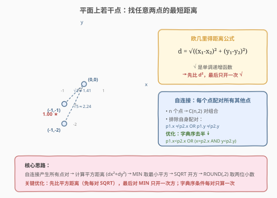
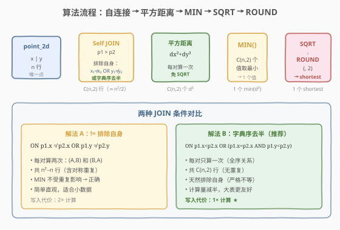
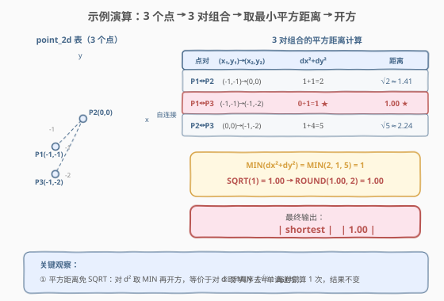

# LeetCode 平面上的最近距离 题解

## 1. 题目概述

- **标题 / 题号**：平面上的最近距离（#612，medium）
- **链接**：https://leetcode.cn/problems/shortest-distance-in-a-plane/
- **难度**：中等
- **标签**：SQL、自连接、聚合、MIN、数学、窗口函数

**题意**：表 `point_2d` 存储了平面上若干**互不相同**的点（多于 2 个）的坐标。编写 SQL 查询，找出**任意两点之间的最短距离**，结果四舍五入到小数点后 2 位，输出列名为 `shortest`。

**表结构**：

```text
Table: point_2d
+-------------+------+
| Column Name | Type |
+-------------+------+
| x           | int  |  ← 点的 x 坐标
| y           | int  |  ← 点的 y 坐标
+-------------+------+
```

> 💡 **关键约束**：表中所有点**互不相同**——不存在两行 `(x, y)` 完全相同。因此自连接时排除自身配对（`p1.x ≠ p2.x OR p1.y ≠ p2.y`）后，剩下的都是真正不同的点对。题目保证点数 > 2，所以至少有 3 个点、3 对组合。

**示例 1**：

```text
输入：
point_2d 表:
+----+----+
| x  | y  |
+----+----+
| -1 | -1 |
| 0  | 0  |
| -1 | -2 |
+----+----+

输出：
+----------+
| shortest |
+----------+
| 1.00     |
+----------+
```

**解释**：

- 三个点：P1=(-1,-1)、P2=(0,0)、P3=(-1,-2)
- P1↔P2：$\sqrt{(-1-0)^2+(-1-0)^2}=\sqrt{2}\approx1.41$
- P1↔P3：$\sqrt{(-1-(-1))^2+(-1-(-2))^2}=\sqrt{0+1}=1.00$ ← 最短
- P2↔P3：$\sqrt{(0-(-1))^2+(0-(-2))^2}=\sqrt{1+4}\approx2.24$

**约束**：

- `point_2d` 表中的点互不相同（`(x, y)` 唯一）
- 表中至少有 3 个点
- 距离 = 欧几里得距离 $d=\sqrt{(x_1-x_2)^2+(y_1-y_2)^2}$
- 结果四舍五入到小数点后 2 位
- 输出列名为 `shortest`

> 💡 本题是 [197. 上升的温度](https://leetcode.cn/problems/rising-temperature/) 同源的 **SQL 自连接母题**——把同一张表与自身 JOIN 产生行间组合。不同之处在于：197 比较两行的日期差，612 计算两行的坐标距离并取全局 MIN。核心都是「自连接产生行对 → 在行对上做计算 → 聚合取最值」。

## 2. 解题思路

### 2.1 暴力思路：逐一计算所有点对距离

最直觉的做法是把每个点与其他所有点配对，计算每对的欧几里得距离，取最小值。在过程式语言中，这就是一个双重循环：

```python
min_dist = float('inf')
for i in range(n):
    for j in range(i+1, n):
        d = sqrt((pts[i].x - pts[j].x)**2 + (pts[i].y - pts[j].y)**2)
        min_dist = min(min_dist, d)
```

在 SQL 中，双重循环对应**自连接**（Self JOIN）——`point_2d p1 JOIN point_2d p2` 产生 $n \times n$ 行的笛卡尔积，每行是一对点。加上排除自身的条件后，得到 $n^2 - n$ 行（或去半后 $\frac{n(n-1)}{2}$ 行），每行计算一次距离，最后 `MIN` 取最小值。

> ⚠️ **两个陷阱**：① **自连接会把每个点与自己配对**——距离为 0，若不排除，`MIN` 恒为 0；② **欧几里得距离的 `SQRT` 计算开销大**——对 $O(n^2)$ 个点对都开方是浪费。下文的核心观察解决这两个问题。

### 2.2 核心观察：平方距离免 SQRT + 自连接排除自身



**观察 1：排除自身配对**

自连接 `p1 × p2` 中，每行都会与自己配对（`p1.x = p2.x AND p1.y = p2.y`），距离为 0。必须用条件排除：

```sql
ON p1.x != p2.x OR p1.y != p2.y
```

由于题面保证点互不相同，此条件精确排除了「自身配对」，保留所有真正不同的点对。

**观察 2：平方距离免 SQRT（关键优化）**

欧几里得距离 $d = \sqrt{(x_1-x_2)^2+(y_1-y_2)^2}$。因为 `SQRT` 是**单调递增**函数：

$$d_1 < d_2 \iff d_1^2 < d_2^2$$

所以 $\arg\min d = \arg\min d^2$——**对平方距离取 MIN 等价于对距离取 MIN**。只需在最后对 `MIN(d²)` 做一次 `SQRT`，避免对 $O(n^2)$ 个点对逐一开方：

$$\text{shortest} = \sqrt{\min_{i \neq j}\big((x_i-x_j)^2+(y_i-y_j)^2\big)}$$

> 💡 **为什么这很重要**：假设 $n=1000$，有约 50 万对组合。对每对都调 `SQRT` 是 50 万次开方运算；先对 $d^2$ 取 `MIN` 再开一次方，只需 1 次。性能差异巨大，且语义完全等价。

**观察 3：字典序条件去半（进一步优化）**

`ON p1.x != p2.x OR p1.y != p2.y` 会让每对计算两次——(A,B) 和 (B,A) 都出现。由于 `MIN` 不受重复影响，结果正确，但计算量翻倍。

用**字典序全序关系**替代：

$$p_1 < p_2 \iff p_1.x < p_2.x \;\lor\; (p_1.x = p_2.x \;\land\; p_1.y < p_2.y)$$

对于任意两个不同的点，恰好一个方向满足此条件，因此每对只出现一次，计算量减半。且严格不等天然排除自身配对（同一点不满足 `p1.x < p2.x` 也不满足 `p1.x = p2.x AND p1.y < p2.y`）。

> 💡 这与 [602. 好友申请 II](./602_好友申请II谁有最多的好友.md) 中 `UNION ALL` 保留重复 vs `UNION` 去重的讨论呼应——「需要计数就保留重复，只需最值就可去重」。本题取 `MIN`，重复不影响结果，去半安全。

### 2.3 算法流程图



| 步骤 | SQL 子句 | 作用 | 行数变化 |
|------|----------|------|----------|
| ① | `FROM point_2d p1 JOIN point_2d p2 ON ...` | 自连接产生所有点对 | $n$ → $C(n,2)$ |
| ② | `POWER(p1.x - p2.x, 2) + POWER(p1.y - p2.y, 2)` | 每对计算平方距离 $d^2$ | $C(n,2)$ 行，各 1 个 $d^2$ |
| ③ | `MIN(...)` | 对所有 $d^2$ 取最小值 | $C(n,2)$ → 1 |
| ④ | `SQRT(MIN(...))` | 对最小 $d^2$ 开方得 $d$ | 1 → 1 |
| ⑤ | `ROUND(..., 2) AS shortest` | 四舍五入到 2 位小数 | 1 → 1（输出） |

> 💡 **执行顺序回顾**：`FROM`（自连接产生 $C(n,2)$ 行）→ 聚合 `MIN`（$C(n,2)$ 行压成 1 行）→ `SQRT` + `ROUND`（标量函数，对 1 行做变换）→ 输出。`SQRT` 和 `ROUND` 在 `MIN` 之后，只执行 1 次。

### 2.4 示例演算

以示例数据为例，3 个点产生 3 对组合，逐对计算平方距离后取 MIN 再开方：



**Step 1：自连接产生 3 对组合**

| 点对 | $(x_1, y_1) \to (x_2, y_2)$ | $dx = x_1 - x_2$ | $dy = y_1 - y_2$ |
|------|------------------------------|-------------------|-------------------|
| P1↔P2 | $(-1,-1) \to (0,0)$ | $-1$ | $-1$ |
| P1↔P3 | $(-1,-1) \to (-1,-2)$ | $0$ | $1$ |
| P2↔P3 | $(0,0) \to (-1,-2)$ | $1$ | $2$ |

**Step 2：计算平方距离 $d^2 = dx^2 + dy^2$**

| 点对 | $dx^2$ | $dy^2$ | $d^2 = dx^2+dy^2$ | $d = \sqrt{d^2}$ |
|------|--------|--------|---------------------|-------------------|
| P1↔P2 | 1 | 1 | **2** | $\sqrt{2} \approx 1.41$ |
| P1↔P3 | 0 | 1 | **1** ★ | $\sqrt{1} = 1.00$ ★ |
| P2↔P3 | 1 | 4 | **5** | $\sqrt{5} \approx 2.24$ |

**Step 3：MIN 取最小平方距离 → SQRT → ROUND**

$$\min(2, 1, 5) = 1 \implies \sqrt{1} = 1.00 \implies \text{ROUND}(1.00, 2) = 1.00$$

> 💡 **P1↔P3 的 $dx = 0$**——两点 x 坐标相同（都在 $x = -1$），只有 y 方向有差距。这使得 $d^2 = 0 + 1 = 1$，是三对中最小的。直观上：两点在垂直方向上相邻，距离最近。

## 3. 参考代码

### SQL（解法 A：自连接 + `!=` 排除自身，最简版）

```sql
SELECT ROUND(SQRT(MIN(POWER(p1.x - p2.x, 2) + POWER(p1.y - p2.y, 2))), 2) AS shortest
FROM point_2d p1
JOIN point_2d p2 ON p1.x != p2.x OR p1.y != p2.y;
```

> 💡 **写法要点**：
> - `JOIN point_2d p2 ON p1.x != p2.x OR p1.y != p2.y`——自连接并排除自身配对（同一行不与自己配对）。
> - `POWER(p1.x - p2.x, 2) + POWER(p1.y - p2.y, 2)`——计算平方距离 $d^2$，避免 `SQRT`。
> - `MIN(...)`——对所有点对的 $d^2$ 取最小值。
> - `SQRT(MIN(...))`——只对最小 $d^2$ 开一次方。
> - `ROUND(..., 2)`——四舍五入到 2 位小数。
> - 此解法每对计算两次（(A,B) 和 (B,A)），但 `MIN` 不受影响，结果正确。适合小数据量。

### SQL（解法 B：字典序去半，推荐）

```sql
SELECT ROUND(SQRT(MIN(POWER(p1.x - p2.x, 2) + POWER(p1.y - p2.y, 2))), 2) AS shortest
FROM point_2d p1
JOIN point_2d p2
  ON p1.x < p2.x OR (p1.x = p2.x AND p1.y < p2.y);
```

> 💡 **写法要点**：
> - `ON p1.x < p2.x OR (p1.x = p2.x AND p1.y < p2.y)`——字典序全序关系，每对不同点只出现一次。
> - **严格不等**（`<` 而非 `<=`）天然排除自身配对——同一点不满足 `p1.x < p2.x`，也不满足 `p1.x = p2.x AND p1.y < p2.y`（因为 `p1.y < p1.y` 为假）。
> - 计算量从 $n^2 - n$ 减到 $\frac{n(n-1)}{2}$，**减半**，大表更友好。
> - 结果与解法 A 完全一致——`MIN` 只关心最小值，不在乎出现 1 次还是 2 次。

### SQL（解法 C：窗口函数粗界 + 过滤 JOIN，大数据优化）

```sql
WITH ordered AS (
    SELECT x, y,
           LAG(x) OVER (ORDER BY x, y) AS prev_x,
           LAG(y) OVER (ORDER BY x, y) AS prev_y
    FROM point_2d
),
rough_bound AS (
    SELECT MIN(POWER(x - prev_x, 2) + POWER(y - prev_y, 2)) AS bound_sq
    FROM ordered
    WHERE prev_x IS NOT NULL
)
SELECT ROUND(SQRT(MIN(POWER(p1.x - p2.x, 2) + POWER(p1.y - p2.y, 2))), 2) AS shortest
FROM point_2d p1
JOIN point_2d p2
  ON (p1.x < p2.x OR (p1.x = p2.x AND p1.y < p2.y))
CROSS JOIN rough_bound
WHERE POWER(p1.x - p2.x, 2) < rough_bound.bound_sq;
```

> 💡 **写法要点**（三步优化）：
> - **`ordered` CTE**：按 `(x, y)` 排序，用 `LAG` 取每个点在 x 有序序列中的前一个点。
> - **`rough_bound` CTE**：计算所有 x 相邻点对的平方距离的最小值 `bound_sq`——这是一个**上界**：真正的最短距离 $\leq$ 这个值（因为 x 相邻点对只是所有点对的一个子集）。
> - **过滤 JOIN**：`WHERE POWER(p1.x - p2.x, 2) < bound_sq` 排除 x 差距已超过上界的点对。因为 $d^2 \geq dx^2$，若 $dx^2 \geq \text{bound\_sq}$ 则 $d^2 \geq \text{bound\_sq} \geq \min(d^2)$，此对不可能更优。
> - **正确性**：`bound_sq` 是某个真实点对的 $d^2$，所以 $\min(d^2) \leq \text{bound\_sq}$。过滤条件 `dx² < bound_sq` 只排除 $d^2 \geq \text{bound\_sq} \geq \min(d^2)$ 的对，不会漏掉真正的最小值。
> - **效果**：当点在 x 方向分布较分散时，大幅减少 JOIN 行数，从 $O(n^2)$ 降到接近 $O(n \cdot k)$（$k$ = x 窗口内的平均点数）。

### Python（pandas）

```python
import pandas as pd
import math

def shortest_distance(point_2d: pd.DataFrame) -> pd.DataFrame:
    merged = point_2d.merge(point_2d, how='cross', suffixes=('_1', '_2'))
    merged = merged[(merged['x_1'] != merged['x_2']) | (merged['y_1'] != merged['y_2'])]
    merged['dist_sq'] = (merged['x_1'] - merged['x_2']) ** 2 + (merged['y_1'] - merged['y_2']) ** 2
    return pd.DataFrame({'shortest': [round(math.sqrt(merged['dist_sq'].min()), 2)]})
```

> 💡 **pandas 对照**：`merge(how='cross')` 对应 `CROSS JOIN`（笛卡尔积）；`suffixes=('_1','_2')` 对应 `p1`/`p2` 别名；过滤条件 `(x_1!=x_2)|(y_1!=y_2)` 对应 `ON p1.x!=p2.x OR p1.y!=p2.y`；`** 2` 对应 `POWER(..., 2)`；`.min()` 对应 `MIN(...)`；`math.sqrt` 对应 `SQRT`；`round(..., 2)` 对应 `ROUND(..., 2)`。思路与解法 A 完全一致。

## 4. 复杂度分析

| 维度 | 复杂度 | 说明 |
|------|--------|------|
| **时间（解法 A `!=`）** | $O(n^2)$ | $n$ = `point_2d` 行数。自连接产生 $n^2 - n$ 行（每对 2 次），每行计算 $d^2$ 为 $O(1)$，`MIN` 扫一遍 $O(n^2)$，`SQRT`+`ROUND` 为 $O(1)$ |
| **时间（解法 B 字典序）** | $O(n^2)$ | 自连接产生 $\frac{n(n-1)}{2}$ 行（每对 1 次），为解法 A 的一半，但复杂度阶相同 |
| **时间（解法 C 窗口过滤）** | $O(n \log n + nk)$ | 排序 $O(n \log n)$ + `LAG` $O(n)$ + 过滤后 JOIN $O(nk)$（$k$ = x 窗口内平均点数，$k \ll n$ 时远优于 $O(n^2)$） |
| **空间** | $O(n^2)$ | JOIN 中间结果集（解法 A/B）；解法 C 的 `ordered` CTE 为 $O(n)$，但 JOIN 结果仍可达 $O(nk)$ |
| **结果行数** | $O(1)$ | 恒输出 1 行 1 列 |

> ⚠️ SQL 复杂度取决于**执行计划**：自连接最坏为 Nested Loop $O(n^2)$；若 `x` 列有索引且使用 Sort-Merge Join，可优化为 $O(n \log n)$。解法 C 的窗口过滤在数据分散时显著减少 JOIN 行数。面试中说明「自连接 $O(n^2)$，字典序减半，窗口粗界过滤可降到 $O(n \log n + nk)$」即可。

## 5. 扩展

### 5.1 平方距离免 SQRT 的数学原理

`SQRT` 是 $[0, +\infty) \to [0, +\infty)$ 的严格单调递增函数：

$$\forall a, b \geq 0: \quad a < b \iff \sqrt{a} < \sqrt{b}$$

因此 $\arg\min_i d_i = \arg\min_i d_i^2$。推广到任何单调递增函数 $f$：

$$\arg\min_i d_i = \arg\min_i f(d_i)$$

实际应用中，若只需要**比较**距离大小（如「找最近/最远的点对」），可以直接比较 $d^2$，完全免 `SQRT`。只在**最终需要输出实际距离值**时才开一次方。这与 [69. x 的平方根](../0001-0100/69_x的平方根.md) 中二分答案的思想呼应——尽量推迟或避免开方运算。

> 💡 这个优化在算法题中也很常见：[973. 最接近原点的 K 个点](https://leetcode.cn/problems/k-closest-points-to-origin/) 可以用平方距离排序免 `SQRT`；[719. 找出第 K 小的数对距离](https://leetcode.cn/problems/find-k-th-smallest-pair-distance/) 的二分答案验证也用平方距离比较。

### 5.2 字典序去半：为什么安全

字典序条件 `p1.x < p2.x OR (p1.x = p2.x AND p1.y < p2.y)` 定义了点集上的**严格全序关系**（strict total order）：

- **反自反性**：$p < p$ 为假（同一点不满足）→ 天然排除自身配对
- **反对称性**：$p_1 < p_2 \implies p_2 \not< p_1$ → 每对最多出现 1 次
- **传递性**：$p_1 < p_2 \land p_2 < p_3 \implies p_1 < p_3$ → 序列可排序
- **完全性**：$p_1 \neq p_2 \implies p_1 < p_2 \lor p_2 < p_1$ → 每对不同点恰好出现 1 次

因此 $C(n,2)$ 对不同点各出现一次，既不遗漏也不重复。对比 `!=` 条件：

| 条件 | 每对出现次数 | 总行数 | 排除自身 | 适合场景 |
|------|-------------|--------|----------|----------|
| `p1.x != p2.x OR p1.y != p2.y` | 2 次 | $n^2 - n$ | ✅ | 简单直观，小数据 |
| `p1.x < p2.x OR (p1.x = p2.x AND p1.y < p2.y)` | 1 次 | $\frac{n(n-1)}{2}$ | ✅（严格不等） | 推荐，大数据 |

> ⚠️ 若题面不保证点互不相同（有重复坐标），字典序条件会排除同坐标点对（距离 0）。此时若需考虑同坐标点对，应改用 `!=` 条件或用 `rowid`/主键区分不同行。本题保证点唯一，无需担心。

### 5.3 进阶优化：分治法 / k-d tree

当 $n$ 极大（如 $10^6$ 级）时，$O(n^2)$ 的自连接不可行。经典算法是**分治法最近点对**（Closest Pair of Points），时间复杂度 $O(n \log n)$：

1. 按 $x$ 排序，递归求左半部和右半部的最近距离 $d_L$、$d_R$，取 $d = \min(d_L, d_R)$
2. 检查跨分界线的点对——只看 $|x - \text{mid\_x}| < d$ 的带状区域内的点，按 $y$ 排序后检查相邻 7 个点

但 SQL 没有递归分治能力，无法直接实现。解法 C 的「窗口函数粗界 + 过滤 JOIN」是 SQL 中最接近的近似——用 x 相邻点的距离作为上界，过滤掉 x 差距过大的点对，实际效果取决于数据分布。

> 💡 面试中被问到「数据量极大怎么办」时，提及分治法 $O(n \log n)$ 和 k-d tree $O(n \log n)$ 的存在即可，说明 SQL 的局限性并建议用 Python/Java 处理超大规模数据。

## 6. 面试要点

1. **为什么要排除自身配对？怎么排除？**

   - 自连接 `p1 × p2` 中，每行会与自己配对，距离为 0，`MIN` 恒为 0。排除方法：`ON p1.x != p2.x OR p1.y != p2.y`（排除坐标完全相同的配对），或字典序条件 `p1.x < p2.x OR (p1.x = p2.x AND p1.y < p2.y)`（严格不等天然排除自身）。题目保证点互不相同，前者精确排除自身，后者同时去半。

2. **为什么可以先对 $d^2$ 取 MIN 再开方？**

   - `SQRT` 是严格单调递增函数，$a < b \iff \sqrt{a} < \sqrt{b}$，所以 $\arg\min d = \arg\min d^2$。先对 $O(n^2)$ 个平方距离取 `MIN`（一次聚合），再对结果做一次 `SQRT`，避免对每对都开方。从 $O(n^2)$ 次 `SQRT` 降到 1 次，性能提升巨大且结果完全等价。

3. **`!=` 条件和字典序条件有什么区别？哪个更好？**

   - `!=` 条件每对计算两次（(A,B) 和 (B,A)），共 $n^2 - n$ 行；字典序条件每对只算一次，共 $\frac{n(n-1)}{2}$ 行。两者 `MIN` 结果相同（`MIN` 不受重复影响），但字典序条件计算量减半，大表更优。字典序条件还天然排除自身（严格不等），无需额外 `!=` 判断。

4. **解法 C 的窗口粗界过滤为什么不会漏掉正确答案？**

   - `rough_bound` 取 x 相邻点对的最小平方距离 `bound_sq`——这是某个真实点对的 $d^2$，所以 $\min(d^2) \leq \text{bound\_sq}$。过滤条件 `dx² < bound_sq` 排除的是 $d^2 \geq dx^2 \geq \text{bound\_sq} \geq \min(d^2)$ 的点对——它们的 $d^2$ 不可能严格小于当前已知最小值，排除安全。真正最小的点对必然满足 $dx^2 < \text{bound\_sq}$（否则其 $d^2 \geq \text{bound\_sq}$，与它是最小矛盾）。

5. **如果点不唯一（有重复坐标）怎么办？**

   - 重复坐标的点对距离为 0，是最小值。字典序条件 `p1.x < p2.x OR (p1.x = p2.x AND p1.y < p2.y)` 会排除同坐标点对（严格不等），漏掉距离 0 的结果。此时应改用 `!=` 条件，或用主键/`rowid` 区分不同行：`ON p1.rowid != p2.rowid`。本题保证点唯一，不存在此问题。

> 💡 **一句话总结**：612 教的是「SQL 自连接 + 聚合取最值」的经典范式——自连接产生所有点对，计算平方距离（免 SQRT），`MIN` 取最小，最后开方取整。核心优化：① 先比 $d^2$ 再开方，$O(n^2)$ 次 `SQRT` 降为 1 次；② 字典序全序去半，计算量减半。记住「单调函数保 argmin、严格全序每对一次」两条原理，所有「SQL 找最值行对」类题目都能套用。

## 同类练习题

| # | 题目 | 与本题的关联 |
|---|------|-------------|
| 197 | [上升的温度](https://leetcode.cn/problems/rising-temperature/) | SQL 自连接母题——同一张表 JOIN 自身做行间比较（`DATEDIFF` 日期差），与 612 的「自连接产生行对 + 行间计算」同源，只是比较对象从日期差变为坐标距离 |
| 601 | [体育馆的人流量](./601_体育馆的人流量.md) | SQL 自连接 + 窗口函数——三表自连接找连续行，612 是两表自连接找最优行对，共享「自连接产生行组合」的核心思想 |
| 602 | [好友申请 II ：谁有最多的好友](./602_好友申请II谁有最多的好友.md) | SQL `UNION ALL` + `GROUP BY` + `MIN`/`MAX`——对比 612 理解「取最值时重复不影响结果」与「计数时必须保留重复」的区别 |
| 534 | [游戏玩法分析 III](https://leetcode.cn/problems/game-play-analysis-iii/) | SQL 自连接 + 累计聚合——同一张表 JOIN 自身做行间汇总（`SUM ... WHERE datediff <= 7`），与 612 的自连接产生行对后聚合思路一致 |
| 579 | [查询员工的累计薪水](https://leetcode.cn/problems/find-cumulative-salary-of-an-employee/) | SQL 自连接 + 窗口函数——按员工分组后自连接做行间比较与累计，对比 612 的全局（不分组）自连接取最值 |
