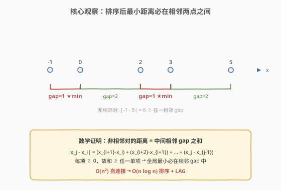
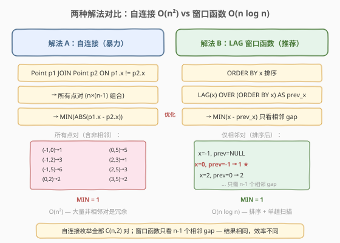

# LeetCode 直线上的最近距离 题解

## 1. 题目概述

- **标题 / 题号**：直线上的最近距离（#613，easy）
- **链接**：https://leetcode.cn/problems/shortest-distance-in-a-line/
- **难度**：简单
- **标签**：SQL、自连接、窗口函数、LAG、MIN、ABS

**题意**：给定 `Point` 表，每行记录数轴上一个点的坐标 `x`。编写 SQL 查询，找出**任意两点之间的最短距离**。

**表结构**：

```text
Table: Point
+-------------+------+
| Column Name | Type |
+-------------+------+
| x           | int  |  ← 数轴上的坐标
+-------------+------+
```

> 💡 **关键约束**：`Point` 表**无主键**，可能包含重复值（同一个 `x` 出现多行）。题目要的是「任意两点之间的最短距离」——即所有点对 $(p_i, p_j)$ 中 $|p_i.x - p_j.x|$ 的最小值。

**示例 1**：

```text
输入：
Point 表:
+----+
| x  |
+----+
| -1 |
| 0  |
| 2  |
+----+

输出：
+-----+
| min |
+-----+
| 1   |
+-----+
```

**解释**：

- 点对 (-1, 0)：距离 $|0 - (-1)| = 1$
- 点对 (-1, 2)：距离 $|2 - (-1)| = 3$
- 点对 (0, 2)：距离 $|2 - 0| = 2$
- 最短距离 = $\min(1, 3, 2) = 1$（点 -1 与 0 之间）

**约束**：

- `Point` 表无主键，`x` 列可能有重复值
- 表中至少有 2 个不同坐标的点
- 结果输出列名为 `min`

> 💡 本题是 SQL **自连接**与**窗口函数**的经典对比母题。暴力解法用自连接枚举所有点对取 `MIN(ABS(...))`，$O(n^2)$；优化解法利用「排序后最短距离必在相邻两点之间」这一性质，用 `LAG` 只看 $n-1$ 个相邻间隙，$O(n \log n)$。它是 [197. 上升的温度](../0101-0200/197_上升的温度.md)（相邻行比较）与 [180. 连续出现的数字](../0101-0200/180_连续出现的数字.md)（自连接）的简化版。

## 2. 解题思路

### 2.1 暴力思路：自连接枚举所有点对

最直觉的思路是：把 `Point` 表与自身做笛卡尔积（自连接），生成所有点对，对每对计算 $|p_1.x - p_2.x|$，最后取全局 `MIN`。

> ⚠️ 自连接会产生 $n \times n$ 行（含自身与自身的配对，距离为 0），需用 `p1.x != p2.x` 排除同一坐标的配对——既排除「行与自身配对」，也排除「重复坐标的两行配对」（它们距离为 0 但不是两个不同的点）。用 `p1.x < p2.x` 更优：天然排除等值配对、避免每对计数两次、且无需 `ABS`。

### 2.2 核心观察：排序后最短距离必在相邻两点之间



**关键洞察**：将所有点按 `x` 升序排列后，任意**非相邻**两点 $x_i$ 与 $x_j$（$i < j$）的距离等于中间所有相邻间隙之和：

$$|x_j - x_i| = \sum_{k=i}^{j-1} (x_{k+1} - x_k) \geq \max_{k} (x_{k+1} - x_k) \geq \min_{k} (x_{k+1} - x_k)$$

每个间隙 $\geq 0$，故**和必定 $\geq$ 任一单项**——因此全局最小距离一定出现在某个**相邻间隙**中，非相邻对不可能更短。

> 💡 **算法意义**：这个性质把「检查 $C(n, 2)$ 个点对」降为「检查 $n-1$ 个相邻间隙」——从 $O(n^2)$ 降到 $O(n \log n)$（排序代价）。SQL 中用 `LAG(x) OVER (ORDER BY x)` 取得排序后前一行的 `x`，相减即得相邻间隙，再取 `MIN` 即可。

### 2.3 算法流程图



**解法 A（暴力）：自连接 + ABS + MIN**

| 步骤 | 子句 | 作用 |
|------|------|------|
| ① | `Point p1 JOIN Point p2 ON p1.x != p2.x` | 自连接生成所有不同坐标的点对 |
| ② | `ABS(p1.x - p2.x)` | 对每对计算距离 |
| ③ | `MIN(...)` | 取全局最小 |

**解法 B（推荐）：LAG 窗口函数 + MIN**

| 步骤 | 子句 | 作用 |
|------|------|------|
| ① | `LAG(x) OVER (ORDER BY x) AS prev_x` | 按 `x` 排序，取前一行的 `x` 到当前行 |
| ② | `x - prev_x` | 计算相邻间隙（排序后 `x ≥ prev_x`，无需 `ABS`） |
| ③ | `WHERE prev_x IS NOT NULL` | 排除首行（无前驱，`LAG` 返回 `NULL`） |
| ④ | `MIN(x - prev_x)` | 取间隙最小值 |

> 💡 **执行顺序**：`FROM` → 窗口函数 `LAG OVER (ORDER BY x)`（排序 + 赋值）→ `WHERE prev_x IS NOT NULL`（过滤首行）→ `MIN(x - prev_x)` 聚合。窗口函数在 `WHERE` 之前执行，所以 `WHERE` 能引用 `prev_x`。

### 2.4 示例演算

以示例数据 `x = {-1, 0, 2}` 为例，用解法 B（LAG 窗口函数）逐步演算：

![示例演算：点 -1, 0, 2 → 排序 + LAG → gap [1, 2] → MIN = 1](../images/shortest_dist_walkthrough.svg)

**Step 1：排序 + LAG 回看**

按 `x` 升序排列，`LAG(x)` 取前一行的 `x`：

| x | prev_x | x - prev_x |
|----|--------|------------|
| -1 | NULL | —（首行无前驱，过滤） |
| 0 | -1 | **1** |
| 2 | 0 | 2 |

**Step 2：过滤首行 + MIN**

- 排除 `prev_x IS NULL` 的首行 → gap 序列 = [1, 2]
- `MIN(1, 2) = 1` → 点 -1 与 0 之间最近

> 💡 **与解法 A 的等价性验证**：解法 A 枚举 3 个点对 → {(-1,0)→1, (-1,2)→3, (0,2)→2} → MIN = 1。两种解法结果一致，但解法 B 只看了 2 个相邻 gap（少了 (-1,2) 这个非相邻对），因为该对的距离 3 = gap₁ + gap₂ = 1 + 2 ≥ 1，不可能更短。

## 3. 参考代码

### SQL（解法 A：自连接 + ABS + MIN，经典）

```sql
SELECT MIN(ABS(p1.x - p2.x)) AS min
FROM Point p1
JOIN Point p2 ON p1.x != p2.x;
```

> 💡 **写法要点**：
> - `Point p1 JOIN Point p2 ON p1.x != p2.x`：自连接生成所有不同坐标的点对，`!=` 排除同一坐标的配对（含行与自身配对）。
> - `ABS(p1.x - p2.x)`：对每对取绝对值距离（`p1.x` 可能大于或小于 `p2.x`）。
> - `MIN(...)`：取所有点对距离的最小值。
> - 注意 `!=` 会让每对出现两次（(a,b) 和 (b,a)），但 `MIN` 不受重复影响。

### SQL（解法 A'：自连接 + < + 无 ABS，更简洁）

```sql
SELECT MIN(p2.x - p1.x) AS min
FROM Point p1
JOIN Point p2 ON p1.x < p2.x;
```

> 💡 **改进点**：用 `<` 代替 `!=`：① 天然排除等值配对（重复坐标）；② 每对只出现一次（a < b 唯一）；③ `p2.x > p1.x` 保证差为正，无需 `ABS`。三种写法等价，`<` 版最简洁。

### SQL（解法 B：LAG 窗口函数，推荐）

```sql
SELECT MIN(x - prev_x) AS min
FROM (
    SELECT x, LAG(x) OVER (ORDER BY x) AS prev_x
    FROM Point
) t
WHERE prev_x IS NOT NULL;
```

> 💡 **写法要点**：
> - 子查询 `LAG(x) OVER (ORDER BY x)`：按 `x` 升序排列，将前一行的 `x` 拉到当前行——一次排序，单趟赋值。
> - `x - prev_x`：排序后 `x ≥ prev_x`，差值即相邻间隙，非负，无需 `ABS`。
> - `WHERE prev_x IS NOT NULL`：首行无前驱，`LAG` 返回 `NULL`，`NULL - x` 为 `NULL`，`MIN` 自动忽略 `NULL`——此 `WHERE` 非必需但提升可读性。
> - 外层 `MIN(x - prev_x)`：取所有相邻间隙的最小值，即全局最短距离。
> - **为什么有效**：排序后最短距离必在相邻两点之间（见 2.2 节证明），只需检查 $n-1$ 个 gap 而非 $C(n,2)$ 个点对。

### Python（pandas）

```python
import pandas as pd

def shortest_distance(point: pd.DataFrame) -> pd.DataFrame:
    x = point['x'].sort_values().reset_index(drop=True)
    return pd.DataFrame({'min': [x.diff().min()]})
```

> 💡 **pandas 对照**：`sort_values()` 对应 `ORDER BY x`；`diff()` 对应 `x - LAG(x)`（当前行减上一行）；`min()` 对应 `MIN(x - prev_x)`。`diff()` 在首行产生 `NaN`，`min()` 自动跳过 `NaN`，无需额外过滤。一行链式调用完成全部逻辑。

## 4. 复杂度分析

| 维度 | 复杂度 | 说明 |
|------|--------|------|
| **时间（解法 A 自连接）** | $O(n^2)$ | $n$ = `Point` 行数。自连接生成 $O(n^2)$ 个点对，每对计算 `ABS` 为 $O(1)$，`MIN` 线性扫描 $O(n^2)$。无索引时为 Nested Loop $O(n^2)$ |
| **时间（解法 B LAG）** | $O(n \log n)$ | `LAG OVER (ORDER BY x)` 需全表排序 $O(n \log n)$，排序后单趟扫描赋值 $O(n)$，`MIN` 线性扫描 $O(n)$。总计 $O(n \log n)$ |
| **空间** | $O(n)$ | 窗口函数排序缓冲区 / 自连接中间结果集 |
| **结果行数** | $O(1)$ | 只输出 1 行 1 列（最短距离值） |

> ⚠️ 解法 A 的 $O(n^2)$ 在 $n$ 较大时显著慢于解法 B 的 $O(n \log n)$。当 `Point` 有几千行时，解法 A 的点对数达百万级，而解法 B 仍是几千级的单趟扫描。面试中优先给出解法 B 并解释「排序后最短距离在相邻点之间」的数学性质，是本题的核心加分点。

## 5. 扩展

### 5.1 重复值的处理

题目说 `Point` 表「可能包含重复值」——同一个 `x` 出现多行。两种解法对此有不同的行为：

- **解法 A（`!=` 或 `<`）**：自动排除等值配对，重复行不影响结果。若全表只有一个坐标（所有 `x` 相同），`JOIN` 结果为空，`MIN` 返回 `NULL`。
- **解法 B（LAG 无 DISTINCT）**：重复行会产生 `gap = 0`，`MIN` 返回 0。若需排除重复（只看不同坐标的点），需先 `SELECT DISTINCT x`：

```sql
SELECT MIN(x - prev_x) AS min
FROM (
    SELECT x, LAG(x) OVER (ORDER BY x) AS prev_x
    FROM (SELECT DISTINCT x FROM Point) d
) t
WHERE prev_x IS NOT NULL;
```

> 💡 **语义判断**：若「重复值」代表「同一位置的不同点」（如两个传感器都读到 x=5），则距离为 0 是正确答案，用解法 B 不去重；若「重复值」只是数据冗余（同一点的多条记录），则应去重后求相邻间隙。LeetCode 测试用例无重复坐标，两种写法均通过。

### 5.2 `<` vs `!=`：自连接的连接条件选择

| 连接条件 | 点对数 | 是否需 `ABS` | 是否排除重复 | 每对出现次数 |
|----------|--------|-------------|-------------|-------------|
| `p1.x != p2.x` | $n(n-1)$ | 是 | 是 | 2 次 |
| `p1.x < p2.x` | $C(n, 2)$ | 否 | 是 | 1 次 |
| `p1.x > p2.x` | $C(n, 2)$ | 否 | 是 | 1 次 |

> 💡 `<` 和 `>` 完全等价（对称），`!=` 多计数一倍但 `MIN` 不受影响。推荐 `<`：最少点对数、无需 `ABS`、语义清晰（「前面的点 vs 后面的点」）。

### 5.3 LEAD 替代 LAG

`LAG(x)` 取前一行，`LEAD(x)` 取后一行——对称选择，等价：

```sql
SELECT MIN(next_x - x) AS min
FROM (
    SELECT x, LEAD(x) OVER (ORDER BY x) AS next_x
    FROM Point
) t
WHERE next_x IS NOT NULL;
```

> 💡 `LEAD` 版本计算 `next_x - x`（后减前，非负），`LAG` 版本计算 `x - prev_x`（后减前，非负）——两者完全等价，只是「向前看」还是「向后看」的习惯差异。`LAG` 更常见因为「当前行依赖前一行」的直觉更强。

### 5.4 数学性质的一般化

「排序后最值在相邻元素之间」这一性质不仅适用于数轴上的点，还推广到：

- **二维平面最近点对**：按 `x` 排序后，最近点对的 `x` 差不超过当前最小距离——可剪枝（分治法 $O(n \log n)$）。
- **数组最小差**：两个数组各取一个元素使差最小——先各自排序，再用双指针同步推进，$O(n \log n)$。

> 💡 本题是这一系列「排序 + 相邻比较」思想的 SQL 表达——`LAG/LEAD OVER (ORDER BY ...)` 就是 SQL 中的「排序后双指针」。

## 6. 面试要点

1. **为什么排序后最短距离一定在相邻两点之间？**

   - 设排序后点列为 $x_1 \leq x_2 \leq \cdots \leq x_n$。任意非相邻对 $x_i, x_j$（$j > i+1$）的距离 $|x_j - x_i| = \sum_{k=i}^{j-1}(x_{k+1} - x_k)$，即中间所有相邻间隙之和。每项 $\geq 0$，故和 $\geq$ 任一单项 $\geq$ 最小间隙。因此全局最小距离必定是某个相邻间隙 $x_{k+1} - x_k$，非相邻对不可能更短。

2. **解法 A（自连接）和解法 B（LAG）的时间复杂度差异是什么？**

   - 解法 A 自连接生成 $C(n, 2) = O(n^2)$ 个点对，每对计算 `ABS` 为 $O(1)$，总计 $O(n^2)$。解法 B 先排序 $O(n \log n)$，再用 `LAG` 单趟扫描计算 $n-1$ 个相邻间隙 $O(n)$，最后 `MIN` 线性扫描 $O(n)$，总计 $O(n \log n)$。当 $n$ 较大时解法 B 显著优于解法 A。

3. **`LAG(x) OVER (ORDER BY x)` 在首行返回什么？如何处理？**

   - 首行无前驱，`LAG` 返回 `NULL`。`x - NULL` 为 `NULL`，`MIN` 聚合自动忽略 `NULL`，所以不加 `WHERE prev_x IS NOT NULL` 也能得到正确结果。但显式过滤能提升可读性并避免 `NULL` 参与运算的混淆。若用 `ABS(x - prev_x)`，`ABS(NULL)` 仍为 `NULL`，同样被 `MIN` 忽略。

4. **`Point` 表有重复值时，两种解法的行为有何不同？**

   - 解法 A 用 `p1.x != p2.x` 或 `p1.x < p2.x`，自动排除等值配对，重复行不影响结果。解法 B 不去重时，重复行会产生 `gap = 0`，`MIN` 返回 0——若重复代表「同位置的不同点」则正确，若重复只是数据冗余则需先 `SELECT DISTINCT x` 去重。

5. **为什么 `p1.x < p2.x` 比 `p1.x != p2.x` 更好？**

   - 三点优势：① 点对数减半（$C(n,2)$ vs $n(n-1)$），每对只出现一次；② `p2.x > p1.x` 保证差为正，无需 `ABS`；③ 天然排除等值配对（重复坐标），语义更清晰。三种写法对 `MIN` 结果等价，但 `<` 版最简洁高效。

> 💡 **一句话总结**：613 是 SQL **自连接 vs 窗口函数**的对比母题——暴力自连接枚举 $O(n^2)$ 个点对，优化解法利用「排序后最短距离在相邻点之间」的数学性质，用 `LAG OVER (ORDER BY x)` 只看 $n-1$ 个相邻间隙，降到 $O(n \log n)$。核心考点是能否想到「排序 + LAG 相邻比较」替代「全点对自连接」，这是 [197. 上升的温度](../0101-0200/197_上升的温度.md)（相邻行比较）与 [180. 连续出现的数字](../0101-0200/180_连续出现的数字.md)（自连接）的简化融合。

## 同类练习题

| # | 题目 | 与本题的关联 |
|---|------|-------------|
| 197 | [上升的温度](../0101-0200/197_上升的温度.md) | SQL 自连接 + `DATEDIFF` 比较「相邻日期」的温度，与本题「相邻行比较」思路同源——613 用 `LAG`，197 用自连接，可对比两种范式 |
| 180 | [连续出现的数字](../0101-0200/180_连续出现的数字.md) | SQL 三表自连接找连续行，与本题解法 A 的自连接思路一脉相承——180 是「连续 N 行相同」，613 是「所有点对取最值」 |
| 196 | [删除重复的电子邮箱](../0101-0200/196_删除重复的电子邮箱.md) | SQL 自连接 DELETE，同一张表 JOIN 自身做行间比较，承接本题的自连接思路（DELETE 场景） |
| 601 | [体育馆的人流量](../0601-0700/601_体育馆的人流量.md) | SQL 自连接 + `LAG`/`LEAD` 窗口函数 Hard 题，与本题共享「自连接 vs 窗口函数」的对比范式，是 613 的高级变体 |
| 511 | [游戏玩法分析 I](../0501-0600/511_游戏玩法分析I.md) | SQL `GROUP BY + MIN` 分组取最值，与 613 的全局 `MIN` 对比——511 是「每组最值」，613 是「全局最值」 |
