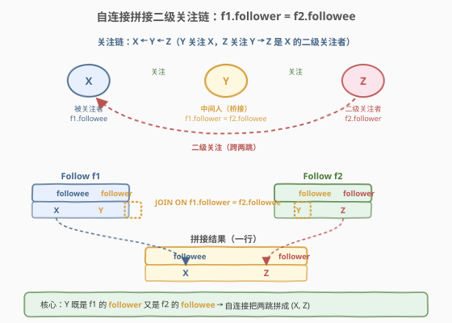
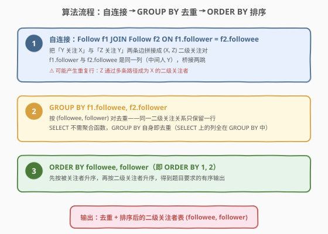
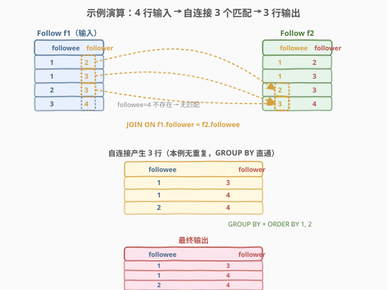

# 二级关注者

- **题目名称**：二级关注者
- **链接**：[614. 二级关注者](https://leetcode.cn/problems/second-degree-follower/)
- **难度**：中等
- **标签**：SQL、自连接、JOIN、GROUP BY、ORDER BY、社交网络

## 1. 题目概述

在 Facebook、Twitter 等社交网络中，用户之间可以相互关注，形成复杂的关系图。给定 `Follow` 表记录「谁关注谁」，编写 SQL 查询，对**每个被关注的人**，找出其所有的**二级关注者**（即其关注者的关注者）。

**表结构**：

```text
Table: Follow
+-------------+---------+
| Column Name | Type    |
+-------------+---------+
| followee    | int     |  ← 被关注者（主键之一）
| follower    | int     |  ← 关注者（主键之一）
+-------------+---------+
(followee, follower) 是该表的主键。
每行表示用户 follower 关注了用户 followee。
该表不包含重复行。
```

> 💡 **关系方向**：行 `(followee, follower) = (1, 2)` 表示 **2 关注 1**——`follower` 主动关注 `followee`。这点极易混淆：列名 `followee` 在前但它是「被关注的人」，`follower` 在后但它是「发起关注的人」。

**示例 1**：

```text
输入：
Follow 表:
+----------+----------+
| followee | follower |
+----------+----------+
| 1        | 2        |
| 1        | 3        |
| 2        | 3        |
| 3        | 4        |
+----------+----------+

输出：
+----------+----------+
| followee | follower |
+----------+----------+
| 1        | 3        |
| 1        | 4        |
| 2        | 4        |
+----------+----------+
```

**解释**：

关注关系（`follower → followee`，箭头表示「关注」）：

- `2 → 1`、`3 → 1`：用户 1 的（一级）关注者集合 = {2, 3}
- `3 → 2`：用户 2 的关注者集合 = {3}
- `4 → 3`：用户 3 的关注者集合 = {4}
- 用户 4 没有关注者

**二级关注者** = 关注者的关注者：

- 用户 1 的关注者 {2, 3}：2 的关注者 = {3}，3 的关注者 = {4} → 二级关注者 = {3, 4}
- 用户 2 的关注者 {3}：3 的关注者 = {4} → 二级关注者 = {4}
- 用户 3 的关注者 {4}：4 没有关注者 → 无二级关注者

按 `followee, follower` 升序排列得最终输出。

**约束条件**：

- `(followee, follower)` 为复合主键，无重复行
- 结果列名与输入表一致：`followee`, `follower`
- 结果按 `followee` 升序、再按 `follower` 升序排列

> 💡 本题是 SQL **自连接**的经典应用——把「两跳关注链」用一次 `JOIN` 拼接成「一行的二级关系」。它和 [602. 好友申请 II](../0601-0700/602_好友申请II谁有最多的好友.md)（`UNION ALL` 合并双向好友）同属「关系表的多视角查询」家族，但 614 用的是**纵向拼接两跳**（自连接），602 用的是**横向合并两端**（`UNION ALL`）。

---

## 2. 解题思路

### 2.1 暴力思路：枚举三元组找两跳链

最直觉的思路是：对每个被关注者 $X$，先找出其所有关注者 $Y$，再对每个 $Y$ 找出 $Y$ 的所有关注者 $Z$，则 $Z$ 是 $X$ 的二级关注者。这等价于在关注图上做两步 BFS。

在 SQL 中，这种「$X \to Y \to Z$」的两跳链天然对应**自连接**：把 `Follow` 表用两次，第一次取 $(X, Y)$（即 `followee=X, follower=Y`），第二次取 $(Y, Z)$（即 `followee=Y, follower=Z`），用 $Y$ 作为桥接把它们拼起来，结果就是 $(X, Z)$。

> ⚠️ **关键陷阱**：桥接条件是 `f1.follower = f2.followee`——即「第一跳的关注者」等于「第二跳的被关注者」。容易写反成 `f1.followee = f2.follower`，那会把方向拼错（得到 $Y$ 是 $X$ 的关注者且 $Z$ 关注 $Y$，但拼出来的是 $(Y, Z)$ 而非 $(X, Z)$）。

### 2.2 核心观察：自连接拼接二级关注链



**关键洞察**：把 `Follow` 表视为有向边表——每行 `(followee, follower)` 是一条 `follower → followee` 的有向边（关注方向）。二级关注者就是**长度恰好为 2 的有向路径**的端点：$X \xleftarrow{} Y \xleftarrow{} Z$（$Z$ 关注 $Y$，$Y$ 关注 $X$，故 $Z$ 经两跳到达 $X$）。

$$\text{SecondDegree}(X, Z) \iff \exists\, Y.\; (X, Y) \in \text{Follow} \land (Y, Z) \in \text{Follow}$$

这正是关系代数中的**自连接（self-join）**：`Follow f1 JOIN Follow f2 ON f1.follower = f2.followee`。

- `f1` 提供**第一跳** $(X, Y)$：`f1.followee = X`，`f1.follower = Y`
- `f2` 提供**第二跳** $(Y, Z)$：`f2.followee = Y`，`f2.follower = Z`
- 桥接条件 `f1.follower = f2.followee` 即 $Y = Y$，保证两跳首尾相接
- 输出行 `(f1.followee, f2.follower) = (X, Z)` 即二级关注关系

> 💡 **桥接列的双重身份**：$Y$ 在 `f1` 中扮演 `follower`（第一跳的关注者），在 `f2` 中扮演 `followee`（第二跳的被关注者）。同一列在两次扫描中承担不同角色，这正是自连接的精妙之处。理解了这一点，`ON f1.follower = f2.followee` 就不会写反。

### 2.3 算法流程图



| 步骤 | 子句 | 作用 |
|------|------|------|
| ① | `Follow f1 JOIN Follow f2 ON f1.follower = f2.followee` | 自连接拼接两跳：$(X,Y)$ 与 $(Y,Z)$ 拼成 $(X,Z)$ |
| ② | `GROUP BY f1.followee, f2.follower` | 按 $(X, Z)$ 对去重——同一二级关系经多条路径产生只留一行 |
| ③ | `ORDER BY 1, 2` | 按 `followee` 升序、再按 `follower` 升序输出 |

> 💡 **为什么需要 GROUP BY？** 自连接会产生**重复行**：若 $Z$ 通过多个中间人 $Y_1, Y_2$ 都能两跳到达 $X$，则 $(X, Z)$ 会出现两次。`GROUP BY f1.followee, f2.follower` 把这两行归并为一行——`SELECT` 上的两列都在 `GROUP BY` 中，无需聚合函数，`GROUP BY` 自身完成去重。
>
> ⚠️ **执行顺序**：`FROM`（含 `JOIN`）→ `GROUP BY` → `HAVING` → `SELECT` → `ORDER BY`。`ORDER BY 1, 2` 中的 `1, 2` 指代 `SELECT` 列表的第 1、2 列（即 `followee`, `follower`），也可写 `ORDER BY followee, follower` 更显式。

### 2.4 示例演算

以示例 4 行输入为例，观察自连接如何匹配出 3 个二级关注对：



**Step 1：自连接匹配（`f1.follower = f2.followee`）**

| f1 行 (X, Y) | f2 匹配行 (Y, Z) | 拼接结果 (X, Z) |
|--------------|------------------|-----------------|
| (1, 2) | (2, 3) | **(1, 3)** |
| (1, 3) | (3, 4) | **(1, 4)** |
| (2, 3) | (3, 4) | **(2, 4)** |
| (3, 4) | 无（`followee=4` 不存在） | —（无匹配） |

**Step 2：GROUP BY 去重**

- 本例 3 行各不相同，`GROUP BY` 直通，无行被合并。
- 假设数据中 $5 \to 2$ 且 $5 \to 3$（$5$ 同时关注 $2$ 和 $3$），则 $5$ 经 $2$ 与经 $3$ 两条路径都能两跳到达 $1$，$(1, 5)$ 会重复出现两次，`GROUP BY` 把它们合并为一行。

**Step 3：ORDER BY 排序**

- 按 `followee` 升序：1, 1, 2
- 同 `followee` 内按 `follower` 升序：3 < 4
- 最终顺序：(1, 3), (1, 4), (2, 4) ✓

> 💡 **(1, 3) 为何是合法的二级关注者？** 用户 3 关注 2，而 2 关注 1，所以 3 经「3→2→1」两跳到达 1——这是一条长度恰好为 2 的关注路径。尽管 3 同时也直接关注 1（一级关系），但「二级关注者」的数学定义是「存在长度为 2 的路径」，并不要求排除已有一级关系的人。若需 LinkedIn 式「排除直接关注者」的 2 度人脉语义，见第 5.1 节变体。

---

## 3. 参考代码

### SQL（自连接 + GROUP BY + ORDER BY，推荐）

```sql
SELECT f1.followee AS followee, f2.follower AS follower
FROM Follow f1
JOIN Follow f2 ON f1.follower = f2.followee
GROUP BY f1.followee, f2.follower
ORDER BY 1, 2;
```

> 💡 **写法要点**：
> - `Follow f1 JOIN Follow f2 ON f1.follower = f2.followee`：同一张表用两次别名，桥接条件把两跳关注链首尾相接——`f1` 的关注者必须是 `f2` 的被关注者（中间人 $Y$）。
> - `SELECT f1.followee, f2.follower`：取第一跳的被关注者 $X$ 与第二跳的关注者 $Z$，拼成二级关系 $(X, Z)$。
> - `GROUP BY f1.followee, f2.follower`：按 $(X, Z)$ 去重，消除多条路径导致的重复行。`SELECT` 的两列都在 `GROUP BY` 中，无需聚合函数。
> - `ORDER BY 1, 2`：等价于 `ORDER BY followee, follower`，按列位置排序更简洁。

### SQL（解法 B：SELECT DISTINCT 替代 GROUP BY）

```sql
SELECT DISTINCT f1.followee AS followee, f2.follower AS follower
FROM Follow f1
JOIN Follow f2 ON f1.follower = f2.followee
ORDER BY 1, 2;
```

> 💡 **`DISTINCT` vs `GROUP BY`**：当 `SELECT` 列就是去重列、且无其他聚合时，`SELECT DISTINCT` 与 `GROUP BY` 完全等价——两者都做「按所有选定列去重」。`GROUP BY` 语义更接近「分组」（便于将来加聚合），`DISTINCT` 更直白表达「去重」。本题两者任选其一，LeetCode 均通过。

### Python（pandas）

```python
import pandas as pd

def second_degree_follower(follow: pd.DataFrame) -> pd.DataFrame:
    merged = follow.merge(
        follow,
        left_on='follower',
        right_on='followee',
        suffixes=('_1', '_2'),
    )
    result = merged[['followee_1', 'follower_2']].copy()
    result.columns = ['followee', 'follower']
    result = result.drop_duplicates().sort_values(['followee', 'follower']).reset_index(drop=True)
    return result
```

> 💡 **pandas 对照**：`merge(left_on='follower', right_on='followee')` 对应 `JOIN ON f1.follower = f2.followee`——把左表的 `follower` 列与右表的 `followee` 列做等值连接。`suffixes=('_1','_2')` 给同名列加后缀避免冲突。`drop_duplicates()` 对应 `GROUP BY`/`DISTINCT`，`sort_values(['followee','follower'])` 对应 `ORDER BY 1, 2`。

---

## 4. 复杂度分析

| 维度 | 复杂度 | 说明 |
|------|--------|------|
| **时间（自连接 + 分组）** | $O(n^2)$ 最坏 / $O(n \log n)$ 典型 | $n$ = `Follow` 行数。自连接最坏产生 $O(n^2)$ 行匹配（所有 `follower` 值都相同），但实际社交图度数有限，匹配数远小于 $n^2$；`GROUP BY` 排序 $O(m \log m)$（$m$ = 匹配后行数），`ORDER BY` 对 $k$ 个分组排序 $O(k \log k)$ |
| **空间** | $O(m)$ | 自连接中间结果 $m$ 行 + 分组哈希表/排序缓冲 |
| **结果行数** | $O(k)$ | $k$ = 不同 $(X, Z)$ 二级关注对的数目，$k \le m$ |

> ⚠️ 自连接若无索引，数据库走 Nested Loop，最坏 $O(n^2)$。若在 `follower` 列（`f1` 侧）与 `followee` 列（`f2` 侧）建索引，可降到 $O(n \cdot d)$（$d$ = 平均度数）。面试中说明「自连接桥接列建议建索引，`GROUP BY` 去重避免一对多路径重复计数」即可。

---

## 5. 扩展

### 5.1 进阶：排除直接关注者（LinkedIn 式 2 度人脉）

本题的「二级关注者」按数学定义是「存在长度为 2 的关注路径」，**不排除**已存在一级直接关注关系的人（如示例中的 (1, 3)——3 既直接关注 1，又经 2 间接关注 1）。LinkedIn 的「2 度人脉」语义则是「朋友的朋友，但不是自己直接的朋友」，需排除直接关注者：

```sql
SELECT f1.followee AS followee, f2.follower AS follower
FROM Follow f1
JOIN Follow f2 ON f1.follower = f2.followee
WHERE (f1.followee, f2.follower) NOT IN (
    SELECT followee, follower FROM Follow
)
GROUP BY f1.followee, f2.follower
ORDER BY 1, 2;
```

> 💡 **语义差异**：原题版输出 $\{(1,3),(1,4),(2,4)\}$；LinkedIn 版额外用 `NOT IN` 排除 $(1,3)$（因 $(1,3)$ 已在 `Follow` 中），输出 $\{(1,4),(2,4)\}$。区分「图论上的 2 步可达」与「社交产品里的 2 度人脉」是本题的核心加分点——面试时主动说明两种语义并询问面试官期望哪种，是高阶表现。

### 5.2 N 度关注者：递归 CTE

把「两跳」推广到「$N$ 跳」——找出每个用户的所有 $N$ 度关注者。SQL 用递归 CTE 实现可变长度路径：

```sql
WITH RECURSIVE nth_degree AS (
    -- 基准：1 度（直接关注）
    SELECT followee, follower, 1 AS degree
    FROM Follow
    UNION ALL
    -- 递归：k 度 → k+1 度，再拼一跳
    SELECT n.followee, f.follower, n.degree + 1
    FROM nth_degree n
    JOIN Follow f ON n.follower = f.followee
    WHERE n.degree < 3   -- 限制到 3 度
)
SELECT followee, follower
FROM nth_degree
WHERE degree = 3
GROUP BY followee, follower
ORDER BY 1, 2;
```

> 💡 **递归终止**：`WHERE n.degree < 3` 限制递归深度，避免无限循环（关注图可能有环：$A \to B \to A \to B \dots$）。递归 CTE 是 SQL 标准的图遍历工具，MySQL 8.0+、PostgreSQL、SQLite 3.8+ 均支持。本题的「自连接拼两跳」是 $N=2$ 的特例——固定深度用自连接，可变深度用递归 CTE。

### 5.3 自连接的方向：为什么是 `f1.follower = f2.followee`

自连接的桥接条件容易写反。下表对比两种方向：

| 桥接条件 | 拼接结果 | 语义 |
|----------|----------|------|
| `f1.follower = f2.followee` | `(f1.followee, f2.follower) = (X, Z)` | ✅ $Z$ 关注 $Y$，$Y$ 关注 $X$ → $Z$ 是 $X$ 的二级关注者 |
| `f1.followee = f2.follower` | `(f1.followee, f2.followee) = (Y, ?)` | ❌ 方向错乱，拼出的不是「同一条两跳链」 |

> 💡 **记忆口诀**：**「关注者接被关注者」**——第一跳的 `follower`（关注者，向前一步）等于第二跳的 `followee`（被关注者，向后一步的起点）。即「前跳的终点 = 后跳的起点」，与图论中「路径首尾相接」一致。

---

## 6. 面试要点

1. **为什么用自连接而不是两次子查询？**

   - 二级关注者本质是「两跳关注路径」的端点对 $(X, Z)$，需要中间人 $Y$ 同时满足 $(X,Y)$ 与 $(Y,Z)$ 都在 `Follow` 中。自连接 `f1 JOIN f2 ON f1.follower = f2.followee` 一次表达这个「首尾相接」的约束，数据库可优化为 Hash Join 或索引嵌套循环。两次子查询（先查 $X$ 的关注者，再逐个查其关注者）需应用层循环或相关子查询，效率与可读性都更差。

2. **`GROUP BY f1.followee, f2.follower` 的作用是什么？能否用 `DISTINCT` 替代？**

   - 作用是**去重**：$Z$ 可能通过多个中间人 $Y_1, Y_2$ 都能两跳到达 $X$，自连接会为每个中间人产生一行 $(X, Z)$，`GROUP BY` 把它们合并为一行。当 `SELECT` 列就是 `GROUP BY` 列且无其他聚合时，`GROUP BY` 与 `SELECT DISTINCT` 完全等价，本题两者任选其一。

3. **桥接条件为什么是 `f1.follower = f2.followee` 而不是 `f1.followee = f2.follower`？**

   - 行 `(followee, follower)` 表示「`follower` 关注 `followee`」。两跳链 $X \xleftarrow{} Y \xleftarrow{} Z$ 中，$Y$ 在第一跳 $(X, Y)$ 里是 `follower`，在第二跳 $(Y, Z)$ 里是 `followee`——同一中间人在两次扫描中扮演不同列角色。故桥接条件是「第一跳的 `follower` = 第二跳的 `followee`」，即 `f1.follower = f2.followee`。写反会把不属于同一条链的行错误拼接。

4. **示例中 (1, 3) 为何是合法的二级关注者？是否需要排除直接关注者？**

   - 用户 3 关注 2、2 关注 1，故 3 经「3→2→1」两跳到达 1——存在长度为 2 的关注路径，满足「二级关注者」的数学定义。本题**不要求**排除已有一级关系的人（3 也直接关注 1）。若题目语义改为 LinkedIn 式「2 度人脉」（排除直接朋友），需额外加 `WHERE (followee, follower) NOT IN (SELECT ... FROM Follow)`，见第 5.1 节。面试时应主动确认期望的语义。

5. **关注图存在环时（如 $A \to B \to A$）会有什么问题？**

   - 本题固定两跳（自连接一次），环不会导致无限循环——最坏只是 $(A, A)$ 这样的「自二级关注」出现在结果中（$A$ 关注 $B$ 且 $B$ 关注 $A$，则 $A$ 经 $B$ 两跳回到 $A$）。若题意要求排除自关注，加 `WHERE f1.followee != f2.follower`。推广到 $N$ 跳时才需用递归 CTE 并显式限制深度防止死循环。

> 💡 **一句话总结**：614 教的是「用自连接拼接两跳路径」——`Follow f1 JOIN f2 ON f1.follower = f2.followee` 把「$Y$ 关注 $X$」与「$Z$ 关注 $Y$」拼成「$Z$ 是 $X$ 的二级关注者」，`GROUP BY` 去除多路径重复，`ORDER BY` 输出有序结果。核心口诀：**前跳 follower 接后跳 followee，两跳合一跳**。

---

## 7. 同类练习题

- [602. 好友申请 II ：谁有最多的好友](../0601-0700/602_好友申请II谁有最多的好友.md)：同属「关系表的多视角查询」家族，但 602 用 `UNION ALL` 横向合并两端（双向好友），614 用自连接纵向拼接两跳（有向关注链）——对比理解何时合并何时拼接
- [613. 直线上的最近距离](../0601-0700/613_直线上的最近距离.md)：SQL 自连接母题，枚举所有点对取最值。613 的自连接是「同行间两两配对」，614 的自连接是「两跳路径首尾相接」，对比两种自连接语义
- [197. 上升的温度](https://leetcode.cn/problems/rising-temperature/)：SQL 自连接 + `DATEDIFF` 做相邻行比较——同属「自连接」家族，197 是行间比较，614 是路径拼接，难度递进
- [180. 连续出现的数字](https://leetcode.cn/problems/consecutive-numbers/)：SQL 三表自连接找连续 N 行——「连续」语义对应「多跳路径」，是 614「两跳」推广到「三跳」的连续变体
- [586. 订单最多的客户](https://leetcode.cn/problems/customer-placing-the-largest-number-of-orders/)：SQL `GROUP BY + ORDER BY LIMIT` 取最值——对比 614 中 `GROUP BY` 用于「去重」而非「聚合」的两种用途
