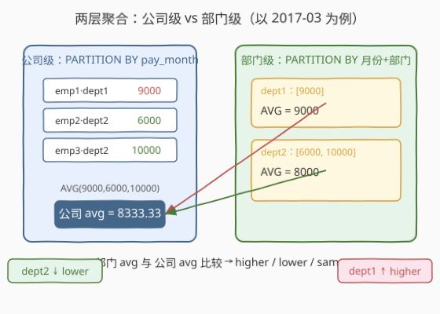
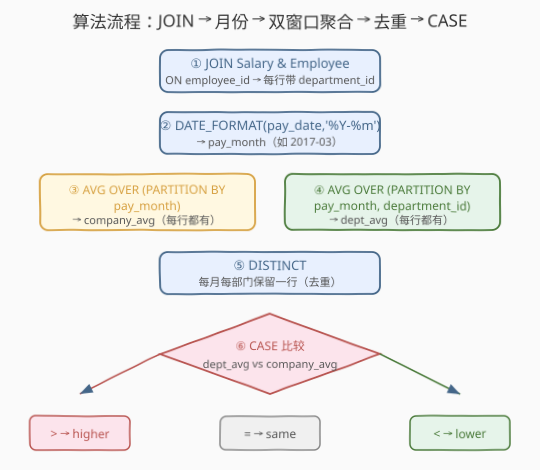
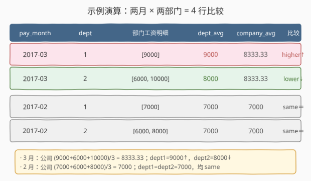

# LeetCode 平均工资：部门与公司比较 题解

## 1. 题目概述

- **标题 / 题号**：平均工资：部门与公司比较（#615，hard）
- **链接**：https://leetcode.cn/problems/average-salary-departments-vs-company/
- **难度**：困难
- **标签**：SQL、窗口函数、聚合、AVG、CASE、JOIN、分组、自连接

**题意**：给定两张表：`Salary` 记录员工每月的实发工资，`Employee` 记录员工所属部门。编写 SQL 查询，**对每个月份、每个部门**，比较「该部门当月平均工资」与「全公司当月平均工资」，输出比较结果。

**表结构**：

```text
Table: Salary
+-------------+------+
| Column Name | Type |
+-------------+------+
| id          | int  |  ← 主键
| employee_id | int  |  ← 外键 → Employee.employee_id
| amount      | int  |  ← 当月工资
| pay_date    | date |  ← 发薪日（月份由它决定）
+-------------+------+
（employee_id, pay_date）组合唯一——同一员工同月只有一条工资记录。

Table: Employee
+-------------+------+
| Column Name | Type |
+-------------+------+
| employee_id | int  |  ← 主键
| department_id | int |  ← 所属部门
+-------------+------+
```

> 💡 **关键点**：员工的部门归属来自 `Employee` 表，而工资在 `Salary` 表——必须先 `JOIN` 把 `department_id` 贴到每条工资记录上，才能按部门聚合。月份要从 `pay_date`（如 `2017-03-31`）中**截取年月** `2017-03`。

**示例 1**：

```text
输入：
Salary 表:
+----+-------------+--------+------------+
| id | employee_id | amount | pay_date   |
+----+-------------+--------+------------+
| 1  | 1           | 9000   | 2017-03-31 |
| 2  | 2           | 6000   | 2017-03-31 |
| 3  | 3           | 10000  | 2017-03-31 |
| 4  | 1           | 7000   | 2017-02-28 |
| 5  | 2           | 6000   | 2017-02-28 |
| 6  | 3           | 8000   | 2017-02-28 |
+----+-------------+--------+------------+

Employee 表:
+-------------+---------------+
| employee_id | department_id |
+-------------+---------------+
| 1           | 1             |
| 2           | 2             |
| 3           | 2             |
+-------------+---------------+

输出：
+-----------+---------------+--------------------------+
| pay_month | department_id | department_id_comparison |
+-----------+---------------+--------------------------+
| 2017-03   | 1             | higher                   |
| 2017-03   | 2             | lower                    |
| 2017-02   | 1             | same                     |
| 2017-02   | 2             | same                     |
+-----------+---------------+--------------------------+
```

**解释**：

- **2017-03**：公司平均 = $(9000+6000+10000)/3 = 8333.33$
  - 部门 1（仅 emp1）：$9000 > 8333.33$ → `higher`
  - 部门 2（emp2 + emp3）：$(6000+10000)/2 = 8000 < 8333.33$ → `lower`
- **2017-02**：公司平均 = $(7000+6000+8000)/3 = 7000$
  - 部门 1：$7000 = 7000$ → `same`
  - 部门 2：$(6000+8000)/2 = 7000 = 7000$ → `same`

**约束**：

- `pay_date` 形如 `YYYY-MM-DD`，需按 **年月**（`YYYY-MM`）分组比较
- 每个员工同月只有一条工资记录
- 每个部门当月至少有一条工资记录（保证部门聚合有意义）
- 比较结果三值：`higher`（部门 > 公司）/ `lower`（部门 < 公司）/ `same`（相等）
- 输出列名为 `pay_month`、`department_id`、`department_id_comparison`

> 💡 本题是 [184. 部门最高工资](https://leetcode.cn/problems/department-highest-salary/) 的**双层聚合升级版**——不是「每部门取一个最值」，而是「每部门均值」与「全公司均值」做行内比较。核心难点在于**两个不同粒度的聚合（公司级 vs 部门级）要在同一行对齐**，这正是窗口函数的招牌场景。

## 2. 解题思路

### 2.1 暴力思路：两个 GROUP BY 再 JOIN

最直觉的做法是分两次聚合，再按月份拼接：

1. **部门级聚合**：`GROUP BY pay_month, department_id` 算每部门当月 `AVG(amount)`
2. **公司级聚合**：`GROUP BY pay_month` 算全公司当月 `AVG(amount)`
3. **JOIN**：按 `pay_month` 把两份结果拼起来，同行得到 `(dept_avg, company_avg)`
4. **CASE**：比较两个值输出 `higher`/`lower`/`same`

```sql
-- 伪代码
WITH dept_avg AS (GROUP BY month, dept → AVG),
     company_avg AS (GROUP BY month → AVG)
SELECT ... FROM dept_avg JOIN company_avg USING(pay_month);
```

这能做对，但有两个问题：① 需要两个 CTE + 一次 JOIN，代码冗长；② 两个聚合**扫描两遍**明细数据。下文的核心观察用窗口函数一次性解决。

> ⚠️ **常见误区**：试图在**一条** `GROUP BY pay_month, department_id` 里同时算部门均值和公司均值——不行，因为公司均值跨部门，无法用部门级 `GROUP BY` 算出。必须要么自连接，要么用窗口函数把公司级聚合「贴回」每行。

### 2.2 核心观察：窗口函数把双层聚合贴回同一行



**观察 1：月份提取**

`pay_date` 是完整日期（`2017-03-31`），但题目按月比较。用 `DATE_FORMAT` 截取年月：

```sql
DATE_FORMAT(pay_date, '%Y-%m') AS pay_month   -- 2017-03-31 → '2017-03'
```

> 💡 **别用 `MONTH(pay_date)`**——会丢掉年份，跨年同月会被错误合并。`%Y-%m` 同时保留年月，是 SQL 里「按月归桶」的标准写法。

**观察 2：两个分区的嵌套关系（关键）**

本题有两个聚合粒度：

| 粒度 | 分区键 | 含义 |
|------|--------|------|
| 公司级 | `(pay_month)` | 全公司当月均值 |
| 部门级 | `(pay_month, department_id)` | 某部门当月均值 |

注意**部门级分区是公司级分区的细分**——同一个 `(pay_month)` 下，所有部门的行都属于同一个公司级分区。这意味着在带部门信息的明细表上，可以**同时**开两个窗口：

```sql
AVG(amount) OVER (PARTITION BY pay_month)                          AS company_avg
AVG(amount) OVER (PARTITION BY pay_month, department_id)           AS dept_avg
```

窗口函数的特点是**聚合后把结果贴回每一行**（不像 `GROUP BY` 会把行压扁）。于是同一行同时拥有 `dept_avg` 和 `company_avg`，直接对比即可。

> 💡 **窗口函数 vs GROUP BY 的本质区别**：`GROUP BY` 把 N 行压成 1 行（丢明细），窗口函数把聚合结果**复制**回 N 行（保留明细）。本题需要「部门均值」和「公司均值」在同一行比较，若用 `GROUP BY` 算出两者后必须 JOIN 才能对齐；窗口函数天然对齐，省掉 JOIN。

**观察 3：DISTINCT 去重收敛**

窗口函数对 `(pay_month, department_id)` 分区内的**每一行**都贴相同的 `(dept_avg, company_avg)`。例如 2017-03 部门 2 有 2 名员工，结果会出现 2 行相同数据。用 `DISTINCT` 把每个 `(pay_month, department_id)` 收敛到 1 行：

```sql
SELECT DISTINCT pay_month, department_id, company_avg, dept_avg FROM ...
```

> 💡 去掉 `DISTINCT` 会让每个部门的行数 = 该部门当月员工数，结果有冗余重复行（虽然比较结论都一样），不符合题目「每月每部门一行」的输出要求。

**观察 4：CASE 三分支比较**

拿到对齐的 `dept_avg` 与 `company_avg` 后，用 `CASE` 输出三值：

```sql
CASE
    WHEN dept_avg > company_avg THEN 'higher'
    WHEN dept_avg < company_avg THEN 'lower'
    ELSE 'same'
END AS department_id_comparison
```

> ⚠️ **浮点比较的可靠性**：本题 `amount` 为 `INT`，MySQL 的 `AVG()` 对整数列返回 `DECIMAL`（精确十进制，非浮点），两个 `DECIMAL` 用 `=`/`>`/`<` 比较是**精确**的，`same` 判定可靠。若 `amount` 是 `FLOAT`/`DOUBLE`，浮点误差可能让「本应相等」的两均值差一个 ULP，此时应改用 `ABS(dept_avg - company_avg) < 1e-9` 判等。

### 2.3 算法流程图



| 步骤 | SQL 子句 | 作用 | 行数变化 |
|------|----------|------|----------|
| ① | `Salary JOIN Employee ON employee_id` | 给每条工资贴 `department_id` | $n$ → $n$（每员工都有部门） |
| ② | `DATE_FORMAT(pay_date,'%Y-%m') AS pay_month` | 截取年月 | $n$（新增 1 列） |
| ③ | `AVG(amount) OVER (PARTITION BY pay_month)` | 公司级均值贴回每行 | $n$（新增 `company_avg` 列） |
| ④ | `AVG(amount) OVER (PARTITION BY pay_month, department_id)` | 部门级均值贴回每行 | $n$（新增 `dept_avg` 列） |
| ⑤ | `DISTINCT` | 每月每部门收敛到 1 行 | $n$ → $M \times D$（月数×部门数） |
| ⑥ | `CASE ... END` | 比较两均值输出三值 | $M \times D$（输出） |

> 💡 **执行顺序回顾**：`FROM`+`JOIN`（拼部门，$n$ 行）→ 窗口聚合（排序后计算，结果贴回 $n$ 行）→ `DISTINCT`（去重压成 $M \times D$ 行）→ `CASE`（标量变换，行数不变）→ 输出。窗口聚合的 `AVG` 只需对每分区扫一遍，不产生额外 JOIN。

### 2.4 示例演算

以题目数据为例，2 个月 × 2 部门 = 4 行比较结果：



**Step 1：JOIN 后的带部门明细**

| pay_date | employee_id | department_id | amount | pay_month |
|----------|-------------|---------------|--------|-----------|
| 2017-03-31 | 1 | 1 | 9000 | 2017-03 |
| 2017-03-31 | 2 | 2 | 6000 | 2017-03 |
| 2017-03-31 | 3 | 2 | 10000 | 2017-03 |
| 2017-02-28 | 1 | 1 | 7000 | 2017-02 |
| 2017-02-28 | 2 | 2 | 6000 | 2017-02 |
| 2017-02-28 | 3 | 2 | 8000 | 2017-02 |

**Step 2：双窗口聚合贴回每行**

| pay_month | dept | amount | dept_avg（分区: 月+部门） | company_avg（分区: 月） |
|-----------|------|--------|--------------------------|------------------------|
| 2017-03 | 1 | 9000 | 9000 | 8333.33 |
| 2017-03 | 2 | 6000 | 8000 | 8333.33 |
| 2017-03 | 2 | 10000 | 8000 | 8333.33 |
| 2017-02 | 1 | 7000 | 7000 | 7000 |
| 2017-02 | 2 | 6000 | 7000 | 7000 |
| 2017-02 | 2 | 8000 | 7000 | 7000 |

**Step 3：DISTINCT + CASE 输出**

| pay_month | department_id | dept_avg | company_avg | department_id_comparison |
|-----------|---------------|----------|-------------|--------------------------|
| 2017-03 | 1 | 9000 | 8333.33 | **higher** ↑ |
| 2017-03 | 2 | 8000 | 8333.33 | **lower** ↓ |
| 2017-02 | 1 | 7000 | 7000 | **same** ＝ |
| 2017-02 | 2 | 7000 | 7000 | **same** ＝ |

> 💡 **2017-03 部门 2 有 2 行**（emp2、emp3），`dept_avg` 都是 8000、`company_avg` 都是 8333.33——`DISTINCT` 后合并成 1 行。这是窗口函数「贴回每行」+ `DISTINCT`「收敛」的标准配合。

## 3. 参考代码

### SQL（解法 A：窗口函数，推荐）

```sql
SELECT pay_month,
       department_id,
       CASE
           WHEN dept_avg > company_avg THEN 'higher'
           WHEN dept_avg < company_avg THEN 'lower'
           ELSE 'same'
       END AS department_id_comparison
FROM (
    SELECT DISTINCT
        DATE_FORMAT(s.pay_date, '%Y-%m') AS pay_month,
        e.department_id,
        AVG(s.amount) OVER (PARTITION BY DATE_FORMAT(s.pay_date, '%Y-%m')) AS company_avg,
        AVG(s.amount) OVER (PARTITION BY DATE_FORMAT(s.pay_date, '%Y-%m'),
                                              e.department_id) AS dept_avg
    FROM Salary s
    JOIN Employee e ON s.employee_id = e.employee_id
) t;
```

> 💡 **写法要点**：
> - `JOIN Employee e ON s.employee_id = e.employee_id`——把 `department_id` 贴到每条工资记录。
> - `DATE_FORMAT(s.pay_date, '%Y-%m')`——把日期归约到年月，作为分区键。
> - 两个 `AVG(...) OVER (PARTITION BY ...)`——公司级按月分区、部门级按月+部门分区，**同一行**同时得到两个均值。
> - `DISTINCT`——窗口函数对分区内每行都贴相同均值，去重收敛到「每月每部门一行」。
> - 外层 `CASE`——比较两均值输出 `higher`/`lower`/`same`。
> - 子查询是因为 `DISTINCT` 要作用于窗口函数产出的列；`CASE` 在外层引用 `dept_avg`/`company_avg` 更清晰。

### SQL（解法 B：两个 GROUP BY + JOIN，兼容老版本）

```sql
WITH dept_avg AS (
    SELECT DATE_FORMAT(s.pay_date, '%Y-%m') AS pay_month,
           e.department_id,
           AVG(s.amount) AS dept_avg
    FROM Salary s
    JOIN Employee e ON s.employee_id = e.employee_id
    GROUP BY DATE_FORMAT(s.pay_date, '%Y-%m'), e.department_id
),
company_avg AS (
    SELECT DATE_FORMAT(s.pay_date, '%Y-%m') AS pay_month,
           AVG(s.amount) AS company_avg
    FROM Salary s
    GROUP BY DATE_FORMAT(s.pay_date, '%Y-%m')
)
SELECT d.pay_month,
       d.department_id,
       CASE
           WHEN d.dept_avg > c.company_avg THEN 'higher'
           WHEN d.dept_avg < c.company_avg THEN 'lower'
           ELSE 'same'
       END AS department_id_comparison
FROM dept_avg d
JOIN company_avg c ON d.pay_month = c.pay_month;
```

> 💡 **写法要点**：
> - `dept_avg` CTE：`GROUP BY 月份, 部门` 算部门级均值，结果每月每部门 1 行。
> - `company_avg` CTE：`GROUP BY 月份` 算公司级均值，结果每月 1 行。
> - `JOIN ... ON d.pay_month = c.pay_month`——按月份等值拼接，让部门行拿到对应月的公司均值。
> - 此解法**不依赖窗口函数**，MySQL 5.7 及以下、老版 PostgreSQL 均可运行；但需两次聚合 + 一次 JOIN，扫描两遍明细。
> - 与解法 A 的区别：解法 A 用窗口函数「贴回」实现同行对齐，解法 B 用 JOIN 实现对齐——思路同源，实现路径不同。

### Python（pandas）

```python
import pandas as pd

def average_salary(salary: pd.DataFrame, employee: pd.DataFrame) -> pd.DataFrame:
    df = salary.merge(employee, on='employee_id')
    df['pay_month'] = pd.to_datetime(df['pay_date']).dt.strftime('%Y-%m')
    df['dept_avg'] = df.groupby(['pay_month', 'department_id'])['amount'].transform('mean')
    df['company_avg'] = df.groupby('pay_month')['amount'].transform('mean')
    res = df[['pay_month', 'department_id', 'dept_avg', 'company_avg']].drop_duplicates()
    def cmp(d, c):
        if d > c: return 'higher'
        if d < c: return 'lower'
        return 'same'
    res['department_id_comparison'] = [cmp(d, c) for d, c in zip(res['dept_avg'], res['company_avg'])]
    return res[['pay_month', 'department_id', 'department_id_comparison']]
```

> 💡 **pandas 对照**：`merge(on='employee_id')` 对应 `JOIN Employee`；`dt.strftime('%Y-%m')` 对应 `DATE_FORMAT`；`groupby([...]).transform('mean')` 对应 `AVG(...) OVER (PARTITION BY ...)`——`transform` 把分组聚合结果贴回每行，正是窗口函数的语义；`drop_duplicates()` 对应 `DISTINCT`。思路与解法 A 完全一致。

## 4. 复杂度分析

| 维度 | 复杂度 | 说明 |
|------|--------|------|
| **时间（解法 A 窗口）** | $O(n \log n)$ | $n$ = `Salary` 行数。两个 `AVG OVER PARTITION BY` 各需按分区键排序 $O(n \log n)$，`DISTINCT` 再排一次 $O(n \log n)$，总体 $O(n \log n)$；单次扫描明细，无额外 JOIN |
| **时间（解法 B GROUP BY + JOIN）** | $O(n \log n)$ | 两次 `GROUP BY` 各 $O(n \log n)$（排序聚合），结果集小（$M \times D$ 与 $M$ 行），JOIN 为 $O(M \times D)$ 可忽略；常数因子比解法 A 大（扫两遍 + JOIN） |
| **空间** | $O(n)$ | JOIN 后明细 $n$ 行 + 窗口排序的临时区 $O(n)$；解法 B 的 CTE 结果为 $O(M \times D + M)$，远小于 $O(n)$ |
| **结果行数** | $O(M \times D)$ | $M$ = 月数，$D$ = 部门数；每月每部门 1 行 |

> ⚠️ SQL 复杂度取决于**执行计划**：窗口函数底层用 Sort + 帧扫描，无索引时 $O(n \log n)$；若 `pay_date`/`employee_id` 有索引，JOIN 可走索引嵌套循环。面试中说明「窗口函数单次排序 $O(n \log n)$，优于两次 GROUP BY + JOIN 的双扫描」即可。

## 5. 扩展

### 5.1 窗口函数 vs GROUP BY：何时用谁

二者都是聚合，但输出形态不同：

| 维度 | `GROUP BY` | 窗口函数 `OVER` |
|------|-----------|----------------|
| 输出行数 | 压成每分区 1 行 | 保留明细，结果贴回每行 |
| 同行对齐多个聚合 | 需 JOIN 拼接 | 天然对齐 |
| 引用明细列 | 不能（已被压扁） | 可以（明细还在） |
| 典型场景 | 只要聚合结果 | 聚合结果与明细同行比较 |

**口诀**：**「只要汇总用 GROUP BY，要比明细用窗口函数」**。本题要在同一行比 `dept_avg` 和 `company_avg`，且二者分区粒度不同（一个含 `department_id`、一个不含），用窗口函数省掉自连接，是最优解。

> 💡 推广：凡「行间比较不同粒度聚合」的题——如「每人工资 vs 所在部门均值」「每笔订单 vs 当月均值」「每个学生 vs 班级均值」——都是窗口函数的招牌场景。

### 5.2 分区嵌套：细粒度分区包含粗粒度分区

本题两个分区键：

- 公司级：`(pay_month)`
- 部门级：`(pay_month, department_id)`

部门级分区是公司级的**前缀细化**——同一个 `pay_month` 下所有部门的行，都属于同一个公司级分区。这保证了：在部门级分区的某一行上，`AVG OVER (pay_month)` 计算的公司均值**正好是该行所属月份的公司均值**，对齐天然成立。

> ⚠️ 若两个分区键**不存在前缀包含关系**（如一个按 `(month)`、一个按 `(employee_id)`），窗口函数仍能各自计算，但「同行对齐」的语义需谨慎核验——确保两个窗口在同一行上指向「同一个比较对象」。

### 5.3 进阶：部门工资趋势 vs 公司趋势

若题目改为「比较每个部门**连续 3 个月**的均值趋势与公司趋势」，需要：

1. 用 `ROWS BETWEEN 2 PRECEDING AND CURRENT ROW` 定义滑动窗口
2. 在窗口内算 `AVG` 得 3 月滑动均值
3. 比较部门滑动均值与公司滑动均值的**变化方向**（同向/反向）

这是窗口函数「帧（frame）」机制的延伸，承接 [1174. 即时食物配送 II](https://leetcode.cn/problems/immediate-food-delivery-ii/) 的窗口帧思想。本题是固定分区（全月），进阶版引入滑动帧。

## 6. 面试要点

1. **为什么用窗口函数而不是两个 GROUP BY 再 JOIN？**

   - 窗口函数把两个不同粒度的聚合（公司级按月、部门级按月+部门）**贴回同一行**，天然对齐，省掉 JOIN。`GROUP BY` 会把行压扁，算出的部门均值和公司均值在两份结果里，必须 `JOIN` 才能让它们同行。本题要在同一行比较两均值，窗口函数是最自然的写法，代码更短、只扫一遍明细。

2. **`DISTINCT` 的作用是什么？去掉会怎样？**

   - 窗口函数对分区内**每行**都贴相同的 `(dept_avg, company_avg)`。例如某部门当月有 3 名员工，结果会出现 3 行完全相同的 `(pay_month, department_id, dept_avg, company_avg)`。`DISTINCT` 把它们收敛成 1 行，满足题目「每月每部门一行」的输出要求。去掉 `DISTINCT` 结果会有冗余重复行（比较结论都一样，但行数翻倍）。

3. **公司级分区和部门级分区是什么关系？**

   - 部门级分区 `(pay_month, department_id)` 是公司级分区 `(pay_month)` 的**前缀细化**——同一月份的所有部门行属于同一个公司级分区。这保证部门级分区的某行上，`AVG OVER (pay_month)` 算出的正是该行所属月份的公司均值，对齐天然成立。这种「分区键前缀包含」是窗口函数同行对齐的语义基础。

4. **为什么用 `DATE_FORMAT(pay_date, '%Y-%m')` 而不是 `MONTH(pay_date)`？**

   - `MONTH(pay_date)` 只取月份数字（3），丢了年份——跨年同月（2017-03 和 2018-03）会被错误合并。`DATE_FORMAT(pay_date, '%Y-%m')` 保留年月（'2017-03'），是 SQL 里「按月归桶」的标准写法。PostgreSQL 对应 `TO_CHAR(pay_date, 'YYYY-MM')`。

5. **`AVG` 的结果是浮点吗？`same` 判定可靠吗？**

   - MySQL 中 `AVG()` 对 `INT` 列返回 `DECIMAL`（精确十进制，如 8333.3333），两个 `DECIMAL` 用 `=`/`>`/`<` 比较是**精确**的，`same` 判定可靠。本题 `amount` 为 `INT`，无浮点误差问题。若 `amount` 是 `FLOAT`/`DOUBLE`，浮点误差可能让本应相等的两均值差一个 ULP，此时应改用 `ABS(dept_avg - company_avg) < 1e-9` 判等。

> 💡 **一句话总结**：615 教的是「窗口函数做不同粒度聚合的同行对齐」——公司级 `AVG OVER (pay_month)` 与部门级 `AVG OVER (pay_month, department_id)` 共存于同一行，`DISTINCT` 收敛，`CASE` 比较。核心口诀：**「要比明细用窗口、分区前缀保对齐、DISTINCT 收敛每分区一行」**。所有「行内跨粒度比较」类 SQL 题都能套用。

## 同类练习题

| # | 题目 | 与本题的关联 |
|---|------|-------------|
| 184 | [部门最高工资](https://leetcode.cn/problems/department-highest-salary/) | SQL `JOIN` + `GROUP BY` 部门聚合，615 的「部门级聚合」基础版——单层聚合（每部门一个最值）vs 615 的双层聚合（部门均值 vs 公司均值） |
| 185 | [部门工资前三高](https://leetcode.cn/problems/department-top-three-salaries/) | SQL 窗口函数 `DENSE_RANK() OVER (PARTITION BY department_id)`，与 615 共享「按部门分区开窗口」范式，只是聚合函数从 `AVG` 换成 `DENSE_RANK` |
| 1174 | [即时食物配送 II](https://leetcode.cn/problems/immediate-food-delivery-ii/) | SQL `AVG() OVER (PARTITION BY ...)` 窗口均值，承接 615 的窗口聚合思路，对比「窗口均值贴回每行」的不同应用 |
| 569 | [员工薪水中位数](./569_员工薪水中位数.md) | SQL 窗口函数 + 按部门分组，承接 615 的「按部门分组窗口计算统计量」，从均值换成中位数（`ROW_NUMBER`/`COUNT` 帧计算） |
