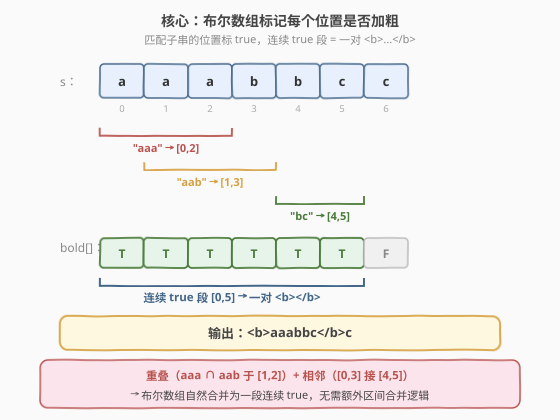
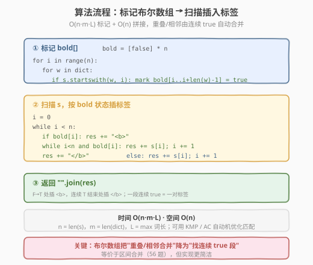
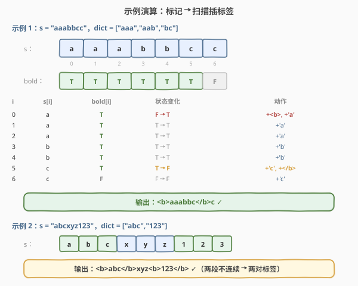

# 给字符串添加加粗标签

- **题目名称**：给字符串添加加粗标签
- **链接**：[616. 给字符串添加加粗标签](https://leetcode.cn/problems/add-bold-tag-in-string/)
- **难度**：中等
- **标签**：字符串、数组、区间合并

## 1. 题目概述

给定一个字符串 `s` 和一个单词字典 `dict`，需要用一对加粗标签 `<b>` 和 `</b>` 包裹 `s` 中所有出现在 `dict` 里的子串。规则：

- 若两个这样的子串**重叠**，则合并为一对加粗标签（不是各包各的）。
- 若两个子串**相邻**（端点接触，无间隙），也合并为一对加粗标签。

换言之，所有被任一字典词覆盖到的位置构成若干「连续 true 段」，每段用一对 `<b>...</b>` 包裹。

**示例 1**：

```text
输入：s = "aaabbcc", dict = ["aaa","aab","bc"]
输出："<b>aaabbc</b>c"
解释：
  "aaa" 命中 [0,2]，"aab" 命中 [1,3] → 二者重叠，合并为 [0,3]
  "bc"  命中 [4,5] → 与 [0,3] 相邻，合并为 [0,5]
  故 [0,5] = "aaabbc" 用一对标签包裹，末尾 'c' 不包
```

**示例 2**：

```text
输入：s = "abcxyz123", dict = ["abc","123"]
输出："<b>abc</b>xyz<b>123</b>"
解释："abc" 命中 [0,2]，"123" 命中 [6,8]，两段不相邻 → 两对标签
```

**约束条件**：

- `1 <= s.length <= 1000`
- `1 <= dict.length <= 100`
- `1 <= dict[i].length <= 100`
- `dict` 中不含重复单词
- `s` 与 `dict[i]` 可含任意字符

> 💡 本题是 LeetCode **Plus 会员专享题**。它与 [56. 合并区间](../0001-0100/56_合并区间.md) 同构——每个字典词的命中区间是 `[i, i+len-1]`，重叠/相邻的区间要合并。但本题有一个更简洁的「布尔数组标记法」，把「区间合并」降维成「找连续 true 段」，是字符串处理中极优雅的范式。

---

## 2. 解题思路

### 2.1 暴力思路：直接插入标签

对 `s` 中每个字典词的每次命中，直接在字符串里插入 `<b>`/`</b>`。问题立即出现：

- 重叠时会有嵌套标签 `<b>...<b>...</b>...</b>`，需要去嵌套
- 相邻时会有 `<b>...</b><b>...</b>`，需要合并相邻标签对
- 插入会改变下标，后续命中的位置全部错位

按插入顺序修补这些情况极易出错（边界、下标偏移、传递性合并）。根本原因是没有先「把所有命中位置算清楚」再统一包裹。

> ⚠️ 暴力插入法的困境在于「边匹配边改串」。破局思路：**先离线标记所有应加粗的位置**，再一次性扫描生成结果——把「匹配」和「包裹」两阶段解耦。

### 2.2 核心观察：布尔数组标记 + 连续 true 段

**关键转换**：用一个长度为 `n` 的布尔数组 `bold[i]`，标记 `s[i]` 这个位置是否被任一字典词覆盖。

- 遍历每个位置 `i` 与每个字典词 `w`，若 `s[i:i+len(w)] == w`，则把 `bold[i..i+len(w)-1]` 全部置 `true`。
- **重叠/相邻自动合并**：两个命中区间重叠或相邻时，对应位置的 `bold` 会连成一段连续 `true`——无需任何额外合并逻辑。
- 最后扫描 `bold`：`F→T` 处插入 `<b>`，连续 `T` 段结束时插入 `</b>`。



> 💡 **为什么布尔数组能自动处理重叠与相邻？** 「重叠」意味着两段 `true` 在某些位置共同覆盖，自然连成一段；「相邻」意味着前一段的末尾 `true` 紧挨后一段的开头 `true`，中间没有 `false` 间隔——也是连续 `true`。两种情况在布尔数组里都体现为「一段连续 true」，统一由扫描时的 `F→T` / `T→F` 跳变点插入标签。这正是把区间合并问题「拍平」为数组标记的精髓。

### 2.3 算法流程图



**完整步骤**：

1. **标记**：`bold = [False] * n`。对每个 `i`，对每个 `w ∈ dict`，若 `s.startswith(w, i)`，则 `bold[i .. i+len(w)-1] = True`
2. **扫描拼接**：`i = 0`，结果数组 `res = []`
   - `bold[i]` 为 `True`：`res.append("<b>")`，然后 `while i < n and bold[i]: res.append(s[i]); i += 1`，最后 `res.append("</b>")`
   - `bold[i]` 为 `False`：`res.append(s[i]); i += 1`
3. **返回** `"".join(res)`

### 2.4 示例演算

以示例 1 `s = "aaabbcc"`，`dict = ["aaa","aab","bc"]` 为例：



| 步骤 | i | s[i] | bold[i] | 状态变化 | 动作 |
|------|---|------|---------|----------|------|
| 1 | 0 | a | T | F → T | `+<b>`, `+'a'` |
| 2 | 1 | a | T | T → T | `+'a'` |
| 3 | 2 | a | T | T → T | `+'a'` |
| 4 | 3 | b | T | T → T | `+'b'` |
| 5 | 4 | b | T | T → T | `+'b'` |
| 6 | 5 | c | T | T → F | `+'c'`, `+</b>` |
| 7 | 6 | c | F | F → F | `+'c'` |

**最终** `res = "<b>aaabbc</b>c"`，与示例一致。

**步骤 1 详解**：`i=0` 处 `bold` 由 `F` 变 `T`（前可视为 `bold[-1]=F`），插入开标签 `<b>`，随后把 `i=0..5` 的字符依次追加（连续 `T` 段），到 `i=6` 时 `bold` 转 `F`，闭合 `</b>`。`i=5` 既是字符追加又是闭合点——闭合发生在内层 `while` 退出之后，由 `T→F` 跳变触发。

> 💡 **示例 2 的对照**：`bold = [T,T,T,F,F,F,T,T,T]`，两段连续 `true`（`[0,2]` 与 `[6,8]`）被中间三个 `false` 隔开，于是扫描时出现两次 `F→T` 跳变，生成两对独立的 `<b>...</b>`。可见「连续 true 段」的数量直接等于标签对数。

---

## 3. 参考代码

### C++

```cpp
// 给字符串添加加粗标签.cpp —— 布尔数组标记 + 扫描插标签
// 编译: g++ -O2 -std=c++17 给字符串添加加粗标签.cpp -o boldtag
#include <string>
#include <vector>
using namespace std;

class Solution {
  public:
    string addBoldTag(string s, vector<string>& dict) {
        int n = s.size();
        vector<bool> bold(n, false);

        // ① 标记：每个位置 i，检查是否被某个字典词覆盖
        for (int i = 0; i < n; ++i) {
            for (const string& w : dict) {
                int l = w.size();
                if (i + l <= n && s.compare(i, l, w) == 0) {
                    for (int j = i; j < i + l; ++j) bold[j] = true;
                }
            }
        }

        // ② 扫描：按 bold 状态插入 <b>/</b>
        string res;
        for (int i = 0; i < n; ) {
            if (bold[i]) {
                res += "<b>";
                while (i < n && bold[i]) res += s[i++];
                res += "</b>";
            } else {
                res += s[i++];
            }
        }
        return res;
    }
};
```

### Python

```python
class Solution:
    def addBoldTag(self, s: str, dict: list[str]) -> str:
        n = len(s)
        bold = [False] * n

        # ① 标记：每个位置 i，检查是否被某个字典词覆盖
        for i in range(n):
            for w in dict:
                l = len(w)
                if s.startswith(w, i):
                    for j in range(i, i + l):
                        bold[j] = True

        # ② 扫描：按 bold 状态插入 <b>/</b>
        res = []
        i = 0
        while i < n:
            if bold[i]:
                res.append("<b>")
                while i < n and bold[i]:
                    res.append(s[i])
                    i += 1
                res.append("</b>")
            else:
                res.append(s[i])
                i += 1
        return "".join(res)
```

> 💡 **实现细节**：Python 用 `s.startswith(w, i)` 在位置 `i` 处检查前缀匹配，比切片 `s[i:i+l] == w` 更省内存（不创建子串）。C++ 用 `s.compare(i, l, w) == 0` 等价。注意外层循环用 `i` 不在 `for` 内自增（`while i < n and bold[i]: i += 1` 跳过整段），所以 C++ 的扫描段写成 `for (int i = 0; i < n; )` 且仅在 `else` 分支 `i++`。

---

## 4. 复杂度分析

| 维度 | 复杂度 | 说明 |
|------|--------|------|
| **时间复杂度** | $O(n \cdot m \cdot L)$ | 标记阶段：$n$ 个位置 × $m$ 个词 × 每次比较 $O(L)$；扫描阶段 $O(n)$ |
| **空间复杂度** | $O(n)$ | 布尔数组 `bold` + 结果字符串（结果长度 $O(n)$） |
| **可优化时间** | $O(n + \sum L_i)$ | 用 AC 自动机 / Trie 把多模式匹配降到线性，见第 5 节 |

> ⚠️ **关于 $m \cdot L$**：$n \le 1000$、$m \le 100$、$L \le 100$，最坏约 $10^7$ 次字符比较，在限定下完全可接受。若 $n$、$m$ 更大（如 $10^5$ 级），需改用 AC 自动机把匹配降到 $O(n + \text{命中数})$。

---

## 5. 扩展：区间合并解法与 AC 自动机优化

### 5.1 区间合并解法（等价于 56 题）

把每个字典词的每次命中视为区间 `[i, i+len-1]`，收集所有区间后按 [56. 合并区间](../0001-0100/56_合并区间.md) 的「排序 + 线性扫描」合并，再根据合并后的区间在原串上插标签。

```python
class Solution:
    def addBoldTag(self, s: str, dict: list[str]) -> str:
        n = len(s)
        intervals = []
        for i in range(n):
            for w in dict:
                l = len(w)
                if s.startswith(w, i):
                    intervals.append([i, i + l - 1])  # 闭区间
        if not intervals:
            return s

        intervals.sort()                               # 按左端点排序
        merged = [intervals[0]]
        for a, b in intervals[1:]:
            if a <= merged[-1][1] + 1:                 # 重叠或相邻（+1 容纳相邻）
                merged[-1][1] = max(merged[-1][1], b)
            else:
                merged.append([a, b])

        # 按 merged 区间插标签
        res = []
        prev = 0
        for a, b in merged:
            res.append(s[prev:a])
            res.append("<b>" + s[a:b+1] + "</b>")
            prev = b + 1
        res.append(s[prev:])
        return "".join(res)
```

> 💡 **相邻合并的关键**：判定条件用 `a <= merged[-1][1] + 1`（注意 `+1`），因为 `[0,3]` 与 `[4,5]` 端点差 1 即相邻，应合并。这正是 [56 题](../0001-0100/56_合并区间.md) 端点接触判定的推广——56 题是 `a <= cur[1]`（端点接触算重叠），本题把「相邻」也算合并，故阈值放宽到 `+1`。

| 解法 | 时间 | 空间 | 思路 |
|------|------|------|------|
| 布尔数组 | $O(n \cdot m \cdot L)$ | $O(n)$ | 标记每个位置，找连续 true 段（推荐） |
| 区间合并 | $O(n \cdot m \cdot L + k \log k)$ | $O(k)$ | 收集区间 + 排序合并，$k$ 为命中数 |
| AC 自动机 | $O(n + \sum L_i + k)$ | $O(\sum L_i)$ | 多模式匹配线性化，适合大规模式 |

### 5.2 AC 自动机优化匹配

当 `dict` 很大时，逐位置 × 逐词匹配的 $O(n \cdot m \cdot L)$ 不可接受。把所有字典词建成 **AC 自动机**（Trie + fail 指针），一次扫描 `s` 即可找出所有命中区间，匹配阶段降到 $O(n + \sum L_i)$。布尔数组的标记与扫描逻辑完全不变，只是「找命中」这一步换了引擎。这也是 [208. 实现 Trie](https://leetcode.cn/problems/implement-trie-prefix-tree/) 与 [212. 单词搜索 II](https://leetcode.cn/problems/word-search-ii/) 的同源思路。

---

## 6. 面试要点

1. **为什么用布尔数组而不是直接插入标签？**

   - 直接插入会改变下标，导致后续命中位置错位；且重叠产生嵌套标签、相邻产生相邻标签对，需反复修补
   - 布尔数组把「匹配」与「包裹」两阶段解耦：先离线标记所有应加粗位置，再统一扫描生成
   - 重叠/相邻在布尔数组里自然表现为「连续 true 段」，无需任何额外合并代码

2. **重叠和相邻在算法里是怎么统一处理的？**

   - 重叠：两段 `true` 在共同覆盖位置连成一段
   - 相邻：前段末尾 `true` 紧挨后段开头 `true`，中间无 `false`，也是连续 `true`
   - 二者在 `bold` 数组里都是「一段连续 true」，扫描时由 `F→T` 跳变开标签、`T→F` 跳变闭标签统一处理
   - 这等价于区间合并里把「相邻」也视为可合并（阈值 `+1`）

3. **这题和 56. 合并区间有什么关系？**

   - 完全同构：每个命中是区间 `[i, i+len-1]`，重叠/相邻要合并
   - 区间合并解法是 56 题的直接套用，只是合并阈值从「端点接触」放宽到「相邻（差 1）」
   - 布尔数组法是区间合并的「拍平」版本——用 $O(n)$ 数组代替区间列表，省去排序

4. **标记阶段为什么是 $O(n \cdot m \cdot L)$？能优化吗？**

   - $n$ 个位置 × $m$ 个词 × 每次字符串比较 $O(L)$
   - 优化：用 KMP 对每个词单独匹配 $O(n + L)$，总 $O(m \cdot n)$；用 AC 自动机一次扫描 $O(n + \sum L_i)$
   - 在本题限定（$n \le 1000, m \le 100, L \le 100$）下，朴素法约 $10^7$ 次比较，足够

5. **扫描时 `i` 的自增要注意什么？**

   - 进入 `bold[i]=True` 分支后，内层 `while` 已把 `i` 推到下一段 `false`（或末尾），外层**不能再 `i++`**
   - C++ 写成 `for (int i = 0; i < n; )`，仅在 `else` 分支 `i++`；Python 同理用 `while i < n` 手动控制
   - 这是本题最容易写错的细节：在内层循环里自增后又被外层 `for` 自增一次，会跳过字符

> 💡 **一句话总结**：616 是「字符串上的区间合并」——把每个字典词命中拍平成布尔数组，重叠/相邻自动合并为连续 true 段，扫描跳变点插标签即可。它把 [56. 合并区间](../0001-0100/56_合并区间.md) 的排序+扫描范式，用 $O(n)$ 数组标记优雅替代，是「标记法降维区间问题」的招牌题。

---

## 7. 同类练习题

- [56. 合并区间](https://leetcode.cn/problems/merge-intervals/)：区间合并母题，本题的区间合并解法直接套用其排序+线性扫描
- [57. 插入区间](https://leetcode.cn/problems/insert-interval/)：单区间插入并合并，56 的特例（已排序无重叠列表）
- [758. 字符串中的加粗单词](https://leetcode.cn/problems/bold-words-in-string/)（Premium）：姊妹题，要求整词匹配（单词边界），核心同为布尔数组标记
- [1109. 航班预订统计](https://leetcode.cn/problems/corporate-flight-bookings/)：差分数组标记法，同类「用数组标记区间影响」的思想
- [1094. 拼车](https://leetcode.cn/problems/car-pooling/)：差分数组处理区间叠加，与布尔数组标记同源
