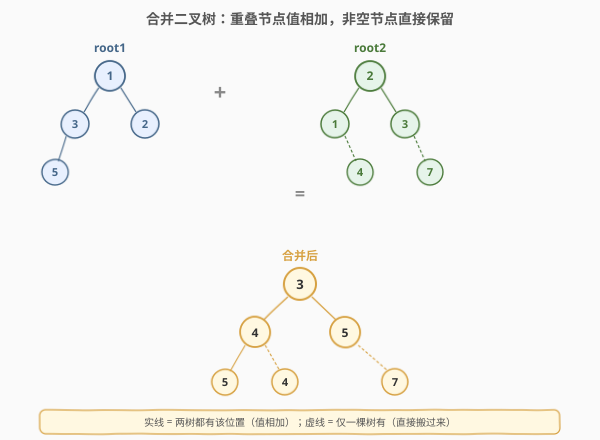
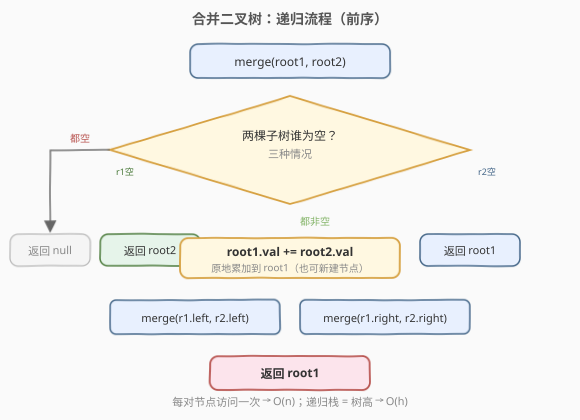
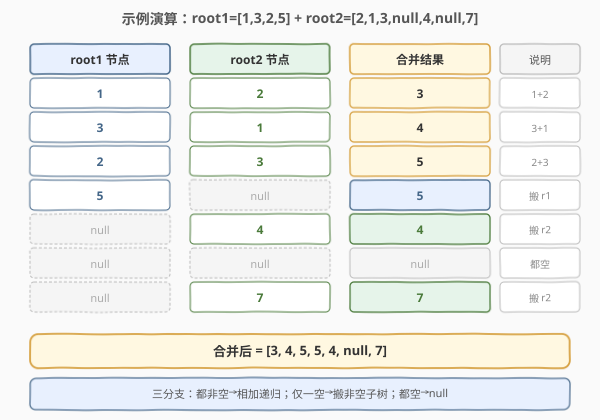

# 合并二叉树

- **题目名称**：合并二叉树
- **链接**：[617. 合并二叉树](https://leetcode.cn/problems/merge-two-binary-trees/)
- **难度**：简单
- **标签**：树、二叉树、递归、DFS

## 1. 题目概述

给你两棵二叉树 `root1` 和 `root2`，将它们**重叠合并**为一棵新树。合并规则：

- 如果两个节点在**同一位置重叠**，则把它们的值**相加**作为合并后该位置节点的值；
- 如果某个位置**只有一棵树有节点**，则该节点**直接搬入**合并后的树；
- 如果某个位置两棵树**都为空**，则合并后也为空。

最终返回合并后的二叉树的根节点。题目允许**原地修改** `root1`，也可选择**新建节点**。

**示例 1**：

```text
输入：root1 = [1,3,2,5], root2 = [2,1,3,null,4,null,7]
输出：[3,4,5,5,4,null,7]
解释：重叠位置相加，单边节点保留。
```

**示例 2**：

```text
输入：root1 = [1], root2 = [1,2]
输出：[2,2]
```

**约束条件**：

- 两棵树中的节点数目范围 `[0, 2000]`
- `-10^4 <= Node.val <= 10^4`

---

## 2. 解题思路

### 2.1 暴力思路：遍历两棵树再重建

先把两棵树分别层序遍历拍平成数组，按下标逐位相加（处理一空一非空），再由数组重建二叉树。可行但**空间和代码量都翻倍**，还要处理 `null` 拍平时丢失的结构信息，得不偿失。

其实**两棵树同步递归**就是最自然的解法。

### 2.2 核心观察：同位置同步递归，三分支归并



合并的本质是**在同一位置上对两棵树的节点做归并**，每个位置只有三种情况：

| 情况 | root1 | root2 | 合并结果 |
|------|-------|-------|----------|
| 都非空 | 有值 $v_1$ | 有值 $v_2$ | 新值 $v_1 + v_2$，递归合并左右子树 |
| 仅 root1 空 | `null` | 有节点 | 直接返回 root2 子树 |
| 仅 root2 空 | 有节点 | `null` | 直接返回 root1 子树 |
| 都空 | `null` | `null` | `null` |

> 💡 关键观察：当**一侧为空**时，另一侧的整棵子树可以**原样挂上去**——因为另一侧子树的内部结构已完整，无需再递归。这条剪枝让递归只在「两树都非空」的位置继续往下走。

> ⚠️ 注意「都空」可以和「仅一侧空」合并判断：只要 `root1 == null` 就返回 `root2`（无论 `root2` 是否为空，是 `null` 返回 `null`，非 `null` 返回子树），反之亦然。代码因此极简。

### 2.3 算法流程图



### 2.4 示例演算

以 `root1 = [1,3,2,5]`、`root2 = [2,1,3,null,4,null,7]` 为例，递归逐节点归并：



最终合并树为 `[3,4,5,5,4,null,7]`：

- 根 `3 = 1+2`
- 左子 `4 = 3+1`，右子 `5 = 2+3`
- 左子左 `5`（root1 有 5，root2 空 → 搬 root1）
- 左子右 `4`（root1 空，root2 有 4 → 搬 root2）
- 右子右 `7`（root1 空，root2 有 7 → 搬 root2）

---

## 3. 参考代码

### C++

```cpp
class Solution {
  public:
    TreeNode* mergeTrees(TreeNode* root1, TreeNode* root2) {
        if (root1 == nullptr) return root2;
        if (root2 == nullptr) return root1;
        root1->val += root2->val;
        root1->left  = mergeTrees(root1->left,  root2->left);
        root1->right = mergeTrees(root1->right, root2->right);
        return root1;
    }
};
```

### Python

```python
class Solution:
    def mergeTrees(self, root1: Optional[TreeNode], root2: Optional[TreeNode]) -> Optional[TreeNode]:
        if not root1:
            return root2
        if not root2:
            return root1
        root1.val += root2.val
        root1.left  = self.mergeTrees(root1.left,  root2.left)
        root1.right = self.mergeTrees(root1.right, root2.right)
        return root1
```

> 💡 两行判空是这题的灵魂：`if not root1: return root2` 同时处理了「root1 空而 root2 非空」和「都空」两种情况，无需单独写第四个分支。

---

## 4. 复杂度分析

| 维度 | 复杂度 | 说明 |
|------|--------|------|
| 时间复杂度 | $O(\min(m, n))$ | 递归只在两棵树都非空的位置继续，对齐节点数取较小者；单边子树直接挂回不再遍历 |
| 空间复杂度 | $O(\min(h_1, h_2))$ | 递归栈深度 = 重叠路径长度，即两棵树高度的较小值；最坏链状 $O(n)$，平衡 $O(\log n)$ |

> ⚠️ 若一棵树远大于另一棵（如 `root1` 只有一个节点，`root2` 是 2000 节点的满树），则只需访问 1 个重叠节点，剩余 `root2` 子树整体挂回，时间 $O(1)$。这是「单边剪枝」带来的效率。

---

## 5. 扩展：迭代法（BFS 双队列）

用两个队列同步层序遍历，避免递归栈溢出（适合极深的树）：

```python
from collections import deque

class Solution:
    def mergeTrees(self, root1: Optional[TreeNode], root2: Optional[TreeNode]) -> Optional[TreeNode]:
        if not root1: return root2
        if not root2: return root1
        q = deque([(root1, root2)])
        while q:
            n1, n2 = q.popleft()
            n1.val += n2.val
            # 左孩子：都非空才入队；n1 左空则把 n2 左挂过来
            if n1.left and n2.left:
                q.append((n1.left, n2.left))
            elif not n1.left:
                n1.left = n2.left
            # 右孩子同理
            if n1.right and n2.right:
                q.append((n1.right, n2.right))
            elif not n1.right:
                n1.right = n2.right
        return root1
```

> 💡 迭代版只在「两树对应位置都非空」时入队；只要 `n1` 的孩子为空，就把 `n2` 的整棵子树挂过来后**不再继续遍历**该子树——与递归的单边剪枝逻辑一致。

---

## 6. 面试要点

1. **为什么 `if not root1: return root2` 一行能覆盖两种情况？**
   - 当 `root1` 为 `null` 时，无论 `root2` 是 `null`（都空→返回 `null`）还是非空（单边→返回 root2 子树），返回 `root2` 都正确。利用 `null` 的「穿透性」省掉一个分支。

2. **原地修改 root1 和新建节点，面试该选哪个？**
   - 原地修改（`root1.val += root2.val`）空间更省、代码更短，是 LeetCode 官方默认写法。新建节点适合**不允许破坏输入**的场景（如函数被多次调用、输入需保留），代价是多 O(重叠节点数) 的新节点。面试先说原地版，再主动提「如需保留输入可新建」。

3. **时间复杂度为什么是 O(min(m, n)) 而不是 O(m+n)？**
   - 递归只在两树都非空的重叠位置继续往下。一旦某侧为空，另一侧整棵子树直接挂回、不再访问。所以访问的节点数至多是两棵树重叠部分的大小，即 $\min(m, n)$ 级别。

4. **这题和「相同的树」（100）有什么关系？**
   - 都是「两棵树同步递归」骨架。100 是**判定**（逐节点比值是否相等），617 是**归并**（逐节点比值相加）。判空分支几乎一样，差别只在「都非空」时：100 比较 `p.val == q.val`，617 执行 `r1.val += r2.val`。

5. **迭代版为什么「单边挂回」后就不再遍历该子树？**
   - 因为挂回的子树内部结构已经完整、无需再合并（对应位置 root1 都是 `null`）。继续遍历只是重复扫描一棵已知树，没有合并工作可做。

---

## 7. 同类练习题

- [100. 相同的树](https://leetcode.cn/problems/same-tree/)（[题解](../0101-0200/100_相同的树.md)）：两棵树同步递归判定的母题，骨架与本题一致
- [226. 翻转二叉树](https://leetcode.cn/problems/invert-binary-tree/)（[题解](../0201-0300/226_翻转二叉树.md)）：单棵树递归修改结构，对比本题的双树同步递归
- [700. 二叉搜索树中的搜索](https://leetcode.cn/problems/search-in-a-binary-search-tree/)：单棵树递归 + 单边剪枝返回子树，与本题「一侧为空直接返回另一侧」同思路
- [572. 另一棵树的子树](https://leetcode.cn/problems/subtree-of-another-tree/)：在主树中寻找与子树「相同」的位置，复用 100 的同步递归判定
