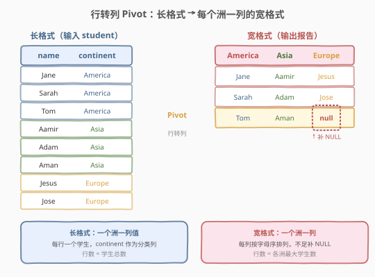
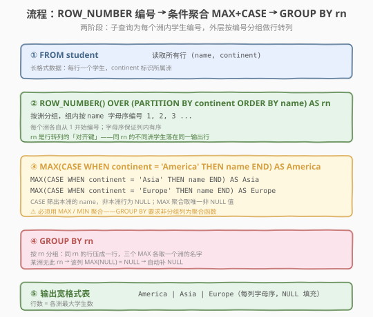
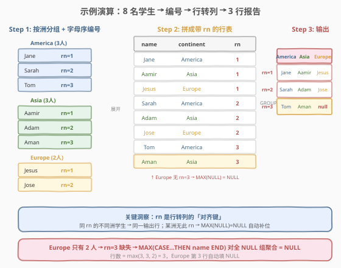

# 学生地理信息报告

- **题目名称**：学生地理信息报告
- **链接**：[618. 学生地理信息报告](https://leetcode.cn/problems/students-report-by-geography/)
- **难度**：困难
- **标签**：SQL、行转列、Pivot、窗口函数、ROW_NUMBER、条件聚合、CASE WHEN、GROUP BY

## 1. 题目概述

一所美国研究生院有来自亚洲、欧洲和美洲的学生。学校希望生成一份**地理信息报告**：把 `student` 表从「长格式」（每行一个学生 + 所属洲）**转置为「宽格式」**——每个洲单独一列，列内学生姓名按字母序排列，行数等于各洲学生数的最大值，不足的用 `NULL` 填充。

**表结构**：

```text
Table: student
+-------------+---------+
| Column Name | Type    |
+-------------+---------+
| name        | varchar |  ← 学生姓名
| continent   | varchar |  ← 所属洲：America / Asia / Europe
+-------------+---------+
```

> 💡 **关键约束**：`(continent, name)` 为复合主键——同一洲内没有重名学生。输出列固定为 `America`、`Asia`、`Europe`（按此顺序），每列内的姓名需**按字母升序**排列。行数 = $\max(\text{各洲学生数})$，不足补 `NULL`。

**示例 1**：

```text
输入：
student 表:
+--------+-----------+
| name   | continent |
+--------+-----------+
| Jane   | America   |
| Sarah  | America   |
| Tom    | America   |
| Adam   | Asia      |
| Aman   | Asia      |
| Aamir  | Asia      |
| Jose   | Europe    |
| Jesus  | Europe    |
+--------+-----------+

输出：
+---------+--------+--------+
| America | Asia   | Europe |
+---------+--------+--------+
| Jane    | Aamir  | Jesus  |
| Sarah   | Adam   | Jose   |
| Tom     | Aman   | null   |
+---------+--------+--------+
```

**解释**：

- America 有 3 人：Jane、Sarah、Tom → 字母序 Jane < Sarah < Tom
- Asia 有 3 人：Aamir、Adam、Aman → 字母序 Aamir < Adam < Aman
- Europe 有 2 人：Jesus、Jose → 字母序 Jesus < Jose
- 最大学生数 = $\max(3, 3, 2) = 3$，所以输出 3 行；Europe 只有 2 人，第 3 行补 `NULL`

**约束条件**：

- `(continent, name)` 为 `student` 表的主键
- `continent` 取值仅为 `America`、`Asia`、`Europe`
- 输出固定 3 列：`America`、`Asia`、`Europe`
- 每列内姓名按字母升序
- 行数 = 各洲学生数的最大值，不足补 `NULL`

> 💡 本题是 SQL **行转列（Pivot）** 的经典 Hard 题。核心难点不在「转列」本身，而在于**如何在 SQL 中实现「对齐填充」**——让不同长度的列等高排列，短的自动补 `NULL`。这需要窗口函数 `ROW_NUMBER` 生成「对齐键」+ 条件聚合 `MAX(CASE WHEN ...)` 完成转列。

---

## 2. 解题思路

### 2.1 暴力思路：逐洲查 + 外连接对齐

最直觉的做法是：对每个洲分别查出一列姓名（按字母序编号），再用 `LEFT JOIN` 按「第几名」对齐拼成宽表：

```sql
-- 伪代码
WITH america AS (SELECT name, ROW_NUMBER() OVER (ORDER BY name) AS rn ...),
     asia    AS (SELECT name, ROW_NUMBER() OVER (ORDER BY name) AS rn ...),
     europe  AS (SELECT name, ROW_NUMBER() OVER (ORDER BY name) AS rn ...)
SELECT a.name, b.name, c.name
FROM <所有 rn 的集合>
LEFT JOIN america a ON rn = a.rn
LEFT JOIN asia    b ON rn = b.rn
LEFT JOIN europe  c ON rn = c.rn;
```

这种写法能工作，但**每新增一个洲就要加一段 CTE + 一个 LEFT JOIN**——3 个洲尚可，若有 10 个洲则 SQL 会极度冗长。更致命的是，「所有 rn 的集合」需要额外用 `UNION` 收集各洲的编号，逻辑分散且易错。

> ⚠️ **两个痛点**：① 每个洲单独写一段几乎相同的子查询，违反 DRY；② 「对齐键」`rn` 的集合需要额外 `UNION` 收集，嵌套层次深。下文的核心观察用「条件聚合」一步到位解决这两个问题。

### 2.2 核心观察：ROW_NUMBER 对齐键 + MAX(CASE) 条件聚合



**观察 1：ROW_NUMBER 生成「对齐键」**

行转列的本质是：**把同一列内的多个值展开到多列**。但 SQL 的 `SELECT` 是逐行处理的，无法直接「跨行取值」。我们需要一个**对齐键**来标识「哪些行的值应该放在同一输出行」。

`ROW_NUMBER() OVER (PARTITION BY continent ORDER BY name)` 完美满足需求：

- `PARTITION BY continent`——每个洲各自从 1 开始编号
- `ORDER BY name`——编号顺序 = 字母顺序，保证列内有序
- `rn` 相同的不同洲学生，恰好对应输出表的同一行

$$\text{rn} = \text{该学生在本洲内的字母序排名}$$

> 💡 **为什么用 `ROW_NUMBER` 而不是 `RANK`/`DENSE_RANK`**：主键保证 `(continent, name)` 唯一，不存在并列，三种函数结果相同。但 `ROW_NUMBER` 保证**连续无间隔**（1, 2, 3...），这对 `GROUP BY rn` 的对齐至关重要——若有间隔，会产生多余的空行。

**观察 2：MAX(CASE WHEN ...) 条件聚合完成转列**

有了 `rn` 后，对 `rn` 分组，每组内用 `CASE WHEN continent = 'xxx' THEN name END` 筛出本洲的姓名（非本洲行为 `NULL`），再用 `MAX` 聚合取出那个唯一的非 `NULL` 值：

```sql
MAX(CASE WHEN continent = 'America' THEN name END) AS America
```

**为什么 `MAX` 能取到唯一非 NULL 值？**

- 每个 `rn` 分组内，每个洲**至多有一行**（因为 `ROW_NUMBER` 在 `PARTITION BY continent` 内唯一）
- `CASE WHEN continent = 'America' THEN name END` 对 America 的那行返回 `name`，对其他洲的行返回 `NULL`
- `MAX` 在「1 个非 NULL + 若干 NULL」上聚合，结果就是那个唯一的非 NULL 值
- 若该洲**无此 `rn`**（学生数不足），则组内全是 `NULL`，`MAX(NULL, NULL, ...) = NULL` → **自动补 `NULL`**

> 💡 这就是「自动填充 `NULL`」的原理——无需显式判断「某洲学生数是否够」，`MAX` 对全 `NULL` 组天然返回 `NULL`。对比暴力解法中需要手动 `LEFT JOIN` 才能补 `NULL`，条件聚合把对齐和填充合为一步。

**观察 3：GROUP BY rn 把多行压成一行**

不加 `GROUP BY rn` 时，子查询的 8 行会各自产出一行，每行的 `CASE` 只有一个非 `NULL`（自己洲的），其余为 `NULL`——得到 8 行稀疏数据。加上 `GROUP BY rn` 后，同 `rn` 的行（最多 3 行，每洲一行）被压成一行，三个 `MAX` 各取一个洲的值，得到密集的 3 行宽格式输出。

| 操作 | 行数 | 每行形态 |
|------|------|----------|
| 子查询（带 rn） | $n$（总学生数） | name + continent + rn |
| `GROUP BY rn` 前 | $n$ | 稀疏：3 个 CASE 列中仅 1 个非 NULL |
| `GROUP BY rn` 后 | $\max(\text{各洲数})$ | 密集：3 个 MAX 列各取 1 个非 NULL（或 NULL） |

### 2.3 算法流程图



| 步骤 | SQL 子句 | 作用 | 行数变化 |
|------|----------|------|----------|
| ① | `FROM student` | 读取所有行 `(name, continent)` | $n$ 行 |
| ② | `ROW_NUMBER() OVER (PARTITION BY continent ORDER BY name) AS rn` | 每个洲内按字母序编号 1, 2, 3... | $n$ 行（新增 rn 列） |
| ③ | `MAX(CASE WHEN continent='America' THEN name END) AS America`（Asia/Europe 同理） | 按 rn 分组后，每组取各洲的唯一非 NULL 值 | $n$ → $\max$ |
| ④ | `GROUP BY rn` | 同 rn 的行压成一行 | $\max(\text{各洲数})$ 行 |
| ⑤ | 输出 | 3 列宽格式，NULL 自动填充 | $\max$ 行 × 3 列 |

> 💡 **执行顺序回顾**：`FROM`（取 $n$ 行长格式）→ 窗口函数 `ROW_NUMBER`（附加 rn 列，仍 $n$ 行）→ `GROUP BY rn`（按 rn 聚合，压成 $\max$ 行）→ `MAX(CASE ...)`（每个聚合列取本洲唯一非 NULL 值）→ 输出。窗口函数在 `GROUP BY` **之前**执行，所以 `ROW_NUMBER` 作用于原始 $n$ 行，而非聚合后的行。

### 2.4 示例演算

以示例 8 名学生为例，展示从长格式到宽格式的完整变换过程：



**Step 1：按洲分组 + 字母序编号（ROW_NUMBER）**

| continent | name | rn |
|-----------|------|----|
| America | Jane | 1 |
| America | Sarah | 2 |
| America | Tom | 3 |
| Asia | Aamir | 1 |
| Asia | Adam | 2 |
| Asia | Aman | 3 |
| Europe | Jesus | 1 |
| Europe | Jose | 2 |

> 💡 注意 Asia 的字母序：A**a**mir < A**d**am < A**m**an（比较第 2 个字符 `a` < `d` < `m`）。Europe 只有 2 人，所以 rn 只到 2，没有 rn=3。

**Step 2：GROUP BY rn + MAX(CASE WHEN ...) 转列**

| rn | America 列 | Asia 列 | Europe 列 |
|----|------------|---------|-----------|
| 1 | MAX(Jane, NULL, NULL) = **Jane** | MAX(NULL, Aamir, NULL) = **Aamir** | MAX(NULL, NULL, Jesus) = **Jesus** |
| 2 | MAX(Sarah, NULL, NULL) = **Sarah** | MAX(NULL, Adam, NULL) = **Adam** | MAX(NULL, NULL, Jose) = **Jose** |
| 3 | MAX(Tom, NULL, NULL) = **Tom** | MAX(NULL, Aman, NULL) = **Aman** | MAX(NULL, NULL, NULL) = **null** |

> 💡 **rn=3 的 Europe 列**：Europe 只有 Jesus(rn=1) 和 Jose(rn=2)，没有 rn=3 的行。所以 `GROUP BY rn=3` 这组里 Europe 的 `CASE WHEN continent='Europe' THEN name END` 全为 `NULL`，`MAX(NULL) = NULL`，自动填充。这就是「不足补 NULL」的完整原理。

---

## 3. 参考代码

### SQL（解法 A：ROW_NUMBER + 条件聚合，推荐）

```sql
SELECT
    MAX(CASE WHEN continent = 'America' THEN name END) AS America,
    MAX(CASE WHEN continent = 'Asia'    THEN name END) AS Asia,
    MAX(CASE WHEN continent = 'Europe'  THEN name END) AS Europe
FROM (
    SELECT name, continent,
           ROW_NUMBER() OVER (PARTITION BY continent ORDER BY name) AS rn
    FROM student
) t
GROUP BY rn;
```

> 💡 **写法要点**：
> - **子查询**：`ROW_NUMBER() OVER (PARTITION BY continent ORDER BY name) AS rn`——为每个洲内的学生按字母序编号 1, 2, 3...，`rn` 是后续行转列的「对齐键」。
> - **外层条件聚合**：`MAX(CASE WHEN continent = 'America' THEN name END)`——`CASE` 筛出 America 行的 `name`（非 America 行为 `NULL`），`MAX` 聚合取组内唯一非 `NULL` 值。
> - **`GROUP BY rn`**：同 `rn` 的行压成一行，三个 `MAX` 各取一个洲的名字。某洲无此 `rn` → `MAX(NULL,...) = NULL` 自动补位。
> - **不需要 `ORDER BY rn`**：`GROUP BY rn` 后行天然按 `rn` 排序输出（MySQL 实现），但 SQL 标准不保证。若需严格排序，可加 `ORDER BY rn`。

### SQL（解法 B：三 CTE + LEFT JOIN，思路直观）

```sql
WITH america AS (
    SELECT name, ROW_NUMBER() OVER (ORDER BY name) AS rn
    FROM student WHERE continent = 'America'
),
asia AS (
    SELECT name, ROW_NUMBER() OVER (ORDER BY name) AS rn
    FROM student WHERE continent = 'Asia'
),
europe AS (
    SELECT name, ROW_NUMBER() OVER (ORDER BY name) AS rn
    FROM student WHERE continent = 'Europe'
),
rn_set AS (
    SELECT rn FROM america
    UNION
    SELECT rn FROM asia
    UNION
    SELECT rn FROM europe
)
SELECT a.name AS America, b.name AS Asia, c.name AS Europe
FROM rn_set r
LEFT JOIN america a ON r.rn = a.rn
LEFT JOIN asia    b ON r.rn = b.rn
LEFT JOIN europe  c ON r.rn = c.rn
ORDER BY r.rn;
```

> 💡 **写法要点**：
> - 每个洲单独一个 CTE，内含该洲学生按字母序编号后的 `(name, rn)`。
> - `rn_set` 用 `UNION` 收集所有洲出现的 `rn` 值（去重后为 1 到 max）。
> - `LEFT JOIN` 按 `rn` 对齐——某洲无此 `rn` 时 `LEFT JOIN` 自动补 `NULL`。
> - **对比解法 A**：逻辑更直观（「每洲一列 + 按编号对齐」一目了然），但**每新增一个洲要加一个 CTE + 一个 LEFT JOIN**，扩展性差。解法 A 只需加一个 `MAX(CASE ...)` 列，更优雅。

### SQL（解法 C：IF 替代 CASE，MySQL 简写）

```sql
SELECT
    MAX(IF(continent = 'America', name, NULL)) AS America,
    MAX(IF(continent = 'Asia',    name, NULL)) AS Asia,
    MAX(IF(continent = 'Europe',  name, NULL)) AS Europe
FROM (
    SELECT name, continent,
           ROW_NUMBER() OVER (PARTITION BY continent ORDER BY name) AS rn
    FROM student
) t
GROUP BY rn;
```

> 💡 **`IF` vs `CASE`**：`IF(cond, a, b)` 是 MySQL 专有函数，等价于 `CASE WHEN cond THEN a ELSE b END`。本题 `CASE WHEN continent='America' THEN name END` 的 `ELSE` 默认为 `NULL`，所以 `IF(continent='America', name, NULL)` 完全等价。写法更短但不跨库（PostgreSQL / SQL Server 无 `IF`）。与 [610. 判断三角形](./610_判断三角形.md) 中 `IF` vs `CASE` 的讨论一致。

### Python（pandas）

```python
import pandas as pd

def students_report_by_geography(student: pd.DataFrame) -> pd.DataFrame:
    student = student.sort_values(['continent', 'name'])
    student['rn'] = student.groupby('continent').cumcount() + 1
    result = student.pivot(index='rn', columns='continent', values='name')
    cols = [c for c in ['America', 'Asia', 'Europe'] if c in result.columns]
    result = result[cols].reset_index(drop=True)
    return result
```

> 💡 **pandas 对照**：`sort_values(['continent', 'name'])` 对应 `PARTITION BY continent ORDER BY name`；`groupby('continent').cumcount() + 1` 对应 `ROW_NUMBER() OVER (PARTITION BY continent ORDER BY name)`；`pivot(index='rn', columns='continent', values='name')` 对应 `MAX(CASE WHEN continent='xxx' THEN name END) ... GROUP BY rn` 的行转列。pandas 的 `pivot` 天然用 `NaN` 填充缺失，对应 SQL 的 `NULL` 自动补位。

---

## 4. 复杂度分析

| 维度 | 复杂度 | 说明 |
|------|--------|------|
| **时间（解法 A）** | $O(n \log n)$ | $n$ = `student` 行数。子查询排序（`ORDER BY name`）为 $O(n \log n)$；`ROW_NUMBER` 扫描为 $O(n)$；外层 `GROUP BY rn` 聚合为 $O(n)$。瓶颈在排序 |
| **时间（解法 B）** | $O(n \log n)$ | 每个 CTE 内排序 $O(n_i \log n_i)$，总计 $O(n \log n)$；`UNION` + `LEFT JOIN` 为 $O(n)$ |
| **空间** | $O(n)$ | 子查询中间结果集（带 rn 的 $n$ 行）；解法 B 的 3 个 CTE 各 $O(n_i)$，总计 $O(n)$ |
| **结果行数** | $O(\max)$ | 输出行数 = 各洲学生数最大值，$\leq n$；输出 3 列 |

> ⚠️ SQL 复杂度取决于**执行计划**：若 `continent` 有索引，排序可优化；`GROUP BY rn` 若 `rn` 有索引可免排序。面试中说明「排序 $O(n \log n)$，聚合 $O(n)$，瓶颈在窗口函数的排序」即可。注意 `ROW_NUMBER` 的 `PARTITION BY continent ORDER BY name` 在最坏情况下需要全表排序。

---

## 5. 扩展

### 5.1 为什么用 MAX 而不是 SUM / MIN / AVG？

`CASE WHEN continent = 'America' THEN name END` 在 `GROUP BY rn` 的每组内产生「1 个非 NULL 字符串 + 若干 NULL」。SQL 聚合函数对 `NULL` 的处理：

| 聚合函数 | 对 `('Jane', NULL, NULL)` 的结果 | 能用？ |
|----------|----------------------------------|--------|
| `MAX` | `'Jane'` | ✅ 取最大值，字符串可比较，非 NULL 值唯一 |
| `MIN` | `'Jane'` | ✅ 同理，取最小值，结果相同（只有 1 个非 NULL） |
| `SUM` | 报错 | ❌ `SUM` 只接受数值，不能聚合字符串 |
| `COUNT` | `1` | ❌ 返回计数而非姓名 |
| `GROUP_CONCAT` | `'Jane'` | ✅ MySQL 专有，但语义不直观 |

> 💡 `MAX` 和 `MIN` 在「每组仅 1 个非 NULL」时结果相同，都可用。社区惯例用 `MAX`，因为「取最大值」更符合「选出那个值」的直觉。`MIN` 同样正确，但不常见。

### 5.2 行转列的两种范式：条件聚合 vs CASE+JOIN

SQL 行转列有两种主流写法：

**范式 1：条件聚合（本题解法 A，推荐）**

```sql
SELECT rn,
       MAX(CASE WHEN continent='America' THEN name END) AS America, ...
FROM (子查询带 rn) t
GROUP BY rn;
```

- **优点**：一个 `GROUP BY` 搞定所有列，新增列只需加一个 `MAX(CASE ...)`，扩展性好
- **缺点**：需要理解「MAX 取唯一非 NULL」的技巧

**范式 2：多 CTE + LEFT JOIN（本题解法 B）**

```sql
WITH a AS (...), b AS (...), c AS (...)
SELECT a.name, b.name, c.name
FROM rn_set LEFT JOIN a ... LEFT JOIN b ... LEFT JOIN c ...;
```

- **优点**：逻辑直观，每列一个子查询，无需聚合技巧
- **缺点**：新增列需加 CTE + JOIN，SQL 膨胀快；`rn_set` 收集对齐键多一步 `UNION`

> 💡 **选择原则**：列数 $\leq 3$ 时两种写法均可；列数多或不确定时优先条件聚合。面试中先写条件聚合（展示技巧），再口头提「也可用多 CTE + LEFT JOIN」展示全面性。

### 5.3 列转行（Unpivot）：反向操作

本题是**行转列**（Pivot），反向操作是**列转行**（Unpivot）。SQL 中常用 `UNION ALL` 实现：

```sql
-- 把宽格式表 wide_table(name, America, Asia, Europe) 转回长格式
SELECT name, 'America' AS continent, America AS name FROM wide_table WHERE America IS NOT NULL
UNION ALL
SELECT name, 'Asia'    AS continent, Asia    AS name FROM wide_table WHERE Asia    IS NOT NULL
UNION ALL
SELECT name, 'Europe'  AS continent, Europe  AS name FROM wide_table WHERE Europe  IS NOT NULL;
```

> 💡 MySQL 8.0+ 也可用 `UNPIVOT` 语法（部分数据库支持），但 `UNION ALL` 是跨库通用的标准写法。行转列用条件聚合，列转行用 `UNION ALL`——两者互为逆操作。

### 5.4 动态行转列（列名不固定时的进阶）

本题输出列固定为 `America`、`Asia`、`Europe`，可以直接硬编码 `CASE WHEN`。若**洲名不固定**（可能新增 `Africa`、`Oceania`），标准 SQL 无法在单条查询中动态生成列名——需要**动态 SQL**（prepared statement）：

```sql
SET @sql = NULL;
SELECT
  GROUP_CONCAT(DISTINCT
    CONCAT('MAX(CASE WHEN continent = ''', continent, ''' THEN name END) AS `', continent, '`')
  ) INTO @sql
FROM student;

SET @sql = CONCAT(
  'SELECT ', @sql,
  ' FROM (SELECT name, continent, ROW_NUMBER() OVER (PARTITION BY continent ORDER BY name) AS rn FROM student) t',
  ' GROUP BY rn'
);

PREPARE stmt FROM @sql;
EXECUTE stmt;
DEALLOCATE PREPARE stmt;
```

> ⚠️ 动态 SQL 在面试中一般口头提一句即可，不要求手写。核心思路是：先用 `GROUP_CONCAT` 拼出所有 `MAX(CASE ...)` 片段，再注入到 `@sql` 字符串中执行。LeetCode 不支持多语句 / prepared statement，此写法仅适用于生产环境。

---

## 6. 面试要点

1. **为什么需要 ROW_NUMBER？它起什么作用？**

   - `ROW_NUMBER() OVER (PARTITION BY continent ORDER BY name)` 为每个洲内的学生按字母序编号 1, 2, 3...。`rn` 是行转列的**「对齐键」**——同 `rn` 的不同洲学生对应同一输出行。没有 `rn`，`GROUP BY` 无法知道「Jane 和 Aamir 应该放在第几行」。`PARTITION BY` 保证各洲独立编号，`ORDER BY name` 保证列内字母序。

2. **为什么用 MAX 聚合而不是直接取值？**

   - `GROUP BY rn` 后，每个 `rn` 分组内可能有多个洲的行（每个洲最多 1 行）。`CASE WHEN continent='America' THEN name END` 对非 America 行返回 `NULL`，`MAX` 在「1 个非 NULL + 若干 NULL」上取到那个唯一的非 NULL 值。若直接写 `name` 而不聚合，SQL 会报错（`GROUP BY` 要求非分组列为聚合函数）。`MAX` 和 `MIN` 在此场景结果相同（因为只有 1 个非 NULL），社区惯例用 `MAX`。

3. **NULL 是怎么自动填充的？**

   - 某洲学生数少于最大值时，该洲在较高的 `rn` 上没有行。`GROUP BY rn` 这组里该洲的 `CASE WHEN` 全为 `NULL`（因为组内没有该洲的行），`MAX(NULL, NULL, ...) = NULL`。所以无需显式判断「某洲人数够不够」，`MAX` 对全 `NULL` 组天然返回 `NULL`，实现自动填充。

4. **条件聚合和多 CTE+LEFT JOIN 两种写法哪个更好？**

   - 条件聚合（解法 A）只需一个 `GROUP BY` + N 个 `MAX(CASE ...)`，新增列只需加一个 `MAX(CASE ...)`，扩展性好，代码紧凑。多 CTE+LEFT JOIN（解法 B）逻辑直观但每新增列要加 CTE + JOIN + 更新 `rn_set` 的 `UNION`，SQL 膨胀快。列数少时两者均可，列数多或不确定时优先条件聚合。

5. **如果洲名不固定（可能动态新增洲）怎么办？**

   - 标准 SQL 无法在单条查询中动态生成列名——`CASE WHEN continent='xxx'` 的 `xxx` 必须是字面量。需要用**动态 SQL**：先用 `GROUP_CONCAT` 从 `DISTINCT continent` 拼出所有 `MAX(CASE WHEN continent=''xxx'' THEN name END) AS xxx` 片段，注入到 SQL 字符串中，再用 `PREPARE + EXECUTE` 执行。面试中口头说明即可。

> 💡 **一句话总结**：618 教的是 SQL **行转列（Pivot）** 的经典范式——`ROW_NUMBER` 生成「对齐键」rn，`MAX(CASE WHEN continent='xxx' THEN name END)` 条件聚合转列，`GROUP BY rn` 按编号压行。核心洞察是「MAX 对全 NULL 组返回 NULL」实现自动填充。记住「窗口编号 + 条件聚合 + GROUP BY」三件套，所有 SQL Pivot 题都能套用。

---

## 7. 同类练习题

- [1179. 重新格式化部门表](https://leetcode.cn/problems/reformat-department-table/)：SQL 行转列直接母题——用 `CASE WHEN` + `SUM`/`MAX` 把 `id`+`month`+`revenue` 的长格式转为按月份列的宽格式，与 618 的「条件聚合 Pivot」完全同构
- [608. 树节点](https://leetcode.cn/problems/tree-node/)：SQL `CASE WHEN` 多分支分类——按条件派生 Root/Inner/Leaf 标签，对照 618 理解 `CASE WHEN` 在「逐行派生列」vs「条件聚合转列」中的两种用法
- [610. 判断三角形](./610_判断三角形.md)：SQL `CASE WHEN` 单分支二选一——把布尔表达式映射为 Yes/No，对照 618 的 `CASE WHEN continent='xxx' THEN name END` 理解 `CASE` 在不同场景的写法
- [177. 第N高的薪水](https://leetcode.cn/problems/nth-highest-salary/)：SQL 窗口函数 `DENSE_RANK`——与 618 的 `ROW_NUMBER` 同属窗口函数家族，对比 `ROW_NUMBER`（连续无间隔）vs `DENSE_RANK`（并列无间隔）vs `RANK`（并列有间隔）的差异
- [180. 连续出现的数字](https://leetcode.cn/problems/consecutive-numbers/)：SQL 窗口函数 `LAG`——与 618 的 `ROW_NUMBER` 同属窗口函数家族，对比「行间比较用 `LAG`」vs「组内编号用 `ROW_NUMBER`」的不同窗口函数用途
