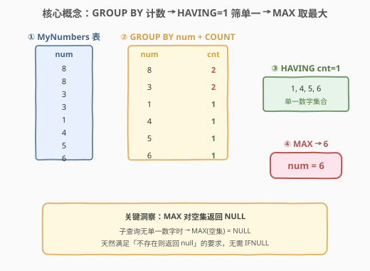
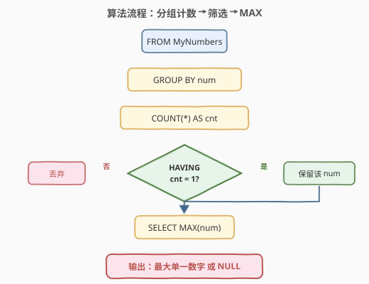
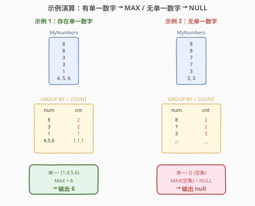

# LeetCode 只出现一次的最大数字 题解

## 1. 题目概述

- **标题 / 题号**：只出现一次的最大数字（#619，easy）
- **链接**：https://leetcode.cn/problems/biggest-single-number/
- **难度**：简单
- **标签**：SQL、GROUP BY、HAVING、COUNT、MAX、聚合、子查询

**题意**：`MyNumbers` 表只含一列 `num`（整数），**无主键**，因此可能包含重复值。**单一数字**是在表中只出现一次的数字。要求找出**最大的单一数字**；如果不存在单一数字，则返回 `null`。

**表结构**：

```text
Table: MyNumbers
+-------------+------+
| Column Name | Type |
+-------------+------+
| num         | int  |  ← 整数，无主键，可能重复
+-------------+------+
```

> 💡 **关键约束**：表**没有主键**——同一 `num` 可出现多行。「单一数字」= `COUNT(num) = 1` 的数字。核心任务是「按值分组计数 → 筛出计数为 1 的组 → 取组内 `num` 的最大值」。若无单一数字，需返回 `null`（而非空结果集）。

**示例 1**：

```text
输入：
MyNumbers 表：
+-----+
| num |
+-----+
| 8   |
| 8   |
| 3   |
| 3   |
| 1   |
| 4   |
| 5   |
| 6   |
+-----+

输出：
+-----+
| num |
+-----+
| 6   |
+-----+
```

**解释**：单一数字有 1、4、5 和 6。6 是最大的单一数字，返回 6。

**示例 2**：

```text
输入：
MyNumbers 表：
+-----+
| num |
+-----+
| 8   |
| 8   |
| 7   |
| 7   |
| 3   |
| 3   |
| 3   |
+-----+

输出：
+------+
| num  |
+------+
| null |
+------+
```

**解释**：输入的表中不存在单一数字（8 出现 2 次、7 出现 2 次、3 出现 3 次），所以返回 `null`。

**约束**：

- `MyNumbers` 表无主键，`num` 列可能包含重复值
- 每个 `num` 都是整数
- 若无单一数字，返回 `null`（而非空结果集）

> 💡 本题是 SQL「分组计数 + 筛选 + 聚合」的最简形态——与 [602. 好友申请 II](https://leetcode.cn/problems/friend-requests-ii-who-has-the-most-friends/) 同源，都是「`GROUP BY` + `COUNT` + 取最值」范式。619 的特殊之处在于「不存在时返回 `null`」，这恰好利用了 `MAX` 对空集返回 `NULL` 的特性。

## 2. 解题思路

### 2.1 暴力思路：先找单一数字，再取最大

最直觉的做法分两步：

1. **找出所有单一数字**——遍历表，对每个 `num` 统计出现次数，留下 `COUNT = 1` 的；
2. **取最大值**——在单一数字集合中取 `MAX`。

在过程式语言中，这需要一个哈希表计数 + 一次扫描取最大：

```python
from collections import Counter
cnt = Counter(row['num'] for row in MyNumbers)
singles = [num for num, c in cnt.items() if c == 1]
result = max(singles) if singles else None  # 空则 None
```

在 SQL 中，「统计每个 `num` 出现次数」对应 `GROUP BY num` + `COUNT(*)`；「留下 `COUNT = 1`」对应 `HAVING COUNT(*) = 1`；「取最大值」对应外层 `MAX(num)`。

> ⚠️ **关键陷阱：「不存在时返回 null」**。若直接写 `SELECT num FROM MyNumbers GROUP BY num HAVING COUNT(*) = 1 ORDER BY num DESC LIMIT 1`，当无单一数字时返回**空结果集**（0 行），而非一行 `null`。题目要求返回 `null`，必须用外层 `MAX` 包裹——`MAX` 对空集返回 `NULL`，天然满足要求。

### 2.2 核心观察：MAX 对空集返回 NULL



**观察 1：GROUP BY + HAVING 筛单一数字**

`GROUP BY num` 按值分组后，每组对应一个 `num` 值的所有出现行。`COUNT(*)` 给出每组的行数（即该 `num` 的出现次数）。`HAVING COUNT(*) = 1` 过滤后，只剩「恰好出现一次」的组——这些组的 `num` 就是单一数字。

```sql
SELECT num
FROM MyNumbers
GROUP BY num
HAVING COUNT(*) = 1
```

此子查询返回所有单一数字（0 行或多行）。

**观察 2：MAX(NULL 集合) = NULL（关键）**

将上述子查询的结果用外层 `MAX` 聚合：

$$\text{result} = \max\big(\{\, num \mid \text{count}(num) = 1 \,\}\big)$$

- 子查询**有结果**时（至少一个单一数字）→ `MAX` 返回其中的最大值；
- 子查询**为空**时（无单一数字）→ `MAX` 对空集返回 `NULL`。

这恰好满足题目「不存在则返回 `null`」的要求，**无需 `IFNULL` / `COALESCE` 兜底**。

> 💡 **SQL 聚合函数的空集行为**：`MAX` / `MIN` / `SUM` / `AVG` 对空集都返回 `NULL`（`COUNT(*)` 对空集返回 `0`）。这是 SQL 标准行为，跨数据库一致。利用这一特性，可避免显式判空逻辑。

**观察 3：为何不能省略外层 MAX**

直接对子查询结果加 `ORDER BY num DESC LIMIT 1` 也能取到最大单一数字——但仅限于「存在单一数字」时。当无单一数字时，子查询返回空集，`LIMIT 1` 仍返回空集（0 行），而非一行 `null`。外层 `MAX` 的价值正在于「把 0 行聚合成 1 行 NULL」。

| 写法 | 有单一数字 | 无单一数字 |
|------|-----------|-----------|
| 子查询 + 外层 `MAX` | 返回最大值（1 行） | 返回 `null`（1 行）✅ |
| 子查询 + `ORDER BY ... LIMIT 1` | 返回最大值（1 行） | 返回空集（0 行）❌ |

### 2.3 算法流程图



| 步骤 | SQL 子句 | 作用 | 行数变化 |
|------|----------|------|----------|
| ① | `FROM MyNumbers` | 读取全部行 | $n$ 行 |
| ② | `GROUP BY num` | 按值分组 | $n$ → $k$ 组（$k$ = 不同值个数） |
| ③ | `COUNT(*)` | 每组计算出现次数 | $k$ 组，各 1 个 cnt |
| ④ | `HAVING COUNT(*) = 1` | 筛选单一数字组 | $k$ → $m$ 组（$m$ = 单一数字个数） |
| ⑤ | `SELECT MAX(num)` | 外层取最大值 | $m$ → 1（空集则返回 NULL） |

> 💡 **执行顺序**：`FROM`（取 $n$ 行）→ `GROUP BY`（聚合成 $k$ 组）→ `HAVING`（筛到 $m$ 组）→ 外层 `MAX`（$m$ 行压成 1 行，空集→NULL）。子查询的 `GROUP BY` + `HAVING` 先执行，外层 `MAX` 后执行。

### 2.4 示例演算

以题目两个示例对照「有单一数字」与「无单一数字」两种情形：



**示例 1：有单一数字**

| num | COUNT(*) | 是否单一 |
|-----|----------|----------|
| 8 | 2 | ✗ |
| 3 | 2 | ✗ |
| 1 | 1 | ✓ |
| 4 | 1 | ✓ |
| 5 | 1 | ✓ |
| 6 | 1 | ✓ |

单一数字集合 = $\{1, 4, 5, 6\}$，$\max = 6$ → 输出 `6`。

**示例 2：无单一数字**

| num | COUNT(*) | 是否单一 |
|-----|----------|----------|
| 8 | 2 | ✗ |
| 7 | 2 | ✗ |
| 3 | 3 | ✗ |

单一数字集合 = $\emptyset$，$\max(\emptyset) = \text{NULL}$ → 输出 `null`。

> 💡 **对比两个示例**：示例 1 的单一集合非空，`MAX` 正常返回最大值；示例 2 的单一集合为空，`MAX` 返回 `NULL`。同一个 SQL 查询自动适配两种情形，无需分支逻辑——这正是「`MAX` 对空集返回 NULL」特性的价值。

## 3. 参考代码

### SQL（解法 A：子查询 + 外层 MAX，推荐）

```sql
SELECT MAX(num) AS num
FROM (
    SELECT num
    FROM MyNumbers
    GROUP BY num
    HAVING COUNT(*) = 1
) AS single;
```

> 💡 **写法要点**：
> - 内层子查询 `GROUP BY num HAVING COUNT(*) = 1` 筛出所有单一数字。
> - 外层 `MAX(num)` 取最大值；子查询为空时返回 `NULL`，天然满足「不存在则返回 null」。
> - 子查询必须有别名（`AS single`），否则 MySQL 报错——这是 SQL 标准 要求。
> - 无需 `IFNULL` / `COALESCE`——`MAX` 的空集行为已兜底。

### SQL（解法 B：HAVING 中直接用 COUNT(num)）

```sql
SELECT MAX(num) AS num
FROM (
    SELECT num
    FROM MyNumbers
    GROUP BY num
    HAVING COUNT(num) = 1
) AS single;
```

> 💡 **COUNT(*) vs COUNT(num)**：本题 `num` 列不含 `NULL`（每行都有整数），`COUNT(*)` 和 `COUNT(num)` 结果相同。区别在于：`COUNT(*)` 统计行数（含 `NULL` 行），`COUNT(列)` 跳过 `NULL` 行。若 `num` 可能为 `NULL`，`COUNT(*)` 会把 `NULL` 也算一个组（`NULL` 在 `GROUP BY` 中自成一组），而 `COUNT(num)` 对该组返回 `0`，被 `HAVING COUNT(num) = 1` 排除。本题无 `NULL`，两者等价，推荐 `COUNT(*)` 语义更清晰。

### SQL（解法 C：窗口函数，免子查询）

```sql
WITH counted AS (
    SELECT num, COUNT(*) OVER (PARTITION BY num) AS cnt
    FROM MyNumbers
)
SELECT MAX(num) AS num
FROM counted
WHERE cnt = 1;
```

> 💡 **窗口函数写法**：`COUNT(*) OVER (PARTITION BY num)` 为每行附加同组计数，不改变行数。外层 `WHERE cnt = 1` 筛选单一数字行，再 `MAX` 取最大。与解法 A 逻辑等价，但中间结果保留了所有行（而非分组聚合），空间开销略大。适合需要同时保留原始行的场景。

### Python（pandas）

```python
import pandas as pd

def biggest_single_number(my_numbers: pd.DataFrame) -> pd.DataFrame:
    counts = my_numbers['num'].value_counts()
    singles = counts[counts == 1].index
    result = singles.max() if len(singles) > 0 else None
    return pd.DataFrame({'num': [result]})
```

> 💡 **pandas 对照**：`value_counts()` 对应 `GROUP BY num` + `COUNT(*)`，返回一个按值分组的计数 Series（索引为 `num` 值，值为出现次数）。`counts[counts == 1].index` 对应 `HAVING COUNT(*) = 1`——筛出计数为 1 的值。`singles.max()` 对应 `MAX(num)`；`if len(singles) > 0 else None` 对应 `MAX` 对空集返回 `NULL` 的行为——pandas 中需显式判空，因为 `max()` 对空 Series 会抛异常。

## 4. 复杂度分析

| 维度 | 复杂度 | 说明 |
|------|--------|------|
| **时间** | $O(n)$ | $n$ = `MyNumbers` 行数。`GROUP BY` 需一趟扫描 + 哈希分组 $O(n)$；`HAVING` 过滤 $O(k)$（$k$ = 不同值个数，$k \le n$）；外层 `MAX` 扫描 $m$ 个单一数字 $O(m)$。总体 $O(n)$ |
| **空间** | $O(k)$ | `GROUP BY` 的哈希表存 $k$ 个不同值及其计数；子查询结果 $m$ 行（$m \le k$） |
| **结果行数** | $O(1)$ | 恒输出 1 行 1 列（值或 NULL） |

> ⚠️ 实际执行计划取决于数据库：若无索引，`GROUP BY` 可能排序后分组（$O(n \log n)$）；若有 `num` 列索引，可直接利用索引顺序分组 $O(n)$。面试中说明「一趟扫描分组 $O(n)$，空间 $O(k)$」即可。

## 5. 扩展

### 5.1 SQL 聚合函数的空集行为

SQL 标准规定，聚合函数对空集（0 行）的返回值如下：

| 聚合函数 | 空集返回值 | 说明 |
|----------|-----------|------|
| `COUNT(*)` | `0` | 唯一返回非 NULL 的聚合函数 |
| `COUNT(列)` | `0` | 同 `COUNT(*)` |
| `MAX(列)` | `NULL` | 无值可取 |
| `MIN(列)` | `NULL` | 无值可取 |
| `SUM(列)` | `NULL` | 无值可加（注意：不是 `0`） |
| `AVG(列)` | `NULL` | 无值可平均 |

> 💡 **本题利用的核心特性**：`MAX` 对空集返回 `NULL`——无需 `IFNULL(MAX(num), NULL)`，`MAX` 本身就是 `NULL`。这与 [180. 连续出现的数字](https://leetcode.cn/problems/consecutive-numbers/) 中 `DISTINCT` 去重 + `Lead/Lag` 的思路不同，但都依赖对「空结果」的正确处理。

### 5.2 HAVING vs WHERE

`WHERE` 在 `GROUP BY` **之前**过滤行，`HAVING` 在 `GROUP BY` **之后**过滤组。本题「`COUNT(*) = 1`」是对分组结果的过滤，必须用 `HAVING`，不能放 `WHERE`：

```sql
-- ✗ 错误：WHERE 不能用聚合函数
SELECT num FROM MyNumbers WHERE COUNT(*) = 1 GROUP BY num;

-- ✓ 正确：HAVING 在 GROUP BY 之后过滤组
SELECT num FROM MyNumbers GROUP BY num HAVING COUNT(*) = 1;
```

> 💡 **记忆口诀**：「行过滤用 WHERE，组过滤用 HAVING」。`WHERE` 作用于原始行，`HAVING` 作用于分组后的组。若过滤条件含聚合函数（`COUNT` / `SUM` / `AVG`），必用 `HAVING`。

### 5.3 进阶：如果要求「最小的单一数字」呢？

只需把外层 `MAX` 换成 `MIN`——`MIN` 同样对空集返回 `NULL`，逻辑完全对称：

```sql
SELECT MIN(num) AS num
FROM (
    SELECT num FROM MyNumbers GROUP BY num HAVING COUNT(*) = 1
) AS single;
```

若要求「所有单一数字」（不只最大），则去掉外层 `MAX`，直接返回子查询结果（但无单一数字时返回空集而非 `NULL`）。

## 6. 面试要点

1. **为什么用子查询 + 外层 MAX，而不是直接 GROUP BY + LIMIT 1？**

   - 直接 `GROUP BY num HAVING COUNT(*)=1 ORDER BY num DESC LIMIT 1` 在无单一数字时返回空结果集（0 行），而题目要求返回一行 `null`。外层 `MAX` 把子查询结果（0 行或多行）聚合成 1 行——有值时返回最大值，空集时返回 `NULL`，天然满足要求。

2. **MAX 对空集返回什么？**

   - `NULL`。这是 SQL 标准行为：`MAX` / `MIN` / `SUM` / `AVG` 对空集都返回 `NULL`，只有 `COUNT(*)` 返回 `0`。利用这一特性可避免显式判空逻辑。

3. **HAVING 和 WHERE 有什么区别？**

   - `WHERE` 在 `GROUP BY` 之前过滤原始行，不能含聚合函数；`HAVING` 在 `GROUP BY` 之后过滤组，可以含聚合函数。本题「`COUNT(*) = 1`」是对分组结果的过滤，必须用 `HAVING`。

4. **COUNT(*) 和 COUNT(num) 有什么区别？**

   - `COUNT(*)` 统计所有行（含 `NULL` 行），`COUNT(列)` 跳过该列为 `NULL` 的行。本题 `num` 列不含 `NULL`，两者等价。若 `num` 可能为 `NULL`，`COUNT(*)` 会把 `NULL` 也算一个组（`GROUP BY` 中 `NULL` 自成一组），`COUNT(num)` 对该组返回 `0`。推荐 `COUNT(*)` 语义更清晰。

5. **如果数据量极大怎么办？**

   - `GROUP BY` 需一趟扫描 $O(n)$ + 哈希表 $O(k)$ 空间。若 `num` 列有索引，数据库可直接利用索引顺序分组，避免额外排序。对于极大数据量，可考虑在 `num` 列建索引，或用分布式聚合（如 MapReduce 的 shuffle 阶段天然实现 `GROUP BY`）。

> 💡 **一句话总结**：619 教的是「SQL 分组计数 + 聚合取最值」的最简范式——`GROUP BY` 按值分组，`HAVING COUNT=1` 筛单一数字，外层 `MAX` 取最大且天然处理空集返回 `NULL`。核心洞察：「`MAX` 对空集返回 `NULL`」免去了显式判空，一个查询同时适配「有单一数字」和「无单一数字」两种情形。

## 同类练习题

| # | 题目 | 与本题的关联 |
|---|------|-------------|
| 602 | [好友申请 II ：谁有最多的好友](./602_好友申请II谁有最多的好友.md) | SQL `GROUP BY` + `COUNT` + 取最值——同样是「分组计数后取最大」，但 602 取的是「好友数最多的人」，619 取的是「单一数字中的最大值」，对比理解 `HAVING` 筛选与 `ORDER BY` 排序的取舍 |
| 180 | [连续出现的数字](https://leetcode.cn/problems/consecutive-numbers/) | SQL `GROUP BY` + `HAVING COUNT` 模板——筛出「连续出现 3 次及以上」的数字，与 619 的「恰好出现 1 次」互为镜像（`COUNT >= 3` vs `COUNT = 1`） |
| 196 | [删除重复的电子邮箱](https://leetcode.cn/problems/delete-duplicate-emails/) | SQL `GROUP BY` + `COUNT` 用于 DELETE——筛出重复邮箱后删除，与 619 的「找单一数字」互补（一个找重复，一个找唯一） |
| 596 | [超过 5 名学生的课](https://leetcode.cn/problems/classes-more-than-5-students/) | SQL `GROUP BY` + `HAVING COUNT` 经典模板——`HAVING COUNT(*) >= 5` 筛选大组，与 619 的 `HAVING COUNT(*) = 1` 筛选小组形成对比 |
| 574 | [当选者](https://leetcode.cn/problems/winning-candidate/) | SQL `GROUP BY` + `MAX` 取最值——在投票表中找得票最多的候选人，与 619 的「找最大单一数字」共享「分组聚合后取最值」的核心思路 |
