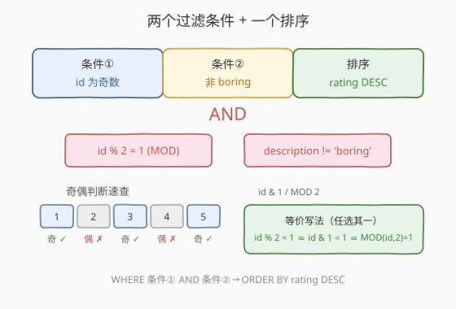
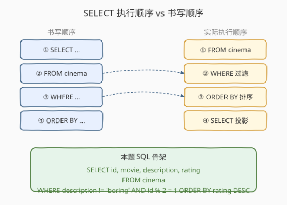
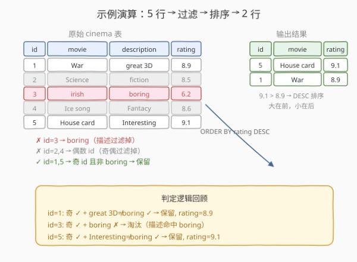

# LeetCode 有趣的电影 题解

## 1. 题目概述

- **标题 / 题号**：有趣的电影（#620，easy）
- **链接**：https://leetcode.cn/problems/not-boring-movies/
- **难度**：简单
- **标签**：SQL、WHERE、ORDER BY、MOD、位运算

**题意**：给定 `cinema` 表，每行记录一部电影的 `id`、`movie`（名称）、`description`（描述）、`rating`（评分）。编写 SQL 查询，找出所有**描述为非 `boring`** 且 **`id` 为奇数**的影片，并按 `rating` **降序**排列。

**表结构**：

```text
Table: cinema
+-------------+----------+
| Column Name | Type     |
+-------------+----------+
| id          | int      |  ← 主键
| movie       | varchar  |
| description | varchar  |
| rating      | float    |  ← [0, 10]，两位小数
+-------------+----------+
```

> 💡 **关键约束**：`id` 是主键（唯一且非空），`rating` 范围 $[0, 10]$。两个过滤条件用 `AND` 组合：① `id` 为奇数；② `description` 不等于 `'boring'`（注意是字符串精确匹配，大小写敏感取决于排序规则）。排序用 `ORDER BY rating DESC`。

**示例 1**：

```text
输入：
cinema 表:
+----+------------+--------------+--------+
| id | movie      | description  | rating |
+----+------------+--------------+--------+
| 1  | War        | great 3D     | 8.9    |
| 2  | Science    | fiction      | 8.5    |
| 3  | irish      | boring       | 6.2    |
| 4  | Ice song   | Fantacy      | 8.6    |
| 5  | House card | Interesting  | 9.1    |
+----+------------+--------------+--------+

输出：
+----+------------+--------------+--------+
| id | movie      | description  | rating |
+----+------------+--------------+--------+
| 5  | House card | Interesting  | 9.1    |
| 1  | War        | great 3D     | 8.9    |
+----+------------+--------------+--------+
```

**解释**：

- `id` 为奇数的影片：1、3、5（2、4 为偶数，排除）
- `id=3` 的 `description='boring'`，排除
- 保留 `id=1`（rating=8.9）与 `id=5`（rating=9.1）
- 按 `rating` 降序：9.1 在前，8.9 在后 → `id=5` 在第一行

**约束**：

- `id` 为主键，唯一非空
- `rating` 为 $[0, 10]$ 内两位小数浮点数

> 💡 本题是 SQL **`WHERE` + `ORDER BY`** 的入门母题。核心考点有两个：① 判断奇偶——`id % 2 = 1`（`MOD`）或 `id & 1 = 1`（位运算，更快）；② 字符串不等于——`description != 'boring'` 或 `description <> 'boring'`（两者等价，`<>` 是 SQL 标准写法）。它与 [627. 变更性别](https://leetcode.cn/problems/swap-salary/)（`UPDATE SET` + `CASE`）同为 SQL 基础语法的招牌题。

## 2. 解题思路

### 2.1 暴力思路：先查全表再应用层过滤

最直觉的思路是 `SELECT * FROM cinema` 把全表拉到应用层，然后在 Python/Java 里逐行判断 `id % 2 == 1 and description != 'boring'`，最后排序。

> ⚠️ 这种做法**把过滤和排序推到应用层**，违背了「让数据库做它擅长的事」原则：① 全表传输浪费网络带宽；② 应用层排序 $O(n \log n)$ 不如数据库利用索引高效；③ 无法利用 `WHERE` 下推到存储引擎做行过滤。正确做法是把谓词下推到 SQL 里。

### 2.2 核心观察：两个谓词下推到 WHERE



**关键洞察**：本题的逻辑可以拆成三个独立的 SQL 子句，各自负责一件事：

| 子句 | 作用 | 本题内容 |
|------|------|----------|
| `WHERE` 条件① | 过滤奇偶 | `id % 2 = 1` |
| `WHERE` 条件② | 过滤描述 | `description != 'boring'` |
| `ORDER BY` | 排序 | `rating DESC` |

两个 `WHERE` 条件用 `AND` 连接（都要满足，是「且」关系）。

> 💡 **奇偶判断的三种等价写法**：
> - `id % 2 = 1`：取模，最直观
> - `MOD(id, 2) = 1`：函数式写法，某些数据库（MySQL）推荐
> - `id & 1 = 1`：按位与，最低位为 1 即奇数，**最快**（直接位运算，无除法）
>
> 三者完全等价，面试中给出 `MOD` 版本最易读，提到 `& 1` 版本是加分点。

### 2.3 算法流程图



**SQL 书写顺序**：`SELECT` → `FROM` → `WHERE` → `ORDER BY`

**实际执行顺序**：`FROM` → `WHERE` → `ORDER BY` → `SELECT`

> 💡 **执行顺序的意义**：`WHERE` 先于 `ORDER BY` 执行——先过滤掉不符合条件的行，再对剩余行排序，最后才 `SELECT` 投影列。这意味着 `ORDER BY` 只需对过滤后的子集排序，而非全表。本题过滤后只剩 2 行，排序代价极小。

**步骤分解**：

| 步骤 | 子句 | 作用 |
|------|------|------|
| ① | `FROM cinema` | 读取 cinema 表（5 行） |
| ② | `WHERE description != 'boring' AND id % 2 = 1` | 过滤：非 boring 且奇 id → 剩 2 行 |
| ③ | `ORDER BY rating DESC` | 按评分降序排列 |
| ④ | `SELECT id, movie, description, rating` | 投影输出列 |

### 2.4 示例演算

以示例数据 5 行为例，逐步演算过滤与排序过程：



**Step 1：逐行应用 WHERE 过滤**

| id | movie | description | rating | 奇偶判定 | 描述判定 | 结果 |
|----|-------|-------------|--------|----------|----------|------|
| 1 | War | great 3D | 8.9 | $1 \bmod 2 = 1$ ✓ | $\neq$ boring ✓ | 保留 |
| 2 | Science | fiction | 8.5 | $2 \bmod 2 = 0$ ✗ | — | 淘汰（偶 id） |
| 3 | irish | boring | 6.2 | $3 \bmod 2 = 1$ ✓ | = boring ✗ | 淘汰（描述命中） |
| 4 | Ice song | Fantacy | 8.6 | $4 \bmod 2 = 0$ ✗ | — | 淘汰（偶 id） |
| 5 | House card | Interesting | 9.1 | $5 \bmod 2 = 1$ ✓ | $\neq$ boring ✓ | 保留 |

过滤后剩余：`id=1 (rating=8.9)`、`id=5 (rating=9.1)`

**Step 2：ORDER BY rating DESC 排序**

- 9.1 > 8.9 → `id=5` 排在前，`id=1` 排在后

> 💡 **`DESC` 的含义**：`DESC`（descending）是降序——大值在前，小值在后。`ASC`（ascending，默认）是升序——小值在前。本题要求「按 `rating` 降序」，即评分高的排前面，用 `ORDER BY rating DESC`。

## 3. 参考代码

### SQL（解法 A：MOD 取模，最直观）

```sql
SELECT id, movie, description, rating
FROM cinema
WHERE description != 'boring' AND id % 2 = 1
ORDER BY rating DESC;
```

> 💡 **写法要点**：
> - `id % 2 = 1`：取模判断奇数，最常见写法。
> - `description != 'boring'`：字符串不等于，`!=` 与 `<>` 等价。
> - 两个条件用 `AND` 连接（都要满足）。
> - `ORDER BY rating DESC`：降序，评分高在前。
> - `SELECT` 列出所有四列，与输出格式一致。

### SQL（解法 B：位运算 & 1，最快）

```sql
SELECT id, movie, description, rating
FROM cinema
WHERE description != 'boring' AND id & 1 = 1
ORDER BY rating DESC;
```

> 💡 **改进点**：用 `id & 1 = 1` 替代 `id % 2 = 1`。`&` 是按位与：奇数的二进制最低位为 1，`id & 1` 提取最低位，等于 1 即奇数。位运算比取模（除法）快，虽然现代数据库优化器通常会把 `% 2` 优化为 `& 1`，但显式写位运算是面试加分点。

### SQL（解法 C：MOD 函数式）

```sql
SELECT id, movie, description, rating
FROM cinema
WHERE description <> 'boring' AND MOD(id, 2) = 1
ORDER BY rating DESC;
```

> 💡 **写法要点**：
> - `MOD(id, 2) = 1`：函数式取模，SQL 标准写法，MySQL/Oracle 通用。
> - `<>` 是 SQL 标准的「不等于」运算符，比 `!=` 更规范（`!=` 是非标准扩展但广泛支持）。
> - 其余逻辑与解法 A 完全一致。

### Python（pandas）

```python
import pandas as pd

def not_boring_movies(cinema: pd.DataFrame) -> pd.DataFrame:
    mask = (cinema['description'] != 'boring') & (cinema['id'] % 2 == 1)
    return cinema[mask].sort_values('rating', ascending=False)[
        ['id', 'movie', 'description', 'rating']
    ]
```

> 💡 **pandas 对照**：
> - `(cinema['description'] != 'boring')` 对应 `WHERE description != 'boring'`。
> - `(cinema['id'] % 2 == 1)` 对应 `WHERE id % 2 = 1`。
> - `&` 对应 `AND`（注意 pandas 中 `&` 需用括号分组，因为运算符优先级问题）。
> - `.sort_values('rating', ascending=False)` 对应 `ORDER BY rating DESC`。
> - `[['id', 'movie', 'description', 'rating']]` 对应 `SELECT` 投影列顺序。

## 4. 复杂度分析

| 维度 | 复杂度 | 说明 |
|------|--------|------|
| **时间** | $O(n \log n)$ | $n$ = `cinema` 行数。`WHERE` 过滤 $O(n)$（全表扫描）；`ORDER BY` 排序 $O(n' \log n')$，$n'$ 为过滤后行数 $\leq n$；总计 $O(n + n' \log n') \subseteq O(n \log n)$ |
| **空间** | $O(n')$ | 排序缓冲区存储过滤后的 $n'$ 行 |
| **结果行数** | $O(n')$ | 输出过滤后的所有行（本题示例为 2 行） |

> ⚠️ 若 `rating` 列上有索引，`ORDER BY rating DESC` 可利用索引有序性免排序，降到 $O(n)$（扫描 + 过滤）。但 LeetCode 测试环境通常无索引，按 $O(n \log n)$ 估计。`WHERE` 条件涉及 `id`（主键，有索引）和 `description`（通常无索引），`id % 2 = 1` 是非 SARGable 谓词（对列做运算后无法走索引），故 `WHERE` 走全表扫描 $O(n)$。

## 5. 扩展

### 5.1 SARGable 谓词：为什么 `id % 2 = 1` 不能走索引

`id % 2 = 1` 对列 `id` 做了取模运算，破坏了索引的有序性——数据库无法用 B+ 树索引快速定位「奇数 id」。这种谓词称为**非 SARGable**（Search Argument-able）谓词。相比之下，`id = 5` 或 `id BETWEEN 1 AND 10` 是 SARGable 的，能走索引。

> 💡 **面试加分**：提到「`id % 2 = 1` 是非 SARGable 谓词，无法利用 `id` 上的主键索引，走全表扫描」是高级回答。但本题表很小，全表扫描 $O(n)$ 完全可接受。若表很大且需频繁查询奇偶，可考虑建**计算列**（如 `id_is_odd AS id % 2 PERSISTENT`）并在其上建索引。

### 5.2 `!=` vs `<>`：哪个更标准

| 运算符 | 来源 | 兼容性 |
|--------|------|--------|
| `!=` | C 风格扩展 | MySQL、PostgreSQL、SQL Server 支持；SQL 标准未定义 |
| `<>` | SQL 标准 | 所有主流数据库支持 |

> 💡 **推荐**：写 `<>` 更规范（SQL 标准），但 `!=` 更直观（与编程语言一致）。面试中两者均可，提到「`<>` 是 SQL 标准」是细节加分。

### 5.3 字符串比较的大小写敏感性

`description != 'boring'` 是否区分大小写取决于数据库的**排序规则（collation）**：

- MySQL 默认 `utf8mb4_general_ci`（`ci` = case insensitive）：`'Boring'` 也会被过滤掉。
- PostgreSQL 默认区分大小写：`'Boring'` 不会被过滤（只过滤 `'boring'`）。
- 若需精确匹配，用 `BINARY`（MySQL）：`WHERE BINARY description <> 'boring'`。

> 💡 LeetCode 的 MySQL 环境默认大小写不敏感，`'boring'`、`'Boring'`、`'BORING'` 都会被过滤。本题测试用例只有小写 `'boring'`，无需额外处理。

### 5.4 NULL 值的处理

`description` 若为 `NULL`，`description != 'boring'` 的结果是 `NULL`（不是 `true` 也不是 `false`），该行会被 `WHERE` 过滤掉（`WHERE` 只保留 `true`）。若想保留 `NULL`，需改写为：

```sql
WHERE (description IS NULL OR description != 'boring') AND id % 2 = 1
```

> 💡 这是 SQL 三值逻辑（true/false/null）的经典陷阱。本题 `description` 非主键但题目未说明可空，LeetCode 测试用例无 `NULL`，无需额外处理。

## 6. 面试要点

1. **判断奇偶有几种写法？哪个最快？**

   - 三种：`id % 2 = 1`（取模）、`MOD(id, 2) = 1`（函数式）、`id & 1 = 1`（按位与）。位运算 `& 1` 最快——直接取二进制最低位，无除法运算。三者逻辑等价，现代数据库优化器通常会将 `% 2` 优化为 `& 1`，但显式写位运算是面试加分点。

2. **SQL 的书写顺序和执行顺序有什么区别？**

   - 书写顺序：`SELECT` → `FROM` → `WHERE` → `GROUP BY` → `HAVING` → `ORDER BY` → `LIMIT`。执行顺序：`FROM` → `WHERE` → `GROUP BY` → `HAVING` → `SELECT` → `ORDER BY` → `LIMIT`。`FROM` 最先（确定数据源），`SELECT` 在 `ORDER BY` 之前（所以 `ORDER BY` 能用 `SELECT` 中的别名）。本题中 `WHERE` 先过滤再 `ORDER BY` 排序，排序只对过滤后子集操作。

3. **`!=` 和 `<>` 有什么区别？**

   - 两者都是「不等于」，`<>` 是 SQL 标准写法，`!=` 是 C 风格扩展。两者在主流数据库中行为一致，推荐 `<>` 更规范。本题两者均可通过。

4. **为什么不应该把过滤放到应用层？**

   - 三个原因：① 全表传输浪费网络带宽（数据库只需返回过滤后的子集）；② 应用层排序不如数据库利用索引高效；③ 无法利用 `WHERE` 下推到存储引擎做行过滤，丧失数据库优化机会。正确做法是把谓词下推到 SQL 的 `WHERE` 子句。

5. **`description` 为 `NULL` 时 `description != 'boring'` 的结果是什么？**

   - 结果是 `NULL`（SQL 三值逻辑），`WHERE` 只保留 `true` 的行，所以 `NULL` 描述的行会被过滤掉。若想保留 `NULL`，需用 `description IS NULL OR description != 'boring'`。本题测试用例无 `NULL`，无需额外处理。

> 💡 **一句话总结**：620 是 SQL **`WHERE` + `ORDER BY`** 的入门母题——两个过滤条件（奇偶 + 非 boring）用 `AND` 连接，一个降序排序。核心考点是奇偶判断的三种等价写法（`%`、`MOD`、`&`）和 SQL 执行顺序（`WHERE` 先于 `ORDER BY`）。它是 [627. 变更性别](https://leetcode.cn/problems/swap-salary/)（`UPDATE` + `CASE`）和 [1174. 即时食物配送 II](https://leetcode.cn/problems/immediate-food-delivery-ii/)（`WHERE` 子查询）的基础。

## 同类练习题

| # | 题目 | 与本题的关联 |
|---|------|-------------|
| 627 | [变更性别](https://leetcode.cn/problems/swap-salary/) | `UPDATE SET` + `CASE WHEN` 条件赋值，与本题的 `WHERE` 条件过滤对照——620 是「读 + 过滤」，627 是「写 + 条件」 |
| 1174 | [即时食物配送 II](https://leetcode.cn/problems/immediate-food-delivery-ii/) | `WHERE` 子查询 + `MIN` 聚合，与本题的简单 `WHERE` 对照——1174 是「子查询过滤」，620 是「直接谓词过滤」 |
| 511 | [游戏玩法分析 I](../0501-0600/511_游戏玩法分析I.md) | `GROUP BY + MIN` 分组取最值，与本题的全表过滤对照——511 是「分组后取每组最值」，620 是「全表过滤后排序」 |
| 584 | [寻找用户推荐人](https://leetcode.cn/problems/find-customer-referee/) | `WHERE` + `IS NULL` 处理（非推荐人或推荐人编号不为 2），与本题的 `WHERE != 'boring'` 对照——584 是 `NULL` 处理陷阱，620 是字符串不等于 |
| 1757 | [可回收且低脂的产品](https://leetcode.cn/problems/recyclable-and-low-fat-products/) | 两个布尔列的 `WHERE` 过滤，与本题的两个 `WHERE` 条件 `AND` 完全同构——1757 是布尔过滤的极简版，620 多了奇偶判断和排序 |
