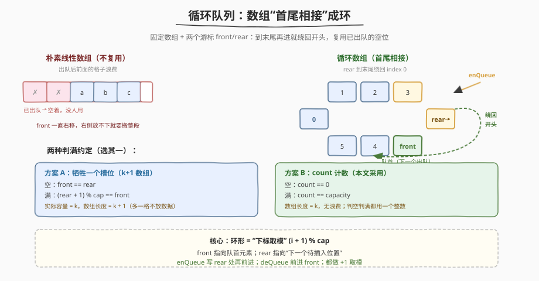
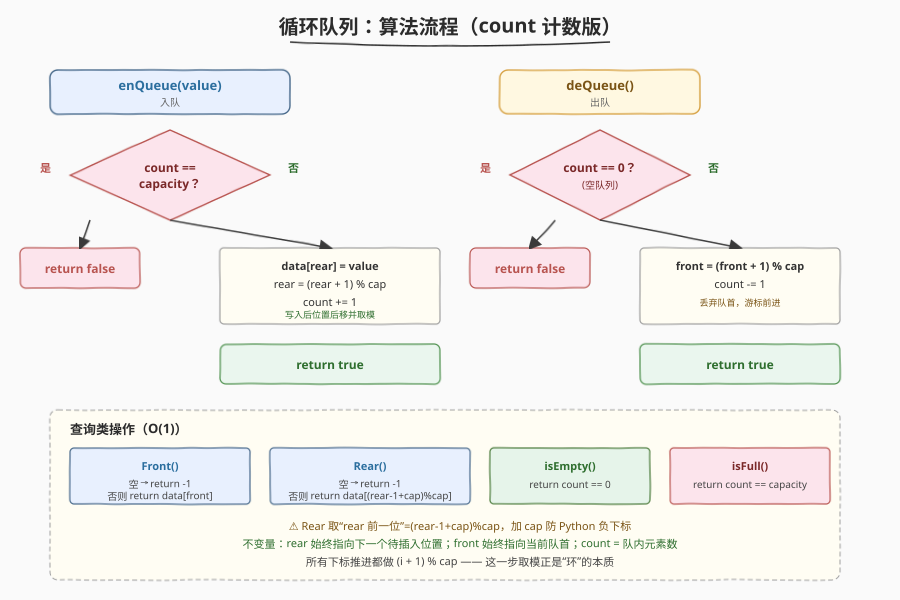
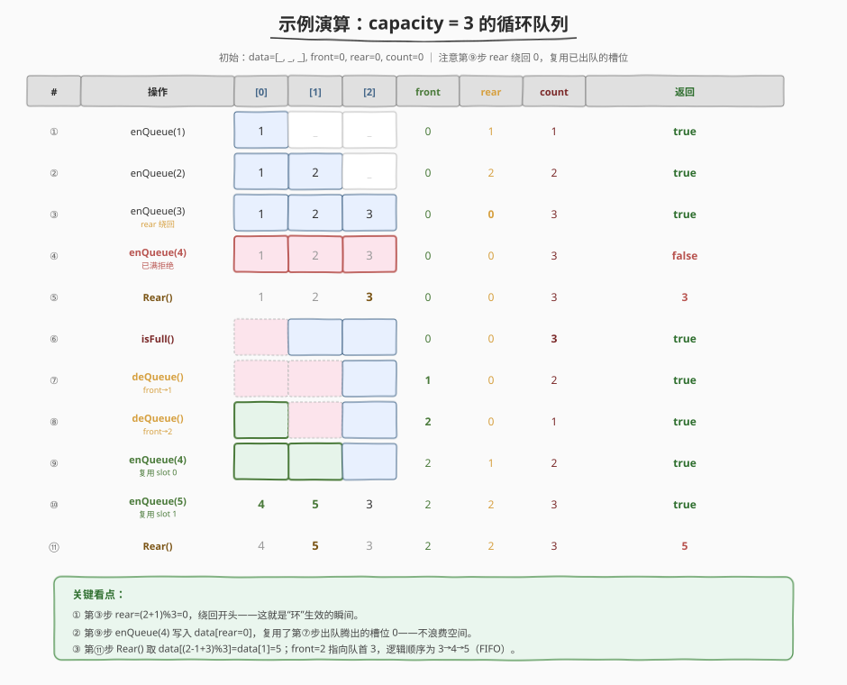

# LeetCode 设计循环队列 题解

## 1. 题目概述

- **标题 / 题号**：设计循环队列（#622，medium）
- **链接**：https://leetcode.cn/problems/design-circular-queue/
- **难度**：中等
- **标签**：设计、队列、数组

**题意**：设计一个**循环队列**（circular queue / ring buffer）：一个线性数据结构，遵循 FIFO（先进先出），但把数组的「最后一个位置」与「第一个位置」首尾相接成环，从而**复用已出队腾出的槽位**，避免朴素数组「front 一直右移、左侧空位浪费」的问题。

需实现以下接口：

- `MyCircularQueue(k)`：以容量 `k` 初始化队列
- `boolean enQueue(int value)`：向队尾插入元素，成功返回 `true`；队列已满返回 `false`
- `boolean deQueue()`：从队首删除一个元素，成功返回 `true`；队列为空返回 `false`
- `int Front()`：获取队首元素；队列为空返回 `-1`
- `int Rear()`：获取队尾元素；队列为空返回 `-1`
- `boolean isEmpty()`：队列是否为空
- `boolean isFull()`：队列是否已满

**示例 1**：

```text
输入：
  MyCircularQueue q = new MyCircularQueue(3);
  q.enQueue(1);   // true
  q.enQueue(2);   // true
  q.enQueue(3);   // true
  q.enQueue(4);   // false，队列已满
  q.Rear();       // 3
  q.isFull();     // true
  q.deQueue();    // true
  q.enQueue(4);   // true，复用刚腾出的槽位
  q.Rear();       // 4
```

**约束**：

- `1 <= k <= 1000`
- `0 <= value <= 1000`
- 最多调用 `3000` 次

> 💡 难点不在写出来，而在想清楚两件事：① 如何用「下标取模」让数组首尾相接；② 如何**精准区分「空」和「满」**这两种状态——这正是循环队列设计的经典考点。

## 2. 解题思路

### 2.1 暴力思路

用一个普通数组按入队顺序存数据：`enQueue` 直接 `push_back`（`O(1)` 摊还），`deQueue` 删首元素需要把后面元素整体前移（`O(n)`）。或者干脆不搬，让 `front` 游标一直右移——那 front 后面的空位永远用不上，容量一满就再也进不来，哪怕队首出过队。两种写法都不满足「固定容量、空间复用」的循环队列语义。

> ⚠️ 暴力法的问题：要么 `deQueue` 是 $O(n)$，要么空间浪费且无法复用。循环队列的存在意义就是**在 O(1) 入队/出队的前提下复用空间**。

### 2.2 核心观察：环形数组 + count 计数



关键洞察：**用固定大小数组 + 两个游标 `front` / `rear`**，下标推进时做 `(i + 1) % capacity` 取模——到了数组末尾就绕回开头，于是「逻辑上的队列」在一块固定内存里循环流转，已出队的槽位天然可被下一次入队复用。

三个状态量分工：

| 变量 | 含义 |
|------|------|
| `front` | 指向**当前队首**元素的下标（下一个要出队的位置） |
| `rear` | 指向**下一个待插入**位置的下标（队尾元素的后一位） |
| `count` | 队内元素个数（独立于 front/rear 的位置关系） |

##### 区分「空」与「满」——本题最核心的设计抉择

朴素直觉是「`front == rear` 即空」——但循环队列里，空时 `front == rear`，**满时 `front == rear` 也成立**（rear 绕一圈追上 front）！两种状态撞车。于是有两种解法：

1. **牺牲一个槽位**：数组开 `k+1` 格，只用 `k` 格存数据。空：`front == rear`；满：`(rear + 1) % cap == front`。靠永远留一格不放数据来区分。
2. **count 计数**（本文采用）：数组开 `k` 格不浪费，额外用一个整数 `count` 记录元素数。空：`count == 0`；满：`count == cap`。判空判满都不依赖 front/rear 的相对位置，逻辑清晰不易错。

> 💡 本文选 `count` 版：不牺牲空间、判空判满都是 $O(1)$ 整数比较，代码最短最直观。面试时两种写法都能讲，但 `count` 版更不容易在边界翻车。

### 2.3 算法流程



```
enQueue(value):
    if count == cap:  return false          // 满
    data[rear] = value
    rear = (rear + 1) % cap                 // 游标前进并取模（“环”的本质）
    count += 1
    return true

deQueue():
    if count == 0:  return false            // 空
    front = (front + 1) % cap
    count -= 1
    return true

Front():   return count == 0 ? -1 : data[front]
Rear():    return count == 0 ? -1 : data[(rear - 1 + cap) % cap]   // rear 的“前一位”才是队尾
isEmpty(): return count == 0
isFull():  return count == cap
```

**关键不变量**：

- `rear` 永远指向「下一个待插入位置」，所以 `Rear()` 取的不是 `data[rear]`，而是 `data[(rear - 1 + cap) % cap]`——`+ cap` 是为了规避 `rear == 0` 时 `rear - 1 = -1` 的负下标（Python 里 `-1` 会取到末尾，恰好也对，但加 `cap` 显式更安全、C++ 必须如此）。
- `front` 永远指向当前队首，所以 `Front()` 直接取 `data[front]`（前提是非空）。
- `count` 与 `front`/`rear` 的位置关系解耦：不必关心谁前谁后，只看计数即可判空判满。

### 2.4 示例演算

以 `capacity = 3` 为例，操作序列（在官方示例基础上多走两步，以展示连续绕回复用）：`enQueue(1), enQueue(2), enQueue(3), enQueue(4)→false, Rear()→3, isFull()→true, deQueue, deQueue, enQueue(4), enQueue(5), Rear()→5`。



| 看点 | 步骤 | 说明 |
|------|------|------|
| **rear 绕回** | ③ `enQueue(3)` | `rear = (2+1)%3 = 0`，下标从数组末尾绕回开头——「环」生效 |
| **满则拒绝** | ④ `enQueue(4)` | `count == cap == 3`，返回 `false`，不动任何状态 |
| **front 前进** | ⑦⑧ `deQueue` 两次 | `front` 从 0 → 1 → 2，槽 0、1 逻辑上被丢弃（数据未清，但不再算有效元素） |
| **复用槽位** | ⑨⑩ `enQueue(4)/(5)` | `rear` 此刻在 0、1，正好写入 ⑦⑧ 腾出的槽位 0、1——**空间零浪费** |
| **Rear 取前一位** | ⑪ `Rear()` | `rear==2`，取 `data[(2-1+3)%3] = data[1] = 5` ✓ |

> 💡 逻辑队列顺序验证（⑪ 之后）：`front=2` 指向 `data[2]=3`，沿环 `data[0]=4 → data[1]=5`，即队首到队尾为 `3, 4, 5`。`Rear()` 返回 `5`、`Front()` 会返回 `3`，FIFO 完全正确——尽管数据在物理数组里「乱序」排布。

## 3. 参考代码

### C++

```cpp
class MyCircularQueue {
    vector<int> data;
    int cap;
    int front = 0;
    int rear = 0;
    int count = 0;

  public:
    MyCircularQueue(int k) : cap(k), data(k) {}

    bool enQueue(int value) {
        if (count == cap) return false;
        data[rear] = value;
        rear = (rear + 1) % cap;
        ++count;
        return true;
    }

    bool deQueue() {
        if (count == 0) return false;
        front = (front + 1) % cap;
        --count;
        return true;
    }

    int Front() {
        if (count == 0) return -1;
        return data[front];
    }

    int Rear() {
        if (count == 0) return -1;
        return data[(rear - 1 + cap) % cap];
    }

    bool isEmpty() {
        return count == 0;
    }

    bool isFull() {
        return count == cap;
    }
};
```

### Python

```python
class MyCircularQueue:
    def __init__(self, k: int):
        self.cap = k
        self.data = [0] * k
        self.front = 0
        self.rear = 0
        self.count = 0

    def enQueue(self, value: int) -> bool:
        if self.count == self.cap:
            return False
        self.data[self.rear] = value
        self.rear = (self.rear + 1) % self.cap
        self.count += 1
        return True

    def deQueue(self) -> bool:
        if self.count == 0:
            return False
        self.front = (self.front + 1) % self.cap
        self.count -= 1
        return True

    def Front(self) -> int:
        if self.count == 0:
            return -1
        return self.data[self.front]

    def Rear(self) -> int:
        if self.count == 0:
            return -1
        return self.data[(self.rear - 1 + self.cap) % self.cap]

    def isEmpty(self) -> bool:
        return self.count == 0

    def isFull(self) -> bool:
        return self.count == self.cap
```

> 💡 代码极简：所有下标推进只有一处取模 `(i + 1) % cap`，判空判满都靠 `count`。`Rear` 的 `(rear - 1 + cap) % cap` 是唯一需要小心的边界，`+ cap` 防 `rear == 0` 时的负下标。

## 4. 复杂度分析

| 维度 | 复杂度 | 说明 |
|------|--------|------|
| 时间复杂度 | $O(1)$ | 所有 6 个操作都是常数次下标读写与取模，无循环 |
| 空间复杂度 | $O(k)$ | 固定大小数组 `data[k]` + 三个整数游标，无额外结构 |

> ⚠️ `count` 版相比「牺牲一槽位」版多用了 1 个整数（4 字节），换来不浪费任何数据槽且判空判满逻辑更直白。在 `k` 较大时这点常数可忽略。

## 5. 扩展：牺牲一个槽位的写法

不开 `count`，数组开 `k + 1` 格，只用前 `k` 格存数据：

```cpp
class MyCircularQueue {
    vector<int> data;
    int cap;        // = k + 1
    int front = 0, rear = 0;
public:
    MyCircularQueue(int k) : cap(k + 1), data(k + 1) {}
    bool enQueue(int v) {
        if (isFull()) return false;
        data[rear] = v;
        rear = (rear + 1) % cap;
        return true;
    }
    bool deQueue() {
        if (isEmpty()) return false;
        front = (front + 1) % cap;
        return true;
    }
    int Front()      { return isEmpty() ? -1 : data[front]; }
    int Rear()       { return isEmpty() ? -1 : data[(rear - 1 + cap) % cap]; }
    bool isEmpty()   { return front == rear; }
    bool isFull()    { return (rear + 1) % cap == front; }
};
```

> 💡 两种写法的取舍：牺牲槽位版省一个 `count` 字段、判空判满用位置关系；`count` 版多用一个字段、判空判满用计数。工程上 `count` 版更不易错（不用记「谁是 `+1` 谁不是」），是 Linux 内核 `kfifo` 等环形缓冲区的常用实现。

## 6. 面试要点

1. **为什么循环队列要「首尾相接」？**

   - 朴素数组出队后 front 右移，左侧槽位永久浪费，容量满了就再也进不来——哪怕队首出过队。循环队列靠 `(i + 1) % cap` 让下标绕回，使已出队的槽位可被下一次入队复用，**在固定容量下实现 O(1) 入队/出队且空间零浪费**。

2. **「空」和「满」为什么难区分？怎么解决？**

   - 循环队列里 `front == rear` 在「空」和「满」时**都成立**（满时 rear 绕一圈追上 front），单看位置无法区分。
   - 两种解法：① 牺牲 1 个槽位（开 `k+1` 格，留一格不放数据，靠 `(rear+1)%cap == front` 判满）；② `count` 计数（独立记录元素数，判空判满都不看位置）。本文选 ②，逻辑更直白。

3. **`Rear()` 为什么不能直接取 `data[rear]`？**

   - 约定 `rear` 指向「下一个待插入位置」，所以真正的队尾元素在 `rear` 的**前一位** `(rear - 1 + cap) % cap`。`+ cap` 是为了规避 `rear == 0` 时 `rear - 1 = -1` 的负下标（C++ 中下标不能为负，Python 虽自动取末尾但显式加 `cap` 更安全、跨语言一致）。
   - 也可以改成让 `rear` 指向「当前队尾」而非「下一格」，但那样 `enQueue` 要先推进再写入，不如当前约定顺手。

4. **`count` 版和牺牲槽位版各有什么优劣？**

   - `count` 版：多用 1 个整数，但不浪费数据槽，判空判满都是整数比较，代码最短最不易错。
   - 牺牲槽位版：少 1 个字段，但数组多开 1 格、判满条件 `(rear+1)%cap == front` 容易写反（`+1` 加在 front 还是 rear 上）。
   - 工业界（如 Linux `kfifo`）常用 `count`/`size` 计数版，因为清晰胜过省 4 字节。

5. **这题和 LRU 缓存（146）有什么设计上的共通点？**

   - 都是「固定容量资源池 + O(1) 入/出」：循环队列复用槽位存待处理数据，LRU 复用缓存条目存热数据。
   - 都靠「下标/指针游标 + O(1) 操作」避免线性搬运：循环队列用 `front`/`rear` 取模绕回，LRU 用双向链表 `O(1)` 摘插节点。
   - 都要处理「满」时的策略：循环队列满则拒绝 `enQueue` 返回 `false`，LRU 满则淘汰最久未访问的 tail。

## 同类练习题

| # | 题目 | 与本题的关联 |
|---|------|-------------|
| 641 | [设计循环双端队列](https://leetcode.cn/problems/design-circular-deque/) | 循环队列的双端版，`insertFront`/`insertLast`/`deleteFront`/`deleteLast`，同一套环形数组 + count 模板稍作扩展 |
| 232 | [用栈实现队列](https://leetcode.cn/problems/implement-queue-using-stacks/)（[题解](../0201-0300/232_用栈实现队列.md)） | 另一种「用别的东西实现队列」的对照，体会栈倒换与环形数组两种思路的差异 |
| 146 | [LRU 缓存](https://leetcode.cn/problems/lru-cache/)（[题解](../0101-0200/146_LRU缓存.md)） | 同为「固定容量 + O(1) 入/出」的设计题，对照哈希+双向链表 vs 环形数组两种底层选择 |
| 933 | [最近的请求次数](https://leetcode.cn/problems/number-of-recent-calls/) | 队列的典型应用场景（时间窗口），体会普通队列够用 vs 需要循环队列复用空间的取舍 |
