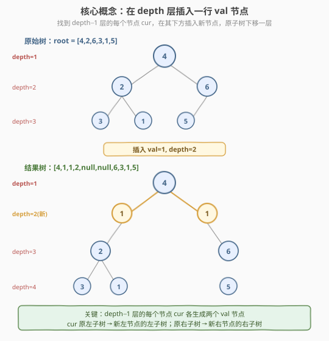
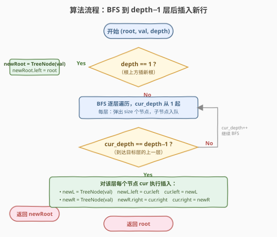
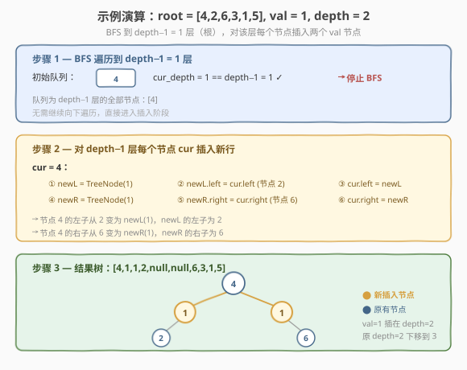

# 在二叉树中增加一行

- **题目名称**：在二叉树中增加一行
- **链接**：[623. 在二叉树中增加一行](https://leetcode.cn/problems/add-one-row-to-tree/)
- **难度**：中等
- **标签**：树、二叉树、广度优先搜索（BFS）、深度优先搜索（DFS）

## 1. 题目概述

给定一棵二叉树的根 `root` 和两个整数 `val` 与 `depth`，在深度 `depth` 处**增加一行**值为 `val` 的节点。根节点位于深度 `1`。

**加法规则**：

- 给定整数 `depth`，对于深度为 `depth - 1` 的每个**非空**节点 `cur`，创建两个值为 `val` 的节点作为 `cur` 的**左子树根**和**右子树根**。
- `cur` 原来的左子树成为**新左子树根的左子树**。
- `cur` 原来的右子树成为**新右子树根的右子树**。
- 如果 `depth == 1`，则不存在 `depth - 1` 层：此时创建一个值为 `val` 的节点作为**整个新树的根**，原树作为新根的**左子树**。

**示例 1**：

```text
输入：root = [4,2,6,3,1,5], val = 1, depth = 2
输出：[4,1,1,2,null,null,6,3,1,5]
解释：在 depth=2 插入一行 1。节点 4 的左子 2、右子 6 各下移一层，
      新节点 1 分别接管 2（作为其左子）和 6（作为其右子）。
```

**示例 2**：

```text
输入：root = [4,2,null,3,1], val = 1, depth = 3
输出：[4,2,null,1,1,3,null,null,1]
解释：在 depth=3 插入一行 1。depth-1=2 层只有节点 2（右子为 null 跳过），
      节点 2 的左子 3、右子 1 各下移一层，新节点 1 分别接管 3 和 1。
```

**约束条件**：

- 树中节点数目范围 `[1, 10^4]`
- 树的深度范围 `[1, 10^4]`
- `-100 <= Node.val <= 100`
- `-10^5 <= val <= 10^5`
- `1 <= depth <= the depth of tree + 1`

> 💡 本题的关键在于**精准定位到 `depth - 1` 层**，然后对该层**每个**非空节点做一次结构重连——新节点「插入」在 `cur` 与其原子树之间。唯一需要单独处理的边界是 `depth == 1`：此时没有「上一层」可挂，只能新建根节点。

---

## 2. 解题思路

### 2.1 暴力思路：重建整棵树

最直观但低效的做法是：把树序列化成数组，在数组指定位置插入新行，再反序列化重建。问题是 LeetCode 层序数组中 `null` 的位置语义与「满二叉树位置」不完全对齐，手动插入后还要重新对齐下标，极易出错且空间开销大。

> ⚠️ 树的「形状」是由**指针结构**决定的，不依赖数组表示。直接在原树上做**指针重连**才是最自然、最高效的做法。

### 2.2 核心观察：BFS 到 `depth-1` 层，原地重连指针



本题的本质是一次**带深度条件的层序遍历 + 原地插入**：

1. **定位目标层**：用 BFS 逐层下探，当 `cur_depth == depth - 1` 时停下来——此时队列里恰好是**目标层的上一层全部节点**。
2. **原地重连**：对该层每个节点 `cur`，执行两次「中间插入」：
   - **左侧**：`newL = TreeNode(val)` → `newL.left = cur.left` → `cur.left = newL`
   - **右侧**：`newR = TreeNode(val)` → `newR.right = cur.right` → `cur.right = newR`
3. **边界 `depth == 1`**：没有 `depth - 1` 层，直接 `newRoot = TreeNode(val)`，`newRoot.left = root`，返回 `newRoot`。

> 💡 **为什么只需处理 `depth - 1` 层？** 因为新行插入在 `depth - 1` 层与 `depth` 层之间——只要把 `depth - 1` 层每个节点的左右指针「断开 → 插入新节点 → 新节点接管原子树」，`depth` 层及以下的整棵子树原封不动地下移一层，结构自然正确。不需要递归到更深处。

### 2.3 算法流程图



**完整步骤**：

1. **特判 `depth == 1`**：新建根节点 `TreeNode(val)`，令 `newRoot.left = root`，返回 `newRoot`。
2. **BFS 初始化**：队列 `q = [root]`，`cur_depth = 1`。
3. **逐层遍历**：
   - `size = q.size()`；
   - 若 `cur_depth == depth - 1`：对该层每个节点 `cur` 执行插入操作（见下），插入完毕后 `break`；
   - 否则：弹出 `size` 个节点，将各自的非空左右子入队，`cur_depth++`。
4. **插入操作**（对每个 `cur`）：
   - `newL = TreeNode(val)`，`newL.left = cur.left`，`cur.left = newL`
   - `newR = TreeNode(val)`，`newR.right = cur.right`，`cur.right = newR`
5. 返回 `root`。

### 2.4 示例演算

以 `root = [4,2,6,3,1,5], val = 1, depth = 2` 为例：



| 步骤 | 操作 | 结果 |
|------|------|------|
| 1 | BFS 到 `depth-1 = 1` 层，队列 = [4]，`cur_depth == 1` ✓ | 停止 BFS |
| 2 | `cur = 4`：`newL = 1`，`newL.left = 2`，`cur.left = newL` | 4 的左子从 2 → 1，1 的左子为 2 |
| 2 | `cur = 4`：`newR = 1`，`newR.right = 6`，`cur.right = newR` | 4 的右子从 6 → 1，1 的右子为 6 |
| 3 | 返回 `root` | 结果树 `[4,1,1,2,null,null,6,3,1,5]` |

> 💡 注意插入的**三步顺序**不能乱：必须先 `newL.left = cur.left`（保存原指针），再 `cur.left = newL`（重连）。如果先做 `cur.left = newL`，原子树指针就丢失了。右侧同理。

---

## 3. 参考代码

### C++

```cpp
// 在二叉树中增加一行.cpp —— BFS 定位 depth-1 层 + 原地指针重连
// 编译: g++ -O2 -std=c++17 在二叉树中增加一行.cpp -o addonerow
#include <queue>
using namespace std;

struct TreeNode {
    int val;
    TreeNode* left;
    TreeNode* right;
    TreeNode() : val(0), left(nullptr), right(nullptr) {
    }
    TreeNode(int x) : val(x), left(nullptr), right(nullptr) {
    }
    TreeNode(int x, TreeNode* l, TreeNode* r) : val(x), left(l), right(r) {
    }
};

class Solution {
  public:
    TreeNode* addOneRow(TreeNode* root, int val, int depth) {
        if (depth == 1) {
            TreeNode* newRoot = new TreeNode(val);
            newRoot->left = root;
            return newRoot;
        }
        queue<TreeNode*> q;
        q.push(root);
        int curDepth = 1;
        while (!q.empty()) {
            int size = q.size();
            if (curDepth == depth - 1) {
                for (int i = 0; i < size; ++i) {
                    TreeNode* node = q.front();
                    q.pop();
                    TreeNode* newLeft = new TreeNode(val);
                    newLeft->left = node->left;
                    node->left = newLeft;
                    TreeNode* newRight = new TreeNode(val);
                    newRight->right = node->right;
                    node->right = newRight;
                }
                break;
            }
            for (int i = 0; i < size; ++i) {
                TreeNode* node = q.front();
                q.pop();
                if (node->left) q.push(node->left);
                if (node->right) q.push(node->right);
            }
            curDepth++;
        }
        return root;
    }
};
```

### Python

```python
from collections import deque
from typing import Optional


class TreeNode:
    def __init__(self, val=0, left=None, right=None):
        self.val = val
        self.left = left
        self.right = right


class Solution:
    def addOneRow(self, root: Optional[TreeNode], val: int, depth: int) -> Optional[TreeNode]:
        if depth == 1:
            new_root = TreeNode(val)
            new_root.left = root
            return new_root

        q = deque([root])
        cur_depth = 1
        while q:
            size = len(q)
            if cur_depth == depth - 1:
                for _ in range(size):
                    node = q.popleft()
                    new_left = TreeNode(val)
                    new_left.left = node.left
                    node.left = new_left
                    new_right = TreeNode(val)
                    new_right.right = node.right
                    node.right = new_right
                break
            for _ in range(size):
                node = q.popleft()
                if node.left:
                    q.append(node.left)
                if node.right:
                    q.append(node.right)
            cur_depth += 1
        return root
```

> 💡 **BFS 的两层 `for`**：外层 `while + size` 控制逐层推进，内层 `for` 处理一整层。关键在于 `cur_depth == depth - 1` 时**不再向下扩展**（不把子节点入队），而是直接做插入并 `break`——因为插入后这一层就不需要再被 BFS 访问了。

---

## 4. 复杂度分析

| 维度 | 复杂度 | 说明 |
|------|--------|------|
| 时间复杂度 | $O(n)$ | 最坏遍历到 `depth - 1` 层，访问的节点数不超过 $n$；插入操作对 `depth - 1` 层每个节点做常数工作 |
| 空间复杂度 | $O(w)$ | BFS 队列最多存一层节点，$w$ 为树的最大宽度，最宽层可达 $n/2$（满二叉树底层） |

> ⚠️ 本题**无需递归栈**（BFS 版），空间仅由队列决定。若树退化为链，宽度 $w = 1$，队列空间 $O(1)$；若树接近满二叉树，宽度 $w \approx n/2$。实际中 `depth` 不超过树深，BFS 最多遍历到 `depth - 1` 层即停，不会扫完整棵树。

---

## 5. 扩展：DFS 递归解法

本题也可用 **DFS** 解决：递归携带当前深度 `cur_depth`，当 `cur_depth == depth - 1` 时执行插入，否则继续向下递归。相比 BFS，DFS 无需队列，代码更简洁，但需要递归栈空间。

```python
class Solution:
    def addOneRow(self, root: Optional[TreeNode], val: int, depth: int) -> Optional[TreeNode]:
        if depth == 1:
            new_root = TreeNode(val)
            new_root.left = root
            return new_root

        def dfs(node, cur_depth):
            if not node:
                return
            if cur_depth == depth - 1:
                new_left = TreeNode(val)
                new_left.left = node.left
                node.left = new_left
                new_right = TreeNode(val)
                new_right.right = node.right
                node.right = new_right
            elif cur_depth < depth - 1:
                dfs(node.left, cur_depth + 1)
                dfs(node.right, cur_depth + 1)

        dfs(root, 1)
        return root
```

> 💡 **DFS 的剪枝关键**：`elif cur_depth < depth - 1` 才继续递归——一旦到达 `depth - 1` 层完成插入，就不再深入（因为更下层的子树不受影响）。这保证了 DFS 也不会扫遍整棵树，时间仍为 $O(n)$。两种写法的区别只在空间：BFS 用队列（最宽层），DFS 用栈（最深路径）。

---

## 6. 面试要点

1. **`depth == 1` 为什么要单独处理？**

   - `depth == 1` 意味着新行插在根之上，没有 `depth - 1 = 0` 层可挂。此时只能新建根节点 `TreeNode(val)`，令 `newRoot.left = root`，返回 `newRoot`。若不特判，BFS 从 `cur_depth = 1` 开始永远到不了 `depth - 1 = 0`，会漏掉这种情况。

2. **插入时三步顺序能否调换？**

   - 不能。必须先 `newL.left = cur.left`（保存原子树指针），再 `cur.left = newL`（重连）。如果先做 `cur.left = newL`，原左子树指针就被覆盖丢失了，原子树无法挂回。右侧同理：先 `newR.right = cur.right`，再 `cur.right = newR`。

3. **为什么只需处理 `depth - 1` 层，不用递归到 `depth` 层？**

   - 新行插在 `depth - 1` 与 `depth` 之间。只要在 `depth - 1` 层做指针重连，原 `depth` 层及以下的整棵子树原封不动地下移一层，结构自然正确——新节点的左子接管了 `cur` 的原左子树（整棵），右子接管了原右子树（整棵），无需逐节点调整更深处。

4. **BFS 和 DFS 两种解法怎么选？**

   - 两者时间都是 $O(n)$。BFS 用队列显式按层推进，到 `depth - 1` 层即停，逻辑清晰且适合面试讲解；DFS 递归携带深度参数，代码更短但需要递归栈空间（最坏 $O(n)$，树退化为链时）。面试中先讲 BFS 为主解，再提 DFS 作为变体，能体现对两种遍历范式的掌控。

5. **`depth` 超过树的实际深度会怎样？**

   - 题目保证 `depth <= the depth of tree + 1`，所以不会出现「找不到 `depth - 1` 层」的情况。但若 BFS 队列在到达 `depth - 1` 层之前就空了（理论上不会发生），循环自然结束，`root` 原样返回——这是一种隐式的安全兜底。

> 💡 **一句话总结**：623 的核心是「**BFS 定位到 `depth - 1` 层，对该层每个节点做一次三步指针重连**」。难点不在 BFS 骨架，而在想到「插入 = 中间重连」而非「重建」——以及记得先保存原子树指针再覆盖。

---

## 7. 同类练习题

- [102. 二叉树的层序遍历](https://leetcode.cn/problems/binary-tree-level-order-traversal/)（[题解](../0101-0200/102_二叉树的层序遍历.md)）：BFS `while + for(size)` 逐层模板，本题骨架来源
- [450. 删除二叉搜索树中的节点](https://leetcode.cn/problems/delete-node-in-a-bst/)：BST 结构修改 + 指针重连，与本题同为「原地改树形」套路
- [958. 二叉树的完全性检验](https://leetcode.cn/problems/check-completeness-of-a-binary-tree/)：层序遍历判空节点，同属 BFS 按层处理的应用
- [226. 翻转二叉树](https://leetcode.cn/problems/invert-binary-tree/)：最简单的「原地改树形」——交换每个节点的左右子，与本题的指针重连思想同源
