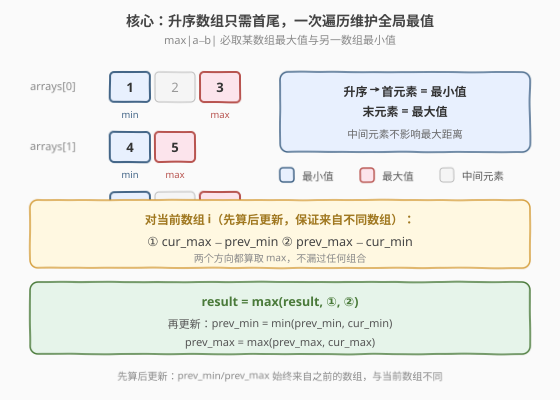
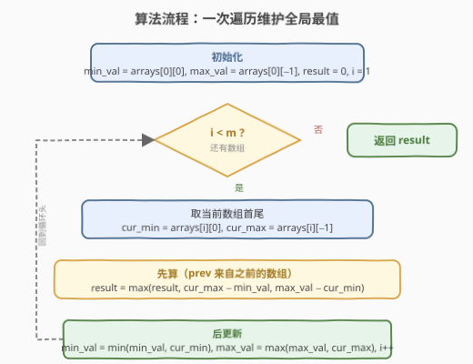
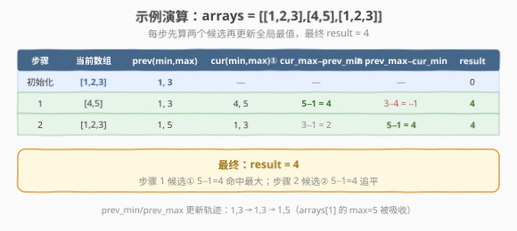

# LeetCode 数组列表中的最大距离 题解

## 1. 题目概述

- **标题 / 题号**：数组列表中的最大距离（#624，medium）
- **链接**：https://leetcode.cn/problems/maximum-distance-in-arrays/
- **难度**：中等
- **标签**：数组、贪心

**题意**：给定 `m` 个**已按升序排序**的数组，从**两个不同的数组**中各选一个整数，计算它们的距离 $|a - b|$，返回最大距离。

**示例 1**：

```text
输入：[[1,2,3],[4,5],[1,2,3]]
输出：4
解释：从第一个数组选 1，从第二个数组选 5，|1−5| = 4。
```

**示例 2**：

```text
输入：arrays = [[1],[1]]
输出：0
```

**约束**：

- `m == arrays.length`
- `2 <= m <= 10^5`
- `1 <= arrays[i].length <= 500`
- `-10^4 <= arrays[i][j] <= 10^4`
- `arrays[i]` 以**升序**排序
- 所有数组中最多有 `10^5` 个整数

> 💡 关键前提是"已升序排序"——每个数组的首元素即最小值，末元素即最大值。最大距离必然出现在某数组的最小值与另一数组的最大值之间，中间元素无需考虑。

## 2. 解题思路

### 2.1 暴力思路：枚举所有数组对

对每一对不同的数组 `(i, j)`，计算 $|arrays[i][0] - arrays[j][-1]|$ 和 $|arrays[i][-1] - arrays[j][0]|$，取全局最大。

```text
result = 0
for i in 0..m:
    for j in i+1..m:
        d1 = |arrays[i][0]  - arrays[j][-1]|
        d2 = |arrays[i][-1] - arrays[j][0] |
        result = max(result, d1, d2)
```

时间复杂度 $O(m^2)$，`m = 10^5` 时约 $10^{10}$ 次运算，**超时**。

> ⚠️ 暴力法的瓶颈在于两重循环。破局思路：最大距离只取决于每个数组的**首尾两端**（最小值与最大值），不需要遍历所有元素对。进一步观察：全局最大距离一定由"某个数组的最小值"和"另一个数组的最大值"产生——只需一次遍历维护这两个量。

### 2.2 核心观察：一次遍历维护全局最值

**关键转换**：每个数组升序，故 $arrays[i][0]$ 是最小值、$arrays[i][-1]$ 是最大值。最大距离 $|a - b|$ 必取以下两种之一：

- 某数组的**最大值** − 另一数组的**最小值**（差为正，取最大）
- 某数组的**最小值** − 另一数组的**最大值**（差为负，取绝对值即另一方向）

两者对称，统一为：$\max(\text{cur\_max} - \text{prev\_min},\ \text{prev\_max} - \text{cur\_min})$。



**一次遍历策略**：维护已遍历数组的全局最小值 `min_val` 和全局最大值 `max_val`。对当前数组 `i`：

1. **先算后更新**（保证来自不同数组）：用 `arrays[i]` 的首尾与之前的 `min_val`/`max_val` 计算两个候选距离
2. **再更新**全局最值：`min_val = min(min_val, arrays[i][0])`，`max_val = max(max_val, arrays[i][-1])`

> 💡 **为什么要"先算后更新"？** 题目要求两个数来自**不同数组**。若先更新再算，当前数组的首尾可能同时成为 `min_val` 和 `max_val`，导致 `max_val - min_val = 0`（自减自），违反约束。先算保证 `min_val`/`max_val` 来自之前遍历过的数组，与当前数组不同。

### 2.3 算法流程图



**完整步骤**：

1. **初始化**：`min_val = arrays[0][0]`，`max_val = arrays[0][-1]`，`result = 0`，`i = 1`
2. **遍历** `i` 从 `1` 到 `m - 1`：
   - `cur_min = arrays[i][0]`，`cur_max = arrays[i][-1]`
   - `result = max(result, cur_max - min_val, max_val - cur_min)`
   - `min_val = min(min_val, cur_min)`，`max_val = max(max_val, cur_max)`
3. 返回 `result`

### 2.4 示例演算

以 `arrays = [[1,2,3],[4,5],[1,2,3]]` 为例：



| 步骤 | 当前数组 | cur_min | cur_max | prev_min | prev_max | ① cur_max−prev_min | ② prev_max−cur_min | result |
|------|---------|---------|---------|----------|----------|-------------------|-------------------|--------|
| 初始化 | [1,2,3] | 1 | 3 | — | — | — | — | 0 |
| 1 | [4,5] | 4 | 5 | 1 | 3 | 5−1=**4** | 3−4=−1 | 4 |
| 2 | [1,2,3] | 1 | 3 | 1 | 5 | 3−1=2 | 5−1=**4** | 4 |

**步骤 1 详解**：`prev_min=1`（来自 arrays[0]），当前数组 `[4,5]` 的 `cur_max=5`。候选① $5-1=4$ 是目前最大距离。更新后 `prev_min` 仍为 1，`prev_max` 升为 5。

**步骤 2 详解**：`prev_max=5`（来自 arrays[1]），当前数组 `[1,2,3]` 的 `cur_min=1`。候选② $5-1=4$ 追平最大值。最终 `result = 4`。

> 💡 注意步骤 2 的候选① $3-1=2$ 虽然为正，但 `cur_max=3` 和 `prev_min=1` 此时 `prev_min` 恰好也来自 arrays[0]，距离合法但不是最大。关键在于两个候选都算取 max，不漏过任何方向。

## 3. 参考代码

### C++

```cpp
// 数组列表中的最大距离.cpp —— 一次遍历维护全局最值
// 编译: g++ -O2 -std=c++17 数组列表中的最大距离.cpp -o maxdist
#include <vector>
#include <algorithm>
using namespace std;

class Solution {
public:
    int maxDistance(vector<vector<int>>& arrays) {
        int min_val = arrays[0][0];        // 全局最小值（来自已遍历数组）
        int max_val = arrays[0].back();    // 全局最大值
        int result = 0;

        for (int i = 1; i < (int)arrays.size(); ++i) {
            int cur_min = arrays[i][0];
            int cur_max = arrays[i].back();
            // ① 先算：用当前数组首尾与之前全局最值算两个候选
            result = max(result, cur_max - min_val);
            result = max(result, max_val - cur_min);
            // ② 后更新：把当前数组纳入全局最值
            min_val = min(min_val, cur_min);
            max_val = max(max_val, cur_max);
        }
        return result;
    }
};
```

### Python

```python
class Solution:
    def maxDistance(self, arrays: list[list[int]]) -> int:
        min_val = arrays[0][0]           # 全局最小值（来自已遍历数组）
        max_val = arrays[0][-1]          # 全局最大值
        result = 0

        for i in range(1, len(arrays)):
            cur_min = arrays[i][0]
            cur_max = arrays[i][-1]
            # ① 先算：用当前数组首尾与之前全局最值算两个候选
            result = max(result, cur_max - min_val, max_val - cur_min)
            # ② 后更新：把当前数组纳入全局最值
            min_val = min(min_val, cur_min)
            max_val = max(max_val, cur_max)
        return result
```

> 💡 **"先算后更新"是本题唯一的坑**：必须先用 `min_val`/`max_val`（来自之前的数组）与当前数组计算距离，再把当前数组纳入全局最值。顺序颠倒则可能用同一数组的 min 和 max 自减，违反"不同数组"约束。

## 4. 复杂度分析

| 维度 | 复杂度 | 说明 |
|------|--------|------|
| **时间复杂度** | $O(m)$ | 遍历 `m` 个数组，每个只看首尾两个元素 |
| **空间复杂度** | $O(1)$ | 仅维护 `min_val`、`max_val`、`result` 三个变量 |
| **最优时间** | $O(m)$ | 已达理论下界——至少需遍历每个数组一次 |

> ⚠️ 注意 $m$ 是数组个数，不是元素总数。元素总数最多 $10^5$，但每个数组只访问首尾，故时间与元素总数无关，仅与数组个数成正比。

## 5. 扩展：为什么中间元素不影响最大距离

设数组 $A$ 升序，$B$ 升序，$A$ 与 $B$ 来自不同数组。最大 $|a - b|$（$a \in A, b \in B$）取何值？

- 若 $a$ 取 $A$ 中非最大值 $a'$（$a' < A[-1]$），则 $|a' - b| \le \max(|A[-1] - b|, |A[0] - b|)$，因为 $a' \in [A[0], A[-1]]$，$|a' - b|$ 的极值在区间端点取得。
- 同理 $b$ 的极值也在 $B$ 的端点取得。

因此最大距离只可能在 $\{A[0], A[-1]\} \times \{B[0], B[-1]\}$ 四个组合中产生，而四个组合的最大值恰好是 $\max(A[-1] - B[0],\ B[-1] - A[0])$——即两个候选。这就是"只需首尾"的数学根据。

| 解法 | 时间 | 空间 | 思路 |
|------|------|------|------|
| 暴力枚举对 | $O(m^2)$ | $O(1)$ | 枚举所有数组对，算首尾差 |
| 收集首尾再排序 | $O(m \log m)$ | $O(m)$ | 收集所有 min/max 排序，取 max−min（需保证不同源） |
| **一次遍历** | $O(m)$ | $O(1)$ | 维护全局 min/max，先算后更新 |

> 💡 **面试建议**：先讲暴力 $O(m^2)$，再引出"只需首尾"的观察，最后优化为一次遍历 $O(m)$。这条渐进优化讲法体现从"枚举对"到"维护极值"的思维跃迁。

## 6. 面试要点

1. **为什么最大距离只与首尾元素有关？**

   - 数组升序，$a \in [A[0], A[-1]]$。对任意 $b$，$|a - b|$ 在区间端点处取极值（$a$ 离 $b$ 最远时必在端点）。
   - 故最大 $|a-b|$ 只需考虑 $\{A[0], A[-1]\} \times \{B[0], B[-1]\}$ 四个组合。

2. **为什么要"先算后更新"？**

   - 题目要求两数来自不同数组。若先更新 `min_val`/`max_val` 再算，当前数组的首尾可能同时成为全局最值，导致自减。
   - 先算保证 `min_val`/`max_val` 来自之前遍历的数组，与当前数组不同。

3. **两个候选 `cur_max - min_val` 和 `max_val - cur_min` 会是负数吗？**

   - 可能。如 `arrays = [[1,2,3],[4,5]]`，步骤 1 中 `max_val - cur_min = 3 - 4 = -1`。
   - 但 `result` 初始为 0，且另一候选 `cur_max - min_val = 5 - 1 = 4` 为正。取 max 后负数自动忽略。当所有数组相同时（如 `[[1],[1]]`），两候选均为 0，result 保持 0，正确。

4. **与 [121. 买卖股票的最佳时机] 有什么相似之处？**

   - 121 题一次遍历维护"前缀最小值"，用当前价减前缀最小得利润。本题一次遍历维护"前缀最小/最大"，用当前数组首尾减前缀最值得距离。
   - 核心同为"先算后更新"——用已遍历部分的最值与当前元素算差，再更新最值。

5. **如果数组不是升序排序怎么办？**

   - 需对每个数组先求 min/max（$O(\sum |arrays[i]|)$），再套用一次遍历。排序前提省去了求最值的开销，是本题的便利条件。

> 💡 **一句话总结**：本题是"一次遍历维护极值"的招牌题——升序数组只需首尾，维护全局 min/max，先算后更新保证不同源。与买卖股票同属"前缀最值 + 差值"范式，是面试中考察贪心直觉的经典题。

## 同类练习题

| # | 题目 | 与本题的关联 |
|---|------|-------------|
| 121 | [买卖股票的最佳时机](https://leetcode.cn/problems/best-time-to-buy-and-sell-stock/)（[题解](../0101-0200/121_买卖股票的最佳时机.md)） | 一次遍历维护前缀最小值，当前价减前缀最小即利润，同属"先算后更新"范式 |
| 2016 | [增量元素之间的最大差值](https://leetcode.cn/problems/maximum-difference-between-increasing-elements/) | 维护前缀最小值，当前值减前缀最小求最大差，与本题几乎同构 |
| 628 | [三个数的最大乘积](https://leetcode.cn/problems/maximum-product-of-three-numbers/) | 一次遍历维护最大的三个值和最小的两个值，同为"维护极值"思路 |
| 414 | [第三大的数](https://leetcode.cn/problems/third-maximum-number/) | 一次遍历维护前三大值，"维护多个极值"的变体 |
| 747 | [至少是其他数字两倍的最大数](https://leetcode.cn/problems/largest-number-at-least-twice-of-others/) | 一次遍历维护最大值与次大值，"维护极值"的简单应用 |
