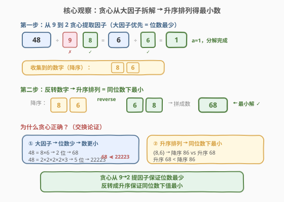
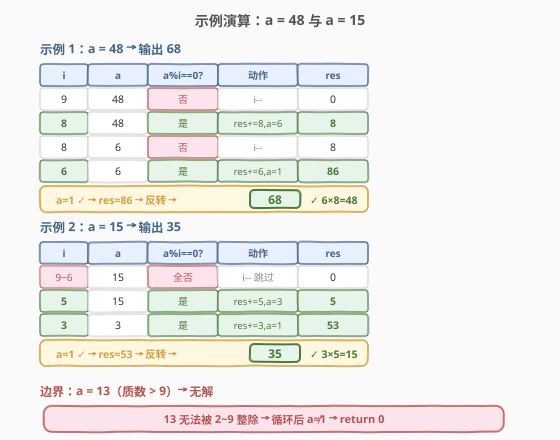

# LeetCode 最小因式分解 题解

## 1. 题目概述

- **标题 / 题号**：最小因式分解（#625，medium）
- **链接**：https://leetcode.cn/problems/minimum-factorization/
- **难度**：中等
- **标签**：贪心、数学、回溯

**题意**：给定一个正整数 `a`，找到一个最小的正整数 `b`，使得 `b` 的**各数位之积**等于 `a`。如果不存在这样的 `b`，或者 `b` 超出 32 位有符号整数范围（$2^{31}-1$），则返回 `0`。

**示例 1**：

```text
输入：a = 48
输出：68
解释：6 × 8 = 48，且 68 是满足条件的最小正整数
```

**示例 2**：

```text
输入：a = 15
输出：35
解释：3 × 5 = 15，且 35 是满足条件的最小正整数
```

**约束**：

- $1 \le a \le 2^{31}-1$

> 💡 本题是 Plus 会员专享题。核心是将 `a` **分解为若干个一位数因子（2~9）**，再把这些数字排列成最小的整数。关键观察：数字 1 对乘积无贡献却增加位数，所以候选因子只有 2~9。这使得问题从「无界搜索」收缩为「在 8 个因子中贪心选取」。

## 2. 解题思路

### 2.1 暴力思路：回溯枚举所有分解

最直接的做法：用回溯尝试所有可能的一位数分解。对当前位置，枚举因子 `d`（2~9），若 `a % d == 0`，则递归分解 `a / d`，最终把收集到的数字排列成最小的数。

```text
dfs(remain):
    if remain == 1: 记录当前数字组合，更新最小值
    for d in 2..9:
        if remain % d == 0:
            dfs(remain / d)
```

时间复杂度 $O(2^{\log a})$，最坏情况 `a = 2^31` 时递归深度可达 31 层，每层最多 8 个分支，虽然实际因剪枝远达不到理论上限，但**不优雅**且难以分析最坏情况。

> ⚠️ 回溯法的瓶颈在于「搜索空间过大且无方向性」。破局思路：利用**贪心**——大因子优先提取，既保证位数最少，又天然有序，无需搜索。

### 2.2 核心观察：贪心从大因子提取 + 升序排列

**关键转换**：要使 `b` 最小，需要满足两个条件：

1. **位数最少**——位数越少，数越小（3 位数恒大于 2 位数）。要减少位数，就要用**尽可能大的因子**（一位数因子最大为 9）。
2. **同位数下升序排列**——数字集合相同时，从小到大排列得到的数最小（如 $\{6,8\}$ 排成 $68 < 86$）。



**贪心策略**：从 `i = 9` 递减到 `i = 2`，只要 `a` 能被 `i` 整除，就提取 `i` 作为一位数字因子，并将 `a` 除以 `i`。重复直到 `a` 不再被 `i` 整除，然后尝试 `i-1`。

> 💡 **为什么从 9 到 2 而不是从 2 到 9？** 从大到小提取因子能**最大化每次消去的乘积**，从而**最小化总因子个数（位数）**。例如 $48 = 8 \times 6$（2 位）优于 $48 = 2 \times 2 \times 2 \times 2 \times 3$（5 位）。交换论证：若最优解用了小因子 `d₁` 而当前可用大因子 `d₂ | a`，则可将 `d₁` 及其共因子替换为 `d₂`，位数不增且数值更优。

### 2.3 算法流程图


**完整步骤**：

1. **特判**：若 $a < 10$，直接返回 $a$（`a` 本身就是一位数，其数位之积等于自身）
2. **贪心提取**：`res = 0`，从 `i = 9` 递减到 `i = 2`，只要 `a % i == 0`，就 `res = res * 10 + i`，`a /= i`（注意同一因子可重复提取）
3. **合法性检查**：循环结束后若 $a \ne 1$，说明 `a` 含有大于 9 的质因子，无法分解，返回 `0`
4. **反转为升序**：`res` 中的数字是降序收集的（先 9 后 8 …），反转得到升序排列
5. **溢出检查**：若反转后的结果超过 $2^{31}-1$，返回 `0`

### 2.4 示例演算

以 $a = 48$ 和 $a = 15$ 为例：



**$a = 48$ 详解**：

| i | a | a%i==0? | 动作 | res |
|---|---|---------|------|-----|
| 9 | 48 | 否 | i-- | 0 |
| 8 | 48 | 是 | res=8, a=6 | 8 |
| 8 | 6 | 否 | i-- | 8 |
| 6 | 6 | 是 | res=86, a=1 | 86 |

$a=1$，分解完成。$\text{res}=86 \to$ 反转 $\to 68$。$6 \times 8 = 48$ ✓

**$a = 15$ 详解**：

| i | a | a%i==0? | 动作 | res |
|---|---|---------|------|-----|
| 9~6 | 15 | 全否 | 跳过 | 0 |
| 5 | 15 | 是 | res=5, a=3 | 5 |
| 3 | 3 | 是 | res=53, a=1 | 53 |

$a=1$，$\text{res}=53 \to$ 反转 $\to 35$。$3 \times 5 = 15$ ✓

> 💡 **边界情况**：$a = 13$（大于 9 的质数），9~2 均无法整除，循环后 $a=13 \ne 1$，返回 `0`。

## 3. 参考代码

### C++

```cpp
// 最小因式分解.cpp —— 贪心从大因子提取 + 反转升序
// 编译: g++ -O2 -std=c++17 最小因式分解.cpp -o minfact
#include <climits>
using namespace std;

class Solution {
  public:
    int smallestFactorization(int a) {
        if (a < 10) return a;          // ① 一位数本身就是答案

        long long res = 0;             // 用 long long 防中途溢出
        for (int i = 9; i >= 2; --i) { // ② 从大到小贪心提取因子
            while (a % i == 0) {
                res = res * 10 + i;
                a /= i;
            }
        }
        if (a != 1) return 0;          // ③ 残留 >9 的质因子，无解

        // ④ 反转 res 的各位（降序 → 升序）
        long long ans = 0;
        while (res > 0) {
            ans = ans * 10 + res % 10;
            res /= 10;
        }

        if (ans > INT_MAX) return 0;   // ⑤ 32 位溢出检查
        return (int)ans;
    }
};
```

### Python

```python
class Solution:
    def smallestFactorization(self, a: int) -> int:
        if a < 10:                      # ① 一位数本身就是答案
            return a

        res = 0
        for i in range(9, 1, -1):       # ② 从大到小贪心提取因子
            while a % i == 0:
                res = res * 10 + i
                a //= i
        if a != 1:                      # ③ 残留 >9 的质因子，无解
            return 0

        ans = int(str(res)[::-1])       # ④ 反转（降序 → 升序）
        return ans if ans <= 2**31 - 1 else 0  # ⑤ 32 位溢出检查
```

> 💡 **为什么 `a < 10` 直接返回 `a`？** 当 `a` 是一位数（1~9）时，`a` 本身的数位之积就是 `a`（如 $a=5$，数字 `5` 的数位之积 $= 5$）。任何多位数方案（如 $15$，$1 \times 5 = 5$）都比 `a` 本身大，所以 `a` 就是最小解。注意 $a=1$ 时返回 $1$（数字 1 的数位之积为 1）。

## 4. 复杂度分析

| 维度 | 复杂度 | 说明 |
|------|--------|------|
| **时间复杂度** | $O(\log a)$ | 外层循环 9→2 共 8 次；内层 `while` 每次至少将 `a` 除以 2，总迭代次数 $\le \log_2 a$ |
| **空间复杂度** | $O(1)$ | 仅用常数个变量（`res`、`ans`、`i`） |
| **最优时间** | $O(\log a)$ | 已知最优解；贪心一步到位，无需搜索 |

> ⚠️ **回溯解法对比**：回溯枚举所有分解方案，最坏 $O(8^{\log a})$，虽经剪枝后实际很快，但复杂度分析困难且无理论保证。贪心解法利用「大因子优先」的单调性，将搜索问题降维为一次线性扫描。

## 5. 扩展：回溯解法

贪心虽是最优解，但面试中可能被要求先讲回溯再优化。回溯法的思路：枚举所有可能的一位数分解，对每种分解将数字升序排列，取最小值。

```python
class Solution:
    def smallestFactorization(self, a: int) -> int:
        if a < 10:
            return a

        best = float('inf')

        def dfs(remain, digits):
            nonlocal best
            if remain == 1:
                digits.sort()                     # 升序排列得最小数
                val = 0
                for d in digits:
                    val = val * 10 + d
                if val <= 2**31 - 1:
                    best = min(best, val)
                return
            for d in range(2, 10):                # 枚举因子 2~9
                if remain % d == 0:
                    digits.append(d)
                    dfs(remain // d, digits)
                    digits.pop()                  # 回溯

        dfs(a, [])
        return best if best != float('inf') else 0
```

时间 $O(8^{\log a})$，空间 $O(\log a)$（递归栈）。适合作为「回溯 $\to$ 贪心」的渐进优化讲法。

| 解法 | 时间 | 空间 | 思路 |
|------|------|------|------|
| 回溯 | $O(8^{\log a})$ | $O(\log a)$ | 枚举所有一位数分解，取最小排列 |
| **贪心** | $O(\log a)$ | $O(1)$ | 大因子优先 + 反转升序 |

> 💡 **面试建议**：先讲回溯 $O(8^{\log a})$（容易想到），再观察到大因子优先可减少位数，优化为贪心 $O(\log a)$。这条「搜索 $\to$ 贪心」的讲法体现「先暴力后优化」的思维过程。

## 6. 面试要点

1. **为什么从 9 到 2 贪心提取因子？**

   - 从大到小提取能**最大化每次消去的乘积**，从而**最小化位数**。位数少的数恒小于位数多的数（如 $68 < 22223$）。
   - 交换论证：若最优解用了小因子而当前可用大因子，替换后位数不增且数值更优，所以贪心不会错过最优解。

2. **为什么收集完因子后要反转？**

   - 贪心按 9→2 提取，先提取的大因子排在 `res` 高位，形成降序（如 $86$）。
   - 要使数值最小，同位数字应升序排列（$68 < 86$），所以反转。

3. **`a < 10` 为什么要特判？**

   - 若 $a$ 是一位数（1~9），`a` 本身就是答案——其数位之积等于自身。
   - 不特判的话，贪心循环无法处理（如 $a=5$，9~2 均不整除，循环后 $a=5 \ne 1$，会错误返回 0）。

4. **什么情况下返回 0？**

   - **无解**：`a` 含有大于 9 的质因子（如 $a=13, 26=2 \times 13$），循环后 $a \ne 1$。
   - **溢出**：分解后的数超过 $2^{31}-1$（如 $a = 2^{31}-1$ 分解出很多 2，拼出的数可能超 32 位）。

5. **贪心和回溯的关系？**

   - 回溯枚举所有分解方案，保证最优但复杂度高。
   - 贪心利用「大因子优先减少位数 + 升序排列最小化同位数值」两个单调性，一步到位。
   - 贪心的正确性由交换论证保证：任何非贪心选择都能被替换为更优或等价的贪心选择。

> 💡 **一句话总结**：最小因式分解是「贪心 + 数学」的招牌题——从 9 到 2 贪心提取一位数因子保证位数最少，反转成升序保证同位数下数值最小，最后检查 32 位溢出。核心洞察是「数字 1 无用、候选因子仅 2~9、大因子优先减位数」三步收紧搜索空间。

## 同类练习题

| # | 题目 | 与本题的关联 |
|---|------|-------------|
| 254 | [因子的组合](https://leetcode.cn/problems/factor-combinations/) | 回溯枚举所有因子分解（本题的「全部方案」版，非贪心） |
| 343 | [整数拆分](https://leetcode.cn/problems/integer-break/) | 切分型 DP + 数学贪心（切成 3 最优，与本题「大因子优先」异曲同工） |
| 264 | [丑数 II](https://leetcode.cn/problems/ugly-number-ii/) | 三指针多路归并生成只含因子 2/3/5 的数（因子受限的数学构造类） |
| 172 | [阶乘后的零](https://leetcode.cn/problems/factorial-trailing-zeroes/) | 勒让德公式统计质因子个数（因子分析的另一侧面） |
