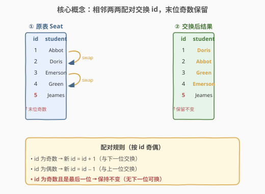
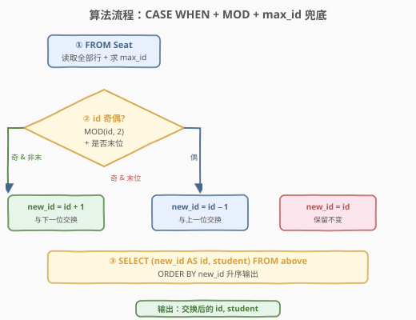
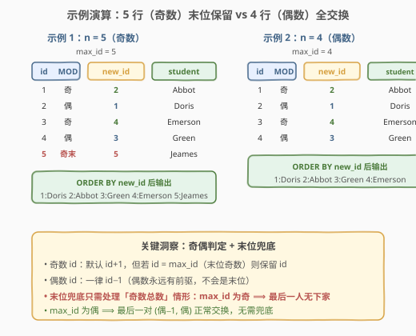

# LeetCode 换座位 题解

## 1. 题目概述

- **标题 / 题号**：换座位（#626，medium）
- **链接**：https://leetcode.cn/problems/exchange-seats/
- **难度**：中等
- **标签**：SQL、CASE WHEN、MOD、子查询、窗口函数

**题意**：`Seat` 表包含 `id`（主键，自增）和 `student`（学生姓名）两列。`id` 序列从 1 开始连续递增。要求**交换每两个连续学生的座位号**：即 id=1 与 id=2 互换、id=3 与 id=4 互换……若学生总数为奇数，则**最后一个学生的 id 不交换**。结果按 `id` 升序返回。

**表结构**：

```text
Table: Seat
+-------------+---------+
| Column Name | Type    |
+-------------+---------+
| id          | int     |  ← 主键，自增连续（1, 2, 3, ...）
| student     | varchar |
+-------------+---------+
```

> 💡 **关键约束**：`id` 从 1 开始**连续递增、无间断**——这是「相邻两两交换」成立的前提。「交换座位号」指的是**改写 `id` 列的值**（让原本坐在 1 号位的 Abbot 改坐 2 号位），而非交换 `student` 列。输出的是 `(id, student)` 对，按新 `id` 排序。

**示例 1**：

```text
输入：
Seat 表：
+----+---------+
| id | student |
+----+---------+
| 1  | Abbot   |
| 2  | Doris   |
| 3  | Emerson |
| 4  | Green   |
| 5  | Jeames  |
+----+---------+

输出：
+----+---------+
| id | student |
+----+---------+
| 1  | Doris   |
| 2  | Abbot   |
| 3  | Green   |
| 4  | Emerson |
| 5  | Jeames  |
+----+---------+
```

**解释**：5 行为奇数。(1,2) 交换 → 1:Doris, 2:Abbot；(3,4) 交换 → 3:Green, 4:Emerson；id=5 是最后一位且为奇数 → 保留 5:Jeames。

**约束**：

- `id` 为主键，从 1 开始连续递增
- 学生总数可能为奇数也可能为偶数
- 奇数总数时最后一位的 `id` 保持不变
- 结果按 `id` 升序返回

> 💡 本题是 SQL 中「**逐行条件改写**」的经典题——核心是用 `CASE WHEN` 根据 `id` 的奇偶性决定新 `id` 值。难点不在逻辑本身，而在「**末位奇数兜底**」这个边界条件：当总数为奇数时，最后一个奇数 `id` 没有下家可换，必须保留原值。

## 2. 解题思路

### 2.1 暴力思路：游标两两扫描

最直觉的过程式思路：按 `id` 排序后用游标两两扫描，每对 `(2k−1, 2k)` 交换 `id`；若剩余最后一行（总数为奇数）则跳过。这在 Python/Java 里几行就能写完，但**纯 SQL 没有循环**——需要把「配对交换」转化为「按 `id` 奇偶性的逐行改写规则」。

> ⚠️ **思路转换的关键**：「交换 (1,2)、(3,4)…」等价于「每行根据自身 `id` 奇偶性计算新 `id`」：奇数行 `id → id+1`，偶数行 `id → id−1`。这是把「成对操作」拆解为「逐行独立计算」——SQL 擅长的集合化思维。

### 2.2 核心观察：奇偶改写 + 末位兜底



**观察 1：奇偶性决定交换方向**

把「相邻两两交换」拆成逐行规则：

$$\text{new\_id}(i) = \begin{cases} i + 1 & \text{if } i \text{ is odd} \\ i - 1 & \text{if } i \text{ is even} \end{cases}$$

- `id` 为**奇数** → 它是某对的「左成员」，新 `id` = `id + 1`（与下一位交换）；
- `id` 为**偶数** → 它是某对的「右成员」，新 `id` = `id − 1`（与上一位交换）。

奇偶性用 `MOD(id, 2)` 或 `id % 2` 判定：余 1 为奇，余 0 为偶。

**观察 2：末位奇数需兜底**

上述规则在「总数为偶数」时完美——每对都有左右两成员。但「总数为奇数」时，最后一个 `id`（= `max_id`，必为奇数）按规则会算成 `max_id + 1`，而该 `id` **不存在**——它没有下家可换。题目要求此位**保持不变**，故需额外条件：

$$\text{new\_id}(i) = \begin{cases} i & \text{if } i \text{ is odd and } i = \max(\text{id}) \\ i + 1 & \text{if } i \text{ is odd and } i \neq \max(\text{id}) \\ i - 1 & \text{if } i \text{ is even} \end{cases}$$

> 💡 **为什么只有「奇数 + 末位」需兜底**：偶数 `id` 永远有前驱（`id − 1 ≥ 1` 存在），不会是末位（末位 `id` 必为 `max_id`，而 `max_id` 与总数同奇偶——总数为偶时 `max_id` 为偶，但此时偶数末位按规则 `id−1` 交换，正常完成最后一对）。只有「总数为奇」时 `max_id` 为奇，该奇数末位无下家，才需保留。换言之，**兜底条件等价于「`id` 为奇 且 `id = max_id`」**，无需显式判断总数奇偶。

**观察 3：max_id 需用子查询获取**

判定「是否末位」需知道最大 `id`。SQL 中用子查询 `SELECT MAX(id) FROM Seat` 取得，再在 `CASE WHEN` 中比较 `id = (SELECT MAX(id) FROM Seat)`。

### 2.3 算法流程图



| 步骤 | SQL 子句 | 作用 | 行数变化 |
|------|----------|------|----------|
| ① | `FROM Seat` + 子查询 `MAX(id)` | 读取全部行 + 求末位 id | $n$ 行 |
| ② | `CASE WHEN MOD(id,2)=1 AND id<max → id+1`<br>`WHEN MOD(id,2)=0 → id−1`<br>`ELSE id` | 按奇偶 + 末位计算 new_id | $n$ 行（逐行改写） |
| ③ | `ORDER BY new_id` | 按新 id 升序输出 | $n$ 行（重排顺序） |

> 💡 **执行顺序**：`FROM`（取 $n$ 行）→ 子查询算 `max_id`（标量）→ `CASE WHEN` 逐行算 `new_id` → `ORDER BY new_id` 重排输出。子查询 `SELECT MAX(id) FROM Seat` 是相关子查询的非相关版本（不依赖外层行），可被优化器提升为常量只算一次。

### 2.4 示例演算

对照「5 行（奇数）」与「4 行（偶数）」两种情形，验证规则正确性：



**示例 1：n = 5（奇数），max_id = 5**

| id | MOD(id,2) | 是否末位 | new_id | student |
|----|-----------|----------|--------|---------|
| 1 | 奇 | 否 | 2 | Abbot |
| 2 | 偶 | — | 1 | Doris |
| 3 | 奇 | 否 | 4 | Emerson |
| 4 | 偶 | — | 3 | Green |
| 5 | 奇 | **是** | **5** | Jeames |

`ORDER BY new_id` 后 → `1:Doris, 2:Abbot, 3:Green, 4:Emerson, 5:Jeames` ✅

**示例 2：n = 4（偶数），max_id = 4**

| id | MOD(id,2) | 是否末位 | new_id | student |
|----|-----------|----------|--------|---------|
| 1 | 奇 | 否 | 2 | Abbot |
| 2 | 偶 | — | 1 | Doris |
| 3 | 奇 | 否 | 4 | Emerson |
| 4 | 偶 | — | 3 | Green |

`ORDER BY new_id` 后 → `1:Doris, 2:Abbot, 3:Green, 4:Emerson` ✅（末位 id=4 为偶数，按 `id−1` 正常交换，无需兜底）

> 💡 **对比两种情形**：奇偶性规则对两种情形都成立，**唯一差异**是末位兜底——`max_id` 为奇（总数奇）时触发兜底，`max_id` 为偶（总数偶）时不触发。一个 `CASE WHEN` 同时覆盖两种情形，无需分支逻辑。

## 3. 参考代码

### SQL（解法 A：CASE WHEN + 子查询 MAX，推荐）

```sql
SELECT (
    CASE
        WHEN MOD(id, 2) = 1 AND id != (SELECT MAX(id) FROM Seat) THEN id + 1
        WHEN MOD(id, 2) = 0 THEN id - 1
        ELSE id
    END
) AS id, student
FROM Seat
ORDER BY id;
```

> 💡 **写法要点**：
> - `MOD(id, 2) = 1` 判奇数，`MOD(id, 2) = 0` 判偶数（也可用 `id % 2`，MySQL/PG/SQLite 均支持）。
> - `id != (SELECT MAX(id) FROM Seat)` 排除末位——末位奇数会落入 `ELSE id` 分支保留原值。
> - 第一个 `WHEN` 同时满足「奇数」和「非末位」两个条件才 `id+1`；偶数走第二个 `WHEN`；其余（即末位奇数）走 `ELSE`。
> - `ORDER BY id` 中的 `id` 是 `SELECT` 中 `CASE` 表达式的别名——MySQL 允许在 `ORDER BY` 中引用 `SELECT` 别名；部分严格 SQL 方言需写 `ORDER BY (CASE ... END)` 或用外层包裹。

### SQL（解法 B：窗口函数 LEAD，免子查询）

```sql
SELECT new_id AS id, student
FROM (
    SELECT id, student,
           LEAD(student) OVER (ORDER BY id) AS next_student,
           LAG(student)  OVER (ORDER BY id) AS prev_student,
           CASE
               WHEN MOD(id, 2) = 1 AND LEAD(id) OVER (ORDER BY id) IS NOT NULL THEN id + 1
               WHEN MOD(id, 2) = 1 THEN id
               ELSE id - 1
           END AS new_id
    FROM Seat
) t
ORDER BY new_id;
```

> 💡 **写法要点**：
> - 用 `LEAD(id) OVER (ORDER BY id)` 取下一行的 `id`——若为 `NULL` 说明当前行是末位，此时奇数末位保留 `id`。
> - 免去子查询 `SELECT MAX(id)`，改用窗口函数「看下一行是否存在」判定末位——思路更直观（「有下家就换，没下家就留」）。
> - 也可直接交换 `student` 列：奇数非末位取 `next_student`，偶数取 `prev_student`，末位取自身 `student`——下面解法 B' 采用此思路。

### SQL（解法 B'：窗口函数直接交换 student）

```sql
SELECT id, new_student AS student
FROM (
    SELECT id, student,
           LEAD(student) OVER (ORDER BY id) AS next_student,
           LAG(student)  OVER (ORDER BY id) AS prev_student,
           CASE
               WHEN MOD(id, 2) = 1 AND LEAD(id) OVER (ORDER BY id) IS NOT NULL THEN next_student
               WHEN MOD(id, 2) = 0 THEN prev_student
               ELSE student
           END AS new_student
    FROM Seat
) t
ORDER BY id;
```

> 💡 **换一个视角**：解法 A 改写 `id` 列、保留 `student`；解法 B' 改写 `student` 列、保留 `id`。两者等价——「Abbot 从 1 号位移到 2 号位」既可表述为「Abbot 的 id 改为 2」，也可表述为「2 号位改坐 Abbot」。`ORDER BY id` 天然升序，无需重排。窗口函数一次排序 + 单趟赋值，通常比子查询 + `ORDER BY` 更高效。

### SQL（解法 C：XOR 位运算技巧）

```sql
SELECT
    CASE
        WHEN id = (SELECT MAX(id) FROM Seat) AND MOD(id, 2) = 1 THEN id
        ELSE id ^ 1
    END AS id, student
FROM Seat
ORDER BY id;
```

> ⚠️ **注意**：`id ^ 1` 是**位异或**运算（MySQL 支持 `^`，PostgreSQL 的 `^` 是幂乘需用 `#`，SQLite 用 `^` 需版本支持）。其效果是**翻转最低位**：

| id（二进制） | id ^ 1（二进制） | 结果 |
|--------------|------------------|------|
| 1 (0001) | 0000 | 0 ❌ |
| 2 (0010) | 0011 | 3 ❌ |

> 上表揭示 `id ^ 1` 并**不能**直接给出 `id±1`——它翻转的是最低位，对 `1, 2, 3, 4` 得到 `0, 3, 2, 5`，并非我们想要的 `2, 1, 4, 3`。**正确的位运算技巧**应使用 `(id - 1) ^ 1 + 1`：

| id | (id−1) | (id−1)^1 | +1 | 结果 |
|----|--------|----------|-----|------|
| 1 | 0 | 1 | 2 | ✅ |
| 2 | 1 | 0 | 1 | ✅ |
| 3 | 2 | 3 | 4 | ✅ |
| 4 | 3 | 2 | 3 | ✅ |

> 即 `(id - 1) ^ 1 + 1` 实现「奇数→id+1、偶数→id−1」的成对交换。**但末位奇数仍需兜底**——`(max_id - 1) ^ 1 + 1 = max_id + 1` 不存在。故解法 C 完整写法为：

```sql
SELECT
    CASE
        WHEN id = (SELECT MAX(id) FROM Seat) AND MOD(id, 2) = 1 THEN id
        ELSE (id - 1) ^ 1 + 1
    END AS id, student
FROM Seat
ORDER BY id;
```

> 💡 **技巧点评**：`(id-1) ^ 1 + 1` 是「成对交换」的位运算紧凑写法——`(id-1)` 把 1-indexed 转为 0-indexed，`^1` 翻转最低位实现配对，`+1` 转回 1-indexed。面试中可作为「加分亮点」提及，但**可读性不如 `CASE WHEN id+1/id-1`**，生产代码推荐解法 A。

### Python（pandas）

```python
import pandas as pd

def exchange_seats(seat: pd.DataFrame) -> pd.DataFrame:
    max_id = seat['id'].max()
    def new_id(i):
        if i % 2 == 1 and i != max_id:
            return i + 1
        elif i % 2 == 0:
            return i - 1
        else:
            return i
    seat['id'] = seat['id'].map(new_id)
    return seat.sort_values('id')[['id', 'student']]
```

> 💡 **pandas 对照**：`seat['id'].max()` 对应 `SELECT MAX(id) FROM Seat`；`i % 2 == 1` 对应 `MOD(id, 2) = 1`；`map(new_id)` 对应 `CASE WHEN` 逐行改写；`sort_values('id')` 对应 `ORDER BY id`。也可用向量化写法：`seat['id'] = seat['id'].map(lambda i: i+1 if i%2==1 and i!=max_id else (i-1 if i%2==0 else i))`。

## 4. 复杂度分析

| 维度 | 复杂度 | 说明 |
|------|--------|------|
| **时间** | $O(n)$ | $n$ = `Seat` 行数。子查询 `MAX(id)` 走主键索引 $O(1)$~$O(n)$；`CASE WHEN` 逐行计算 $O(n)$；`ORDER BY id` 因 `id` 主键有索引可近似 $O(n)$，无索引需排序 $O(n \log n)$ |
| **空间** | $O(n)$ | 中间结果集（窗口函数版本需排序缓冲区 $O(n)$） |
| **结果行数** | $O(n)$ | 输出行数 = 输入行数，逐行改写不增不减 |

> ⚠️ 解法 B（窗口函数）需 `OVER (ORDER BY id)` 一次排序 $O(n \log n)$；解法 A 的 `ORDER BY id` 因 `id` 是主键（聚簇索引）通常免排序。面试中说明「主键索引使排序近似 $O(n)$，窗口函数版本多一次显式排序」即可。

## 5. 扩展

### 5.1 交换方向：改 id 列 vs 改 student 列

本题有两种等价实现路径：

| 路径 | 改写列 | 排序依据 | 代表解法 |
|------|--------|----------|----------|
| **改 id 列** | `new_id = CASE ...` | `ORDER BY new_id` | 解法 A、C |
| **改 student 列** | `new_student = CASE ...` | `ORDER BY id`（原 id 不变） | 解法 B' |

- **改 id 列**：`id` 是主键，改写后需按 `new_id` 重新排序输出——逻辑直接对应题意「交换座位号」。
- **改 student 列**：`id` 保持不变（仍是 1,2,3,…），只是「每个座位坐的人变了」——`ORDER BY id` 天然升序，免排序。

> 💡 两者数学等价：「Abbot 的 id 从 1 变 2」⟺「2 号位改坐 Abbot」。面试中可任选其一，改 `student` 列的写法在「`id` 不可变」（如外键约束）的场景更稳妥。

### 5.2 MOD(id, 2) 的跨数据库写法

判奇偶的写法因数据库而异：

| 数据库 | 写法 |
|--------|------|
| MySQL | `MOD(id, 2)` 或 `id % 2` 或 `id & 1`（位与） |
| PostgreSQL | `id % 2` 或 `MOD(id, 2)` |
| SQLite | `id % 2` |
| SQL Server | `id % 2` |

> 💡 `id % 2` 是跨平台最通用的写法；`MOD(id, 2)` 是 SQL 标准函数；`id & 1`（位与）在 MySQL/SQL Server 可用，语义为「取最低位」，奇数得 1、偶数得 0。本题解法用 `MOD(id, 2)` 因其可读性最佳。

### 5.3 进阶：交换每 K 个连续座位

本题是 K=2 的特例。推广到「每 K 个连续 id 循环移位」（如 K=3 时 1→2, 2→3, 3→1），思路：

- 用 `NTILE` 或 `(id - 1) // K` 分组；
- 组内用 `ROW_NUMBER() % K` 决定循环移位偏移；
- 末组不足 K 个时需兜底（类似本题末位奇数处理）。

> 💡 本题的「末位兜底」思想可推广——任何「按固定大小分组处理」的问题都需考虑「末组不完整」的边界。本题 K=2 时「不完整末组」即「孤立最后一个奇数 id」。

## 6. 面试要点

1. **为什么用子查询 `SELECT MAX(id)` 而不是直接判断总数奇偶？**

   - 判定「末位奇数需保留」需要知道当前 `id` 是否为最大值。用 `id = (SELECT MAX(id) FROM Seat)` 直接比较即可，无需先算总数再判奇偶——后者需 `COUNT(*)` 子查询 + `MOD(COUNT(*), 2)`，多一步且语义间接。`MAX(id)` 与「总数同奇偶」（因 id 连续从 1 起），故 `MAX(id)` 为奇 ⟺ 总数为奇，两者等价但 `MAX(id)` 更直接。

2. **`CASE WHEN` 的分支顺序重要吗？**

   - 重要。`CASE WHEN` 按顺序短路求值，首个匹配分支生效。本题必须先判「奇数且非末位」（`id+1`），再判「偶数」（`id−1`），最后 `ELSE` 兜底「末位奇数」。若把「偶数」放第一个分支，奇数末位会先落入 `ELSE`——但因为 `WHEN MOD(id,2)=0` 对奇数不匹配，不影响结果。不过把「最特殊」的条件（奇数+末位）放前面或用 `ELSE` 兜底，可读性更好。

3. **改 `id` 列和改 `student` 列两种思路有何区别？**

   - 改 `id` 列：`new_id = CASE ... END`，`ORDER BY new_id` 重排输出——逻辑直接对应「交换座位号」。改 `student` 列：`new_student = CASE ... END`，`id` 不变、`ORDER BY id` 天然升序——对应「每个座位换人」。两者数学等价，但改 `student` 列免排序、且在 `id` 有外键约束不可改时更稳妥。窗口函数版本（解法 B'）天然适合改 `student`（`LEAD`/`LAG` 直接取相邻行的 `student`）。

4. **窗口函数版本如何免去子查询？**

   - 用 `LEAD(id) OVER (ORDER BY id)` 取下一行的 `id`——若为 `NULL` 说明当前行是末位（无下家）。这把「末位判定」从「全局 `MAX(id)` 比较」转为「局部看下一行是否存在」，语义更直观（「有下家就换，没下家就留」）。代价是需一次 `OVER (ORDER BY id)` 排序 $O(n \log n)$，而子查询 `MAX(id)` 走索引 $O(1)$——大数据量时子查询版本更快。

5. **`(id - 1) ^ 1 + 1` 这个位运算技巧的原理是什么？**

   - 三步：① `id - 1` 把 1-indexed 转为 0-indexed（1→0, 2→1, 3→2, 4→3）；② `^ 1` 翻转最低位——0-indexed 下偶数（原奇数 id）的最低位是 0，翻转后变 1（+1）；奇数（原偶数 id）的最低位是 1，翻转后变 0（−1），恰好实现「成对交换」；③ `+1` 转回 1-indexed。本质是利用「相邻两数二进制最低位相反」的性质。但**末位奇数仍需兜底**，且可读性差，生产代码不推荐。

> 💡 **一句话总结**：626 教的是 SQL「逐行条件改写」——`CASE WHEN MOD(id,2)` 按奇偶性决定 `id±1`，末位奇数用 `id = (SELECT MAX(id))` 兜底保留。核心洞察：「成对交换」可拆解为「逐行按奇偶独立计算」，把过程式的「两两游标」转为集合化的 `CASE WHEN`。窗口函数版本用 `LEAD(id) IS NULL` 判末位更直观，位运算 `(id-1)^1+1` 是紧凑技巧但可读性差。

## 同类练习题

| # | 题目 | 与本题的关联 |
|---|------|-------------|
| 180 | [连续出现的数字](../0101-0200/180_连续出现的数字.md) | SQL 窗口函数 `LAG`/`LEAD` 母题——本题解法 B 用 `LEAD` 判末位，与 180 用 `LAG` 看前行的思路同源，对比理解窗口函数的「行间取值」 |
| 601 | [体育馆的人流量](./601_体育馆的人流量.md) | SQL `LAG`/`LEAD` 进阶——同样是「相邻行关系」，601 找连续段，626 做配对交换，对比 `LEAD` 在不同语义下的用法 |
| 619 | [只出现一次的最大数字](./619_只出现一次的最大数字.md) | SQL 子查询 + 聚合——本题用 `SELECT MAX(id)` 子查询判末位，与 619 用 `MAX` 取最值的子查询结构同形，对比「标量子查询作为 `CASE` 条件」的用法 |
| 178 | [分数排名](https://leetcode.cn/problems/rank-scores/) | SQL 窗口函数 `RANK`/`DENSE_RANK`——与本题的 `LEAD`/`LAG` 同属窗口函数家族，对比不同窗口函数的应用场景 |
| 196 | [删除重复的电子邮箱](https://leetcode.cn/problems/delete-duplicate-emails/) | SQL 自连接 + `DELETE`——同样是「同表行间关系」，196 用自连接找重复行删除，626 用窗口函数取相邻行，对比「自连接 vs 窗口函数」两种处理行间关系的范式 |
