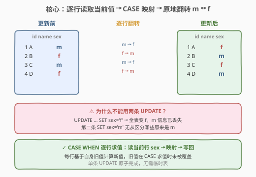
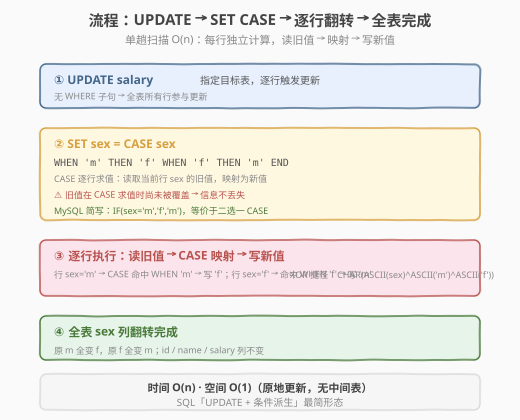
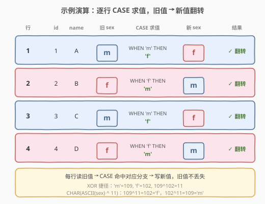

# LeetCode 变更性别 题解

## 1. 题目概述

- **标题 / 题号**：变更性别（#627，easy）
- **链接**：https://leetcode.cn/problems/swap-salary/
- **难度**：简单
- **标签**：SQL、UPDATE、CASE WHEN、IF、位运算、ASCII

**题意**：给定 `salary` 表，每行存放一个员工的 `id`、`name`、`sex`（取值 `'m'` 或 `'f'`）、`salary`。编写**单条 UPDATE 语句**，将所有 `'m'` 改成 `'f'`、`'f'` 改成 `'m'`（即翻转 `sex` 列），不使用任何临时表或中间变量。

**表结构**：

```text
Table: salary
+-------------+---------+
| Column Name | Type    |
+-------------+---------+
| id          | int     |  ← 主键
| name        | varchar |
| sex         | ENUM    |  ← 取值 'm' / 'f'
| salary      | int     |
+-------------+---------+
```

> 💡 **关键约束**：`id` 为 `salary` 表的主键。`sex` 为 ENUM 类型，只有 `'m'`（male）和 `'f'`（female）两个取值。题目要求用**单条 UPDATE** 翻转所有行的 `sex`——难点不在写法，而在于理解「为什么不能拆成两条 UPDATE」以及「CASE 何时求值」。

**示例 1**：

```text
输入：
salary 表:
+----+------+-----+--------+
| id | name | sex | salary |
+----+------+-----+--------+
| 1  | A    | m   | 2500   |
| 2  | B    | f   | 1500   |
| 3  | C    | m   | 5500   |
| 4  | D    | f   | 500    |
+----+------+-----+--------+

输出：
+----+------+-----+--------+
| id | name | sex | salary |
+----+------+-----+--------+
| 1  | A    | f   | 2500   |
| 2  | B    | m   | 1500   |
| 3  | C    | f   | 5500   |
| 4  | D    | m   | 500    |
+----+------+-----+--------+
```

**解释**：每行的 `sex` 列被翻转——`'m'` 变 `'f'`、`'f'` 变 `'m'`，其余三列（`id`、`name`、`salary`）保持不变。

**约束**：

- `id` 为 `salary` 表的主键
- `sex` 列的值保证为 `'m'` 或 `'f'`
- 必须用单条 `UPDATE` 语句，不得使用临时表

> 💡 **核心考点**：在 `UPDATE` 中用 `CASE WHEN` / `IF` 做**条件派生赋值**——把「读旧值 → 映射 → 写新值」压缩进单条语句，靠的是 CASE 在**每行求值时读取的是尚未被覆盖的旧值**这一语义保证。与 [610. 判断三角形](../0601-0700/610_判断三角形.md) 的 `CASE WHEN` 条件派生列共享同一套模式，只是从 `SELECT` 的「投影派生列」变成了 `UPDATE` 的「原地修改列」。

## 2. 解题思路

### 2.1 暴力思路：两条 UPDATE 顺序执行

最直觉的过程式思路是分两步：先把所有 `'m'` 改成 `'f'`，再把所有 `'f'` 改成 `'m'`：

```sql
UPDATE salary SET sex = 'f' WHERE sex = 'm';   -- 步骤①
UPDATE salary SET sex = 'm' WHERE sex = 'f';   -- 步骤②
```

> ⚠️ **这条写法是错的**：步骤①把所有 `'m'` 行的 `sex` 改成了 `'f'`，执行完后**全表的 `sex` 都变成了 `'f'`**（原来就是 `'f'` 的没动，原来是 `'m'` 的也变 `'f'`）。步骤②再 `WHERE sex='f'` 时，会把**所有行**都改成 `'m'`——原来真正的 `'f'` 行和刚被改成的 `'f'` 行无法区分。最终全表都是 `'m'`，翻转失败。

**根本原因**：第一条 `UPDATE` 执行后，旧值 `'m'` 的信息已经从表里**物理消失**，第二条 `UPDATE` 读到的是被污染后的数据。这是「先读后写、分两步」的通病——**写操作破坏了后续读操作所需的信息**。

### 2.2 核心观察：CASE 逐行求值，旧值不被提前覆盖



**关键洞察**：`UPDATE ... SET sex = CASE sex WHEN 'm' THEN 'f' WHEN 'f' THEN 'm' END` 中，`CASE sex` 对**每一行**求值——求值时读取的是该行**当前的 `sex` 旧值**（尚未被本条 `UPDATE` 覆盖）。求出结果 `'f'` 或 `'m'` 后，再写回该行的 `sex` 列。

- 行 `sex='m'`：`CASE` 命中 `WHEN 'm'` → 求值 `'f'` → 写回 `'f'`
- 行 `sex='f'`：`CASE` 命中 `WHEN 'f'` → 求值 `'m'` → 写回 `'m'`

因为「读旧值 → 算新值 → 写新值」在**同一行的同一次更新中原子完成**，旧值在被覆盖前已被读取并用于计算新值——信息不丢失。这与 2.1 的两条 `UPDATE` 本质区别在于：**单条 `UPDATE` 的 `SET` 右侧表达式基于行旧值求值，不存在「先写后读」的污染**。

$$\text{new\_sex} = \begin{cases} \text{'f'} & \text{if } \text{old\_sex} = \text{'m'} \\ \text{'m'} & \text{if } \text{old\_sex} = \text{'f'} \end{cases}$$

> 💡 **SQL 标准语义**：`UPDATE` 语句对每一行计算 `SET` 子句右侧表达式时，使用的是该行**更新前**的列值。这是 SQL 标准保证的——并非所有数据库都按「逐行」物理执行（可能批量优化），但**可观察语义**等价于「逐行读旧值、算新值、写回」。因此单条 `UPDATE` + `CASE` 天然安全，无需临时表。

### 2.3 算法流程图



| 步骤 | 子句 | 作用 |
|------|------|------|
| ① | `UPDATE salary` | 指定目标表，全表所有行参与更新（无 `WHERE`） |
| ② | `SET sex = CASE sex WHEN 'm' THEN 'f' WHEN 'f' THEN 'm' END` | 逐行读旧值 → CASE 映射 → 写新值 |
| ③ | 逐行执行 | `sex='m'` → `'f'`；`sex='f'` → `'m'`，旧值在求值时未被覆盖 |
| ④ | 全表 `sex` 列翻转完成 | `id`/`name`/`salary` 列不变 |

> 💡 **执行语义**：`UPDATE` 无 `WHERE` 子句 → 全表扫描；每行计算 `SET` 右侧 `CASE` 表达式（读旧值）→ 写回新值。全程无聚合、无连接、无排序，是 SQL「`UPDATE` + 条件派生赋值」的最简形态。

### 2.4 示例演算

以示例四行为例，逐行展开 `CASE` 的求值过程：



| 行 | id | name | 旧 sex | CASE 求值 | 新 sex | 结果 |
|----|----|------|--------|-----------|--------|------|
| 1 | 1 | A | m | `WHEN 'm' THEN 'f'` | f | ✓ 翻转 |
| 2 | 2 | B | f | `WHEN 'f' THEN 'm'` | m | ✓ 翻转 |
| 3 | 3 | C | m | `WHEN 'm' THEN 'f'` | f | ✓ 翻转 |
| 4 | 4 | D | f | `WHEN 'f' THEN 'm'` | m | ✓ 翻转 |

> 💡 **逐行独立性**：每行的 `CASE` 求值只依赖该行自己的 `sex` 旧值，行与行之间互不影响。即使数据库以批量方式物理执行，可观察语义等价于「逐行读旧值 → 映射 → 写新值」。`id`/`name`/`salary` 三列未被 `SET` 选中，原样保留。

## 3. 参考代码

### SQL（解法 A：CASE WHEN，推荐）

```sql
UPDATE salary
SET sex = CASE sex
    WHEN 'm' THEN 'f'
    WHEN 'f' THEN 'm'
END;
```

> 💡 **写法要点**：
> - `CASE sex` 是**简单 CASE**（搜索值型）——拿 `sex` 的值依次匹配 `WHEN` 后的字面量，命中即返回 `THEN` 值。
> - 两个 `WHEN` 覆盖了 ENUM 的全部取值 `'m'`/`'f'`，无需 `ELSE` 兜底（若有脏数据 `NULL` 或其它值，`CASE` 返回 `NULL`，`sex` 被置空——生产环境可加 `ELSE sex` 保护）。
> - `CASE` 是 SQL 标准语法，跨数据库通用；语义最接近「读旧值 → 映射 → 写新值」的自然描述。

### SQL（解法 B：MySQL IF 简写）

```sql
UPDATE salary
SET sex = IF(sex = 'm', 'f', 'm');
```

> 💡 **IF vs CASE**：`IF(cond, a, b)` 是 MySQL 专有函数，等价于 `CASE WHEN cond THEN a ELSE b END`。本题只有两个取值，`IF(sex='m','f','m')` 一行搞定——`sex='m'` 返回 `'f'`，否则（即 `'f'`）返回 `'m'`。写法最短但不跨库（PostgreSQL / SQL Server 无 `IF`）。与 [610 解法 B](../0601-0700/610_判断三角形.md) 的 `IF` 简写同源。

### SQL（解法 C：ASCII XOR 捷径）

```sql
UPDATE salary
SET sex = CHAR(ASCII(sex) ^ ASCII('m') ^ ASCII('f'));
```

> 💡 **位运算技巧**：`'m'` 的 ASCII 码是 109，`'f'` 是 102，$109 \oplus 102 = 11$。对任意 `sex`：
> - 若 `sex='m'`（109）：$109 \oplus 109 \oplus 102 = 0 \oplus 102 = 102 = $ `'f'`
> - 若 `sex='f'`（102）：$102 \oplus 109 \oplus 102 = 109 \oplus 0 = 109 = $ `'m'`
>
> 即 `CHAR(ASCII(sex) ^ 11)` 等价翻转。等价写法 `CHAR(ASCII(sex) ^ ASCII('m') ^ ASCII('f'))` 更自解释。**趣味性高但可读性差**——面试当作扩展知识展示即可，生产代码优先 `CASE`。该技巧依赖「两值 XOR 异或自身为 0」的性质：$a \oplus a = 0$，故 $a \oplus a \oplus b = b$。

### Python（pandas）

```python
import pandas as pd

def swap_salary(salary: pd.DataFrame) -> pd.DataFrame:
    salary['sex'] = salary['sex'].map({'m': 'f', 'f': 'm'})
    return salary
```

> 💡 **pandas 对照**：`.map({'m':'f','f':'m'})` 一次性把整列按字典映射翻转——等价于 `CASE sex WHEN 'm' THEN 'f' WHEN 'f' THEN 'm' END`。pandas 的向量化 `map` 基于「读旧列 → 映射 → 赋回新列」，与单条 `UPDATE` 的语义一致：右侧 `salary['sex'].map(...)` 求值时读的是旧列，赋值 `salary['sex'] = ...` 才覆盖，不存在 2.1 的污染问题。

## 4. 复杂度分析

| 维度 | 复杂度 | 说明 |
|------|--------|------|
| **时间** | $O(n)$ | $n$ = `salary` 行数。全表扫描，每行做一次 `CASE` 求值（解法 C 多几次 ASCII/XOR 运算，常数更大），与行数成正比，无排序无聚合 |
| **空间** | $O(1)$ | 原地更新，无临时表、无中间结果集；`UPDATE` 直接在表上改写 `sex` 列 |
| **影响行数** | $n$ | 无 `WHERE` → 全表所有行被更新 |

> ⚠️ 本题是 SQL「`UPDATE` + 条件派生赋值」的最简形态——单趟全表扫描 $O(n)$，原地更新 $O(1)$ 空间。瓶颈只在物理写回 $n$ 行。面试中说明「单条 UPDATE 逐行 CASE 求值，读旧值写新值，无临时表」即可。

## 5. 扩展

### 5.1 为什么两条 UPDATE 会失败

2.1 的两条 `UPDATE` 写法失败的根因是**信息丢失**：第一条 `UPDATE salary SET sex='f' WHERE sex='m'` 执行后，所有 `'m'` 行的 `sex` 被改写成 `'f'`，表里再也找不到「哪些行原来是 `'m'`」的痕迹。第二条 `WHERE sex='f'` 会命中**所有行**（原 `'f'` + 刚改成的 `'f]'`），全改成 `'m'`，翻转失败。

| 阶段 | sex='m' 的行 | sex='f' 的行 | 可区分？ |
|------|-------------|-------------|----------|
| 初始 | `m` | `f` | ✓ |
| 第①条后 | `f`（被改） | `f`（未动） | ✗ 全是 `f` |
| 第②条后 | `m`（被改） | `m`（被改） | ✗ 全是 `m` |

> 💡 **通病**：任何「分步读写」的方案都会遇到「前一步的写破坏后一步的读所需信息」。解决思路有三：① 用单条 `UPDATE` + `CASE`（本题推荐）；② 引入临时列/临时表保存旧值；③ 用事务 + 中间标记值（如先 `'m'→'x'`，再 `'f'→'m'`，再 `'x'→'f'`）。单条 `CASE` 最简洁，依赖 SQL 标准的「SET 右侧基于行旧值求值」语义。

### 5.2 简单 CASE vs 搜索 CASE

本题用的是**简单 CASE**（`CASE sex WHEN 'm' THEN ...`），等价的**搜索 CASE** 写法：

```sql
-- 简单 CASE（推荐，更简洁）
UPDATE salary SET sex = CASE sex WHEN 'm' THEN 'f' WHEN 'f' THEN 'm' END;

-- 搜索 CASE（等价，WHEN 后跟布尔表达式）
UPDATE salary SET sex = CASE WHEN sex = 'm' THEN 'f' WHEN sex = 'f' THEN 'm' END;
```

> 💡 **区别**：简单 CASE 拿一个表达式 `sex` 依次与字面量做 `=` 比较；搜索 CASE 每个 `WHEN` 后是独立的布尔表达式（可用 `>`、`LIKE`、`IN` 等）。本题比较的是相等关系，两者等价；若条件是非相等比较（如 `WHEN salary > 5000`），只能用搜索 CASE。详见 [610. 判断三角形](../0601-0700/610_判断三角形.md) 的 `CASE WHEN x+y>z ...`（搜索型）与本题 `CASE sex WHEN 'm' ...`（简单型）的对照。

### 5.3 XOR 捷径的数学原理

解法 C 的 `CHAR(ASCII(sex) ^ ASCII('m') ^ ASCII('f'))` 依赖 XOR 的三条性质：

1. **自反性**：$a \oplus a = 0$
2. **与 0 恒等**：$a \oplus 0 = a$
3. **交换结合**：$a \oplus b \oplus c$ 顺序无关

设 $M = \text{ASCII}('m') = 109$，$F = \text{ASCII}('f') = 102$，$K = M \oplus F = 11$：

- 输入 `'m'`（109）：$109 \oplus M \oplus F = 109 \oplus 109 \oplus 102 = 0 \oplus 102 = 102 = $ `'f'`
- 输入 `'f'`（102）：$102 \oplus M \oplus F = 102 \oplus 109 \oplus 102 = 109 \oplus 0 = 109 = $ `'m'`

推广：对任意两个值 $a, b$，`x ^ a ^ b` 能在 $a \leftrightarrow b$ 间翻转——因为 `a ^ a ^ b = b`，`b ^ a ^ b = a`。这是「无分支双值翻转」的通用位运算技巧。

### 5.4 NULL 与脏数据处理

本题 `sex` 为 ENUM 且保证取值 `'m'`/`'f'`，无 NULL。若生产环境 `sex` 可能为 `NULL` 或其它值：

- **解法 A/B**：`CASE sex WHEN 'm' THEN 'f' WHEN 'f' THEN 'm' END` 对 `NULL` 不命中任何 `WHEN` → 返回 `NULL` → `sex` 被置空（`IF(sex='m','f','m')` 同理，`NULL='m'` 为 `UNKNOWN` 走 `ELSE 'm'`，把 `NULL` 误改成 `'m'`）。防护：加 `ELSE sex` 保留原值。
- **解法 C**：`ASCII(NULL)` 返回 `NULL`，`NULL ^ x` 为 `NULL`，`CHAR(NULL)` 为 `NULL` → `sex` 被置空。

```sql
-- 防护写法：ELSE sex 保留非 m/f 的值
UPDATE salary SET sex = CASE sex WHEN 'm' THEN 'f' WHEN 'f' THEN 'm' ELSE sex END;
```

## 6. 面试要点

1. **为什么不能拆成两条 UPDATE？**

   - 第一条 `SET sex='f' WHERE sex='m'` 把所有 `'m'` 行改成 `'f'`，执行后全表 `sex` 都是 `'f'`，旧值 `'m'` 的信息从表中物理消失。第二条 `WHERE sex='f'` 命中所有行，全改成 `'m'`，翻转失败。根因是「前一步的写破坏了后一步的读所需信息」——单条 `UPDATE` + `CASE` 把「读旧值 → 映射 → 写新值」压缩进同一行的同一次更新，旧值在 `CASE` 求值时尚未被覆盖，信息不丢失。

2. **`UPDATE ... SET sex = CASE sex WHEN ...` 的求值时机是什么？**

   - SQL 标准保证：`UPDATE` 对每行计算 `SET` 右侧表达式时，使用的是该行**更新前**的列值。即 `CASE sex` 读取的是旧 `sex`，求出 `'f'`/`'m'` 后再写回。即使数据库物理上批量执行，可观察语义等价于「逐行读旧值、算新值、写回」——这是单条 `UPDATE` 天然安全的语义基础。

3. **`CASE` 和 `IF` 有什么区别？**

   - `IF(cond, a, b)` 是 MySQL 专有函数，只支持单一条件二选一；`CASE WHEN` 是 SQL 标准，支持多个 `WHEN` 分支，跨库通用。本题只有 `'m'`/`'f'` 两个取值，`IF(sex='m','f','m')` 与 `CASE sex WHEN 'm' THEN 'f' WHEN 'f' THEN 'm' END` 等价。多分支分类（如三值翻转）只能用 `CASE`。与 [610](../0601-0700/610_判断三角形.md) 的 `IF` vs `CASE` 对照完全同源。

4. **XOR 捷迹 `CHAR(ASCII(sex) ^ ASCII('m') ^ ASCII('f'))` 的原理？**

   - 依赖 XOR 的自反性 $a \oplus a = 0$：设 $K = \text{ASCII}('m') \oplus \text{ASCII}('f') = 109 \oplus 102 = 11$。对输入 `'m'`（109）：$109 \oplus 109 \oplus 102 = 102 = $ `'f'`；对输入 `'f'`（102）：$102 \oplus 109 \oplus 102 = 109 = $ `'m'`。即 `x ^ a ^ b` 在 $a \leftrightarrow b$ 间翻转。趣味性高但可读性差，生产代码优先 `CASE`。

5. **如果 `sex` 列有 `NULL` 怎么办？**

   - `CASE sex WHEN 'm' THEN 'f' WHEN 'f' THEN 'm' END` 对 `NULL` 不命中任何 `WHEN`，返回 `NULL`，`sex` 被置空。防护：加 `ELSE sex` 保留原值——`CASE sex WHEN 'm' THEN 'f' WHEN 'f' THEN 'm' ELSE sex END`。`IF(sex='m','f','m')` 更危险：`NULL='m'` 为 `UNKNOWN` 走 `ELSE`，把 `NULL` 误改成 `'m'`。本题 ENUM 保证无 NULL，但面试须主动提及。

> 💡 **一句话总结**：627 是 `CASE WHEN` 条件派生在 `UPDATE` 场景的应用——单条语句「读旧值 → CASE 映射 → 写新值」原子完成，靠 SQL 标准的「SET 右侧基于行旧值求值」语义避免信息丢失。与 610 的 `SELECT` 派生列共享同一套 `CASE` 模式，只是从「投影」变成「原地修改」。

## 同类练习题

| # | 题目 | 与本题的关联 |
|---|------|-------------|
| 610 | [判断三角形](../0601-0700/610_判断三角形.md) | `CASE WHEN` 条件派生列的 `SELECT` 版——`CASE WHEN x+y>z ... THEN 'Yes' ELSE 'No' END`，与 627 的 `UPDATE` 派生赋值共享同一套 `CASE` 模式，对照理解「SELECT 投影派生列」与「UPDATE 原地修改列」的差异 |
| 608 | [树节点](https://leetcode.cn/problems/tree-node/) | `CASE WHEN` 多分支分类——按 `p_id` 是否为空、是否有子节点判 Root / Inner / Leaf，对照 627 的双分支二选一理解 `CASE` 的多分支用法 |
| 196 | [删除重复电子邮箱](https://leetcode.cn/problems/delete-duplicate-emails/) | `DELETE` + 自连接——同属 `UPDATE`/`DELETE` 数据修改语句家族，对照 627 理解「行级操作」的不同形态（627 改值，196 删行） |
| 620 | [有趣的电影](../0601-0700/620_有趣的电影.md) | `WHERE` 条件筛选——SQL 基础查询，对照 627 理解「读时筛选 `WHERE`」与「写时派生 `SET CASE`」的区别 |
