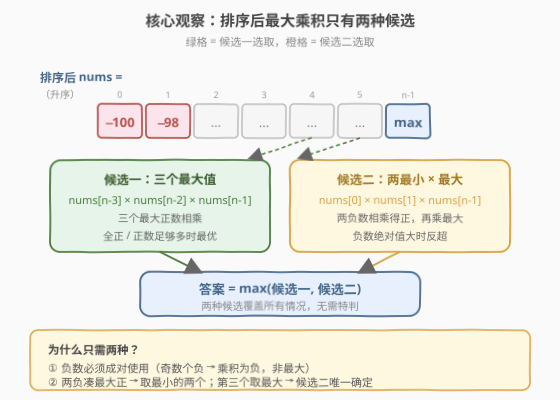
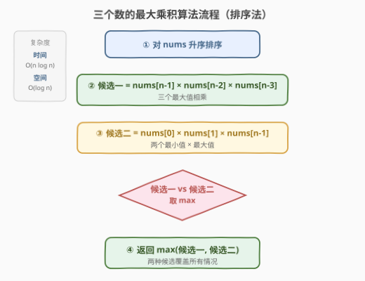

# LeetCode 三个数的最大乘积 题解

## 1. 题目概述

- **标题 / 题号**：三个数的最大乘积（#628，easy）
- **链接**：https://leetcode.cn/problems/maximum-product-of-three-numbers/
- **难度**：简单
- **标签**：数组、排序、贪心、数学

**题意**：给定一个整型数组 `nums`，在数组中找出由三个数组成的**最大**乘积，并返回这个最大乘积。

**示例 1**：

```text
输入：nums = [1,2,3]
输出：6
解释：1 × 2 × 3 = 6
```

**示例 2**：

```text
输入：nums = [1,2,3,4]
输出：24
解释：2 × 3 × 4 = 24（取最大的三个数）
```

**示例 3**：

```text
输入：nums = [-1,-2,-3]
输出：-6
解释：(-1) × (-2) × (-3) = -6（全为负数，取绝对值最小的三个）
```

**约束**：

- `3 <= nums.length <= 10^4`
- `-1000 <= nums[i] <= 1000`

> 💡 这是一道经典的「**负数干扰**」题。看似只需取三个最大值相乘，但负数的存在会让「两个最小负数相乘得正」反超。核心是意识到最大乘积只可能来自**两种候选**之一，取二者最大即可。它与 [152. 乘积最大子数组](../0101-0200/152_乘积最大子数组.md) 同属「负数翻转最值」家族，但本题只需选三个数，无需 DP。

## 2. 解题思路

### 2.1 暴力思路：三重循环枚举

最直觉的做法：三重循环枚举所有 `(i, j, k)` 组合，计算每组的乘积，维护最大值。

```text
ans = -∞
for i in 0..n:
    for j in i+1..n:
        for k in j+1..n:
            ans = max(ans, nums[i] * nums[j] * nums[k])
```

时间复杂度 $O(n^3)$，`n=10^4` 时约 $10^{12}$ 次运算，**超时**。

> ⚠️ 暴力法的瓶颈在于三重循环。破局思路：**先排序**，利用升序数组的单调性，把「三个数的最优组合」压缩成有限几种候选——这是从枚举到贪心的关键跳跃。

### 2.2 核心观察：排序后只需比较两种候选

**关键转换**：先对数组**升序排序**。排序后，最大乘积只可能来自以下两种组合之一：



**候选一**：`nums[n-1] × nums[n-2] × nums[n-3]`（最大的三个数）

- 适用于「全正数」或「正数足够多」的情况。
- 三个最大正数相乘，自然最大。

**候选二**：`nums[0] × nums[1] × nums[n-1]`（最小的两个数 × 最大的数）

- 适用于「存在负数」的情况。
- `nums[0]`、`nums[1]` 是最小的两个数（可能是最大的两个负数，绝对值最大）。两个负数相乘得正，再乘最大正数，可能反超候选一。

**答案** = $\max(\text{候选一}, \text{候选二})$。

> 💡 **为什么只需这两种候选？** 排序后，乘积要最大，要么「三个正数尽量大」（候选一），要么「两个负数凑正再乘最大正数」（候选二）。其他组合都不可能更优：
> - 若要用负数，必须**成对使用**（奇数个负数乘积为负，不可能是最大值，除非全为负数——此时候选一取绝对值最小的三个，恰好也是最优）。
> - 两个负数要乘出最大的正，必取**最小的两个**（绝对值最大）。
> - 第三个数要尽量大，必取**最大的数** `nums[n-1]`。
> - 所以涉及负数的最优组合唯一确定为 `nums[0] × nums[1] × nums[n-1]`，无需枚举其他。

> ⚠️ **全负数的边界**：若数组全为负数（如 `[-4,-3,-2,-1]`），候选一 `(-3)×(-2)×(-1) = -6`（取最接近 0 的三个），候选二 `(-4)×(-3)×(-1) = -12`。`max(-6, -12) = -6` 正确——全负时三个最大值（绝对值最小）乘积最大。两种候选的 `max` 天然覆盖此情况，无需特判。

### 2.3 算法流程图



**完整步骤**：

1. **排序**：`nums` 升序排序，$O(n \log n)$
2. **计算候选一**：`cand1 = nums[n-1] * nums[n-2] * nums[n-3]`
3. **计算候选二**：`cand2 = nums[0] * nums[1] * nums[n-1]`
4. **返回** `max(cand1, cand2)`

### 2.4 示例演算

以 `nums = [-100, -98, 1, 2, 3]`（已排序）为例，看候选二如何反超：

![示例演算：[-100,-98,1,2,3] 两种候选对比](../images/maxprod3_walkthrough.svg)

| 候选 | 选取下标 | 选取数值 | 乘积 | 判定 |
|------|----------|----------|------|------|
| 候选一 | `[n-3, n-2, n-1]` = `[2, 3, 4]` | `1, 2, 3` | `1 × 2 × 3 = 6` | 三正数 |
| 候选二 | `[0, 1, n-1]` = `[0, 1, 4]` | `-100, -98, 3` | `(-100) × (-98) × 3 = 29400` | 两负凑正 ✓ |

**结果** `max(6, 29400) = 29400`，候选二反超。

再以 `nums = [1, 2, 3, 4]`（已排序）为例：

| 候选 | 选取下标 | 选取数值 | 乘积 | 判定 |
|------|----------|----------|------|------|
| 候选一 | `[1, 2, 3]` | `2, 3, 4` | `2 × 3 × 4 = 24` | 三最大 ✓ |
| 候选二 | `[0, 1, 3]` | `1, 2, 4` | `1 × 2 × 4 = 8` | 无负数，较小 |

**结果** `max(24, 8) = 24`，候选一胜出。

> 💡 **规律**：当存在「两个绝对值很大的负数」时，候选二反超；否则候选一就是答案。两种候选取 `max` 即可统一处理，无需分支判断负数个数。

## 3. 参考代码

### C++

```cpp
// 三个数的最大乘积.cpp —— 排序 + 两种候选取最大
// 编译: g++ -O2 -std=c++17 三个数的最大乘积.cpp -o maxprod3
#include <vector>
#include <algorithm>
using namespace std;

class Solution {
  public:
    int maximumProduct(vector<int>& nums) {
        sort(nums.begin(), nums.end());                 // ① 升序排序
        int n = nums.size();
        int cand1 = nums[n - 1] * nums[n - 2] * nums[n - 3]; // ② 三个最大
        int cand2 = nums[0] * nums[1] * nums[n - 1];         // ③ 两个最小 × 最大
        return max(cand1, cand2);                       // ④ 取较大
    }
};
```

### Python

```python
class Solution:
    def maximumProduct(self, nums: list[int]) -> int:
        nums.sort()                                        # ① 升序排序
        n = len(nums)
        cand1 = nums[n - 1] * nums[n - 2] * nums[n - 3]   # ② 三个最大
        cand2 = nums[0] * nums[1] * nums[n - 1]           # ③ 两个最小 × 最大
        return max(cand1, cand2)                           # ④ 取较大
```

> 💡 **一行写法**（Python）：`return max(nums[-1]*nums[-2]*nums[-3], nums[0]*nums[1]*nums[-1])`，利用负索引更简洁。但为可读性建议展开写。

## 4. 复杂度分析

| 维度 | 复杂度 | 说明 |
|------|--------|------|
| **时间复杂度** | $O(n \log n)$ | 排序主导，后续两次乘法 $O(1)$ |
| **空间复杂度** | $O(\log n)$ | 排序的栈空间（C++ `sort` 为快排变种） |
| **最优时间** | $O(n)$ | 单趟扫描找 5 个关键值，见第 5 节 |

> ⚠️ 排序并非必需。只需求出「最大的三个数」和「最小的两个数」——这 5 个值可在 $O(n)$ 单趟扫描内拿到，省掉排序的 $\log n$ 因子。见下节。

## 5. 扩展：线性扫描法（O(n) 最优解）

排序法虽简单，但做了「全排序」的额外工作。实际上只需 5 个值：**最大的三个**（`max1 ≥ max2 ≥ max3`）和**最小的两个**（`min1 ≤ min2`）。单趟扫描即可维护：

```python
class Solution:
    def maximumProduct(self, nums: list[int]) -> int:
        # 最大的三个：max1 >= max2 >= max3
        max1 = max2 = max3 = float('-inf')
        # 最小的两个：min1 <= min2
        min1 = min2 = float('inf')

        for x in nums:
            # 维护 top-3 最大
            if x > max1:
                max3, max2, max1 = max2, max1, x
            elif x > max2:
                max3, max2 = max2, x
            elif x > max3:
                max3 = x
            # 维护 top-2 最小
            if x < min1:
                min2, min1 = min1, x
            elif x < min2:
                min2 = x

        return max(max1 * max2 * max3, min1 * min2 * max1)
```

```cpp
class Solution {
  public:
    int maximumProduct(vector<int>& nums) {
        int max1 = INT_MIN, max2 = INT_MIN, max3 = INT_MIN;
        int min1 = INT_MAX, min2 = INT_MAX;
        for (int x : nums) {
            if (x > max1) { max3 = max2; max2 = max1; max1 = x; }
            else if (x > max2) { max3 = max2; max2 = x; }
            else if (x > max3) { max3 = x; }
            if (x < min1) { min2 = min1; min1 = x; }
            else if (x < min2) { min2 = x; }
        }
        return max(max1 * max2 * max3, min1 * min2 * max1);
    }
};
```

**维护技巧**：插入新值到「top-3 最大」时，从大到小依次比较，命中即级联下移（`max3,max2,max1 = max2,max1,x`）。这与 [414. 第三大的数](https://leetcode.cn/problems/third-maximum-number/) 的三变量维护同构。

| 解法 | 时间 | 空间 | 思路 |
|------|------|------|------|
| 三重循环 | $O(n^3)$ | $O(1)$ | 暴力枚举所有三元组 |
| **排序** | $O(n \log n)$ | $O(\log n)$ | 排序后取两种候选 |
| **线性扫描** | $O(n)$ | $O(1)$ | 单趟维护 top-3 最大 + top-2 最小 |

> 💡 **面试建议**：先讲排序法 $O(n \log n)$（思路清晰、不易错），再优化为线性扫描 $O(n)$（展示「只取必要信息」的优化意识）。`n=10^4` 时两者实际差距不大，但线性扫描体现对「排序做了多余工作」的洞察，是面试加分项。

## 6. 面试要点

1. **为什么最大乘积只考虑两种候选？**

   - 乘积要最大，要么三个正数尽量大（候选一），要么两个负数凑正再乘最大正数（候选二）。
   - 负数必须**成对使用**：奇数个负数乘积为负，不可能是最大值（除非全负——此时候选一取绝对值最小的三个，恰好最优）。
   - 两个负数要乘出最大的正，必取**最小的两个**（绝对值最大）；第三个数必取**最大的数**。所以涉及负数的最优组合唯一。

2. **全负数时公式还成立吗？**

   - 成立。全负数组如 `[-4,-3,-2,-1]`，候选一 `(-3)×(-2)×(-1)=-6`（最接近 0 的三个，乘积最大），候选二 `(-4)×(-3)×(-1)=-12`。`max(-6,-12)=-6` 正确。
   - 全负时「三个最大值」=「绝对值最小的三个」，乘积是所有三元组中最大的（负得最少）。公式天然覆盖，无需特判。

3. **线性扫描法如何维护 top-3？**

   - 用三个变量 `max1 ≥ max2 ≥ max3`。新值 `x` 从 `max1` 开始比：若 `x > max1`，级联下移 `max3,max2,max1 = max2,max1,x`；否则比 `max2`；再否则比 `max3`。
   - 注意 `else if`：已插入就不重复比较下档，保证每个值只落到一档。
   - top-2 最小同理，方向相反。

4. **排序法和线性扫描法选哪个？**

   - `n=10^4` 时排序 $O(n \log n) \approx 10^4 \times 14 \approx 1.4 \times 10^5$，线性扫描 $10^4$，实际差距很小。
   - 排序法代码极简、不易错，工程上首选；线性扫描体现算法优化意识，面试讲「渐进优化」时加分。
   - 若 `n` 更大（如 $10^6$），线性扫描的常数优势才显著。

5. **和 [152. 乘积最大子数组] 有什么区别？**

   - 152 题要求**连续子数组**的最大乘积，需用 DP 同时维护当前最大/最小（负数会让最大最小互换），状态转移复杂。
   - 本题只选三个数（不要求连续），排序后两种候选取最大即可，无需 DP。
   - 两者共性：都需处理「负数翻转最值」；差异：152 是连续子结构（DP），628 是无结构选三个（贪心）。

> 💡 **一句话总结**：三个数的最大乘积是「负数干扰」的招牌题——排序后只需比较「三个最大值」与「两个最小值乘最大值」两种候选，取较大即可。负数必须成对使用的洞察把 $O(n^3)$ 枚举压成 $O(n \log n)$ 排序，再进一步用单趟扫描维护 top-3 最大 + top-2 最小优化到 $O(n)$。

## 同类练习题

| # | 题目 | 与本题的关联 |
|---|------|-------------|
| 152 | [乘积最大子数组](https://leetcode.cn/problems/maximum-product-subarray/)（[题解](../0101-0200/152_乘积最大子数组.md)） | 连续子数组最大乘积，DP 同时维护 max/min 应对负数翻转，同属「负数干扰最值」家族 |
| 414 | [第三大的数](https://leetcode.cn/problems/third-maximum-number/) | 三变量维护 top-3，与本题线性扫描法的维护逻辑同构 |
| 215 | [数组中的第K个最大元素](https://leetcode.cn/problems/kth-largest-element-in-an-array/) | Top-K 问题的母题，线性选择 / 堆 / 排序三法对照 |
| 561 | [数组拆分](https://leetcode.cn/problems/array-partition/) | 排序后按位置取最优，同为「排序 + 贪心取特定下标」的简单题 |
| 1913 | [两个数对之间的最大乘积差](https://leetcode.cn/problems/maximum-product-difference-between-two-pairs/) | 排序后取「两个最大 × 两个最小」对比，与本题「两最小 × 一最大」的负数思路一脉相承 |
